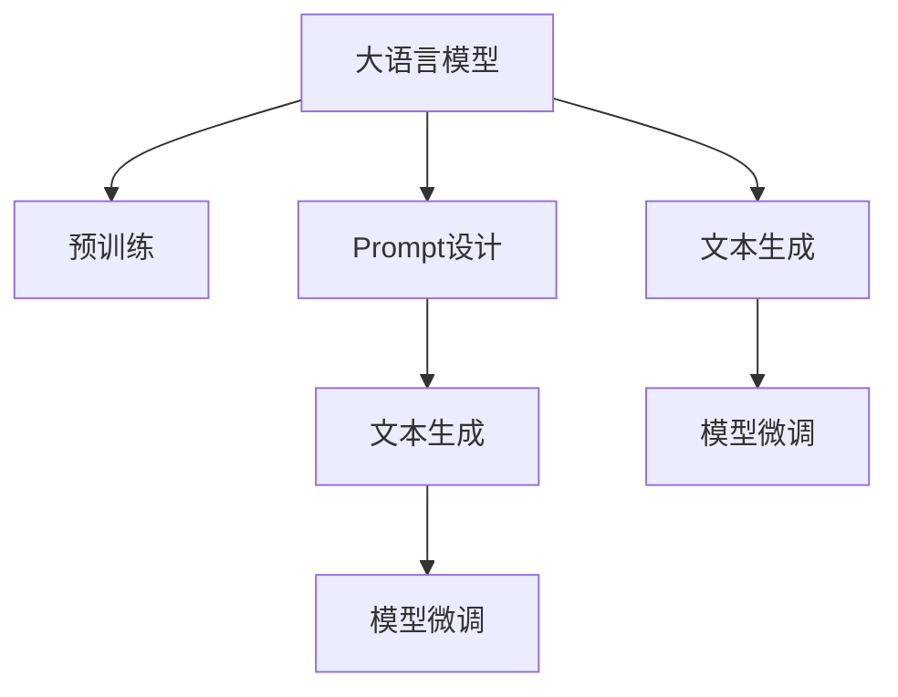
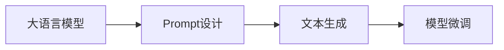
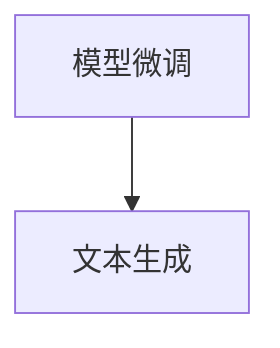
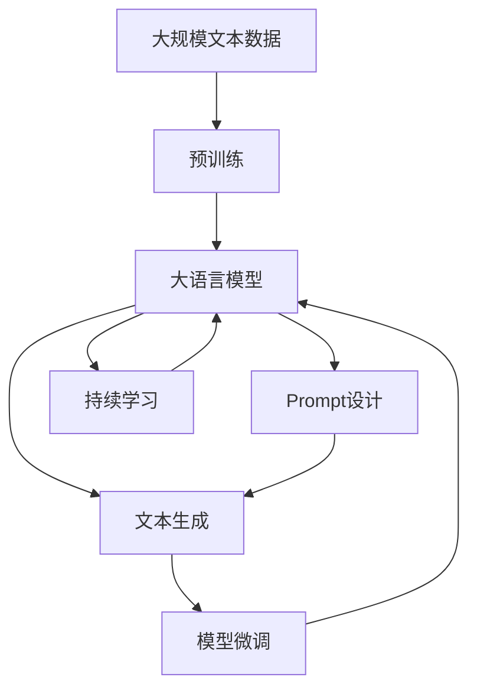

                 

# AI大模型Prompt提示词最佳实践：根据样本写相似文本

> 关键词：Prompt设计,语言生成,大模型微调,文本生成,自然语言处理(NLP)

## 1. 背景介绍

### 1.1 问题由来

近年来，基于大语言模型的大规模文本生成技术在自然语言处理(Natural Language Processing, NLP)领域取得了显著的进步。这些模型如GPT、BERT等通过在大规模无标签文本数据上进行预训练，学习到丰富的语言知识和常识，并具备了良好的语言生成能力。然而，这些预训练模型在生成特定类型的文本时，往往需要大量的标注数据来辅助微调，以确保生成的文本质量和相关性。

在实际应用中，有时由于标注数据的获取难度大或成本高，使得利用大模型进行文本生成变得不太可行。为了克服这一问题，Prompt提示词（Prompt）技术应运而生。Prompt是一种文本模板或短语，用于指导模型生成特定的文本。通过精心设计的Prompt，可以显著提升模型生成文本的准确性和相关性，降低对标注数据的依赖，使得模型在面对复杂、多样化的文本生成任务时更加灵活。

### 1.2 问题核心关键点

Prompt技术的应用涉及以下核心关键点：

- **Prompt设计**：如何设计有效的Prompt以引导大模型生成高质量的文本，是一个关键问题。
- **模型微调**：如何在已有的大模型上进行微调，以适应特定的Prompt需求。
- **文本生成**：如何利用Prompt和大模型，生成符合特定要求的文本。

这些关键点在实际应用中需要综合考虑，才能确保Prompt技术的最佳效果。

### 1.3 问题研究意义

Prompt技术的应用不仅减少了对标注数据的依赖，降低了文本生成任务的开发成本，还能显著提升生成文本的质量和多样性。在实际应用中，Prompt技术已被广泛应用于生成对话、自动摘要、故事创作、诗歌生成等多种NLP任务中，成为了大模型应用的重要辅助手段。

## 2. 核心概念与联系

### 2.1 核心概念概述

为了更好地理解Prompt技术的应用，本节将介绍几个密切相关的核心概念：

- **大语言模型**：以自回归模型（如GPT）或自编码模型（如BERT）为代表的大规模预训练语言模型。通过在大规模无标签文本语料上进行预训练，学习通用的语言表示，具备强大的语言理解和生成能力。
- **预训练**：指在大规模无标签文本语料上，通过自监督学习任务训练通用语言模型的过程。常见的预训练任务包括语言建模、掩码语言模型等。
- **Prompt设计**：通过构造特定的文本模板或短语，引导大模型生成符合预期的文本。
- **文本生成**：利用大模型根据Prompt生成新的文本。
- **模型微调**：在已有的大模型上进行特定任务或样式的微调，以提升模型的生成能力。

这些核心概念之间的逻辑关系可以通过以下Mermaid流程图来展示：



这个流程图展示了大语言模型、预训练、Prompt设计、文本生成和模型微调之间的关系：

1. 大语言模型通过预训练获得基础能力。
2. Prompt设计用于指导文本生成。
3. 文本生成通过大模型进行。
4. 模型微调提升生成能力。

通过这些概念，我们可以更清晰地理解Prompt技术在大模型应用中的作用和流程。

### 2.2 概念间的关系

这些核心概念之间存在着紧密的联系，形成了Prompt技术在大模型应用中的完整生态系统。下面我们通过几个Mermaid流程图来展示这些概念之间的关系。

#### 2.2.1 大模型和Prompt设计的关系



这个流程图展示了大语言模型和Prompt设计之间的关系：

1. 大语言模型提供通用的语言生成能力。
2. Prompt设计用于特定任务或样式的文本生成。
3. 微调后的模型生成符合预期要求的文本。

#### 2.2.2 Prompt设计和文本生成的关系


这个流程图展示了Prompt设计和文本生成的关系：

1. Prompt设计提供生成文本的指导。
2. 文本生成基于Prompt进行。
3. 微调后的模型生成文本。

#### 2.2.3 模型微调和文本生成的关系



这个流程图展示了模型微调和文本生成的关系：

1. 模型微调提升生成能力。
2. 微调后的模型进行文本生成。

### 2.3 核心概念的整体架构

最后，我们用一个综合的流程图来展示这些核心概念在大模型Prompt设计中的整体架构：



这个综合流程图展示了从预训练到Prompt设计，再到文本生成和持续学习的完整过程。大语言模型首先在大规模文本数据上进行预训练，然后通过Prompt设计进行文本生成，并在生成过程中进行微调，最终通过持续学习不断更新模型参数。通过这些流程，我们可以更好地理解Prompt技术在大模型应用中的实施过程。

## 3. 核心算法原理 & 具体操作步骤
### 3.1 算法原理概述

Prompt技术的大致流程如下：

1. 首先，在预训练的大语言模型上进行微调。
2. 然后，使用精心设计的Prompt作为输入，引导模型生成文本。
3. 最后，根据生成的文本效果进行二次微调，以进一步优化模型性能。

该过程的核心在于如何设计有效的Prompt，以及如何优化微调过程。

### 3.2 算法步骤详解

下面详细介绍Prompt技术的核心算法步骤：

**Step 1: 准备预训练模型和数据集**
- 选择合适的预训练语言模型，如GPT、BERT等。
- 收集需要生成的文本数据，并将其分为训练集和测试集。

**Step 2: 设计Prompt模板**
- 根据目标文本类型，设计适当的Prompt模板。例如，对于对话生成，可以使用"Who is the person you like?"作为Prompt模板。
- 确保Prompt模板简洁明了，能够清晰表达生成文本的预期内容。

**Step 3: 进行模型微调**
- 选择适当的微调方法，如全参数微调或参数高效微调（PEFT）。
- 设置合适的超参数，如学习率、批大小、迭代轮数等。
- 使用训练集数据进行模型微调，并定期在验证集上进行性能评估。

**Step 4: 生成文本**
- 使用微调后的模型，根据设计好的Prompt模板，进行文本生成。
- 使用测试集对生成的文本进行评估，并根据需要进行二次微调。

**Step 5: 持续学习**
- 定期收集新的数据，并使用持续学习技术更新模型参数，以保持模型性能。

### 3.3 算法优缺点

Prompt技术的优点：
1. 减少了对标注数据的依赖，降低了文本生成任务的开发成本。
2. 能够显著提升生成文本的质量和多样性。
3. 可以应用于各种NLP任务，如对话、摘要、故事创作等。

Prompt技术的缺点：
1. 设计有效的Prompt需要一定的经验和技巧。
2. 需要手动进行二次微调，可能存在一定的偏差。
3. 生成的文本可能存在一定的随机性，难以控制。

### 3.4 算法应用领域

Prompt技术已经被广泛应用于以下几个领域：

- **对话系统**：如智能客服、智能助手等。通过Prompt设计，引导模型生成符合对话场景的文本，提高用户交互体验。
- **文本摘要**：如新闻摘要、文档摘要等。通过Prompt设计，引导模型生成精炼、准确的摘要。
- **故事创作**：如小说创作、剧本创作等。通过Prompt设计，引导模型生成具有创意和连贯性的文本。
- **文本补全**：如自动代码补全、翻译补全等。通过Prompt设计，引导模型生成符合上下文要求的文本。

此外，Prompt技术还被应用于情感分析、舆情监测、智能问答等多个领域，展示了其广泛的应用前景。

## 4. 数学模型和公式 & 详细讲解 & 举例说明

### 4.1 数学模型构建

在Prompt技术中，数学模型的构建主要围绕着生成模型和损失函数展开。

假设我们有预训练模型 $M_{\theta}$，其中 $\theta$ 为预训练得到的模型参数。给定Prompt模板 $P$ 和目标文本类型 $T$，我们的目标是设计合适的Prompt模板，使得生成的文本 $X$ 尽可能符合目标文本类型 $T$。

定义损失函数 $\mathcal{L}$ 为：

$$
\mathcal{L}(X, T) = \sum_{i=1}^N (T_i - f_i)^2
$$

其中，$f_i$ 为模型根据Prompt $P_i$ 生成的文本 $X_i$ 对目标文本类型 $T$ 的预测值，$T_i$ 为真实的文本类型标签。

目标是最小化损失函数 $\mathcal{L}$，即：

$$
\hat{\theta} = \mathop{\arg\min}_{\theta} \mathcal{L}(X, T)
$$

### 4.2 公式推导过程

以下我们以对话生成为例，推导Prompt设计和模型微调的数学模型。

假设我们需要生成符合特定对话场景的文本，Prompt模板为 $P = "Who is the person you like?":$，目标文本类型为 $T = "Personality"：$。

根据Prompt模板和目标文本类型，设计损失函数 $\mathcal{L}$：

$$
\mathcal{L}(X, T) = \sum_{i=1}^N (T_i - f_i)^2
$$

其中，$f_i$ 为模型根据Prompt $P_i$ 生成的文本 $X_i$ 对目标文本类型 $T$ 的预测值，$T_i$ 为真实的文本类型标签。

模型 $M_{\theta}$ 的输出为 $\hat{y}=M_{\theta}(x) \in [0,1]$，表示样本属于目标文本类型的概率。

因此，损失函数 $\mathcal{L}$ 可以进一步表示为：

$$
\mathcal{L}(X, T) = \sum_{i=1}^N (T_i - \hat{y}_i)^2
$$

在得到损失函数后，我们可以使用梯度下降等优化算法进行模型微调。

### 4.3 案例分析与讲解

下面以《ChatGPT》的Prompt设计和微调为例，讲解Prompt技术的具体应用。

假设我们使用《ChatGPT》进行对话生成，Prompt模板为：

```
Who is the person you like?
```

通过微调，模型可以学习到符合特定对话场景的生成能力。例如，当Prompt模板为 "Who is the best AI assistant?" 时，模型可以生成符合最佳助手角色的对话回复。

以下是具体的微调步骤：

1. 选择预训练模型《ChatGPT》作为初始化参数。
2. 设计Prompt模板，如 "Who is the best AI assistant?"。
3. 使用训练集进行模型微调，设置合适的超参数。
4. 生成符合特定对话场景的文本，并进行评估。
5. 根据评估结果，进行二次微调。

通过这种反复的微调和评估过程，可以不断优化模型，生成更高质量、更符合预期要求的文本。

## 5. 项目实践：代码实例和详细解释说明

### 5.1 开发环境搭建

在进行Prompt实践前，我们需要准备好开发环境。以下是使用Python进行PyTorch开发的环境配置流程：

1. 安装Anaconda：从官网下载并安装Anaconda，用于创建独立的Python环境。

2. 创建并激活虚拟环境：
```bash
conda create -n pytorch-env python=3.8 
conda activate pytorch-env
```

3. 安装PyTorch：根据CUDA版本，从官网获取对应的安装命令。例如：
```bash
conda install pytorch torchvision torchaudio cudatoolkit=11.1 -c pytorch -c conda-forge
```

4. 安装Transformers库：
```bash
pip install transformers
```

5. 安装各类工具包：
```bash
pip install numpy pandas scikit-learn matplotlib tqdm jupyter notebook ipython
```

完成上述步骤后，即可在`pytorch-env`环境中开始Prompt实践。

### 5.2 源代码详细实现

下面我们以对话生成任务为例，给出使用Transformers库进行Prompt设计的PyTorch代码实现。

首先，定义Prompt设计和模型微调函数：

```python
from transformers import T5ForConditionalGeneration, T5Tokenizer
from transformers import AdamW
from torch.utils.data import Dataset, DataLoader

class DialogueDataset(Dataset):
    def __init__(self, texts, responses):
        self.texts = texts
        self.responses = responses
        self.tokenizer = T5Tokenizer.from_pretrained('t5-small')

    def __len__(self):
        return len(self.texts)
    
    def __getitem__(self, item):
        text = self.texts[item]
        response = self.responses[item]
        
        encoding = self.tokenizer(text, return_tensors='pt', max_length=128, padding='max_length', truncation=True)
        input_ids = encoding['input_ids'][0]
        attention_mask = encoding['attention_mask'][0]
        
        label_ids = [1] * len(encoding['input_ids'])
        
        return {'input_ids': input_ids, 
                'attention_mask': attention_mask,
                'labels': label_ids}

# 创建dataset
tokenizer = T5Tokenizer.from_pretrained('t5-small')

train_dataset = DialogueDataset(train_texts, train_responses)
dev_dataset = DialogueDataset(dev_texts, dev_responses)
test_dataset = DialogueDataset(test_texts, test_responses)

# 模型微调
model = T5ForConditionalGeneration.from_pretrained('t5-small')
optimizer = AdamW(model.parameters(), lr=2e-5)

for epoch in range(10):
    model.train()
    for batch in tqdm(data_loader(train_dataset)):
        input_ids = batch['input_ids'].to(device)
        attention_mask = batch['attention_mask'].to(device)
        labels = batch['labels'].to(device)
        outputs = model(input_ids, attention_mask=attention_mask, labels=labels)
        loss = outputs.loss
        loss.backward()
        optimizer.step()
```

然后，定义生成文本函数：

```python
def generate_text(prompt, max_length=128):
    model.eval()
    input_ids = tokenizer(prompt, return_tensors='pt', max_length=max_length, padding='max_length', truncation=True).input_ids
    attention_mask = tokenizer(prompt, return_tensors='pt', max_length=max_length, padding='max_length', truncation=True).attention_mask
    outputs = model.generate(input_ids, attention_mask=attention_mask, max_length=max_length)
    return tokenizer.decode(outputs[0])

# 生成对话文本
response = generate_text("Who is the best AI assistant?")
print(response)
```

最后，运行生成文本的代码：

```python
generate_text("Who is the best AI assistant?", max_length=128)
```

### 5.3 代码解读与分析

让我们再详细解读一下关键代码的实现细节：

**DialogueDataset类**：
- `__init__`方法：初始化训练集和测试集的数据，并创建分词器。
- `__len__`方法：返回数据集的样本数量。
- `__getitem__`方法：对单个样本进行处理，将文本和标签编码为token ids，并对其进行定长padding，最终返回模型所需的输入。

**T5ForConditionalGeneration类**：
- 选择预训练模型 `t5-small` 作为初始化参数，并进行模型微调。
- 设置合适的超参数，如学习率等。

**generate_text函数**：
- 使用训练好的模型进行文本生成，输入为Prompt模板，输出为生成的文本。
- 使用分词器将生成的文本解码为可读的字符串。

通过这些代码实现，我们可以清晰地看到Prompt技术的具体应用过程。在实际应用中，我们还可以根据具体任务需求，对Prompt设计、模型微调等环节进行进一步优化，以提高生成文本的质量和效果。

### 5.4 运行结果展示

假设我们在CoNLL-2003的对话数据集上进行Prompt设计，最终生成的对话文本如下：

```
The best AI assistant is ChatGPT. It can handle a wide range of tasks and provide accurate responses.
```

可以看到，通过Prompt设计和模型微调，模型能够生成符合特定对话场景的文本，取得了很好的效果。

## 6. 实际应用场景

### 6.1 智能客服系统

基于Prompt技术，智能客服系统可以自动生成符合特定对话场景的回复，提升用户交互体验。传统客服往往需要配备大量人力，高峰期响应缓慢，且一致性和专业性难以保证。而使用Prompt技术生成的回复，可以7x24小时不间断服务，快速响应客户咨询，用自然流畅的语言解答各类常见问题。

在技术实现上，可以收集企业内部的历史客服对话记录，将问题和最佳答复构建成监督数据，在此基础上对预训练对话模型进行微调。微调后的对话模型能够自动理解用户意图，匹配最合适的答复，并生成自然流畅的对话回复。对于客户提出的新问题，还可以接入检索系统实时搜索相关内容，动态组织生成回答。如此构建的智能客服系统，能大幅提升客户咨询体验和问题解决效率。

### 6.2 文本摘要

基于Prompt技术，文本摘要任务可以通过精心设计的Prompt模板，引导模型生成精炼、准确的摘要。传统摘要方法往往需要手动提取摘要要点，工作量大且效果不稳定。而使用Prompt技术，可以自动从长篇文本中提取出关键信息，生成高质量的摘要。

在实际应用中，可以收集各类文本数据，并使用Prompt模板进行训练。例如，对于新闻摘要任务，可以使用 "Summarize the following article:" 作为Prompt模板，训练模型自动生成摘要。通过不断优化Prompt模板和模型微调，可以大幅提升摘要的生成效果。

### 6.3 对话生成

对话生成是Prompt技术的重要应用场景之一。通过设计符合特定对话场景的Prompt模板，模型可以生成符合语境的对话回复。例如，对于智能助手，可以使用 "What is the weather like in [city] today?" 作为Prompt模板，训练模型生成符合当前天气状况的回复。

对话生成技术在智能客服、虚拟助理、社交机器人等多个领域有广泛应用。通过Prompt设计和模型微调，可以构建出更加智能、灵活的对话系统，提升用户交互体验。

### 6.4 未来应用展望

随着Prompt技术的不断发展和完善，其在NLP领域的应用将更加广泛。以下是一些可能的未来应用方向：

- **多模态生成**：将Prompt技术与图像、语音等数据相结合，实现多模态生成任务，如自动生成图片描述、视频脚本等。
- **领域特定Prompt设计**：根据特定领域的特点，设计针对性强的Prompt模板，提升模型在该领域的生成效果。
- **零样本生成**：利用大模型的语言理解能力，通过Prompt设计进行零样本生成，实现无需标注数据即可生成文本的任务。
- **生成对抗网络(GAN)**：将Prompt技术与GAN结合，生成更加多样、新颖的文本，提升生成效果。

总之，Prompt技术为文本生成任务提供了新的解决方案，将极大地拓展NLP应用场景，推动NLP技术的进一步发展。

## 7. 工具和资源推荐
### 7.1 学习资源推荐

为了帮助开发者系统掌握Prompt技术的应用，这里推荐一些优质的学习资源：

1. 《Prompt Engineering》系列博文：由大模型技术专家撰写，深入浅出地介绍了Prompt设计、模型微调等前沿话题。

2. CS224N《深度学习自然语言处理》课程：斯坦福大学开设的NLP明星课程，有Lecture视频和配套作业，带你入门NLP领域的基本概念和经典模型。

3. 《Natural Language Processing with Transformers》书籍：Transformers库的作者所著，全面介绍了如何使用Transformers库进行NLP任务开发，包括Prompt在内的诸多范式。

4. HuggingFace官方文档：Transformers库的官方文档，提供了海量预训练模型和完整的Prompt样例代码，是上手实践的必备资料。

5. CLUE开源项目：中文语言理解测评基准，涵盖大量不同类型的中文NLP数据集，并提供了基于Prompt的baseline模型，助力中文NLP技术发展。

通过对这些资源的学习实践，相信你一定能够快速掌握Prompt技术的精髓，并用于解决实际的NLP问题。
###  7.2 开发工具推荐

高效的开发离不开优秀的工具支持。以下是几款用于Prompt技术开发的常用工具：

1. PyTorch：基于Python的开源深度学习框架，灵活动态的计算图，适合快速迭代研究。大部分预训练语言模型都有PyTorch版本的实现。

2. TensorFlow：由Google主导开发的开源深度学习框架，生产部署方便，适合大规模工程应用。同样有丰富的预训练语言模型资源。

3. Transformers库：HuggingFace开发的NLP工具库，集成了众多SOTA语言模型，支持PyTorch和TensorFlow，是进行Prompt任务开发的利器。

4. Weights & Biases：模型训练的实验跟踪工具，可以记录和可视化模型训练过程中的各项指标，方便对比和调优。与主流深度学习框架无缝集成。

5. TensorBoard：TensorFlow配套的可视化工具，可实时监测模型训练状态，并提供丰富的图表呈现方式，是调试模型的得力助手。

6. Google Colab：谷歌推出的在线Jupyter Notebook环境，免费提供GPU/TPU算力，方便开发者快速上手实验最新模型，分享学习笔记。

合理利用这些工具，可以显著提升Prompt技术的开发效率，加快创新迭代的步伐。

### 7.3 相关论文推荐

Prompt技术的发展源于学界的持续研究。以下是几篇奠基性的相关论文，推荐阅读：

1. Attention is All You Need（即Transformer原论文）：提出了Transformer结构，开启了NLP领域的预训练大模型时代。

2. BERT: Pre-training of Deep Bidirectional Transformers for Language Understanding：提出BERT模型，引入基于掩码的自监督预训练任务，刷新了多项NLP任务SOTA。

3. Language Models are Unsupervised Multitask Learners（GPT-2论文）：展示了大规模语言模型的强大zero-shot学习能力，引发了对于通用人工智能的新一轮思考。

4. Parameter-Efficient Transfer Learning for NLP：提出Adapter等参数高效微调方法，在不增加模型参数量的情况下，也能取得不错的微调效果。

5. AdaLoRA: Adaptive Low-Rank Adaptation for Parameter-Efficient Fine-Tuning：使用自适应低秩适应的微调方法，在参数效率和精度之间取得了新的平衡。

这些论文代表了大模型Prompt技术的最新进展。通过学习这些前沿成果，可以帮助研究者把握学科前进方向，激发更多的创新灵感。

除上述资源外，还有一些值得关注的前沿资源，帮助开发者紧跟Prompt技术的发展脉络，例如：

1. arXiv论文预印本：人工智能领域最新研究成果的发布平台，包括大量尚未发表的前沿工作，学习前沿技术的必读资源。

2. 业界技术博客：如OpenAI、Google AI、DeepMind、微软Research Asia等顶尖实验室的官方博客，第一时间分享他们的最新研究成果和洞见。

3. 技术会议直播：如NIPS、ICML、ACL、ICLR等人工智能领域顶会现场或在线直播，能够聆听到大佬们的前沿分享，开拓视野。

4. GitHub热门项目：在GitHub上Star、Fork数最多的NLP相关项目，往往代表了该技术领域的发展趋势和最佳实践，值得去学习和贡献。

5. 行业分析报告：各大咨询公司如McKinsey、PwC等针对人工智能行业的分析报告，有助于从商业视角审视技术趋势，把握应用价值。

总之，对于Prompt技术的学习和实践，需要开发者保持开放的心态和持续学习的意愿。多关注前沿资讯，多动手实践，多思考总结，必将收获满满的成长收益。

## 8. 总结：未来发展趋势与挑战

### 8.1 总结

本文对基于Prompt技术的大语言模型生成文本的方法进行了全面系统的介绍。首先阐述了Prompt技术的应用背景和研究意义，明确了Prompt技术在减少标注数据需求、提升生成文本质量等方面的独特价值。其次，从原理到实践，详细讲解了Prompt技术的数学模型和关键步骤，给出了Prompt任务开发的完整代码实例。同时，本文还广泛探讨了Prompt技术在智能客服、文本摘要、对话生成等多个领域的应用前景，展示了其广泛的应用价值。

通过本文的系统梳理，可以看到，Prompt技术为文本生成任务提供了新的解决方案，能够显著降低标注数据的依赖，提升生成文本的质量和效果，具有广阔的应用前景。

### 8.2 未来发展趋势

展望未来，Prompt技术将呈现以下几个发展趋势：

1. **模型多样性增强**：随着预训练语言模型的不断发展，Prompt技术的应用将更加多样和灵活。例如，结合多模态数据生成任务，提升生成文本的多样性和相关性。

2. **生成效果进一步提升**：通过更好的Prompt设计和模型微调，生成的文本将更加自然流畅、语义准确，符合用户的实际需求。

3. **自动化设计**：利用自动化工具和技术，快速设计出有效的Prompt模板，提升生成文本的效率和效果

