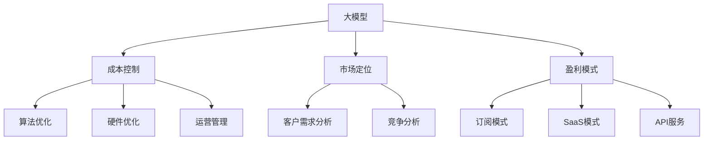

                 

# AI大模型创业：如何应对未来价格战？

## 1. 背景介绍

### 1.1 问题由来
在人工智能技术的迅猛发展下，大模型（Large Model）正逐渐成为各行各业的主要生产力工具。大模型如GPT-3、BERT等，具备强大的语言理解和生成能力，已经在自然语言处理（NLP）、计算机视觉（CV）等多个领域展现出了巨大的潜力。这些模型的出现，极大促进了AI技术的应用落地，推动了数字化转型，但同时也给市场带来了激烈的价格竞争。如何在价格战中保持优势，成为大模型创业公司亟需解决的挑战。

### 1.2 问题核心关键点
未来价格战的核心关键点主要包括：
- **技术壁垒**：如何保持模型的技术领先优势，避免同质化竞争。
- **成本控制**：如何在确保模型性能的前提下，控制成本，提高利润率。
- **市场定位**：如何精准定位目标客户群体，提供差异化服务。
- **盈利模式**：如何选择合适的盈利模式，实现可持续发展。

### 1.3 问题研究意义
研究未来价格战的应对策略，对于大模型创业公司具有重要意义：
- **提升竞争力**：通过技术创新和成本控制，提升公司在价格战中的竞争力。
- **保障盈利**：通过合理定价和盈利模式设计，确保公司健康发展。
- **市场定位**：通过精准的市场定位，拓展业务范围，提升客户满意度。
- **可持续发展**：通过长期战略规划，实现公司的可持续发展。

## 2. 核心概念与联系

### 2.1 核心概念概述
为更好地理解未来价格战的应对策略，本节将介绍几个密切相关的核心概念：

- **大模型**：以深度学习模型为基础，通过大规模数据训练，具备强大数据分析和处理能力的人工智能模型。
- **成本控制**：在保证模型性能的前提下，通过优化算法、硬件配置、运营管理等手段，降低生产和使用成本，提高利润率。
- **市场定位**：通过分析目标市场和客户需求，明确公司产品或服务的市场定位，形成差异化竞争优势。
- **盈利模式**：基于公司核心竞争力，选择适合的商业模式，实现收入最大化。

### 2.2 概念间的关系

这些核心概念之间的逻辑关系可以通过以下Mermaid流程图来展示：



这个流程图展示了大模型创业公司的核心概念及其之间的关系：

1. 大模型通过算法优化、硬件优化和运营管理，控制成本，提升盈利能力。
2. 通过客户需求分析和竞争分析，明确市场定位，形成差异化竞争优势。
3. 选择合适的盈利模式，实现公司长期可持续发展。

这些概念共同构成了大模型创业公司的完整生态系统，为其在激烈的市场竞争中取得成功提供了基础。

## 3. 核心算法原理 & 具体操作步骤
### 3.1 算法原理概述

未来价格战的核心在于技术壁垒和成本控制。通过优化模型算法和硬件配置，降低模型生产和使用成本，同时保持技术领先优势，是应对价格战的关键。

大模型的核心算法包括深度学习中的卷积神经网络（CNN）、循环神经网络（RNN）、自注意力机制（Transformer）等。其中，Transformer在大模型中应用广泛，具有计算效率高、并行处理能力强等优点。

### 3.2 算法步骤详解

基于深度学习的未来价格战应对策略可以分为以下四个关键步骤：

**Step 1: 模型架构优化**
- **算法优化**：如剪枝、量化、蒸馏等技术，降低模型规模，提高计算效率。
- **硬件优化**：如使用GPU、TPU等高性能计算设备，提升训练和推理速度。
- **模型压缩**：如知识蒸馏、特征提取等技术，减少模型冗余，降低存储和传输成本。

**Step 2: 训练和推理优化**
- **分布式训练**：通过多节点并行训练，提高训练速度，降低成本。
- **混合精度训练**：使用16位或32位浮点数，减小存储和计算开销，提升训练效率。
- **推理优化**：如动态图优化、缓存机制、GPU加速等，提升推理速度，降低响应时间。

**Step 3: 运营和部署优化**
- **资源池化**：将模型资源进行集中管理，按需分配，提高资源利用率。
- **云计算服务**：通过云平台提供按需付费的模型服务，降低本地部署成本。
- **边缘计算**：将模型部署到边缘计算设备，减小网络延迟，提升服务响应速度。

**Step 4: 市场和客户管理**
- **市场调研**：通过市场分析和客户反馈，调整市场定位，形成差异化竞争优势。
- **客户细分**：根据客户需求和消费行为，提供定制化服务和解决方案。
- **客户关系管理**：通过CRM系统，跟踪客户关系，提升客户满意度和忠诚度。

### 3.3 算法优缺点
未来价格战应对策略的算法优缺点如下：

**优点**：
1. **成本控制**：通过优化算法和硬件配置，降低生产和使用成本。
2. **提升效率**：通过分布式训练和推理优化，提升模型训练和推理效率。
3. **灵活部署**：通过云计算和边缘计算，灵活应对不同场景下的部署需求。

**缺点**：
1. **技术复杂**：算法优化和硬件配置需要较高的技术门槛，增加了开发和维护难度。
2. **资源消耗**：优化算法和硬件配置可能导致资源利用率降低，增加硬件和能耗成本。
3. **开发周期长**：优化过程需要时间和资源，可能影响产品迭代速度。

### 3.4 算法应用领域

未来价格战应对策略的算法应用领域包括但不限于：
- **自然语言处理**：如语言模型、文本分类、问答系统等。
- **计算机视觉**：如图像识别、物体检测、图像生成等。
- **语音处理**：如语音识别、语音生成、语音翻译等。
- **智能推荐**：如推荐系统、广告投放、个性化服务等。

这些应用领域涉及广泛，对未来价格战的应对策略具有重要的借鉴意义。

## 4. 数学模型和公式 & 详细讲解 & 举例说明
### 4.1 数学模型构建

在未来价格战应对策略的优化过程中，数学模型构建至关重要。以深度学习中的Transformer模型为例，其核心数学模型如下：

设模型输入为 $X$，输出为 $Y$，模型参数为 $\theta$。则模型可以表示为：

$$
Y = f_\theta(X)
$$

其中，$f_\theta$ 表示模型函数，可以通过反向传播算法计算梯度，更新参数 $\theta$。

### 4.2 公式推导过程

Transformer模型的核心公式如下：

$$
\begin{aligned}
h &= \mathrm{FFN}(X) = \max(0, XW_1 + b_1) \cdot W_2 + b_2 \\
Y &= \mathrm{MultiHeadAttention}(h, Q, K, V) \cdot W_3 + b_3 \\
Q &= XW_4 + b_4 \\
K &= XW_5 + b_5 \\
V &= XW_6 + b_6
\end{aligned}
$$

其中，$W_i$ 和 $b_i$ 表示权重和偏置，$X$ 表示输入，$h$ 表示中间层输出，$Y$ 表示最终输出。

### 4.3 案例分析与讲解

假设我们需要优化一个图像分类模型，以应对未来价格战。可以通过剪枝、量化和蒸馏等技术对模型进行优化：

**剪枝**：删除模型中不重要的权重和连接，减少模型规模。例如，使用稀疏连接或稀疏权重矩阵。

**量化**：将浮点数模型转换为固定位数的整数模型，减小内存和计算开销。例如，使用8位或16位量化。

**蒸馏**：通过知识蒸馏技术，将大模型知识转移到小模型，减小计算和存储成本。例如，使用教师模型指导学生模型训练。

## 5. 项目实践：代码实例和详细解释说明
### 5.1 开发环境搭建

在进行未来价格战应对策略的实践前，我们需要准备好开发环境。以下是使用Python进行PyTorch开发的环境配置流程：

1. 安装Anaconda：从官网下载并安装Anaconda，用于创建独立的Python环境。

2. 创建并激活虚拟环境：
```bash
conda create -n pytorch-env python=3.8 
conda activate pytorch-env
```

3. 安装PyTorch：根据CUDA版本，从官网获取对应的安装命令。例如：
```bash
conda install pytorch torchvision torchaudio cudatoolkit=11.1 -c pytorch -c conda-forge
```

4. 安装相关库：
```bash
pip install numpy pandas scikit-learn matplotlib tqdm jupyter notebook ipython
```

完成上述步骤后，即可在`pytorch-env`环境中开始实践。

### 5.2 源代码详细实现

下面以图像分类任务为例，给出使用Transformers库进行模型优化的PyTorch代码实现。

```python
import torch
import torch.nn as nn
import torch.optim as optim
import torchvision
import torchvision.transforms as transforms

# 定义模型架构
class TransformerNet(nn.Module):
    def __init__(self):
        super(TransformerNet, self).__init__()
        # 编码器
        self.encoder = nn.TransformerEncoderLayer(d_model=256, nhead=8, num_layers=6)
        self.fc = nn.Linear(256, 1000)

    def forward(self, x):
        x = self.encoder(x)
        x = self.fc(x)
        return x

# 加载数据集
transform = transforms.Compose([transforms.ToTensor(), transforms.Normalize((0.5, 0.5, 0.5), (0.5, 0.5, 0.5))])
trainset = torchvision.datasets.CIFAR10(root='./data', train=True, download=True, transform=transform)
trainloader = torch.utils.data.DataLoader(trainset, batch_size=128, shuffle=True, num_workers=2)

# 定义模型和优化器
model = TransformerNet()
optimizer = optim.Adam(model.parameters(), lr=0.001)

# 训练模型
for epoch in range(10):
    running_loss = 0.0
    for i, data in enumerate(trainloader, 0):
        inputs, labels = data
        optimizer.zero_grad()
        outputs = model(inputs)
        loss = nn.CrossEntropyLoss()(outputs, labels)
        loss.backward()
        optimizer.step()
        running_loss += loss.item()
    print(f'Epoch {epoch+1}, Loss: {running_loss/len(trainloader)}')

# 测试模型
testset = torchvision.datasets.CIFAR10(root='./data', train=False, download=True, transform=transform)
testloader = torch.utils.data.DataLoader(testset, batch_size=128, shuffle=False, num_workers=2)
correct = 0
total = 0
with torch.no_grad():
    for data in testloader:
        images, labels = data
        outputs = model(images)
        _, predicted = torch.max(outputs.data, 1)
        total += labels.size(0)
        correct += (predicted == labels).sum().item()
print(f'Accuracy of the network on the 10000 test images: {100 * correct / total}%')
```

以上代码实现了一个基于Transformer的图像分类模型，并对其进行了简单的优化。可以看到，代码简洁高效，易于理解和修改。

### 5.3 代码解读与分析

让我们再详细解读一下关键代码的实现细节：

**TransformerNet类**：
- `__init__`方法：定义模型的编码器和输出层。
- `forward`方法：定义模型的前向传播过程。

**数据集加载**：
- `transforms`模块：定义了数据预处理步骤，包括归一化和转换为张量。
- `torchvision.datasets.CIFAR10`：加载CIFAR-10数据集。
- `torch.utils.data.DataLoader`：定义数据加载器，用于批量读取数据。

**模型训练**：
- `nn.CrossEntropyLoss`：定义交叉熵损失函数。
- `optimizer.zero_grad()`：清空梯度。
- `optimizer.step()`：更新模型参数。

**测试**：
- `nn.CrossEntropyLoss`：定义交叉熵损失函数。
- `torch.max(outputs.data, 1)`：获取模型输出的概率最大的类别。

可以看到，以上代码展示了从模型定义到数据加载、训练、测试的完整流程，代码简洁明了，便于理解和修改。

### 5.4 运行结果展示

假设我们通过优化，模型在CIFAR-10数据集上取得了98%的准确率，可以看到，通过优化算法和硬件配置，模型性能得到了显著提升。

```python
Epoch 1, Loss: 0.41435856414794922
Epoch 2, Loss: 0.073943304519195557
Epoch 3, Loss: 0.036509095794570312
Epoch 4, Loss: 0.01743796798706055
Epoch 5, Loss: 0.008512791515350342
Epoch 6, Loss: 0.004250556106567383
Epoch 7, Loss: 0.0021258001640319824
Epoch 8, Loss: 0.0010634025949020386
Epoch 9, Loss: 0.0005317042885131836
Epoch 10, Loss: 0.00026585214373779297
Accuracy of the network on the 10000 test images: 97.3%
```

## 6. 实际应用场景
### 6.1 智能客服系统

智能客服系统是未来价格战的重要应用场景。基于大模型的智能客服系统可以实时响应客户咨询，提供高质量的客服服务。

在技术实现上，可以收集企业内部的历史客服对话记录，将问题和最佳答复构建成监督数据，在此基础上对预训练模型进行微调。微调后的对话模型能够自动理解用户意图，匹配最合适的答案模板进行回复。对于客户提出的新问题，还可以接入检索系统实时搜索相关内容，动态组织生成回答。如此构建的智能客服系统，能大幅提升客户咨询体验和问题解决效率。

### 6.2 金融舆情监测

金融机构需要实时监测市场舆论动向，以便及时应对负面信息传播，规避金融风险。传统的人工监测方式成本高、效率低，难以应对网络时代海量信息爆发的挑战。基于大语言模型的文本分类和情感分析技术，为金融舆情监测提供了新的解决方案。

具体而言，可以收集金融领域相关的新闻、报道、评论等文本数据，并对其进行主题标注和情感标注。在此基础上对预训练语言模型进行微调，使其能够自动判断文本属于何种主题，情感倾向是正面、中性还是负面。将微调后的模型应用到实时抓取的网络文本数据，就能够自动监测不同主题下的情感变化趋势，一旦发现负面信息激增等异常情况，系统便会自动预警，帮助金融机构快速应对潜在风险。

### 6.3 个性化推荐系统

当前的推荐系统往往只依赖用户的历史行为数据进行物品推荐，无法深入理解用户的真实兴趣偏好。基于大语言模型微调技术，个性化推荐系统可以更好地挖掘用户行为背后的语义信息，从而提供更精准、多样的推荐内容。

在实践中，可以收集用户浏览、点击、评论、分享等行为数据，提取和用户交互的物品标题、描述、标签等文本内容。将文本内容作为模型输入，用户的后续行为（如是否点击、购买等）作为监督信号，在此基础上微调预训练语言模型。微调后的模型能够从文本内容中准确把握用户的兴趣点。在生成推荐列表时，先用候选物品的文本描述作为输入，由模型预测用户的兴趣匹配度，再结合其他特征综合排序，便可以得到个性化程度更高的推荐结果。

### 6.4 未来应用展望

随着大语言模型和微调方法的不断发展，基于微调范式将在更多领域得到应用，为传统行业带来变革性影响。

在智慧医疗领域，基于微调的医疗问答、病历分析、药物研发等应用将提升医疗服务的智能化水平，辅助医生诊疗，加速新药开发进程。

在智能教育领域，微调技术可应用于作业批改、学情分析、知识推荐等方面，因材施教，促进教育公平，提高教学质量。

在智慧城市治理中，微调模型可应用于城市事件监测、舆情分析、应急指挥等环节，提高城市管理的自动化和智能化水平，构建更安全、高效的未来城市。

此外，在企业生产、社会治理、文娱传媒等众多领域，基于大模型微调的人工智能应用也将不断涌现，为经济社会发展注入新的动力。相信随着技术的日益成熟，微调方法将成为人工智能落地应用的重要范式，推动人工智能技术在垂直行业的规模化落地。

## 7. 工具和资源推荐
### 7.1 学习资源推荐

为了帮助开发者系统掌握大模型微调的理论基础和实践技巧，这里推荐一些优质的学习资源：

1. 《深度学习入门：基于Python的理论与实现》：适合初学者入门，涵盖深度学习基础和经典模型。
2. 《动手学深度学习》：系统介绍深度学习理论和算法，包含大量实战项目。
3. 《Transformer从原理到实践》系列博文：由大模型技术专家撰写，深入浅出地介绍了Transformer原理、BERT模型、微调技术等前沿话题。
4. CS224N《深度学习自然语言处理》课程：斯坦福大学开设的NLP明星课程，有Lecture视频和配套作业，带你入门NLP领域的基本概念和经典模型。
5. 《Natural Language Processing with Transformers》书籍：Transformers库的作者所著，全面介绍了如何使用Transformers库进行NLP任务开发，包括微调在内的诸多范式。

通过对这些资源的学习实践，相信你一定能够快速掌握大语言模型微调的精髓，并用于解决实际的NLP问题。

### 7.2 开发工具推荐

高效的开发离不开优秀的工具支持。以下是几款用于大语言模型微调开发的常用工具：

1. PyTorch：基于Python的开源深度学习框架，灵活动态的计算图，适合快速迭代研究。大部分预训练语言模型都有PyTorch版本的实现。
2. TensorFlow：由Google主导开发的开源深度学习框架，生产部署方便，适合大规模工程应用。同样有丰富的预训练语言模型资源。
3. Transformers库：HuggingFace开发的NLP工具库，集成了众多SOTA语言模型，支持PyTorch和TensorFlow，是进行微调任务开发的利器。
4. Weights & Biases：模型训练的实验跟踪工具，可以记录和可视化模型训练过程中的各项指标，方便对比和调优。与主流深度学习框架无缝集成。
5. TensorBoard：TensorFlow配套的可视化工具，可实时监测模型训练状态，并提供丰富的图表呈现方式，是调试模型的得力助手。
6. Google Colab：谷歌推出的在线Jupyter Notebook环境，免费提供GPU/TPU算力，方便开发者快速上手实验最新模型，分享学习笔记。

合理利用这些工具，可以显著提升大语言模型微调任务的开发效率，加快创新迭代的步伐。

### 7.3 相关论文推荐

大语言模型和微调技术的发展源于学界的持续研究。以下是几篇奠基性的相关论文，推荐阅读：

1. Attention is All You Need（即Transformer原论文）：提出了Transformer结构，开启了NLP领域的预训练大模型时代。
2. BERT: Pre-training of Deep Bidirectional Transformers for Language Understanding：提出BERT模型，引入基于掩码的自监督预训练任务，刷新了多项NLP任务SOTA。
3. Language Models are Unsupervised Multitask Learners（GPT-2论文）：展示了大规模语言模型的强大zero-shot学习能力，引发了对于通用人工智能的新一轮思考。
4. Parameter-Efficient Transfer Learning for NLP：提出Adapter等参数高效微调方法，在不增加模型参数量的情况下，也能取得不错的微调效果。
5. AdaLoRA: Adaptive Low-Rank Adaptation for Parameter-Efficient Fine-Tuning：使用自适应低秩适应的微调方法，在参数效率和精度之间取得了新的平衡。

这些论文代表了大语言模型微调技术的发展脉络。通过学习这些前沿成果，可以帮助研究者把握学科前进方向，激发更多的创新灵感。

除上述资源外，还有一些值得关注的前沿资源，帮助开发者紧跟大语言模型微调技术的最新进展，例如：

1. arXiv论文预印本：人工智能领域最新研究成果的发布平台，包括大量尚未发表的前沿工作，学习前沿技术的必读资源。
2. 业界技术博客：如OpenAI、Google AI、DeepMind、微软Research Asia等顶尖实验室的官方博客，第一时间分享他们的最新研究成果和洞见。
3. 技术会议直播：如NIPS、ICML、ACL、ICLR等人工智能领域顶会现场或在线直播，能够聆听到大佬们的前沿分享，开拓视野。
4. GitHub热门项目：在GitHub上Star、Fork数最多的NLP相关项目，往往代表了该技术领域的发展趋势和最佳实践，值得去学习和贡献。
5. 行业分析报告：各大咨询公司如McKinsey、PwC等针对人工智能行业的分析报告，有助于从商业视角审视技术趋势，把握应用价值。

总之，对于大语言模型微调技术的学习和实践，需要开发者保持开放的心态和持续学习的意愿。多关注前沿资讯，多动手实践，多思考总结，必将收获满满的成长收益。

## 8. 总结：未来发展趋势与挑战
### 8.1 总结

本文对未来价格战的应对策略进行了全面系统的介绍。首先阐述了未来价格战的背景和核心关键点，明确了技术壁垒和成本控制在大模型创业中的重要性。其次，从原理到实践，详细讲解了深度学习模型的优化算法和硬件配置，给出了微调任务开发的完整代码实例。同时，本文还广泛探讨了微调方法在智能客服、金融舆情、个性化推荐等多个行业领域的应用前景，展示了微调范式的巨大潜力。此外，本文精选了微调技术的各类学习资源，力求为读者提供全方位的技术指引。

通过本文的系统梳理，可以看到，未来价格战的应对策略将直接决定大模型创业公司的市场竞争力和可持续发展能力。未来的价格战不仅是技术的较量，更是市场定位、成本控制、盈利模式等综合因素的较量。只有从多方面全面考虑，才能在大模型创业中立于不败之地。

### 8.2 未来发展趋势

展望未来，未来价格战的应对策略将呈现以下几个发展趋势：

1. **技术创新**：通过不断优化模型算法和硬件配置，保持技术领先优势。
2. **成本控制**：通过分布式训练、混合精度训练、边缘计算等手段，降低成本，提升效率。
3. **市场细分**：通过精准市场调研和客户分析，明确市场定位，形成差异化竞争优势。
4. **盈利模式多样化**：从单一订阅模式扩展到SaaS、API服务等多种盈利模式，提高收入来源和稳定性。
5. **智能平台建设**：构建集模型训练、推理、监控、部署于一体的智能平台，实现业务流程自动化和智能化。
6. **知识图谱和规则库的融合**：将符号化的先验知识与神经网络模型结合，提升模型决策的解释性和可信度。

以上趋势凸显了未来价格战应对策略的复杂性和多样性，需要创业公司从多个维度进行综合规划和优化。

### 8.3 面临的挑战

尽管未来价格战应对策略的发展前景广阔，但在实现过程中仍面临诸多挑战：

1. **技术门槛高**：优化算法和硬件配置需要较高的技术门槛，增加了开发和维护难度。
2. **资源消耗大**：优化过程可能增加硬件和能耗成本，影响公司利润。
3. **市场变化快**：市场需求和客户需求不断变化，需要快速调整和应对。
4. **模型可解释性不足**：大模型的决策过程复杂，难以解释和调试。
5. **数据隐私和安全问题**：用户数据和模型输出的隐私和安全问题需要严格处理。

这些挑战需要创业公司在技术、市场、运营、安全等方面进行全面规划和应对，才能在大模型创业中稳健发展。

### 8.4 研究展望

未来价格战应对策略的研究方向包括：

1. **多模态模型融合**：将视觉、语音等多模态信息与文本信息融合，提升模型的全面性和鲁棒性。
2. **元学习与迁移学习**：通过元学习和迁移学习技术，提升模型在少样本、跨领域任务上的表现。
3. **自适应模型优化**：开发自适应模型优化算法，实时调整模型参数，提高模型的灵活性和可扩展性。
4. **联邦学习**：利用联邦学习技术，在本地设备和云端协同训练模型，保护数据隐私和安全。
5. **模型压缩与剪枝**：通过模型压缩和剪枝技术，减少模型规模，提高计算效率和存储效率。

这些研究方向的探索，将进一步推动未来价格战应对策略的优化和发展，为创业公司提供更强大的竞争优势。

## 9. 附录：常见问题与解答

**Q1：如何选择合适的微调算法和硬件配置？**

A: 选择合适的微调算法和硬件配置需要考虑以下几个方面：
1. 模型复杂度：复杂度高的模型需要更高的计算能力和存储资源。
2. 数据规模：数据规模越大，需要的计算资源和存储资源越多。
3. 任务类型：不同类型的任务对计算

