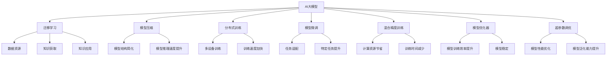

                 

## 1. 背景介绍

### 1.1 问题由来
随着人工智能技术的迅猛发展，AI大模型正成为引领新一代技术革命的重要力量。其庞大的数据容量和先进的算法，推动了自然语言处理、计算机视觉、语音识别等领域的飞速进步。但与此同时，创业公司要成功应用AI大模型，还面临着诸多技术挑战。

1. **数据资源稀缺**：大模型训练和微调需要巨量的高质量数据，数据资源的获取成本较高。
2. **模型复杂度高**：大模型参数众多，训练和推理需要高性能硬件支持。
3. **部署成本高**：大模型部署通常需要专用硬件，如GPU或TPU，中小企业难以负担。
4. **技术门槛高**：AI大模型的开发和应用涉及复杂的深度学习知识，需要高水平的工程师和技术支持。
5. **业务适配难**：AI大模型技术先进，但如何将其应用于具体业务场景，实现商业化落地，是创业公司面临的难题。

### 1.2 问题核心关键点
应对未来AI大模型技术挑战，需要从数据获取、模型训练、模型部署、业务适配等多个维度进行全面规划。本文将详细探讨如何通过技术创新，克服这些挑战，推动AI大模型在各行业中的应用。

## 2. 核心概念与联系

### 2.1 核心概念概述

1. **AI大模型（AI Large Model）**：指使用大规模数据和先进算法训练得到的、具有复杂神经网络结构和强大能力的人工智能模型。
2. **迁移学习（Transfer Learning）**：利用已有知识对新任务进行训练，减少训练时间和数据需求。
3. **模型压缩（Model Compression）**：通过参数剪枝、量化等技术减少模型大小，提高模型推理速度。
4. **分布式训练（Distributed Training）**：将模型并行分配到多个设备上，加速模型训练。
5. **模型微调（Model Fine-Tuning）**：在预训练模型基础上，针对特定任务进行调整，提升模型效果。
6. **混合精度训练（Mixed-Precision Training）**：使用混合精度格式进行训练，提升训练速度。
7. **模型优化器（Model Optimizer）**：优化模型训练过程，提高训练效率。
8. **超参数调优（Hyperparameter Tuning）**：通过调整模型参数和训练参数，优化模型性能。

这些概念之间相互联系，共同构成AI大模型技术生态。通过理解这些核心概念的原理和架构，我们可以更好地应对未来技术挑战。

### 2.2 概念间的关系

以下Mermaid流程图展示了AI大模型技术生态中各核心概念之间的关系：



这个流程图展示了AI大模型的技术生态系统，以及各技术模块之间的联系和作用。

## 3. 核心算法原理 & 具体操作步骤

### 3.1 算法原理概述
AI大模型技术基于深度学习框架，通过大规模数据训练神经网络，从而获得强大的学习能力。其主要原理如下：

1. **深度学习框架（Deep Learning Framework）**：如TensorFlow、PyTorch等，提供高效的网络结构和训练方法。
2. **神经网络（Neural Network）**：由大量节点组成的复杂网络，用于学习数据特征。
3. **正则化（Regularization）**：防止过拟合，保持模型泛化能力。
4. **超参数调优（Hyperparameter Tuning）**：通过调整模型参数和训练参数，优化模型性能。

### 3.2 算法步骤详解
1. **数据获取**：收集和标注大规模数据，用于模型训练。
2. **模型选择**：根据任务需求选择合适的预训练模型或从头训练模型。
3. **模型微调**：在预训练模型基础上，通过少量标注数据进行微调，适应特定任务。
4. **分布式训练**：将模型并行分配到多个设备上，加速模型训练。
5. **模型压缩**：通过参数剪枝、量化等技术减少模型大小，提高模型推理速度。
6. **模型优化**：使用混合精度、优化器等技术，提升模型训练和推理效率。

### 3.3 算法优缺点
**优点**：
- 泛化能力强：大规模数据训练得到的大模型能够适应多种任务。
- 技术成熟：现有深度学习框架和算法已经较为成熟，易于应用。
- 应用广泛：大模型可以应用于NLP、计算机视觉、语音识别等多个领域。

**缺点**：
- 数据依赖大：大模型需要大量高质量数据，获取成本高。
- 计算资源需求高：训练和推理需要高性能硬件支持，中小企业难以负担。
- 技术门槛高：涉及深度学习、分布式计算等复杂技术，需要高水平的工程师和技术支持。

### 3.4 算法应用领域
AI大模型技术在多个领域中得到了广泛应用，例如：

1. **自然语言处理（NLP）**：如文本分类、语言翻译、情感分析等。
2. **计算机视觉（CV）**：如图像识别、物体检测、图像生成等。
3. **语音识别**：如语音转文本、语音识别、语音合成等。
4. **智能推荐**：如电商推荐、新闻推荐、广告推荐等。
5. **智能客服**：如对话系统、智能问答、智能语音助手等。
6. **金融科技**：如信用评分、风险评估、智能投顾等。
7. **医疗健康**：如疾病诊断、智能问诊、个性化治疗等。
8. **自动驾驶**：如环境感知、路径规划、驾驶决策等。

## 4. 数学模型和公式 & 详细讲解

### 4.1 数学模型构建

以自然语言处理（NLP）为例，假设预训练模型为 $M_{\theta}$，其中 $\theta$ 为模型参数。在NLP任务 $T$ 上，目标为最小化经验风险：

$$
\mathcal{L}(\theta) = \frac{1}{N} \sum_{i=1}^N \ell(M_{\theta}(x_i),y_i)
$$

其中 $\ell$ 为损失函数，$x_i$ 和 $y_i$ 分别为输入和标签。常见的损失函数包括交叉熵损失、均方误差损失等。

### 4.2 公式推导过程

以交叉熵损失为例，假设模型在输入 $x$ 上的输出为 $\hat{y}=M_{\theta}(x)$，真实标签 $y \in \{0,1\}$。则交叉熵损失函数定义为：

$$
\ell(M_{\theta}(x),y) = -y\log \hat{y} - (1-y)\log (1-\hat{y})
$$

将其代入经验风险公式，得：

$$
\mathcal{L}(\theta) = -\frac{1}{N}\sum_{i=1}^N [y_i\log M_{\theta}(x_i)+(1-y_i)\log(1-M_{\theta}(x_i))]
$$

根据链式法则，损失函数对参数 $\theta_k$ 的梯度为：

$$
\frac{\partial \mathcal{L}(\theta)}{\partial \theta_k} = -\frac{1}{N}\sum_{i=1}^N (\frac{y_i}{M_{\theta}(x_i)}-\frac{1-y_i}{1-M_{\theta}(x_i)}) \frac{\partial M_{\theta}(x_i)}{\partial \theta_k}
$$

其中 $\frac{\partial M_{\theta}(x_i)}{\partial \theta_k}$ 可进一步递归展开，利用自动微分技术完成计算。

## 5. 项目实践：代码实例和详细解释说明

### 5.1 开发环境搭建

以下是使用Python和PyTorch进行NLP任务开发的环境配置流程：

1. 安装Anaconda：从官网下载并安装Anaconda，用于创建独立的Python环境。
```bash
conda create -n pytorch-env python=3.8 
conda activate pytorch-env
```

2. 安装PyTorch：根据CUDA版本，从官网获取对应的安装命令。例如：
```bash
conda install pytorch torchvision torchaudio cudatoolkit=11.1 -c pytorch -c conda-forge
```

3. 安装Transformers库：
```bash
pip install transformers
```

4. 安装各类工具包：
```bash
pip install numpy pandas scikit-learn matplotlib tqdm jupyter notebook ipython
```

完成上述步骤后，即可在`pytorch-env`环境中开始NLP任务开发。

### 5.2 源代码详细实现

以下代码实现了使用BERT模型进行文本分类任务的微调过程。

```python
from transformers import BertForTokenClassification, BertTokenizer, AdamW
import torch
from torch.utils.data import Dataset, DataLoader
from sklearn.metrics import accuracy_score, precision_recall_fscore_support

# 定义数据集
class MyDataset(Dataset):
    def __init__(self, texts, labels):
        self.texts = texts
        self.labels = labels
        self.tokenizer = BertTokenizer.from_pretrained('bert-base-uncased')
        self.max_len = 128

    def __len__(self):
        return len(self.texts)

    def __getitem__(self, item):
        text = self.texts[item]
        label = self.labels[item]
        
        encoding = self.tokenizer(text, return_tensors='pt', max_length=self.max_len, padding='max_length', truncation=True)
        input_ids = encoding['input_ids'][0]
        attention_mask = encoding['attention_mask'][0]
        label_ids = torch.tensor([self.tokenizer.convert_tokens_to_ids(label)], dtype=torch.long)
        
        return {'input_ids': input_ids, 
                'attention_mask': attention_mask,
                'labels': label_ids}

# 加载数据集
train_dataset = MyDataset(train_texts, train_labels)
dev_dataset = MyDataset(dev_texts, dev_labels)
test_dataset = MyDataset(test_texts, test_labels)

# 加载模型
model = BertForTokenClassification.from_pretrained('bert-base-uncased', num_labels=len(set(dev_labels)))

# 定义优化器
optimizer = AdamW(model.parameters(), lr=2e-5)

# 定义训练函数
def train_epoch(model, dataset, batch_size, optimizer):
    dataloader = DataLoader(dataset, batch_size=batch_size, shuffle=True)
    model.train()
    epoch_loss = 0
    for batch in dataloader:
        input_ids = batch['input_ids'].to(device)
        attention_mask = batch['attention_mask'].to(device)
        labels = batch['labels'].to(device)
        model.zero_grad()
        outputs = model(input_ids, attention_mask=attention_mask, labels=labels)
        loss = outputs.loss
        epoch_loss += loss.item()
        loss.backward()
        optimizer.step()
    return epoch_loss / len(dataloader)

# 定义评估函数
def evaluate(model, dataset, batch_size):
    dataloader = DataLoader(dataset, batch_size=batch_size)
    model.eval()
    preds, labels = [], []
    with torch.no_grad():
        for batch in dataloader:
            input_ids = batch['input_ids'].to(device)
            attention_mask = batch['attention_mask'].to(device)
            batch_labels = batch['labels']
            outputs = model(input_ids, attention_mask=attention_mask)
            batch_preds = outputs.logits.argmax(dim=2).to('cpu').tolist()
            batch_labels = batch_labels.to('cpu').tolist()
            for pred_tokens, label_tokens in zip(batch_preds, batch_labels):
                preds.append(pred_tokens[:len(label_tokens)])
                labels.append(label_tokens)
    return accuracy_score(labels, preds)

# 训练模型
device = torch.device('cuda') if torch.cuda.is_available() else torch.device('cpu')
model.to(device)

epochs = 5
batch_size = 16

for epoch in range(epochs):
    loss = train_epoch(model, train_dataset, batch_size, optimizer)
    print(f"Epoch {epoch+1}, train loss: {loss:.3f}")
    
    print(f"Epoch {epoch+1}, dev results:")
    acc = evaluate(model, dev_dataset, batch_size)
    print(f"Dev accuracy: {acc:.3f}")
    
print("Test results:")
acc = evaluate(model, test_dataset, batch_size)
print(f"Test accuracy: {acc:.3f}")
```

### 5.3 代码解读与分析

以下是代码的详细解读和分析：

**数据集定义**：
- `MyDataset`类定义了数据集，继承自`torch.utils.data.Dataset`。
- 初始化方法中，将文本和标签转换为Token Id，并进行定长padding。

**模型加载和优化器定义**：
- `BertForTokenClassification`为文本分类任务的BERT模型，`AdamW`为优化器。

**训练函数定义**：
- `train_epoch`函数中，使用`DataLoader`对数据集进行批次化加载，并计算损失函数和更新模型参数。

**评估函数定义**：
- `evaluate`函数中，使用`accuracy_score`计算模型在测试集上的准确率。

**模型训练和评估**：
- 在`for`循环中，对模型进行多次迭代训练，并在每个epoch结束时输出训练和验证集上的结果。

## 6. 实际应用场景

### 6.1 智能客服系统

AI大模型在智能客服系统中有着广泛应用。传统客服系统依赖人工客服，存在成本高、响应慢等问题。使用AI大模型构建的智能客服系统，能够实现全天候不间断服务，快速响应客户咨询，提高客户满意度和效率。

**应用场景**：
- **客户咨询**：输入客户的自然语言查询，AI大模型自动理解和响应，提供解决方案。
- **情绪分析**：通过分析客户的语言表达，识别客户情绪，提供相应的服务或反馈。
- **知识库管理**：将常见问题及其解决方案存储在知识库中，方便模型检索和使用。

**实现难点**：
- **数据获取**：需要收集大量的历史客服对话记录，标注数据集。
- **模型训练**：需要在大模型上进行微调，适应特定的客服任务。
- **模型部署**：需要高效部署到云平台，保证实时响应。

### 6.2 金融舆情监测

在金融领域，舆情监测对于及时发现和应对负面信息至关重要。AI大模型可以通过分析金融新闻、评论等文本数据，监测舆情变化，及时预警，避免风险。

**应用场景**：
- **新闻监测**：实时抓取金融新闻，分析舆情变化，及时预警。
- **评论分析**：分析用户评论，识别负面信息和市场情绪。
- **事件预警**：针对特定事件，自动生成预警报告，辅助决策。

**实现难点**：
- **数据获取**：需要获取大量的金融新闻、评论等文本数据。
- **模型训练**：需要在大模型上进行微调，适应金融领域的特定任务。
- **模型部署**：需要高效部署到实时处理平台，保证响应速度。

### 6.3 个性化推荐系统

个性化推荐系统是AI大模型在电商、新闻等领域的重要应用。通过分析用户的浏览、购买等行为数据，AI大模型能够提供更加精准、个性化的推荐结果，提升用户体验。

**应用场景**：
- **商品推荐**：根据用户浏览记录，推荐相关商品。
- **内容推荐**：根据用户阅读记录，推荐相关文章、视频等。
- **广告推荐**：根据用户行为，推荐个性化广告。

**实现难点**：
- **数据获取**：需要收集大量的用户行为数据，标注数据集。
- **模型训练**：需要在大模型上进行微调，适应推荐任务。
- **模型部署**：需要高效部署到实时推荐引擎，保证推荐速度和效果。

### 6.4 未来应用展望

未来，AI大模型将在更多领域得到应用，带来深远的变革。

1. **智慧医疗**：通过分析医疗数据，提供智能问诊、疾病预测等服务，提升医疗服务水平。
2. **智能教育**：通过分析学生数据，提供个性化学习方案，提升教学效果。
3. **智慧城市**：通过分析城市数据，优化交通、环保、安全等方面管理，提升城市管理水平。
4. **智能制造**：通过分析生产数据，优化生产流程，提升制造效率。
5. **智能安防**：通过分析监控数据，提供安全预警、行为分析等服务，提升安防水平。

## 7. 工具和资源推荐

### 7.1 学习资源推荐

为了帮助开发者系统掌握AI大模型的开发和应用，推荐以下学习资源：

1. **《深度学习》（Ian Goodfellow等著）**：深度学习领域的经典教材，涵盖了深度学习的基本概念和算法。
2. **《TensorFlow实战深度学习》（Manning Publications）**：TensorFlow的官方教程，详细介绍了TensorFlow的使用方法和应用案例。
3. **《PyTorch深度学习入门》（O'Reilly）**：PyTorch的官方教程，介绍了PyTorch的基本使用方法和应用案例。
4. **《自然语言处理入门》（周志华等著）**：自然语言处理领域的经典教材，涵盖了NLP的基本概念和算法。
5. **《机器学习实战》（Peter Harrington著）**：机器学习领域的经典教材，介绍了机器学习的基本算法和应用案例。

### 7.2 开发工具推荐

以下是几款用于AI大模型开发和应用的常用工具：

1. **TensorFlow**：由Google开发的深度学习框架，支持分布式计算和GPU加速。
2. **PyTorch**：由Facebook开发的深度学习框架，支持动态计算图和GPU加速。
3. **JAX**：由Google开发的自动微分和分布式计算框架，支持高效开发和部署。
4. **Horovod**：由IBM开发的分布式深度学习框架，支持TensorFlow、Keras、PyTorch等多种深度学习框架。
5. **Docker**：开源容器引擎，用于高效部署和管理AI大模型应用。

### 7.3 相关论文推荐

以下是几篇奠基性的相关论文，推荐阅读：

1. **"Attention is All You Need"（NIPS 2017）**：提出了Transformer结构，开启了深度学习中的自注意力机制。
2. **"BERT: Pre-training of Deep Bidirectional Transformers for Language Understanding"（JMLR 2019）**：提出了BERT模型，通过预训练和微调提高了语言理解能力。
3. **"Large-Scale Multilingual Datasets for Multilingual Transfer Learning"（ACL 2020）**：提出了大规模多语言数据集，支持多语言模型的训练和微调。
4. **"Mixed-Precision Training with Tensor Cores"（NeurIPS 2020）**：提出了混合精度训练技术，提高了深度学习的训练效率。
5. **"Layerwise Adaptive Pruning of Deep Neural Networks with Fixed Point Precision Formats"（ICML 2019）**：提出了模型压缩技术，提高了深度学习模型的推理速度。

## 8. 总结：未来发展趋势与挑战

### 8.1 研究成果总结

AI大模型技术经过多年的发展，已经取得了巨大的成功。当前，AI大模型已经在NLP、计算机视觉、语音识别等多个领域得到了广泛应用，推动了人工智能技术的进步。然而，大模型的开发和应用仍面临诸多挑战，需要不断地进行技术创新和优化。

### 8.2 未来发展趋势

未来，AI大模型技术将继续深化和拓展，带来新的突破和发展：

1. **模型规模扩大**：随着算力和数据量的增长，AI大模型的规模将进一步扩大，具备更强大的学习能力和应用潜力。
2. **计算平台优化**：通过分布式计算和优化算法，提升AI大模型的训练和推理效率。
3. **多模态融合**：将视觉、语音、文本等多种模态数据进行融合，提升模型的理解和推理能力。
4. **隐私保护技术**：通过差分隐私、联邦学习等技术，保护用户数据隐私和安全。
5. **知识图谱与AI结合**：将知识图谱与AI大模型结合，提升模型的知识获取和推理能力。
6. **模型可解释性增强**：通过可解释性技术，提升AI大模型的透明性和可信度。

### 8.3 面临的挑战

尽管AI大模型技术取得了显著进展，但在实际应用中仍面临诸多挑战：

1. **数据隐私和安全**：大规模数据集的收集和使用，涉及用户隐私和数据安全问题。
2. **计算资源需求**：训练和推理大模型需要高性能硬件，中小企业难以负担。
3. **模型泛化能力**：大模型在特定领域的泛化能力有待提升，难以适应复杂的实际应用场景。
4. **模型推理速度**：大模型推理速度较慢，难以满足实时应用的需求。
5. **模型可解释性**：大模型的内部机制和决策过程复杂，难以解释和审计。

### 8.4 研究展望

为了应对未来挑战，AI大模型技术需要从以下几个方面进行深入研究和创新：

1. **数据隐私保护**：开发隐私保护技术，如差分隐私、联邦学习等，保护用户数据隐私和安全。
2. **模型压缩和加速**：通过模型压缩、分布式训练等技术，提升AI大模型的训练和推理效率。
3. **多模态融合**：将视觉、语音、文本等多种模态数据进行融合，提升模型的理解和推理能力。
4. **知识图谱与AI结合**：将知识图谱与AI大模型结合，提升模型的知识获取和推理能力。
5. **模型可解释性增强**：通过可解释性技术，提升AI大模型的透明性和可信度。

## 9. 附录：常见问题与解答

**Q1: AI大模型微调需要哪些步骤？**

A: AI大模型微调需要以下步骤：
1. 数据获取：收集和标注大规模数据，用于模型训练。
2. 模型选择：选择合适的预训练模型或从头训练模型。
3. 模型微调：在预训练模型基础上，通过少量标注数据进行微调，适应特定任务。
4. 分布式训练：将模型并行分配到多个设备上，加速模型训练。
5. 模型压缩：通过参数剪枝、量化等技术减少模型大小，提高模型推理速度。
6. 模型优化：使用混合精度、优化器等技术，提升模型训练和推理效率。

**Q2: AI大模型微调有哪些挑战？**

A: AI大模型微调面临以下挑战：
1. 数据隐私和安全：大规模数据集的收集和使用，涉及用户隐私和数据安全问题。
2. 计算资源需求：训练和推理大模型需要高性能硬件，中小企业难以负担。
3. 模型泛化能力：大模型在特定领域的泛化能力有待提升，难以适应复杂的实际应用场景。
4. 模型推理速度：大模型推理速度较慢，难以满足实时应用的需求。
5. 模型可解释性：大模型的内部机制和决策过程复杂，难以解释和审计。

**Q3: 如何使用AI大模型进行个性化推荐？**

A: 使用AI大模型进行个性化推荐可以按以下步骤：
1. 数据获取：收集用户的行为数据，如浏览、购买记录等。
2. 数据预处理：对数据进行清洗、特征提取等预处理。
3. 模型选择：选择合适的预训练模型，如BERT、GPT等。
4. 模型微调：在预训练模型基础上，通过用户行为数据进行微调，适应推荐任务。
5. 推荐策略：设计推荐算法，如基于内容的推荐、协同过滤等，将模型输出与推荐策略结合。
6. 模型评估：在测试集上评估推荐效果，不断优化模型和推荐策略。

本文从背景介绍、核心概念、算法原理、具体操作步骤、实际应用场景、工具和资源推荐等多个方面，全面系统地探讨了AI大模型技术，并给出了详细的代码实例和分析。通过深入理解AI大模型的原理和应用，可以更好地应对未来的技术挑战，推动人工智能技术的发展和应用。

