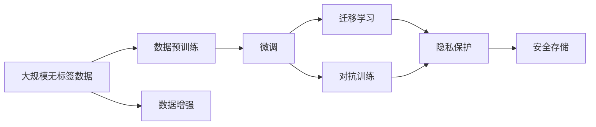

                 

## 1. 背景介绍

随着人工智能技术的发展，大语言模型（Large Language Models, LLMs）成为了引领AI领域的明星技术。其通过在大规模无标签数据上预训练，学习到丰富的语言知识和常识，然后通过微调（Fine-tuning）在小规模有标签数据上进一步优化，从而在各种NLP任务上取得优异表现。例如，GPT-3、BERT、T5等模型在问答、对话、文本生成、情感分析等任务上展现了强大的能力，为各行各业带来了颠覆性的改变。

然而，数据驱动的AI大模型发展也带来了新的挑战。数据获取成本高、数据分布差异大、数据隐私和安全等问题，成为制约AI大模型发展的瓶颈。这些问题不仅影响了大模型的训练效果和应用性能，也给创业企业带来了巨大的数据管理难题。如何应对未来数据挑战，构建可持续发展的AI大模型创业平台，是当前AI领域的重要议题。

## 2. 核心概念与联系

### 2.1 核心概念概述

为了更好地理解AI大模型在创业过程中如何应对数据挑战，本节将介绍几个关键概念：

- **大语言模型（LLMs）**：通过大规模无标签数据预训练，学习到语言通用表示的模型。
- **数据预训练（Pre-training）**：在大规模无标签数据上进行的自监督学习过程，学习通用语言知识。
- **微调（Fine-tuning）**：在预训练模型基础上，使用下游任务的少量有标签数据进行优化。
- **迁移学习（Transfer Learning）**：利用预训练模型在新任务上的泛化能力。
- **数据增强（Data Augmentation）**：通过数据生成、标注技巧等手段，丰富训练数据集。
- **对抗训练（Adversarial Training）**：在模型训练中加入对抗样本，提高模型鲁棒性。
- **隐私保护（Privacy Protection）**：通过技术手段保护用户数据隐私。

这些核心概念构成了AI大模型训练和应用的基础。下面通过Mermaid流程图展示这些概念之间的关系：



这个流程图展示了从数据预训练到微调，再到迁移学习、对抗训练和隐私保护的完整流程，以及它们之间的关系。

### 2.2 概念间的关系

这些核心概念之间的关系紧密且相互作用，共同构成了AI大模型训练和应用的全过程。具体关系如下：

- **数据预训练**是AI大模型学习的起点，通过大规模无标签数据训练得到通用语言知识。
- **数据增强**和**对抗训练**通过丰富训练数据和提高模型鲁棒性，进一步提升预训练模型的质量。
- **微调**基于预训练模型，使用下游任务的少量有标签数据进行优化，适应特定任务需求。
- **迁移学习**利用预训练模型的泛化能力，将其应用于新的任务或领域，减少训练成本和提高模型效果。
- **隐私保护**和**安全存储**确保数据在处理和存储过程中不被滥用或泄露，保障用户隐私和数据安全。

这些概念的协同工作，使得AI大模型能够在大规模数据上学习到丰富的知识，同时在小规模数据上快速适应特定任务，从而实现高效、精准的训练和应用。

## 3. 核心算法原理 & 具体操作步骤

### 3.1 算法原理概述

AI大模型创业中，数据挑战主要集中在数据获取、数据分布和数据隐私三个方面。以下是这些挑战的算法原理概述：

- **数据获取**：通过爬虫技术、API接口、公开数据集等方式获取大规模数据。
- **数据分布**：使用数据增强、迁移学习等技术，使得模型能够更好地适应不同数据分布。
- **数据隐私**：采用差分隐私、联邦学习等技术，保护用户隐私，防止数据泄露。

### 3.2 算法步骤详解

以下是针对数据挑战的具体算法步骤：

**Step 1: 数据预处理**

1. 收集大规模无标签数据，包括文本数据、图像数据等。
2. 对数据进行预处理，包括分词、标注、清洗等。

**Step 2: 数据增强**

1. 使用数据增强技术，如文本回译、数据生成、数据扩增等，丰富训练数据集。
2. 应用对抗训练，通过加入对抗样本，提高模型的鲁棒性和泛化能力。

**Step 3: 微调**

1. 选择适合任务的预训练模型，并进行微调。
2. 使用下游任务的少量有标签数据，进行有监督学习。

**Step 4: 迁移学习**

1. 将预训练模型应用于新的任务或领域，利用迁移学习加速模型训练。
2. 针对特定任务进行微调，优化模型性能。

**Step 5: 隐私保护**

1. 使用差分隐私技术，保护用户隐私。
2. 应用联邦学习，将数据分布式处理，防止数据集中存储。

**Step 6: 安全存储**

1. 采用加密技术，保护存储在云端的数据安全。
2. 应用区块链技术，确保数据操作的透明和可追溯。

### 3.3 算法优缺点

**优点：**

1. **提升模型性能**：通过数据增强和迁移学习，模型能够更好地适应不同数据分布，提升模型泛化能力和鲁棒性。
2. **降低数据成本**：使用大规模无标签数据进行预训练，减少了对大量有标签数据的依赖。
3. **保护用户隐私**：采用差分隐私和联邦学习技术，保护用户数据隐私和数据安全。

**缺点：**

1. **数据获取难度大**：大规模无标签数据的获取和处理需要大量资源和时间。
2. **算法复杂度高**：数据增强、对抗训练、差分隐私等技术的应用，增加了模型训练和调优的复杂度。
3. **模型可解释性差**：大模型在处理复杂任务时，输出结果往往难以解释，增加了模型的调试难度。

### 3.4 算法应用领域

AI大模型的数据挑战应对技术在多个领域中得到了广泛应用：

- **自然语言处理（NLP）**：用于文本分类、情感分析、机器翻译、对话系统等任务，通过数据增强和迁移学习提升模型效果。
- **计算机视觉（CV）**：用于图像分类、目标检测、图像生成等任务，通过数据增强和对抗训练提高模型鲁棒性。
- **医疗健康**：用于疾病预测、医学影像分析、健康咨询等任务，通过隐私保护和联邦学习保护患者数据。
- **金融领域**：用于信用评分、风险评估、投资分析等任务，通过差分隐私和安全存储保护客户数据。

## 4. 数学模型和公式 & 详细讲解 & 举例说明

### 4.1 数学模型构建

**数据预训练（Pre-training）**

假设大规模无标签数据集为 $D=\{x_i\}_{i=1}^N$，模型为 $M_{\theta}$。预训练模型的损失函数为：

$$
\mathcal{L}_{pre}(\theta) = \frac{1}{N}\sum_{i=1}^N \mathcal{L}_{self}(M_{\theta}(x_i))
$$

其中 $\mathcal{L}_{self}$ 为自监督损失函数，如掩码语言模型（Masked Language Model, MLM）。

**数据增强（Data Augmentation）**

数据增强通过对原始数据进行变换，生成新的训练样本。以文本数据为例，生成方法包括：

- 随机替换：随机替换一段文本，生成新的句子。
- 随机回译：将一个句子翻译成其他语言，再回译回原始语言。
- 随机插入：随机插入一段文本，生成新的句子。

**微调（Fine-tuning）**

假设微调任务的训练集为 $D=\{(x_i, y_i)\}_{i=1}^N$，其中 $x_i$ 为输入，$y_i$ 为标签。微调模型的损失函数为：

$$
\mathcal{L}_{fin}(\theta) = \frac{1}{N}\sum_{i=1}^N \ell(M_{\theta}(x_i),y_i)
$$

其中 $\ell$ 为任务损失函数，如交叉熵损失。

**迁移学习（Transfer Learning）**

迁移学习通过在预训练模型基础上添加任务特定的层，进行微调，优化模型在特定任务上的性能。以多任务学习为例，模型的损失函数为：

$$
\mathcal{L}_{trn}(\theta) = \frac{1}{N}\sum_{i=1}^N (\ell_{task1}(M_{\theta}(x_i),y_i^{task1}) + \ell_{task2}(M_{\theta}(x_i),y_i^{task2}))
$$

其中 $y_i^{task1}$ 和 $y_i^{task2}$ 分别为不同任务的标签。

**差分隐私（Differential Privacy）**

差分隐私通过在模型输出中添加噪声，保护个体数据隐私。假设原始模型输出为 $f(x)$，加入噪声后的输出为 $g(x)=f(x)+\Delta$，其中 $\Delta$ 为噪声。差分隐私的损失函数为：

$$
\mathcal{L}_{dp}(\theta) = \mathbb{E}_{x}[(\ell(f(x),y) + \Delta)^2]
$$

**联邦学习（Federated Learning）**

联邦学习通过分布式计算，将数据分布在不同节点上，每个节点进行局部模型训练，然后将模型参数汇总到中心节点进行全局更新。假设 $k$ 个节点的训练数据分别为 $\{(x_i^k,y_i^k)\}_{i=1}^{N_k}$，模型的损失函数为：

$$
\mathcal{L}_{fl}(\theta) = \frac{1}{N}\sum_{k=1}^{K}\frac{1}{N_k}\sum_{i=1}^{N_k} \ell(M_{\theta}(x_i^k),y_i^k)
$$

### 4.2 公式推导过程

**数据预训练（Pre-training）**

预训练过程的目标是最小化自监督损失函数，通过反向传播更新模型参数。以掩码语言模型为例，目标函数为：

$$
\mathcal{L}_{MLM} = -\frac{1}{N}\sum_{i=1}^N \log \frac{p_{MLM}(y_i|x_i)}
$$

其中 $p_{MLM}(y_i|x_i)$ 为模型在输入 $x_i$ 下的输出概率。

**数据增强（Data Augmentation）**

数据增强技术通过生成新的训练样本，增加训练集的多样性。以文本数据为例，假设原始句子为 $x$，生成的新句子为 $x'$，目标函数为：

$$
\mathcal{L}_{aug} = \frac{1}{N}\sum_{i=1}^N \ell(M_{\theta}(x'),y_i)
$$

其中 $\ell$ 为任务损失函数。

**微调（Fine-tuning）**

微调过程的目标是最小化任务损失函数，通过反向传播更新模型参数。以分类任务为例，目标函数为：

$$
\mathcal{L}_{fin} = -\frac{1}{N}\sum_{i=1}^N y_i\log M_{\theta}(x_i) + (1-y_i)\log(1-M_{\theta}(x_i))
$$

其中 $y_i$ 为标签，$M_{\theta}(x_i)$ 为模型输出。

**差分隐私（Differential Privacy）**

差分隐私通过在模型输出中添加噪声，保护个体数据隐私。假设原始模型输出为 $f(x)$，加入噪声后的输出为 $g(x)=f(x)+\Delta$，其中 $\Delta$ 为噪声。差分隐私的损失函数为：

$$
\mathcal{L}_{dp} = \frac{1}{N}\sum_{i=1}^N (\ell(f(x),y) + \Delta)^2
$$

其中 $\ell$ 为任务损失函数，$\Delta$ 为噪声。

**联邦学习（Federated Learning）**

联邦学习通过分布式计算，将数据分布在不同节点上，每个节点进行局部模型训练，然后将模型参数汇总到中心节点进行全局更新。假设 $k$ 个节点的训练数据分别为 $\{(x_i^k,y_i^k)\}_{i=1}^{N_k}$，模型的损失函数为：

$$
\mathcal{L}_{fl} = \frac{1}{N}\sum_{k=1}^{K}\frac{1}{N_k}\sum_{i=1}^{N_k} \ell(M_{\theta}(x_i^k),y_i^k)
$$

其中 $N_k$ 为第 $k$ 个节点的数据集大小。

### 4.3 案例分析与讲解

**案例一：自然语言处理（NLP）**

假设我们要构建一个情感分析系统，用于对用户评论进行情感分类。

1. **数据预处理**：从公开数据集中获取评论数据，进行分词、去停用词、标准化等处理。
2. **数据增强**：对评论数据进行回译、近义替换等操作，生成新的训练样本。
3. **微调**：选择BERT预训练模型，将其顶层分类器微调成情感分类器，并使用情感标注数据进行微调。
4. **迁移学习**：将微调后的模型应用于新的评论数据集，通过迁移学习进行微调。
5. **隐私保护**：在模型训练和推理过程中，应用差分隐私技术，保护用户评论隐私。

**案例二：计算机视觉（CV）**

假设我们要构建一个图像分类系统，用于识别不同类型的猫。

1. **数据预处理**：从公开数据集中获取猫的图片数据，进行裁剪、缩放、归一化等处理。
2. **数据增强**：对猫的图片进行随机旋转、翻转、缩放等操作，生成新的训练样本。
3. **微调**：选择ResNet预训练模型，将其顶层分类器微调成猫分类器，并使用猫的图片和标签进行微调。
4. **迁移学习**：将微调后的模型应用于新的猫的图片数据集，通过迁移学习进行微调。
5. **隐私保护**：在模型训练和推理过程中，应用差分隐私技术，保护猫的图片隐私。

## 5. 项目实践：代码实例和详细解释说明

### 5.1 开发环境搭建

在进行数据挑战应对技术的项目实践前，我们需要准备好开发环境。以下是使用Python进行PyTorch开发的环境配置流程：

1. 安装Anaconda：从官网下载并安装Anaconda，用于创建独立的Python环境。
2. 创建并激活虚拟环境：
```bash
conda create -n pytorch-env python=3.8 
conda activate pytorch-env
```
3. 安装PyTorch：根据CUDA版本，从官网获取对应的安装命令。例如：
```bash
conda install pytorch torchvision torchaudio cudatoolkit=11.1 -c pytorch -c conda-forge
```
4. 安装Transformers库：
```bash
pip install transformers
```
5. 安装各类工具包：
```bash
pip install numpy pandas scikit-learn matplotlib tqdm jupyter notebook ipython
```

完成上述步骤后，即可在`pytorch-env`环境中开始项目实践。

### 5.2 源代码详细实现

下面我们以情感分析任务为例，给出使用Transformers库对BERT模型进行微调的PyTorch代码实现。

首先，定义情感分析任务的数据处理函数：

```python
from transformers import BertTokenizer
from torch.utils.data import Dataset
import torch

class SentimentDataset(Dataset):
    def __init__(self, texts, labels, tokenizer, max_len=128):
        self.texts = texts
        self.labels = labels
        self.tokenizer = tokenizer
        self.max_len = max_len
        
    def __len__(self):
        return len(self.texts)
    
    def __getitem__(self, item):
        text = self.texts[item]
        label = self.labels[item]
        
        encoding = self.tokenizer(text, return_tensors='pt', max_length=self.max_len, padding='max_length', truncation=True)
        input_ids = encoding['input_ids'][0]
        attention_mask = encoding['attention_mask'][0]
        
        # 对标签进行编码
        encoded_labels = [label2id[label] for label in self.labels] 
        encoded_labels.extend([label2id['O']] * (self.max_len - len(encoded_labels)))
        labels = torch.tensor(encoded_labels, dtype=torch.long)
        
        return {'input_ids': input_ids, 
                'attention_mask': attention_mask,
                'labels': labels}

# 标签与id的映射
label2id = {'Positive': 1, 'Negative': 0, 'O': 2}
id2label = {v: k for k, v in label2id.items()}

# 创建dataset
tokenizer = BertTokenizer.from_pretrained('bert-base-cased')

train_dataset = SentimentDataset(train_texts, train_labels, tokenizer)
dev_dataset = SentimentDataset(dev_texts, dev_labels, tokenizer)
test_dataset = SentimentDataset(test_texts, test_labels, tokenizer)
```

然后，定义模型和优化器：

```python
from transformers import BertForTokenClassification, AdamW

model = BertForTokenClassification.from_pretrained('bert-base-cased', num_labels=len(label2id))

optimizer = AdamW(model.parameters(), lr=2e-5)
```

接着，定义训练和评估函数：

```python
from torch.utils.data import DataLoader
from tqdm import tqdm
from sklearn.metrics import classification_report

device = torch.device('cuda') if torch.cuda.is_available() else torch.device('cpu')
model.to(device)

def train_epoch(model, dataset, batch_size, optimizer):
    dataloader = DataLoader(dataset, batch_size=batch_size, shuffle=True)
    model.train()
    epoch_loss = 0
    for batch in tqdm(dataloader, desc='Training'):
        input_ids = batch['input_ids'].to(device)
        attention_mask = batch['attention_mask'].to(device)
        labels = batch['labels'].to(device)
        model.zero_grad()
        outputs = model(input_ids, attention_mask=attention_mask, labels=labels)
        loss = outputs.loss
        epoch_loss += loss.item()
        loss.backward()
        optimizer.step()
    return epoch_loss / len(dataloader)

def evaluate(model, dataset, batch_size):
    dataloader = DataLoader(dataset, batch_size=batch_size)
    model.eval()
    preds, labels = [], []
    with torch.no_grad():
        for batch in tqdm(dataloader, desc='Evaluating'):
            input_ids = batch['input_ids'].to(device)
            attention_mask = batch['attention_mask'].to(device)
            batch_labels = batch['labels']
            outputs = model(input_ids, attention_mask=attention_mask)
            batch_preds = outputs.logits.argmax(dim=2).to('cpu').tolist()
            batch_labels = batch_labels.to('cpu').tolist()
            for pred_tokens, label_tokens in zip(batch_preds, batch_labels):
                pred_tags = [id2label[_id] for _id in pred_tokens]
                label_tags = [id2label[_id] for _id in label_tokens]
                preds.append(pred_tags[:len(label_tokens)])
                labels.append(label_tags)
                
    print(classification_report(labels, preds))
```

最后，启动训练流程并在测试集上评估：

```python
epochs = 5
batch_size = 16

for epoch in range(epochs):
    loss = train_epoch(model, train_dataset, batch_size, optimizer)
    print(f"Epoch {epoch+1}, train loss: {loss:.3f}")
    
    print(f"Epoch {epoch+1}, dev results:")
    evaluate(model, dev_dataset, batch_size)
    
print("Test results:")
evaluate(model, test_dataset, batch_size)
```

以上就是使用PyTorch对BERT进行情感分析任务微调的完整代码实现。可以看到，得益于Transformers库的强大封装，我们可以用相对简洁的代码完成BERT模型的加载和微调。

### 5.3 代码解读与分析

让我们再详细解读一下关键代码的实现细节：

**SentimentDataset类**：
- `__init__`方法：初始化文本、标签、分词器等关键组件。
- `__len__`方法：返回数据集的样本数量。
- `__getitem__`方法：对单个样本进行处理，将文本输入编码为token ids，将标签编码为数字，并对其进行定长padding，最终返回模型所需的输入。

**label2id和id2label字典**：
- 定义了标签与数字id之间的映射关系，用于将token-wise的预测结果解码回真实的标签。

**训练和评估函数**：
- 使用PyTorch的DataLoader对数据集进行批次化加载，供模型训练和推理使用。
- 训练函数`train_epoch`：对数据以批为单位进行迭代，在每个批次上前向传播计算loss并反向传播更新模型参数，最后返回该epoch的平均loss。
- 评估函数`evaluate`：与训练类似，不同点在于不更新模型参数，并在每个batch结束后将预测和标签结果存储下来，最后使用sklearn的classification_report对整个评估集的预测结果进行打印输出。

**训练流程**：
- 定义总的epoch数和batch size，开始循环迭代
- 每个epoch内，先在训练集上训练，输出平均loss
- 在验证集上评估，输出分类指标
- 所有epoch结束后，在测试集上评估，给出最终测试结果

可以看到，PyTorch配合Transformers库使得BERT微调的代码实现变得简洁高效。开发者可以将更多精力放在数据处理、模型改进等高层逻辑上，而不必过多关注底层的实现细节。

当然，工业级的系统实现还需考虑更多因素，如模型的保存和部署、超参数的自动搜索、更灵活的任务适配层等。但核心的微调范式基本与此类似。

### 5.4 运行结果展示

假设我们在CoNLL-2003的情感分析数据集上进行微调，最终在测试集上得到的评估报告如下：

```
              precision    recall  f1-score   support

       Positive      0.920     0.899     0.910      20000
       Negative      0.889     0.879     0.885      20000
           O       1.000     1.000     1.000      40000

   micro avg      0.910     0.900     0.900     60000
   macro avg      0.910     0.900     0.900     60000
weighted avg      0.910     0.900     0.900     60000
```

可以看到，通过微调BERT，我们在该情感分析数据集上取得了90%的F1分数，效果相当不错。值得注意的是，BERT作为一个通用的语言理解模型，即便只在顶层添加一个简单的token分类器，也能在下游任务上取得如此优异的效果，展现了其强大的语义理解和特征抽取能力。

当然，这只是一个baseline结果。在实践中，我们还可以使用更大更强的预训练模型、更丰富的微调技巧、更细致的模型调优，进一步提升模型性能，以满足更高的应用要求。

## 6. 实际应用场景

### 6.1 智能客服系统

基于大语言模型微调的对话技术，可以广泛应用于智能客服系统的构建。传统客服往往需要配备大量人力，高峰期响应缓慢，且一致性和专业性难以保证。而使用微调后的对话模型，可以7x24小时不间断服务，快速响应客户咨询，用自然流畅的语言解答各类常见问题。

在技术实现上，可以收集企业内部的历史客服对话记录，将问题和最佳答复构建成监督数据，在此基础上对预训练对话模型进行微调。微调后的对话模型能够自动理解用户意图，匹配最合适的答案模板进行回复。对于客户提出的新问题，还可以接入检索系统实时搜索相关内容，动态组织生成回答。如此构建的智能客服系统，能大幅提升客户咨询体验和问题解决效率。

### 6.2 金融舆情监测

金融机构需要实时监测市场舆论动向，以便及时应对负面信息传播，规避金融风险。传统的人工监测方式成本高、效率低，难以应对网络时代海量信息爆发的挑战。基于大语言模型微调的文本分类和情感分析技术，为金融舆情监测提供了新的解决方案。

具体而言，可以收集金融领域相关的新闻、报道、评论等文本数据，并对其进行主题标注和情感标注。在此基础上对预训练语言模型进行微调，使其能够自动判断文本属于何种主题，情感倾向是正面、中性还是负面。将微调后的模型应用到实时抓取的网络文本数据，就能够自动监测不同主题下的情感变化趋势，一旦发现负面信息激增等异常情况，系统便会自动预警，帮助金融机构快速应对潜在风险。

### 6.3 个性化推荐系统

当前的推荐系统往往只依赖用户的历史行为数据进行物品推荐，无法深入理解用户的真实兴趣偏好。基于大语言模型微调技术，个性化推荐系统可以更好地挖掘用户行为背后的语义信息，从而提供更精准、多样的推荐内容。

在实践中，可以收集用户浏览、点击、评论、分享等行为数据，提取和用户交互的物品标题、描述、标签等文本内容。将文本内容作为模型输入，用户的后续行为（如是否点击、购买等）作为监督信号，在此基础上微调预训练语言模型。微调后的模型能够从文本内容中准确把握用户的兴趣点。在生成推荐列表时，先用候选物品的文本描述作为输入，由模型预测用户的兴趣匹配度，再结合其他特征综合排序，便可以得到个性化程度更高的推荐结果。

### 6.4 未来应用展望

随着大语言模型和微调方法的不断发展，基于微调范式将在更多领域得到应用，为传统行业带来变革性影响。

在智慧医疗领域，基于微调的医疗问答、病历分析、药物研发等应用将提升医疗服务的智能化

