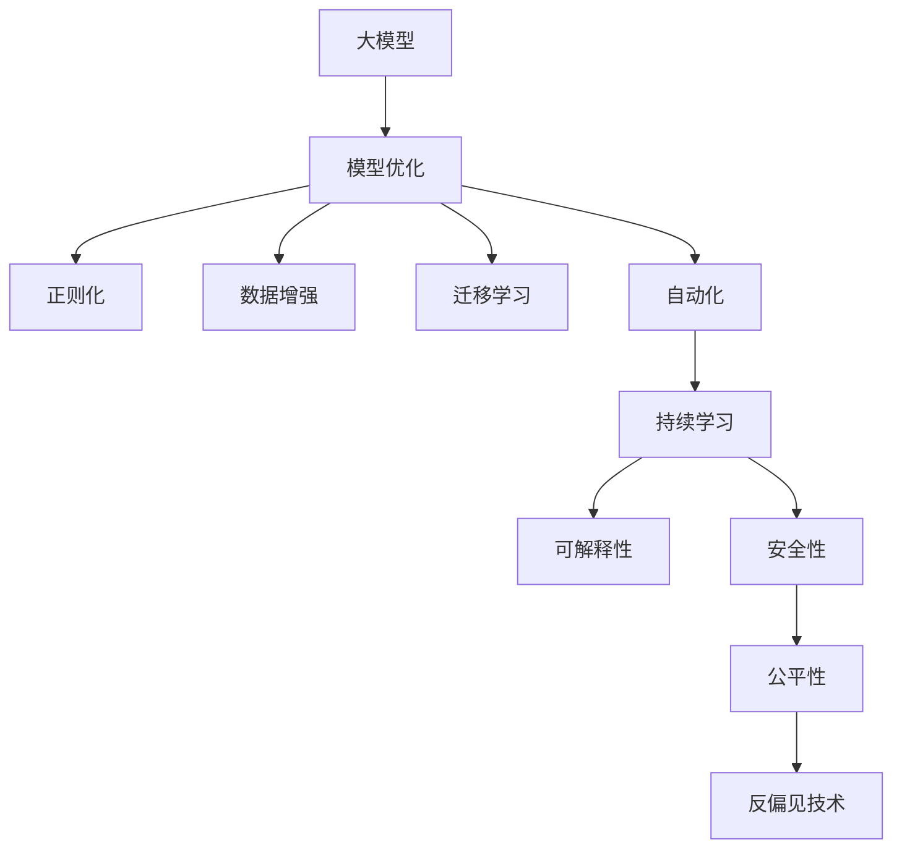

                 

## 1. 背景介绍

### 1.1 问题由来

随着人工智能技术的飞速发展，大模型（Large Models）已成为AI创业的核心焦点之一。大模型因其在大数据量、大规模化计算下的强大处理能力，能够自动学习并提取出知识图谱、语义网络等高层次的特征表示，大幅提升AI系统的智能水平和应用范围。例如，ChatGPT、GPT-3等大模型已经在自然语言处理、机器翻译、问答系统、图像识别等领域展现出了极大的应用潜力。

但大模型并不是万能的，其训练和应用过程中的诸多问题也随之显现，如训练数据量大、计算资源需求高、模型复杂度高等。此外，由于数据偏差和模型复杂性，大模型的输出结果也经常存在误差，难以全面满足实际应用需求。因此，如何优化大模型创业，并解决模型输出稳定性、安全性和可解释性等问题，是大模型创业面临的主要挑战。

### 1.2 问题核心关键点

为了回答大模型创业如何应对未来行业发展趋势这一问题，我们需要从以下几个关键点入手：

1. **大模型的应用场景和价值**：理解大模型的基础应用和其在各个行业中的潜在价值。
2. **数据与算力的瓶颈**：研究大模型在数据获取、处理和算力需求方面的局限。
3. **模型稳定性与安全性**：探讨如何确保模型输出结果的稳定性和安全性，避免潜在的负面影响。
4. **可解释性**：分析模型输出的可解释性问题，以及如何提高模型的透明度。
5. **自动化和持续学习**：研究如何通过自动化和持续学习，提高大模型的适应性和性能。

### 1.3 问题研究意义

理解和掌握大模型创业的关键点，有助于创业者制定更为科学合理的策略，构建具有竞争力的AI应用。对于AI创业者来说，熟悉大模型创业面临的挑战及其应对策略，不仅可以提升产品的市场竞争力，还能在行业内获得长远的战略优势。

## 2. 核心概念与联系

### 2.1 核心概念概述

要理解大模型创业的挑战与应对策略，首先需要明确以下核心概念：

- **大模型**：通常指的是具有数亿或数十亿参数的深度学习模型，如GPT、BERT、ResNet等，具备强大的学习能力和表达能力。
- **模型优化**：通过技术手段，如正则化、数据增强、迁移学习等，优化模型的性能，使其在特定任务上表现更好。
- **自动化**：通过自动化工具和流程，实现模型的快速训练、部署和优化。
- **持续学习**：模型在实际应用过程中，持续从新数据中学习，提升性能，避免过拟合和知识退化。
- **可解释性**：确保模型的决策过程和输出结果可以被解释和理解，提高用户信任。
- **安全性**：保证模型输出结果的公正性、无偏见，避免恶意攻击和不当使用。

这些核心概念之间的关系可以用以下Mermaid流程图展示：



### 2.2 概念间的关系

这些核心概念之间存在紧密的联系，它们共同构成了大模型创业的完整生态系统：

- **模型优化与自动化**：优化和大模型之间的相互依赖关系。模型优化能够提升大模型的性能，而自动化技术则能加速模型训练和部署。
- **持续学习与自动化**：持续学习是自动化的补充，模型在实际应用中持续学习新知识，而自动化工具则支持这种持续学习过程。
- **可解释性与安全性**：可解释性是安全性的前提，只有可解释的模型才能被用户信任，进而提升安全性。
- **公平性与反偏见技术**：公平性和反偏见技术是大模型安全的保障，避免模型输出带有偏见，损害用户权益。

通过理解这些核心概念之间的联系，我们可以更全面地应对大模型创业过程中面临的挑战。

## 3. 核心算法原理 & 具体操作步骤

### 3.1 算法原理概述

大模型创业的核心在于通过数据与算力的驱动，构建高效、稳定、安全的AI应用。以下是基于此原理的微调（Fine-tuning）和大模型优化（Model Optimization）的详细解释：

**微调**：通过在特定任务上对大模型进行有监督学习，使其在特定领域取得更好的性能。例如，对大规模预训练模型如BERT或GPT-3进行微调，使其适应特定NLP任务，如文本分类、情感分析、机器翻译等。

**大模型优化**：通过正则化、数据增强、迁移学习等手段，对大模型进行优化，以提高其泛化能力和性能。例如，通过增加正则项，防止过拟合；通过数据增强，提高模型的鲁棒性；通过迁移学习，使模型适应不同任务。

### 3.2 算法步骤详解

以下是微调和优化大模型的详细步骤：

**Step 1: 准备预训练模型和数据集**

- 选择适合的任务的预训练模型，如BERT、GPT-3、T5等。
- 收集高质量的标注数据集，通常包含数千到数万个样本。

**Step 2: 数据预处理**

- 数据清洗：去除噪声、处理缺失值、归一化等。
- 数据增强：通过回译、近义词替换等方法扩充训练集。
- 数据划分：将数据集分为训练集、验证集和测试集。

**Step 3: 模型微调**

- 定义任务适配层，如线性分类器、解码器等。
- 选择优化器如AdamW、SGD等，并设置学习率。
- 进行梯度下降更新参数。

**Step 4: 评估与迭代**

- 在验证集上评估模型性能，调整学习率或正则化参数。
- 进行模型集成或融合，提高泛化能力。

**Step 5: 部署与优化**

- 部署模型到生产环境，实现实时推理。
- 使用自动化工具，如TensorBoard、Weights & Biases等进行模型监控。
- 使用持续学习机制，使模型在实际应用中持续更新。

### 3.3 算法优缺点

**优点**：

- **泛化能力**：通过微调和优化，大模型在特定任务上表现优异。
- **适应性强**：模型可以轻松适应不同领域和任务，满足多样化的应用需求。
- **效率高**：利用已有预训练模型，减少了从头训练所需的时间和资源。

**缺点**：

- **数据依赖**：需要大量的标注数据，数据获取成本高。
- **资源消耗大**：大模型通常需要高性能的硬件支持，成本较高。
- **模型复杂**：模型的复杂度较高，难以解释和调试。

### 3.4 算法应用领域

大模型在多个领域都有广泛应用：

- **自然语言处理**：文本分类、情感分析、机器翻译、文本生成等。
- **计算机视觉**：图像分类、目标检测、图像生成等。
- **语音识别**：语音转文字、自动摘要、语音生成等。
- **推荐系统**：个性化推荐、内容生成等。

## 4. 数学模型和公式 & 详细讲解 & 举例说明

### 4.1 数学模型构建

假设大模型为 $M_{\theta}$，其中 $\theta$ 为模型参数。给定任务 $T$ 的标注数据集 $D=\{(x_i,y_i)\}_{i=1}^N$，其中 $x_i$ 为输入，$y_i$ 为标签。

定义损失函数 $\ell(M_{\theta}(x_i),y_i)$，则经验风险为：

$$
\mathcal{L}(\theta) = \frac{1}{N}\sum_{i=1}^N \ell(M_{\theta}(x_i),y_i)
$$

### 4.2 公式推导过程

以二分类任务为例，假设模型 $M_{\theta}$ 在输入 $x$ 上的输出为 $\hat{y}=M_{\theta}(x) \in [0,1]$。真实标签 $y \in \{0,1\}$。则二分类交叉熵损失函数定义为：

$$
\ell(M_{\theta}(x),y) = -[y\log \hat{y} + (1-y)\log (1-\hat{y})]
$$

将上述损失函数代入经验风险公式，得：

$$
\mathcal{L}(\theta) = -\frac{1}{N}\sum_{i=1}^N [y_i\log M_{\theta}(x_i)+(1-y_i)\log(1-M_{\theta}(x_i))]
$$

根据链式法则，损失函数对参数 $\theta_k$ 的梯度为：

$$
\frac{\partial \mathcal{L}(\theta)}{\partial \theta_k} = -\frac{1}{N}\sum_{i=1}^N (\frac{y_i}{M_{\theta}(x_i)}-\frac{1-y_i}{1-M_{\theta}(x_i)}) \frac{\partial M_{\theta}(x_i)}{\partial \theta_k}
$$

其中 $\frac{\partial M_{\theta}(x_i)}{\partial \theta_k}$ 可进一步递归展开，利用自动微分技术完成计算。

### 4.3 案例分析与讲解

以ImageNet数据集上的预训练模型ResNet为例，其模型优化过程如下：

- **正则化**：通过L2正则项防止过拟合。
- **数据增强**：通过旋转、翻转等增强训练样本的多样性。
- **迁移学习**：在ImageNet上预训练ResNet-50模型，再通过微调适应特定的目标任务。

## 5. 项目实践：代码实例和详细解释说明

### 5.1 开发环境搭建

以下是使用Python和PyTorch搭建大模型创业的开发环境：

1. 安装Anaconda：从官网下载并安装Anaconda，用于创建独立的Python环境。

2. 创建并激活虚拟环境：
```bash
conda create -n pytorch-env python=3.8 
conda activate pytorch-env
```

3. 安装PyTorch：根据CUDA版本，从官网获取对应的安装命令。例如：
```bash
conda install pytorch torchvision torchaudio cudatoolkit=11.1 -c pytorch -c conda-forge
```

4. 安装TensorBoard：
```bash
pip install tensorboard
```

5. 安装Weights & Biases：
```bash
pip install weightsandbiases
```

6. 安装Jupyter Notebook：
```bash
pip install jupyter notebook
```

完成上述步骤后，即可在`pytorch-env`环境中开始大模型创业的实践。

### 5.2 源代码详细实现

以下是基于BERT模型进行文本分类任务的微调示例代码：

```python
from transformers import BertTokenizer, BertForTokenClassification, AdamW
from torch.utils.data import Dataset, DataLoader
from torch.nn import CrossEntropyLoss
import torch

# 准备数据集
class MyDataset(Dataset):
    def __init__(self, texts, labels):
        self.tokenizer = BertTokenizer.from_pretrained('bert-base-cased')
        self.texts = texts
        self.labels = labels
        
    def __len__(self):
        return len(self.texts)
    
    def __getitem__(self, idx):
        text = self.texts[idx]
        label = self.labels[idx]
        
        encoding = self.tokenizer(text, return_tensors='pt', max_length=128, padding='max_length', truncation=True)
        input_ids = encoding['input_ids']
        attention_mask = encoding['attention_mask']
        
        # 将标签转换为id
        label_id = label2id[label]
        
        return {
            'input_ids': input_ids,
            'attention_mask': attention_mask,
            'labels': torch.tensor(label_id, dtype=torch.long)
        }

# 准备模型和优化器
model = BertForTokenClassification.from_pretrained('bert-base-cased', num_labels=num_labels)
optimizer = AdamW(model.parameters(), lr=2e-5)

# 训练模型
for epoch in range(num_epochs):
    for batch in DataLoader(train_dataset, batch_size=batch_size, shuffle=True):
        input_ids = batch['input_ids']
        attention_mask = batch['attention_mask']
        labels = batch['labels']
        
        # 前向传播
        outputs = model(input_ids, attention_mask=attention_mask)
        logits = outputs.logits
        
        # 计算损失
        loss_fct = CrossEntropyLoss()
        loss = loss_fct(logits, labels)
        
        # 反向传播
        optimizer.zero_grad()
        loss.backward()
        optimizer.step()
        
        # 输出日志
        if (epoch + 1) % log_every == 0:
            print(f"Epoch {epoch+1}, Loss: {loss.item()}")
    
# 测试模型
for batch in DataLoader(test_dataset, batch_size=batch_size, shuffle=False):
    input_ids = batch['input_ids']
    attention_mask = batch['attention_mask']
    labels = batch['labels']
    
    # 前向传播
    outputs = model(input_ids, attention_mask=attention_mask)
    logits = outputs.logits
    
    # 计算预测结果
    predictions = torch.argmax(logits, dim=1)
    accuracy = (predictions == labels).float().mean()
    print(f"Accuracy: {accuracy:.2f}")
```

### 5.3 代码解读与分析

代码中使用了BERT模型作为基础预训练模型，通过在文本分类任务上进行微调，以实现高效准确的大模型应用。关键步骤如下：

1. 数据准备：将文本和标签转换为模型所需的输入格式，并划分为训练集和测试集。
2. 模型定义：使用BertForTokenClassification从预训练模型中进行微调。
3. 优化器设置：使用AdamW优化器进行参数更新。
4. 模型训练：通过前向传播、计算损失、反向传播等步骤，训练模型。
5. 模型测试：在测试集上评估模型性能，输出准确率。

## 6. 实际应用场景

### 6.1 智能客服系统

智能客服系统利用大模型进行问答和对话处理，能够提供24/7不间断服务，显著提升客户体验。具体实现步骤如下：

1. 收集历史客服对话数据，标注问题和回答。
2. 在BERT等预训练模型上进行微调，学习问答规则。
3. 部署微调模型，进行实时对话生成和意图识别。
4. 集成检索系统，实时获取上下文信息，生成智能回复。

### 6.2 金融舆情监测

金融舆情监测系统利用大模型进行情感分析和主题分类，帮助金融机构实时监控市场舆情，及时响应。具体实现步骤如下：

1. 收集金融领域的新闻、报道、评论等文本数据，标注情感和主题。
2. 在BERT等预训练模型上进行微调，学习情感和主题分类规则。
3. 部署微调模型，实时监控舆情动态，输出情感趋势。
4. 集成告警系统，在舆情异常时自动报警。

### 6.3 个性化推荐系统

个性化推荐系统利用大模型进行用户行为分析，推荐个性化的商品和服务。具体实现步骤如下：

1. 收集用户浏览、点击、购买等行为数据，标注商品信息。
2. 在BERT等预训练模型上进行微调，学习用户行为与商品之间的关系。
3. 部署微调模型，实时生成推荐列表。
4. 集成评分系统，综合考虑用户评分和行为数据，优化推荐算法。

### 6.4 未来应用展望

未来，大模型将会在更多行业和应用场景中发挥重要作用，如智慧医疗、智能教育、智慧城市治理等。具体应用展望如下：

1. **智慧医疗**：利用大模型进行疾病诊断、患者问答、药物研发等，提升医疗服务的智能化水平。
2. **智能教育**：利用大模型进行作业批改、学情分析、知识推荐等，因材施教，促进教育公平。
3. **智慧城市治理**：利用大模型进行事件监测、舆情分析、应急指挥等，提高城市管理的智能化水平。
4. **娱乐传媒**：利用大模型进行内容生成、情感分析、用户画像等，提升用户体验。

## 7. 工具和资源推荐

### 7.1 学习资源推荐

为了帮助开发者系统掌握大模型创业的关键技术和工具，以下推荐一些优质的学习资源：

1. **《Transformer from Beginner to Expert》**：大模型技术的入门到进阶指南，详细介绍了大模型的原理、实现和应用。
2. **CS224N《Deep Learning for Natural Language Processing》**：斯坦福大学开设的NLP课程，涵盖了NLP基础和前沿技术。
3. **《NLP with Transformers》**：Transformer库的官方文档，提供了丰富的模型和代码示例。
4. **《Large-Scale Deep Learning》**：Hugging Face发布的深度学习教程，专注于大模型的应用和优化。

### 7.2 开发工具推荐

高效的大模型开发离不开强大的工具支持。以下是几款常用的开发工具：

1. **PyTorch**：基于Python的开源深度学习框架，支持动态图和静态图，适合快速迭代研究。
2. **TensorFlow**：由Google主导的开源深度学习框架，适用于大规模工程应用。
3. **Transformers**：Hugging Face开发的NLP工具库，支持预训练模型的微调和部署。
4. **Weights & Biases**：模型训练和实验跟踪工具，记录和可视化模型训练过程。
5. **TensorBoard**：TensorFlow配套的可视化工具，监控模型训练状态。

### 7.3 相关论文推荐

大模型和微调技术的发展离不开学界的持续研究。以下是几篇关键论文，推荐阅读：

1. **Attention is All You Need**：Transformer原论文，提出了自注意力机制，开启了大模型的先河。
2. **BERT: Pre-training of Deep Bidirectional Transformers for Language Understanding**：BERT模型提出，引入自监督预训练，显著提升了NLP任务的表现。
3. **Parameter-Efficient Transfer Learning for NLP**：提出 Adapter等参数高效微调方法，提高了微调效率和效果。
4. **AdaLoRA: Adaptive Low-Rank Adaptation for Parameter-Efficient Fine-Tuning**：提出自适应低秩适应的微调方法，进一步提升了参数效率。
5. **Prefix-Tuning: Optimizing Continuous Prompts for Generation**：引入基于连续型Prompt的微调范式，提高了模型的性能和灵活性。

## 8. 总结：未来发展趋势与挑战

### 8.1 总结

本文对大模型创业的关键技术和挑战进行了全面系统的介绍。通过理解大模型在各行业的应用价值、数据和算力的瓶颈、模型优化和自动化技术等，我们可以更全面地应对大模型创业过程中面临的挑战。

### 8.2 未来发展趋势

未来，大模型创业将呈现以下几个发展趋势：

1. **数据自动化获取**：利用数据爬虫、众包标注等手段，自动化获取高质量的训练数据。
2. **模型自动化优化**：通过自动化工具和算法，优化模型训练和部署流程。
3. **知识图谱与模型融合**：将符号化的知识图谱与神经网络模型融合，增强模型的知识整合能力。
4. **多模态信息融合**：利用视觉、语音、文本等多种信息源，提升模型的泛化能力和鲁棒性。
5. **持续学习与自动化**：通过持续学习机制，使模型在实际应用中不断优化，提高模型的稳定性和适应性。

### 8.3 面临的挑战

尽管大模型创业取得了显著进展，但仍面临诸多挑战：

1. **数据质量与标注成本**：高质量标注数据的获取和标注成本高昂，制约了大模型的广泛应用。
2. **模型鲁棒性与公平性**：大模型容易受到输入数据的干扰，且存在偏见和歧视的风险。
3. **资源消耗与效率**：大模型的计算资源需求高，推理速度慢，难以实时处理大规模数据。
4. **模型可解释性与透明度**：大模型的决策过程难以解释，缺乏透明度。

### 8.4 研究展望

未来，大模型研究需要在以下几个方面进行深入探索：

1. **无监督与半监督学习**：开发无监督和半监督学习技术，减少对大规模标注数据的依赖。
2. **自动化与持续学习**：利用自动化工具和持续学习机制，提高模型训练和部署的效率和效果。
3. **多模态信息融合**：探索多模态信息的融合技术，提升模型的泛化能力和鲁棒性。
4. **知识图谱与符号推理**：研究知识图谱与符号推理的融合技术，增强模型的知识整合能力。

通过深入研究这些关键问题，相信大模型创业将能够应对未来行业的挑战，实现更广泛、更深入的应用。

## 9. 附录：常见问题与解答

### Q1：大模型是否适用于所有NLP任务？

A：大模型在大多数NLP任务上都能取得较好的效果，但在特定领域如法律、医学等，预训练数据可能不足，需要进行进一步的领域特定微调。

### Q2：如何选择合适的学习率？

A：大模型的学习率通常较小，如2e-5。使用学习率调度策略如warmup和cosine annealing，逐步降低学习率，防止过拟合。

### Q3：大模型如何优化？

A：通过正则化、数据增强、迁移学习等手段，优化模型性能。常用的正则化方法包括L2正则、Dropout等。

### Q4：大模型的计算资源需求高，如何优化？

A：使用混合精度训练、梯度累积等技术，优化计算资源使用。同时，进行模型压缩和量化，减少存储和推理开销。

### Q5：如何提高大模型的可解释性？

A：引入可视化工具如TensorBoard，帮助理解模型内部结构和决策过程。同时，使用符号推理和知识图谱，增强模型的可解释性。

### Q6：大模型的安全性如何保障？

A：在模型训练目标中引入公平性指标，避免模型偏见和歧视。使用对抗训练和鲁棒性评估，提高模型的鲁棒性和安全性。

### Q7：大模型如何应对未来行业发展趋势？

A：适应数据自动化获取和标注成本降低的趋势，利用无监督和半监督学习技术。提高模型的自动化优化和持续学习能力，集成知识图谱和符号推理。同时，关注模型的鲁棒性、公平性和安全性，确保模型应用的可靠性和安全性。

---

作者：禅与计算机程序设计艺术 / Zen and the Art of Computer Programming

