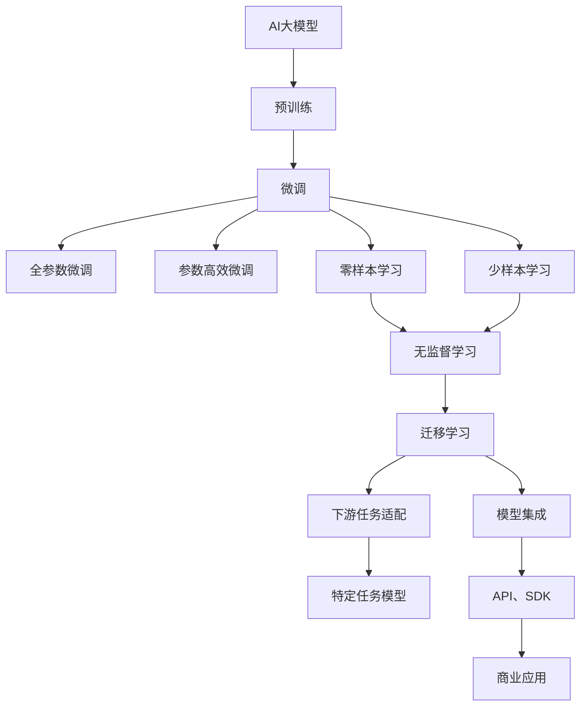

                 

## 1. 背景介绍

### 1.1 问题由来

随着人工智能技术的快速发展，人工智能大模型（AI Large Model）正在成为引领科技前沿的明星技术。从AlphaGo、BERT、GPT-3，到OpenAI的ChatGPT，AI大模型在各个领域展示了强大的应用能力。AI大模型的兴起不仅颠覆了科技行业，也为各行各业带来了前所未有的机遇和挑战。然而，如何在大模型创业中抓住机遇，突破重围，是每个AI创业者面临的首要问题。本文旨在从核心概念、算法原理、项目实践、应用场景等方面全面探讨AI大模型创业的机遇与挑战，为有意从事大模型创业的开发者提供指导。

### 1.2 问题核心关键点

AI大模型创业的核心关键点在于如何构建、部署并优化大模型，使其能够适应不同的应用场景，同时最大化其商业价值。这包括：

- **构建大模型**：选择合适的预训练模型，并通过微调、细粒度迁移学习等技术，适配具体的业务场景。
- **部署与优化**：在大规模数据上训练大模型，同时在资源受限的环境中高效运行。
- **商业化**：将大模型集成到实际应用中，并通过API、SDK等方式对外提供服务，获取商业收入。

### 1.3 问题研究意义

AI大模型创业的研究意义在于：

1. **提升生产力**：通过大模型自动化、智能化的能力，大幅提升各行业的生产效率和服务质量。
2. **开辟新市场**：AI大模型为传统行业带来了全新的业务模式和技术路径，催生出全新的市场机会。
3. **增强竞争力**：AI大模型赋能企业提升竞争力，获得更高的市场份额和行业领导地位。
4. **推动技术进步**：AI大模型的开发与应用促进了深度学习、自然语言处理、计算机视觉等前沿技术的进步。

## 2. 核心概念与联系

### 2.1 核心概念概述

AI大模型的创业过程中涉及多个核心概念，这些概念之间有着紧密的联系。

- **AI大模型**：指通过自监督学习或监督学习，在大规模数据上预训练而成的深度学习模型。具有强大的语言理解和生成能力，能够处理复杂的NLP任务。
- **微调与迁移学习**：在大模型基础上，通过有监督学习优化模型在特定任务上的性能，称为微调（Fine-Tuning）；将大模型知识迁移到其他相关任务中，称为迁移学习（Transfer Learning）。
- **预训练与微调**：大模型首先在无标签数据上进行预训练，然后在小规模标注数据上进行微调，以适应具体任务需求。
- **参数高效微调**：在微调过程中，仅更新模型中的少量参数，以提高效率和减少过拟合风险。
- **零样本与少样本学习**：在没有任何标注数据的情况下，通过精心设计的输入模板，引导模型进行推理和生成，称为零样本学习（Zero-shot Learning）；在少量标注数据下，通过输入模板引导模型生成输出，称为少样本学习（Few-shot Learning）。

这些核心概念构成了AI大模型创业的基本框架，了解这些概念之间的联系和作用，对于成功构建大模型至关重要。

### 2.2 概念间的关系

这些核心概念之间的关系可以通过以下Mermaid流程图来展示：



这个流程图展示了AI大模型创业的主要过程：

1. 预训练模型在无标签数据上学习通用的语言表示。
2. 通过微调（包括全参数微调和参数高效微调）将模型适配到具体任务上。
3. 利用零样本和少样本学习技术，减少对标注数据的依赖。
4. 通过迁移学习将大模型知识迁移到其他相关任务中。
5. 集成预训练和微调后的模型，提供API、SDK等接口，实现商业化应用。

这些概念之间的关系共同构成了AI大模型创业的完整生态系统。

## 3. 核心算法原理 & 具体操作步骤
### 3.1 算法原理概述

AI大模型的核心算法原理主要基于深度学习中的自监督学习、监督学习和迁移学习。

自监督学习通过在大规模无标签数据上预训练模型，学习到通用的语言表示和特征。监督学习通过在有标签数据上进行微调，将模型适配到特定任务上。迁移学习则通过将大模型知识迁移到其他相关任务中，提高模型的泛化能力和性能。

### 3.2 算法步骤详解

AI大模型的核心算法步骤包括以下几个关键环节：

1. **数据准备**：收集并处理数据，分为预训练数据和微调数据。预训练数据通常是无标签的文本数据，微调数据是有标签的任务数据。
2. **预训练**：在大规模无标签数据上训练大模型，学习通用的语言表示。
3. **微调**：在有标签数据上进行微调，适应特定任务需求。
4. **模型评估与优化**：在验证集上评估模型性能，通过调参优化模型。
5. **部署与应用**：将微调后的模型集成到应用中，提供API、SDK等接口，实现商业化应用。

### 3.3 算法优缺点

AI大模型的核心算法具有以下优点：

- **高效性**：通过预训练和微调技术，在大规模数据上训练模型，能够快速适应新任务，提升效率。
- **通用性**：模型在大规模数据上预训练后，可以适应多种任务需求，具有广泛的应用潜力。
- **性能提升**：通过微调和迁移学习，能够显著提升模型在特定任务上的性能。

同时，也存在一些缺点：

- **数据依赖**：模型训练和微调需要大量高质量的标注数据，获取成本高。
- **过拟合风险**：小规模微调数据容易发生过拟合，需要正则化技术来避免。
- **计算资源需求高**：模型训练和微调需要大量的计算资源，对硬件要求高。

### 3.4 算法应用领域

AI大模型的核心算法广泛应用于自然语言处理（NLP）、计算机视觉（CV）、语音识别（ASR）、推荐系统等多个领域。在NLP领域，大模型被广泛用于文本分类、情感分析、机器翻译、命名实体识别等任务。在CV领域，大模型被用于图像分类、目标检测、图像生成等任务。在ASR领域，大模型被用于语音识别、语音合成等任务。在推荐系统领域，大模型被用于用户行为预测、个性化推荐等任务。

## 4. 数学模型和公式 & 详细讲解  
### 4.1 数学模型构建

AI大模型的数学模型主要基于深度神经网络架构，包括卷积神经网络（CNN）、递归神经网络（RNN）、变分自编码器（VAE）、生成对抗网络（GAN）等。以Transformer模型为例，其基本架构如下：

```
Encoder：Multilayer Transformer
Decoder：Multilayer Transformer
Attention
Layer Normalization
Feedforward Neural Networks
```

### 4.2 公式推导过程

Transformer模型的核心公式为：

$$
\mathrm{Attention(Q, K, V) = \frac{QK^T}{\sqrt{d_k}} \cdot V = S_{attn} \cdot V
$$

其中，$Q$、$K$、$V$分别表示查询向量、键向量和值向量，$d_k$表示键向量的维度。$S_{attn}$表示注意力权重，通过softmax函数计算。

### 4.3 案例分析与讲解

以情感分析任务为例，利用BERT模型进行情感分类。首先，将文本数据进行预处理，生成token ids和相应的attention mask。然后，通过BERT模型得到每个词的向量表示，并计算每个词的情感标签概率。最后，通过softmax函数得到整个句子的情感分类概率，并选取概率最大的类别作为预测结果。

## 5. 项目实践：代码实例和详细解释说明
### 5.1 开发环境搭建

1. **安装Python和相关库**：
   ```bash
   pip install pytorch transformers
   ```

2. **数据准备**：收集并预处理数据集，分为训练集、验证集和测试集。

3. **模型选择与微调**：
   ```python
   from transformers import BertTokenizer, BertForSequenceClassification
   model = BertForSequenceClassification.from_pretrained('bert-base-uncased', num_labels=2)
   ```

### 5.2 源代码详细实现

```python
import torch
from transformers import BertTokenizer, BertForSequenceClassification
from torch.utils.data import Dataset, DataLoader
from sklearn.model_selection import train_test_split

class SentimentDataset(Dataset):
    def __init__(self, texts, labels):
        self.tokenizer = BertTokenizer.from_pretrained('bert-base-uncased')
        self.texts = texts
        self.labels = labels
        
    def __len__(self):
        return len(self.texts)
    
    def __getitem__(self, idx):
        text = self.texts[idx]
        label = self.labels[idx]
        
        encoding = self.tokenizer(text, truncation=True, padding='max_length', max_length=512, return_tensors='pt')
        input_ids = encoding['input_ids']
        attention_mask = encoding['attention_mask']
        
        label = torch.tensor(label, dtype=torch.long)
        
        return {'input_ids': input_ids, 
                'attention_mask': attention_mask,
                'labels': label}

# 数据准备
tokenizer = BertTokenizer.from_pretrained('bert-base-uncased')
texts, labels = read_data('data.txt')
train_texts, test_texts, train_labels, test_labels = train_test_split(texts, labels, test_size=0.2)

# 模型定义与微调
model = BertForSequenceClassification.from_pretrained('bert-base-uncased', num_labels=2)
device = torch.device('cuda' if torch.cuda.is_available() else 'cpu')
model.to(device)
optimizer = torch.optim.Adam(model.parameters(), lr=2e-5)

# 训练与评估
def train(model, dataloader, optimizer):
    model.train()
    for batch in dataloader:
        input_ids = batch['input_ids'].to(device)
        attention_mask = batch['attention_mask'].to(device)
        labels = batch['labels'].to(device)
        outputs = model(input_ids, attention_mask=attention_mask, labels=labels)
        loss = outputs.loss
        loss.backward()
        optimizer.step()

def evaluate(model, dataloader):
    model.eval()
    predictions = []
    targets = []
    with torch.no_grad():
        for batch in dataloader:
            input_ids = batch['input_ids'].to(device)
            attention_mask = batch['attention_mask'].to(device)
            batch_labels = batch['labels'].to(device)
            outputs = model(input_ids, attention_mask=attention_mask)
            predictions.append(outputs.logits.argmax(dim=1))
            targets.append(batch_labels)
    predictions = torch.cat(predictions)
    targets = torch.cat(targets)
    return predictions, targets

# 训练与评估
for epoch in range(10):
    train(model, DataLoader(SentimentDataset(train_texts, train_labels), batch_size=16))
    predictions, targets = evaluate(model, DataLoader(SentimentDataset(test_texts, test_labels), batch_size=16))
    accuracy = (predictions == targets).float().mean().item()
    print(f'Epoch {epoch+1}, Accuracy: {accuracy:.4f}')
```

### 5.3 代码解读与分析

以上代码展示了利用BERT模型进行情感分析的完整流程，包括数据准备、模型定义、训练和评估等关键步骤。通过读取数据集，将其分为训练集和测试集，然后使用BERT模型进行情感分类。训练过程中，使用Adam优化器进行模型更新，并在测试集上评估模型性能。

## 6. 实际应用场景
### 6.1 智能客服系统

AI大模型在智能客服系统中的应用，通过自然语言处理技术，能够理解客户提出的问题，并给出合适的回答。系统首先通过微调BERT模型，学习用户意图和上下文信息，然后根据用户问题生成合适的回答。通过持续收集用户反馈，系统可以不断优化回答质量，提高客户满意度。

### 6.2 金融舆情监测

在金融领域，利用AI大模型进行舆情监测，通过文本分类和情感分析技术，实时监测市场舆情变化，及时发现潜在的风险和机会。通过微调BERT模型，能够准确识别出金融新闻中的情感倾向，从而指导投资决策。

### 6.3 个性化推荐系统

在推荐系统中，利用AI大模型进行用户行为预测和个性化推荐。通过微调BERT模型，学习用户的兴趣和行为模式，并根据推荐结果的反馈进行模型优化。系统能够提供更加精准、个性化的推荐内容，提升用户满意度。

### 6.4 未来应用展望

未来，AI大模型的应用领域将更加广泛，涵盖更多行业和场景。例如，在医疗领域，利用AI大模型进行疾病预测、诊断和治疗方案推荐。在教育领域，利用AI大模型进行智能辅导和课程推荐。在智慧城市领域，利用AI大模型进行交通管理、公共安全等任务。

## 7. 工具和资源推荐
### 7.1 学习资源推荐

1. **《深度学习入门：基于Python的理论与实现》**：适合初学者学习深度学习的基本概念和实现技术。
2. **《TensorFlow实战》**：介绍TensorFlow的高级应用和优化技巧。
3. **《Transformers实战》**：展示Transformer模型在不同NLP任务中的应用。
4. **《Kaggle竞赛指南》**：通过参加Kaggle竞赛，提高数据分析和模型构建能力。
5. **《自然语言处理综述》**：了解NLP领域的前沿技术和应用案例。

### 7.2 开发工具推荐

1. **PyTorch**：深度学习框架，支持动态计算图和丰富的模型库。
2. **TensorFlow**：支持静态计算图和分布式训练。
3. **Jupyter Notebook**：交互式编程环境，方便进行模型训练和调试。
4. **TensorBoard**：模型训练可视化工具，帮助理解模型行为。
5. **Weights & Biases**：模型训练实验管理工具，记录和分析模型性能。

### 7.3 相关论文推荐

1. **Attention is All You Need**：Transformer模型的原始论文，介绍自注意力机制。
2. **BERT: Pre-training of Deep Bidirectional Transformers for Language Understanding**：BERT模型的论文，介绍预训练和微调技术。
3. **Parameter-Efficient Transfer Learning for NLP**：介绍参数高效微调方法，提高微调效率。
4. **Scalable Mixture-of-Experts Models**：介绍混合专家模型，优化模型计算资源。
5. **Revisiting Zero-Shot Transfer Learning with Language Models**：介绍零样本学习技术，提高模型泛化能力。

## 8. 总结：未来发展趋势与挑战
### 8.1 总结

本文详细介绍了AI大模型创业的核心概念、算法原理和具体操作步骤，并提供了项目实践和实际应用场景的详细分析。通过系统学习这些内容，可以更好地理解和应用AI大模型，抓住未来创业机遇。

### 8.2 未来发展趋势

未来AI大模型的发展趋势包括：

1. **模型规模继续增大**：预训练模型参数量将持续增加，带来更强大的语言表示能力。
2. **模型应用更加广泛**：覆盖更多行业和场景，带来新的商业机会。
3. **模型训练更加高效**：通过硬件优化和算法改进，提升训练和推理效率。
4. **模型性能更加稳定**：通过持续学习、知识蒸馏等技术，提升模型的泛化能力和鲁棒性。
5. **模型安全性得到保障**：通过数据清洗、隐私保护等措施，提高模型安全性。

### 8.3 面临的挑战

AI大模型创业面临的挑战包括：

1. **数据获取成本高**：标注数据获取和处理成本高，影响模型训练和微调效果。
2. **计算资源需求高**：大模型训练和微调需要高算力硬件和丰富的计算资源。
3. **模型泛化能力有限**：小规模微调数据容易发生过拟合，泛化能力有限。
4. **模型安全性和可信性**：模型可能存在偏见和有害输出，需要进一步优化和审查。
5. **模型可解释性不足**：模型决策过程难以解释，缺乏透明性。

### 8.4 研究展望

未来研究需要重点关注以下方向：

1. **数据高效利用**：通过数据增强、主动学习等技术，提高数据利用效率。
2. **计算资源优化**：通过硬件加速、模型压缩等技术，降低计算资源需求。
3. **模型公平性和可信性**：通过公平性约束和隐私保护措施，提高模型可信性。
4. **模型可解释性**：通过可解释性技术，提升模型决策透明性。
5. **模型应用多样化**：通过多模态融合、跨领域迁移等技术，拓展模型应用场景。

## 9. 附录：常见问题与解答

**Q1: 如何选择合适的预训练模型？**

A: 选择预训练模型时，需要考虑模型架构、参数规模、应用场景等因素。例如，对于NLP任务，可以选择BERT、GPT-3等预训练模型，对于计算机视觉任务，可以选择ResNet、Inception等预训练模型。

**Q2: 如何评估模型性能？**

A: 模型性能评估主要通过准确率、召回率、F1分数等指标进行。在训练过程中，可以使用验证集评估模型性能，并通过超参数调优提高模型效果。

**Q3: 如何提高模型泛化能力？**

A: 提高模型泛化能力，可以通过数据增强、正则化、对抗训练等技术。例如，在训练过程中加入噪声数据、对抗样本等，提升模型鲁棒性和泛化能力。

**Q4: 如何优化模型训练过程？**

A: 优化模型训练过程，可以通过学习率调整、批处理大小、模型并行等技术。例如，使用学习率衰减策略，逐步减小学习率，防止过拟合。

---

作者：禅与计算机程序设计艺术 / Zen and the Art of Computer Programming

