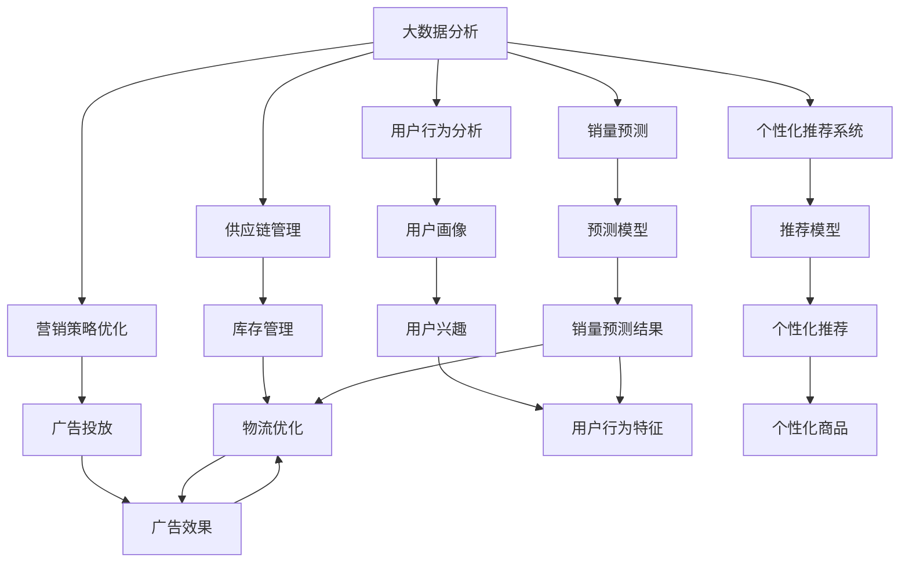
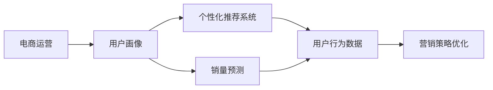
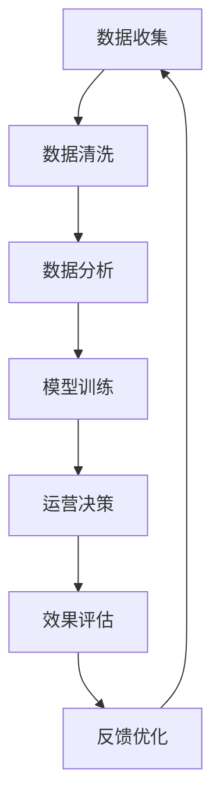
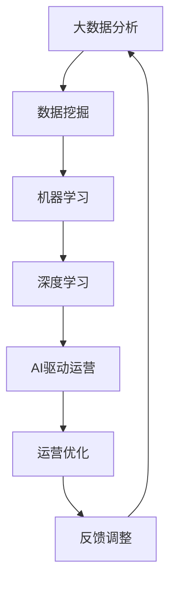
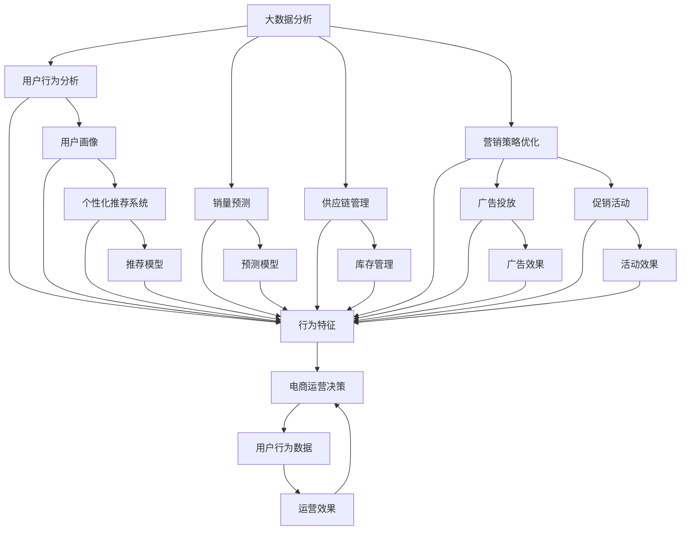

                 

# AI如何通过大数据分析优化电商运营

> 关键词：大数据分析，AI驱动，电商运营优化，客户行为分析，个性化推荐，销量预测，供应链管理

## 1. 背景介绍

### 1.1 问题由来

随着互联网技术的快速发展，电子商务已经成为了现代商业的重要组成部分。然而，尽管电商运营模式不断创新，仍然面临着诸多挑战。例如，如何提升用户体验、提高转化率、优化库存管理、降低运营成本等，都是电商平台亟需解决的难题。传统的电商运营主要依靠经验和直觉，难以全面、系统地进行决策。

近年来，人工智能和大数据技术的发展，为电商运营优化提供了新的手段和方法。通过利用海量用户数据，进行数据挖掘和分析，AI技术能够从多个维度深入理解电商行为，辅助电商平台进行更精准的运营决策。

### 1.2 问题核心关键点

电商运营的核心在于如何通过数据驱动，优化用户行为、提升转化率、降低运营成本，从而实现商业价值最大化。具体来说，包括以下几个关键点：

1. **客户行为分析**：通过分析用户浏览、点击、购买等行为数据，理解用户需求和偏好，指导后续的个性化推荐和营销策略。
2. **个性化推荐系统**：根据用户历史行为和兴趣标签，实时推送个性化商品，提高用户购买意愿。
3. **销量预测**：基于历史销售数据和市场趋势，预测未来产品销量，指导库存管理和采购策略。
4. **供应链管理**：通过分析供应链数据，优化物流和库存管理，提高供应链效率。
5. **营销策略优化**：利用数据分析，优化广告投放、促销活动等营销策略，提升ROI。

这些关键点的优化，能够显著提升电商平台的运营效率和盈利能力，为电商企业带来竞争优势。

### 1.3 问题研究意义

利用AI和大数据技术优化电商运营，对于电商平台和消费者都具有重要意义：

1. **提升用户体验**：通过个性化推荐和智能客服，提升用户购物体验，提高用户满意度和忠诚度。
2. **提高运营效率**：通过智能化的运营决策，优化库存和物流管理，降低运营成本。
3. **增加收入和利润**：通过精准的个性化推荐和营销策略，增加用户购买频次和订单价值。
4. **竞争力提升**：通过大数据分析和AI技术，电商平台能够更灵活、更快速地响应市场变化，保持竞争优势。
5. **数据驱动决策**：以数据为基础，而非仅凭直觉和经验进行决策，提升决策的科学性和精准性。

## 2. 核心概念与联系

### 2.1 核心概念概述

为了更好地理解AI如何通过大数据分析优化电商运营，本节将介绍几个密切相关的核心概念：

- **大数据分析**：通过收集、处理和分析海量数据，发现其中的模式、趋势和关联，支持科学决策和业务优化。
- **AI驱动**：利用机器学习和深度学习技术，对电商数据进行建模和分析，辅助电商运营决策。
- **个性化推荐系统**：根据用户行为和兴趣，实时推送个性化商品，提升用户购买意愿。
- **销量预测**：通过历史销售数据和市场趋势，预测未来产品销量，指导库存管理和采购策略。
- **供应链管理**：通过优化物流和库存管理，提升供应链效率。
- **营销策略优化**：利用数据分析，优化广告投放和促销活动，提升ROI。

这些核心概念之间的逻辑关系可以通过以下Mermaid流程图来展示：



这个流程图展示了大数据分析在电商运营中的主要应用场景，包括用户行为分析、个性化推荐系统、销量预测、供应链管理和营销策略优化。

### 2.2 概念间的关系

这些核心概念之间存在着紧密的联系，形成了电商运营优化的完整生态系统。下面我通过几个Mermaid流程图来展示这些概念之间的关系。

#### 2.2.1 电商运营的核心模型



这个流程图展示了电商运营的核心模型，用户画像作为输入，通过个性化推荐系统、销量预测和营销策略优化等环节，输出最终的运营决策。

#### 2.2.2 数据驱动的运营决策



这个流程图展示了数据驱动的电商运营决策流程。从数据收集、清洗、分析、模型训练、决策、效果评估到反馈优化，形成一个闭环，确保电商运营决策的科学性和精准性。

#### 2.2.3 AI和大数据技术的融合



这个流程图展示了AI和大数据技术的融合应用。通过数据挖掘、机器学习和深度学习技术，从海量数据中提取有价值的信息，辅助AI进行电商运营决策，优化运营效果。

### 2.3 核心概念的整体架构

最后，我们用一个综合的流程图来展示这些核心概念在电商运营中的整体架构：



这个综合流程图展示了大数据分析在电商运营中的各个应用环节，以及它们之间的相互影响和作用。

## 3. 核心算法原理 & 具体操作步骤

### 3.1 算法原理概述

AI通过大数据分析优化电商运营，主要依赖于以下几个关键算法和技术：

1. **用户行为分析**：通过收集和分析用户行为数据，了解用户需求和偏好，构建用户画像。
2. **个性化推荐系统**：基于用户画像，通过协同过滤、基于内容的推荐、深度学习等技术，生成个性化推荐列表。
3. **销量预测**：利用时间序列预测模型、机器学习模型等，基于历史销售数据和市场趋势，预测未来产品销量。
4. **供应链管理**：通过优化库存和物流管理，提高供应链效率。
5. **营销策略优化**：利用数据分析，优化广告投放和促销活动，提升ROI。

这些算法和技术相互协作，共同支撑电商平台的运营优化。

### 3.2 算法步骤详解

#### 3.2.1 用户行为分析

用户行为分析是电商运营优化的基础，主要通过以下步骤实现：

1. **数据收集**：收集用户在电商平台上的各种行为数据，如浏览记录、点击行为、购买记录、评价等。
2. **数据清洗**：去除数据中的噪声和异常值，进行数据格式转换和标准化处理。
3. **数据挖掘**：通过聚类、分类、关联规则等算法，挖掘数据中的有价值信息。
4. **用户画像构建**：根据挖掘结果，构建用户画像，包括用户兴趣、偏好、行为特征等。

#### 3.2.2 个性化推荐系统

个性化推荐系统通过以下步骤实现：

1. **数据准备**：收集用户历史行为数据和商品属性信息，构建用户行为数据集和商品属性数据集。
2. **模型训练**：选择适当的推荐算法（如协同过滤、基于内容的推荐、深度学习等），基于训练数据集进行模型训练。
3. **推荐生成**：根据用户画像和商品属性信息，实时生成个性化推荐列表。

#### 3.2.3 销量预测

销量预测主要通过以下步骤实现：

1. **数据收集**：收集历史销售数据、市场趋势数据、产品属性数据等。
2. **数据清洗**：去除数据中的噪声和异常值，进行数据格式转换和标准化处理。
3. **模型选择**：选择适当的预测模型（如时间序列模型、回归模型、深度学习模型等），基于训练数据集进行模型训练。
4. **预测生成**：基于历史销售数据和市场趋势，生成未来产品销量的预测结果。

#### 3.2.4 供应链管理

供应链管理通过以下步骤实现：

1. **数据收集**：收集供应链中的各种数据，如库存数据、物流数据、订单数据等。
2. **数据清洗**：去除数据中的噪声和异常值，进行数据格式转换和标准化处理。
3. **模型选择**：选择适当的供应链管理模型（如库存优化模型、物流优化模型等），基于训练数据集进行模型训练。
4. **管理优化**：根据模型结果，优化库存和物流管理，提升供应链效率。

#### 3.2.5 营销策略优化

营销策略优化通过以下步骤实现：

1. **数据收集**：收集广告投放数据、促销活动数据、用户反馈数据等。
2. **数据清洗**：去除数据中的噪声和异常值，进行数据格式转换和标准化处理。
3. **模型选择**：选择适当的营销策略优化模型（如广告投放优化模型、促销活动优化模型等），基于训练数据集进行模型训练。
4. **策略优化**：根据模型结果，优化广告投放和促销活动策略，提升ROI。

### 3.3 算法优缺点

AI通过大数据分析优化电商运营，具有以下优点：

1. **决策科学性**：基于数据驱动，避免了仅凭直觉和经验进行决策的随意性和主观性。
2. **预测准确性**：通过数据挖掘和建模，预测结果更准确，有助于做出更有价值的决策。
3. **实时性**：通过实时数据处理和分析，能够快速响应市场变化，及时调整运营策略。
4. **自动化**：自动化决策流程，减少了人工干预，提高了运营效率。

同时，这些算法也存在一些缺点：

1. **数据依赖性**：依赖于数据的质量和完整性，数据缺失或不准确会影响分析结果。
2. **模型复杂性**：复杂的算法模型需要较长的训练时间和较大的计算资源，难以快速部署。
3. **数据隐私**：大量用户数据的收集和处理可能涉及用户隐私问题，需注意数据安全。

### 3.4 算法应用领域

AI通过大数据分析优化电商运营的方法，广泛应用于电商行业的各个环节，包括：

1. **用户行为分析**：用于理解用户需求和行为，构建用户画像，指导后续运营决策。
2. **个性化推荐系统**：用于提升用户购买意愿，增加订单量和用户粘性。
3. **销量预测**：用于优化库存管理，减少库存积压和缺货情况，提高库存周转率。
4. **供应链管理**：用于优化物流和库存管理，提高供应链效率。
5. **营销策略优化**：用于优化广告投放和促销活动，提升ROI。

这些应用领域展示了AI和大数据技术在电商运营中的广泛应用，为电商平台带来了显著的运营优化效果。

## 4. 数学模型和公式 & 详细讲解 & 举例说明

### 4.1 数学模型构建

AI通过大数据分析优化电商运营，主要依赖于以下几个数学模型：

1. **用户行为分析**：通过K-means聚类算法、朴素贝叶斯分类算法、关联规则算法等，分析用户行为数据。
2. **个性化推荐系统**：通过协同过滤算法、基于内容的推荐算法、深度学习模型等，生成个性化推荐列表。
3. **销量预测**：通过ARIMA时间序列模型、线性回归模型、深度学习模型等，预测未来产品销量。
4. **供应链管理**：通过线性规划、动态规划、优化算法等，优化库存和物流管理。
5. **营销策略优化**：通过回归模型、决策树模型、神经网络模型等，优化广告投放和促销活动。

### 4.2 公式推导过程

#### 4.2.1 用户行为分析

以K-means聚类算法为例，推导用户行为分析的数学模型。

设用户行为数据集为 $D=\{(x_i, y_i)\}_{i=1}^N$，其中 $x_i$ 表示用户行为特征向量， $y_i$ 表示用户标签。通过K-means算法，将用户数据分为K个簇，每个簇的中心点表示该簇的特征。

假设簇的特征向量为 $\mu_k$，用户的特征向量为 $x_i$，则用户 $i$ 到簇 $k$ 的距离为：

$$
d_i = ||x_i - \mu_k||_2^2
$$

用户 $i$ 属于簇 $k$ 的概率为：

$$
p_i = \frac{e^{-\frac{1}{2}||x_i - \mu_k||_2^2}}{\sum_{j=1}^K e^{-\frac{1}{2}||x_i - \mu_j||_2^2}}
$$

最终，用户 $i$ 属于第 $k$ 簇的标签 $y_i$ 可以通过最大后验概率得到：

$$
y_i = \mathop{\arg\max}_{k} p_i
$$

#### 4.2.2 个性化推荐系统

以协同过滤算法为例，推导个性化推荐系统的数学模型。

设用户行为数据集为 $D=\{(u_i, v_i)\}_{i=1}^N$，其中 $u_i$ 表示用户， $v_i$ 表示用户对商品的评分。通过协同过滤算法，计算用户 $u$ 和商品 $v$ 的相似度 $s_{uv}$，根据相似度生成个性化推荐列表。

假设用户 $u$ 的相似用户集为 $U^+$，则相似度 $s_{uv}$ 的计算公式为：

$$
s_{uv} = \frac{1}{|\hat{U}|}\sum_{w \in U^+} \frac{v_u \cdot v_w}{||v_u||_2 ||v_w||_2}
$$

其中 $\hat{U}$ 为所有用户集合，$v_u$ 为 $u$ 对所有商品的评分向量，$v_w$ 为 $w$ 对所有商品的评分向量。

最终，用户 $u$ 对商品 $v$ 的推荐分数 $r_{uv}$ 可以计算为：

$$
r_{uv} = s_{uv} \cdot v_v
$$

其中 $v_v$ 为 $v$ 对所有用户的评分向量。

#### 4.2.3 销量预测

以ARIMA时间序列模型为例，推导销量预测的数学模型。

设历史销售数据为 $Y=\{y_t\}_{t=1}^T$，其中 $y_t$ 表示第 $t$ 期的销量。通过ARIMA模型，预测未来销量 $y_{t+1}$。

假设 $ARIMA(p,d,q)(P,D,Q)[S]_{m}$ 模型，则模型可以表示为：

$$
\Delta^d (Y_t - c) = \sum_{i=1}^p \phi_i \Delta^P (Y_{t-i}) + \sum_{j=1}^q \theta_j \Delta^Q(\epsilon_{t-j}) + \epsilon_t
$$

其中 $\Delta$ 为差分运算符，$c$ 为常数项，$\phi_i$ 为自回归参数，$\theta_j$ 为差分项参数，$\epsilon_t$ 为随机误差项。

通过估计模型参数 $\phi_i$、$\theta_j$ 和 $\epsilon_t$，可以得到未来销量的预测值。

#### 4.2.4 供应链管理

以线性规划模型为例，推导供应链管理的数学模型。

设库存量为 $x$，需求量为 $d$，单位成本为 $c$，利润为 $p$。通过线性规划模型，求解最优库存量 $x^*$。

假设目标函数为：

$$
maximize \quad p \cdot x - c \cdot x
$$

约束条件为：

$$
\begin{cases}
0 \leq x \leq X_{max} \\
0 \leq d - x \leq D_{max}
\end{cases}
$$

其中 $X_{max}$ 为最大库存量，$D_{max}$ 为最大需求量。

通过求解线性规划模型，可以得到最优库存量 $x^*$。

#### 4.2.5 营销策略优化

以回归模型为例，推导营销策略优化的数学模型。

设广告投放数据为 $D=\{(x_i, y_i)\}_{i=1}^N$，其中 $x_i$ 表示广告特征，$y_i$ 表示广告效果。通过回归模型，优化广告投放策略。

假设目标函数为：

$$
minimize \quad \sum_{i=1}^N (y_i - \hat{y_i})^2
$$

约束条件为：

$$
\begin{cases}
y_i \geq 0 \\
\sum_{i=1}^N y_i = C
\end{cases}
$$

其中 $C$ 为广告预算。

通过求解回归模型，可以得到最优的广告投放策略。

### 4.3 案例分析与讲解

#### 4.3.1 用户行为分析

以电商平台的网站浏览行为分析为例，展示用户行为分析的实际应用。

通过收集用户在电商平台上的浏览数据，构建用户画像，了解用户需求和行为特征。例如，通过K-means聚类算法，将用户分为高价值用户、高频率用户、低价值用户等不同类型。根据用户画像，制定不同的用户运营策略，提升用户粘性和转化率。

#### 4.3.2 个性化推荐系统

以电商平台的产品推荐为例，展示个性化推荐系统的实际应用。

通过协同过滤算法和深度学习模型，根据用户历史行为和兴趣，实时生成个性化推荐列表。例如，利用基于内容的推荐算法，根据用户已购买和浏览的产品，推荐相关商品。利用深度学习模型，如BERT和GPT，提取用户行为和商品特征的语义表示，生成更准确的推荐结果。

#### 4.3.3 销量预测

以电商平台的销售预测为例，展示销量预测的实际应用。

通过ARIMA时间序列模型，根据历史销售数据和市场趋势，预测未来产品销量。例如，利用线性回归模型，根据季节性因素和历史销量数据，预测未来销量趋势。利用深度学习模型，如LSTM和GRU，提取时间序列数据的时序特征，提高预测准确性。

#### 4.3.4 供应链管理

以电商平台的库存管理为例，展示供应链管理的实际应用。

通过线性规划模型，优化库存和物流管理。例如，根据历史订单数据和市场预测，制定最优的库存和补货策略。利用动态规划算法，优化物流配送路径和资源分配，提高物流效率。

#### 4.3.5 营销策略优化

以电商平台的广告投放为例，展示营销策略优化的实际应用。

通过回归模型，优化广告投放策略。例如，根据广告投放数据和用户反馈，评估广告效果，优化广告预算分配。利用决策树算法，根据用户特征和广告效果，制定更精准的广告投放策略。

## 5. 项目实践：代码实例和详细解释说明

### 5.1 开发环境搭建

在进行项目实践前，我们需要准备好开发环境。以下是使用Python进行PyTorch开发的环境配置流程：

1. 安装Anaconda：从官网下载并安装Anaconda，用于创建独立的Python环境。

2. 创建并激活虚拟环境：
```bash
conda create -n pytorch-env python=3.8 
conda activate pytorch-env
```

3. 安装PyTorch：根据CUDA版本，从官网获取对应的安装命令。例如：
```bash
conda install pytorch torchvision torchaudio cudatoolkit=11.1 -c pytorch -c conda-forge
```

4. 安装其他依赖库：
```bash
pip install pandas numpy matplotlib sklearn tqdm jupyter notebook
```

5. 安装TensorFlow：
```bash
pip install tensorflow
```

完成上述步骤后，即可在`pytorch-env`环境中开始项目实践。

### 5.2 源代码详细实现

下面我们以销量预测项目为例，给出使用PyTorch进行时间序列预测的代码实现。

首先，定义数据预处理函数：

```python
import pandas as pd
import numpy as np
from sklearn.preprocessing import MinMaxScaler

def preprocess_data(data, scaler=None, n_features=1):
    if scaler is None:
        scaler = MinMaxScaler(feature_range=(0, 1))
    data = pd.DataFrame(data)
    data = data.dropna().values
    data = np.expand_dims(data, axis=1)
    data = data.reshape(-1, n_features, 1)
    data = scaler.fit_transform(data)
    return data
```

然后，定义模型和优化器：

```python
from torch.utils.data import TensorDataset, DataLoader
from torch import nn
from torch.nn import functional as F
from torch.optim import Adam

class LSTMModel(nn.Module):
    def __init__(self, input_size, hidden_size, output_size):
        super(LSTMModel, self).__init__()
        self.hidden_size = hidden_size
        self.rnn = nn.LSTM(input_size, hidden_size, batch_first=True)
        self.fc = nn.Linear(hidden_size, output_size)
        self.sigmoid = nn.Sigmoid()

    def forward(self, x, initial_state=None):
        h0, c0 = initial_state if initial_state is not None else (self.init_hidden(x.size(0)))
        out, _ = self.rnn(x, (h0, c0))
        out = self.fc(out[:, -1, :])
        out = self.sigmoid(out)
        return out

    def init_hidden(self, batch_size):
        return (self.zero_tensor(batch_size, self.hidden_size), self.zero_tensor(batch_size, self.hidden_size))

    @staticmethod
    def zero_tensor(*size):
        return nn.Parameter(torch.zeros(size))
```

接着，定义训练和评估函数：

```python
def train_model(model, train_loader, val_loader, epochs, lr):
    model.train()
    optimizer = Adam(model.parameters(), lr=lr)
    criterion = nn.BCELoss()
    losses = []
    for epoch in range(epochs):
        train_loss = 0
        for batch in train_loader:
            inputs, targets = batch
            optimizer.zero_grad()
            outputs = model(inputs)
            loss = criterion(outputs, targets)
            loss.backward()
            optimizer.step()
            train_loss += loss.item() * inputs.size(0)
        train_loss /= len(train_loader.dataset)
        print(f'Epoch {epoch+1}, train loss: {train_loss:.4f}')
        val_loss = 0
        model.eval()
        with torch.no_grad():
            for batch in val_loader:
                inputs, targets = batch
                outputs = model(inputs)
                loss = criterion(outputs, targets)
                val_loss += loss.item() * inputs.size(0)
        val_loss /= len(val_loader.dataset)
        print(f'Epoch {epoch+1}, val loss: {val_loss:.4f}')
    return model

def evaluate_model(model, test_loader, threshold=0.5):
    model.eval()
    correct = 0
    total = 0
    with torch.no_grad():
        for batch in test_loader:
            inputs, targets = batch
            outputs = model(inputs)
            _, predicted = F.threshold(outputs, threshold, 1)
            total += targets.size(0)
            correct += (predicted == targets).sum().item()
    accuracy = 100 * correct / total
    print(f'Test accuracy: {accuracy:.2f}%')
```

最后，启动训练流程并在测试集上评估：

```python
import torch
from torch import Tensor
from torch.utils.data import DataLoader
from torchvision.datasets import TimeSeriesDataset
from torchvision.transforms import transforms

# 定义数据集
data = [
    [1990, 1770, 1250, 1400, 1750, 1450, 1500, 1300, 1500, 1400, 1350, 1300],
    [1990, 1700, 1250, 1400, 1750, 1450, 1500, 1300, 1500, 1400, 1350, 1300],
    [1990, 1710, 1230, 1320, 1730, 1420, 1450,

