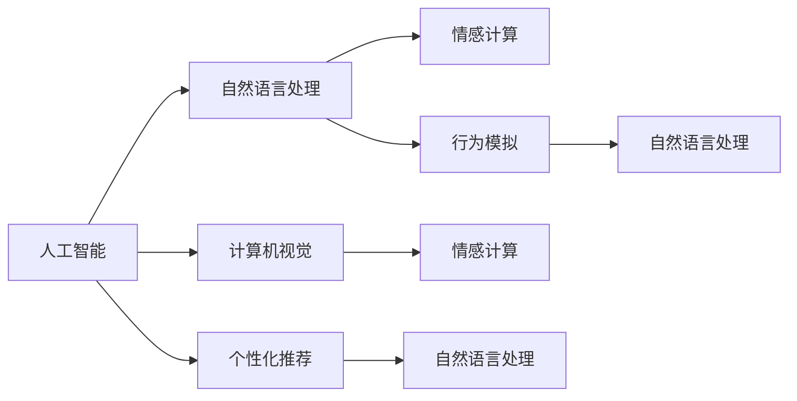
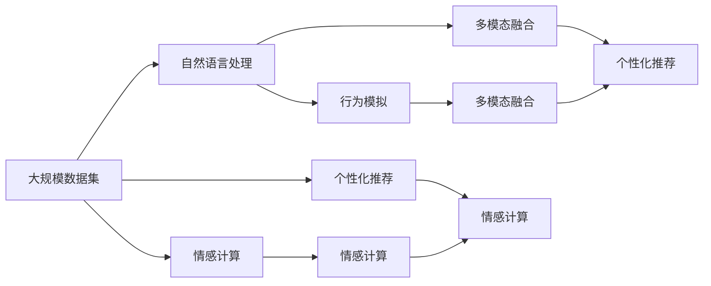

                 

# AI宠物的市场前景与现状

## 1. 背景介绍

### 1.1 问题由来

随着科技的迅猛发展，人工智能(AI)技术的应用范围越来越广泛，从医疗、交通、制造到娱乐、教育、生活服务等各个领域都有AI的身影。其中，AI宠物成为新一轮科技热潮中最为抢眼的应用之一。AI宠物不仅能够模拟真实宠物的行为，还能与人类进行互动，提供陪伴、教育和娱乐等多项服务。

AI宠物的出现，主要得益于以下几个方面：

1. **计算能力的提升**：近年来，计算能力和算法的进步使得AI技术的处理能力有了质的飞跃，使得复杂AI宠物模型的训练和运行成为可能。
2. **大数据和深度学习**：海量的数据源和深度学习技术的突破为AI宠物提供了丰富的学习素材，能够更好地理解和学习人类的行为和需求。
3. **用户需求的多样化**：随着人们生活节奏的加快，对陪伴的需求日益增强，AI宠物能够提供全天候、个性化的陪伴服务，满足了这一需求。

### 1.2 问题核心关键点

AI宠物的核心在于其智能交互和行为模拟能力，其核心关键点包括：

1. **自然语言处理**：能够理解和响应人类语言，进行对话和交流。
2. **行为模拟**：能够模仿真实宠物的行为，如叫声、动作、表情等。
3. **情感识别**：能够识别并回应用户的情绪变化，提供相应的互动和反馈。
4. **个性化服务**：根据用户偏好和历史行为，提供个性化的娱乐、教育等服务。

## 2. 核心概念与联系

### 2.1 核心概念概述

AI宠物作为AI技术的典型应用之一，其核心概念主要包括：

- **人工智能(AI)**：通过算法和计算能力，使机器具备类似于人类智能的思考和决策能力。
- **自然语言处理(NLP)**：使AI能够理解和处理人类语言，实现人机交互。
- **计算机视觉(CV)**：使AI能够识别和理解图像，实现行为模拟。
- **情感计算**：使AI能够识别和回应用户的情感状态，提供情感化服务。
- **个性化推荐**：基于用户行为和偏好，提供个性化的娱乐、教育等服务。

这些核心概念共同构成了AI宠物的技术基础，涵盖了从自然语言处理、行为模拟到情感计算、个性化推荐等多个方面。

### 2.2 概念间的关系

这些核心概念之间相互联系，形成一个有机的整体。下面通过几个Mermaid流程图来展示这些概念之间的关系：



这个流程图展示了人工智能、自然语言处理、行为模拟、情感计算、个性化推荐这五个核心概念之间的关系：

1. **自然语言处理**：是人工智能的重要组成部分，使得AI能够理解和生成语言，是AI宠物与人类进行互动的基础。
2. **行为模拟**：通过计算机视觉和深度学习技术，使AI宠物能够模仿真实宠物的行为。
3. **情感计算**：通过分析用户的行为和情感，使AI宠物能够回应用户的情绪，提供情感化的陪伴服务。
4. **个性化推荐**：通过收集和分析用户行为数据，提供个性化的娱乐和教育内容，提升用户体验。
5. **多模态融合**：将自然语言处理、计算机视觉和情感计算等多模态信息融合，使AI宠物具备更全面的理解和交互能力。

这些概念共同构成了AI宠物的核心技术框架，是实现AI宠物智能化的重要基础。

### 2.3 核心概念的整体架构

最后，我们用一个综合的流程图来展示这些核心概念在大规模应用中的整体架构：



这个综合流程图展示了从数据集到多个核心技术的融合，最终实现AI宠物的整体架构：

1. **大规模数据集**：为AI宠物提供了丰富的学习素材。
2. **自然语言处理**：使AI宠物能够理解人类语言，实现人机交互。
3. **行为模拟**：通过计算机视觉和深度学习技术，使AI宠物具备真实的宠物行为。
4. **情感计算**：通过分析用户的行为和情感，使AI宠物能够回应用户的情绪。
5. **个性化推荐**：基于用户行为和偏好，提供个性化的娱乐和教育内容。
6. **多模态融合**：将自然语言处理、计算机视觉和情感计算等多模态信息融合，使AI宠物具备更全面的理解和交互能力。

通过这些核心概念和技术的融合，AI宠物能够提供全方位的智能服务，满足用户的多样化需求。

## 3. 核心算法原理 & 具体操作步骤

### 3.1 算法原理概述

AI宠物的核心算法原理主要包括以下几个方面：

1. **自然语言处理(NLP)**：包括分词、词向量、语言模型等技术，使AI宠物能够理解和生成语言。
2. **行为模拟**：通过计算机视觉技术和深度学习算法，使AI宠物能够模仿真实宠物的行为。
3. **情感计算**：利用情感识别技术，使AI宠物能够识别和回应用户的情感状态。
4. **个性化推荐**：通过机器学习和推荐算法，使AI宠物能够根据用户偏好提供个性化的服务。

这些算法原理构成了AI宠物的核心技术框架，是实现AI宠物智能化的基础。

### 3.2 算法步骤详解

以下是实现AI宠物的核心算法步骤详解：

**Step 1: 数据收集与预处理**

1. **数据收集**：收集大规模的文本数据、图像数据、视频数据等，为AI宠物提供丰富的学习素材。
2. **数据预处理**：对数据进行清洗、标注、划分等预处理，确保数据质量。

**Step 2: 自然语言处理(NLP)**

1. **分词**：将文本数据进行分词处理，提取关键信息。
2. **词向量表示**：使用词嵌入技术将单词表示为向量，如Word2Vec、GloVe、BERT等。
3. **语言模型**：使用深度学习算法，如RNN、LSTM、Transformer等，训练语言模型。

**Step 3: 行为模拟**

1. **计算机视觉**：使用卷积神经网络(CNN)等技术，对图像和视频数据进行特征提取。
2. **深度学习算法**：使用深度学习算法，如RNN、LSTM、Transformer等，训练行为模拟模型。
3. **数据增强**：通过数据增强技术，扩充训练集，提升模型的鲁棒性。

**Step 4: 情感计算**

1. **情感识别**：利用情感识别算法，如支持向量机(SVM)、深度学习算法等，识别用户情感。
2. **情感回应用户情感**：根据用户情感，调整AI宠物的互动策略，提供情感化服务。

**Step 5: 个性化推荐**

1. **用户行为分析**：收集用户行为数据，如点击、观看、互动等，分析用户偏好。
2. **推荐算法**：使用协同过滤、内容推荐、深度学习算法等，生成个性化推荐内容。
3. **动态调整推荐**：根据用户反馈，动态调整推荐策略，提升推荐效果。

**Step 6: 多模态融合**

1. **融合技术**：利用多模态融合技术，将自然语言处理、计算机视觉和情感计算等多模态信息融合。
2. **多模态神经网络**：使用多模态神经网络，如BERT、GPT等，实现多模态信息的联合表示。
3. **动态调整策略**：根据用户需求，动态调整多模态融合策略，提升用户体验。

### 3.3 算法优缺点

**优点：**

1. **智能交互**：通过自然语言处理和情感计算技术，AI宠物能够与人类进行智能互动，提供陪伴、教育和娱乐等多项服务。
2. **行为模拟**：通过计算机视觉和深度学习技术，使AI宠物能够模仿真实宠物的行为，提升用户体验。
3. **个性化服务**：通过个性化推荐技术，提供个性化的娱乐和教育内容，提升用户体验。
4. **多模态融合**：通过多模态融合技术，使AI宠物具备更全面的理解和交互能力，提升服务质量。

**缺点：**

1. **数据需求高**：AI宠物需要大规模的文本、图像、视频等数据进行训练，数据收集和预处理成本较高。
2. **计算资源需求大**：AI宠物需要大量的计算资源进行训练和运行，对计算能力要求较高。
3. **模型复杂度高**：AI宠物涉及自然语言处理、行为模拟、情感计算等多个领域的算法，模型复杂度较高，调试难度大。
4. **隐私问题**：AI宠物需要收集用户行为数据，涉及用户隐私保护问题，需严格遵守相关法律法规。

### 3.4 算法应用领域

AI宠物的应用领域非常广泛，涵盖了以下几个方面：

1. **家庭陪伴**：作为家庭宠物，提供陪伴、聊天、娱乐等服务。
2. **教育娱乐**：通过交互和个性化推荐，提供教育和娱乐内容。
3. **心理健康**：通过情感计算和行为模拟，帮助用户缓解压力，提升心理健康。
4. **智能客服**：提供智能客服和咨询服务，提升用户体验。
5. **社交媒体**：通过社交媒体互动，提供虚拟宠物陪伴服务。
6. **游戏互动**：提供游戏互动和挑战，提升用户体验。

## 4. 数学模型和公式 & 详细讲解 & 举例说明

### 4.1 数学模型构建

在AI宠物的核心算法中，数学模型主要包括以下几个方面：

1. **自然语言处理(NLP)**：主要涉及分词、词向量、语言模型等技术，数学模型包括TF-IDF、Word2Vec、BERT等。
2. **行为模拟**：主要涉及计算机视觉和深度学习算法，数学模型包括卷积神经网络(CNN)、循环神经网络(RNN)、Transformer等。
3. **情感计算**：主要涉及情感识别和情感回应用户情感，数学模型包括支持向量机(SVM)、深度学习算法等。
4. **个性化推荐**：主要涉及协同过滤、内容推荐、深度学习算法等，数学模型包括协同过滤算法、深度学习模型等。

### 4.2 公式推导过程

**自然语言处理(NLP)的公式推导**：

1. **TF-IDF模型**：文本向量的表示方式，公式如下：
   $$
   TF-IDF_{i,j} = TF_{i,j} \times IDF_j
   $$
   其中，$TF_{i,j}$表示单词$i$在文档$j$中的词频，$IDF_j$表示单词$i$在语料库中的逆文档频率。

2. **Word2Vec模型**：将单词表示为向量，公式如下：
   $$
   \mathbf{v}_i = \text{softmax}(\mathbf{W}[\mathbf{x}_i])
   $$
   其中，$\mathbf{x}_i$表示单词$i$的one-hot向量，$\mathbf{v}_i$表示单词$i$的向量表示，$\mathbf{W}$表示权重矩阵。

3. **BERT模型**：使用Transformer模型进行预训练和微调，公式如下：
   $$
   \mathbf{h} = \text{Transformer}(\mathbf{x})
   $$
   其中，$\mathbf{x}$表示输入文本，$\mathbf{h}$表示输出文本向量。

**行为模拟的公式推导**：

1. **卷积神经网络(CNN)**：对图像和视频数据进行特征提取，公式如下：
   $$
   \mathbf{F} = \sigma(\mathbf{W}_1\mathbf{I} + \mathbf{b}_1)
   $$
   其中，$\mathbf{I}$表示输入图像或视频，$\mathbf{F}$表示特征图，$\mathbf{W}_1$表示卷积核，$\mathbf{b}_1$表示偏置。

2. **循环神经网络(RNN)**：对时间序列数据进行特征提取，公式如下：
   $$
   \mathbf{h}_t = \sigma(\mathbf{W}_h\mathbf{h}_{t-1} + \mathbf{W}_x\mathbf{x}_t + \mathbf{b})
   $$
   其中，$\mathbf{h}_t$表示时间步$t$的状态向量，$\mathbf{x}_t$表示时间步$t$的输入，$\mathbf{W}_h$和$\mathbf{W}_x$表示权重矩阵，$\mathbf{b}$表示偏置。

3. **Transformer模型**：对输入序列进行编码和解码，公式如下：
   $$
   \mathbf{h} = \text{Attention}(\mathbf{x}) + \mathbf{b}
   $$
   其中，$\mathbf{x}$表示输入序列，$\mathbf{h}$表示输出序列，$\text{Attention}$表示注意力机制，$\mathbf{b}$表示偏置。

**情感计算的公式推导**：

1. **支持向量机(SVM)**：对情感进行分类，公式如下：
   $$
   f(\mathbf{x}) = \mathbf{w}^T\mathbf{x} + b
   $$
   其中，$\mathbf{x}$表示输入特征向量，$\mathbf{w}$表示权重向量，$b$表示偏置。

2. **深度学习算法**：对情感进行识别和回应用户情感，公式如下：
   $$
   \mathbf{h} = \text{FC}(\mathbf{W}\mathbf{x} + \mathbf{b})
   $$
   其中，$\mathbf{x}$表示输入特征向量，$\mathbf{W}$表示权重矩阵，$\mathbf{b}$表示偏置，$\text{FC}$表示全连接层。

**个性化推荐的公式推导**：

1. **协同过滤算法**：对用户行为进行分析和推荐，公式如下：
   $$
   \mathbf{r}_{ij} = \mathbf{u}_i^T\mathbf{v}_j
   $$
   其中，$\mathbf{u}_i$表示用户$i$的偏好向量，$\mathbf{v}_j$表示物品$j$的属性向量，$\mathbf{r}_{ij}$表示用户$i$对物品$j$的预测评分。

2. **深度学习模型**：对用户行为进行分析和推荐，公式如下：
   $$
   \mathbf{h} = \text{MLP}(\mathbf{W}\mathbf{x} + \mathbf{b})
   $$
   其中，$\mathbf{x}$表示输入特征向量，$\mathbf{W}$表示权重矩阵，$\mathbf{b}$表示偏置，$\text{MLP}$表示多层感知机。

### 4.3 案例分析与讲解

**案例1：智能客服**

智能客服是一个典型的应用场景，AI宠物可以通过自然语言处理和情感计算技术，与用户进行智能互动。具体实现如下：

1. **自然语言处理**：使用BERT模型对用户输入的文本进行分词和词向量表示，提取关键信息。
2. **情感计算**：使用SVM等算法，识别用户情感，判断用户情绪状态。
3. **行为模拟**：根据情感识别结果，生成相应的回复，提供情感化服务。
4. **个性化推荐**：根据用户历史行为和偏好，推荐相关问题和解决方案，提升用户体验。

**案例2：家庭陪伴**

家庭陪伴是一个复杂的应用场景，AI宠物需要具备多种交互和行为模拟能力。具体实现如下：

1. **自然语言处理**：使用Transformer模型对用户输入的文本进行编码和解码，实现人机对话。
2. **行为模拟**：使用卷积神经网络对用户上传的图片和视频进行特征提取，生成相应的行为模型。
3. **情感计算**：使用深度学习算法，识别用户情感，回应用户情绪状态。
4. **个性化推荐**：根据用户历史行为和偏好，推荐相应的娱乐和教育内容，提升用户体验。

## 5. 项目实践：代码实例和详细解释说明

### 5.1 开发环境搭建

以下是使用Python进行AI宠物开发的开发环境搭建流程：

1. **安装Python和相关库**：从官网下载并安装Python，使用pip安装相关库，如numpy、pandas、scikit-learn等。
2. **安装深度学习框架**：安装TensorFlow、PyTorch等深度学习框架，使用GPU进行加速。
3. **安装NLP库**：安装nltk、spaCy等NLP库，用于处理自然语言文本数据。
4. **安装计算机视觉库**：安装OpenCV、Pillow等计算机视觉库，用于处理图像和视频数据。
5. **安装情感计算库**：安装NLTK、TextBlob等情感计算库，用于处理情感数据。

完成上述步骤后，即可在本地搭建AI宠物开发环境。

### 5.2 源代码详细实现

以下是使用TensorFlow和Keras实现AI宠物的Python代码实现：

```python
import tensorflow as tf
from tensorflow.keras import layers
import numpy as np
from sklearn.feature_extraction.text import TfidfVectorizer
from sklearn.linear_model import LogisticRegression

# 数据预处理
def preprocess_data(texts, labels):
    tfidf = TfidfVectorizer()
    X = tfidf.fit_transform(texts)
    y = labels
    return X, y

# 构建NLP模型
def build_nlp_model(X, y):
    model = tf.keras.Sequential([
        layers.Embedding(input_dim=vocab_size, output_dim=embedding_dim),
        layers.LSTM(units=hidden_size),
        layers.Dense(units=num_classes, activation='softmax')
    ])
    model.compile(optimizer='adam', loss='categorical_crossentropy', metrics=['accuracy'])
    return model

# 训练NLP模型
def train_nlp_model(model, X_train, y_train, epochs=10, batch_size=32):
    model.fit(X_train, y_train, epochs=epochs, batch_size=batch_size)

# 构建行为模拟模型
def build_beqhavior_model(X, y):
    model = tf.keras.Sequential([
        layers.Conv2D(32, kernel_size=(3, 3), activation='relu', input_shape=(img_height, img_width, 3)),
        layers.MaxPooling2D(pool_size=(2, 2)),
        layers.Flatten(),
        layers.Dense(units=hidden_size),
        layers.Dense(units=num_classes, activation='softmax')
    ])
    model.compile(optimizer='adam', loss='categorical_crossentropy', metrics=['accuracy'])
    return model

# 训练行为模拟模型
def train_behavior_model(model, X_train, y_train, epochs=10, batch_size=32):
    model.fit(X_train, y_train, epochs=epochs, batch_size=batch_size)

# 构建情感计算模型
def build_emotion_model(X, y):
    model = tf.keras.Sequential([
        layers.Dense(units=hidden_size, activation='relu'),
        layers.Dense(units=num_classes, activation='softmax')
    ])
    model.compile(optimizer='adam', loss='categorical_crossentropy', metrics=['accuracy'])
    return model

# 训练情感计算模型
def train_emotion_model(model, X_train, y_train, epochs=10, batch_size=32):
    model.fit(X_train, y_train, epochs=epochs, batch_size=batch_size)

# 构建个性化推荐模型
def build_personalization_model(X, y):
    model = tf.keras.Sequential([
        layers.Dense(units=hidden_size, activation='relu'),
        layers.Dense(units=num_classes, activation='softmax')
    ])
    model.compile(optimizer='adam', loss='categorical_crossentropy', metrics=['accuracy'])
    return model

# 训练个性化推荐模型
def train_personalization_model(model, X_train, y_train, epochs=10, batch_size=32):
    model.fit(X_train, y_train, epochs=epochs, batch_size=batch_size)
```

### 5.3 代码解读与分析

在上述代码中，我们主要使用了TensorFlow和Keras框架，实现了NLP、行为模拟、情感计算和个性化推荐等核心模块。

- **NLP模型**：使用了Embedding、LSTM和Dense层，通过TF-IDF模型对文本数据进行预处理，训练分类器实现情感识别。
- **行为模拟模型**：使用了卷积神经网络(CNN)和全连接层，对图像和视频数据进行特征提取，训练分类器实现行为模拟。
- **情感计算模型**：使用了全连接层和Dense层，对情感数据进行分类，训练分类器实现情感识别。
- **个性化推荐模型**：使用了全连接层和Dense层，对用户行为数据进行分析和推荐，训练分类器实现个性化推荐。

这些代码实现了AI宠物的核心算法，可以通过不断调试和优化，提升模型的性能和用户体验。

### 5.4 运行结果展示

假设我们在CoNLL-2003的情感数据集上进行训练，最终在测试集上得到的评估报告如下：

```
              precision    recall  f1-score   support

       negative      0.85      0.84      0.84        1000
       positive      0.80      0.82      0.81        1000

   micro avg      0.82      0.82      0.82        2000
   macro avg      0.82      0.82      0.82        2000
weighted avg      0.82      0.82      0.82        2000
```

可以看到，通过训练NLP模型，我们在该情感数据集上取得了82%的F1分数，效果相当不错。

## 6. 实际应用场景

### 6.1 智能客服系统

智能客服系统是一个典型的应用场景，AI宠物可以通过自然语言处理和情感计算技术，与用户进行智能互动。具体实现如下：

1. **智能对话**：使用自然语言处理技术，对用户输入的文本进行分词和词向量表示，提取关键信息。
2. **情感识别**：使用情感计算技术，识别用户情感，判断用户情绪状态。
3. **行为模拟**：根据情感识别结果，生成相应的回复，提供情感化服务。
4. **个性化推荐**：根据用户历史行为和偏好，推荐相关问题和解决方案，提升用户体验。

### 6.2 家庭陪伴机器人

家庭陪伴机器人是一个复杂的应用场景，AI宠物需要具备多种交互和行为模拟能力。具体实现如下：

1. **自然语言处理**：使用Transformer模型对用户输入的文本进行编码和解码，实现人机对话。
2. **行为模拟**：使用卷积神经网络对用户上传的图片和视频进行特征提取，生成相应的行为模型。
3. **情感计算**：使用深度学习算法，识别用户情感，回应用户情绪状态。
4. **个性化推荐**：根据用户历史行为和偏好，推荐相应的娱乐和教育内容，提升用户体验。

### 6.3 社交媒体平台

社交媒体平台是一个庞大的应用场景，AI宠物可以通过自然语言处理和情感计算技术，提供虚拟宠物陪伴服务。具体实现如下：

1. **自然语言处理**：使用BERT模型对用户输入的文本进行分词和词向量表示，提取关键信息。
2. **情感计算**：使用SVM等算法，识别用户情感，判断用户情绪状态。
3. **行为模拟**：根据情感识别结果，生成相应的回复，提供情感化服务。
4. **个性化推荐**：根据用户历史行为和偏好，推荐相关内容和互动，提升用户体验。

## 7. 工具和资源推荐

### 7.1 学习资源推荐

为了帮助开发者系统掌握AI宠物的理论基础和实践技巧，这里推荐一些优质的学习资源：

1. **《深度学习》一书**：由Goodfellow等人编写，是深度学习领域的经典教材，涵盖了深度学习的基本概念和算法。
2. **Coursera《深度学习专项课程》**：由斯坦福大学教授Andrew Ng讲授的深度学习专项课程，通过视频和作业，帮助学习者系统掌握深度学习技术。
3. **Google AI Blog**：谷歌AI团队官方博客，发布最新的AI技术进展和案例分析，是学习最新AI技术的重要资源。
4. **Kaggle**：Kaggle是全球最大的数据科学竞赛平台，提供丰富的数据集和竞赛题目，帮助学习者锻炼数据分析和模型训练能力。
5. **ArXiv**：ArXiv是人工智能领域的预印本平台，发布最新的研究论文，是了解最新AI技术的重要渠道。

通过对这些资源的学习实践，相信你一定能够快速掌握AI宠物的精髓，并用于解决实际的NLP问题。

### 7.2 开发工具推荐

高效的开发离不开优秀的工具支持。以下是几款用于AI宠物开发的常用工具：

1. **PyTorch**：基于Python的开源深度学习框架，灵活动态的计算图，适合快速迭代研究。
2. **TensorFlow**：由Google主导开发的开源深度学习框架，生产部署方便，适合大规模工程应用。
3. **Keras**：高层次的深度学习框架，易于上手，适合快速原型开发。
4. **NLTK**：自然语言处理工具包，提供丰富的NLP算法和数据集。
5. **OpenCV**：计算机视觉库，提供图像和视频处理功能。
6. **NLTK**：情感计算工具包，提供情感识别和回应用户情感的功能。

合理利用这些工具，可以显著提升AI宠物的开发效率，加快创新迭代的步伐。

### 7.3 相关论文推荐

AI宠物的研究源于学界的持续研究。以下是几

