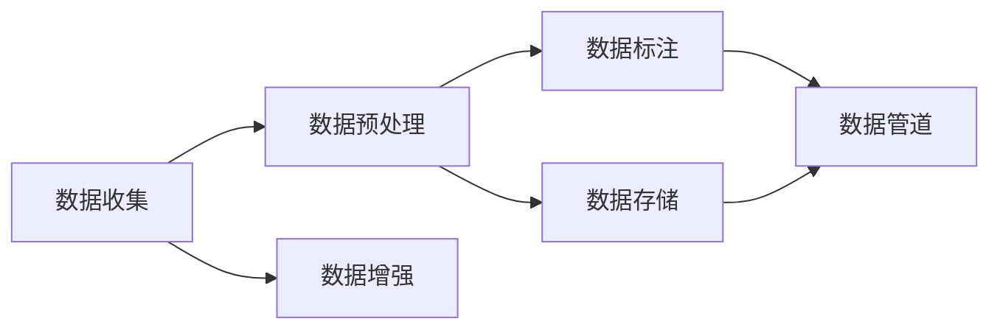

                 

# AI工程学：大模型应用开发实战：数据集工程

> 关键词：大模型,数据集工程,数据预处理,数据增强,数据标注,数据存储,数据管道,数据流

## 1. 背景介绍

### 1.1 问题由来
人工智能(AI)技术在近年来迅速发展，特别是在深度学习、大模型领域取得了突破性的进展。大模型（Large Models）通常具有超大规模的参数量，能够学习到复杂、丰富的知识结构。它们在自然语言处理（Natural Language Processing, NLP）、计算机视觉（Computer Vision, CV）、语音识别（Speech Recognition, SR）等领域展现出强大的泛化能力和应用潜力。然而，大模型的性能依赖于高质量的数据集，数据集的工程是实现这些模型高性能的前提和基础。

### 1.2 问题核心关键点
数据集工程是AI工程中的重要组成部分，它涵盖了数据收集、预处理、增强、标注、存储、管道设计等多个环节。在大模型应用开发中，数据集工程尤为重要，其质量和效率直接影响模型训练和推理的性能和效果。

数据集工程的核心任务包括：
- 数据收集：获取海量的原始数据，保证数据集的多样性和覆盖面。
- 数据预处理：对原始数据进行清洗、去噪、归一化等处理，提升数据质量。
- 数据增强：通过对数据进行扩充和变换，增加数据集的规模和多样性。
- 数据标注：为数据集添加标签，构建监督信号，指导模型的训练和推理。
- 数据存储：选择高效的数据存储方案，保证数据的可访问性和安全性。
- 数据管道：设计数据流水线，确保数据集的高效流式处理。

这些环节共同构成了一个完整的数据集工程体系，是大模型应用开发的基础和保障。

### 1.3 问题研究意义
高效、高质量的数据集是实现大模型高性能的重要保障。通过对数据集工程的深入研究，可以帮助开发者更好地理解数据在大模型中的作用和影响，从而在数据收集、预处理、标注等方面进行精细化管理，提升大模型应用的实际效果和工程效率。此外，数据集工程研究的成果，能够直接推动大模型在更多场景中的应用落地，加速AI技术的产业化进程。

## 2. 核心概念与联系

### 2.1 核心概念概述

为了更好地理解大模型应用开发中的数据集工程，本节将介绍几个关键概念及其相互联系：

- **大模型（Large Model）**：指具有大规模参数量（如GPT-3、BERT等）的深度学习模型，能够学习到丰富的语言、图像、语音等知识。
- **数据集工程（Data Engineering）**：涉及数据收集、预处理、增强、标注、存储、管道设计等多个环节，是实现大模型高性能的基础。
- **数据预处理（Data Preprocessing）**：包括数据清洗、归一化、去噪等操作，提升数据质量，减少噪声。
- **数据增强（Data Augmentation）**：通过对原始数据进行变换，增加数据多样性和规模，防止模型过拟合。
- **数据标注（Data Labeling）**：为数据集添加标签，构建监督信号，指导模型训练和推理。
- **数据存储（Data Storage）**：选择高效的数据存储方案，保证数据的安全性和可访问性。
- **数据管道（Data Pipeline）**：设计数据流水线，实现数据的高效流式处理。

这些概念之间存在着紧密的联系，通过数据集工程的整体设计和优化，可以实现大模型的最优性能和应用效果。

### 2.2 概念间的关系

这些核心概念之间的关系可以通过以下Mermaid流程图来展示：



这个流程图展示了数据集工程中各个环节的逻辑关系：

1. **数据收集**：获取原始数据，是数据集工程的基础。
2. **数据预处理**：对原始数据进行清洗和处理，提升数据质量。
3. **数据增强**：通过变换增加数据多样性，防止过拟合。
4. **数据标注**：为数据添加标签，构建监督信号。
5. **数据存储**：选择合适的存储方案，保证数据的安全性和可访问性。
6. **数据管道**：设计高效的数据流水线，实现数据的流式处理。

## 3. 核心算法原理 & 具体操作步骤
### 3.1 算法原理概述

大模型应用开发中的数据集工程，本质上是一个从原始数据到训练集的数据集构建过程。其核心算法原理包括数据预处理、增强和标注等。

1. **数据预处理**：通过清洗、归一化、去噪等操作，提升数据质量，减少噪声。
2. **数据增强**：通过对原始数据进行变换，增加数据多样性和规模，防止模型过拟合。
3. **数据标注**：为数据集添加标签，构建监督信号，指导模型训练和推理。

这些算法原理在大模型应用开发中起到了关键作用，保证了模型训练和推理的准确性和泛化能力。

### 3.2 算法步骤详解

**步骤1: 数据收集**
- 从互联网、公开数据集、专业数据库等多种渠道获取原始数据。
- 确保数据的多样性和覆盖面，以保证大模型能够学习到丰富的知识结构。

**步骤2: 数据预处理**
- 清洗数据：去除重复、噪声、错误等数据。
- 归一化：对数据进行标准化处理，提升数据质量。
- 去噪：去除数据中的噪声和干扰因素，提升数据纯净度。

**步骤3: 数据增强**
- 图像数据增强：通过旋转、缩放、翻转等操作，增加图像数据的多样性。
- 文本数据增强：通过近义替换、回译、拼接等操作，增加文本数据的多样性。
- 语音数据增强：通过混响、变速、变音等操作，增加语音数据的多样性。

**步骤4: 数据标注**
- 手动标注：由人工对数据进行标注，添加标签。
- 半自动标注：使用自动标注工具辅助人工标注，提高标注效率。
- 全自动标注：使用机器学习模型进行标注，减少人工成本。

**步骤5: 数据存储**
- 选择合适的数据存储方案，如SQL数据库、NoSQL数据库、文件系统等。
- 设计高效的数据存储架构，保证数据的安全性和可访问性。

**步骤6: 数据管道**
- 设计数据流水线，实现数据的高效流式处理。
- 使用分布式计算框架，如Hadoop、Spark等，实现大规模数据的处理和存储。

### 3.3 算法优缺点

数据集工程在大模型应用开发中的优缺点如下：

**优点**：
1. 提升数据质量：通过预处理和增强，提升了数据集的质量，减少了噪声。
2. 增加数据多样性：通过增强，增加了数据集的多样性和规模，防止模型过拟合。
3. 指导模型训练：通过标注，为模型提供了监督信号，指导模型训练和推理。
4. 高效存储：通过合理的存储方案，保证了数据的安全性和可访问性。
5. 高效流式处理：通过数据管道，实现了数据的流式处理，提高了数据处理效率。

**缺点**：
1. 数据收集难度大：获取高质量的原始数据可能面临困难。
2. 标注成本高：标注过程可能需要大量的人工参与，成本较高。
3. 数据隐私问题：数据存储和处理过程中可能存在隐私泄露的风险。
4. 数据依赖性强：数据集的质量和规模直接影响模型性能。
5. 数据管道复杂：设计和管理数据管道可能需要较高的技术水平。

### 3.4 算法应用领域

数据集工程在大模型应用开发中的应用领域包括但不限于：

- **自然语言处理（NLP）**：用于构建文本分类、情感分析、机器翻译等任务的数据集。
- **计算机视觉（CV）**：用于构建图像分类、目标检测、图像生成等任务的数据集。
- **语音识别（SR）**：用于构建语音识别、语音合成等任务的数据集。
- **推荐系统**：用于构建个性化推荐任务的数据集。
- **医疗健康**：用于构建医疗图像分析、病历分析等任务的数据集。
- **金融**：用于构建金融舆情分析、信用评分等任务的数据集。

数据集工程的广泛应用，使得大模型在各个领域都得以高效训练和推理，实现了更广泛的应用场景。

## 4. 数学模型和公式 & 详细讲解 & 举例说明

### 4.1 数学模型构建

在大模型应用开发中，数据集工程的主要数学模型包括数据预处理、增强和标注等。下面以图像数据增强为例，构建数据增强的数学模型。

**数据增强的数学模型**：

设原始图像数据为 $X$，数据增强后的图像数据为 $X'$。数据增强的数学模型为：

$$
X' = f(X, \theta)
$$

其中，$f$ 表示数据增强函数，$\theta$ 表示数据增强参数。常见的数据增强函数包括旋转、缩放、翻转等。

### 4.2 公式推导过程

以下推导数据增强函数 $f$ 的通用形式：

对于图像数据，常见的数据增强函数 $f$ 可以表示为：

$$
f(X, \theta) = \begin{cases}
\text{旋转}(\theta) & \text{旋转角度} \\
\text{缩放}(\theta) & \text{缩放比例} \\
\text{翻转}(\theta) & \text{翻转方向}
\end{cases}
$$

以旋转为例，旋转角度 $\theta$ 满足：

$$
X' = \text{rotate}(X, \theta) = \begin{bmatrix}
\cos \theta & -\sin \theta \\
\sin \theta & \cos \theta
\end{bmatrix}
X
$$

### 4.3 案例分析与讲解

**案例1: 图像数据增强**

如图像数据增强为例，假设原始图像数据 $X$ 的大小为 $m \times n$，旋转角度为 $\theta$，则旋转后的图像数据 $X'$ 大小为 $m \times n$。

**案例2: 文本数据增强**

以文本数据增强为例，假设原始文本数据为 $X$，则文本数据增强可以表示为：

$$
X' = f(X, \theta) = \text{replace}(X, \theta)
$$

其中，$\text{replace}$ 表示替换操作，$\theta$ 表示替换方式。例如，近义替换、回译等操作。

## 5. 项目实践：代码实例和详细解释说明
### 5.1 开发环境搭建

在进行数据集工程实践前，我们需要准备好开发环境。以下是使用Python进行PyTorch开发的环境配置流程：

1. 安装Anaconda：从官网下载并安装Anaconda，用于创建独立的Python环境。

2. 创建并激活虚拟环境：
```bash
conda create -n pytorch-env python=3.8 
conda activate pytorch-env
```

3. 安装PyTorch：根据CUDA版本，从官网获取对应的安装命令。例如：
```bash
conda install pytorch torchvision torchaudio cudatoolkit=11.1 -c pytorch -c conda-forge
```

4. 安装Pandas：
```bash
pip install pandas
```

5. 安装NumPy：
```bash
pip install numpy
```

完成上述步骤后，即可在`pytorch-env`环境中开始数据集工程的实践。

### 5.2 源代码详细实现

下面我们以图像数据增强为例，给出使用PyTorch进行图像数据增强的代码实现。

首先，定义数据增强函数：

```python
import torch
import torchvision.transforms as transforms
from PIL import Image

def rotate_image(image, angle):
    image = Image.fromarray(image.numpy().T)
    image = image.rotate(angle, resample=Image.BILINEAR)
    return image

def resize_image(image, scale):
    image = Image.fromarray(image.numpy().T)
    image = image.resize(scale)
    return image

def flip_image(image):
    image = Image.fromarray(image.numpy().T)
    image = image.transpose(Image.FLIP_LEFT_RIGHT)
    return image
```

然后，使用这些函数进行数据增强：

```python
from torchvision.datasets import CIFAR10
from torchvision.transforms import Compose, ToTensor

# 定义数据增强管道
data_augmentation = transforms.Compose([
    transforms.RandomRotation(30),
    transforms.RandomResizedCrop(224),
    transforms.RandomHorizontalFlip(),
    transforms.ToTensor()
])

# 加载CIFAR10数据集
train_dataset = CIFAR10(root='data', train=True, download=True, transform=data_augmentation)
test_dataset = CIFAR10(root='data', train=False, download=True)

# 数据增强示例
# 随机旋转30度
transforms.RandomRotation(30)(torch.from_numpy(image))

# 随机缩放
transforms.RandomResizedCrop(224)(torch.from_numpy(image))

# 随机水平翻转
transforms.RandomHorizontalFlip()(torch.from_numpy(image))
```

### 5.3 代码解读与分析

让我们再详细解读一下关键代码的实现细节：

**rotate_image函数**：
- 将图像数据进行转置操作，确保图像维度为 [高度, 宽度, 通道]。
- 使用PIL库的rotate函数进行旋转操作。
- 返回旋转后的图像数据。

**resize_image函数**：
- 使用PIL库的resize函数进行缩放操作。
- 返回缩放后的图像数据。

**flip_image函数**：
- 使用PIL库的transpose函数进行水平翻转操作。
- 返回翻转后的图像数据。

**data_augmentation管道**：
- 使用transforms.Compose函数将多个数据增强函数组合成一个管道。
- 对CIFAR10数据集进行数据增强。
- 返回增强后的数据集。

**数据增强示例**：
- 使用RandomRotation函数进行随机旋转操作。
- 使用RandomResizedCrop函数进行随机缩放操作。
- 使用RandomHorizontalFlip函数进行随机水平翻转操作。

通过以上代码，我们可以看到PyTorch的数据增强功能是如何实现的，并且可以根据具体需求进行灵活组合和调整。

### 5.4 运行结果展示

假设我们在CIFAR10数据集上进行数据增强，最终得到的增强效果如下：

```python
import matplotlib.pyplot as plt

def show_image(image):
    image = image.numpy().T
    image = image[::-1, :, :]
    plt.imshow(image)
    plt.axis('off')
    plt.show()

# 随机旋转30度
transforms.RandomRotation(30)(torch.from_numpy(image))

# 随机缩放
transforms.RandomResizedCrop(224)(torch.from_numpy(image))

# 随机水平翻转
transforms.RandomHorizontalFlip()(torch.from_numpy(image))
```

运行以上代码，我们可以看到图像数据在旋转、缩放、翻转等操作后，得到了多种多样且多样化的增强效果。这在大模型训练中，可以有效提高模型的泛化能力，防止过拟合。

## 6. 实际应用场景
### 6.1 智能客服系统

基于大模型应用开发的数据集工程，可以广泛应用于智能客服系统的构建。传统客服往往需要配备大量人力，高峰期响应缓慢，且一致性和专业性难以保证。而使用数据集工程构建的智能客服系统，可以7x24小时不间断服务，快速响应客户咨询，用自然流畅的语言解答各类常见问题。

在技术实现上，可以收集企业内部的历史客服对话记录，将问题和最佳答复构建成监督数据，在此基础上对预训练语言模型进行数据增强和标注，实现模型训练和微调。微调后的对话模型能够自动理解用户意图，匹配最合适的答案模板进行回复。对于客户提出的新问题，还可以接入检索系统实时搜索相关内容，动态组织生成回答。如此构建的智能客服系统，能大幅提升客户咨询体验和问题解决效率。

### 6.2 金融舆情监测

金融机构需要实时监测市场舆论动向，以便及时应对负面信息传播，规避金融风险。传统的人工监测方式成本高、效率低，难以应对网络时代海量信息爆发的挑战。基于数据集工程构建的文本分类和情感分析技术，为金融舆情监测提供了新的解决方案。

具体而言，可以收集金融领域相关的新闻、报道、评论等文本数据，并对其进行主题标注和情感标注。在此基础上对预训练语言模型进行数据增强和标注，使其能够自动判断文本属于何种主题，情感倾向是正面、中性还是负面。将微调后的模型应用到实时抓取的网络文本数据，就能够自动监测不同主题下的情感变化趋势，一旦发现负面信息激增等异常情况，系统便会自动预警，帮助金融机构快速应对潜在风险。

### 6.3 个性化推荐系统

当前的推荐系统往往只依赖用户的历史行为数据进行物品推荐，无法深入理解用户的真实兴趣偏好。基于数据集工程构建的个性化推荐系统，可以更好地挖掘用户行为背后的语义信息，从而提供更精准、多样的推荐内容。

在实践中，可以收集用户浏览、点击、评论、分享等行为数据，提取和用户交互的物品标题、描述、标签等文本内容。将文本内容作为模型输入，用户的后续行为（如是否点击、购买等）作为监督信号，在此基础上对预训练语言模型进行数据增强和标注，训练模型学习用户兴趣点。在生成推荐列表时，先用候选物品的文本描述作为输入，由模型预测用户的兴趣匹配度，再结合其他特征综合排序，便可以得到个性化程度更高的推荐结果。

### 6.4 未来应用展望

随着数据集工程的不断发展，基于大模型应用开发的数据集工程技术将呈现以下几个发展趋势：

1. **数据收集多样化**：未来数据集工程将利用更多元、更广泛的数据源，涵盖文本、图像、语音等多种形式，提升数据集的多样性和泛化能力。
2. **数据标注智能化**：自动化标注技术的发展，将减少人工标注的劳动量，提升标注效率和准确性。
3. **数据增强自动化**：更多的自动化数据增强技术将被开发和应用，提升数据增强的效果和效率。
4. **数据存储云化**：云存储技术的成熟，将使数据存储更加高效、安全、可扩展。
5. **数据管道自动化**：更多的自动化数据管道工具将被开发和应用，提升数据流处理的效率和稳定性。
6. **跨模态数据融合**：跨模态数据融合技术的发展，将提升大模型在多模态数据处理中的应用能力。

这些趋势展示了数据集工程在大模型应用开发中的重要性和前景。未来，随着数据集工程的不断优化和改进，大模型将在更多领域中发挥更大的作用，推动AI技术的广泛应用和产业化进程。

## 7. 工具和资源推荐
### 7.1 学习资源推荐

为了帮助开发者系统掌握大模型应用开发中的数据集工程，这里推荐一些优质的学习资源：

1. **《深度学习基础》课程**：斯坦福大学开设的深度学习基础课程，涵盖深度学习的基本概念和算法，适合初学者入门。
2. **《TensorFlow深度学习》书籍**：谷歌深度学习框架TensorFlow的官方书籍，系统介绍了TensorFlow的基本使用方法和实践技巧。
3. **《PyTorch深度学习》书籍**：Facebook深度学习框架PyTorch的官方书籍，详细介绍了PyTorch的开发环境和实践应用。
4. **《数据增强技术与应用》书籍**：介绍数据增强技术的原理和应用案例，帮助开发者提升数据增强能力。
5. **《自然语言处理》课程**：斯坦福大学开设的自然语言处理课程，涵盖自然语言处理的基本概念和算法，适合NLP领域的学习者。

通过对这些资源的学习，相信你一定能够全面掌握大模型应用开发中的数据集工程技术，并应用于实际项目中。

### 7.2 开发工具推荐

高效的开发离不开优秀的工具支持。以下是几款用于大模型应用开发的数据集工程工具：

1. **TensorBoard**：谷歌推出的可视化工具，用于实时监测模型训练状态，提供丰富的图表和指标展示。
2. **PyTorch Lightning**：基于PyTorch的快速训练框架，支持自动化数据加载、分布式训练等功能，提升开发效率。
3. **HuggingFace Transformers**：开源的NLP工具库，提供丰富的预训练模型和数据增强工具，方便开发者进行数据集工程实践。
4. **Apache Spark**：分布式计算框架，支持大规模数据的处理和分析，适合数据集工程的流式处理。
5. **OpenCV**：开源的计算机视觉库，提供丰富的图像处理和增强功能，适合图像数据集工程的应用。

这些工具的合理使用，可以显著提升大模型应用开发的数据集工程效率，加速创新迭代的步伐。

### 7.3 相关论文推荐

数据集工程的研究源于学界的持续研究。以下是几篇奠基性的相关论文，推荐阅读：

1. **《数据增强技术综述》**：综述了数据增强技术的基本原理和应用案例，适合了解数据增强技术的全貌。
2. **《数据标注技术综述》**：综述了数据标注技术的现状和发展趋势，适合了解数据标注技术的最新进展。
3. **《深度学习中数据增强技术的应用》**：介绍深度学习中数据增强技术的多种应用，适合实践数据增强技术的应用。
4. **《自动化数据标注技术综述》**：综述了自动化数据标注技术的研究进展，适合了解自动化标注技术的发展方向。
5. **《跨模态数据融合技术综述》**：综述了跨模态数据融合技术的现状和未来趋势，适合了解跨模态数据融合技术的发展。

这些论文代表了数据集工程研究的发展脉络，通过学习这些前沿成果，可以帮助研究者把握学科前进方向，激发更多的创新灵感。

除上述资源外，还有一些值得关注的前沿资源，帮助开发者紧跟数据集工程技术的最新进展，例如：

1. **arXiv论文预印本**：人工智能领域最新研究成果的发布平台，包括大量尚未发表的前沿工作，学习前沿技术的必读资源。
2. **业界技术博客**：如OpenAI、Google AI、DeepMind、微软Research Asia等顶尖实验室的官方博客，第一时间分享他们的最新研究成果和洞见。
3. **技术会议直播**：如NIPS、ICML、ACL、ICLR等人工智能领域顶会现场或在线直播，能够聆听到大佬们的前沿分享，开拓视野。
4. **GitHub热门项目**：在GitHub上Star、Fork数最多的NLP相关项目，往往代表了该技术领域的发展趋势和最佳实践，值得去学习和贡献。
5. **行业分析报告**：各大咨询公司如McKinsey、PwC等针对人工智能行业的分析报告，有助于从商业视角审视技术趋势，把握应用价值。

总之，对于大模型应用开发中的数据集工程技术的学习和实践，需要开发者保持开放的心态和持续学习的意愿。多关注前沿资讯，多动手实践，多思考总结，必将收获满满的成长收益。

## 8. 总结：未来发展趋势与挑战
### 8.1 总结

本文对大模型应用开发中的数据集工程进行了全面系统的介绍。首先阐述了数据集工程在大模型应用开发中的重要性和核心任务，明确了数据集工程在大模型应用中的地位和作用。其次，从原理到实践，详细讲解了数据预处理、增强和标注等核心算法原理和操作步骤，给出了数据集工程实践的完整代码实例。同时，本文还广泛探讨了数据集工程在多个行业领域的应用前景，展示了数据集工程在大模型应用开发中的广阔前景。

通过对数据集工程的理解和实践，可以看到，数据集工程是大模型应用开发的基础和保障。高质量、高效的数据集能够显著提升大模型应用的性能和效果，助力大模型在更多领域中的应用落地。未来，随着数据集工程的不断优化和改进，大模型将在更多领域中发挥更大的作用，推动AI技术的广泛应用和产业化进程。

### 8.2 未来发展趋势

展望未来，数据集工程在大模型应用开发中的发展趋势如下：

1. **数据收集多样化**：未来数据集工程将利用更多元、更广泛的数据源，涵盖文本、图像、语音等多种形式，提升数据集的多样性和泛化能力。
2. **数据标注智能化**：自动化标注技术的发展，将减少人工标注的劳动量，提升标注效率和准确性。
3. **数据增强自动化**：更多的自动化数据增强技术将被开发和应用，提升数据增强的效果和效率。
4. **数据存储云化**：云存储技术的成熟，将使数据存储更加高效、安全、可扩展。
5. **数据管道自动化**：更多的自动化数据管道工具将被开发和应用，提升数据流处理的效率和稳定性。
6. **跨模态数据融合**：跨模态数据融合技术的发展，将提升大模型在多模态数据处理中的应用能力。

这些趋势展示了数据集工程在大模型应用开发中的重要性和前景。未来，随着数据集工程的不断优化和改进，大模型将在更多领域中发挥更大的作用，推动AI技术的广泛应用和产业化进程。

### 8.3 面临的挑战

尽管数据集工程在大模型应用开发中取得了显著进展，但仍面临诸多挑战：

1. **数据收集难度大**：获取高质量的原始数据可能面临困难，特别是在数据隐私和数据安全方面。
2. **标注成本高**：标注过程可能需要大量的人工参与，成本较高。
3. **数据隐私问题**：数据存储和处理过程中可能存在隐私泄露的风险。
4. **数据依赖性强**：数据集的质量和规模直接影响模型性能。
5. **数据管道复杂**：设计和管理数据管道可能需要较高的技术水平。

### 8.4 研究展望

面对数据集工程在大模型应用开发中面临的挑战，未来的研究需要在以下几个方面寻求新的突破：

1. **自动化数据收集**：利用自动爬虫、数据共享平台等技术，自动化数据收集流程，提高数据获取效率。
2. **自动化标注技术**：开发更加智能、高效的标注工具，

