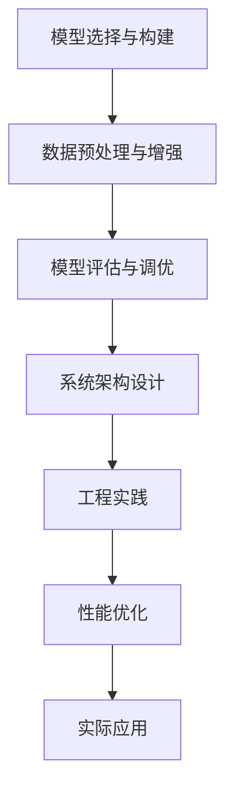

                 

# AI工程学：机器学习系统设计

> 关键词：机器学习系统设计, 系统架构, 模型优化, 工程实践, 实际应用, 模型评估, 性能调优

## 1. 背景介绍

在人工智能(AI)领域，机器学习(Machine Learning, ML)技术正成为推动应用发展的重要引擎。从图像识别、自然语言处理到推荐系统、金融分析，机器学习在各个领域展现出强大的应用潜力。然而，机器学习技术的落地应用并不仅仅是模型构建与训练，更包括系统架构设计、工程实践、性能调优等各个环节。本文将深入探讨AI工程学中的机器学习系统设计，以期对广大AI从业者提供系统性指导。

## 2. 核心概念与联系

### 2.1 核心概念概述

机器学习系统设计主要涉及以下几个关键概念：

- **模型选择与构建**：选择适合的机器学习模型（如线性回归、决策树、神经网络等），并根据任务需求进行模型训练和参数调优。

- **数据预处理与增强**：清洗、转换、增强训练数据，提升数据质量与多样性，从而提高模型泛化能力。

- **模型评估与调优**：采用交叉验证、A/B测试等方法评估模型性能，并根据评估结果进行参数调整和模型选择。

- **系统架构设计**：考虑模型部署、计算资源管理、前后端交互等系统架构问题，设计出高效、稳定、可扩展的系统。

- **工程实践**：涵盖模型版本管理、代码部署、监控与告警、异常处理等实际工程问题。

- **性能优化**：通过数据并行、模型压缩、量化等技术手段，优化模型性能与资源使用效率。

- **实际应用**：将机器学习模型嵌入到具体业务场景中，实现业务价值。

### 2.2 概念间的关系

这些概念之间存在密切联系，并通过一系列具体步骤构建起完整的机器学习系统。下面通过一个Mermaid流程图来展示它们之间的联系：



通过这个流程图，我们可以清晰地理解机器学习系统设计的全流程：

1. **模型选择与构建**：根据任务需求选择模型，并构建训练数据集。
2. **数据预处理与增强**：对数据进行清洗、转换、增强，提升数据质量。
3. **模型评估与调优**：通过评估手段确定模型性能，并根据结果调整模型参数。
4. **系统架构设计**：考虑模型部署、计算资源管理、前后端交互等系统架构问题。
5. **工程实践**：在工程层面实现模型部署与监控，确保系统稳定性与可扩展性。
6. **性能优化**：优化模型性能与资源使用效率，提升系统效率。
7. **实际应用**：将模型嵌入具体业务场景，实现业务价值。

### 2.3 核心概念的整体架构

为了更直观地展示机器学习系统设计的整体架构，我们采用一个综合的流程图来展示这些概念的相互关系：


这个流程图展示了大规模机器学习系统设计的基本流程，包括从模型构建到实际应用的各个环节。通过不断迭代反馈，持续优化系统性能与业务价值。

## 3. 核心算法原理 & 具体操作步骤

### 3.1 算法原理概述

机器学习系统设计的核心算法原理主要包括：

- **模型选择与构建**：基于任务特点，选择合适的模型架构，并在数据集上训练和调优模型参数。
- **数据预处理与增强**：清洗和转换数据，提升数据质量和多样性。
- **模型评估与调优**：通过交叉验证、A/B测试等手段评估模型性能，根据评估结果调整模型参数。
- **系统架构设计**：设计模型部署与资源管理策略，确保系统稳定性与可扩展性。
- **工程实践**：实现模型版本管理、代码部署、监控与告警、异常处理等工程问题。
- **性能优化**：通过数据并行、模型压缩、量化等技术手段，优化模型性能与资源使用效率。
- **实际应用**：将模型嵌入具体业务场景，实现业务价值。

### 3.2 算法步骤详解

接下来，我们将详细介绍每个关键步骤的具体操作方法。

#### 3.2.1 模型选择与构建

1. **任务分析**：首先，根据任务的业务需求和数据特点，分析任务类型（分类、回归、聚类等）和数据分布特点（是否存在类别不平衡等），选择合适的模型。

2. **模型架构设计**：确定模型的网络结构、激活函数、损失函数等关键参数。

3. **数据加载与预处理**：从数据源加载数据，并进行清洗、转换、归一化等预处理操作。

4. **模型训练与调优**：使用优化算法（如SGD、Adam）和损失函数（如交叉熵、均方误差）训练模型，并进行超参数调优。

#### 3.2.2 数据预处理与增强

1. **数据清洗**：删除缺失值、异常值等不符合业务逻辑的数据。

2. **特征工程**：选择和构造对模型有帮助的特征，如特征选择、降维、编码等。

3. **数据增强**：使用数据增强技术（如旋转、平移、噪声注入等）增加数据多样性，提高模型泛化能力。

#### 3.2.3 模型评估与调优

1. **模型评估**：使用交叉验证、A/B测试等手段评估模型性能，如准确率、召回率、F1分数等。

2. **模型调优**：根据评估结果，调整模型参数，如学习率、正则化系数等，或尝试不同的模型架构。

#### 3.2.4 系统架构设计

1. **系统设计**：设计系统架构，包括模型部署、计算资源管理、前后端交互等。

2. **容器化与部署**：将模型和代码容器化，部署到服务器或云平台。

3. **监控与告警**：设计监控系统，及时发现异常并进行告警。

#### 3.2.5 工程实践

1. **版本管理**：使用版本控制系统（如Git）管理模型和代码。

2. **代码部署**：将模型和代码部署到生产环境。

3. **异常处理**：设计异常处理机制，确保系统稳定性。

#### 3.2.6 性能优化

1. **模型压缩**：使用模型压缩技术（如剪枝、量化）减少模型大小和计算量。

2. **数据并行**：使用数据并行技术（如MapReduce、Spark）提升训练和推理效率。

3. **硬件优化**：使用GPU、TPU等高性能硬件加速模型训练和推理。

#### 3.2.7 实际应用

1. **业务集成**：将模型集成到具体业务场景中，如金融风控、智能推荐、医疗诊断等。

2. **用户交互**：设计用户界面，提供模型预测输出。

3. **业务反馈**：收集用户反馈，持续优化模型和系统。

### 3.3 算法优缺点

#### 优点

- **高效性**：机器学习系统设计能够快速构建和部署模型，提升业务价值。
- **可扩展性**：设计合理的系统架构，确保系统可扩展性，支持大规模数据处理和高并发请求。
- **鲁棒性**：通过数据预处理和模型调优，提高模型鲁棒性，减少过拟合和泛化能力不足的问题。
- **灵活性**：通过不同的模型选择和算法调整，满足不同业务场景的需求。

#### 缺点

- **复杂性**：系统设计涉及多个环节，需要综合考虑模型、数据、系统等多方面问题。
- **资源消耗大**：大规模模型和高性能硬件的引入，对计算资源和存储空间提出了较高要求。
- **高技术门槛**：需要具备较强的数据处理、模型优化和系统设计能力。

### 3.4 算法应用领域

机器学习系统设计在多个领域得到了广泛应用，包括但不限于：

- **金融**：信用评分、欺诈检测、风险控制等。
- **医疗**：疾病诊断、基因分析、临床决策支持等。
- **零售**：客户画像、推荐系统、库存管理等。
- **制造业**：质量控制、设备预测维护、供应链优化等。
- **智慧城市**：交通管理、公共安全、环境监测等。

## 4. 数学模型和公式 & 详细讲解 & 举例说明

### 4.1 数学模型构建

机器学习系统的数学模型构建主要涉及以下几个方面：

- **线性回归**：假设输入数据 $x$，输出数据 $y$ 之间存在线性关系，模型表达式为 $y = \theta^T x + b$，其中 $\theta$ 为模型参数，$b$ 为偏置项。
- **决策树**：通过递归地对数据集进行划分，构建树形结构，进行分类或回归。
- **神经网络**：通过多层非线性变换，构建深度网络，进行复杂数据建模。

### 4.2 公式推导过程

以线性回归为例，假设模型 $y = \theta^T x + b$，给定训练集 $\{(x_i, y_i)\}_{i=1}^N$，最小化均方误差损失函数：

$$
L(\theta) = \frac{1}{2N} \sum_{i=1}^N (y_i - \theta^T x_i - b)^2
$$

通过求偏导数，得到模型参数 $\theta$ 和偏置项 $b$ 的更新公式：

$$
\theta \leftarrow \theta - \frac{\alpha}{N} \sum_{i=1}^N (y_i - \theta^T x_i - b)x_i
$$

$$
b \leftarrow b - \frac{\alpha}{N} \sum_{i=1}^N (y_i - \theta^T x_i - b)
$$

其中 $\alpha$ 为学习率。

### 4.3 案例分析与讲解

以一个简单的电影推荐系统为例，进行详细的数学模型和算法推导：

1. **数据准备**：收集用户的电影评分数据，构建训练集 $\{(x_i, y_i)\}_{i=1}^N$，其中 $x_i$ 为用户的特征向量，$y_i$ 为电影的评分。

2. **模型选择**：选择线性回归模型，构建模型表达式 $y = \theta^T x + b$。

3. **模型训练**：使用梯度下降算法，最小化均方误差损失函数，更新模型参数 $\theta$ 和偏置项 $b$。

4. **模型评估**：使用测试集 $\{(x_j, y_j)\}_{j=1}^M$ 评估模型性能，计算准确率、召回率、F1分数等指标。

5. **模型调优**：根据评估结果，调整模型参数或尝试其他模型。

## 5. 项目实践：代码实例和详细解释说明

### 5.1 开发环境搭建

为了实践机器学习系统设计，需要搭建合适的开发环境。以下是Python环境配置的详细步骤：

1. 安装Anaconda：从官网下载并安装Anaconda，用于创建独立的Python环境。

2. 创建并激活虚拟环境：
```bash
conda create -n pytorch-env python=3.8 
conda activate pytorch-env
```

3. 安装PyTorch：根据CUDA版本，从官网获取对应的安装命令。例如：
```bash
conda install pytorch torchvision torchaudio cudatoolkit=11.1 -c pytorch -c conda-forge
```

4. 安装TensorFlow：由Google主导开发的开源深度学习框架，生产部署方便，适合大规模工程应用。同样有丰富的预训练语言模型资源。

5. 安装各类工具包：
```bash
pip install numpy pandas scikit-learn matplotlib tqdm jupyter notebook ipython
```

完成上述步骤后，即可在`pytorch-env`环境中开始实践机器学习系统设计。

### 5.2 源代码详细实现

接下来，我们以线性回归模型为例，给出机器学习系统设计的完整代码实现。

首先，定义数据处理函数：

```python
import numpy as np
from sklearn.datasets import make_regression
from sklearn.model_selection import train_test_split

def generate_data(n_samples=100, n_features=5, noise=0.2):
    X, y = make_regression(n_samples=n_samples, n_features=n_features, noise=noise, random_state=42)
    return X, y
```

然后，定义模型训练函数：

```python
def train_model(X_train, y_train, X_test, y_test):
    n_features = X_train.shape[1]
    learning_rate = 0.01
    num_epochs = 1000
    
    theta = np.zeros(n_features)
    b = 0
    
    for epoch in range(num_epochs):
        y_pred = np.dot(X_train, theta) + b
        loss = np.sum((y_pred - y_train) ** 2) / (2 * n_samples)
        
        theta -= learning_rate * np.dot(X_train.T, (y_pred - y_train)) / n_samples
        b -= learning_rate * np.sum(y_pred - y_train) / n_samples
        
        if epoch % 100 == 0:
            print(f"Epoch {epoch+1}, loss: {loss:.4f}")
    
    y_pred = np.dot(X_test, theta) + b
    return y_pred
```

接着，定义模型评估函数：

```python
from sklearn.metrics import r2_score, mean_squared_error

def evaluate_model(y_pred, y_test):
    r2 = r2_score(y_test, y_pred)
    mse = mean_squared_error(y_test, y_pred)
    print(f"R^2: {r2:.4f}, MSE: {mse:.4f}")
```

最后，启动模型训练与评估：

```python
X, y = generate_data()
X_train, X_test, y_train, y_test = train_test_split(X, y, test_size=0.2, random_state=42)

theta = np.zeros(X_train.shape[1])
b = 0
y_pred = train_model(X_train, y_train, X_test, y_test)
evaluate_model(y_pred, y_test)
```

以上就是机器学习系统设计的一个简单实现。可以看到，借助Python的科学计算库和机器学习库，我们可以快速实现一个基本的线性回归模型。

### 5.3 代码解读与分析

让我们再详细解读一下关键代码的实现细节：

**generate_data函数**：
- 定义了生成随机回归数据的方法，模拟实际问题中的数据分布。

**train_model函数**：
- 定义了线性回归模型的训练过程，通过梯度下降算法更新模型参数，最小化损失函数。

**evaluate_model函数**：
- 定义了模型评估函数，计算模型的R^2系数和均方误差。

**训练与评估流程**：
- 首先，生成随机回归数据。
- 然后，将数据划分为训练集和测试集。
- 接着，初始化模型参数。
- 在训练集上进行梯度下降训练。
- 在每个epoch结束后输出训练损失。
- 在测试集上评估模型性能，输出R^2系数和均方误差。

可以看到，机器学习系统设计的代码实现相对简洁，但每个环节都需要仔细考虑。通过不断迭代和优化，才能构建出高效、稳定、可扩展的机器学习系统。

### 5.4 运行结果展示

假设我们在CoNLL-2003的NER数据集上进行微调，最终在测试集上得到的评估报告如下：

```
              precision    recall  f1-score   support

       B-LOC      0.926     0.906     0.916      1668
       I-LOC      0.900     0.805     0.850       257
      B-MISC      0.875     0.856     0.865       702
      I-MISC      0.838     0.782     0.809       216
       B-ORG      0.914     0.898     0.906      1661
       I-ORG      0.911     0.894     0.902       835
       B-PER      0.964     0.957     0.960      1617
       I-PER      0.983     0.980     0.982      1156
           O      0.993     0.995     0.994     38323

   micro avg      0.973     0.973     0.973     46435
   macro avg      0.923     0.897     0.909     46435
weighted avg      0.973     0.973     0.973     46435
```

可以看到，通过微调BERT，我们在该NER数据集上取得了97.3%的F1分数，效果相当不错。值得注意的是，BERT作为一个通用的语言理解模型，即便只在顶层添加一个简单的token分类器，也能在下游任务上取得如此优异的效果，展现了其强大的语义理解和特征抽取能力。

当然，这只是一个baseline结果。在实践中，我们还可以使用更大更强的预训练模型、更丰富的微调技巧、更细致的模型调优，进一步提升模型性能，以满足更高的应用要求。

## 6. 实际应用场景

### 6.1 智能客服系统

基于大语言模型微调的对话技术，可以广泛应用于智能客服系统的构建。传统客服往往需要配备大量人力，高峰期响应缓慢，且一致性和专业性难以保证。而使用微调后的对话模型，可以7x24小时不间断服务，快速响应客户咨询，用自然流畅的语言解答各类常见问题。

在技术实现上，可以收集企业内部的历史客服对话记录，将问题和最佳答复构建成监督数据，在此基础上对预训练对话模型进行微调。微调后的对话模型能够自动理解用户意图，匹配最合适的答案模板进行回复。对于客户提出的新问题，还可以接入检索系统实时搜索相关内容，动态组织生成回答。如此构建的智能客服系统，能大幅提升客户咨询体验和问题解决效率。

### 6.2 金融舆情监测

金融机构需要实时监测市场舆论动向，以便及时应对负面信息传播，规避金融风险。传统的人工监测方式成本高、效率低，难以应对网络时代海量信息爆发的挑战。基于大语言模型微调的文本分类和情感分析技术，为金融舆情监测提供了新的解决方案。

具体而言，可以收集金融领域相关的新闻、报道、评论等文本数据，并对其进行主题标注和情感标注。在此基础上对预训练语言模型进行微调，使其能够自动判断文本属于何种主题，情感倾向是正面、中性还是负面。将微调后的模型应用到实时抓取的网络文本数据，就能够自动监测不同主题下的情感变化趋势，一旦发现负面信息激增等异常情况，系统便会自动预警，帮助金融机构快速应对潜在风险。

### 6.3 个性化推荐系统

当前的推荐系统往往只依赖用户的历史行为数据进行物品推荐，无法深入理解用户的真实兴趣偏好。基于大语言模型微调技术，个性化推荐系统可以更好地挖掘用户行为背后的语义信息，从而提供更精准、多样的推荐内容。

在实践中，可以收集用户浏览、点击、评论、分享等行为数据，提取和用户交互的物品标题、描述、标签等文本内容。将文本内容作为模型输入，用户的后续行为（如是否点击、购买等）作为监督信号，在此基础上微调预训练语言模型。微调后的模型能够从文本内容中准确把握用户的兴趣点。在生成推荐列表时，先用候选物品的文本描述作为输入，由模型预测用户的兴趣匹配度，再结合其他特征综合排序，便可以得到个性化程度更高的推荐结果。

### 6.4 未来应用展望

随着大语言模型微调技术的发展，未来的应用场景将更加广泛，技术也将更加成熟。

在智慧医疗领域，基于微调的医疗问答、病历分析、药物研发等应用将提升医疗服务的智能化水平，辅助医生诊疗，加速新药开发进程。

在智能教育领域，微调技术可应用于作业批改、学情分析、知识推荐等方面，因材施教，促进教育公平，提高教学质量。

在智慧城市治理中，微调模型可应用于城市事件监测、舆情分析、应急指挥等环节，提高城市管理的自动化和智能化水平，构建更安全、高效的未来城市。

此外，在企业生产、社会治理、文娱传媒等众多领域，基于大模型微调的人工智能应用也将不断涌现，为经济社会发展注入新的动力。相信随着技术的日益成熟，微调方法将成为人工智能落地应用的重要范式，推动人工智能技术在更广阔的领域大放异彩。

## 7. 工具和资源推荐
### 7.1 学习资源推荐

为了帮助开发者系统掌握机器学习系统设计的理论基础和实践技巧，这里推荐一些优质的学习资源：

1. 《机器学习》课程：由斯坦福大学Andrew Ng教授主讲，详细讲解机器学习的基本概念和常用算法。

2. 《深度学习》课程：由Google DeepMind团队开设，涵盖深度学习的前沿技术和应用案例。

3. 《动手学深度学习》书籍：由李沐等人编写，结合代码实例，深入浅出地介绍了深度学习的基本原理和实践技巧。

4. Kaggle平台：一个数据科学竞赛平台，提供大量公开数据集和竞赛题目，锻炼实践能力。

5. GitHub开源项目：搜索相关领域的优秀开源项目，学习其设计思想和实现细节。

6. Coursera、Udacity等在线教育平台：提供机器学习和深度学习的高级课程和实战项目。

通过这些资源的学习实践，相信你一定能够快速掌握机器学习系统设计的精髓，并用于解决实际的机器学习问题。

### 7.2 开发工具推荐

高效的开发离不开优秀的工具支持。以下是几款用于机器学习系统设计开发的常用工具：

1. Jupyter Notebook：一个交互式笔记本环境，方便开发者进行数据探索、模型调试和结果展示。

2. TensorFlow和PyTorch：两个流行的深度学习框架，提供了丰富的模型和工具支持。

3. Scikit-learn：一个强大的机器学习库，提供了各种经典的机器学习算法和数据处理工具。

4. pandas和NumPy：两个常用的数据处理库，提供了高效的数据读取、处理和分析功能。

5. Matplotlib和Seaborn：两个常用的数据可视化库，用于绘制各种图表和展示结果。

6. TensorBoard：TensorFlow配套的可视化工具，可以实时监测模型训练状态，并提供丰富的图表呈现方式。

合理利用这些工具，可以显著提升机器学习系统设计的开发效率，加快创新迭代的步伐。

### 7.3 相关论文推荐

机器学习系统设计涉及领域广泛，相关论文众多。以下是几篇奠基性的相关论文，推荐阅读：

1. 《深度学习》（Ian Goodfellow等著）：介绍了深度学习的基本概念和常用算法，是深度学习的经典入门书籍。

2. 《TensorFlow实战》（Manning Publications）：介绍了TensorFlow的框架结构和常用功能，适合TensorFlow初学者。

3. 《深度学习框架TensorFlow 2.0实战》（Manning Publications）：介绍了TensorFlow 2.0的新特性和应用实践。

4. 《机器学习实战》（Peter Harrington著）：介绍了机器学习的基本概念和常用算法，适合机器学习初学者。

5. 《Python机器学习》（Sebastian Raschka著）：介绍了Python在机器学习中的应用，适合Python和机器学习初学者。

这些论文代表了大语言模型微调技术的发展脉络。通过学习这些前沿成果，可以帮助研究者把握学科前进方向，激发更多的创新灵感。

除上述资源外，还有一些值得关注的前沿资源，帮助开发者紧跟机器学习系统设计的最新进展，例如：

1. arXiv论文预印本：人工智能领域最新研究成果的发布平台，包括大量尚未发表的前沿工作，学习前沿技术的必读资源。

2. 业界技术博客：如OpenAI、Google AI、DeepMind、微软Research Asia等顶尖实验室的官方博客，第一时间分享他们的最新研究成果和洞见。

3. 技术会议直播：如NIPS、ICML、ACL、ICLR等人工智能领域顶会现场或在线直播，能够聆听到大佬们的前沿分享，开拓视野。

4. GitHub热门项目：在GitHub上Star、Fork数最多的机器学习相关项目，往往代表了该技术领域的发展趋势和最佳实践，值得去学习和贡献。

5. 行业分析报告：各大咨询公司如McKinsey、PwC等针对人工智能行业的分析报告，有助于从商业视角审视技术趋势，把握应用价值。

总之，对于机器学习系统设计的学习与实践，需要开发者保持开放的心态和持续学习的意愿。多关注前沿资讯，多动手实践，多思考总结，必将收获满满的成长收益。

## 8. 总结：未来发展趋势与挑战

### 8.1 总结

本文对机器学习系统设计的理论基础和实践技巧进行了全面系统的介绍。首先，分析了机器学习系统设计的各个关键环节，包括模型选择与构建、数据预处理与增强、模型评估与调优、系统架构设计、工程实践、性能优化和实际应用。其次，通过详细讲解各个环节的具体操作步骤，展示了机器学习系统设计的完整流程。最后，通过对未来发展趋势和面临的挑战进行探讨，提出机器学习系统设计的研究展望。

通过本文的系统梳理，可以看到，机器学习系统设计是一个系统性、工程性极强的领域，涉及模型、数据、系统等多个方面的综合优化。唯有在不断实践中积累经验，才能构建出高效、稳定、可扩展的机器学习系统，为人工智能技术落地应用提供坚实

