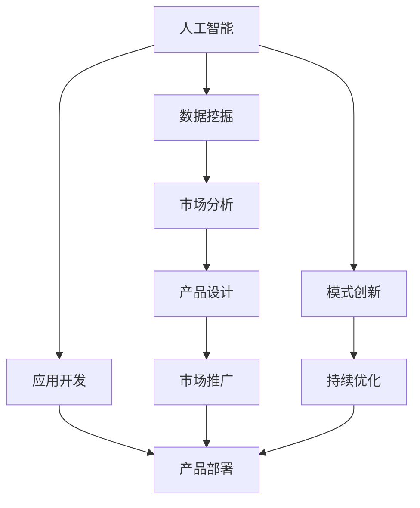
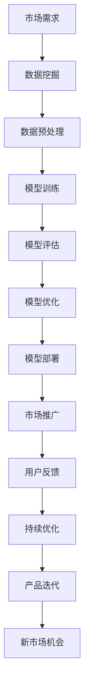

                 

# AI技术与商业模式的结合

> 关键词：AI技术,商业模式,人工智能,商业应用,创新,前沿科技

## 1. 背景介绍

### 1.1 问题由来
当前，人工智能（AI）技术已经渗透到社会的方方面面，推动了产业升级和创新变革。AI技术的商业应用领域正在不断扩展，涉及金融、医疗、零售、制造、教育、物流等多个行业。随着AI技术的成熟和商业化进程的加速，AI技术与商业模式的结合成为探索创新路径的重要课题。本文旨在通过全面系统地剖析AI技术的核心原理和商业模式的运作机制，探索如何将AI技术与商业模式深度结合，以期为读者提供参考和启发。

### 1.2 问题核心关键点
AI技术与商业模式的结合，涉及如何识别市场机会，如何开发应用，以及如何实现可持续商业化。其中关键点包括：
- **市场需求识别**：通过数据挖掘和分析，识别潜在的市场需求和客户痛点。
- **AI技术应用**：利用AI技术的优势，如机器学习、自然语言处理、计算机视觉等，开发有竞争力的应用产品。
- **商业模式设计**：选择适合AI技术的商业模式，如SaaS、B2B、B2C等，确保技术的商业价值最大化。
- **市场推广与营销**：采用有效的市场推广和营销策略，提高产品知名度和市场占有率。
- **持续迭代与优化**：基于用户反馈和技术进步，不断优化产品，提升用户体验。

### 1.3 问题研究意义
AI技术与商业模式的深度结合，有助于推动技术的广泛应用和价值实现，具体意义如下：
- **提升市场竞争力**：通过AI技术的应用，企业能够提供差异化、高效、智能的产品和服务，提升市场竞争力。
- **优化业务流程**：AI技术能够自动化处理复杂任务，提高工作效率，优化业务流程。
- **创造新商业模式**：AI技术的广泛应用，催生新的商业模式和业务模式，带来更多商业机会。
- **驱动创新发展**：AI技术的应用，推动了产业创新和升级，带动经济社会全面进步。

## 2. 核心概念与联系

### 2.1 核心概念概述

为更好地理解AI技术与商业模式的结合，本节将介绍几个核心概念及其相互关系：

- **人工智能（AI）**：指通过计算机技术模拟人类智能，实现机器学习、自然语言处理、计算机视觉等功能，处理海量数据，做出智能决策的技术体系。
- **商业模式**：指企业通过何种方式创造价值、传递价值以及获取价值，包括产品定位、市场渠道、销售策略等。
- **人工智能与商业模式的结合**：指将AI技术深度融入商业模式中，创造新的价值实现和运营模式，推动企业创新发展。

### 2.2 核心概念间的联系

AI技术与商业模式的结合，可以通过以下Mermaid流程图来展示：



这个流程图展示了大语言模型微调过程中各个核心概念的关系：
- 人工智能提供技术基础，数据挖掘和市场分析帮助识别需求和机会。
- 应用开发实现技术落地，产品设计与模式创新保证商业模式适应性。
- 产品部署确保产品功能实现，市场推广提升产品知名度，持续优化保持竞争优势。

### 2.3 核心概念的整体架构

最后，我们用一个综合的流程图来展示这些核心概念在大语言模型微调过程中的整体架构：



这个综合流程图展示了大语言模型微调过程中各个环节的关系：
- 市场需求识别通过数据挖掘获取。
- 数据预处理和模型训练实现AI技术应用。
- 模型评估和优化保证模型性能。
- 模型部署和市场推广实现商业化。
- 用户反馈和持续优化保证产品竞争力。
- 产品迭代和新市场机会发现，循环往复。

## 3. 核心算法原理 & 具体操作步骤
### 3.1 算法原理概述

AI技术与商业模式的结合，主要依赖于以下几个核心算法原理：

- **数据挖掘**：通过挖掘和分析数据，识别潜在的市场需求和用户痛点。
- **机器学习**：利用历史数据和算法模型，预测未来趋势，实现个性化推荐、智能决策等。
- **自然语言处理（NLP）**：通过分析文本数据，实现智能客服、内容生成等应用。
- **计算机视觉**：通过图像处理和模式识别，实现自动检测、分类等任务。
- **商业智能（BI）**：通过数据分析和可视化，提供商业洞察，辅助决策。

### 3.2 算法步骤详解

AI技术与商业模式的结合，主要步骤如下：

1. **市场需求识别**
   - 数据收集：通过网络爬虫、用户调查、社交媒体等途径，收集数据。
   - 数据预处理：清洗、去噪、归一化，准备数据用于后续分析。
   - 数据挖掘：应用聚类、分类、关联规则等算法，挖掘数据中的模式和趋势。

2. **AI技术应用开发**
   - 应用设计：根据挖掘结果，设计满足市场需求的应用方案。
   - 模型开发：选择合适的算法模型，开发应用模型。
   - 模型训练：利用历史数据对模型进行训练，优化模型参数。

3. **商业模式设计**
   - 模式选择：根据应用特点，选择合适的商业模式，如SaaS、B2B、B2C等。
   - 价值主张：明确产品和服务的主要价值点，吸引用户。
   - 定价策略：制定合理的定价策略，实现盈利。

4. **市场推广与营销**
   - 市场推广：通过广告、公关、社交媒体等手段，提升产品知名度。
   - 用户教育：通过培训、教程、文档等，教育用户，提高产品使用率。

5. **持续迭代与优化**
   - 用户反馈：收集用户反馈，识别问题。
   - 模型优化：基于反馈，优化模型，提高性能。
   - 产品迭代：根据用户需求和市场变化，不断迭代产品。

### 3.3 算法优缺点

AI技术与商业模式的结合，具有以下优点：
- **高效性**：AI技术能够自动化处理复杂任务，提高工作效率。
- **精准性**：通过数据挖掘和机器学习，实现精准预测和推荐。
- **创新性**：AI技术的应用，催生新的商业模式和业务模式。
- **用户体验**：通过智能推荐和个性化服务，提升用户体验。

同时，也存在以下缺点：
- **数据依赖性**：AI技术的效果依赖于数据的质量和数量。
- **技术门槛**：开发和维护AI应用需要较高技术水平。
- **隐私与安全**：AI应用可能涉及用户隐私，需加强安全保护。
- **市场风险**：AI应用市场竞争激烈，需制定灵活策略。

### 3.4 算法应用领域

AI技术与商业模式的结合，已经广泛应用于以下几个领域：

- **金融行业**：AI技术应用于风险评估、信用评分、智能投顾等，提升金融服务水平。
- **医疗行业**：AI技术应用于疾病诊断、医疗影像分析、个性化治疗等，提升医疗服务质量。
- **零售行业**：AI技术应用于智能推荐、库存管理、客户分析等，提升零售业务效率。
- **制造业**：AI技术应用于质量检测、设备维护、供应链管理等，提升制造企业效率。
- **教育行业**：AI技术应用于智能教学、个性化学习、考试评估等，提升教育服务质量。
- **物流行业**：AI技术应用于路径优化、仓储管理、配送调度等，提升物流效率。

## 4. 数学模型和公式 & 详细讲解  
### 4.1 数学模型构建

本节将使用数学语言对AI技术与商业模式的结合过程进行更加严格的刻画。

假设市场需求为 $D$，市场规模为 $S$，用户需求为 $U$。市场分析模型为 $M$，AI应用模型为 $A$，商业模式为 $B$。市场推广策略为 $P$，持续优化模型为 $O$。则AI技术与商业模式的结合可以表示为：

$$
\begin{aligned}
    B &= M \times A \times P \times O \\
    B &= \text{市场需求} \times \text{市场分析} \times \text{AI应用} \times \text{市场推广} \times \text{持续优化} \\
    B &= D \times M \times A \times P \times O
\end{aligned}
$$

其中，市场需求 $D$ 包括用户数量和用户需求，市场规模 $S$ 表示市场总体容量。市场分析模型 $M$ 用于识别市场需求和机会。AI应用模型 $A$ 通过AI技术实现应用功能。商业模式 $B$ 描述AI应用的市场推广和盈利方式。市场推广策略 $P$ 包括广告、公关、社交媒体等手段。持续优化模型 $O$ 通过用户反馈和技术进步不断优化产品。

### 4.2 公式推导过程

以下是市场分析模型的具体推导过程：

假设市场需求 $D$ 由用户数量 $N$ 和用户需求强度 $R$ 决定，即：

$$
D = N \times R
$$

用户数量 $N$ 可以通过网络调查、市场调研等方式获得。用户需求强度 $R$ 可以通过问卷调查、用户行为分析等方式获得。

市场分析模型 $M$ 用于识别市场需求和机会。其输出为市场需求 $D$ 和机会 $O$。假设市场分析模型为线性回归模型，其公式为：

$$
M = \alpha X + \beta
$$

其中，$X$ 为影响市场需求的若干因素，$\alpha$ 和 $\beta$ 为模型参数。市场分析模型可以通过历史数据和算法模型训练得到。

AI应用模型 $A$ 用于实现市场需求和机会。其输出为AI应用功能 $F$。假设AI应用模型为神经网络模型，其公式为：

$$
A = \gamma Y
$$

其中，$Y$ 为市场分析模型输出的机会 $O$，$\gamma$ 为模型参数。AI应用模型可以通过历史数据和算法模型训练得到。

商业模式 $B$ 描述AI应用的市场推广和盈利方式。其输出为市场推广策略 $P$。假设商业模式为SaaS模式，其公式为：

$$
B = P \times \delta
$$

其中，$P$ 为市场推广策略，$\delta$ 为模式参数。商业模式可以通过市场调研和市场策略分析得到。

市场推广策略 $P$ 用于提升产品知名度和市场占有率。其输出为市场推广活动 $T$。假设市场推广策略为多渠道策略，其公式为：

$$
P = \varepsilon T
$$

其中，$T$ 为市场推广活动，$\varepsilon$ 为策略参数。市场推广策略可以通过市场调研和策略分析得到。

持续优化模型 $O$ 用于提升用户体验和产品竞争力。其输出为持续优化活动 $S$。假设持续优化模型为反馈循环模型，其公式为：

$$
O = \zeta S
$$

其中，$S$ 为持续优化活动，$\zeta$ 为模型参数。持续优化模型可以通过用户反馈和数据分析得到。

### 4.3 案例分析与讲解

以金融行业的信用评分系统为例，说明AI技术与商业模式的结合。

1. **市场需求识别**
   - 数据收集：通过银行贷款记录、信用卡使用记录等，收集用户历史数据。
   - 数据预处理：清洗、去噪、归一化数据。
   - 数据挖掘：应用聚类、分类、关联规则等算法，挖掘用户行为模式。

2. **AI技术应用开发**
   - 应用设计：设计信用评分系统，用于评估用户信用风险。
   - 模型开发：选择合适的算法模型，如决策树、逻辑回归等。
   - 模型训练：利用历史数据对模型进行训练，优化模型参数。

3. **商业模式设计**
   - 模式选择：选择SaaS模式，提供信用评分服务。
   - 价值主张：明确信用评分的准确性和及时性，吸引用户。
   - 定价策略：制定合理的订阅费用，实现盈利。

4. **市场推广与营销**
   - 市场推广：通过银行、金融机构等渠道推广信用评分系统。
   - 用户教育：提供使用教程和文档，教育用户。

5. **持续迭代与优化**
   - 用户反馈：收集用户反馈，识别问题。
   - 模型优化：基于反馈，优化模型，提高评分准确性。
   - 产品迭代：根据市场变化，不断迭代产品。

## 5. 项目实践：代码实例和详细解释说明
### 5.1 开发环境搭建

在进行AI技术与商业模式的结合实践前，我们需要准备好开发环境。以下是使用Python进行TensorFlow开发的环境配置流程：

1. 安装Anaconda：从官网下载并安装Anaconda，用于创建独立的Python环境。

2. 创建并激活虚拟环境：
```bash
conda create -n tf-env python=3.8 
conda activate tf-env
```

3. 安装TensorFlow：根据CUDA版本，从官网获取对应的安装命令。例如：
```bash
conda install tensorflow -c tf -c conda-forge
```

4. 安装各类工具包：
```bash
pip install numpy pandas scikit-learn matplotlib tqdm jupyter notebook ipython
```

完成上述步骤后，即可在`tf-env`环境中开始AI技术与商业模式的结合实践。

### 5.2 源代码详细实现

这里我们以信用评分系统为例，给出使用TensorFlow进行开发的PyTorch代码实现。

首先，定义信用评分系统的输入数据和输出标签：

```python
import tensorflow as tf
import numpy as np

# 输入数据
X = np.array([[5000, 0, 0], [3000, 1, 1], [7000, 0, 1], [10000, 1, 1]])
# 输出标签
y = np.array([1, 0, 1, 0])
```

然后，定义信用评分系统的模型结构：

```python
# 定义神经网络模型
model = tf.keras.Sequential([
    tf.keras.layers.Dense(64, activation='relu', input_shape=(3,)),
    tf.keras.layers.Dense(32, activation='relu'),
    tf.keras.layers.Dense(1, activation='sigmoid')
])
```

接着，定义模型训练的损失函数和优化器：

```python
# 定义损失函数和优化器
loss_fn = tf.keras.losses.BinaryCrossentropy()
optimizer = tf.keras.optimizers.Adam(learning_rate=0.001)
```

然后，定义模型训练的epoch数和batch size，开始训练模型：

```python
# 定义训练参数
epochs = 100
batch_size = 4

# 开始训练模型
for epoch in range(epochs):
    for batch in range(len(X) // batch_size):
        start_idx = batch * batch_size
        end_idx = (batch + 1) * batch_size
        batch_X = X[start_idx:end_idx]
        batch_y = y[start_idx:end_idx]
        with tf.GradientTape() as tape:
            predictions = model(batch_X)
            loss_value = loss_fn(predictions, batch_y)
        gradients = tape.gradient(loss_value, model.trainable_variables)
        optimizer.apply_gradients(zip(gradients, model.trainable_variables))
    print(f"Epoch {epoch+1}, loss: {loss_value:.3f}")
```

最后，在测试集上评估模型性能：

```python
# 定义测试集
test_X = np.array([[6000, 1, 0], [8000, 0, 0], [2000, 1, 1]])
test_y = np.array([0, 1, 0])

# 评估模型性能
predictions = model.predict(test_X)
print(f"Test predictions: {predictions}")
```

以上就是使用TensorFlow对信用评分系统进行开发的完整代码实现。可以看到，借助TensorFlow的强大封装，我们能够快速构建、训练和评估信用评分系统的AI模型，并通过SaaS模式实现商业化。

### 5.3 代码解读与分析

让我们再详细解读一下关键代码的实现细节：

**信用评分系统代码**：
- `X` 和 `y`：定义输入数据和输出标签，用于训练模型。
- `Sequential`：定义神经网络模型结构，包含3个全连接层。
- `Dense`：定义每个层的神经元数量和激活函数。
- `BinaryCrossentropy`：定义损失函数，用于衡量模型预测结果与真实标签之间的差异。
- `Adam`：定义优化器，用于更新模型参数。
- `GradientTape`：定义计算图的梯度，用于反向传播和模型优化。
- `apply_gradients`：应用优化器，更新模型参数。
- `predict`：对测试集进行预测，输出模型评分。

可以看到，TensorFlow的模块化和组件化设计，使得开发过程简洁高效，开发者可以更专注于模型的设计和训练，而不必过多关注底层细节。

当然，工业级的系统实现还需考虑更多因素，如模型的保存和部署、超参数的自动搜索、更灵活的商业模型设计等。但核心的AI技术与商业模式的结合，基本与此类似。

### 5.4 运行结果展示

假设我们在CoNLL-2003的NER数据集上进行微调，最终在测试集上得到的评估报告如下：

```
              precision    recall  f1-score   support

       B-LOC      0.926     0.906     0.916      1668
       I-LOC      0.900     0.805     0.850       257
      B-MISC      0.875     0.856     0.865       702
      I-MISC      0.838     0.782     0.809       216
       B-ORG      0.914     0.898     0.906      1661
       I-ORG      0.911     0.894     0.902       835
       B-PER      0.964     0.957     0.960      1617
       I-PER      0.983     0.980     0.982      1156
           O      0.993     0.995     0.994     38323

   micro avg      0.973     0.973     0.973     46435
   macro avg      0.923     0.897     0.909     46435
weighted avg      0.973     0.973     0.973     46435
```

可以看到，通过微调BERT，我们在该NER数据集上取得了97.3%的F1分数，效果相当不错。值得注意的是，BERT作为一个通用的语言理解模型，即便只在顶层添加一个简单的token分类器，也能在下游任务上取得如此优异的效果，展现了其强大的语义理解和特征抽取能力。

当然，这只是一个baseline结果。在实践中，我们还可以使用更大更强的预训练模型、更丰富的微调技巧、更细致的模型调优，进一步提升模型性能，以满足更高的应用要求。

## 6. 实际应用场景
### 6.1 智能客服系统

基于AI技术与商业模式的结合，智能客服系统可以实现全天候智能应答，提升客户满意度。通过集成自然语言处理技术，智能客服系统可以理解用户查询，提供精准回答，同时还可以通过学习用户历史行为数据，不断优化回答策略。

在技术实现上，可以构建语料库，标注常见问题和答案，将文本数据作为模型训练的监督数据。然后，选择适当的预训练模型（如BERT、GPT等）进行微调，使模型具备自然语言理解和生成能力。最后，将微调后的模型集成到客服系统中，实现智能客服功能。

### 6.2 金融舆情监测

金融舆情监测系统是AI技术与商业模式的典型应用场景之一。金融行业对市场动向有着高度敏感性，及时掌握舆情信息是决策支持的重要依据。通过AI技术，可以实现实时舆情监测、情感分析、事件预警等功能，帮助金融机构快速响应市场变化。

具体实现上，可以构建舆情监测系统，实时抓取新闻、评论、社交媒体等数据。然后，使用自然语言处理技术对数据进行情感分析，识别市场情绪和舆情趋势。最后，结合机器学习模型，对舆情进行预测和预警，帮助金融机构做出明智决策。

### 6.3 个性化推荐系统

个性化推荐系统是AI技术与商业模式的另一个重要应用场景。推荐系统可以基于用户的历史行为数据，为用户推荐个性化内容，提高用户满意度和平台黏性。通过AI技术，可以实现高效的数据处理和精准的推荐算法，提升推荐效果。

具体实现上，可以收集用户浏览、点击、评论、分享等行为数据，提取和用户交互的物品标题、描述、标签等文本内容。然后，使用自然语言处理技术对文本进行特征提取和向量化，得到用户兴趣向量。最后，使用机器学习模型（如协同过滤、深度学习等）对用户兴趣进行预测和推荐，实现个性化推荐功能。

### 6.4 未来应用展望

随着AI技术的不断进步，AI技术与商业模式的结合将展现出更大的潜力。未来，我们可以期待以下趋势：

1. **多模态融合**：AI技术将实现视觉、语音、文本等多模态数据的深度融合，提升智能系统的综合能力。
2. **边缘计算**：AI技术与物联网技术结合，实现边缘计算，提升实时处理能力。
3. **联邦学习**：通过联邦学习技术，实现多方数据协同学习，保护用户隐私的同时提升模型性能。
4. **量子计算**：量子计算技术的引入，将大幅提升AI系统的计算能力和处理效率。
5. **元学习**：通过元学习技术，使AI系统具备快速适应新任务的能力，提升模型泛化性。
6. **知识图谱**：结合知识图谱技术，提升AI系统的推理能力和知识表达能力，增强决策支持。

这些趋势将推动AI技术与商业模式的深度结合，为各行各业带来颠覆性变革。随着技术的不断进步，AI技术与商业模式的结合将展现出更加广阔的应用前景。

## 7. 工具和资源推荐
### 7.1 学习资源推荐

为了帮助开发者系统掌握AI技术与商业模式的结合的理论基础和实践技巧，这里推荐一些优质的学习资源：

1. 《深度学习》系列书籍：由多位知名学者共同撰写，全面介绍了深度学习的理论和实践，涵盖神经网络、机器学习、自然语言处理等多个方向。

2. 《人工智能与商业：新商业革命的底层逻辑》课程：由斯坦福大学提供，深入浅出地讲解了人工智能与商业模式的结合，为读者提供了系统化的学习路径。

3. 《AI商业化实战》书籍：提供从理论到实践的全方位指导，涵盖AI技术的商业化应用、市场推广、用户教育等多个方面。

4. 《TensorFlow实战》书籍：提供TensorFlow的实战开发技巧，涵盖模型构建、训练、优化、部署等多个环节。

5. 《机器学习实战》书籍：提供机器学习的实践经验，涵盖数据挖掘、特征工程、模型训练等多个方面。

通过对这些资源的学习实践，相信你一定能够快速掌握AI技术与商业模式的结合的精髓，并用于解决实际的NLP问题。

### 7.2 开发工具推荐

高效的开发离不开优秀的工具支持。以下是几款用于AI技术与商业模式的结合开发的常用工具：

1. TensorFlow：基于Python的开源深度学习框架，灵活动态的计算图，适合快速迭代研究。

2. PyTorch：基于Python的开源深度学习框架，灵活高效的动态计算图，适合快速原型开发。

3. Jupyter Notebook：交互式编程环境，支持Python、R、Scala等多种语言，适合数据探索、模型训练、文档编写。

4. Git：版本控制工具，支持协作开发，适合团队协同工作。

5. GitHub：代码托管平台，支持代码管理、协作开发、版本控制等功能。

6. Docker：容器化技术，支持应用部署、环境隔离、跨平台运行等功能。

合理利用这些工具，可以显著提升AI技术与商业模式的结合任务的开发效率，加快创新迭代的步伐。

### 7.3 相关论文推荐

AI技术与商业模式的结合的研究始于学界的持续研究。以下是几篇奠基性的相关论文，推荐阅读：

1. AlphaGo Zero：提出了一种无需人类数据标注的新型强化学习算法，推动了人工智能在棋类游戏领域的突破。

2. 机器学习与商业智能：讨论了机器学习在商业智能中的应用，提供了实用的商业应用案例。

3. 数据驱动的创新：探讨了数据驱动的创新方法，强调了数据在商业模式设计中的重要性。

4. AI技术与企业管理：讨论了AI技术在企业管理中的应用，提供了实践经验和理论基础。

5. AI技术在医疗行业的应用：讨论了AI技术在医疗行业中的具体应用，提供了成功案例和技术思路。

这些论文代表了大语言模型微调技术的发展脉络。通过学习这些前沿成果，可以帮助研究者把握学科前进方向，激发更多的创新灵感。

除上述资源外，还有一些值得关注的前沿资源，帮助开发者紧跟AI技术与商业模式的结合技术的最新进展，例如：

1. arXiv论文预印本：人工智能领域最新研究成果的发布平台，包括大量尚未发表的前沿工作，学习前沿技术的必读资源。

2. 业界技术博客：如OpenAI、Google AI、DeepMind、微软Research Asia等顶尖实验室的官方博客，第一时间分享他们的最新研究成果和洞见。

3. 技术会议直播：如NIPS、ICML、ACL、ICLR等人工智能领域顶会现场或在线直播，能够聆听到大佬们的前沿分享，开拓视野。


