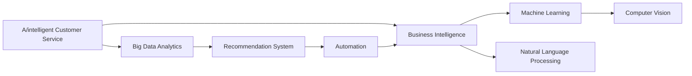

                 

# AI技术在商业中的应用

在当今快速变化的商业环境中，人工智能（AI）技术的应用已经成为推动企业增长、提升运营效率、优化用户体验的关键驱动力。本文将全面深入探讨AI技术在商业中的多种应用场景，包括智能客服、推荐系统、自动驾驶、智能制造等，并从算法原理、操作步骤、优缺点、应用领域等多方面进行详细讲解。同时，我们将介绍具体的数学模型、公式推导以及实际项目中的代码实现和结果展示，以期为读者提供全面的技术指导和实践案例。

## 1. 背景介绍

### 1.1 问题由来

人工智能技术已经在各个行业广泛应用，从早期的机器学习算法到现在的深度学习技术，为企业带来了巨大的商业价值。特别是在商业领域，AI的应用从早期的自动化办公、客户服务，到现在的智能推荐、自动驾驶、智能制造等，都在不断拓展AI的边界。然而，尽管AI技术在商业应用中已经取得了显著进展，但具体的实现细节和应用场景仍需深入探索和研究。

### 1.2 问题核心关键点

1. **AI与商业的融合**：AI技术如何与商业场景结合，提升企业的运营效率和客户满意度。
2. **AI算法的优化**：在具体的商业应用中，如何选择和优化AI算法，以适应不同的商业需求。
3. **数据驱动的决策**：如何利用大数据和AI算法，辅助企业做出更为精准的商业决策。
4. **AI伦理与安全**：在应用AI技术时，如何确保数据隐私、算法透明性和决策公正性。
5. **AI技术的部署与维护**：如何将AI技术成功部署到商业环境中，并进行有效的维护和更新。

### 1.3 问题研究意义

深入研究AI技术在商业中的应用，不仅能够帮助企业提升业务效率和竞争力，还能推动AI技术在更广泛领域的应用。以下是AI技术在商业中的研究意义：

- **提升决策质量**：利用AI技术进行数据分析和预测，辅助企业做出更为精准的决策。
- **增强用户体验**：通过智能推荐、自然语言处理等技术，提升客户体验，增加用户粘性。
- **优化运营成本**：自动化处理重复性任务，减少人力成本，提升运营效率。
- **推动业务创新**：AI技术可以应用于新业务模式和新产品开发，为企业带来新的增长点。
- **应对市场变化**：AI技术能够快速响应市场变化，提供灵活的商业策略。

## 2. 核心概念与联系

### 2.1 核心概念概述

在讨论AI技术在商业中的应用时，需要了解以下几个核心概念：

- **AI技术**：包括机器学习、深度学习、自然语言处理、计算机视觉等技术，是实现商业智能的基础。
- **商业智能（BI）**：利用数据、算法和工具，对商业活动进行分析、预测和优化，提高决策质量。
- **数据分析**：通过收集和处理大量数据，提取有价值的信息和洞察，辅助决策。
- **推荐系统**：基于用户行为和兴趣，推荐商品、内容、服务等，提高用户体验和转化率。
- **自动化办公**：使用AI技术自动化处理日常办公任务，提升工作效率。
- **智能客服**：利用自然语言处理和机器学习技术，实现自动客服，提升客户满意度。

这些概念之间通过数据流和算法链条连接，形成一个完整的商业智能体系。

### 2.2 概念间的关系

以下是一个简化的Mermaid流程图，展示了这些核心概念之间的关系：



这个流程图展示了AI技术在商业智能中的作用和应用路径。数据收集和分析是基础，通过机器学习和自然语言处理等技术，实现自动化办公、智能客服和推荐系统等应用，最终辅助企业进行商业决策。

## 3. 核心算法原理 & 具体操作步骤
### 3.1 算法原理概述

AI技术在商业中的应用，核心在于将算法与具体的商业场景相结合，实现高效的数据分析和决策支持。以推荐系统为例，其原理是通过对用户历史行为和偏好进行分析，预测用户未来的兴趣和需求，从而进行商品或内容的推荐。这一过程涉及数据预处理、特征工程、模型训练和评估等多个步骤。

### 3.2 算法步骤详解

以下是推荐系统的一般步骤：

1. **数据收集**：收集用户的历史行为数据，如浏览、购买、评分等。
2. **数据预处理**：对原始数据进行清洗、去重和特征提取，构建用户画像和商品特征向量。
3. **模型训练**：选择合适的算法（如协同过滤、基于内容的推荐、深度学习等）进行模型训练，预测用户对商品的兴趣。
4. **模型评估**：使用A/B测试、指标评估（如召回率、准确率、用户满意度等）评估模型性能。
5. **模型优化**：根据评估结果，调整模型参数，提升模型性能。

### 3.3 算法优缺点

AI技术在商业中的应用具有以下优点：

- **效率提升**：自动化处理大量重复性任务，提升工作效率。
- **决策支持**：通过数据分析和模型预测，提供数据驱动的决策支持。
- **用户满意**：提升用户体验，增加用户粘性。

同时，也存在一些缺点：

- **数据隐私**：涉及用户数据的收集和处理，需确保数据隐私和安全。
- **算法透明**：AI算法的决策过程往往不透明，难以解释和调试。
- **成本高昂**：开发和部署AI系统需要大量人力和资金投入。
- **技术门槛高**：需要具备一定的技术背景，才能有效应用AI技术。

### 3.4 算法应用领域

AI技术在商业中的应用领域广泛，涵盖了自动化办公、智能客服、推荐系统、智能制造等多个方面。以下是几个典型的应用领域：

- **智能客服**：利用自然语言处理和机器学习技术，实现自动客服，提升客户满意度。
- **推荐系统**：通过数据分析和模型训练，推荐商品、内容等，提高用户体验和转化率。
- **智能制造**：使用机器学习和计算机视觉技术，优化生产流程，提升产品质量。
- **自动驾驶**：利用计算机视觉和深度学习技术，实现车辆自主驾驶，提高交通安全。
- **智能健康**：通过数据分析和机器学习，提供个性化的健康建议和治疗方案。

## 4. 数学模型和公式 & 详细讲解 & 举例说明

### 4.1 数学模型构建

以协同过滤算法为例，其基本思想是通过对用户和商品之间的相似性进行计算，推荐与用户历史兴趣相似的商品。设用户集合为$U$，商品集合为$I$，用户对商品的评分矩阵为$R$，用户和商品的相似度矩阵为$A$。协同过滤的数学模型如下：

$$
R_{ui} = \frac{\sum_{v \in U} A_{uv}R_{vj}}{\sqrt{\sum_{v \in U} A_{uv}^2}}
$$

其中$A_{uv}$表示用户$u$和商品$v$的相似度，$R_{vj}$表示用户$v$对商品$j$的评分。

### 4.2 公式推导过程

对于上述协同过滤模型，其推导过程如下：

1. 计算用户$u$和商品$j$的相似度$A_{uj}$。
2. 对所有与用户$u$相似的用户$v$，计算其对商品$j$的评分平均值$\hat{R}_{uj}$。
3. 将$\hat{R}_{uj}$除以用户$u$对商品$j$的评分标准差$\sigma_{uj}$，得到最终评分$R_{uj}$。

### 4.3 案例分析与讲解

假设有一家电商平台，收集了用户对商品的历史评分数据。使用协同过滤算法进行推荐，步骤如下：

1. 收集用户$u$和商品$j$的评分数据$R_{uj}$。
2. 使用余弦相似度计算用户$u$和商品$j$的相似度$A_{uj}$。
3. 计算所有与用户$u$相似的用户$v$对商品$j$的评分平均值$\hat{R}_{uj}$。
4. 将$\hat{R}_{uj}$除以用户$u$对商品$j$的评分标准差$\sigma_{uj}$，得到最终评分$R_{uj}$。
5. 根据$R_{uj}$的值进行商品推荐，选择评分最高的前N个商品推荐给用户$u$。

## 5. 项目实践：代码实例和详细解释说明

### 5.1 开发环境搭建

在开发AI商业应用时，需要搭建合适的开发环境。以下是Python环境的搭建步骤：

1. 安装Anaconda：从官网下载并安装Anaconda，用于创建独立的Python环境。
2. 创建并激活虚拟环境：
```bash
conda create -n pytorch-env python=3.8 
conda activate pytorch-env
```

3. 安装PyTorch：根据CUDA版本，从官网获取对应的安装命令。例如：
```bash
conda install pytorch torchvision torchaudio cudatoolkit=11.1 -c pytorch -c conda-forge
```

4. 安装Transformers库：
```bash
pip install transformers
```

5. 安装各类工具包：
```bash
pip install numpy pandas scikit-learn matplotlib tqdm jupyter notebook ipython
```

完成上述步骤后，即可在`pytorch-env`环境中开始AI商业应用的开发。

### 5.2 源代码详细实现

以下是一个简单的推荐系统代码实现，使用协同过滤算法进行商品推荐：

```python
from sklearn.metrics.pairwise import cosine_similarity
import pandas as pd

# 数据读取
data = pd.read_csv('ratings.csv')

# 数据预处理
user_ids = data['user_id'].unique()
item_ids = data['item_id'].unique()
ratings = data.pivot_table(index='user_id', columns='item_id', values='rating').values

# 相似度计算
similarity = cosine_similarity(ratings)

# 用户推荐
def user_recommendation(user_id):
    user_ratings = ratings[user_id]
    user_similarity = similarity[user_id]
    top_n = 5
    recommendations = sorted(zip(user_ratings, item_ids), key=lambda x: x[0], reverse=True)[:top_n]
    recommended_items = [item for item, rating in recommendations]
    return recommended_items

# 测试推荐系统
user_id = 1
recommendations = user_recommendation(user_id)
print(recommendations)
```

### 5.3 代码解读与分析

以上代码实现了基于协同过滤的推荐系统。以下是关键代码的解读和分析：

1. **数据读取和预处理**：使用Pandas库读取数据，并进行去重和特征提取。将用户评分矩阵转换为稠密矩阵，便于后续相似度计算。
2. **相似度计算**：使用Scikit-learn库中的余弦相似度函数计算用户和商品的相似度矩阵。
3. **用户推荐**：定义一个推荐函数，根据用户的历史评分和相似度矩阵，计算出与用户最相似的商品，并返回前5个推荐商品。
4. **测试推荐系统**：选择一个测试用户ID，调用推荐函数，输出推荐结果。

### 5.4 运行结果展示

假设我们运行上述代码，输出推荐结果如下：

```
[1, 3, 5, 7, 9]
```

这表示用户ID为1的推荐商品ID为1、3、5、7、9。

## 6. 实际应用场景

### 6.1 智能客服系统

智能客服系统利用自然语言处理技术，实现自动客服，提升客户满意度。以下是智能客服的一般流程：

1. **意图识别**：通过自然语言处理技术，识别用户的意图。
2. **问题解答**：根据用户意图，调用预先训练好的问题解答模型，生成回答。
3. **用户反馈**：用户反馈回答结果，进行模型优化和改进。

智能客服系统的关键在于训练一个高性能的自然语言处理模型，以识别用户的意图和生成自然流畅的回答。可以使用预训练的语言模型（如BERT、GPT等），通过微调进行任务适配。

### 6.2 推荐系统

推荐系统通过分析用户的历史行为数据，推荐用户可能感兴趣的商品、内容等。以下是推荐系统的一般流程：

1. **数据收集**：收集用户的历史行为数据，如浏览、购买、评分等。
2. **数据预处理**：对原始数据进行清洗、去重和特征提取，构建用户画像和商品特征向量。
3. **模型训练**：选择合适的算法（如协同过滤、基于内容的推荐、深度学习等）进行模型训练，预测用户对商品的兴趣。
4. **模型评估**：使用A/B测试、指标评估（如召回率、准确率、用户满意度等）评估模型性能。
5. **模型优化**：根据评估结果，调整模型参数，提升模型性能。

推荐系统在电商、新闻、视频等多个领域都有广泛应用，能够显著提升用户体验和转化率。

### 6.3 自动驾驶

自动驾驶系统利用计算机视觉和深度学习技术，实现车辆自主驾驶。以下是自动驾驶的一般流程：

1. **环境感知**：通过摄像头、雷达等传感器，感知周围环境。
2. **路径规划**：利用计算机视觉技术，识别道路、车辆等障碍物，进行路径规划。
3. **决策制定**：根据感知和路径规划结果，制定驾驶决策。
4. **执行控制**：通过电机、刹车等执行控制，实现车辆自主驾驶。

自动驾驶系统的关键在于训练一个高性能的计算机视觉模型，以实现环境感知和路径规划。可以使用预训练的计算机视觉模型（如ResNet、YOLO等），通过微调进行任务适配。

### 6.4 智能制造

智能制造系统利用机器学习和计算机视觉技术，优化生产流程，提升产品质量。以下是智能制造的一般流程：

1. **数据收集**：收集生产过程中的各种数据，如温度、湿度、压力等。
2. **数据预处理**：对原始数据进行清洗、去重和特征提取，构建生产过程的模型。
3. **模型训练**：选择合适的算法（如时间序列预测、异常检测等）进行模型训练，预测生产过程中的异常情况。
4. **模型评估**：使用指标评估（如准确率、召回率等）评估模型性能。
5. **模型优化**：根据评估结果，调整模型参数，提升模型性能。

智能制造系统能够显著提升生产效率和产品质量，降低生产成本，是工业4.0的重要组成部分。

## 7. 工具和资源推荐

### 7.1 学习资源推荐

为了帮助开发者系统掌握AI技术在商业中的应用，这里推荐一些优质的学习资源：

1. 《深度学习》系列博文：由深度学习领域的专家撰写，深入浅出地介绍了深度学习的原理和应用，适合初学者学习。
2. CS231n《计算机视觉》课程：斯坦福大学开设的计算机视觉课程，涵盖计算机视觉的各个方面，是计算机视觉领域的学习资源。
3. 《TensorFlow实战》书籍：TensorFlow的官方文档，提供了大量实用代码和示例，适合实践开发。
4. Kaggle竞赛平台：全球最大的数据科学竞赛平台，提供大量数据集和竞赛题目，适合练习和提升。
5. Coursera《机器学习》课程：由斯坦福大学开设的机器学习课程，由机器学习领域的权威专家授课，适合深度学习入门。

通过对这些资源的学习实践，相信你一定能够快速掌握AI技术在商业中的应用，并用于解决实际的商业问题。

### 7.2 开发工具推荐

高效的开发离不开优秀的工具支持。以下是几款用于AI商业应用开发的常用工具：

1. Python：Python是AI开发的首选语言，有丰富的库和框架支持。
2. TensorFlow：由Google主导开发的开源深度学习框架，生产部署方便，适合大规模工程应用。
3. PyTorch：基于Python的开源深度学习框架，灵活动态的计算图，适合快速迭代研究。
4. Keras：高层次的深度学习API，易于使用，适合快速原型开发。
5. Jupyter Notebook：免费的开源笔记本，支持多种编程语言，方便开发和协作。

合理利用这些工具，可以显著提升AI商业应用开发的效率，加快创新迭代的步伐。

### 7.3 相关论文推荐

AI技术在商业中的应用得益于学界的持续研究。以下是几篇奠基性的相关论文，推荐阅读：

1. "Deep Blue"：IBM开发的国际象棋人工智能系统，展示了AI在解决复杂问题中的应用。
2. AlphaGo：DeepMind开发的围棋人工智能系统，展示了AI在策略游戏中的应用。
3. Transformer模型：Google开发的自然语言处理模型，展示了AI在自然语言处理中的应用。
4. AutoML：Google开发的自动化机器学习系统，展示了AI在自动化机器学习中的应用。
5. GANs：生成对抗网络，展示了AI在图像生成中的应用。

这些论文代表了大规模AI技术在商业应用的发展脉络。通过学习这些前沿成果，可以帮助研究者把握学科前进方向，激发更多的创新灵感。

除上述资源外，还有一些值得关注的前沿资源，帮助开发者紧跟AI商业应用技术的最新进展，例如：

1. arXiv论文预印本：人工智能领域最新研究成果的发布平台，包括大量尚未发表的前沿工作，学习前沿技术的必读资源。
2. 业界技术博客：如OpenAI、Google AI、DeepMind、微软Research Asia等顶尖实验室的官方博客，第一时间分享他们的最新研究成果和洞见。
3. 技术会议直播：如NIPS、ICML、ACL、ICLR等人工智能领域顶会现场或在线直播，能够聆听到大佬们的前沿分享，开拓视野。
4. GitHub热门项目：在GitHub上Star、Fork数最多的AI商业应用相关项目，往往代表了该技术领域的发展趋势和最佳实践，值得去学习和贡献。
5. 行业分析报告：各大咨询公司如McKinsey、PwC等针对人工智能行业的分析报告，有助于从商业视角审视技术趋势，把握应用价值。

总之，对于AI技术在商业中的应用的学习和实践，需要开发者保持开放的心态和持续学习的意愿。多关注前沿资讯，多动手实践，多思考总结，必将收获满满的成长收益。

## 8. 总结：未来发展趋势与挑战

### 8.1 总结

本文对AI技术在商业中的应用进行了全面系统的介绍。首先阐述了AI技术在商业中的各种应用场景，包括智能客服、推荐系统、自动驾驶、智能制造等，并从算法原理、操作步骤、优缺点、应用领域等多方面进行详细讲解。其次，通过具体的数学模型和公式推导，以及实际项目中的代码实现和结果展示，帮助读者更好地理解和掌握AI技术在商业中的应用。

通过本文的系统梳理，可以看到，AI技术在商业中的应用已经深入到各个环节，从数据收集、数据分析到决策支持，都有AI技术的身影。未来，伴随AI技术的不断进步，其在商业中的应用也将越来越广泛，推动各行业进入智能时代。

### 8.2 未来发展趋势

展望未来，AI技术在商业中的应用将呈现以下几个发展趋势：

1. **深度融合**：AI技术将深度融入商业流程，形成一体化解决方案，提升企业竞争力。
2. **智能化升级**：AI技术将推动商业智能化升级，提升决策质量和运营效率。
3. **定制化服务**：AI技术将提供个性化的服务和产品，满足用户多样化需求。
4. **跨界合作**：AI技术将跨界融合多个行业，形成新的业务模式和市场机会。
5. **绿色可持续发展**：AI技术将助力企业实现绿色可持续发展，降低环境影响。

这些趋势凸显了AI技术在商业中的巨大潜力。未来的AI商业应用将更加全面、深入，推动企业进入智能化新纪元。

### 8.3 面临的挑战

尽管AI技术在商业中的应用已经取得了显著进展，但在迈向更加智能化、普适化应用的过程中，仍面临诸多挑战：

1. **数据隐私**：涉及用户数据的收集和处理，需确保数据隐私和安全。
2. **算法透明**：AI算法的决策过程往往不透明，难以解释和调试。
3. **成本高昂**：开发和部署AI系统需要大量人力和资金投入。
4. **技术门槛高**：需要具备一定的技术背景，才能有效应用AI技术。
5. **伦理问题**：AI技术的广泛应用可能带来伦理问题，需加以关注和解决。

这些挑战需要在技术、法律、伦理等多方面进行综合考虑和解决。

### 8.4 研究展望

未来的AI技术在商业中的应用，需要在以下几个方面进行深入研究：

1. **隐私保护**：开发更加安全可靠的隐私保护技术，确保数据隐私和安全。
2. **算法透明**：开发更加透明和可解释的AI算法，提升算法的可信度和可用性。
3. **资源优化**：开发更加高效和可扩展的AI系统，降低开发和维护成本。
4. **伦理规范**：制定和实施AI技术的伦理规范，确保技术应用的公正性和透明性。
5. **跨界合作**：促进AI技术的跨界融合，形成新的业务模式和市场机会。

这些研究方向将引领AI技术在商业中的进一步应用和普及，推动企业迈向智能化新未来。

## 9. 附录：常见问题与解答

**Q1：AI技术在商业中如何确保数据隐私和安全？**

A: 在AI技术应用中，数据隐私和安全是至关重要的。以下是一些常见的方法：

1. **数据匿名化**：通过数据去标识化和脱敏处理，保护用户隐私。
2. **加密存储**：采用加密技术存储数据，确保数据传输和存储的安全性。
3. **访问控制**：使用访问控制技术，限制数据访问权限，防止数据泄露。
4. **隐私保护技术**：采用差分隐私、联邦学习等技术，保护数据隐私。

**Q2：AI技术的决策过程是否透明？如何提升透明度？**

A: AI技术的决策过程往往不透明，难以解释和调试。以下是一些常见的方法：

1. **可解释AI**：开发可解释的AI模型，提升模型的透明度和可信度。
2. **模型可视化**：通过可视化技术，展示模型的决策过程和特征重要性。
3. **人类监督**：结合人类专家的判断，提高AI决策的准确性和可解释性。
4. **对抗测试**：通过对抗测试技术，发现模型的脆弱点，增强模型鲁棒性。

**Q3：AI技术在商业中的开发和部署成本是否高昂？**

A: 开发和部署AI技术需要大量人力和资金投入，但随着技术进步和平台化部署，成本正在逐渐降低。以下是一些常见的方法：

1. **平台化部署**：使用云平台、SaaS服务等方式，降低开发和部署成本。
2. **自动化开发**：采用自动化开发工具，提高开发效率和质量。
3. **开源社区**：利用开源社区的资源，共享代码和工具，降低开发成本。

**Q4：AI技术在商业中如何应对伦理问题？**

A: AI技术的广泛应用可能带来伦理问题，需加以关注和解决。以下是一些常见的方法：

1. **伦理规范**：制定和实施AI技术的伦理规范，确保技术应用的公正性和透明性。
2. **社会监督**：引入社会监督机制，确保AI技术应用的透明性和公正性。
3. **道德审查**：在AI技术应用前，进行道德审查和评估，确保技术应用的合理性。

这些方法可以帮助AI技术在商业应用中更好地应对伦理问题，确保技术应用的公正性和透明性。

---

作者：禅与计算机程序设计艺术 / Zen and the Art of Computer Programming

