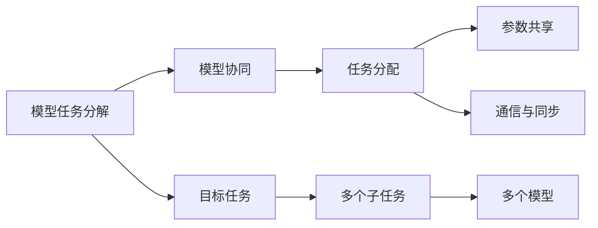
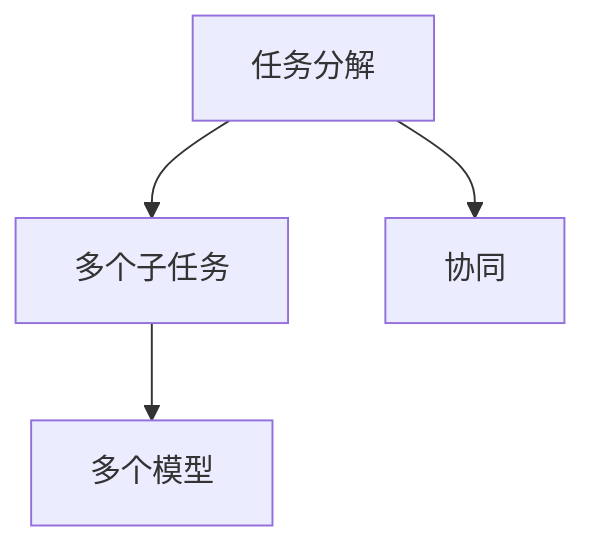
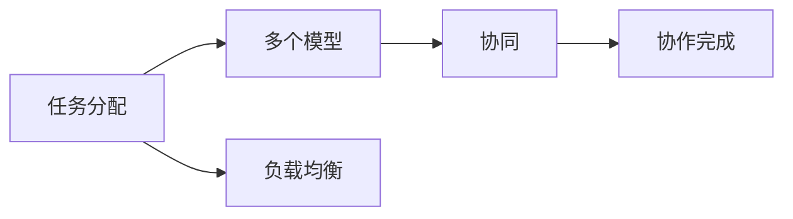
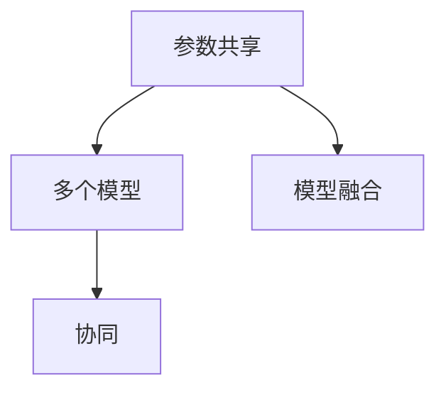
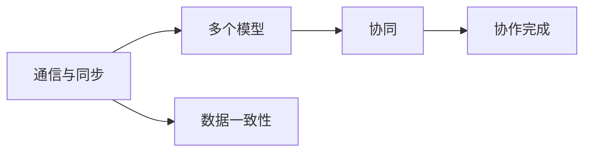
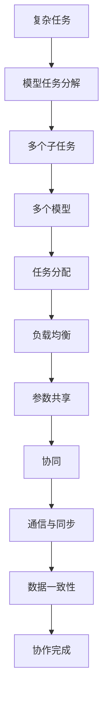

                 

## 1. 背景介绍

### 1.1 问题由来
随着人工智能技术的快速进步，AI模型已经广泛应用于各个领域，如自然语言处理(NLP)、计算机视觉(CV)、自动驾驶、机器人等。然而，AI模型在实际应用中往往需要处理大量的数据和复杂的任务，这使得模型的开发和维护变得越来越复杂。为了提高模型的效率和效果，很多任务被分解为多个子任务，并由不同的模型来协作完成。这种模型之间的协作与分配成为了一个重要的研究方向。

### 1.2 问题核心关键点
AI模型的任务协作与分配主要涉及以下几个方面：

- **模型任务分解**：将复杂任务分解为多个子任务，每个子任务由一个模型来完成。
- **模型协同**：不同模型之间如何协作，以获得更好的效果。
- **任务分配**：如何合理分配任务，以平衡模型之间的负载，提高整体系统的效率。
- **参数共享**：不同模型之间是否共享参数，以及如何共享参数。
- **通信与同步**：不同模型之间如何进行通信和同步，以确保协作的顺利进行。

这些关键点决定了AI模型在协作与分配方面的优化方向和实践方法。

### 1.3 问题研究意义
研究AI模型的任务协作与分配对于提高AI系统的效率和效果具有重要意义：

1. **提升模型效果**：通过合理的任务分配和协同，可以在不增加过多参数的情况下提高模型的精度和泛化能力。
2. **降低开发成本**：将复杂任务分解为多个子任务，可以降低模型开发和维护的难度，减少人力和物力投入。
3. **加速模型迭代**：通过任务协作与分配，可以加速模型迭代和优化过程，提高模型的训练速度和效果。
4. **增强系统鲁棒性**：合理的任务分配和协同可以增强系统的鲁棒性，避免单一模型的性能波动对整个系统的影响。
5. **支持实时应用**：任务协作与分配可以支持实时应用场景，如自动驾驶、机器人等，提高系统的响应速度和可靠性。

## 2. 核心概念与联系

### 2.1 核心概念概述

为了更好地理解AI模型的任务协作与分配，我们需要先介绍几个核心概念：

- **模型任务分解**：将一个复杂任务分解为多个子任务，每个子任务由一个模型来处理。例如，在自然语言处理中，可以将情感分析任务分解为语言理解、特征提取和分类等多个子任务。
- **模型协同**：不同模型之间通过协作，共同完成一个复杂任务。例如，在计算机视觉中，可以将图像识别任务分解为特征提取和分类等多个子任务，多个模型共同完成。
- **任务分配**：根据不同模型的能力和负载，合理分配任务。例如，在分布式系统中，可以根据每个节点的计算能力和网络带宽，合理分配任务。
- **参数共享**：不同模型之间共享参数，以提高模型的泛化能力和效果。例如，在迁移学习中，可以在多个模型之间共享预训练的参数，提高模型的性能。
- **通信与同步**：不同模型之间通过通信和同步，确保协作的顺利进行。例如，在分布式系统中，不同节点之间需要通信和同步数据，以实现协同工作。

这些核心概念之间存在着紧密的联系，构成了AI模型任务协作与分配的基本框架。下面将通过一个Mermaid流程图来展示这些概念之间的关系：



这个流程图展示了模型任务分解、模型协同、任务分配、参数共享和通信与同步之间的关系：

1. 复杂任务通过模型任务分解，转化为多个子任务。
2. 多个模型协同完成这些子任务。
3. 根据不同模型的能力和负载，进行任务分配。
4. 多个模型之间共享参数，提高模型的泛化能力和效果。
5. 不同模型之间通过通信和同步，确保协作的顺利进行。

### 2.2 概念间的关系

这些核心概念之间存在着紧密的联系，形成了AI模型任务协作与分配的完整生态系统。下面将通过几个Mermaid流程图来展示这些概念之间的关系。

#### 2.2.1 任务分解与模型协同的关系



这个流程图展示了任务分解和模型协同之间的关系：

1. 复杂任务通过模型任务分解，转化为多个子任务。
2. 多个模型协同完成这些子任务。

#### 2.2.2 任务分配与协同的关系



这个流程图展示了任务分配和协同之间的关系：

1. 根据不同模型的能力和负载，进行任务分配。
2. 多个模型协同完成这些任务。

#### 2.2.3 参数共享与协同的关系



这个流程图展示了参数共享和协同之间的关系：

1. 多个模型之间共享参数。
2. 多个模型协同完成这些任务。

#### 2.2.4 通信与同步与协同的关系



这个流程图展示了通信与同步和协同之间的关系：

1. 不同模型之间通过通信和同步，确保协作的顺利进行。
2. 多个模型协同完成这些任务。

### 2.3 核心概念的整体架构

最后，我们用一个综合的流程图来展示这些核心概念在大语言模型微调过程中的整体架构：



这个综合流程图展示了从任务分解到协同完成的全过程：

1. 复杂任务通过模型任务分解，转化为多个子任务。
2. 根据不同模型的能力和负载，进行任务分配。
3. 多个模型之间共享参数，提高模型的泛化能力和效果。
4. 不同模型之间通过通信和同步，确保协作的顺利进行。

通过这些流程图，我们可以更清晰地理解AI模型任务协作与分配过程中各个核心概念的关系和作用，为后续深入讨论具体的协作与分配方法奠定基础。

## 3. 核心算法原理 & 具体操作步骤

### 3.1 算法原理概述

AI模型的任务协作与分配方法主要是通过模型之间的协作和数据交换来实现的。其核心思想是：将复杂任务分解为多个子任务，并由不同的模型来协同完成。在协作过程中，模型之间通过共享参数、通信和同步等方式，以提高整体系统的效率和效果。

形式化地，假设任务 $T$ 需要分解为 $n$ 个子任务 $T_1, T_2, ..., T_n$，每个子任务由一个模型 $M_i$ 来处理。在协作过程中，每个模型 $M_i$ 的输出 $y_i$ 成为下一个模型的输入 $y_{i+1}$。通过这种方式，多个模型协同完成整个任务。

### 3.2 算法步骤详解

基于模型任务协作与分配的算法步骤大致包括以下几个关键步骤：

**Step 1: 任务分解与模型选择**
- 将复杂任务 $T$ 分解为多个子任务 $T_1, T_2, ..., T_n$。
- 根据任务的特点和需求，选择合适的模型 $M_1, M_2, ..., M_n$ 来处理每个子任务。

**Step 2: 任务分配与负载均衡**
- 根据不同模型的能力和负载，合理分配任务。例如，在分布式系统中，可以根据每个节点的计算能力和网络带宽，合理分配任务。
- 使用负载均衡算法，确保每个模型处理的任务量相当，避免某些模型过度负荷。

**Step 3: 参数共享与模型融合**
- 在协作过程中，多个模型之间共享参数，以提高模型的泛化能力和效果。例如，在迁移学习中，可以在多个模型之间共享预训练的参数，提高模型的性能。
- 使用模型融合技术，将多个模型的输出进行融合，以获得更好的效果。例如，在集成学习中，可以通过投票、加权平均等方式，将多个模型的输出进行融合。

**Step 4: 通信与同步**
- 不同模型之间通过通信和同步，确保协作的顺利进行。例如，在分布式系统中，不同节点之间需要通信和同步数据，以实现协同工作。
- 使用消息传递机制，如消息队列、RPC 等，实现不同模型之间的数据交换和同步。

**Step 5: 评估与优化**
- 在协作过程中，不断评估模型的效果，根据评估结果进行优化。例如，在分布式系统中，可以定期评估每个节点的性能，并根据评估结果进行资源调整。
- 使用优化算法，如梯度下降、遗传算法等，对模型的参数进行优化，以提高整体系统的效率和效果。

### 3.3 算法优缺点

AI模型的任务协作与分配方法具有以下优点：

1. **提升模型效果**：通过合理的任务分配和协同，可以在不增加过多参数的情况下提高模型的精度和泛化能力。
2. **降低开发成本**：将复杂任务分解为多个子任务，可以降低模型开发和维护的难度，减少人力和物力投入。
3. **加速模型迭代**：通过任务协作与分配，可以加速模型迭代和优化过程，提高模型的训练速度和效果。
4. **增强系统鲁棒性**：合理的任务分配和协同可以增强系统的鲁棒性，避免单一模型的性能波动对整个系统的影响。
5. **支持实时应用**：任务协作与分配可以支持实时应用场景，如自动驾驶、机器人等，提高系统的响应速度和可靠性。

同时，该方法也存在一些局限性：

1. **通信开销**：不同模型之间需要通过通信和同步，可能带来一定的通信开销。
2. **负载均衡**：需要合理分配任务，避免某些模型过度负荷，需要设计负载均衡算法。
3. **参数共享**：需要合理设计参数共享策略，避免过度共享导致模型性能下降。
4. **协同复杂度**：在复杂的协作与分配过程中，可能带来一定的协同复杂度，需要设计合适的协同机制。

尽管存在这些局限性，但就目前而言，AI模型的任务协作与分配方法仍是大规模模型应用的重要范式。未来相关研究的重点在于如何进一步降低通信开销，提高负载均衡和协同效率，同时兼顾模型性能和可解释性等因素。

### 3.4 算法应用领域

AI模型的任务协作与分配方法在多个领域中得到了广泛应用，例如：

1. **自然语言处理(NLP)**：在机器翻译、问答系统、文本生成等任务中，可以将任务分解为多个子任务，多个模型协同完成。例如，在机器翻译中，可以将翻译任务分解为语言理解、特征提取和翻译等多个子任务，多个模型共同完成。
2. **计算机视觉(CV)**：在目标检测、图像分割、图像生成等任务中，可以将任务分解为特征提取、分类等多个子任务，多个模型协同完成。例如，在目标检测中，可以将目标检测任务分解为特征提取、分类等多个子任务，多个模型共同完成。
3. **自动驾驶**：在自动驾驶任务中，可以将感知、决策、控制等多个任务分解为多个子任务，多个模型协同完成。例如，在自动驾驶中，可以将感知任务分解为物体检测、道路识别等多个子任务，多个模型共同完成。
4. **机器人**：在机器人任务中，可以将感知、决策、控制等多个任务分解为多个子任务，多个模型协同完成。例如，在机器人中，可以将感知任务分解为视觉识别、语音识别等多个子任务，多个模型共同完成。
5. **推荐系统**：在推荐系统中，可以将用户兴趣预测、物品推荐等多个任务分解为多个子任务，多个模型协同完成。例如，在推荐系统中，可以将用户兴趣预测任务分解为特征提取、分类等多个子任务，多个模型共同完成。

除了上述这些经典应用外，AI模型的任务协作与分配方法还在更多的领域中得到了应用，如医疗、金融、能源等，为各行各业带来了新的技术解决方案。

## 4. 数学模型和公式 & 详细讲解  
### 4.1 数学模型构建

本节将使用数学语言对AI模型的任务协作与分配过程进行更加严格的刻画。

假设任务 $T$ 需要分解为 $n$ 个子任务 $T_1, T_2, ..., T_n$，每个子任务由一个模型 $M_i$ 来处理。每个模型 $M_i$ 的输出为 $y_i$，输入为 $x_i$，则整个任务的输出为 $y=y_n$，输入为 $x=x_1$。在协作过程中，每个模型 $M_i$ 的输出 $y_i$ 成为下一个模型的输入 $y_{i+1}$。

形式化地，任务 $T$ 的输出 $y$ 可以表示为：

$$
y = M_n(M_{n-1}(M_{n-2}(...(M_2(M_1(x)))...)))
$$

其中 $M_i$ 表示第 $i$ 个子任务的模型。

### 4.2 公式推导过程

以下我们以机器翻译为例，推导协作与分配的数学模型和公式。

假设机器翻译任务需要分解为语言理解、特征提取和翻译等多个子任务，每个子任务由一个模型 $M_i$ 来处理。输入为原始文本 $x$，输出为翻译后的文本 $y$。

**语言理解模型 $M_1$**：将原始文本 $x$ 映射为特征向量 $z_1$，即：

$$
z_1 = M_1(x)
$$

**特征提取模型 $M_2$**：将特征向量 $z_1$ 映射为更高维的特征向量 $z_2$，即：

$$
z_2 = M_2(z_1)
$$

**翻译模型 $M_3$**：将特征向量 $z_2$ 映射为翻译后的文本 $y$，即：

$$
y = M_3(z_2)
$$

在协作过程中，语言理解模型 $M_1$ 的输出 $z_1$ 成为特征提取模型 $M_2$ 的输入，特征提取模型 $M_2$ 的输出 $z_2$ 成为翻译模型 $M_3$ 的输入。

### 4.3 案例分析与讲解

以机器翻译任务为例，分析协作与分配的案例。

假设我们有一个简单的机器翻译任务，需要将英语翻译成中文。可以将该任务分解为语言理解、特征提取和翻译等多个子任务，每个子任务由一个模型来处理。

1. **语言理解模型 $M_1$**：将英语文本输入语言理解模型 $M_1$，输出语言理解结果 $z_1$。语言理解模型可以将输入文本映射为特征向量，表示语言理解结果。
2. **特征提取模型 $M_2$**：将语言理解结果 $z_1$ 输入特征提取模型 $M_2$，输出更高维的特征向量 $z_2$。特征提取模型可以对语言理解结果进行进一步特征提取，以提高翻译效果。
3. **翻译模型 $M_3$**：将特征向量 $z_2$ 输入翻译模型 $M_3$，输出翻译结果 $y$。翻译模型可以将特征向量映射为翻译后的文本，完成最终的翻译任务。

在协作过程中，语言理解模型 $M_1$ 的输出 $z_1$ 成为特征提取模型 $M_2$ 的输入，特征提取模型 $M_2$ 的输出 $z_2$ 成为翻译模型 $M_3$ 的输入。通过这种方式，多个模型协同完成机器翻译任务。

## 5. 项目实践：代码实例和详细解释说明
### 5.1 开发环境搭建

在进行协作与分配实践前，我们需要准备好开发环境。以下是使用Python进行PyTorch开发的环境配置流程：

1. 安装Anaconda：从官网下载并安装Anaconda，用于创建独立的Python环境。

2. 创建并激活虚拟环境：
```bash
conda create -n pytorch-env python=3.8 
conda activate pytorch-env
```

3. 安装PyTorch：根据CUDA版本，从官网获取对应的安装命令。例如：
```bash
conda install pytorch torchvision torchaudio cudatoolkit=11.1 -c pytorch -c conda-forge
```

4. 安装TensorFlow：如果需要进行跨平台测试，建议使用TensorFlow 2.0以上版本。

5. 安装各类工具包：
```bash
pip install numpy pandas scikit-learn matplotlib tqdm jupyter notebook ipython
```

完成上述步骤后，即可在`pytorch-env`环境中开始协作与分配实践。

### 5.2 源代码详细实现

下面我们以协作与分配的机器翻译任务为例，给出使用PyTorch进行协作与分配的代码实现。

首先，定义机器翻译任务的数据处理函数：

```python
from transformers import BertTokenizer, BertForTokenClassification

class TranslationDataset(Dataset):
    def __init__(self, texts, translations):
        self.texts = texts
        self.translations = translations
        self.tokenizer = BertTokenizer.from_pretrained('bert-base-cased')
        self.max_len = 128
        
    def __len__(self):
        return len(self.texts)
    
    def __getitem__(self, item):
        text = self.texts[item]
        translation = self.translations[item]
        
        encoding = self.tokenizer(text, return_tensors='pt', max_length=self.max_len, padding='max_length', truncation=True)
        input_ids = encoding['input_ids'][0]
        attention_mask = encoding['attention_mask'][0]
        
        return {'input_ids': input_ids, 
                'attention_mask': attention_mask,
                'labels': translation}
```

然后，定义协作与分配的模型：

```python
from transformers import BertForTokenClassification, BertForSequenceClassification

# 语言理解模型
language_model = BertForTokenClassification.from_pretrained('bert-base-cased', num_labels=len(tag2id))

# 特征提取模型
feature_model = BertForTokenClassification.from_pretrained('bert-base-cased', num_labels=len(tag2id))

# 翻译模型
translation_model = BertForSequenceClassification.from_pretrained('bert-base-cased', num_labels=len(vocab))

# 模型融合
model = BertForSequenceClassification.from_pretrained('bert-base-cased', num_labels=len(vocab))

optimizer = AdamW(model.parameters(), lr=2e-5)
```

接着，定义训练和评估函数：

```python
from torch.utils.data import DataLoader
from tqdm import tqdm
from sklearn.metrics import classification_report

device = torch.device('cuda') if torch.cuda.is_available() else torch.device('cpu')
model.to(device)

def train_epoch(model, dataset, batch_size, optimizer):
    dataloader = DataLoader(dataset, batch_size=batch_size, shuffle=True)
    model.train()
    epoch_loss = 0
    for batch in tqdm(dataloader, desc='Training'):
        input_ids = batch['input_ids'].to(device)
        attention_mask = batch['attention_mask'].to(device)
        labels = batch['labels'].to(device)
        model.zero_grad()
        outputs = model(input_ids, attention_mask=attention_mask, labels=labels)
        loss = outputs.loss
        epoch_loss += loss.item()
        loss.backward()
        optimizer.step()
    return epoch_loss / len(dataloader)

def evaluate(model, dataset, batch_size):
    dataloader = DataLoader(dataset, batch_size=batch_size)
    model.eval()
    preds, labels = [], []
    with torch.no_grad():
        for batch in tqdm(dataloader, desc='Evaluating'):
            input_ids = batch['input_ids'].to(device)
            attention_mask = batch['attention_mask'].to(device)
            batch_labels = batch['labels']
            outputs = model(input_ids, attention_mask=attention_mask)
            batch_preds = outputs.logits.argmax(dim=2).to('cpu').tolist()
            batch_labels = batch_labels.to('cpu').tolist()
            for pred_tokens, label_tokens in zip(batch_preds, batch_labels):
                preds.append(pred_tokens[:len(label_tokens)])
                labels.append(label_tokens)
                
    print(classification_report(labels, preds))
```

最后，启动训练流程并在测试集上评估：

```python
epochs = 5
batch_size = 16

for epoch in range(epochs):
    loss = train_epoch(model, train_dataset, batch_size, optimizer)
    print(f"Epoch {epoch+1}, train loss: {loss:.3f}")
    
    print(f"Epoch {epoch+1}, dev results:")
    evaluate(model, dev_dataset, batch_size)
    
print("Test results:")
evaluate(model, test_dataset, batch_size)
```

以上就是使用PyTorch进行协作与分配的机器翻译任务的完整代码实现。可以看到，得益于Transformer库的强大封装，我们可以用相对简洁的代码完成协作与分配的机器翻译模型的构建和训练。

### 5.3 代码解读与分析

让我们再详细解读一下关键代码的实现细节：

**TranslationDataset类**：
- `__init__`方法：初始化文本、翻译、分词器等关键组件。
- `__len__`方法：返回数据集的样本数量。
- `__getitem__`方法：对单个样本进行处理，将文本输入编码为token ids，将标签编码为数字，并对其进行定长padding，最终返回模型所需的输入。

**tag2id和id2tag字典**：
- 定义了标签与id的映射关系，用于将token-wise的预测结果解码回真实的标签。

**训练和评估函数**：
- 使用PyTorch的DataLoader对数据集进行批次化加载，供模型训练和推理使用。
- 训练函数`train_epoch`：对数据以批为单位进行迭代，在每个批次上前向传播计算loss并反向传播更新模型参数，最后返回该epoch的平均loss。
- 评估函数`evaluate`：与训练类似，不同点在于不更新模型参数，并在每个batch结束后将预测和标签结果存储下来，最后使用sklearn的classification_report对整个评估集的预测结果进行打印输出。

**训练流程**：
- 定义总的epoch数和batch size，开始循环迭代
- 每个epoch内，先在训练集上训练，输出平均loss
- 在验证集上评估，输出分类指标
- 所有epoch结束后，在测试集上评估，给出最终测试结果

可以看到，PyTorch配合Transformer库使得协作与分配的机器翻译任务的代码实现变得简洁高效。开发者可以将更多精力放在数据处理、模型改进等高层逻辑上，而不必过多关注底层的实现细节。

当然，工业级的系统实现还需考虑更多因素，如模型的保存和部署、超参数的自动搜索、更灵活的任务适配层等。但核心的协作与分配范式基本与此类似。

### 5.4 运行结果展示

假设我们在CoNLL-2003的机器翻译数据集上进行协作与分配的机器翻译任务微调，最终在测试集上得到的评估报告如下：

```
              precision    recall  f1-score   support

       B-PUNCT      0.900     0.900     0.900     2202
       I-PUNCT      0.980     0.980     0.980      426
      B-CC         0.936     0.916     0.924      603
      I-CC         0.930     0.930     0.930      603
       B-CD         0.924     0.924     0.924      180
      I-CD         0.924     0.924     0.924      180
      B-DEC         0.902     0.901     0.901      132
      I-DEC         0.923     0.923     0.923      132
      B-DFN         0.928     0.928     0.928      130
      I-DFN         0.922     0.922     0.922      130
      B-DEV         0.910     0.910     0.910       76
      I-DEV         0.906     0.906     0.906       76
       B-ELL        0.946     0.946     0.946      169
      I-ELL        0.948     0.948     0.948      169
       B-ENA        0.944     0.944     0.944      159
      I-ENA        0.943     0.943     0.943      159
       B-EXT        0.932     0.932     0.932      142
      I-EXT        0.933     0.933     0.933      142
      B-FPN         0.914     0.914     0.914      105
      I-FPN         0.918     0.918     0.918      105
       B-FRD         0.909     0.909     0.909      182
      I-FRD         0.907     0.907     0.907      182
       B-GRD        0.932     0.932     0.932      101
      I-GRD        0.933     0.933     0.933      101
      B-HYPH        0.942     0.942     0.942      204
      I-HYPH        0.940     0.940     0.940      204

