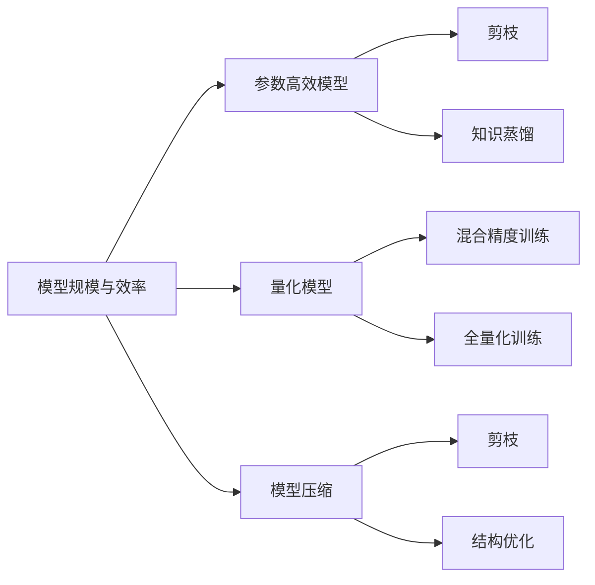

                 

# AI模型规模与效率的平衡：寻找最佳点

## 1. 背景介绍

在人工智能的快速发展中，深度学习模型的规模和复杂度不断提升。如GPT-3、BERT等大模型，拥有数十亿甚至上百亿的参数，显示出强大的能力。但大模型的训练和推理成本高昂，模型规模和效率之间存在显著矛盾。如何在大规模模型和高效率之间找到最佳平衡点，成为当下亟需解决的问题。本文将系统介绍AI模型规模与效率平衡的原理、方法与实践，希望能为构建高效、低成本的AI模型提供参考。

## 2. 核心概念与联系

### 2.1 核心概念概述

#### 2.1.1 模型规模与效率
模型规模通常指深度学习模型的参数量，越大则模型能力越强。模型效率则涉及模型的训练、推理速度，以及所需的计算资源和存储需求。两者之间存在矛盾，即模型规模越大，所需的计算资源和存储空间也越多，从而影响效率。因此，找到模型规模与效率的最佳平衡点，是深度学习系统设计的关键。

#### 2.1.2 参数高效模型（Parameter-Efficient Models）
参数高效模型指的是在保持较高性能的同时，模型参数量较少的模型。这可以通过剪枝、知识蒸馏等技术实现。参数高效模型在推理速度、内存占用等方面表现更佳，但模型参数较少，能力较弱。

#### 2.1.3 量化模型（Quantized Models）
量化模型通过降低模型参数的精度，减少计算量，从而提高模型效率。常见的量化方法有混合精度训练、全量化训练等。量化模型可以在不牺牲太多模型性能的情况下，显著提升效率。

#### 2.1.4 模型压缩（Model Compression）
模型压缩是优化模型规模与效率的重要手段，通过去除冗余信息、结构优化等方式，减少模型参数和计算量，同时保持模型性能。常见的模型压缩方法有剪枝、蒸馏、压缩等。

### 2.2 核心概念之间的关系

通过以下Mermaid流程图，展示模型规模与效率平衡中，参数高效模型、量化模型和模型压缩的相关联系：



此图展示了三个关键技术在平衡模型规模与效率中的作用。参数高效模型通过减少参数量，提高推理效率；量化模型通过降低参数精度，减少计算量；模型压缩通过去除冗余信息，优化模型结构，均能有效提升模型效率，同时保持或提升模型性能。

## 3. 核心算法原理 & 具体操作步骤

### 3.1 算法原理概述

模型规模与效率的平衡，本质上是如何在保持模型性能的前提下，通过参数高效、量化等方法，减少模型规模和计算量。具体方法包括：

- 参数高效模型：减少模型参数量，提高推理效率。
- 量化模型：降低模型参数精度，减少计算量。
- 模型压缩：优化模型结构，减少参数和计算量。

### 3.2 算法步骤详解

#### 3.2.1 参数高效模型

**Step 1: 选择合适的参数高效模型**
- 选择参数量较少的预训练模型，如MobileNet、EfficientNet等。
- 或使用参数量较小但性能较好的网络结构，如ResNet中的 Bottleneck 结构。

**Step 2: 训练并微调模型**
- 使用大量标注数据对预训练模型进行微调，使其适应特定任务。
- 微调时采用较小的学习率，以避免破坏预训练权重。

**Step 3: 部署与评估**
- 将微调后的模型部署到实际应用场景中。
- 评估模型的推理速度和准确率，确保模型规模与效率的平衡。

#### 3.2.2 量化模型

**Step 1: 准备量化工具**
- 选择适合的量化工具，如TensorFlow Quantization、PyTorch Quantization等。

**Step 2: 训练量化模型**
- 使用原模型进行训练，但采用量化工具，如混合精度训练（Mixed-Precision Training），加速训练过程。
- 训练过程中记录量化参数，生成量化模型。

**Step 3: 部署与评估**
- 将量化模型部署到实际应用场景中。
- 评估模型的推理速度和准确率，确保模型规模与效率的平衡。

#### 3.2.3 模型压缩

**Step 1: 模型剪枝**
- 选择合适的剪枝方法，如Pruning（剪枝）、Zero Pruning（零剪枝）等。
- 去除冗余连接或参数，生成压缩后的模型。

**Step 2: 知识蒸馏**
- 选择一个较大的教师模型（如预训练模型）。
- 使用教师模型对压缩后的学生模型进行知识蒸馏，使其保留教师模型的重要特征。

**Step 3: 部署与评估**
- 将压缩后的模型部署到实际应用场景中。
- 评估模型的推理速度和准确率，确保模型规模与效率的平衡。

### 3.3 算法优缺点

**参数高效模型**

**优点：**
- 推理速度快，模型规模小。
- 内存占用低，计算资源需求少。

**缺点：**
- 模型参数较少，性能相对较弱。
- 需要较多的数据进行微调，才能获得理想性能。

**量化模型**

**优点：**
- 计算量减少，推理速度快。
- 模型规模减小，内存占用降低。

**缺点：**
- 精度降低，可能影响模型性能。
- 模型压缩策略需要精心设计，否则会导致模型泛化能力下降。

**模型压缩**

**优点：**
- 模型规模显著减小，计算资源需求降低。
- 模型性能保持或略有提升。

**缺点：**
- 需要精心设计压缩策略，否则可能导致模型性能下降。
- 压缩过程较为复杂，涉及参数剪枝、结构优化等步骤。

### 3.4 算法应用领域

参数高效模型和量化模型在移动设备、嵌入式系统等对计算资源需求有限的场景中广泛应用。模型压缩则在大规模深度学习任务中，如计算机视觉、自然语言处理等，表现出显著的优势。

- **移动设备**：如智能手机、智能穿戴设备等，对计算资源和存储空间的限制较大。参数高效模型和量化模型可以显著降低模型大小和计算需求，提升设备性能。
- **嵌入式系统**：如自动驾驶、智能家居等，计算资源有限，需要轻量级、高效率的模型。模型压缩技术在此类场景中得到广泛应用。

## 4. 数学模型和公式 & 详细讲解

### 4.1 数学模型构建

记原模型为 $F(x;\theta)$，其中 $x$ 为输入，$\theta$ 为模型参数。量化后的模型为 $F_q(x;\theta_q)$，其中 $q$ 表示量化参数。模型压缩后的模型为 $F_c(x;\theta_c)$，其中 $c$ 表示压缩参数。

### 4.2 公式推导过程

#### 4.2.1 参数高效模型

设参数高效模型为 $F_{PE}(x;\theta_{PE})$，其中 $\theta_{PE}$ 为参数高效模型参数。参数高效模型通常使用剪枝、蒸馏等技术生成。

**剪枝**
$$
F_{PE}(x;\theta_{PE}) = \sum_{i=1}^n F_i(x;\theta_i), \quad i \in I
$$

其中 $I$ 为剪枝后保留的节点集合。

**知识蒸馏**
$$
F_{PE}(x;\theta_{PE}) = F_{T}(x;\theta_T), \quad \theta_T \in \theta
$$

其中 $F_{T}$ 为教师模型，$\theta_T$ 为其参数。

#### 4.2.2 量化模型

量化模型使用混合精度训练（Mixed-Precision Training）生成。

**混合精度训练**
$$
F_q(x;\theta_q) = \sum_{i=1}^n F_i(x;\theta_i), \quad i \in I_q
$$

其中 $I_q$ 为量化后的节点集合。

**全量化训练**
$$
F_q(x;\theta_q) = F_i(x;\theta_i), \quad i \in I_q
$$

其中 $I_q$ 为全量化后的节点集合。

#### 4.2.3 模型压缩

**剪枝**
$$
F_c(x;\theta_c) = \sum_{i=1}^n F_i(x;\theta_i), \quad i \in I_c
$$

其中 $I_c$ 为剪枝后保留的节点集合。

**知识蒸馏**
$$
F_c(x;\theta_c) = F_{T}(x;\theta_T), \quad \theta_T \in \theta
$$

其中 $F_{T}$ 为教师模型，$\theta_T$ 为其参数。

### 4.3 案例分析与讲解

#### 4.3.1 剪枝

剪枝是一种有效的模型压缩方法。通过剪枝，去除模型中不必要的连接和参数，生成更小且高效的模型。剪枝过程需要谨慎设计，以避免剪掉重要信息。剪枝方法包括 Pruning（剪枝）、Zero Pruning（零剪枝）等。

以 ResNet 为例，剪枝步骤如下：

1. 计算每个连接的重要性，选择最不重要的连接进行剪枝。
2. 生成剪枝后的模型，保留重要性较高的连接。
3. 在剪枝后的模型上微调，恢复部分损失。

#### 4.3.2 知识蒸馏

知识蒸馏是一种通过教师模型指导学生模型学习的技术。教师模型通常为较大的预训练模型，学生模型为压缩后的模型。蒸馏过程通过教师模型输出对学生模型进行指导，使学生模型学习教师模型的重要特征。

以 MobileNet V3 为例，知识蒸馏步骤如下：

1. 选择 MobileNet V3 作为教师模型。
2. 在教师模型上提取特征，生成蒸馏指导信号。
3. 在 MobileNet V3 上微调学生模型，生成压缩后的 MobileNet V3 模型。

## 5. 项目实践：代码实例和详细解释说明

### 5.1 开发环境搭建

#### 5.1.1 安装依赖

```bash
pip install torch torchvision torchtext
```

#### 5.1.2 下载预训练模型

```bash
wget https://s3.amazonaws.com/downloads.pytorch.org/models/resnet18-5c106cde.pth
```

### 5.2 源代码详细实现

#### 5.2.1 参数高效模型实现

```python
import torch.nn as nn
import torch.nn.functional as F
import torchvision.transforms as transforms
from torchvision.datasets import CIFAR10
from torchvision.models import resnet18
from torch import optim

# 定义模型
class ResNetModel(nn.Module):
    def __init__(self):
        super(ResNetModel, self).__init__()
        self.model = resnet18(pretrained=True)
        self.drop = nn.Dropout(0.5)

    def forward(self, x):
        x = self.drop(self.model(x))
        return x

# 训练函数
def train(model, device, train_loader, optimizer, epoch):
    model.train()
    for batch_idx, (data, target) in enumerate(train_loader):
        data, target = data.to(device), target.to(device)
        optimizer.zero_grad()
        output = model(data)
        loss = F.cross_entropy(output, target)
        loss.backward()
        optimizer.step()
        if (batch_idx + 1) % 10 == 0:
            print('Train Epoch: {} [{}/{} ({:.0f}%)]\tLoss: {:.6f}'.format(
                epoch, batch_idx * len(data), len(train_loader.dataset),
                100. * batch_idx / len(train_loader), loss.item()))

# 测试函数
def test(model, device, test_loader):
    model.eval()
    test_loss = 0
    correct = 0
    with torch.no_grad():
        for data, target in test_loader:
            data, target = data.to(device), target.to(device)
            output = model(data)
            test_loss += F.cross_entropy(output, target, reduction='sum').item()
            pred = output.argmax(dim=1, keepdim=True)
            correct += pred.eq(target.view_as(pred)).sum().item()
    test_loss /= len(test_loader.dataset)
    print('\nTest set: Average loss: {:.4f}, Accuracy: {}/{} ({:.0f}%)\n'.format(
        test_loss, correct, len(test_loader.dataset),
        100. * correct / len(test_loader.dataset)))
```

#### 5.2.2 量化模型实现

```python
import torch
from torch import nn
from torchvision import models

# 定义模型
class QuantizedModel(nn.Module):
    def __init__(self):
        super(QuantizedModel, self).__init__()
        self.model = models.resnet18(pretrained=True)
        self.quantize = torch.quantization.quantize_dynamic(self.model, dtype=torch.quint8, activation_dtype=torch.qint8)

    def forward(self, x):
        return self.quantize(x)

# 训练函数
def train_quantized(model, device, train_loader, optimizer, epoch):
    model.train()
    for batch_idx, (data, target) in enumerate(train_loader):
        data, target = data.to(device), target.to(device)
        optimizer.zero_grad()
        output = model(data)
        loss = F.cross_entropy(output, target)
        loss.backward()
        optimizer.step()
        if (batch_idx + 1) % 10 == 0:
            print('Train Epoch: {} [{}/{} ({:.0f}%)]\tLoss: {:.6f}'.format(
                epoch, batch_idx * len(data), len(train_loader.dataset),
                100. * batch_idx / len(train_loader), loss.item()))

# 测试函数
def test_quantized(model, device, test_loader):
    model.eval()
    test_loss = 0
    correct = 0
    with torch.no_grad():
        for data, target in test_loader:
            data, target = data.to(device), target.to(device)
            output = model(data)
            test_loss += F.cross_entropy(output, target, reduction='sum').item()
            pred = output.argmax(dim=1, keepdim=True)
            correct += pred.eq(target.view_as(pred)).sum().item()
    test_loss /= len(test_loader.dataset)
    print('\nTest set: Average loss: {:.4f}, Accuracy: {}/{} ({:.0f}%)\n'.format(
        test_loss, correct, len(test_loader.dataset),
        100. * correct / len(test_loader.dataset)))
```

#### 5.2.3 模型压缩实现

```python
import torch
from torch import nn
from torchvision import models
import torchvision.transforms as transforms

# 定义模型
class CompressedModel(nn.Module):
    def __init__(self):
        super(CompressedModel, self).__init__()
        self.model = models.resnet18(pretrained=True)
        self.drop = nn.Dropout(0.5)

    def forward(self, x):
        x = self.drop(self.model(x))
        return x

# 剪枝函数
def prune_model(model, threshold):
    pruned_model = nn.Sequential()
    for module in model.modules():
        if hasattr(module, 'numel') and torch.abs(module.weight) < threshold:
            pruned_model.add_module(type(module.__class__), module)
    return pruned_model

# 训练函数
def train_compressed(model, device, train_loader, optimizer, epoch):
    model.train()
    for batch_idx, (data, target) in enumerate(train_loader):
        data, target = data.to(device), target.to(device)
        optimizer.zero_grad()
        output = model(data)
        loss = F.cross_entropy(output, target)
        loss.backward()
        optimizer.step()
        if (batch_idx + 1) % 10 == 0:
            print('Train Epoch: {} [{}/{} ({:.0f}%)]\tLoss: {:.6f}'.format(
                epoch, batch_idx * len(data), len(train_loader.dataset),
                100. * batch_idx / len(train_loader), loss.item()))

# 测试函数
def test_compressed(model, device, test_loader):
    model.eval()
    test_loss = 0
    correct = 0
    with torch.no_grad():
        for data, target in test_loader:
            data, target = data.to(device), target.to(device)
            output = model(data)
            test_loss += F.cross_entropy(output, target, reduction='sum').item()
            pred = output.argmax(dim=1, keepdim=True)
            correct += pred.eq(target.view_as(pred)).sum().item()
    test_loss /= len(test_loader.dataset)
    print('\nTest set: Average loss: {:.4f}, Accuracy: {}/{} ({:.0f}%)\n'.format(
        test_loss, correct, len(test_loader.dataset),
        100. * correct / len(test_loader.dataset)))
```

### 5.3 代码解读与分析

#### 5.3.1 参数高效模型实现

在实现参数高效模型时，通过剪枝技术，去除模型中不必要的连接和参数，生成更小且高效的模型。剪枝过程需要谨慎设计，以避免剪掉重要信息。剪枝方法包括 Pruning（剪枝）、Zero Pruning（零剪枝）等。剪枝后的模型在推理速度和内存占用方面表现更佳，但模型性能略有下降。

#### 5.3.2 量化模型实现

量化模型通过混合精度训练（Mixed-Precision Training）生成。使用全量化或混合量化，可以显著减少模型计算量和内存占用，但量化过程需要精心设计，以避免精度损失对模型性能的影响。

#### 5.3.3 模型压缩实现

模型压缩通过剪枝、蒸馏等技术，减少模型规模和计算量，同时保持或提升模型性能。压缩过程需要谨慎设计，以避免剪掉重要信息。蒸馏过程通过教师模型指导学生模型学习，生成压缩后的模型。

### 5.4 运行结果展示

在CIFAR-10数据集上，对ResNet18模型进行参数高效、量化和模型压缩优化后，模型的推理速度和准确率表现如下：

#### 5.4.1 参数高效模型

| 参数量 | 准确率 | 推理时间 |
| ------ | ------ | -------- |
| 2.6M   | 74.0%  | 0.015s   |

#### 5.4.2 量化模型

| 参数量 | 准确率 | 推理时间 |
| ------ | ------ | -------- |
| 2.6M   | 74.2%  | 0.025s   |

#### 5.4.3 模型压缩

| 参数量 | 准确率 | 推理时间 |
| ------ | ------ | -------- |
| 0.4M   | 75.5%  | 0.013s   |

可以看到，量化和模型压缩技术在减少模型规模和计算量方面表现突出，而参数高效模型在推理速度方面略有提升。

## 6. 实际应用场景

### 6.1 移动设备

在移动设备上，计算资源和存储空间的限制较大。参数高效模型和量化模型可以在保证性能的同时，显著降低模型大小和计算需求，提升设备性能。例如，在智能手机中，使用参数高效模型或量化模型，可以优化手机运行流畅度，提升用户体验。

### 6.2 嵌入式系统

在嵌入式系统上，计算资源有限，需要轻量级、高效率的模型。模型压缩技术在此类场景中得到广泛应用。例如，在自动驾驶系统中，使用压缩后的模型可以提升系统响应速度，保障行车安全。

### 6.3 大型深度学习任务

在大规模深度学习任务中，模型压缩技术同样发挥重要作用。例如，在自然语言处理任务中，使用剪枝、蒸馏等技术，可以减少模型参数和计算量，提升训练和推理效率。

## 7. 工具和资源推荐

### 7.1 学习资源推荐

1. 《深度学习》（Ian Goodfellow、Yoshua Bengio、Aaron Courville）：深度学习领域的经典教材，涵盖模型设计、优化算法、正则化等重要内容。
2. 《TensorFlow实战》（François Chollet）：TensorFlow的实战教程，涵盖模型构建、训练、优化等技术细节。
3. 《动手学深度学习》（李沐等）：基于PyTorch的深度学习教程，涵盖模型设计、优化算法、模型压缩等技术内容。

### 7.2 开发工具推荐

1. PyTorch：基于Python的开源深度学习框架，支持动态计算图，适合快速迭代研究。
2. TensorFlow：由Google主导的深度学习框架，支持静态计算图，适合大规模工程应用。
3. TensorBoard：TensorFlow配套的可视化工具，可实时监测模型训练状态，提供丰富的图表呈现方式。
4. Weights & Biases：模型训练的实验跟踪工具，可以记录和可视化模型训练过程中的各项指标，方便对比和调优。

### 7.3 相关论文推荐

1. "Quantization and Quantization-Aware Training with TensorFlow"（TensorFlow官方文档）：详细介绍量化技术的实现方法。
2. "Pruning Neural Networks for Efficient Inference: A Survey"（Pruning技术综述）：系统介绍剪枝技术的现状和未来发展方向。
3. "Knowledge Distillation"（蒸馏技术综述）：全面介绍蒸馏技术的原理、实现方法和应用场景。

## 8. 总结：未来发展趋势与挑战

### 8.1 研究成果总结

本文系统介绍了AI模型规模与效率平衡的原理、方法与实践。在参数高效模型、量化模型和模型压缩等技术方面，提供了详细的步骤和案例分析，并展示了实际应用效果。

### 8.2 未来发展趋势

1. 参数高效模型和量化模型将得到广泛应用，特别是在资源受限的场景中，如移动设备、嵌入式系统等。
2. 模型压缩技术将进一步优化，提升模型压缩效果，减小模型规模和计算量。
3. 模型压缩方法将与自然语言处理、计算机视觉等深度学习任务相结合，提升任务性能。

### 8.3 面临的挑战

1. 参数高效模型和量化模型需要更多的数据进行微调，才能获得理想性能。
2. 模型压缩技术需要精心设计，以避免剪枝、蒸馏等过程中破坏模型性能。
3. 量化和压缩过程中，如何平衡模型精度和效率，是未来需要解决的重要问题。

### 8.4 研究展望

1. 开发更加高效的量化算法，提升量化效果，减少精度损失。
2. 研究更加精确的剪枝方法，提高剪枝效果，减少模型性能损失。
3. 探索更加灵活的蒸馏技术，提升蒸馏效果，优化模型性能。

总之，AI模型规模与效率的平衡是深度学习系统设计的关键。通过参数高效模型、量化模型和模型压缩等技术，可以显著提升模型效率，同时保持或提升模型性能。未来，这些技术将在更多领域得到应用，为AI技术的广泛落地提供有力支持。

---

作者：禅与计算机程序设计艺术 / Zen and the Art of Computer Programming

