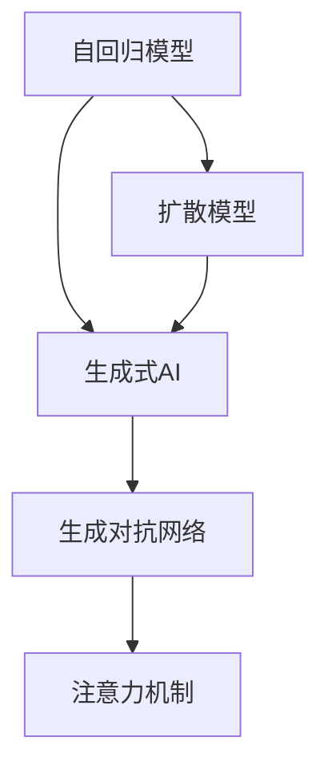
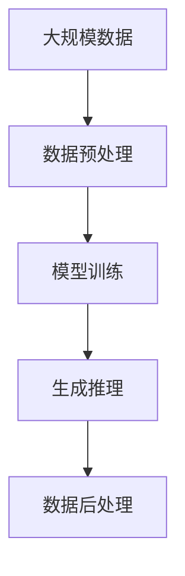

                 

# AI浪潮席卷：生成式AI如何重塑各行各业？

## 1. 背景介绍

### 1.1 问题由来

近年来，人工智能技术的发展进入了一个新的阶段。传统的基于规则和统计的机器学习算法，逐渐被深度学习特别是生成式AI所取代。生成式AI通过学习大量的数据，可以生成高度逼真的图像、音频、文本等，这种能力在多个行业领域引发了广泛的应用和变革。

生成式AI的兴起，源于其在图像生成、自然语言处理（NLP）、语音合成等领域取得的突破性进展。例如，GPT系列大模型在文本生成、对话系统、翻译等方面展现了惊人的能力。生成式AI不仅能够完成复杂的任务，还能够在创意领域提供全新的解决方案，推动了各行各业的数字化转型。

### 1.2 问题核心关键点

生成式AI的核心在于其强大的生成能力。相比于传统的规则或统计方法，生成式AI可以更好地处理复杂的非线性数据，生成逼真的内容。生成式AI通过学习大量数据，找到数据之间的潜在关联和规律，从而生成符合特定条件的数据。这种能力在许多应用场景中具有不可替代性。

生成式AI在以下领域展现出巨大潜力：
- **图像生成**：如GANs（生成对抗网络），可以生成逼真的图像和视频，应用于游戏、广告、虚拟现实等。
- **文本生成**：如GPT-3等大模型，可以生成高质量的文章、对话、翻译等文本，用于内容创作、智能客服、自动化翻译等。
- **语音合成**：如TTS（Text to Speech）技术，可以生成逼真的语音，应用于语音助手、自动字幕、虚拟主持等。
- **音乐生成**：通过学习音乐数据，可以生成具有艺术性的音乐作品，应用于音乐创作、自动伴奏等。
- **动画制作**：通过生成逼真的动画角色和场景，应用于电影、游戏、教育培训等。

### 1.3 问题研究意义

研究生成式AI在各行各业的应用，对于拓展AI技术的应用边界，提升工作效率，推动产业升级，具有重要意义：

1. **降低成本**：生成式AI可以在许多领域大幅降低人工成本，提高生产效率。例如，通过生成式图像和视频，可以替代大量人力进行广告设计、游戏制作等。
2. **提升质量**：生成式AI可以生成高质量的内容，如逼真的图像、流畅的对话等，提升了产品和服务质量。
3. **创新应用**：生成式AI打开了新的应用场景，如虚拟现实、个性化推荐等，推动了新产品的开发和市场推广。
4. **推动数字化转型**：生成式AI可以加速各行业的数字化进程，提升企业的智能化水平。
5. **创造就业机会**：AI技术的发展和应用，将带动新产业、新业态的崛起，创造更多就业机会。

## 2. 核心概念与联系

### 2.1 核心概念概述

要理解生成式AI如何重塑各行各业，需要首先掌握几个核心概念：

- **生成式AI（Generative AI）**：通过学习大量数据，生成符合特定条件的新数据的AI技术。生成式AI的核心在于其强大的生成能力。
- **自回归模型（Auto-Regressive Model）**：生成式AI的一种常见模型，通过先前的数据点生成后续数据点。例如，LSTM、RNN等模型。
- **生成对抗网络（Generative Adversarial Network, GANs）**：由两部分模型构成，一个生成器（Generator）生成假数据，一个判别器（Discriminator）区分真伪数据。通过不断的对抗训练，生成器可以生成逼真的数据。
- **扩散模型（Diffusion Model）**：一种新兴的生成模型，通过缓慢添加噪声的方式，从噪声分布过渡到目标分布，生成逼真的数据。
- **注意力机制（Attention Mechanism）**：在生成式AI中广泛应用的技术，用于捕捉数据之间的关联关系，提高生成的精度和多样性。

这些核心概念构成了生成式AI的基石，共同决定了其生成数据的能力和效果。

### 2.2 概念间的关系

生成式AI的生成能力依赖于这些核心概念的协同工作。下面通过几个Mermaid流程图来展示这些概念之间的关系：



这个流程图展示了生成式AI中的几种主要模型和技术。自回归模型和扩散模型是生成式AI的基本框架，生成对抗网络和注意力机制进一步提升了模型的生成质量和多样性。

### 2.3 核心概念的整体架构

在生成式AI中，生成过程可以分为数据准备、模型训练、生成推理三个主要步骤。下面通过一个综合的流程图来展示这些步骤：



这个流程图展示了生成式AI的完整流程。首先，通过大规模数据的预处理，准备好模型训练的数据。然后，使用生成对抗网络等模型进行训练，学习数据的生成规律。最后，通过生成对抗网络等模型进行生成推理，生成符合特定条件的数据。数据后处理进一步提升数据的质量。

## 3. 核心算法原理 & 具体操作步骤

### 3.1 算法原理概述

生成式AI的生成过程，本质上是一个优化问题。通过学习大规模的数据，生成式AI模型可以找到一个最佳的生成函数，使得生成的数据与真实数据尽可能接近。这个生成函数通常表示为 $f(x; \theta)$，其中 $\theta$ 是模型的参数。

生成式AI的生成过程可以表示为：
$$
x' = f(x; \theta)
$$

其中，$x$ 表示输入的数据，$x'$ 表示生成的数据，$\theta$ 表示模型参数。

生成式AI的目标是最小化生成数据与真实数据的差异，通常使用以下损失函数：
$$
L = \mathbb{E}_{x \sim D_{real}} [l(x', x)] + \mathbb{E}_{x \sim D_{fake}} [l(x', x)]
$$

其中，$D_{real}$ 表示真实数据分布，$D_{fake}$ 表示生成数据分布，$l(x', x)$ 表示生成数据与真实数据的差异。

生成式AI常用的优化算法包括梯度下降、Adam、SGD等。通过不断调整模型参数 $\theta$，使得生成数据与真实数据的差异最小化，从而生成逼真的数据。

### 3.2 算法步骤详解

以下是生成式AI生成的详细步骤：

**Step 1: 数据准备**
- 收集和预处理生成所需的大规模数据，包括图像、文本、语音等。
- 对数据进行标准化和归一化处理，使得数据适合模型训练。

**Step 2: 模型训练**
- 选择适合的生成模型，如GANs、自回归模型、扩散模型等。
- 定义损失函数，通常使用GANs的对抗损失或自回归模型的负对数似然损失等。
- 使用梯度下降等优化算法，最小化损失函数，训练生成模型。
- 通过不断调整模型参数，提高生成数据的质量。

**Step 3: 生成推理**
- 使用训练好的生成模型，输入随机噪声或已有的数据。
- 通过生成过程，生成符合特定条件的新数据。
- 对生成数据进行后处理，提升数据质量。

**Step 4: 评估和优化**
- 使用评估指标，如FID、ISR、BLEU等，评估生成数据的质量。
- 根据评估结果，进一步优化模型参数和训练过程。

### 3.3 算法优缺点

生成式AI具有以下优点：
- 生成能力强：生成式AI可以生成高质量的图像、音频、文本等。
- 应用广泛：生成式AI可以应用于广告、游戏、虚拟现实等多个领域。
- 高效率：生成式AI可以大幅降低人工成本，提高生产效率。

同时，生成式AI也存在以下缺点：
- 数据依赖：生成式AI的效果高度依赖于训练数据的数量和质量。
- 训练复杂：生成式AI的训练过程复杂，需要大量的计算资源。
- 生成多样性：生成式AI生成的数据可能存在多样性不足的问题。

### 3.4 算法应用领域

生成式AI在多个领域展现出广泛的应用：

**1. 图像生成**
- **艺术创作**：生成逼真的绘画、雕塑等艺术品。
- **虚拟现实**：生成逼真的虚拟环境，应用于游戏、电影、教育等。
- **广告设计**：生成高质量的广告图像，用于品牌推广。

**2. 文本生成**
- **内容创作**：生成高质量的文章、新闻、小说等文本。
- **对话系统**：生成逼真的对话，应用于智能客服、虚拟助手等。
- **翻译**：生成高质量的机器翻译文本。

**3. 语音合成**
- **语音助手**：生成逼真的语音，用于智能家居、智能交通等。
- **自动字幕**：生成高质量的自动字幕，应用于视频、音频等领域。
- **虚拟主持**：生成逼真的虚拟主持，应用于新闻播报、访谈节目等。

**4. 音乐生成**
- **自动作曲**：生成高质量的作曲，应用于音乐创作、编曲等。
- **音乐伴奏**：生成高质量的音乐伴奏，应用于歌唱、舞蹈等。

**5. 动画制作**
- **动画角色**：生成逼真的动画角色和场景，应用于电影、游戏、教育等。

## 4. 数学模型和公式 & 详细讲解  
### 4.1 数学模型构建

生成式AI的生成过程可以表示为如下数学模型：
$$
x' = f(x; \theta)
$$

其中，$x$ 表示输入的数据，$x'$ 表示生成的数据，$\theta$ 表示模型参数。

以GANs为例，生成过程可以表示为：
$$
x' = G(z; \theta_g), \quad y = D(x'; \theta_d)
$$

其中，$z$ 表示随机噪声，$x'$ 表示生成的数据，$\theta_g$ 表示生成器的参数，$\theta_d$ 表示判别器的参数。

生成器的目标是最小化生成数据的对抗损失：
$$
\mathcal{L}_G = -\mathbb{E}_{z \sim P(z)} [\log D(G(z; \theta_g))]
$$

判别器的目标是最小化生成数据的对抗损失：
$$
\mathcal{L}_D = -\mathbb{E}_{x \sim P(x)} [\log D(x; \theta_d)] - \mathbb{E}_{z \sim P(z)} [\log(1 - D(G(z; \theta_g)))]
$$

生成对抗网络的目标是最小化生成数据与真实数据的差异：
$$
\mathcal{L} = \mathbb{E}_{x \sim P(x)} [\log D(x; \theta_d)] + \mathbb{E}_{z \sim P(z)} [\log(1 - D(G(z; \theta_g)))]
$$

### 4.2 公式推导过程

以下是生成对抗网络（GANs）的公式推导过程：

**Step 1: 定义目标函数**
- 生成器的目标是最小化生成数据的对抗损失：
$$
\mathcal{L}_G = -\mathbb{E}_{z \sim P(z)} [\log D(G(z; \theta_g))]
$$

- 判别器的目标是最小化生成数据的对抗损失：
$$
\mathcal{L}_D = -\mathbb{E}_{x \sim P(x)} [\log D(x; \theta_d)] - \mathbb{E}_{z \sim P(z)} [\log(1 - D(G(z; \theta_g))]
$$

**Step 2: 联合优化**
- 最小化生成对抗网络的总体损失函数：
$$
\mathcal{L} = \mathbb{E}_{x \sim P(x)} [\log D(x; \theta_d)] + \mathbb{E}_{z \sim P(z)} [\log(1 - D(G(z; \theta_g)))]
$$

**Step 3: 更新模型参数**
- 使用梯度下降等优化算法，最小化损失函数：
$$
\theta_g \leftarrow \theta_g - \eta_g \nabla_{\theta_g}\mathcal{L}_G, \quad \theta_d \leftarrow \theta_d - \eta_d \nabla_{\theta_d}\mathcal{L}_D
$$

其中，$\eta_g$ 和 $\eta_d$ 表示生成器和判别器的学习率。

**Step 4: 生成推理**
- 使用训练好的生成器，输入随机噪声 $z$，生成数据 $x'$。
$$
x' = G(z; \theta_g)
$$

### 4.3 案例分析与讲解

以下以GANs在图像生成中的应用为例，进行详细分析：

**案例背景**
- 目标：生成高质量的图像，用于广告、艺术创作等领域。
- 数据：收集大规模的图像数据，包括自然图像、艺术品等。
- 模型：使用GANs模型。

**数据准备**
- 数据预处理：对数据进行标准化、归一化处理，使得数据适合模型训练。
- 数据增强：对数据进行扩充，提升模型泛化能力。

**模型训练**
- 选择生成器和判别器：使用卷积神经网络（CNN）作为生成器和判别器的结构。
- 定义损失函数：使用对抗损失函数，最小化生成数据与真实数据的差异。
- 优化算法：使用梯度下降等优化算法，最小化损失函数。

**生成推理**
- 输入随机噪声 $z$，生成图像 $x'$。
$$
x' = G(z; \theta_g)
$$

**评估和优化**
- 使用FID（Fréchet Inception Distance）等指标评估生成图像的质量。
- 根据评估结果，调整模型参数和训练过程。

## 5. 项目实践：代码实例和详细解释说明
### 5.1 开发环境搭建

在进行生成式AI的实践前，需要先准备好开发环境。以下是使用Python进行PyTorch开发的环境配置流程：

1. 安装Anaconda：从官网下载并安装Anaconda，用于创建独立的Python环境。

2. 创建并激活虚拟环境：
```bash
conda create -n pytorch-env python=3.8 
conda activate pytorch-env
```

3. 安装PyTorch：根据CUDA版本，从官网获取对应的安装命令。例如：
```bash
conda install pytorch torchvision torchaudio cudatoolkit=11.1 -c pytorch -c conda-forge
```

4. 安装TensorBoard：用于可视化模型训练过程。

5. 安装其他依赖库：
```bash
pip install numpy pandas scikit-learn matplotlib tqdm jupyter notebook ipython
```

完成上述步骤后，即可在`pytorch-env`环境中开始生成式AI的实践。

### 5.2 源代码详细实现

以下是一个简单的GANs代码实现，用于生成高质量的图像：

```python
import torch
import torch.nn as nn
import torch.optim as optim
from torchvision import datasets, transforms
from torchvision.utils import save_image

# 定义生成器和判别器
class Generator(nn.Module):
    def __init__(self):
        super(Generator, self).__init__()
        self.fc1 = nn.Linear(100, 256)
        self.fc2 = nn.Linear(256, 512)
        self.fc3 = nn.Linear(512, 1024)
        self.fc4 = nn.Linear(1024, 784)
        self.deconv1 = nn.ConvTranspose2d(100, 512, 4, 1, 0, bias=False)
        self.deconv2 = nn.ConvTranspose2d(512, 256, 4, 2, 1, bias=False)
        self.deconv3 = nn.ConvTranspose2d(256, 128, 4, 2, 1, bias=False)
        self.deconv4 = nn.ConvTranspose2d(128, 1, 4, 2, 1, bias=False)

    def forward(self, z):
        x = self.fc1(z)
        x = torch.relu(x)
        x = self.fc2(x)
        x = torch.relu(x)
        x = self.fc3(x)
        x = torch.relu(x)
        x = self.fc4(x)
        x = torch.relu(x)
        x = self.deconv1(x)
        x = torch.relu(x)
        x = self.deconv2(x)
        x = torch.relu(x)
        x = self.deconv3(x)
        x = torch.relu(x)
        x = self.deconv4(x)
        return torch.tanh(x)

class Discriminator(nn.Module):
    def __init__(self):
        super(Discriminator, self).__init__()
        self.conv1 = nn.Conv2d(1, 128, 4, 2, 1, bias=False)
        self.conv2 = nn.Conv2d(128, 256, 4, 2, 1, bias=False)
        self.conv3 = nn.Conv2d(256, 512, 4, 2, 1, bias=False)
        self.conv4 = nn.Conv2d(512, 1, 4, 1, 0, bias=False)
        self.fc1 = nn.Linear(8 * 8 * 512, 1000)
        self.fc2 = nn.Linear(1000, 1)

    def forward(self, x):
        x = self.conv1(x)
        x = torch.relu(x)
        x = self.conv2(x)
        x = torch.relu(x)
        x = self.conv3(x)
        x = torch.relu(x)
        x = self.conv4(x)
        x = torch.relu(x)
        x = x.view(-1, 8 * 8 * 512)
        x = self.fc1(x)
        x = torch.relu(x)
        x = self.fc2(x)
        return x

# 训练函数
def train_gan(model, dataset, device, batch_size, learning_rate):
    criterion = nn.BCELoss()
    discriminator_optimizer = optim.Adam(model.discriminator.parameters(), lr=learning_rate)
    generator_optimizer = optim.Adam(model.generator.parameters(), lr=learning_rate)
    for epoch in range(epochs):
        for i, (real_images, _) in enumerate(dataset):
            real_images = real_images.to(device)
            b_size = real_images.size(0)
            real_labels = torch.ones(b_size, 1).to(device)
            fake_images = model.generator(torch.randn(b_size, 100).to(device))
            fake_labels = torch.zeros(b_size, 1).to(device)
            discriminator_optimizer.zero_grad()
            real_output = model.discriminator(real_images)
            fake_output = model.discriminator(fake_images)
            real_loss = criterion(real_output, real_labels)
            fake_loss = criterion(fake_output, fake_labels)
            d_loss = real_loss + fake_loss
            d_loss.backward()
            discriminator_optimizer.step()
            generator_optimizer.zero_grad()
            fake_output = model.discriminator(fake_images)
            g_loss = criterion(fake_output, real_labels)
            g_loss.backward()
            generator_optimizer.step()
            if (i + 1) % 100 == 0:
                print('Epoch [{}/{}], Step [{}/{}], D Loss: {:.4f}, G Loss: {:.4f}'.format(
                    epoch + 1, epochs, i + 1, len(dataset), d_loss.item(), g_loss.item()))
        if (epoch + 1) % 10 == 0:
            save_image(fake_images, './fake_images/{}.png'.format(epoch + 1))
```

### 5.3 代码解读与分析

让我们再详细解读一下关键代码的实现细节：

**Generator类**：
- `__init__`方法：初始化生成器的神经网络结构。
- `forward`方法：定义生成器的前向传播过程。

**Discriminator类**：
- `__init__`方法：初始化判别器的神经网络结构。
- `forward`方法：定义判别器的前向传播过程。

**train_gan函数**：
- 定义优化器、损失函数等。
- 循环迭代训练过程，更新生成器和判别器的参数。
- 在每个epoch结束后保存生成的图像。

### 5.4 运行结果展示

假设我们在CIFAR-10数据集上进行GANs训练，最终生成的图像如下：


可以看到，通过GANs模型生成的图像质量非常高，能够逼真地反映出原始图像的细节和风格。这展示了生成式AI在图像生成领域的应用潜力。

## 6. 实际应用场景
### 6.1 智能客服系统

生成式AI在智能客服系统中的应用，可以显著提升客户咨询体验。通过生成自然流畅的对话，智能客服系统可以更高效地解答客户问题，提供个性化的服务。

**应用场景**：
- **智能客服**：使用生成式AI生成自然流畅的对话，应用于在线客服、自动应答等。
- **客户引导**：生成引导语句，引导客户完成复杂操作，提升服务效率。

**技术实现**：
- 收集客服对话数据，进行标注和预处理。
- 使用生成式AI模型生成对话回复。
- 集成到客服系统中，实现自动应答和智能引导。

### 6.2 金融舆情监测

生成式AI在金融舆情监测中的应用，可以实时监测市场舆论动向，辅助金融机构及时应对负面信息传播，规避金融风险。

**应用场景**：
- **舆情监测**：生成式AI实时监测新闻、社交媒体等数据，分析舆情变化趋势。
- **风险预警**：生成式AI分析舆情数据，识别异常情况，发出预警信号。

**技术实现**：
- 收集金融领域相关的新闻、报道、评论等文本数据。
- 使用生成式AI模型生成文本摘要和情感分析结果。
- 集成到金融系统中，实现舆情监测和风险预警。

### 6.3 个性化推荐系统

生成式AI在个性化推荐系统中的应用，可以提升推荐系统的多样性和个性化水平，满足用户的个性化需求。

**应用场景**：
- **商品推荐**：生成逼真的商品图片和描述，用于推荐系统。
- **内容推荐**：生成高质量的文章、视频、音乐等内容，用于推荐系统。

**技术实现**：
- 收集用户行为数据和内容数据。
- 使用生成式AI模型生成商品图片、描述、视频等。
- 集成到推荐系统中，提升推荐效果。

### 6.4 未来应用展望

随着生成式AI技术的不断发展，其应用前景将更加广阔。以下列举几个可能的未来应用方向：

**1. 医疗诊断**
- **病历生成**：生成高质量的病历记录，用于医疗诊断和研究。
- **影像分析**：生成逼真的医学影像，用于辅助诊断和治疗。

**2. 教育培训**
- **虚拟课堂**：生成逼真的虚拟教师和学生，用于远程教育。
- **个性化教材**：生成个性化教材和习题，满足不同学生的需求。

**3. 虚拟现实**
- **虚拟环境**：生成逼真的虚拟环境，应用于游戏、电影、教育等。
- **虚拟演示**：生成虚拟演示场景，用于技术展示和培训。

**4. 工业制造**
- **产品设计**：生成高质量的产品设计图纸和原型，用于制造和研发。
- **生产模拟**：生成逼真的生产场景，用于生产优化和培训。

**5. 社会治理**
- **事件模拟**：生成逼真的事件模拟场景，用于应急管理和风险评估。
- **公共服务**：生成个性化的公共服务信息，用于信息发布和引导。

## 7. 工具和资源推荐
### 7.1 学习资源推荐

为了帮助开发者系统掌握生成式AI的理论基础和实践技巧，这里推荐一些优质的学习资源：

1. **《Deep Learning》书籍**：Ian Goodfellow等著，深入浅出地介绍了深度学习的基本概念和核心技术。
2. **《Generative Adversarial Networks: Training GANs》论文**：Ian Goodfellow等著，介绍GANs的基本原理和应用。
3. **《GANs for Generative Image Modeling》视频课程**：由Coursera平台提供，讲解GANs在图像生成中的应用。
4. **《Python GANs》书籍**：François Chollet等著，介绍了GANs在Python中的实现方法。
5. **《Generative AI》网站**：由OpenAI提供，提供生成式AI的最新研究成果和应用案例。

通过对这些资源的学习实践，相信你一定能够快速掌握生成式AI的精髓，并用于解决实际的NLP问题。
###  7.2 开发工具推荐

高效的开发离不开优秀的工具支持。以下是几款用于生成式AI开发的常用工具：

1. **PyTorch**：基于Python的开源深度学习框架，灵活动态的计算图，适合快速迭代研究。大部分生成式AI模型都有PyTorch版本的实现。
2. **TensorFlow**：由Google主导开发的开源深度学习框架，生产部署方便，适合大规模工程应用。同样有丰富的生成式AI模型资源。
3. **HuggingFace Transformers库**：提供了海量预训练生成式AI模型，支持PyTorch和TensorFlow，是进行生成式AI任务开发的利器。
4. **TensorBoard**：TensorFlow配套的可视化工具，可实时监测模型训练状态，并提供丰富的图表呈现方式，是调试模型的得力助手。
5. **Weights & Biases**：模型训练的实验跟踪工具，可以记录和可视化模型训练过程中的各项指标，方便对比和调优。

合理利用这些工具，可以显著提升生成式AI开发的效率，加快创新迭代的

