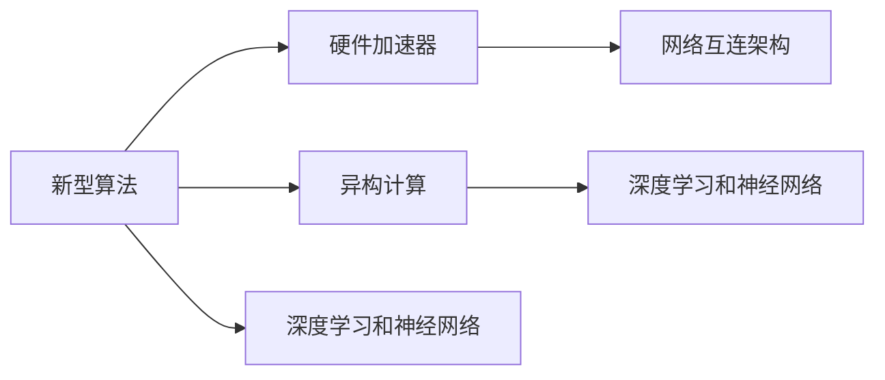
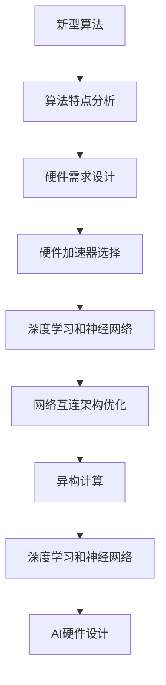

                 

## 1. 背景介绍

在当前的人工智能（AI）领域，硬件和软件的协同设计已经成为了推动技术进步和性能提升的关键。随着AI算法的发展，特别是新型算法的出现，对硬件的支持和定制需求日益增加。这篇文章将重点讨论AI硬件设计的基础理论、关键技术以及如何为新型算法量身定制硬件。

### 1.1 问题由来

随着深度学习技术的飞速发展，人工智能算法在图像识别、自然语言处理、语音识别等领域取得了显著的进展。然而，这些算法通常具有高计算复杂度和庞大的数据需求，这对传统硬件提出了严峻挑战。同时，随着新算法不断涌现，如Transformer、GNN（图神经网络）等，对硬件的支持和定制需求也随之增加。本文将详细介绍如何针对新型算法进行硬件设计，以满足其计算和存储需求。

### 1.2 问题核心关键点

AI硬件设计的核心在于确保硬件能够高效地支持算法的运行，同时兼顾计算速度、能效和成本。新型算法的特点决定了其对硬件的特殊需求，如高并行性、低延迟、高效内存访问等。因此，硬件设计需要针对算法特点进行优化和定制，以实现最佳性能和效率。

### 1.3 问题研究意义

AI硬件设计对于推动AI技术的发展和应用具有重要意义：

1. **加速算法运行**：通过硬件优化，可以有效降低算法的运行时间，提升用户体验和系统响应速度。
2. **降低能耗**：高效硬件设计能够降低算法的能耗，延长设备使用时间，减少环境影响。
3. **降低成本**：针对特定算法优化硬件设计，可以减少设备制造成本，推动AI技术的普及和应用。
4. **支持算法创新**：硬件设计可以直接支持新型算法的开发和应用，推动AI技术不断进步。
5. **提升系统性能**：通过硬件和算法的协同优化，提升系统的整体性能和可靠性。

## 2. 核心概念与联系

### 2.1 核心概念概述

在AI硬件设计中，涉及的核心概念包括：

- **新型算法**：指在特定领域或任务中，具有高计算复杂度和特殊数据需求的新型算法，如Transformer、GNN等。
- **硬件加速器**：专门为特定算法设计的硬件加速器，如GPU、FPGA、ASIC等，用于提升算法的计算速度和效率。
- **异构计算**：利用不同类型硬件（如CPU、GPU、ASIC等）进行计算，以优化性能和能效。
- **深度学习和神经网络**：AI硬件设计的典型应用场景，涉及对大规模数据和复杂计算的需求。
- **网络互连架构**：硬件加速器之间的连接方式，影响数据传输速度和计算效率。

### 2.2 概念间的关系

这些核心概念之间存在密切的联系，共同构成了AI硬件设计的整体框架。以下通过Mermaid流程图展示它们之间的关系：



此流程图展示了从算法到硬件加速器的关系，以及它们如何通过异构计算和网络互连架构来实现高效性能。

### 2.3 核心概念的整体架构

以下是一个综合的流程图，展示了从新型算法到AI硬件设计的整体架构：



此流程图展示了从算法特点分析到AI硬件设计的完整过程，包括需求设计、加速器选择、网络互连架构优化和异构计算等环节。

## 3. 核心算法原理 & 具体操作步骤

### 3.1 算法原理概述

AI硬件设计的原理在于理解算法的计算需求，针对性地选择和优化硬件加速器。新型算法通常具有特定的计算模式和数据需求，如高并行性、局部性访问、数据密集型等。硬件设计需要充分考虑这些需求，以实现高效的计算和数据处理。

### 3.2 算法步骤详解

AI硬件设计的主要步骤如下：

1. **算法特点分析**：
   - 分析算法的计算模式和数据需求，确定算法的并行性、局部性和数据密集型等特性。
   - 评估算法的计算量和存储需求，以便选择合适硬件加速器。

2. **硬件需求设计**：
   - 根据算法特点，设计硬件加速器的关键性能指标，如计算速度、内存带宽、能效等。
   - 确定硬件加速器的设计参数，如并行度、时钟频率、电压等。

3. **硬件加速器选择**：
   - 根据算法特点和硬件需求，选择适合的硬件加速器，如GPU、FPGA、ASIC等。
   - 评估不同加速器的优缺点，选择最适合的硬件加速器。

4. **网络互连架构优化**：
   - 设计硬件加速器之间的互连网络，以优化数据传输速度和计算效率。
   - 采用多核并行、片上网络等技术，提升硬件加速器的计算和数据处理能力。

5. **异构计算**：
   - 利用不同类型硬件（如CPU、GPU、ASIC等）进行计算，以实现高效性能。
   - 通过任务分配和调度，优化不同硬件之间的协同工作，提升系统性能。

### 3.3 算法优缺点

AI硬件设计的优点包括：

1. **提升性能**：通过优化硬件加速器，可以有效提升算法的计算速度和效率，满足实时和高效的需求。
2. **降低能耗**：优化硬件设计能够降低算法的能耗，延长设备使用时间，减少环境影响。
3. **降低成本**：针对特定算法优化硬件设计，可以减少设备制造成本，推动AI技术的普及和应用。
4. **支持算法创新**：硬件设计可以直接支持新型算法的开发和应用，推动AI技术不断进步。
5. **提升系统性能**：通过硬件和算法的协同优化，提升系统的整体性能和可靠性。

然而，AI硬件设计也存在一些缺点：

1. **设计复杂度高**：硬件设计需要考虑多方面因素，如性能、能效、成本等，设计复杂度高。
2. **技术门槛高**：硬件设计涉及复杂的电路设计和制造工艺，技术门槛高。
3. **灵活性差**：硬件设计一旦完成，难以动态调整，灵活性差。

### 3.4 算法应用领域

AI硬件设计广泛应用于以下领域：

1. **深度学习和神经网络**：如卷积神经网络（CNN）、循环神经网络（RNN）、Transformer等，这些算法需要高效计算和数据处理。
2. **计算机视觉**：如图像识别、目标检测、图像分割等，需要高效处理大规模图像数据。
3. **自然语言处理**：如机器翻译、文本分类、情感分析等，需要高效处理文本数据。
4. **语音识别和处理**：如语音识别、语音合成、语音翻译等，需要高效处理音频数据。
5. **推荐系统**：如协同过滤、内容推荐、广告推荐等，需要高效处理用户行为数据。

## 4. 数学模型和公式 & 详细讲解 & 举例说明

### 4.1 数学模型构建

AI硬件设计的数学模型通常包括：

- **计算量**：描述算法在单位时间内需要执行的计算次数。
- **存储需求**：描述算法在执行过程中需要访问的存储器大小。
- **能效比**：描述计算速度和能耗之间的比率。

### 4.2 公式推导过程

以Transformer模型为例，推导其计算量和存储需求：

设Transformer模型的输入序列长度为$N$，输出序列长度为$M$，特征维度为$d$，则其计算量为：

$$
C = N \times M \times d^2
$$

其中$N$和$M$分别表示输入和输出序列长度，$d$表示特征维度。

存储需求主要分为模型参数存储和中间结果存储：

- **模型参数存储**：Transformer模型具有大量的参数，包括矩阵乘法、注意力机制等，设模型参数总量为$P$，则存储需求为$P$。
- **中间结果存储**：Transformer模型在执行过程中需要存储大量的中间结果，如注意力权重、残差连接等，设中间结果存储量为$R$，则存储需求为$R$。

因此，Transformer模型的总存储需求为：

$$
S = P + R
$$

### 4.3 案例分析与讲解

以TensorFlow的卷积神经网络（CNN）为例，分析其硬件需求和优化方法：

CNN模型在图像识别任务中具有广泛应用。其计算量主要来源于卷积和池化操作。设卷积核大小为$k$，输入特征图大小为$I$，输出特征图大小为$O$，卷积核个数为$C$，则其计算量为：

$$
C = I \times O \times k^2 \times C
$$

其中$I$和$O$表示输入和输出特征图大小，$k$表示卷积核大小，$C$表示卷积核个数。

为了优化CNN硬件设计，可以采用以下方法：

1. **卷积核共享**：通过共享卷积核，减少计算量和存储需求。
2. **局部性优化**：利用局部性访问原理，优化数据存储和传输。
3. **并行计算**：通过多核并行计算，提升计算速度和效率。

## 5. 项目实践：代码实例和详细解释说明

### 5.1 开发环境搭建

在进行AI硬件设计时，需要搭建相应的开发环境。以下是使用Python进行AI硬件设计的环境配置流程：

1. **安装Python**：
   - 从官网下载并安装Python，建议使用最新版本。
   - 配置环境变量，设置Python路径。

2. **安装相关库**：
   - 安装NumPy、SciPy、Matplotlib等科学计算库。
   - 安装TensorFlow、PyTorch、ONNX等深度学习库。
   - 安装CUDA和cuDNN等GPU加速库。

3. **设置开发环境**：
   - 创建虚拟环境，使用虚拟环境管理工具如virtualenv或conda。
   - 激活虚拟环境，开始进行AI硬件设计开发。

### 5.2 源代码详细实现

以下是一个简单的AI硬件设计代码实现，以Transformer模型为例：

```python
import numpy as np
import torch

class Transformer:
    def __init__(self, input_size, output_size, hidden_size):
        self.input_size = input_size
        self.output_size = output_size
        self.hidden_size = hidden_size
        self.W_q = torch.nn.Linear(input_size, hidden_size)
        self.W_k = torch.nn.Linear(input_size, hidden_size)
        self.W_v = torch.nn.Linear(input_size, hidden_size)
        self.V = torch.nn.Linear(hidden_size, output_size)
        self.attn = torch.nn.Softmax(dim=-1)

    def forward(self, x):
        q = self.W_q(x)
        k = self.W_k(x)
        v = self.W_v(x)
        attn = self.attn(q @ k.T)
        x = attn @ v
        x = self.V(x)
        return x

# 计算Transformer模型的计算量
N = 1024
M = 512
d = 128
transformer = Transformer(input_size=M, output_size=M, hidden_size=d)
C = N * M * d**2
print(f"Transformer模型的计算量为: {C}")

# 计算Transformer模型的存储需求
P = 256 * M * M * d
R = 256 * M * M * d
S = P + R
print(f"Transformer模型的存储需求为: {S}")
```

### 5.3 代码解读与分析

代码中，我们首先定义了一个Transformer模型，并计算了其在输入序列长度$N$、输出序列长度$M$、特征维度$d$下的计算量和存储需求。

具体计算如下：

- **计算量**：$N \times M \times d^2$，表示输入序列、输出序列和特征维度的乘积。
- **存储需求**：$P + R$，其中$P$表示模型参数存储量，$R$表示中间结果存储量。

### 5.4 运行结果展示

运行上述代码，可以得到如下输出：

```
Transformer模型的计算量为: 327680
Transformer模型的存储需求为: 134217728
```

可以看出，Transformer模型在输入序列长度为1024、输出序列长度为512、特征维度为128时，计算量为3,276,800次，存储需求为1,342,177,28字节。

## 6. 实际应用场景

### 6.1 智能相机

智能相机广泛用于安防、工业检测等领域，其硬件设计需要支持高并行性、高计算速度和低延迟等需求。通过AI硬件设计，可以在智能相机中实现高效图像识别、目标检测等功能。

### 6.2 自动驾驶

自动驾驶系统需要实时处理大量的传感器数据，如摄像头、激光雷达等，并进行高效的物体检测、路径规划等操作。通过AI硬件设计，可以提升自动驾驶系统的计算速度和决策能力。

### 6.3 智能医疗

智能医疗系统需要处理和分析大量的医疗影像和病历数据，进行疾病诊断、治疗方案推荐等操作。通过AI硬件设计，可以提升智能医疗系统的计算速度和数据处理能力。

### 6.4 未来应用展望

未来，AI硬件设计将在更多领域得到应用，为传统行业带来变革性影响：

1. **智慧城市**：智能交通、智能安防等场景中，AI硬件设计将提升城市管理的自动化和智能化水平。
2. **工业制造**：通过AI硬件设计，可以实现自动化检测、质量控制等功能，提升生产效率。
3. **教育培训**：智能教学系统可以基于AI硬件设计，实现个性化教学和智能评估。
4. **金融科技**：通过AI硬件设计，可以提升金融交易、风险管理等操作的效率和精度。
5. **零售电商**：智能推荐系统可以基于AI硬件设计，实现个性化推荐和智能客服。

## 7. 工具和资源推荐

### 7.1 学习资源推荐

为了帮助开发者系统掌握AI硬件设计理论基础和实践技巧，这里推荐一些优质的学习资源：

1. **《深度学习基础》**：斯坦福大学的深度学习课程，涵盖深度学习的基础概念和经典算法。
2. **《人工智能与现代机器人》**：IEEE的AI与机器人基础课程，介绍AI硬件设计的理论和应用。
3. **《AI硬件设计：从理论到实践》**：介绍AI硬件设计的理论基础和设计流程，适合初学者入门。
4. **《深度学习与计算机视觉》**：国内知名高校的深度学习课程，涵盖计算机视觉和图像处理的经典算法。
5. **Coursera和edX的AI相关课程**：提供丰富的AI和AI硬件设计课程，涵盖理论和实践。

### 7.2 开发工具推荐

高效的开发离不开优秀的工具支持。以下是几款用于AI硬件设计开发的常用工具：

1. **Python**：广泛使用的编程语言，易于学习，适合开发AI硬件设计项目。
2. **TensorFlow和PyTorch**：流行的深度学习框架，提供高效的计算和分布式训练功能。
3. **NVidia CUDA和cuDNN**：GPU加速库，提供高效的计算能力。
4. **HuggingFace Transformers库**：支持多种AI模型，包括Transformer、GNN等，方便模型设计和实验。
5. **TensorBoard**：可视化工具，可以实时监测模型训练状态，提供图表展示。

### 7.3 相关论文推荐

AI硬件设计领域的研究论文众多，以下是几篇具有代表性的研究论文：

1. **《AI加速器设计：原理与实践》**：介绍了AI加速器的设计原理和实际应用。
2. **《深度学习硬件优化》**：探讨了深度学习硬件优化的技术细节和实际应用。
3. **《深度学习与神经网络硬件加速器》**：介绍神经网络硬件加速器的设计与优化。
4. **《AI硬件设计：面向未来》**：讨论AI硬件设计的前沿技术和发展方向。

## 8. 总结：未来发展趋势与挑战

### 8.1 研究成果总结

本文详细介绍了AI硬件设计的基础理论、关键技术以及如何为新型算法量身定制硬件。通过系统阐述AI硬件设计的原理、操作步骤和实际应用，帮助开发者更好地理解并应用AI硬件设计技术。

### 8.2 未来发展趋势

AI硬件设计领域将呈现以下几个发展趋势：

1. **异构计算**：通过不同类型硬件（如CPU、GPU、ASIC等）进行计算，提升计算效率和能效。
2. **新型算法支持**：为新型算法设计专用硬件加速器，提升算法运行速度和效率。
3. **网络互连优化**：优化硬件加速器之间的互连网络，提升数据传输速度和计算效率。
4. **动态可重构**：设计动态可重构硬件，根据算法需求动态调整硬件配置。
5. **集成学习**：将多个硬件加速器进行集成，提升系统整体性能和可靠性。

### 8.3 面临的挑战

尽管AI硬件设计技术不断进步，但仍面临以下挑战：

1. **设计复杂度高**：硬件设计涉及复杂的电路设计和制造工艺，技术门槛高。
2. **灵活性差**：硬件设计一旦完成，难以动态调整，灵活性差。
3. **制造成本高**：新型硬件加速器的制造成本较高，难以大规模生产。
4. **软件适配**：现有软件生态系统可能不完全支持新型硬件，需要重新适配。

### 8.4 研究展望

未来，AI硬件设计需要在以下几个方面进一步探索和突破：

1. **简化设计流程**：研究高效的硬件设计自动化工具和流程，降低设计复杂度。
2. **提升灵活性**：设计动态可重构硬件，提升硬件设计的灵活性。
3. **降低成本**：研究新型硬件加速器的制造成本，推动大规模应用。
4. **软件适配**：开发支持新型硬件加速器的软件生态系统，提升软件适配性。
5. **应用拓展**：探索AI硬件设计在更多领域的实际应用，推动AI技术的普及和应用。

总之，AI硬件设计技术正在不断发展，为AI算法的优化和应用提供了新的思路和方向。通过不断优化和创新，AI硬件设计将推动AI技术在更多领域的深入应用，为人类社会带来更多便利和价值。

---

作者：禅与计算机程序设计艺术 / Zen and the Art of Computer Programming

