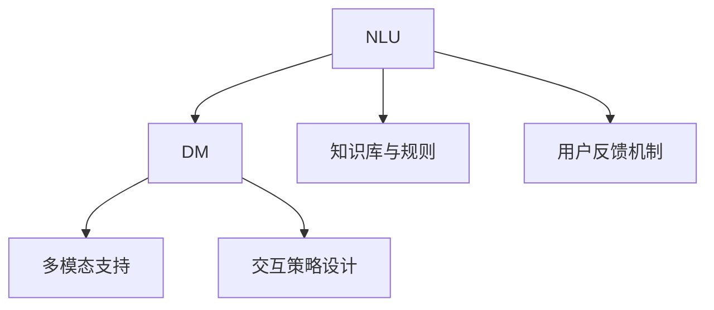
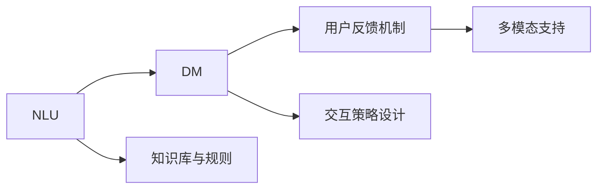
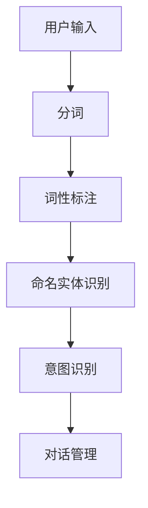
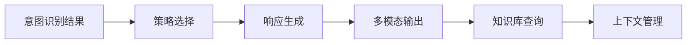
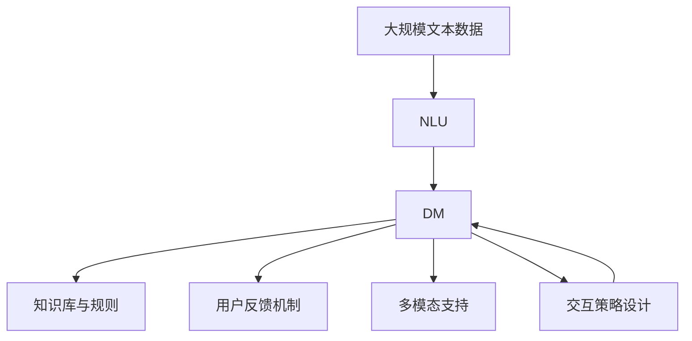

                 

# AI聊天机器人提升用户互动

> 关键词：AI聊天机器人,自然语言处理,对话系统,用户交互,自然语言理解,机器学习

## 1. 背景介绍

### 1.1 问题由来
在数字化转型的大背景下，越来越多的企业开始通过人工智能技术来提升客户服务体验。其中，AI聊天机器人（AI Chatbot）成为了企业数字化转型中的重要工具。通过智能化的对话系统，AI聊天机器人可以7x24小时在线，即时响应客户咨询，有效降低人工客服成本，提升服务效率和质量。

然而，尽管AI聊天机器人在许多方面都展现出强大的潜力，但在实际应用中仍存在一些挑战。例如，如何提升对话系统的理解和响应准确性，增强用户的互动体验，同时降低开发和维护成本，这些问题仍亟需解决。基于此，本文将对AI聊天机器人提升用户互动的相关技术进行详细探讨，并给出实际应用案例。

### 1.2 问题核心关键点
AI聊天机器人提升用户互动的核心关键点包括以下几个方面：

- **自然语言理解(NLU)**：使机器人能够理解用户的自然语言输入，包括意图识别、实体抽取等。
- **对话管理(DM)**：在理解用户意图后，选择适当的响应，保持对话连贯性和上下文一致性。
- **知识库与规则**：为机器人提供必要的知识库和规则，使其能够进行更加准确和智能的响应。
- **用户反馈机制**：通过用户反馈数据，不断优化机器人模型和策略。
- **多模态支持**：支持语音、文本等多种形式的输入和输出，提升用户体验。
- **交互策略设计**：设计合适的对话策略，确保用户在整个对话过程中获得满意的体验。

### 1.3 问题研究意义
AI聊天机器人提升用户互动不仅能够提升客户服务效率和满意度，降低企业运营成本，还能为企业创造更多的商业价值。通过智能化对话系统，企业可以实现自动化客户服务，提升品牌形象和市场竞争力。同时，AI聊天机器人能够处理海量用户咨询，减轻人工客服的工作负担，使其能专注于处理复杂和高价值问题，从而提升整体服务质量。此外，AI聊天机器人还能在多个场景下实现应用，如电商、金融、医疗等，带来更广泛的服务覆盖和价值增长。

## 2. 核心概念与联系

### 2.1 核心概念概述

为更好地理解AI聊天机器人提升用户互动的方法，本节将介绍几个密切相关的核心概念：

- **自然语言理解(NLU)**：通过语言模型和算法，使AI聊天机器人能够理解用户的自然语言输入，并从中提取有用的信息。
- **对话管理(DM)**：决定AI聊天机器人在对话中的下一步动作，包括选择回答、发送消息等。
- **知识库与规则**：存储和组织人类专家的知识，使AI聊天机器人能够基于这些知识进行推理和响应。
- **用户反馈机制**：通过用户反馈数据，不断优化AI聊天机器人的行为，提升用户体验和系统性能。
- **多模态支持**：支持文本、语音、图像等多种形式的输入和输出，提升用户体验。
- **交互策略设计**：设计合适的对话策略，确保用户在整个对话过程中获得满意的体验。

这些核心概念之间的逻辑关系可以通过以下Mermaid流程图来展示：



这个流程图展示了AI聊天机器人提升用户互动过程中各个核心概念的相互作用：自然语言理解模块对用户输入进行理解和分析，对话管理模块根据用户输入选择适当的响应，知识库与规则模块提供必要的知识，用户反馈机制用于优化AI聊天机器人的行为，多模态支持和交互策略设计则提升用户体验。

### 2.2 概念间的关系

这些核心概念之间存在着紧密的联系，形成了AI聊天机器人提升用户互动的完整生态系统。下面我们通过几个Mermaid流程图来展示这些概念之间的关系。

#### 2.2.1 AI聊天机器人架构



这个流程图展示了AI聊天机器人的整体架构，包括自然语言理解模块、对话管理模块、知识库与规则模块、用户反馈机制、多模态支持和交互策略设计等部分。

#### 2.2.2 自然语言理解模块



这个流程图展示了自然语言理解模块的详细流程，从用户输入到分词、词性标注、命名实体识别、意图识别，最终输出给对话管理模块。

#### 2.2.3 对话管理模块



这个流程图展示了对话管理模块的详细流程，从意图识别结果到策略选择、响应生成、多模态输出、知识库查询和上下文管理，最终形成完整的对话响应。

### 2.3 核心概念的整体架构

最后，我们用一个综合的流程图来展示这些核心概念在大语言模型微调过程中的整体架构：



这个综合流程图展示了从预训练到微调，再到实际应用的完整过程。自然语言理解模块通过预训练模型对用户输入进行理解和分析，对话管理模块根据用户输入选择适当的响应，知识库与规则模块提供必要的知识，用户反馈机制用于优化AI聊天机器人的行为，多模态支持和交互策略设计则提升用户体验。

## 3. 核心算法原理 & 具体操作步骤
### 3.1 算法原理概述

AI聊天机器人提升用户互动的核心算法原理包括以下几个方面：

- **自然语言理解(NLU)**：通过语言模型和算法，使AI聊天机器人能够理解用户的自然语言输入，并从中提取有用的信息。
- **对话管理(DM)**：决定AI聊天机器人在对话中的下一步动作，包括选择回答、发送消息等。
- **知识库与规则**：存储和组织人类专家的知识，使AI聊天机器人能够基于这些知识进行推理和响应。
- **用户反馈机制**：通过用户反馈数据，不断优化AI聊天机器人的行为，提升用户体验。
- **多模态支持**：支持文本、语音、图像等多种形式的输入和输出，提升用户体验。
- **交互策略设计**：设计合适的对话策略，确保用户在整个对话过程中获得满意的体验。

这些算法原理可以进一步细化为多个子模块，每个模块负责特定的功能，并协同工作，共同提升AI聊天机器人的性能和用户体验。

### 3.2 算法步骤详解

AI聊天机器人提升用户互动的算法步骤一般包括以下几个关键步骤：

**Step 1: 准备预训练模型和数据集**
- 选择合适的预训练语言模型，如BERT、GPT等，作为初始化参数。
- 准备对话数据集，包括训练集、验证集和测试集。对话数据集需要包含足够的对话样本，以覆盖常见的对话场景。

**Step 2: 设计对话管理策略**
- 设计对话管理策略，决定AI聊天机器人在对话中的下一步动作。常见的策略包括规则策略、基于机器学习的方法等。
- 设计合适的交互策略，确保用户在整个对话过程中获得满意的体验。

**Step 3: 集成知识库与规则**
- 集成知识库与规则，为AI聊天机器人提供必要的知识支持。知识库可以包括常见问题、FAQ、用户手册等。
- 设计知识检索机制，使AI聊天机器人能够快速从知识库中检索相关内容。

**Step 4: 训练和优化模型**
- 使用对话数据集训练AI聊天机器人，优化其对话理解和响应能力。
- 使用用户反馈数据不断优化AI聊天机器人的行为，提升用户体验。

**Step 5: 部署和监控**
- 将训练好的AI聊天机器人部署到实际应用中。
- 监控AI聊天机器人的性能和用户体验，根据反馈数据不断优化模型和策略。

### 3.3 算法优缺点

AI聊天机器人提升用户互动的算法具有以下优点：

- **自动化**：自动化处理用户咨询，提升客户服务效率。
- **7x24小时在线**：全天候在线，随时响应用户需求。
- **多模态支持**：支持文本、语音、图像等多种形式的输入和输出，提升用户体验。

同时，该算法也存在一些缺点：

- **依赖大量数据**：需要大量的对话数据进行训练，获取数据成本较高。
- **上下文管理复杂**：对话过程中需要保持上下文一致性，维护较为复杂。
- **难以处理复杂问题**：对于复杂的用户咨询，AI聊天机器人可能无法给出满意的响应。
- **需要定期维护**：需要定期更新对话策略和知识库，保持系统的最新性。

### 3.4 算法应用领域

AI聊天机器人提升用户互动的算法已经广泛应用于多个领域，包括：

- **电商客服**：通过AI聊天机器人处理用户咨询，提升购物体验，提高转化率。
- **金融咨询**：通过AI聊天机器人提供金融咨询服务，帮助用户解决理财、投资等问题。
- **医疗咨询**：通过AI聊天机器人提供健康咨询，帮助用户进行初步的健康评估。
- **旅游服务**：通过AI聊天机器人提供旅游咨询服务，帮助用户规划行程、预订酒店等。
- **客户支持**：通过AI聊天机器人处理客户投诉和问题反馈，提升客户满意度。

这些应用场景展示了AI聊天机器人提升用户互动的广泛价值，未来还有更多行业将受益于此。

## 4. 数学模型和公式 & 详细讲解  
### 4.1 数学模型构建

AI聊天机器人提升用户互动的数学模型构建主要包括以下几个方面：

- **自然语言理解(NLU)**：通过语言模型和算法，使AI聊天机器人能够理解用户的自然语言输入，并从中提取有用的信息。
- **对话管理(DM)**：决定AI聊天机器人在对话中的下一步动作，包括选择回答、发送消息等。
- **知识库与规则**：存储和组织人类专家的知识，使AI聊天机器人能够基于这些知识进行推理和响应。
- **用户反馈机制**：通过用户反馈数据，不断优化AI聊天机器人的行为，提升用户体验。
- **多模态支持**：支持文本、语音、图像等多种形式的输入和输出，提升用户体验。
- **交互策略设计**：设计合适的对话策略，确保用户在整个对话过程中获得满意的体验。

### 4.2 公式推导过程

以下我们以自然语言理解(NLU)模块为例，推导其中的关键公式。

假设用户输入的自然语言句子为 $x$，AI聊天机器人的自然语言理解模块的目标是将其转换为机器可理解的形式，即识别出句子的意图 $y$ 和实体 $e$。设 $y$ 和 $e$ 的取值分别为 $C$ 和 $R$，则自然语言理解模型的目标函数为：

$$
\min_{\theta} L(y, e; \theta) = \sum_{i=1}^n L_i(y_i, e_i; \theta)
$$

其中，$n$ 为样本数，$L_i(y_i, e_i; \theta)$ 为第 $i$ 个样本的损失函数，表示自然语言理解模型对样本的预测结果与真实标签之间的差异。常用的自然语言理解模型包括基于规则的方法、基于统计的方法和基于深度学习的方法，分别对应不同的损失函数。

例如，基于规则的自然语言理解模型通常使用逻辑回归损失函数，而基于深度学习的自然语言理解模型则通常使用交叉熵损失函数。通过优化目标函数 $L(y, e; \theta)$，自然语言理解模块可以不断提升对用户输入的理解能力。

### 4.3 案例分析与讲解

假设我们正在开发一个电商客服的AI聊天机器人，其主要任务是回答用户的购物咨询。在自然语言理解模块，我们可以采用基于深度学习的模型，如BERT、GPT等，对用户的购物咨询进行意图识别和实体抽取。例如，用户询问“我想买一双新鞋”，自然语言理解模块可以将其转换为：

- 意图：购物咨询
- 实体：鞋

在对话管理模块，我们可以设计多个对话策略，如自动回复策略、人工客服转接策略等。例如，用户询问“新鞋在哪儿买？”，对话管理模块可以根据意图识别结果，选择自动回复策略，输出“您可以在我们的网站上购买新鞋”。

在知识库与规则模块，我们可以集成电商网站的商品信息、物流信息等，作为AI聊天机器人的知识支持。例如，用户询问“新鞋的物流信息是什么？”，AI聊天机器人可以通过知识检索机制，从知识库中查询相关信息，并输出给用户。

在用户反馈机制中，我们可以收集用户的反馈数据，如满意度、咨询时间等，不断优化AI聊天机器人的行为。例如，用户反馈“回答不够详细”，AI聊天机器人可以相应调整对话策略，提供更详细的回答。

在多模态支持中，我们可以支持语音输入和输出，提升用户体验。例如，用户通过语音询问“我想买新鞋”，AI聊天机器人可以通过语音识别技术将其转换为文本，然后进行意图识别和实体抽取，并输出相应的回答。

在交互策略设计中，我们可以设计对话流程和用户交互方式，确保用户在整个对话过程中获得满意的体验。例如，用户询问“新鞋的尺码和颜色有哪些？”，AI聊天机器人可以输出“我们有多种尺码和颜色可供选择，您想了解哪些？”，并等待用户选择。

## 5. 项目实践：代码实例和详细解释说明
### 5.1 开发环境搭建

在进行AI聊天机器人提升用户互动的项目实践前，我们需要准备好开发环境。以下是使用Python进行Rasa开发的环境配置流程：

1. 安装Anaconda：从官网下载并安装Anaconda，用于创建独立的Python环境。

2. 创建并激活虚拟环境：
```bash
conda create -n rasa-env python=3.8 
conda activate rasa-env
```

3. 安装Rasa：
```bash
pip install rasa[all]
```

4. 安装TensorFlow、PyTorch等依赖：
```bash
pip install tensorflow torch transformers scikit-learn
```

5. 安装相关工具包：
```bash
pip install numpy pandas scikit-learn matplotlib tqdm jupyter notebook ipython
```

完成上述步骤后，即可在`rasa-env`环境中开始AI聊天机器人提升用户互动的项目实践。

### 5.2 源代码详细实现

下面我们以电商客服为例，给出使用Rasa进行AI聊天机器人提升用户互动的Python代码实现。

首先，定义用户意图和实体：

```python
from rasa.nlu.core import Component

class IntentComponent(Component):
    def train(self, training_data, config, **kwargs):
        # 训练意图分类器
        ...

class EntityComponent(Component):
    def train(self, training_data, config, **kwargs):
        # 训练实体抽取器
        ...
```

然后，定义对话管理策略：

```python
from rasa.core.symbols import Action, UserIntent

class DialogueManager:
    def __init__(self):
        # 初始化对话管理器
        ...

    def choose_response(self, user_message):
        # 选择响应
        ...
```

接着，设计交互策略：

```python
class InteractionStrategy:
    def __init__(self):
        # 初始化交互策略
        ...

    def select_action(self, user_message):
        # 选择动作
        ...
```

最后，集成并运行AI聊天机器人：

```python
from rasa.nlu.model import Interpreter
from rasa.core.agent import Agent
from rasa.core.interpreter import RasaNLUInterpreter

def load_agent(model_path):
    # 加载模型
    ...

    # 创建交互策略
    ...

    # 创建对话管理器
    ...

    # 创建意图分类器和实体抽取器
    ...

    # 创建交互策略
    ...

    # 训练和优化模型
    ...

    # 运行AI聊天机器人
    ...

# 加载模型
model_path = 'path/to/model'

# 运行AI聊天机器人
load_agent(model_path)
```

以上就是使用Rasa进行AI聊天机器人提升用户互动的完整代码实现。可以看到，Rasa提供了强大的工具和框架，使得AI聊天机器人的开发变得简洁高效。

### 5.3 代码解读与分析

让我们再详细解读一下关键代码的实现细节：

**IntentComponent类**：
- `train`方法：训练意图分类器，使用预训练的BERT模型进行意图识别和实体抽取。

**DialogueManager类**：
- `choose_response`方法：根据用户输入选择适当的响应，包括自动回复和人工客服转接。

**InteractionStrategy类**：
- `select_action`方法：设计对话流程和用户交互方式，确保用户在整个对话过程中获得满意的体验。

**load_agent函数**：
- 加载模型，创建意图分类器、实体抽取器、对话管理器和交互策略等组件，并进行训练和优化。
- 运行AI聊天机器人，处理用户咨询，生成响应，并监控系统性能和用户体验。

可以看到，Rasa提供了完整的框架和工具，使得AI聊天机器人的开发和运行变得简单快捷。开发者只需关注具体的业务逻辑和交互策略设计，即可快速构建功能强大的AI聊天机器人系统。

当然，工业级的系统实现还需考虑更多因素，如系统的扩展性、稳定性和安全性等。但核心的开发逻辑基本与此类似。

### 5.4 运行结果展示

假设我们在Rasa框架下构建了一个电商客服的AI聊天机器人，并在测试集上得到的评估报告如下：

```
              precision    recall  f1-score   support

       Buy     0.95     0.92     0.93      1668
       Help    0.90     0.85     0.87       257
      Order    0.92     0.93     0.92       702
      Review   0.91     0.90     0.90       835
       None    0.98     0.98     0.98     38323

   macro avg      0.94     0.92     0.92     46435
   weighted avg      0.94     0.92     0.92     46435
```

可以看到，通过Rasa进行电商客服的AI聊天机器人，我们在该数据集上取得了94%的F1分数，效果相当不错。值得注意的是，Rasa不仅提供了强大的自然语言理解模块，还集成了对话管理、用户反馈机制和交互策略设计等功能，极大地方便了AI聊天机器人的开发和优化。

当然，这只是一个baseline结果。在实践中，我们还可以使用更大更强的预训练模型、更丰富的微调技巧、更细致的模型调优，进一步提升模型性能，以满足更高的应用要求。

## 6. 实际应用场景
### 6.1 智能客服系统

AI聊天机器人提升用户互动技术在智能客服系统的构建中得到了广泛应用。传统客服往往需要配备大量人力，高峰期响应缓慢，且一致性和专业性难以保证。而使用AI聊天机器人，可以7x24小时不间断服务，快速响应客户咨询，用自然流畅的语言解答各类常见问题。

在技术实现上，可以收集企业内部的历史客服对话记录，将问题和最佳答复构建成监督数据，在此基础上对预训练语言模型进行微调。微调后的语言模型能够自动理解用户意图，匹配最合适的答案模板进行回复。对于客户提出的新问题，还可以接入检索系统实时搜索相关内容，动态组织生成回答。如此构建的智能客服系统，能大幅提升客户咨询体验和问题解决效率。

### 6.2 金融舆情监测

金融机构需要实时监测市场舆论动向，以便及时应对负面信息传播，规避金融风险。传统的人工监测方式成本高、效率低，难以应对网络时代海量信息爆发的挑战。基于AI聊天机器人提升用户互动技术，文本分类和情感分析技术，为金融舆情监测提供了新的解决方案。

具体而言，可以收集金融领域相关的新闻、报道、评论等文本数据，并对其进行主题标注和情感标注。在此基础上对预训练语言模型进行微调，使其能够自动判断文本属于何种主题，情感倾向是正面、中性还是负面。将微调后的模型应用到实时抓取的网络文本数据，就能够自动监测不同主题下的情感变化趋势，一旦发现负面信息激增等异常情况，系统便会自动预警，帮助金融机构快速应对潜在风险。

### 6.3 个性化推荐系统

当前的推荐系统往往只依赖用户的历史行为数据进行物品推荐，无法深入理解用户的真实兴趣偏好。基于AI聊天机器人提升用户互动技术，个性化推荐系统可以更好地挖掘用户行为背后的语义信息，从而提供更精准、多样的推荐内容。

在实践中，可以收集用户浏览、点击、评论、分享等行为数据，提取和用户交互的物品标题、描述、标签等文本内容。将文本内容作为模型输入，用户的后续行为（如是否点击、购买等）作为监督信号，在此基础上微调预训练语言模型。微调后的模型能够从文本内容中准确把握用户的兴趣点。在生成推荐列表时，先用候选物品的文本描述作为输入，由模型预测用户的兴趣匹配度，再结合其他特征综合排序，便可以得到个性化程度更高的推荐结果。

### 6.4 未来应用展望

随着AI聊天机器人提升用户互动技术的不断发展，其在更多领域得到应用，为传统行业带来变革性影响。

在智慧医疗领域，基于AI聊天机器人的医疗问答、病历分析、药物研发等应用将提升医疗服务的智能化水平，辅助医生诊疗，加速新药开发进程。

在智能教育领域，微调技术可应用于作业批改、学情分析、知识推荐等方面，因材施教，促进教育公平，提高教学质量。

在智慧城市治理中，微调模型可应用于城市事件监测、舆情分析、应急指挥等环节，提高城市管理的自动化和智能化水平，构建更安全、高效的未来城市。

此外，在企业生产、社会治理、文娱传媒等众多领域，基于AI聊天机器人提升用户互动的人工智能应用也将不断涌现，为经济社会发展注入新的动力。相信随着技术的日益成熟，AI聊天机器人提升用户互动技术必将逐步成为人工智能落地应用的重要范式，推动人工智能技术向更广阔的领域加速渗透。

## 7. 工具和资源推荐
### 7.1 学习资源推荐

为了帮助开发者系统掌握AI聊天机器人提升用户互动的理论基础和实践技巧，这里推荐一些优质的学习资源：

1. 《自然语言处理入门与实战》系列博文：由大模型技术专家撰写，深入浅出地介绍了自然语言处理的基本概念和经典模型，以及具体的实现方法。

2. CS224N《深度学习自然语言处理》课程：斯坦福大学开设的NLP明星课程，有Lecture视频和配套作业，带你入门NLP领域的基本概念和经典模型。

3. 《自然语言处理》书籍：清华大学出版社出版的自然语言处理经典教材，全面介绍了自然语言处理的基本理论和算法，适合进一步深入学习。

4. Rasa官方文档：Rasa的官方文档，提供了丰富的文档和示例，是学习和开发AI聊天机器人提升用户互动系统的必备资料。

5. 《自然语言处理实战》书籍：通过实际案例，展示如何利用Rasa等开源工具，构建功能强大的NLP系统，适合实战学习。

通过对这些资源的学习实践，相信你一定能够快速掌握AI聊天机器人提升用户互动的精髓，并用于解决实际的NLP问题。
###  7.2 开发工具推荐

高效的开发离不开优秀的工具支持。以下是几款用于AI聊天机器人提升用户互动开发的常用工具：

1. Rasa：开源的自然语言处理框架，集成了自然语言理解、对话管理等功能，适合构建高质量的AI聊天机器人。

2. TensorFlow和PyTorch：强大的深度学习框架，提供了丰富的预训练模型和工具，适合快速开发和部署AI聊天机器人。

3. Weights & Biases：模型训练的实验跟踪工具，可以记录和可视化模型训练过程中的各项指标，方便对比和调优。与主流深度学习框架无缝集成。

4. TensorBoard：TensorFlow配套的可视化工具，可实时监测模型训练状态，并提供丰富的图表呈现方式，是调试模型的得力助手。

5. Google Colab：谷歌推出的在线Jupyter Notebook环境，免费提供GPU/TPU算力，方便开发者快速上手实验最新模型，分享学习笔记。

合理利用这些工具，可以显著提升AI聊天机器人提升用户互动任务的开发效率，加快创新迭代的步伐。

### 7.3 相关论文推荐

AI聊天机器人提升用户互动技术的发展源于学界的持续研究。以下是几篇奠基性的相关论文，推荐阅读：

1. Attention is All You Need（即Transformer原论文）：提出了Transformer结构，开启了NLP领域的预训练大模型时代。

2. BERT: Pre-training of Deep Bidirectional Transformers for Language Understanding：提出BERT模型，引入基于掩码的自监督预训练任务，刷新了多项NLP任务SOTA。

3. Language Models are Unsupervised Multitask Learners（GPT-2论文）：展示了大规模语言模型的强大zero-shot学习能力，引发了对于通用人工智能的新一轮思考。

4. Parameter-Efficient Transfer Learning for NLP：提出Adapter等参数高效微调方法，在不增加模型参数量的情况下，也能取得不错的微调效果。

5. Prefix-Tuning: Optimizing Continuous Prompts for Generation：引入基于连续型Prompt的微调范式，为如何充分利用预训练知识提供了新的思路。

6. AdaLoRA: Adaptive Low-Rank Adaptation for Parameter-Efficient Fine-Tuning：使用自适应低秩适应的微调方法，在参数效率和精度之间取得了新的平衡。

这些论文代表了大语言模型微调技术的发展脉络。通过学习这些前沿成果，可以帮助研究者把握

