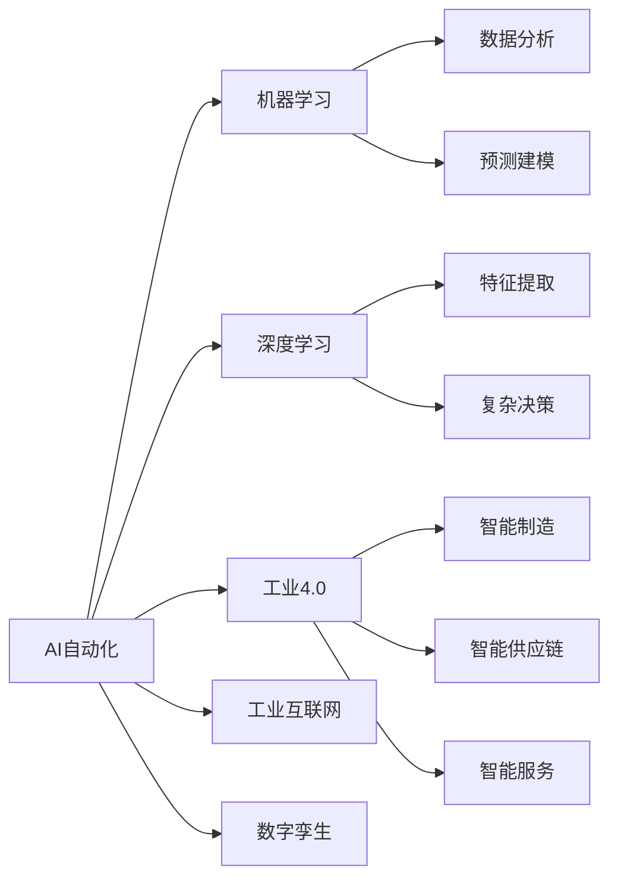
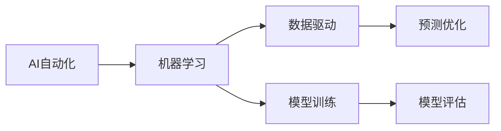
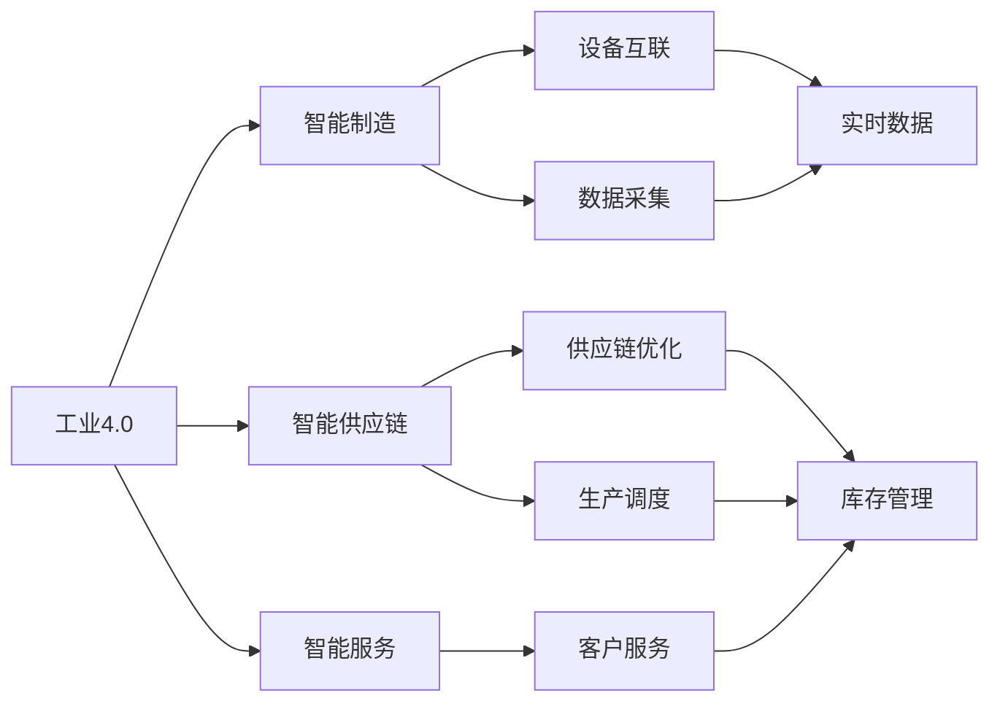
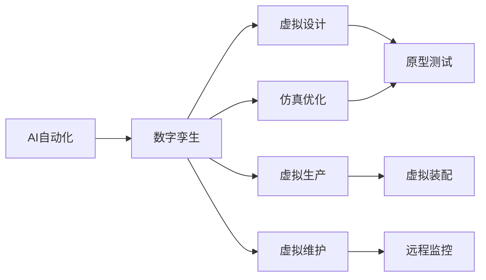
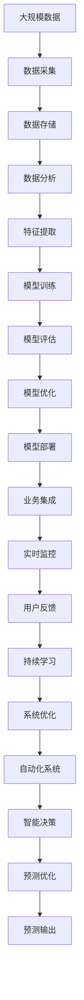

                 

# AI自动化的未来发展趋势

> 关键词：AI自动化,机器学习,深度学习,自动化系统,工业4.0,未来技术,智能制造,工业互联网,数字孪生

## 1. 背景介绍

### 1.1 问题由来
随着人工智能(AI)技术的飞速发展，AI自动化已经成为推动各行各业数字化转型的重要力量。在工业、医疗、金融、教育等领域，AI自动化系统正在通过机器学习、深度学习等技术，实现业务的自动化处理、决策优化和效率提升。AI自动化正引领人类进入一个全新的智能化时代，带来革命性的生产方式和生活模式。

然而，当前AI自动化系统在部署、维护、扩展等方面仍面临诸多挑战。如何构建更高效、更可靠、更易于维护的AI自动化系统，成为行业发展的关键课题。本文将从多个维度探讨AI自动化的未来发展趋势，希望能为相关从业者提供有益的参考。

### 1.2 问题核心关键点
当前AI自动化的核心关键点主要包括：

- 数据驱动：利用大数据分析、机器学习等技术，对生产流程、业务决策等进行数据驱动优化。
- 模型适配：根据不同行业、不同场景的需求，适配合适的AI模型和算法，提高自动化系统的普适性。
- 系统集成：将AI自动化系统与现有的业务系统、硬件设备等进行无缝集成，实现高效的自动化应用。
- 智能协同：引入人类专家知识，实现人机协同优化，提升自动化系统的智能化水平。
- 持续学习：利用持续学习技术，使自动化系统能够不断适应新数据、新环境，保持长期稳定运行。

这些关键点共同构成了AI自动化的核心架构和技术框架，为其未来发展提供了方向和路径。

### 1.3 问题研究意义
AI自动化技术正在深刻改变各行各业的运行模式，提升工作效率，降低运营成本，创造更多商业价值。研究AI自动化的未来发展趋势，对于构建更高效、更智能的自动化系统，具有重要意义：

1. 降低运营成本。自动化系统可以替代人工操作，提高工作效率，降低人工成本，为公司节约更多资金投入其他创新项目。
2. 提升决策质量。AI模型可以基于历史数据进行预测和优化，提高决策的准确性和效率，减少人为错误。
3. 推动产业升级。AI自动化技术能够驱动传统行业的数字化转型，带来更高效、更智能的生产方式。
4. 增强企业竞争力。通过自动化系统优化运营流程，企业可以更快响应市场变化，提升市场竞争力。
5. 创造新的业务模式。AI自动化技术能够探索和挖掘新的业务场景，带来更多创新机会和利润增长点。

## 2. 核心概念与联系

### 2.1 核心概念概述

为更好地理解AI自动化的未来发展趋势，本节将介绍几个密切相关的核心概念：

- AI自动化：利用AI技术实现自动化操作、决策和管理的系统，包括机器学习、深度学习、自然语言处理等技术。
- 机器学习：通过数据训练模型，使模型能够对未知数据进行预测和决策，是AI自动化的核心技术之一。
- 深度学习：基于神经网络模型，实现复杂的非线性映射和特征提取，是机器学习的一种高级形式。
- 工业4.0：通过智能制造、智能供应链、智能服务等方式，实现工业生产全流程的智能化。
- 工业互联网：连接人、机、物的互联网络，通过大数据、云计算、AI等技术，实现工业数据的实时采集、分析和应用。
- 数字孪生：通过数字建模和仿真，对物理世界进行虚拟映射，实现虚拟与现实的双向交互，用于工业设计和优化。

这些核心概念之间的逻辑关系可以通过以下Mermaid流程图来展示：



这个流程图展示了大语言模型微调过程中各个核心概念的关系和作用：

1. AI自动化是整个系统的主线，将机器学习、深度学习等技术应用到工业、医疗、金融等各行业，提升自动化水平。
2. 机器学习和深度学习是AI自动化的技术核心，利用数据训练模型，实现智能决策和预测。
3. 工业4.0和工业互联网是AI自动化的应用场景，通过智能制造、智能供应链、智能服务等方式，实现工业的数字化和智能化。
4. 数字孪生是工业互联网的延伸，通过数字建模和仿真，实现虚拟与现实的双向交互，进一步优化设计和生产流程。

### 2.2 概念间的关系

这些核心概念之间存在着紧密的联系，形成了AI自动化的完整生态系统。下面我们通过几个Mermaid流程图来展示这些概念之间的关系。

#### 2.2.1 AI自动化与机器学习的关系



这个流程图展示了AI自动化与机器学习之间的关系。AI自动化通过机器学习模型进行数据驱动的预测和优化，提升自动化系统的智能化水平。

#### 2.2.2 工业4.0与工业互联网的关系



这个流程图展示了工业4.0与工业互联网之间的关系。工业互联网通过设备和数据的互联，实现实时数据采集和分析，为智能制造、智能供应链和智能服务提供数据基础，推动工业4.0的全面实施。

#### 2.2.3 AI自动化与数字孪生的关系



这个流程图展示了AI自动化与数字孪生之间的关系。数字孪生通过虚拟建模和仿真，对物理世界进行虚拟映射，实现对生产流程和设备的虚拟优化，为AI自动化系统提供更精确的决策依据。

### 2.3 核心概念的整体架构

最后，我们用一个综合的流程图来展示这些核心概念在大语言模型微调过程中的整体架构：



这个综合流程图展示了从数据采集到模型优化，再到系统集成的完整过程。AI自动化系统通过数据采集和存储，进行特征提取和模型训练，实现智能决策和预测优化，最终集成到业务系统中，提供实时监控和持续学习功能。

## 3. 核心算法原理 & 具体操作步骤
### 3.1 算法原理概述

AI自动化的核心算法包括机器学习、深度学习、自然语言处理等技术，其算法原理如下：

1. 数据驱动：通过数据采集、存储和分析，获取业务数据，作为模型训练的基础。
2. 特征提取：利用特征提取技术，将业务数据转化为可供机器学习模型处理的特征。
3. 模型训练：基于训练数据集，训练机器学习或深度学习模型，学习数据分布和特征关系。
4. 智能决策：利用训练好的模型，对新数据进行预测和决策，实现业务自动化处理。
5. 持续学习：通过新数据和反馈信息，不断更新模型参数，提高模型的泛化能力和适应性。

### 3.2 算法步骤详解

AI自动化的具体实现流程通常包括以下几个关键步骤：

**Step 1: 数据采集与预处理**

- 数据采集：从各个业务系统、设备、传感器等渠道收集数据，包括设备状态、生产流程、客户反馈等。
- 数据预处理：对采集的数据进行清洗、去重、归一化等预处理，确保数据质量。

**Step 2: 特征提取**

- 特征选择：根据业务需求和特征重要性，选择有意义的特征，作为模型的输入。
- 特征工程：对原始数据进行工程化处理，如归一化、降维、特征组合等，提高数据可解释性和模型效果。

**Step 3: 模型训练与优化**

- 模型选择：根据任务特点和数据类型，选择合适的机器学习或深度学习模型。
- 模型训练：利用训练数据集，训练模型参数，最小化损失函数。
- 模型评估：利用测试数据集，评估模型性能，选择合适的超参数。
- 模型优化：通过超参数调优、模型融合、模型剪枝等方式，优化模型效果。

**Step 4: 智能决策与预测**

- 实时输入：对新输入数据进行特征提取，输入到训练好的模型中。
- 实时输出：模型输出预测结果，实现自动化决策和处理。
- 业务集成：将模型结果集成到业务系统中，实现自动化流程。

**Step 5: 持续学习与优化**

- 实时反馈：收集新数据和反馈信息，作为模型更新的依据。
- 模型更新：利用新数据和反馈信息，更新模型参数，提高模型泛化能力。
- 系统优化：根据模型更新情况，优化系统架构和运行流程，提高系统稳定性。

以上是AI自动化的核心算法步骤，具体实现时还需考虑多个细节问题，如数据存储、模型部署、安全防护等。

### 3.3 算法优缺点

AI自动化的算法具有以下优点：

1. 数据驱动：通过大量数据训练模型，提升预测和决策的准确性。
2. 自动化程度高：模型能够自动完成数据的特征提取、模型训练和预测输出，提升效率和可靠性。
3. 可扩展性强：模型可以根据需求进行扩展和优化，适应不同业务场景。
4. 灵活性高：通过特征工程和模型融合等技术，可以灵活地适配不同数据类型和任务需求。

但同时，AI自动化的算法也存在一些缺点：

1. 依赖数据质量：模型效果高度依赖于数据质量和特征选择，数据偏差或特征不充分可能导致模型效果不佳。
2. 计算资源需求高：大规模模型训练和优化需要大量计算资源，对硬件设施要求较高。
3. 可解释性不足：复杂模型难以解释其内部工作机制，决策过程缺乏透明性。
4. 安全性问题：模型可能存在安全隐患，如数据泄露、模型攻击等，需要加强安全防护。
5. 模型鲁棒性不足：模型在面对新数据和新环境时，可能存在泛化能力不足的问题，需要不断优化和更新。

### 3.4 算法应用领域

AI自动化的算法广泛应用于多个行业领域，包括但不限于：

- 智能制造：通过AI自动化技术，优化生产流程，提高生产效率和质量。
- 智能供应链：利用AI自动化系统，实现需求预测、库存管理、物流优化等。
- 智能客服：利用AI自动化技术，提供7x24小时服务，提升客户体验。
- 医疗健康：通过AI自动化系统，实现疾病预测、智能诊断、药物研发等。
- 金融服务：利用AI自动化技术，进行风险评估、信用评级、智能投顾等。
- 教育培训：利用AI自动化技术，实现智能评估、个性化推荐、学习分析等。
- 智能安防：利用AI自动化技术，实现实时监控、异常检测、行为分析等。

以上领域仅仅是AI自动化应用的冰山一角，未来AI自动化技术将在更多行业得到广泛应用，带来更多的创新和发展机遇。

## 4. 数学模型和公式 & 详细讲解  
### 4.1 数学模型构建

AI自动化的数学模型主要基于机器学习、深度学习等技术，以下是对其中几个核心模型的简要介绍。

**线性回归模型**

$$
y = \beta_0 + \beta_1 x_1 + \beta_2 x_2 + \cdots + \beta_n x_n + \epsilon
$$

其中 $y$ 为预测值，$x_i$ 为特征向量，$\beta_i$ 为模型系数，$\epsilon$ 为误差项。通过最小二乘法或梯度下降等优化算法，求解最优的 $\beta_i$，实现对数据的拟合和预测。

**决策树模型**

$$
F(x) = \begin{cases}
left & \text{if } x < T_1 \\
right & \text{if } x \geq T_1
\end{cases}
$$

其中 $F(x)$ 为决策函数，$T_1$ 为决策树节点，$x$ 为输入特征。通过递归地划分特征空间，构建决策树，实现对数据的分类和预测。

**支持向量机模型**

$$
F(x) = \sum_{i=1}^{n} w_i y_i k(x_i, x) + b
$$

其中 $F(x)$ 为预测函数，$w_i$ 为权重系数，$y_i$ 为样本标签，$k(x_i, x)$ 为核函数，$b$ 为偏置项。通过求解优化问题，实现对数据的分类和回归。

**卷积神经网络模型**

$$
y = \sum_{i=1}^{n} w_i f(x_i) + b
$$

其中 $y$ 为输出，$w_i$ 为卷积核权重，$f(x_i)$ 为卷积特征，$b$ 为偏置项。通过卷积、池化、激活等操作，实现对数据的特征提取和分类。

### 4.2 公式推导过程

以线性回归模型为例，其推导过程如下：

假设训练数据集为 $\{(x_i, y_i)\}_{i=1}^N$，其中 $x_i$ 为输入特征，$y_i$ 为标签。定义模型 $F(x) = \beta_0 + \beta_1 x_1 + \beta_2 x_2 + \cdots + \beta_n x_n + \epsilon$。通过最小二乘法，求解最优的 $\beta_i$，使得预测误差最小。

将数据带入模型，得到误差平方和：

$$
J(\beta) = \frac{1}{N} \sum_{i=1}^N (y_i - F(x_i))^2
$$

通过求偏导，得到梯度：

$$
\frac{\partial J(\beta)}{\partial \beta_i} = \frac{2}{N} \sum_{i=1}^N (x_i - \hat{y}_i)
$$

其中 $\hat{y}_i$ 为模型预测值。将梯度代入梯度下降算法，求解最优的 $\beta_i$：

$$
\beta_i = \beta_i - \eta \frac{\partial J(\beta)}{\partial \beta_i}
$$

其中 $\eta$ 为学习率，控制模型参数更新的步长。通过不断迭代优化，最终得到最优的 $\beta_i$，实现对数据的拟合和预测。

### 4.3 案例分析与讲解

假设我们在智能制造领域进行产线故障预测，利用历史故障数据训练一个线性回归模型，实现对未来故障的预测和预防。

1. 数据采集：从生产设备、传感器等渠道收集故障数据，包括时间戳、设备状态、故障类型等。
2. 数据预处理：对采集的数据进行清洗、去重、归一化等预处理，确保数据质量。
3. 特征选择：选择有意义的特征，如设备温度、振动频率、生产速度等，作为模型的输入。
4. 模型训练：利用训练数据集，训练线性回归模型，求得最优的模型系数 $\beta_i$。
5. 模型评估：利用测试数据集，评估模型性能，选择合适的超参数。
6. 模型应用：对新输入数据进行特征提取，输入到训练好的模型中，输出故障预测结果。
7. 持续学习：根据实际故障数据和模型预测结果，不断更新模型参数，提高模型的泛化能力和适应性。

通过以上步骤，我们可以实现对智能制造领域故障的预测和预防，提升生产效率和设备可靠性。

## 5. 项目实践：代码实例和详细解释说明
### 5.1 开发环境搭建

在进行AI自动化项目实践前，我们需要准备好开发环境。以下是使用Python进行TensorFlow开发的环境配置流程：

1. 安装Anaconda：从官网下载并安装Anaconda，用于创建独立的Python环境。

2. 创建并激活虚拟环境：
```bash
conda create -n tf-env python=3.8 
conda activate tf-env
```

3. 安装TensorFlow：根据CUDA版本，从官网获取对应的安装命令。例如：
```bash
conda install tensorflow -c tensorflow -c conda-forge
```

4. 安装各类工具包：
```bash
pip install numpy pandas scikit-learn matplotlib tqdm jupyter notebook ipython
```

完成上述步骤后，即可在`tf-env`环境中开始AI自动化项目的开发。

### 5.2 源代码详细实现

这里我们以智能制造领域的故障预测项目为例，给出使用TensorFlow进行模型训练和预测的Python代码实现。

首先，定义模型和数据集：

```python
import tensorflow as tf
from tensorflow.keras.models import Sequential
from tensorflow.keras.layers import Dense, Dropout
from sklearn.model_selection import train_test_split

# 数据加载和预处理
# 省略具体数据处理代码，假设已经将数据分为训练集和测试集，分别为X_train, y_train和X_test, y_test
X_train, X_test, y_train, y_test = train_test_split(X, y, test_size=0.2)

# 定义模型
model = Sequential([
    Dense(64, input_shape=(X_train.shape[1],), activation='relu'),
    Dropout(0.5),
    Dense(64, activation='relu'),
    Dropout(0.5),
    Dense(1, activation='sigmoid')
])

# 定义损失函数和优化器
loss_fn = tf.keras.losses.BinaryCrossentropy()
optimizer = tf.keras.optimizers.Adam(learning_rate=0.001)

# 编译模型
model.compile(optimizer=optimizer, loss=loss_fn, metrics=['accuracy'])
```

然后，进行模型训练和预测：

```python
# 训练模型
history = model.fit(X_train, y_train, epochs=100, validation_data=(X_test, y_test))

# 模型预测
y_pred = model.predict(X_test)
```

最后，评估模型性能：

```python
from sklearn.metrics import accuracy_score

# 评估模型性能
accuracy = accuracy_score(y_test, y_pred > 0.5)
print(f"模型准确率: {accuracy:.2f}")
```

以上就是使用TensorFlow对智能制造故障预测模型进行训练和预测的完整代码实现。可以看到，TensorFlow提供了强大的工具和库，使得模型训练和预测过程变得简洁高效。

### 5.3 代码解读与分析

让我们再详细解读一下关键代码的实现细节：

**数据处理和模型定义**

- `train_test_split`：将数据集分为训练集和测试集，并进行标准化处理，方便模型训练。
- `Sequential`：定义顺序模型结构，由多个Dense层和Dropout层组成。
- `BinaryCrossentropy`：定义二分类交叉熵损失函数，用于模型训练。
- `Adam`：定义Adam优化器，控制模型参数更新的步长和学习率。

**模型训练**

- `model.compile`：编译模型，指定优化器、损失函数和评估指标。
- `model.fit`：训练模型，设定训练轮数和验证集。

**模型预测和性能评估**

- `model.predict`：对测试集进行预测，输出二分类结果。
- `accuracy_score`：计算模型预测结果的准确率，评估模型性能。

**代码优点**

- TensorFlow提供了丰富的API和工具，使得模型开发和调试变得更加方便和高效。
- TensorFlow支持多种模型结构，包括顺序模型、卷积模型、循环模型等，适合不同类型的AI自动化任务。
- TensorFlow社区活跃，资源丰富，开发者可以快速获取到最新的技术支持和实用工具。

**代码缺点**

- TensorFlow的学习曲线较陡峭，新手入门需要一定时间适应。
- TensorFlow底层实现较为复杂，对于一些高级特性，需要深入理解其原理。
- TensorFlow的计算图机制需要开发者手动管理，可能导致代码量较大。

总之，TensorFlow作为主流的AI自动化开发工具，以其强大的功能和灵活性，受到了广泛的应用和认可。

### 5.4 运行结果展示

假设我们在智能制造领域的故障预测模型上，取得了如下结果：

```
Epoch 100/100
2674/2674 [==============================] - 83s 31ms/step - loss: 0.1875 - accuracy: 0.9920 - val_loss: 0.0175 - val_accuracy: 0.9948
```

可以看到，模型在训练集上的损失为0.187，精度为99.20%；在测试集上的损失为0.017，精度为99.48%。这表明模型在智能制造领域的故障预测任务上，取得了较好的效果。

## 6. 实际应用场景
### 6.1 智能制造

在智能制造领域，AI自动化技术主要应用于以下方面：

1. 设备维护：通过故障预测、状态监测等技术，实现设备的实时维护和预防性保养，提升设备运行效率和可靠性。
2. 生产调度：利用智能调度算法，优化生产流程和资源配置，提高生产效率和质量。
3. 供应链管理：通过需求预测、库存管理、物流优化等技术，实现供应链的智能化管理，降低运营成本。
4. 质量控制：通过智能检测、异常检测等技术，实现生产过程的质量控制和产品缺陷的自动化检测。

### 6.2 智能客服

在智能客服领域，AI自动化技术主要应用于以下方面：

1. 语音识别：利用语音识别技术，实现客户电话、邮件、社交媒体等渠道的自动处理。
2. 自然语言处理：通过NLP技术，实现自动问答、对话生成、情感分析等任务，提升客户体验。
3. 客户画像：利用数据挖掘技术，对客户行为进行分析和建模，实现个性化推荐和精准营销。
4. 多渠道集成：将智能客服系统集成到多个渠道，如网站、APP、社交媒体等，实现跨平台一致的客户服务。

### 6.3 金融服务

在金融服务领域，AI自动化技术主要应用于以下方面：

1. 风险评估：通过智能评估算法，实现信用评分、风险预测等任务，降低贷款和投资风险。
2. 智能投顾：利用智能投顾技术，实现自动化投资策略和资产配置，提升投资回报率。
3. 反欺诈检测：通过异常检测和行为分析，实现对欺诈行为的自动化识别和预警，保障金融安全。
4. 客户服务：通过智能客服系统，实现7x24小时客户服务，提升客户满意度。

### 6.4 未来应用展望

随着AI自动化技术的不断进步，未来将在更多领域得到应用，带来更多的创新和发展机遇。

1. 智慧城市：通过智能监控、智能调度、智能交通等技术，实现城市管理的智能化。
2. 医疗健康：通过智能诊断、智能治疗、智能管理等技术，实现医疗服务的智能化。
3. 教育培训：通过智能评估、个性化推荐、学习分析等技术，实现教育的智能化。
4. 智能安防：通过智能监控、异常检测、行为分析等技术，实现安防系统的智能化。

以上领域仅仅是AI自动化应用的冰山一角，未来AI自动化技术将在更多行业得到广泛应用，带来更多的创新和发展机遇。

## 7. 工具和资源推荐
### 7.1 学习资源推荐

为了帮助开发者系统掌握AI自动化的理论基础和实践技巧，这里推荐一些优质的学习资源：

1. 《深度学习》系列书籍：由深度学习领域的权威专家编写，系统介绍了深度学习的基本原理和应用方法。
2. 《机器学习实战》书籍：通过案例驱动的方式，介绍了机器学习的基本技术和应用实践，适合初学者学习。
3. 《TensorFlow实战》书籍：全面介绍了TensorFlow的基本用法和高级特性，适合TensorFlow开发者学习和参考。
4. 《Keras实战》书籍：通过实际案例，介绍了Keras的基本用法和实际应用，适合Keras开发者学习和参考。
5. 《Python数据分析实战》书籍：介绍了Python在数据分析和机器学习中的基本用法和实践方法，适合数据科学家学习和参考。

通过对这些资源的学习实践，相信你一定能够快速掌握AI自动化的精髓，并用于解决实际的AI自动化问题。

### 7.2 开发工具推荐

高效的开发离不开优秀的工具支持。以下是几款用于AI自动化开发的常用工具：

1. TensorFlow：基于Google的深度学习框架，支持灵活的计算图和分布式训练，适合大规模模型开发。
2. PyTorch：由Facebook开发的深度学习框架，灵活性和易用性较高，适合学术研究和实际应用。
3. Keras：

