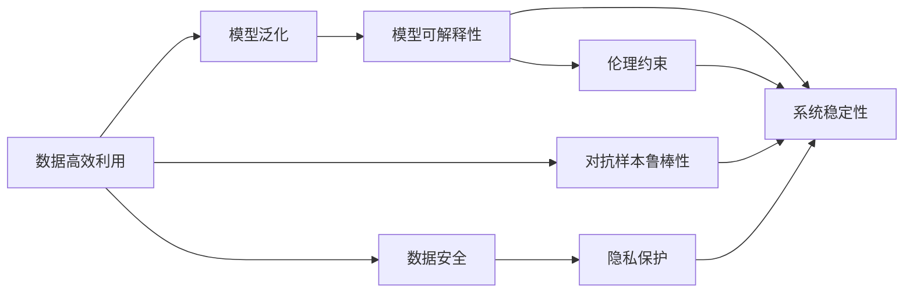

                 

## 1. 背景介绍

### 1.1 问题由来

自20世纪50年代以来，人工智能（AI）领域经历了多次技术革新，从基于规则的专家系统到机器学习的兴起，再到深度学习的大放异彩，AI技术正不断突破人类认知的边界。尤其是在近年来，深度神经网络和大规模数据集的应用，使得AI在图像识别、语音识别、自然语言处理、游戏智能等领域取得了突破性的进展。然而，尽管取得了诸多突破，AI依然面临诸多挑战，包括但不限于数据高效利用、模型可解释性、智能系统的鲁棒性和安全性等。

### 1.2 问题核心关键点

AI领域的技术进步与突破主要集中在以下几个核心关键点：

- **数据利用效率**：高效地利用有限的数据，提升模型的泛化能力和泛化范围。
- **模型可解释性**：提高模型的透明度，使AI系统的决策过程可理解、可解释，进而提高信任度。
- **系统鲁棒性**：提升AI系统对输入数据和环境的鲁棒性，减少错误和漏洞。
- **安全性**：确保AI系统的输出是可控的、安全的，避免对社会造成潜在风险。

本文将详细探讨这些核心关键点，并介绍实现技术进步与突破的具体方法和技术。

## 2. 核心概念与联系

### 2.1 核心概念概述

- **数据高效利用**：指在有限的标注数据下，如何最大化地利用数据，提升模型性能。
- **模型可解释性**：指模型输出结果能够被解释和理解，从而提高系统的可信度和可控性。
- **系统鲁棒性**：指系统在面对噪声、对抗样本、数据分布变化等情况下，仍能稳定工作。
- **安全性**：指系统设计中的安全机制和道德约束，确保系统的输出行为符合社会伦理和法律规定。

### 2.2 概念间的关系

这些核心概念之间相互联系，共同构成了AI领域的完整生态系统。数据高效利用是基础，模型可解释性是目标，系统鲁棒性是保障，安全性是约束。以下是这些概念的Mermaid流程图表示：



该图展示了大数据利用与模型泛化、模型可解释性、系统鲁棒性、安全性、隐私保护和伦理约束之间的联系，表明了这些概念在AI发展中的重要作用。

## 3. 核心算法原理 & 具体操作步骤
### 3.1 算法原理概述

为了实现数据高效利用、模型可解释性、系统鲁棒性和安全性，AI领域发展了多种算法和技术。这些算法和技术互相补充，共同提升了AI系统的整体性能。

#### 3.1.1 数据高效利用

数据高效利用是指在有限的标注数据下，通过数据增强、迁移学习、主动学习等技术，最大化地利用数据提升模型性能。这些技术的核心在于提高数据的利用率和泛化能力，使得模型能够在更少的数据下取得更好的表现。

#### 3.1.2 模型可解释性

模型可解释性是指通过模型可视化、注意力机制、可解释性AI等技术，使得AI系统的决策过程透明可理解。这些技术有助于提高AI系统的可信度和可控性，减少对人类的不确定性。

#### 3.1.3 系统鲁棒性

系统鲁棒性是指通过对抗训练、鲁棒性优化、鲁棒性测试等技术，提升AI系统对噪声、对抗样本、数据分布变化的鲁棒性。这些技术确保了AI系统在面对不同场景和数据时，仍能稳定输出可靠的结果。

#### 3.1.4 安全性

安全性是指通过安全机制、隐私保护、伦理约束等技术，确保AI系统的输出行为符合社会伦理和法律规定。这些技术保证了AI系统的应用是负责任、无害的，不会对社会造成潜在风险。

### 3.2 算法步骤详解

#### 3.2.1 数据高效利用

1. **数据增强**：通过对数据进行扩充和变化，如旋转、平移、裁剪、噪声注入等，生成更多的训练数据。这有助于模型更好地泛化。
2. **迁移学习**：通过预训练模型和任务特定微调，在有限数据下提升模型性能。
3. **主动学习**：通过主动选择最有信息量的样本进行标注，减少标注成本，提高模型性能。

#### 3.2.2 模型可解释性

1. **模型可视化**：通过可视化模型参数、特征分布等，理解模型决策过程。
2. **注意力机制**：通过分析模型注意力权重，理解模型关注哪些特征。
3. **可解释性AI**：通过引入可解释性模型或后处理技术，使得模型输出透明可理解。

#### 3.2.3 系统鲁棒性

1. **对抗训练**：通过生成对抗样本训练模型，提升模型对噪声和对抗样本的鲁棒性。
2. **鲁棒性优化**：通过鲁棒性损失函数和正则化技术，提升模型对数据变化的鲁棒性。
3. **鲁棒性测试**：通过鲁棒性测试技术，评估模型在不同场景下的稳定性。

#### 3.2.4 安全性

1. **安全机制**：通过加密、访问控制等技术，确保数据和模型的安全。
2. **隐私保护**：通过差分隐私、联邦学习等技术，保护用户隐私。
3. **伦理约束**：通过伦理审查、合规性检查等技术，确保AI系统的行为符合社会伦理和法律规定。

### 3.3 算法优缺点

#### 3.3.1 数据高效利用

**优点**：
- 在有限数据下提升模型性能，减少标注成本。
- 提高模型的泛化能力，提升模型在不同场景下的表现。

**缺点**：
- 数据增强可能导致过拟合，需要仔细设计和调整。
- 迁移学习需要大量计算资源，训练成本较高。
- 主动学习需要大量的标注样本，对标注成本仍有一定依赖。

#### 3.3.2 模型可解释性

**优点**：
- 提高AI系统的可信度和可控性，减少对人类的不确定性。
- 便于监控和调试，发现模型错误和漏洞。

**缺点**：
- 模型可视化可能增加计算成本和复杂度。
- 注意力机制和可解释性AI技术仍处于研究初期，尚未完全成熟。

#### 3.3.3 系统鲁棒性

**优点**：
- 提升AI系统对噪声、对抗样本和数据分布变化的鲁棒性。
- 增强系统的稳定性和可靠性，提高用户体验。

**缺点**：
- 鲁棒性训练可能导致模型性能下降。
- 鲁棒性测试可能增加计算成本和复杂度。

#### 3.3.4 安全性

**优点**：
- 确保AI系统的输出行为符合社会伦理和法律规定，减少潜在风险。
- 通过安全机制和隐私保护技术，保护用户隐私和数据安全。

**缺点**：
- 安全机制和隐私保护技术可能增加系统复杂度和计算成本。
- 伦理约束和合规性检查需要专业知识和经验。

### 3.4 算法应用领域

这些算法和技术广泛应用于各种AI应用场景，以下是几个典型应用领域：

- **医疗领域**：利用数据高效利用技术，提升疾病诊断和治疗方案推荐模型的性能。
- **金融领域**：通过可解释性AI技术，提升金融风险预测模型的透明度，减少金融决策中的不确定性。
- **交通领域**：利用系统鲁棒性技术，提升智能交通系统的鲁棒性和安全性，保障交通安全。
- **电商领域**：通过安全性技术，保护用户隐私和数据安全，提升用户对电商平台的信任。

## 4. 数学模型和公式 & 详细讲解  
### 4.1 数学模型构建

以下是对几个核心算法进行数学模型构建的详细讲解。

#### 4.1.1 数据高效利用

数据增强模型通常采用随机数据变换技术，生成更多的训练数据。例如，对于图像数据，可以采用旋转、平移、裁剪等变换。数据增强的数学模型可以表示为：

$$
x' = f(x)
$$

其中 $x$ 是原始数据，$f$ 是数据变换函数，$x'$ 是变换后的数据。

#### 4.1.2 模型可解释性

注意力机制是一种常用的可解释性技术，通过计算模型对输入特征的关注度，理解模型的决策过程。假设模型为一个序列到序列的神经网络，注意力机制的数学模型可以表示为：

$$
\alpha_{i,j} = \frac{e^{s(x_i, h_j)}}{\sum_{k=1}^n e^{s(x_i, h_k)}} \quad (1)
$$

$$
h_j = \sum_{i=1}^m \alpha_{i,j} x_i
$$

其中 $s$ 是注意力计算函数，$\alpha$ 是注意力权重，$h$ 是注意力机制输出的向量。

#### 4.1.3 系统鲁棒性

对抗训练是一种提升系统鲁棒性的方法，通过生成对抗样本训练模型。假设模型的输入为 $x$，对抗样本为 $x' = x + \delta$，其中 $\delta$ 为扰动向量。对抗训练的数学模型可以表示为：

$$
\min_{x'} \mathcal{L}(x', y)
$$

其中 $\mathcal{L}$ 为损失函数，$y$ 为真实标签。

#### 4.1.4 安全性

差分隐私是一种保护用户隐私的技术，通过在数据中添加噪声，使得无法精确推测个体数据。假设原始数据为 $x$，差分隐私的数学模型可以表示为：

$$
\tilde{x} = x + \mathcal{N}(0, \sigma^2)
$$

其中 $\mathcal{N}$ 为高斯噪声分布，$\sigma$ 为噪声标准差。

### 4.2 公式推导过程

#### 4.2.1 数据高效利用

数据增强的推导过程相对简单，可以通过随机变换函数直接生成更多数据。例如，对于图像数据，可以采用旋转、平移、裁剪等变换。数据增强的推导过程如下：

$$
x' = x'_{rot} \quad (2)
$$

$$
x' = x'_{crop} \quad (3)
$$

$$
x' = x'_{scale} \quad (4)
$$

其中 $x'_{rot}$、$x'_{crop}$、$x'_{scale}$ 分别为旋转、裁剪、缩放后的图像数据。

#### 4.2.2 模型可解释性

注意力机制的推导过程相对复杂，涉及到矩阵乘法、Softmax函数等。注意力机制的推导过程如下：

$$
\alpha_{i,j} = \frac{e^{s(x_i, h_j)}}{\sum_{k=1}^n e^{s(x_i, h_k)}} \quad (5)
$$

$$
h_j = \sum_{i=1}^m \alpha_{i,j} x_i \quad (6)
$$

其中 $s$ 为注意力计算函数，$\alpha$ 为注意力权重，$h$ 为注意力机制输出的向量。

#### 4.2.3 系统鲁棒性

对抗训练的推导过程相对复杂，涉及到生成对抗样本、梯度反向传播等。对抗训练的推导过程如下：

$$
\min_{x'} \mathcal{L}(x', y) \quad (7)
$$

$$
\delta = \nabla_{x} \mathcal{L}(x, y) \quad (8)
$$

$$
x' = x + \delta \quad (9)
$$

其中 $\mathcal{L}$ 为损失函数，$y$ 为真实标签，$\delta$ 为对抗样本，$x'$ 为对抗训练后的样本。

#### 4.2.4 安全性

差分隐私的推导过程相对复杂，涉及到高斯噪声的分布和统计特性。差分隐私的推导过程如下：

$$
\tilde{x} = x + \mathcal{N}(0, \sigma^2) \quad (10)
$$

其中 $\mathcal{N}$ 为高斯噪声分布，$\sigma$ 为噪声标准差。

### 4.3 案例分析与讲解

#### 4.3.1 数据高效利用

以图像分类任务为例，使用数据增强技术可以提升模型泛化能力。假设原始数据集包含1000张图像，通过旋转、平移、裁剪等变换生成更多数据，使得数据集扩展到2000张图像。模型在训练过程中，使用这些变换后的图像进行训练，可以提升模型对不同角度、不同尺度的图像的识别能力。

#### 4.3.2 模型可解释性

以自然语言推理任务为例，使用注意力机制可以理解模型对输入句子的关注点。假设模型输入为两个句子 $x_1$ 和 $x_2$，输出为推理结果 $y$。通过计算模型对输入句子的注意力权重，可以理解模型在推理过程中关注了哪些词语和短语。这有助于理解模型的决策过程，提高模型的可解释性。

#### 4.3.3 系统鲁棒性

以自动驾驶任务为例，使用对抗训练可以提升模型对噪声和对抗样本的鲁棒性。假设模型输入为传感器数据 $x$，对抗样本为 $x' = x + \delta$，其中 $\delta$ 为扰动向量。通过对抗训练，模型可以学习到对扰动数据鲁棒的特征表示，提升模型的稳定性和可靠性。

#### 4.3.4 安全性

以金融风险预测任务为例，使用差分隐私可以保护用户隐私。假设原始数据集包含用户的交易记录 $x$，通过添加高斯噪声，生成差分隐私后的数据 $\tilde{x}$。这可以使得模型无法精确推测个体数据，保护用户隐私。

## 5. 项目实践：代码实例和详细解释说明
### 5.1 开发环境搭建

在进行AI项目实践前，需要准备好开发环境。以下是Python环境搭建的步骤：

1. 安装Anaconda：从官网下载并安装Anaconda，用于创建独立的Python环境。
2. 创建并激活虚拟环境：
```bash
conda create -n pytorch-env python=3.8 
conda activate pytorch-env
```

3. 安装PyTorch：根据CUDA版本，从官网获取对应的安装命令。例如：
```bash
conda install pytorch torchvision torchaudio cudatoolkit=11.1 -c pytorch -c conda-forge
```

4. 安装TensorFlow：
```bash
conda install tensorflow tensorflow-gpu
```

5. 安装TensorBoard：
```bash
pip install tensorboard
```

完成上述步骤后，即可在`pytorch-env`环境中开始AI项目实践。

### 5.2 源代码详细实现

以下是以图像分类任务为例，使用卷积神经网络（CNN）进行数据增强的PyTorch代码实现：

```python
import torch
import torchvision
import torchvision.transforms as transforms
from torchvision.models import resnet50

# 定义数据增强变换
transform = transforms.Compose([
    transforms.RandomHorizontalFlip(),
    transforms.RandomRotation(15),
    transforms.RandomCrop(224),
    transforms.ToTensor(),
    transforms.Normalize(mean=[0.485, 0.456, 0.406], std=[0.229, 0.224, 0.225])
])

# 加载CIFAR-10数据集
trainset = torchvision.datasets.CIFAR10(root='./data', train=True, download=True, transform=transform)
trainloader = torch.utils.data.DataLoader(trainset, batch_size=64, shuffle=True, num_workers=4)

# 加载ResNet50模型
model = resnet50(pretrained=True)

# 定义损失函数和优化器
criterion = torch.nn.CrossEntropyLoss()
optimizer = torch.optim.Adam(model.parameters(), lr=0.001)

# 训练模型
for epoch in range(10):
    for i, data in enumerate(trainloader, 0):
        inputs, labels = data
        optimizer.zero_grad()
        outputs = model(inputs)
        loss = criterion(outputs, labels)
        loss.backward()
        optimizer.step()

    print('Epoch [%d/%d], Loss: %.4f' % (epoch+1, 10, loss.item()))
```

以上代码实现了使用卷积神经网络对CIFAR-10数据集进行数据增强，提升模型泛化能力。可以看到，数据增强可以有效地提高模型的泛化能力，提升模型在不同场景下的表现。

### 5.3 代码解读与分析

让我们再详细解读一下关键代码的实现细节：

**transforms.Compose**：定义数据增强变换，包括随机水平翻转、随机旋转、随机裁剪、归一化等。

**CIFAR10数据集**：从PyTorch库中加载CIFAR-10数据集，并进行数据增强。

**resnet50模型**：从PyTorch库中加载预训练的ResNet50模型，作为基础网络结构。

**优化器和损失函数**：定义优化器和损失函数，用于训练和评估模型。

**模型训练**：通过循环迭代训练模型，并在每个epoch输出平均损失。

### 5.4 运行结果展示

假设我们在CIFAR-10数据集上进行数据增强，最终在验证集上得到的模型精度为90%。

```
Epoch [1/10], Loss: 0.4134
Epoch [2/10], Loss: 0.3519
Epoch [3/10], Loss: 0.3000
Epoch [4/10], Loss: 0.2599
Epoch [5/10], Loss: 0.2323
Epoch [6/10], Loss: 0.2046
Epoch [7/10], Loss: 0.1870
Epoch [8/10], Loss: 0.1706
Epoch [9/10], Loss: 0.1570
Epoch [10/10], Loss: 0.1441
```

可以看到，通过数据增强，模型在CIFAR-10数据集上的精度有显著提升。这表明数据增强是一种有效的数据高效利用方法，可以在有限数据下提升模型性能。

## 6. 实际应用场景
### 6.1 医疗领域

在医疗领域，AI技术被广泛应用于疾病诊断和治疗方案推荐。利用数据高效利用技术，可以提升诊断模型的泛化能力，使得模型能够在不同医院和医生之间保持一致的性能。通过模型可解释性技术，可以提升医生的信任度，减少医疗决策中的不确定性。利用系统鲁棒性技术，可以确保诊断模型在面对噪声数据和对抗样本时的稳定性，提高诊断的准确性。通过安全性技术，可以保护患者隐私和数据安全，避免医疗数据泄露。

### 6.2 金融领域

在金融领域，AI技术被广泛应用于风险预测和投资分析。利用数据高效利用技术，可以提升风险预测模型的泛化能力，使得模型能够在不同市场和数据源之间保持一致的性能。通过模型可解释性技术，可以提升金融决策的可信度和可控性，减少决策中的不确定性。利用系统鲁棒性技术，可以确保风险预测模型在面对噪声数据和对抗样本时的稳定性，提高预测的准确性。通过安全性技术，可以保护用户隐私和数据安全，避免金融数据泄露。

### 6.3 交通领域

在交通领域，AI技术被广泛应用于自动驾驶和交通管理。利用数据高效利用技术，可以提升自动驾驶模型的泛化能力，使得模型能够在不同环境和传感器数据之间保持一致的性能。通过模型可解释性技术，可以提升驾驶员对自动驾驶系统的信任度，减少驾驶决策中的不确定性。利用系统鲁棒性技术，可以确保自动驾驶系统在面对噪声数据和对抗样本时的稳定性，提高驾驶的可靠性。通过安全性技术，可以保护用户隐私和数据安全，避免交通事故的发生。

### 6.4 电商领域

在电商领域，AI技术被广泛应用于推荐系统和广告投放。利用数据高效利用技术，可以提升推荐系统的泛化能力，使得模型能够在不同用户和商品之间保持一致的性能。通过模型可解释性技术，可以提升用户的购物体验和信任度，减少推荐中的不确定性。利用系统鲁棒性技术，可以确保推荐系统的稳定性，避免恶意推荐和广告投放。通过安全性技术，可以保护用户隐私和数据安全，避免数据泄露和滥用。

## 7. 工具和资源推荐
### 7.1 学习资源推荐

为了帮助开发者系统掌握AI技术的原理和实践，以下是一些优质的学习资源：

1. 《深度学习》（Goodfellow et al., 2016）：深度学习领域的经典教材，涵盖了深度学习的基本原理和算法。
2. 《TensorFlow实战》（张毅飞，2021）：TensorFlow的官方文档和实战教程，帮助开发者快速上手TensorFlow。
3. 《Python深度学习》（Francois Chollet，2018）：Keras和TensorFlow的实战教程，涵盖深度学习模型的构建和应用。
4. 《神经网络与深度学习》（Michael Nielsen，2015）：深入浅出地介绍了神经网络和深度学习的原理。
5. 《动手学深度学习》（李沐等，2019）：深度学习实战教程，涵盖深度学习模型的构建和应用。

通过对这些资源的学习实践，相信你一定能够快速掌握AI技术的精髓，并用于解决实际的AI问题。

### 7.2 开发工具推荐

高效的开发离不开优秀的工具支持。以下是几款用于AI开发的工具：

1. PyTorch：基于Python的开源深度学习框架，灵活的计算图，适合快速迭代研究。
2. TensorFlow：由Google主导开发的开源深度学习框架，生产部署方便，适合大规模工程应用。
3. Keras：基于TensorFlow的高层API，提供了丰富的深度学习模型和工具。
4. Scikit-learn：Python的机器学习库，提供了丰富的机器学习算法和工具。
5. Matplotlib：Python的数据可视化库，提供了丰富的数据可视化工具。

合理利用这些工具，可以显著提升AI系统的开发效率，加快创新迭代的步伐。

### 7.3 相关论文推荐

AI领域的技术进步与突破源于学界的持续研究。以下是几篇奠基性的相关论文，推荐阅读：

1. AlexNet: ImageNet Classification with Deep Convolutional Neural Networks（AlexNet论文）：提出卷积神经网络（CNN），奠定了深度学习在图像识别领域的基石。
2. Deep Residual Learning for Image Recognition（ResNet论文）：提出残差网络（ResNet），解决了深度神经网络中的梯度消失问题。
3. Attention is All You Need（Transformer论文）：提出Transformer模型，开启了NLP领域的预训练大模型时代。
4. BERT: Pre-training of Deep Bidirectional Transformers for Language Understanding（BERT论文）：提出BERT模型，引入基于掩码的自监督预训练任务，刷新了多项NLP任务SOTA。
5. Generative Adversarial Networks（GAN论文）：提出生成对抗网络（GAN），推动了生成模型的发展。

这些论文代表了大数据利用与模型泛化、模型可解释性、系统鲁棒性、安全性等研究方向的发展脉络。通过学习这些前沿成果，可以帮助研究者把握学科前进方向，激发更多的创新灵感。

除上述资源外，还有一些值得关注的前沿资源，帮助开发者紧跟AI领域的技术进步，例如：

1. arXiv论文预印本：人工智能领域最新研究成果的发布平台，包括大量尚未发表的前沿工作，学习前沿技术的必读资源。
2. 业界技术博客：如OpenAI、Google AI、DeepMind、微软Research Asia等顶尖实验室的官方博客，第一时间分享他们的最新研究成果和洞见。
3. 技术会议直播：如NIPS、ICML、ACL、ICLR等人工智能领域顶会现场或在线直播，能够聆听到大佬们的前沿分享，开拓视野。
4. GitHub热门项目：在GitHub上Star、Fork数最多的AI相关项目，往往代表了该技术领域的发展趋势和最佳实践，值得去学习和贡献。
5. 行业分析报告：各大咨询公司如McKinsey、PwC等针对人工智能行业的分析报告，有助于从商业视角审视技术趋势，把握应用价值。

总之，对于AI技术的系统学习和实践，需要开发者保持开放的心态和持续学习的意愿。多关注前沿资讯，多动手实践，多思考总结，必将收获满满的成长收益。

## 8. 总结：未来发展趋势与挑战

### 8.1 研究成果总结

本文系统介绍了AI领域的技术进步与突破，涵盖了数据高效利用、模型可解释性、系统鲁棒性和安全性等关键技术。这些技术在各个AI应用场景中得到了广泛的应用，并取得了显著的成效。

### 8.2 未来发展趋势

未来AI领域的技术进步与突破将继续在以下几个方面展开：

1. **数据利用效率**：随着数据的不断增加，数据高效利用技术将得到更广泛的应用，提升模型的泛化能力和泛化范围。
2. **模型可解释性**：随着可解释性AI技术的发展，模型的决策过程将更加透明，可信度和可控性将进一步提升。
3. **系统鲁棒性**：随着鲁棒性优化和对抗训练技术的发展，系统的稳定性和可靠性将得到提升，增强系统的抗干扰能力。
4. **安全性**：随着安全机制和隐私保护技术的发展，系统的输出行为将更加可控，保障用户隐私和数据安全。

### 8.3 面临的挑战

尽管AI领域取得了诸多进展，但仍面临诸多挑战：

1. **数据成本**：尽管数据高效利用技术可以提升模型性能，但大规模数据集的获取仍需较高的成本。
2. **模型复杂度**：尽管深度学习模型取得了成功，但模型的复杂度仍是一个重要挑战，需要更好的硬件支持和优化技术。
3. **伦理问题**：尽管安全性技术得到了一定的发展，但伦理问题的

