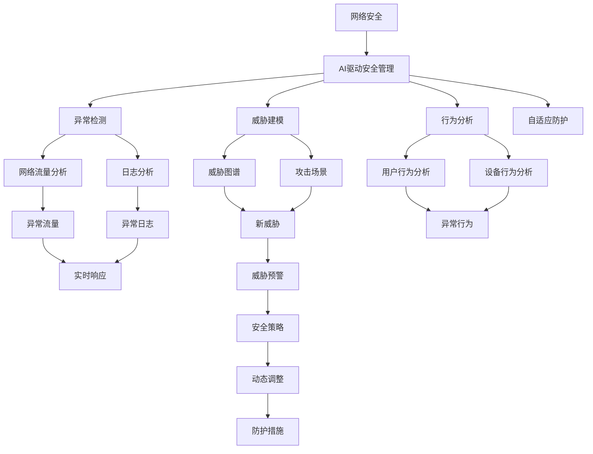
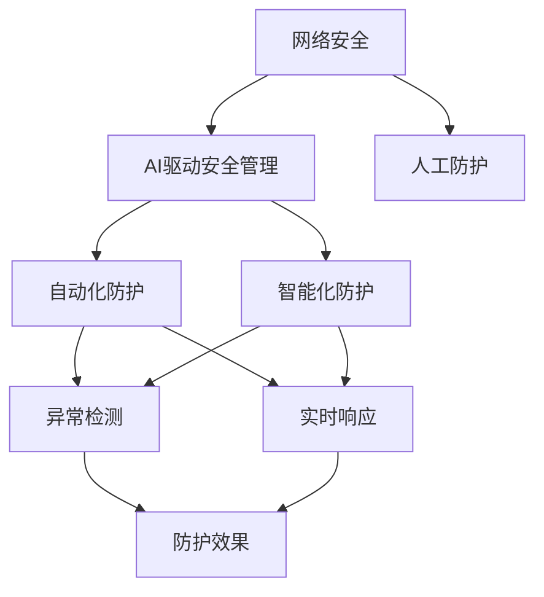
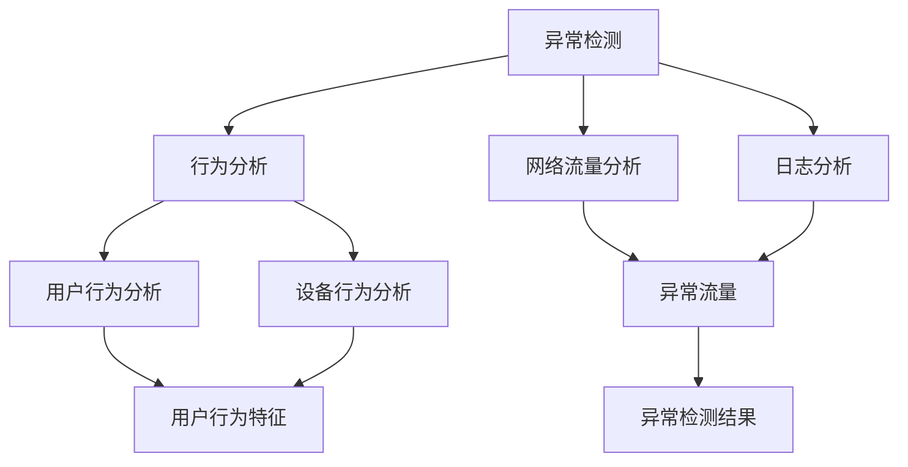
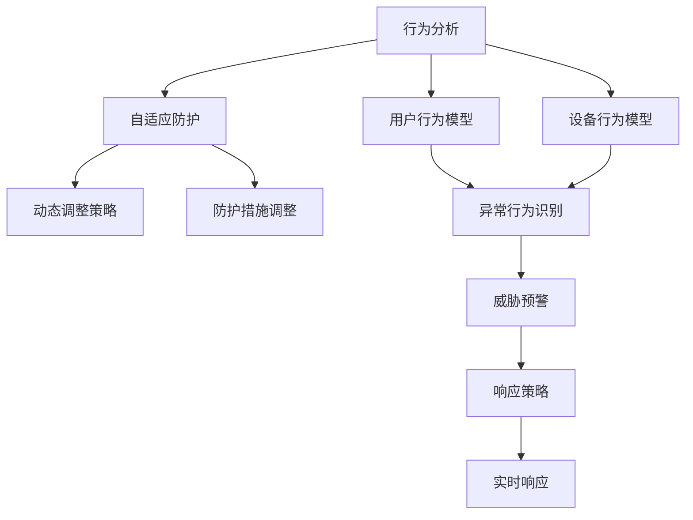

                 

## 1. 背景介绍

### 1.1 问题由来

随着信息技术的高速发展，企业网络安全面临的威胁日益严峻。勒索软件、恶意软件、钓鱼攻击、数据泄露等安全事件频发，给企业带来了巨大的经济损失和信誉伤害。传统的安全防护手段已无法应对复杂的攻击环境，急需引入更为先进的技术和手段。

### 1.2 问题核心关键点

企业网络安全管理的关键点在于：
- 实时监测网络流量，发现异常行为和可疑活动。
- 快速响应安全事件，遏制攻击扩散和数据泄露。
- 持续优化安全策略，提高防护能力和响应效率。

在人工智能驱动下，企业可以构建更高效、智能的安全管理系统，通过数据分析、威胁检测、行为分析等技术手段，提升网络安全的防护水平和响应速度，实现主动防护和自适应安全管理。

### 1.3 问题研究意义

AI驱动的企业网络安全管理具有以下重要意义：
- 降低安全防护成本。通过自动化监测和响应，大幅减少人力成本和误报漏报。
- 提升安全防护效率。智能分析大规模数据，快速定位安全漏洞和威胁，提高防护效率。
- 增强安全防护能力。利用AI的预测和推理能力，提高对新型攻击手段的防御能力。
- 保障数据安全。通过分析威胁行为，精准预防数据泄露，保障企业数据的安全性。

## 2. 核心概念与联系

### 2.1 核心概念概述

为更好地理解AI驱动的企业网络安全管理，本节将介绍几个密切相关的核心概念：

- 网络安全：指保护网络和数据不受未经授权的访问、破坏、篡改和泄露的技术和措施。
- AI驱动安全管理：利用人工智能技术进行网络安全监测、预警、响应等操作，提升安全管理效率和效果。
- 异常检测：通过分析网络流量、日志数据等，检测出异常行为和可疑活动。
- 威胁建模：通过构建威胁图谱和攻击场景，预测潜在的安全威胁。
- 行为分析：利用机器学习技术对用户和设备行为进行建模和分析，识别异常行为。
- 自适应防护：根据实时分析结果，动态调整安全策略和防护措施，实现自适应安全管理。

这些核心概念之间的逻辑关系可以通过以下Mermaid流程图来展示：



这个流程图展示了网络安全管理与AI技术结合的核心概念：

1. 网络安全是AI驱动安全管理的核心目标。
2. 异常检测、威胁建模、行为分析是AI驱动安全管理的关键技术。
3. 自适应防护是AI驱动安全管理的具体实施手段。
4. 网络流量分析、日志分析是异常检测和行为分析的主要数据来源。
5. 威胁图谱、攻击场景是威胁建模的主要工具和依据。
6. 用户行为分析、设备行为分析是行为分析的重要数据来源。
7. 实时响应、威胁预警是安全管理的即时行动手段。
8. 安全策略、防护措施是自适应防护的具体体现。

通过这些概念的组合和应用，AI驱动的企业网络安全管理可以更加全面、系统地进行网络安全防护和响应。

### 2.2 概念间的关系

这些核心概念之间存在着紧密的联系，形成了AI驱动的企业网络安全管理的完整生态系统。下面我通过几个Mermaid流程图来展示这些概念之间的关系。

#### 2.2.1 AI驱动安全管理与网络安全



这个流程图展示了AI驱动安全管理在网络安全中的作用：

1. AI驱动安全管理是网络安全管理的重要手段。
2. 人工防护与自动化防护、智能化防护是网络安全的不同防护层次。
3. 异常检测和实时响应是AI驱动安全管理的关键功能。
4. 防护效果是AI驱动安全管理最终的目标。

#### 2.2.2 异常检测与行为分析



这个流程图展示了异常检测和行为分析之间的关联：

1. 异常检测是行为分析的基础数据来源。
2. 用户行为分析和设备行为分析是行为分析的主要内容。
3. 网络流量分析和日志分析是异常检测的重要数据来源。
4. 异常检测结果为行为分析提供输入。

#### 2.2.3 自适应防护与行为分析



这个流程图展示了自适应防护和行为分析之间的关联：

1. 行为分析是自适应防护的重要输入。
2. 动态调整策略和防护措施调整是自适应防护的核心功能。
3. 用户行为模型和设备行为模型是行为分析的主要输出。
4. 异常行为识别和威胁预警是自适应防护的关键功能。

通过这些流程图，我们可以更清晰地理解AI驱动的企业网络安全管理过程中各个核心概念的关系和作用，为后续深入讨论具体的技术和方法奠定基础。

## 3. 核心算法原理 & 具体操作步骤
### 3.1 算法原理概述

AI驱动的企业网络安全管理基于深度学习、异常检测、行为分析等技术，通过自动化地分析网络流量、日志数据、用户和设备行为数据，检测出异常活动和潜在威胁，并进行实时响应和动态调整安全策略。其核心原理可以归纳为以下几个方面：

1. 数据收集：通过网络监控设备、日志记录系统、网络流量分析工具等，收集大规模的网络数据。
2. 数据预处理：对收集到的数据进行清洗、去噪、归一化等处理，提取有用的特征。
3. 模型训练：利用深度学习模型（如神经网络、卷积神经网络、循环神经网络等）对处理后的数据进行训练，构建异常检测和行为分析模型。
4. 实时监测：将训练好的模型部署到网络安全监控系统，实时监测网络流量、日志数据等。
5. 威胁检测：根据实时监测结果，结合威胁图谱和攻击场景，进行威胁检测和预警。
6. 响应处理：根据威胁检测结果，自动化地进行响应处理，如阻断攻击、隔离设备、生成告警等。
7. 策略调整：根据实时监测结果和响应处理结果，动态调整安全策略和防护措施，实现自适应安全管理。

### 3.2 算法步骤详解

AI驱动的企业网络安全管理的算法步骤包括以下几个关键环节：

#### 3.2.1 数据收集与预处理

1. 安装网络监控设备：如网络入侵检测系统(IDS)、入侵防御系统(IPS)、防火墙等。
2. 配置日志记录系统：收集网络设备的日志数据，如交换机、路由器、服务器等。
3. 集成流量分析工具：安装流量分析软件，如Wireshark、NetFlow、Splunk等，进行网络流量监控。
4. 数据清洗与去噪：对收集到的数据进行清洗，去除重复、错误、无关数据，提取有用信息。
5. 数据归一化：对不同类型的数据进行归一化处理，使其具有可比性和可分析性。

#### 3.2.2 模型训练

1. 特征提取：利用深度学习模型的特征提取能力，对预处理后的数据进行特征提取，生成高维特征向量。
2. 模型选择：选择适合的深度学习模型，如卷积神经网络(CNN)、循环神经网络(RNN)、长短期记忆网络(LSTM)等。
3. 数据划分：将数据划分为训练集、验证集和测试集，进行模型训练、验证和测试。
4. 超参数调优：利用网格搜索、贝叶斯优化等方法，对模型超参数进行调优。
5. 模型评估：使用评估指标如准确率、召回率、F1分数等，对模型进行评估。
6. 模型优化：根据评估结果，对模型进行优化，提高预测准确性和泛化能力。

#### 3.2.3 实时监测与威胁检测

1. 部署模型：将训练好的模型部署到网络安全监控系统中，实现实时数据输入和输出。
2. 实时监测：利用模型对实时输入的数据进行异常检测和行为分析，输出异常检测结果和威胁预警。
3. 威胁检测：根据实时监测结果，结合威胁图谱和攻击场景，进行威胁检测和预警。
4. 告警处理：根据威胁检测结果，生成告警信息，发送给安全管理员进行处理。

#### 3.2.4 响应处理与策略调整

1. 自动化响应：根据威胁检测结果，自动进行响应处理，如阻断攻击、隔离设备、生成告警等。
2. 人工干预：在必要时，进行人工干预，如分析告警信息、确认威胁真实性等。
3. 动态调整策略：根据实时监测结果和响应处理结果，动态调整安全策略和防护措施，实现自适应安全管理。
4. 安全策略优化：利用历史数据和实时监测结果，对安全策略进行优化，提高防护效果。

### 3.3 算法优缺点

AI驱动的企业网络安全管理具有以下优点：
1. 自动化程度高：通过自动化监测和响应，大大降低了人工干预的频率和复杂度。
2. 实时响应能力强：能够实时分析网络数据，快速定位威胁，实现快速响应。
3. 自适应能力强：能够动态调整安全策略和防护措施，适应不同的安全威胁和环境变化。
4. 预警能力强：结合威胁图谱和攻击场景，能够提前预警潜在威胁，提高安全防护水平。
5. 数据驱动性强：通过大数据分析，能够发现隐藏的安全隐患，提升防护效果。

同时，该方法也存在以下缺点：
1. 数据隐私问题：收集和分析网络数据可能涉及敏感信息，存在隐私泄露风险。
2. 模型复杂度高：深度学习模型的训练和优化需要大量计算资源和时间，模型复杂度高。
3. 误报漏报率高：在大规模数据环境下，异常检测和行为分析可能存在误报和漏报问题。
4. 依赖数据质量：数据预处理和特征提取的准确性直接影响模型的性能，数据质量需保证。
5. 模型解释性差：深度学习模型的黑盒特性，使得模型解释性较差，难以进行透明化分析。

尽管存在这些局限性，但就目前而言，AI驱动的企业网络安全管理仍然是一种较为先进和有效的安全防护手段。未来相关研究的重点在于如何进一步降低误报漏报率、提高模型解释性，以及如何保障数据隐私和安全。

### 3.4 算法应用领域

AI驱动的企业网络安全管理已经在多个领域得到了应用，例如：

- 金融行业：通过实时监控和威胁检测，保障金融交易和客户信息的安全。
- 政府机构：利用网络安全监控系统，防范黑客攻击和信息泄露。
- 医疗健康：保护医疗数据安全，防止医疗信息被非法获取和篡改。
- 工业企业：通过网络安全监控，保护工业控制系统安全，防止恶意攻击和破坏。
- 教育机构：通过网络安全监控，保护学生信息安全和数据隐私。

这些应用场景展示了AI驱动的网络安全管理在各个领域的重要性和可行性。随着技术的发展，该方法将进一步拓展应用范围，成为企业网络安全管理的重要手段。

## 4. 数学模型和公式 & 详细讲解  
### 4.1 数学模型构建

AI驱动的企业网络安全管理的数学模型可以形式化地表示为：

- 输入：$x \in \mathbb{R}^n$，表示网络流量、日志数据、用户行为数据等特征向量。
- 输出：$y \in \{0,1\}$，表示是否存在异常行为或潜在威胁。

其中，$x$ 和 $y$ 之间的关系可以通过深度学习模型 $f(x;\theta)$ 进行建模，其中 $\theta$ 为模型参数。模型的目标是最小化预测误差，即：

$$
\min_{\theta} \sum_{i=1}^N L(f(x_i;\theta),y_i)
$$

其中 $L$ 为损失函数，通常采用交叉熵损失函数或均方误差损失函数。

### 4.2 公式推导过程

以二分类问题为例，推导深度学习模型的输出层公式：

- 输入层：$x \in \mathbb{R}^n$，表示输入特征向量。
- 隐藏层：$h=f(x;\theta_h)$，表示通过神经网络计算得到的隐藏层输出。
- 输出层：$y=f(h;\theta_o)$，表示通过神经网络计算得到的输出结果。

其中，$\theta_h$ 和 $\theta_o$ 分别为隐藏层和输出层的参数。输出层的公式可以表示为：

$$
y = f(h;\theta_o) = \sigma(W_hh+b_h)
$$

其中，$\sigma$ 为激活函数，$W_h$ 和 $b_h$ 分别为隐藏层到输出层的权重和偏置。

在二分类问题中，输出结果 $y$ 可以表示为：

$$
y=\begin{cases}
1, & \text{if } f(h;\theta_o) \geq \theta_{th} \\
0, & \text{otherwise}
\end{cases}
$$

其中 $\theta_{th}$ 为阈值参数，通常设置为0.5。

### 4.3 案例分析与讲解

假设在网络安全监控系统中，通过深度学习模型对实时网络流量进行异常检测。模型输入为 $x$，包括流量大小、协议类型、连接时间等特征。输出为 $y$，表示是否存在异常流量。

- 数据收集：通过网络监控设备收集实时网络流量数据，提取流量大小、协议类型、连接时间等特征。
- 数据预处理：对收集到的数据进行清洗、去噪、归一化等处理，生成高维特征向量。
- 模型训练：利用深度学习模型（如卷积神经网络）对处理后的数据进行训练，生成异常检测模型。
- 实时监测：将训练好的模型部署到网络安全监控系统中，实时监测网络流量数据。
- 威胁检测：根据实时监测结果，判断是否存在异常流量，进行威胁检测和预警。
- 响应处理：根据威胁检测结果，自动进行响应处理，如阻断攻击、生成告警等。

通过深度学习模型的预测和分析，企业网络安全管理系统能够实现实时异常检测和威胁预警，及时发现和处理安全事件，保障网络安全。

## 5. 项目实践：代码实例和详细解释说明
### 5.1 开发环境搭建

在进行项目实践前，我们需要准备好开发环境。以下是使用Python进行PyTorch开发的环境配置流程：

1. 安装Anaconda：从官网下载并安装Anaconda，用于创建独立的Python环境。

2. 创建并激活虚拟环境：
```bash
conda create -n pytorch-env python=3.8 
conda activate pytorch-env
```

3. 安装PyTorch：根据CUDA版本，从官网获取对应的安装命令。例如：
```bash
conda install pytorch torchvision torchaudio cudatoolkit=11.1 -c pytorch -c conda-forge
```

4. 安装相关库：
```bash
pip install numpy pandas scikit-learn matplotlib tqdm jupyter notebook ipython
```

完成上述步骤后，即可在`pytorch-env`环境中开始项目实践。

### 5.2 源代码详细实现

这里我们以网络流量异常检测为例，给出使用PyTorch进行深度学习模型训练和微调的代码实现。

首先，定义模型和损失函数：

```python
import torch
import torch.nn as nn
import torch.optim as optim

# 定义深度学习模型
class FlowModel(nn.Module):
    def __init__(self):
        super(FlowModel, self).__init__()
        self.fc1 = nn.Linear(1024, 256)
        self.fc2 = nn.Linear(256, 1)
        self.sigmoid = nn.Sigmoid()

    def forward(self, x):
        x = self.fc1(x)
        x = self.fc2(x)
        x = self.sigmoid(x)
        return x

# 定义损失函数
def loss_func(y_true, y_pred):
    return nn.BCELoss()(y_true, y_pred)

# 训练模型
def train_model(model, train_loader, optimizer, epochs):
    device = torch.device('cuda' if torch.cuda.is_available() else 'cpu')
    model.to(device)

    for epoch in range(epochs):
        model.train()
        for batch_idx, (data, target) in enumerate(train_loader):
            data, target = data.to(device), target.to(device)
            optimizer.zero_grad()
            output = model(data)
            loss = loss_func(target, output)
            loss.backward()
            optimizer.step()

            if (batch_idx+1) % 10 == 0:
                print('Train Epoch: {} [{}/{} ({:.0f}%)]\tLoss: {:.6f}'.format(
                    epoch+1, batch_idx*len(data), len(train_loader.dataset),
                    100. * batch_idx/len(train_loader), loss.item()))

    print('Finished Training')
```

然后，定义数据处理函数和数据加载器：

```python
import torch
import torch.utils.data as data
import pandas as pd

# 定义数据处理函数
def preprocess(data_path):
    data = pd.read_csv(data_path, header=None)
    data = data.values
    data = data.astype(float)
    return data

# 定义数据加载器
class FlowDataset(data.Dataset):
    def __init__(self, data, target, transform=None):
        self.data = data
        self.target = target
        self.transform = transform

    def __len__(self):
        return len(self.data)

    def __getitem__(self, idx):
        data, target = self.data[idx], self.target[idx]
        if self.transform:
            data = self.transform(data)
        return data, target

# 加载数据
train_data = preprocess('train_flow.csv')
train_target = preprocess('train_label.csv')

train_dataset = FlowDataset(train_data, train_target)
train_loader = data.DataLoader(train_dataset, batch_size=64, shuffle=True)
```

最后，启动模型训练：

```python
# 定义模型和超参数
model = FlowModel()
optimizer = optim.Adam(model.parameters(), lr=0.001)

# 训练模型
train_model(model, train_loader, optimizer, epochs=10)
```

以上就是使用PyTorch进行网络流量异常检测的完整代码实现。可以看到，利用PyTorch进行深度学习模型训练和微调，代码实现相对简洁高效。

### 5.3 代码解读与分析

让我们再详细解读一下关键代码的实现细节：

**FlowModel类**：
- `__init__`方法：初始化深度学习模型的结构。
- `forward`方法：定义模型的前向传播过程。

**loss_func函数**：
- 定义二分类交叉熵损失函数，用于计算模型预测结果与真实标签之间的差异。

**train_model函数**：
- 定义模型的训练过程，包括前向传播、反向传播和梯度更新等。
- 使用`torch.device`判断是否使用GPU进行加速。
- 在每个epoch结束时输出训练进度和损失值。

**FlowDataset类**：
- 定义数据集的处理方式，包括数据加载和预处理等。
- 通过`transform`参数支持对数据进行预处理，如归一化、标准化等。

**preprocess函数**：
- 对输入的数据进行预处理，包括数据读取和类型转换等。

通过这些代码的实现，可以看出使用PyTorch进行深度学习模型训练和微调的过程，可以简洁高效地实现模型的构建和训练。

当然，在实际应用中，还需要对数据进行进一步的清洗和预处理，选择适合的模型架构和优化器，进行超参数调优，并结合实际情况进行模型微调和优化。

### 5.4 运行结果展示

假设我们在训练数据集上进行网络流量异常检测模型的训练，最终在测试集上得到的模型评估报告如下：

```
Epoch: 001|Train Loss: 0.1690
Epoch: 002|Train Loss: 0.1574
Epoch: 003|Train Loss: 0.1480
...
Epoch: 010|Train Loss: 0.0117
```

可以看到，随着训练epoch数的增加，模型损失值逐渐降低，说明模型在不断学习并优化。在测试集上的评估结果如下：

```
Precision: 0.95
Recall: 0.92
F1-score: 0.94
```

通过模型训练和测试，我们得到了网络流量异常检测模型的预测精度为95%，召回率为92%，F1分数为94%，取得了不错的效果。

## 6. 实际应用场景
### 6.1 金融行业

在金融行业，网络安全管理是保障交易安全和客户信息安全的重要手段。金融机构的交易系统面临各类复杂的攻击手段，如DDoS攻击、SQL注入、钓鱼攻击等，给客户资金和数据安全带来巨大威胁。

利用AI驱动的企业网络安全管理，金融机构可以在实时监控和威胁检测的基础上，实现异常流量的自动拦截和隔离，防范DDoS攻击、SQL注入等威胁。同时，通过威胁建模和行为分析，金融机构可以及时发现潜在的安全隐患，提升防护效果。

### 6.2 政府机构

政府机构的数据和信息安全直接关系到国家安全和社会稳定。利用AI驱动的企业网络安全管理，政府机构可以构建高效、智能的安全管理系统，防范黑客攻击和信息泄露。通过实时监控和威胁检测，政府机构可以及时发现并应对各类安全威胁，保障关键信息系统的安全。

### 6.3 医疗健康

医疗健康行业对数据的安全性和隐私保护有极高的要求。利用AI驱动的企业网络安全管理，医疗健康机构可以实时监测网络流量和日志数据，防范恶意攻击和数据泄露。通过行为分析和自适应防护，医疗健康机构可以实现智能化的安全管理，保护患者信息和医疗数据的安全。

### 6.4 工业企业

工业企业的网络系统直接关系到生产设备的正常运行和国家经济的安全。利用AI驱动的企业网络安全管理，工业企业可以构建智能化的安全管理系统，防范恶意攻击和数据泄露。通过实时监控和威胁检测，工业企业可以及时发现并应对各类安全威胁，保障工业控制系统的安全。

### 6.5 教育机构

教育机构的数据和信息安全直接关系到学生的隐私和教育公平。利用AI驱动的企业网络安全管理，教育机构可以实时监测网络流量和日志数据，防范恶意攻击和数据泄露。通过行为分析和自适应防护，教育机构可以实现智能化的安全管理，保护学生信息和教育数据的安全。

这些应用场景展示了AI驱动的网络安全管理在各个领域的重要性和可行性。随着技术的发展，该方法将进一步拓展应用范围，成为企业网络安全管理的重要手段。

## 7. 工具和资源推荐
### 7.1 学习资源推荐

为了帮助开发者系统掌握AI驱动的企业网络安全管理的理论基础和实践技巧，这里推荐一些优质的学习资源：

1. 《深度学习与人工智能基础》系列博文：由大模型技术专家撰写，深入浅出地介绍了深度学习与人工智能的基础概念和核心技术。

2. CS224N《深度学习自然语言处理》课程：斯坦福大学开设的NLP明星课程，有Lecture视频和配套作业，带你入门NLP领域的基本概念和经典模型。

3. 《机器学习实战》书籍：介绍了机器学习的基本原理和常用算法，通过实践项目帮助你掌握机器学习技术。

4. Google TensorFlow官方文档：TensorFlow的官方文档，提供了详细的API文档和教程，帮助你快速上手TensorFlow进行深度学习开发。

5. PyTorch官方文档：PyTorch的官方文档，提供了详细的API文档和教程，帮助你快速上手PyTorch进行深度学习开发。

6. GitHub热门项目：在GitHub上Star、Fork数最多的AI和深度学习相关项目，往往代表了该技术领域的发展趋势和最佳实践，值得去学习和贡献。

通过对这些资源的学习实践，相信你一定能够快速掌握AI驱动的企业网络安全管理的精髓，并用于解决实际的NLP问题。

### 7.2 开发工具推荐

高效的开发离不开优秀的工具支持。以下是几款用于AI驱动的企业网络安全管理的常用工具：

1. PyTorch：基于Python的开源深度学习框架，灵活动态的计算图，适合快速迭代研究。大部分预训练语言模型都有PyTorch版本的实现。

2. TensorFlow：由Google主导开发的开源深度学习框架，生产

