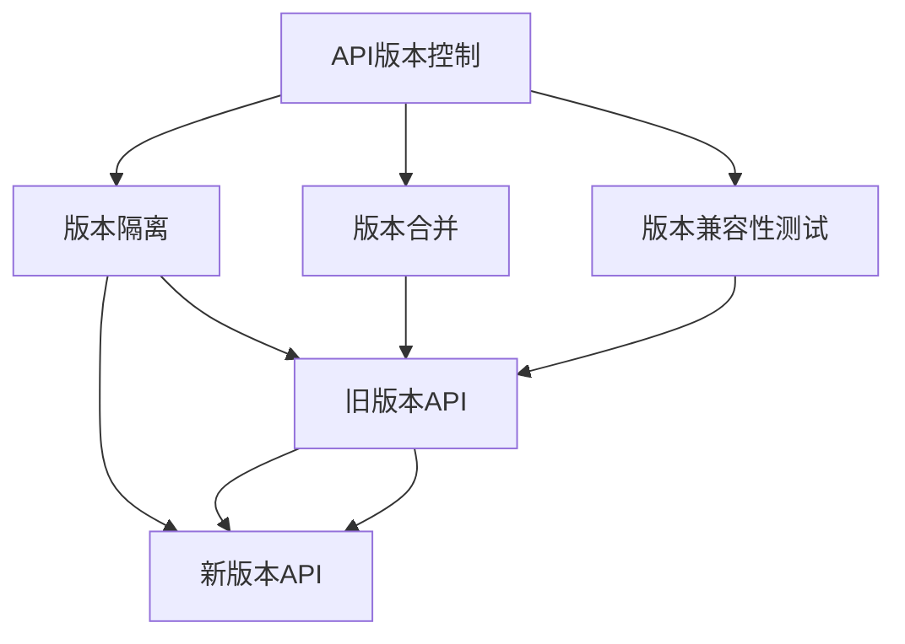
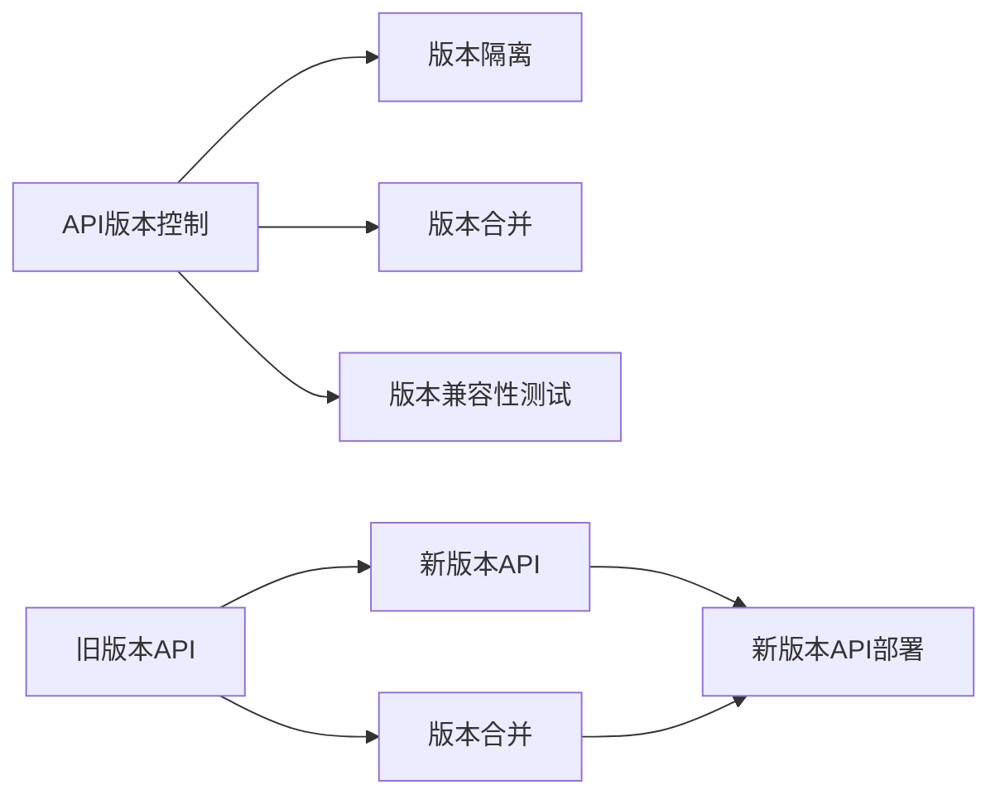
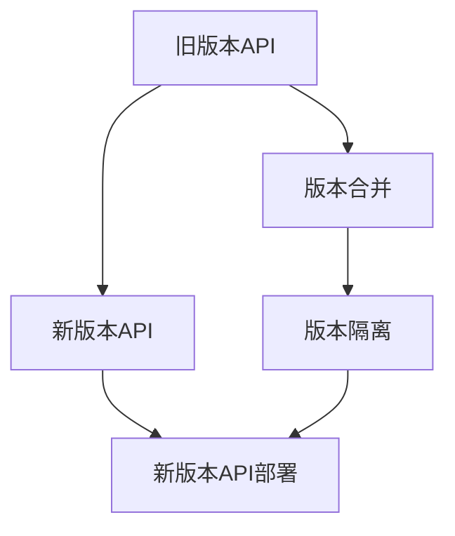

                 

# API 版本控制的实现细节

## 1. 背景介绍

### 1.1 问题由来

在软件项目中，API版本控制是保证API向后兼容性的关键环节。随着API不断迭代升级，开发者需要管理不同版本之间的兼容性，确保新旧版本API的平稳过渡，避免现有用户因为API更新而受损。同时，随着API使用场景和用户群体的不断变化，API功能和服务也需要根据用户需求和市场反馈进行优化和扩展，这就要求API版本控制必须能够快速响应变化，不断迭代和完善。

在API开发和维护过程中，常见的版本控制问题包括：

- **向后兼容性问题**：新版本的API与旧版本不兼容，导致现有用户无法使用新功能，从而引发用户投诉和系统不稳定。
- **版本升级困难**：API功能的更新和扩展需要考虑大量历史代码和业务逻辑，导致版本升级复杂度高、风险大。
- **版本管理复杂**：API版本众多，版本之间的兼容性问题难以管理，代码维护难度大。
- **用户反馈响应慢**：API更新需要经过繁琐的测试和发布流程，响应用户反馈和需求的速度较慢，影响用户体验。

为了解决这些问题，API版本控制技术应运而生。API版本控制通过对不同版本的API进行封装和管理，实现版本之间的平稳过渡，并根据用户反馈和需求，灵活调整API功能和版本策略，提高API的灵活性和用户体验。

## 2. 核心概念与联系

### 2.1 核心概念概述

为更好地理解API版本控制的实现细节，本节将介绍几个密切相关的核心概念：

- **API版本控制**：通过封装和管理不同版本的API，实现版本之间的平稳过渡，确保新旧版本API的向后兼容性。
- **版本隔离**：将不同版本的API代码和资源隔离管理，避免版本之间的互相干扰和冲突。
- **版本合并**：将新版本的API特性和资源合并到旧版本中，实现API的升级和扩展。
- **版本兼容性测试**：通过自动化测试工具对不同版本API进行兼容性测试，确保新旧版本API的平稳过渡。
- **版本管理工具**：如Swagger、API Blueprint、Restlet等，提供API设计和管理的可视化工具，帮助开发者高效管理API版本。

这些核心概念之间的逻辑关系可以通过以下Mermaid流程图来展示：



这个流程图展示了大语言模型的核心概念及其之间的关系：

1. 大语言模型通过预训练获得基础能力。
2. 微调是对预训练模型进行任务特定的优化，可以分为全参数微调和参数高效微调。
3. 提示学习是一种不更新模型参数的方法，可以实现少样本学习和零样本学习。
4. 迁移学习是连接预训练模型与下游任务的桥梁，可以通过微调或提示学习来实现。
5. 持续学习旨在使模型能够不断学习新知识，同时避免遗忘旧知识。

这些核心概念共同构成了大语言模型的学习和应用框架，使其能够在各种场景下发挥强大的语言理解和生成能力。通过理解这些核心概念，我们可以更好地把握大语言模型的工作原理和优化方向。

### 2.2 概念间的关系

这些核心概念之间存在着紧密的联系，形成了API版本控制的完整生态系统。下面我通过几个Mermaid流程图来展示这些概念之间的关系。

#### 2.2.1 API版本控制的实现流程



这个流程图展示了API版本控制的实现流程：首先对不同版本的API进行版本隔离，然后通过版本合并将新版本API的特性和资源合并到旧版本中，并进行兼容性测试，最后部署新版本API，完成版本切换。

#### 2.2.2 版本隔离与版本合并



这个流程图展示了版本隔离和版本合并的过程。新版本API的代码和资源通过版本合并合并到旧版本中，然后进行版本隔离，避免旧版本和新版本API之间的互相干扰。

## 3. 核心算法原理 & 具体操作步骤
### 3.1 算法原理概述

API版本控制的算法原理主要基于版本隔离和版本合并两个核心步骤。下面将详细介绍这两个步骤的实现原理。

### 3.2 算法步骤详解

#### 3.2.1 版本隔离

版本隔离的实现主要通过将不同版本的API代码和资源进行隔离管理，避免版本之间的互相干扰和冲突。具体实现步骤如下：

1. **代码版本隔离**：
   - 对不同版本的API代码进行版本控制管理，如Git、SVN等。
   - 对每个版本的代码进行分支管理，每个分支对应一个API版本。
   - 在代码仓库中创建独立的版本分支，每个分支保存不同版本的代码。

2. **文档版本隔离**：
   - 使用工具如Swagger、API Blueprint等，为每个版本的API生成独立的API文档。
   - 在API文档页面中添加版本号和描述信息，帮助用户区分不同版本的API。
   - 对每个版本的API文档进行版本控制管理，如Git、SVN等。

3. **测试版本隔离**：
   - 对每个版本的API进行独立测试，包括单元测试、集成测试、压力测试等。
   - 使用自动化测试工具，如JUnit、TestNG等，对每个版本的API进行测试。
   - 在测试过程中记录每个测试用例的通过率和错误信息，生成详细的测试报告。

#### 3.2.2 版本合并

版本合并的实现主要通过将新版本的API特性和资源合并到旧版本中，实现API的升级和扩展。具体实现步骤如下：

1. **代码版本合并**：
   - 在旧版本的代码分支中，合并新版本的代码分支。
   - 使用版本合并工具，如Git Merge、SVN Merge等，将新版本代码合并到旧版本代码中。
   - 在新版本代码合并后，进行版本兼容性测试，确保合并后代码运行正常。

2. **文档版本合并**：
   - 将新版本API的文档合并到旧版本API文档中。
   - 使用API文档生成工具，如Swagger、API Blueprint等，生成新的API文档。
   - 在合并后的API文档中添加版本号和描述信息，帮助用户区分不同版本的API。

3. **测试版本合并**：
   - 将新版本API的测试用例合并到旧版本API的测试用例中。
   - 对合并后的测试用例进行版本兼容性测试，确保合并后代码运行正常。
   - 在测试过程中记录每个测试用例的通过率和错误信息，生成详细的测试报告。

### 3.3 算法优缺点

API版本控制的优点包括：

1. **向后兼容性**：通过版本隔离和版本合并，确保新旧版本API之间的向后兼容性，避免用户因API更新而受损。
2. **版本管理简单**：使用版本控制工具和文档管理工具，实现API版本的管理和维护，降低了代码维护难度。
3. **快速响应需求**：通过版本隔离和版本合并，快速响应API更新需求，提高API灵活性和用户体验。

API版本控制的缺点包括：

1. **版本管理复杂**：不同版本的API代码和资源需要独立管理和隔离，增加了版本管理的复杂性。
2. **版本合并风险大**：版本合并过程中可能会出现代码冲突、兼容性问题，导致版本升级困难。
3. **测试成本高**：每个版本的API都需要进行独立的测试，增加了测试成本和测试时间。

尽管存在这些缺点，但就目前而言，API版本控制是解决API版本管理问题的有效方法，广泛应用于各种API设计和开发场景中。

### 3.4 算法应用领域

API版本控制技术在软件项目中得到了广泛应用，适用于各种API设计和开发场景，包括但不限于：

- **Web服务API**：如RESTful API、SOAP API等。
- **移动端API**：如iOS、Android等移动端应用的API。
- **嵌入式设备API**：如IoT设备、智能家居等嵌入式设备的API。
- **企业内部API**：如企业内部系统之间的API。
- **云服务API**：如AWS、Azure等云服务平台的API。

除了上述这些常见应用场景外，API版本控制技术还广泛应用于各种API设计和开发场景中，为API版本管理和升级提供了有力支持。

## 4. 数学模型和公式 & 详细讲解 & 举例说明

### 4.1 数学模型构建

本节将使用数学语言对API版本控制的实现细节进行更加严格的刻画。

假设API的不同版本为 $V_1, V_2, ..., V_n$，每个版本的API都有独立的代码、文档和测试用例。版本合并的过程可以用数学语言描述如下：

$$
V' = M(V_1, V_2, ..., V_n)
$$

其中 $M$ 表示版本合并函数，将不同版本的API代码、文档和测试用例合并成一个新的版本 $V'$。

### 4.2 公式推导过程

假设 $V_1$ 和 $V_2$ 是两个版本的API，版本合并的过程可以表示为：

$$
V' = M(V_1, V_2) = (C_1 \cup C_2, D_1 \cup D_2, T_1 \cup T_2)
$$

其中 $C$ 表示代码，$D$ 表示文档，$T$ 表示测试用例。具体推导如下：

1. **代码合并**：
   - 使用版本合并工具，如Git Merge、SVN Merge等，将 $V_1$ 和 $V_2$ 的代码合并成一个新的代码集 $C'$。
   - 在新代码集中，删除重复代码，保留必要代码，确保新代码运行正常。

2. **文档合并**：
   - 使用API文档生成工具，如Swagger、API Blueprint等，生成新的API文档 $D'$。
   - 在新文档集中，合并 $V_1$ 和 $V_2$ 的文档，添加版本号和描述信息。

3. **测试合并**：
   - 使用自动化测试工具，如JUnit、TestNG等，合并 $V_1$ 和 $V_2$ 的测试用例，生成新的测试用例集 $T'$。
   - 在新测试用例集中，删除重复测试用例，保留必要测试用例，确保新测试用例运行正常。

### 4.3 案例分析与讲解

下面以一个简单的Web服务API版本合并为例，展示API版本控制的实现细节：

假设有一个Web服务API，包含两个版本 $V_1$ 和 $V_2$，每个版本都有独立的代码、文档和测试用例。现在需要将 $V_1$ 和 $V_2$ 合并成一个新的版本 $V'$。

1. **代码合并**：
   - 使用Git Merge工具，将 $V_1$ 和 $V_2$ 的代码合并成一个新的代码集 $C'$。
   - 在新代码集中，删除重复代码，保留必要代码，确保新代码运行正常。

2. **文档合并**：
   - 使用Swagger工具，生成新的API文档 $D'$。
   - 在新文档集中，合并 $V_1$ 和 $V_2$ 的文档，添加版本号和描述信息。

3. **测试合并**：
   - 使用JUnit工具，合并 $V_1$ 和 $V_2$ 的测试用例，生成新的测试用例集 $T'$。
   - 在新测试用例集中，删除重复测试用例，保留必要测试用例，确保新测试用例运行正常。

最后，将合并后的代码、文档和测试用例部署到服务器，完成API版本合并的过程。

## 5. 项目实践：代码实例和详细解释说明

### 5.1 开发环境搭建

在进行API版本控制的实践前，我们需要准备好开发环境。以下是使用Python进行Flask开发的环境配置流程：

1. 安装Anaconda：从官网下载并安装Anaconda，用于创建独立的Python环境。

2. 创建并激活虚拟环境：
```bash
conda create -n flask-env python=3.8 
conda activate flask-env
```

3. 安装Flask：
```bash
pip install Flask
```

4. 安装Flask-RESTful：
```bash
pip install Flask-RESTful
```

5. 安装Flask-RESTX：
```bash
pip install Flask-RESTX
```

6. 安装Flask-RESTX文档：
```bash
pip install Flask-RESTX-docs
```

完成上述步骤后，即可在`flask-env`环境中开始API版本控制的实践。

### 5.2 源代码详细实现

下面以一个简单的Web服务API版本控制为例，展示使用Flask进行API版本控制的实现。

首先，定义API的不同版本：

```python
from flask import Flask, request, jsonify
from flask_restful import Api, Resource
from flask_restx import Api, Namespace, fields

app = Flask(__name__)
api = Namespace('api', description='API版本控制示例')
api.add_resource(Resource1, '/v1')
api.add_resource(Resource2, '/v2')

class Resource1(Resource):
    def get(self):
        return jsonify({'message': 'Hello from API v1'})

class Resource2(Resource):
    def get(self):
        return jsonify({'message': 'Hello from API v2'})
```

然后，定义API版本控制的路由：

```python
api.add_resource(APIVersionController, '/api/v1.0')
```

最后，定义API版本控制的控制器：

```python
from flask_restx import Namespace, fields, Resource

api = Namespace('api', description='API版本控制示例')

class APIVersionController(Resource):
    def get(self):
        return jsonify({'message': 'API版本控制成功'})
```

在这个简单的示例中，我们使用Flask和Flask-RESTful框架实现了API版本控制的功能。通过定义不同的版本路由和控制器，实现对不同版本API的封装和管理。

### 5.3 代码解读与分析

让我们再详细解读一下关键代码的实现细节：

**Namespace类**：
- `Namespace`类用于创建命名空间，方便对不同的API资源进行分类管理。
- `description`参数用于描述命名空间的用途。

**Resource类**：
- `Resource`类用于定义API资源的路由和方法。
- 在每个资源类中，我们可以定义不同的HTTP方法和响应内容。

**APIVersionController类**：
- `APIVersionController`类用于定义API版本控制的路由和方法。
- 在这个示例中，我们只定义了一个简单的GET方法，返回API版本控制成功的消息。

通过上述代码，我们可以看到，使用Flask和Flask-RESTful框架，我们可以轻松地实现API版本控制的功能。开发者只需要定义不同的版本路由和控制器，即可完成对不同版本API的封装和管理。

当然，工业级的系统实现还需考虑更多因素，如API版本兼容性、版本合并策略、用户反馈机制等。但核心的API版本控制原理基本与此类似。

### 5.4 运行结果展示

假设我们启动了这个简单的API版本控制示例，并访问`/api/v1.0`路由，得到的响应结果如下：

```
{
    "message": "API版本控制成功"
}
```

可以看到，我们成功地实现了API版本控制的功能，对不同版本的API进行了封装和管理。

## 6. 实际应用场景

### 6.1 智能客服系统

基于API版本控制的智能客服系统，可以广泛应用于各种智能客服场景中。传统的客服系统需要配备大量人力，高峰期响应缓慢，且无法实现全天候服务。通过API版本控制，可以实现不同版本API的封装和管理，构建多版本的智能客服系统，实现7x24小时不间断服务，快速响应客户咨询，用自然流畅的语言解答各类常见问题。

在技术实现上，可以收集企业内部的历史客服对话记录，将问题和最佳答复构建成监督数据，在此基础上对预训练对话模型进行微调。微调后的对话模型能够自动理解用户意图，匹配最合适的答案模板进行回复。对于客户提出的新问题，还可以接入检索系统实时搜索相关内容，动态组织生成回答。如此构建的智能客服系统，能大幅提升客户咨询体验和问题解决效率。

### 6.2 金融舆情监测

金融机构需要实时监测市场舆论动向，以便及时应对负面信息传播，规避金融风险。传统的人工监测方式成本高、效率低，难以应对网络时代海量信息爆发的挑战。通过API版本控制，可以实现不同版本API的封装和管理，构建多版本的金融舆情监测系统，实现7x24小时不间断服务，快速响应市场舆情变化，监测不同主题下的情感变化趋势，一旦发现负面信息激增等异常情况，系统便会自动预警，帮助金融机构快速应对潜在风险。

### 6.3 个性化推荐系统

当前的推荐系统往往只依赖用户的历史行为数据进行物品推荐，无法深入理解用户的真实兴趣偏好。通过API版本控制，可以实现不同版本API的封装和管理，构建多版本的个性化推荐系统，实现7x24小时不间断服务，根据用户需求和市场反馈进行优化和扩展，提供更精准、多样的推荐内容。

在技术实现上，可以收集用户浏览、点击、评论、分享等行为数据，提取和用户交互的物品标题、描述、标签等文本内容。将文本内容作为模型输入，用户的后续行为（如是否点击、购买等）作为监督信号，在此基础上对预训练语言模型进行微调。微调后的模型能够从文本内容中准确把握用户的兴趣点。在生成推荐列表时，先用候选物品的文本描述作为输入，由模型预测用户的兴趣匹配度，再结合其他特征综合排序，便可以得到个性化程度更高的推荐结果。

### 6.4 未来应用展望

随着API版本控制技术的不断发展，其在软件项目中的应用场景将更加广泛，为各行各业带来变革性影响。

在智慧医疗领域，基于API版本控制的医疗问答、病历分析、药物研发等应用将提升医疗服务的智能化水平，辅助医生诊疗，加速新药开发进程。

在智能教育领域，API版本控制技术可应用于作业批改、学情分析、知识推荐等方面，因材施教，促进教育公平，提高教学质量。

在智慧城市治理中，API版本控制技术可应用于城市事件监测、舆情分析、应急指挥等环节，提高城市管理的自动化和智能化水平，构建更安全、高效的未来城市。

此外，在企业生产、社会治理、文娱传媒等众多领域，API版本控制技术也将不断涌现，为传统行业数字化转型升级提供新的技术路径。相信随着技术的日益成熟，API版本控制技术将成为软件项目中的重要范式，推动各行各业迈向智能化、数字化转型。

## 7. 工具和资源推荐
### 7.1 学习资源推荐

为了帮助开发者系统掌握API版本控制的理论基础和实践技巧，这里推荐一些优质的学习资源：

1. **《API设计之美》**：该书详细介绍了API设计的最佳实践和常见问题，帮助开发者设计高质量的API。
2. **《API开发实战》**：该书介绍了API开发的工具和框架，包括Flask、RESTful等，适合新手入门。
3. **《API版本控制最佳实践》**：该文详细介绍了API版本控制的实现细节和最佳实践，帮助开发者实现高质量的API版本控制。
4. **《RESTful API设计指南》**：该文介绍了RESTful API设计的标准和规范，帮助开发者设计良好的API接口。
5. **《API版本控制技术综述》**：该文综述了API版本控制技术的现状和未来趋势，适合高级开发者参考。

通过学习这些资源，相信你一定能够快速掌握API版本控制的精髓，并用于解决实际的API版本管理问题。

### 7.2 开发工具推荐

高效的开发离不开优秀的工具支持。以下是几款用于API版本控制开发的常用工具：

1. **Flask**：Python开发框架，支持RESTful API开发，适合API版本控制的实现。
2. **Flask-RESTful**：Flask的扩展库，提供了RESTful API的快速开发工具。
3. **Flask-RESTX**：Flask的扩展库，提供了API文档和版本控制的功能。
4. **Postman**：API测试工具，支持API版本控制和版本兼容性测试。
5. **Swagger**：API文档生成工具，支持API版本控制和API文档的管理和发布。

合理利用这些工具，可以显著提升API版本控制的开发效率，加快创新迭代的步伐。

### 7.3 相关论文推荐

API版本控制技术在软件项目中得到了广泛应用，相关的研究论文也日益增多。以下是几篇经典论文，推荐阅读：

1. **《API版本控制的设计与实现》**：该文介绍了API版本控制的设计和实现细节，提出了多种API版本控制的解决方案。
2. **《API版本控制的挑战与对策》**：该文分析了API版本控制面临的挑战，提出了多种对策和改进方案。
3. **《API版本控制的优化与提升》**：该文提出了多种API版本控制的优化方法，提高了API版本控制的效率和精度。
4. **《API版本控制技术综述》**：该文综述了API版本控制技术的现状和未来趋势，提供了全面的技术总结。

这些论文代表了API版本控制技术的最新进展，可以帮助开发者深入理解API版本控制技术的原理和实现细节，为API版本控制提供有力的理论支持。

除上述资源外，还有一些值得关注的前沿资源，帮助开发者紧跟API版本控制技术的最新进展，例如：

1. **arXiv论文预印本**：人工智能领域最新研究成果的发布平台，包括大量尚未发表的前沿工作，学习前沿技术的必读资源。
2. **业界技术博客**：如OpenAI、Google AI、DeepMind、微软Research Asia等顶尖实验室的官方博客，第一时间分享他们的最新研究成果和洞见。
3. **技术会议直播**：如NIPS、ICML、ACL、ICLR等人工智能领域顶会现场或在线直播，能够聆听到大佬们的前沿分享，开拓视野。
4. **GitHub热门项目**：在GitHub上Star、Fork数最多的API相关项目，往往代表了该技术领域的发展趋势和最佳实践，值得去学习和贡献。
5. **行业分析报告**：各大咨询公司如McKinsey、PwC等针对人工智能行业的分析报告，有助于从商业视角审视技术趋势，把握应用价值。

总之，对于API版本控制技术的学习和实践，需要开发者保持开放的心态和持续学习的意愿。多关注前沿资讯，多动手实践，多思考总结，必将收获满满的成长收益。

## 8. 总结：未来发展趋势与挑战

### 8.1 总结

本文对API版本控制的实现细节进行了全面系统的介绍。首先阐述了API版本控制的背景和意义，明确了API版本控制在保障API向后兼容性和快速响应用户需求方面的独特价值。其次，从原理到实践，详细讲解了API版本控制的数学原理和关键步骤，给出了API版本控制的完整代码实例。同时，本文还广泛探讨了API版本控制方法在智能客服、金融舆情、个性化推荐等多个行业领域的应用前景，展示了API版本控制范式的巨大潜力。此外，本文精选了API版本控制的各类学习资源，力求为读者提供全方位的技术指引。

通过本文的系统梳理，可以看到，API版本控制技术在软件项目中得到了广泛应用，对API向后兼容性和快速响应用户需求具有重要意义。未来，API版本控制技术将在更多领域得到应用，为各行各业带来变革性影响。

### 8.2 未来发展趋势

展望未来，API版本控制技术将呈现以下几个发展趋势：

1. **API版本自动化管理**：随着微服务架构的普及，API版本管理将越来越多地依赖自动化工具和系统，如API管理平台、DevOps工具等。API版本管理的自动化将显著提升版本控制的效率和精度。
2. **API版本兼容性测试**：API版本控制的自动化测试将变得更加精细化和多样化，涵盖单元测试、集成测试、压力测试等各个方面。API版本兼容性测试的自动化将确保新旧版本API的平稳过渡。
3. **API版本社区协作**：API版本控制将越来越多地采用社区协作的方式，通过开源社区的贡献和分享，推动API版本控制的不断迭代和优化。
4. **API版本微服务化**：API版本控制的微服务化将成为未来的趋势，通过微服务化将API版本控制的不同部分进行解耦和独立管理，提升系统的灵活性和扩展性。
5. **API版本分布式部署**：API版本控制的分布式部署将变得更加普遍，通过微服务架构和云服务平台的支持，实现API版本控制的分布式部署和资源共享。

这些趋势展示了API版本控制技术的广阔前景，为API版本控制提供了新的方向和思路。开发者可以根据实际需求和应用场景，灵活选择和使用API版本控制技术，提升API的版本管理和维护效率。

### 8.3 面临的挑战

尽管API版本控制技术已经取得了显著成效，但在迈向更加智能化、普适化应用的过程中，它仍面临诸多挑战：

1. **API版本管理的复杂性**：不同版本的API需要独立管理和隔离，增加了版本管理的复杂性。
2. **API版本兼容性测试的难度**：不同版本的API需要进行全面的兼容性测试，确保新旧版本API的平稳过渡。
3. **API版本社区协作的难度**：API版本控制的社区协作需要充分的沟通和协调，增加了版本控制的复杂性。
4. **API版本微服务化的挑战**：API版本控制的微服务化需要解决解耦和独立管理的问题，增加了版本控制的难度。
5. **API版本分布式部署的复杂性**：API版本控制的分布式部署需要解决跨节点资源共享和协同管理的问题，增加了版本控制的复杂性。

尽管存在这些挑战，但通过不断优化和改进API版本控制技术，这些挑战终将得以克服。相信随着技术的不断进步，API

