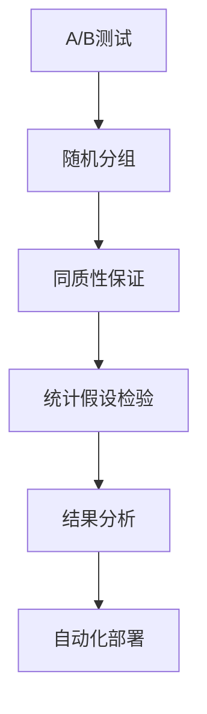
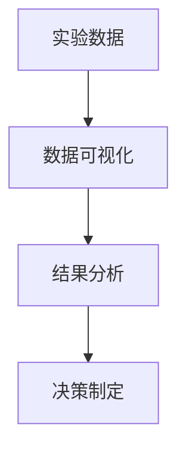

                 

# A/B测试与在线实验原理与代码实战案例讲解

> 关键词：A/B测试, 在线实验, 随机对照试验, 统计假设检验, 特征工程技术, 数据可视化, 自动化部署

## 1. 背景介绍

### 1.1 问题由来

在当今互联网快速发展的时代，网站、APP等数字产品正变得越来越复杂，优化产品性能和用户体验变得至关重要。为了确保产品决策的科学性和准确性，A/B测试和在线实验成为不可或缺的方法。A/B测试是一种随机对照试验，通过比较两个或多个变体的效果，帮助产品团队做出更加精准的决策。在线实验则是A/B测试的具体实现方式，通常通过使用不同的版本（即“版本”）对不同的用户群体进行测试。

A/B测试在实践中广泛应用于各类数字产品，包括电商网站、社交媒体、在线广告等。通过A/B测试，产品团队可以验证假设、优化设计、提升用户满意度，从而获得更好的业务效果。例如，通过A/B测试可以改进网页设计，提升转化率；通过A/B测试可以优化广告投放策略，提高广告点击率；通过A/B测试可以优化产品推荐算法，提升用户粘性等。

### 1.2 问题核心关键点

A/B测试的核心在于通过科学的方法验证假设，确定哪个版本（通常是一个页面或广告）的表现更优。核心关键点包括：

- 随机分组：将用户随机分为对照组和实验组，确保两组用户具有相同的起始特征。
- 同质性保证：在随机分组的基础上，确保两组用户除了变量外的其他特征（如年龄、性别、地域等）尽量一致。
- 统计假设检验：通过统计方法（如t检验、卡方检验）来评估两个版本的效果差异，确定是否具有统计显著性。
- 测试周期与样本量：确保测试周期足够长，样本量足够大，以提高结果的可靠性。
- 结果分析与部署：在测试结束后，分析结果并确定最优版本，部署到整个用户群体。

## 2. 核心概念与联系

### 2.1 核心概念概述

为更好地理解A/B测试和在线实验的原理，本节将介绍几个密切相关的核心概念：

- A/B测试（A/B Testing）：通过比较两个或多个变体（通常是一个页面或广告）的表现，来确定哪个版本更优的实验方法。
- 随机对照试验（Randomized Controlled Trial, RCT）：一种科学实验方法，通过随机分组来控制实验条件，确保结果的科学性和可靠性。
- 统计假设检验（Statistical Hypothesis Testing）：通过统计方法检验两个版本的效果差异，确定是否具有统计显著性。
- 特征工程（Feature Engineering）：从原始数据中提取有意义的特征，提高模型的预测能力。
- 数据可视化（Data Visualization）：通过图表、仪表盘等形式呈现数据，帮助理解和解释结果。
- 自动化部署（Automated Deployment）：使用自动化工具将测试结果部署到生产环境，保证平稳过渡和一致性。

这些核心概念之间的逻辑关系可以通过以下Mermaid流程图来展示：



这个流程图展示了几大核心概念在大语言模型微调过程中的整体架构：

1. A/B测试是实验的核心方法，通过比较不同版本的实际效果来做出决策。
2. 随机分组和同质性保证是实验设计的关键，确保两组用户具有相同的特征分布。
3. 统计假设检验是验证结果科学性的关键，通过科学的方法确定效果差异的统计显著性。
4. 结果分析是实验结果的呈现方式，通过数据可视化工具帮助理解和解释结果。
5. 自动化部署是实验结果的应用方式，将最优版本快速部署到整个用户群体。

### 2.2 概念间的关系

这些核心概念之间存在着紧密的联系，形成了A/B测试和在线实验的完整生态系统。下面我通过几个Mermaid流程图来展示这些概念之间的关系。

#### 2.2.1 实验设计流程


这个流程图展示了A/B测试实验设计的整体流程：

1. 首先设定实验目的和假设，明确要比较的两个版本。
2. 根据实验目的选择相关特征，进行特征工程。
3. 收集数据并进行清洗，确保数据质量。
4. 随机分组并保证同质性，实施实验。
5. 收集实验数据并进行统计分析，验证假设。
6. 报告实验结果，决定是否部署。

#### 2.2.2 实验结果分析



这个流程图展示了实验结果分析的流程：

1. 将实验数据进行可视化，帮助理解结果。
2. 通过统计方法分析结果，确定是否具有统计显著性。
3. 根据分析结果，制定相应的决策，决定是否部署新版本。

## 3. 核心算法原理 & 具体操作步骤

### 3.1 算法原理概述

A/B测试的核心在于通过科学的方法验证假设，确定哪个版本（通常是一个页面或广告）的表现更优。其基本原理可以概括为以下几个步骤：

1. **假设设定**：明确要比较的两个版本，设定原假设（H0）和备择假设（H1）。
2. **随机分组**：将用户随机分为对照组和实验组，确保两组用户具有相同的起始特征。
3. **实验实施**：对实验组和对照组分别展示不同的版本，收集两组用户的反馈数据。
4. **统计分析**：通过统计方法（如t检验、卡方检验）来评估两个版本的效果差异，确定是否具有统计显著性。
5. **结果报告**：报告实验结果，决定是否部署新版本。

### 3.2 算法步骤详解

以下是A/B测试的具体操作步骤：

1. **设定实验假设**：明确要比较的两个版本，设定原假设（H0）和备择假设（H1）。例如，假设测试的是网站登录页面的两个不同设计风格，原假设为H0：两个版本没有显著差异；备择假设为H1：两个版本存在显著差异。

2. **随机分组**：将用户随机分为对照组和实验组，确保两组用户具有相同的起始特征。例如，可以使用时间戳作为随机分组的依据，确保每个用户只能被分配到一次。

3. **实验实施**：对实验组和对照组分别展示不同的版本，收集两组用户的反馈数据。例如，对于登录页面的A/B测试，可以在实验组展示新设计风格，在对照组展示旧设计风格，收集用户在两个页面上的停留时间、点击率等数据。

4. **统计分析**：通过统计方法（如t检验、卡方检验）来评估两个版本的效果差异，确定是否具有统计显著性。例如，使用t检验来比较两个版本的停留时间差异，如果p值小于显著性水平α（通常为0.05），则拒绝原假设，接受备择假设。

5. **结果报告**：报告实验结果，决定是否部署新版本。例如，如果发现新设计风格在停留时间上显著优于旧设计风格，则可以决定将新设计风格部署到整个用户群体。

### 3.3 算法优缺点

A/B测试的优点包括：

- **科学性**：通过随机分组和统计方法，确保实验结果的科学性和可靠性。
- **可重复性**：实验过程可以重复进行，每次测试的结果都具有可比性。
- **量化分析**：通过统计分析，可以量化比较不同版本的效果差异。

A/B测试的缺点包括：

- **成本高**：A/B测试通常需要收集大量数据，成本较高。
- **用户流失**：随机分组可能会导致部分用户被分配到对照组，影响用户体验。
- **时间成本**：测试周期较长，短期内难以获得结果。

### 3.4 算法应用领域

A/B测试和在线实验广泛应用于各类数字产品的优化中，以下是几个典型的应用场景：

- **电商网站**：通过A/B测试优化商品页面设计、广告文案、推荐算法等，提升点击率、转化率、购物体验等。
- **社交媒体**：通过A/B测试优化广告投放策略、用户界面、内容推荐等，提高用户参与度、留存率。
- **在线广告**：通过A/B测试优化广告创意、投放渠道、受众定向等，提升广告效果、点击率、转化率。
- **移动应用**：通过A/B测试优化应用界面、功能模块、用户体验等，提升用户满意度、留存率、活跃度。

除了上述场景，A/B测试还应用于各种网站、APP、服务等的优化中，帮助产品团队做出更加精准的决策。

## 4. 数学模型和公式 & 详细讲解 & 举例说明

### 4.1 数学模型构建

A/B测试的数学模型构建主要包括以下几个步骤：

1. **设定实验假设**：设定原假设（H0）和备择假设（H1）。
2. **假设检验**：选择统计方法（如t检验、卡方检验）来评估两个版本的效果差异。
3. **统计显著性**：计算p值，判断结果是否具有统计显著性。

例如，假设要比较两个版本的停留时间差异，可以设定原假设为H0：μ1 = μ2，备择假设为H1：μ1 ≠ μ2。其中，μ1和μ2分别为两个版本的停留时间均值。

### 4.2 公式推导过程

以t检验为例，推导A/B测试的数学模型：

1. **样本均值差异的计算**：计算两个版本的样本均值之差，记为Δ。

2. **标准误差的计算**：计算两个样本的方差，分别记为s1^2和s2^2，计算标准误差σΔ。

3. **t统计量的计算**：计算t统计量t，公式为：

   $$
   t = \frac{Δ}{\sigma_{Δ}} \cdot \sqrt{\frac{1}{n_1} + \frac{1}{n_2}}
   $$

4. **p值的计算**：通过查表或使用计算器计算t分布的累积分布函数（CDF），得到p值。

5. **结果判断**：若p值小于显著性水平α（通常为0.05），则拒绝原假设，接受备择假设；反之，接受原假设。

### 4.3 案例分析与讲解

假设我们要测试两种不同的广告文案，希望通过A/B测试比较哪种文案的点击率更高。我们随机选择了100个用户，将他们分为两个组，每组50人，分别展示不同的广告文案，并记录他们的点击行为。经过一段时间的测试，我们收集了以下数据：

| 组别 | 点击次数 | 点击率（%） | 总访问次数 |
| ---- | -------- | ---------- | ---------- |
| 组A   | 10       | 20         | 50         |
| 组B   | 8        | 16         | 50         |

首先，计算两个版本的平均点击率和标准误差：

- 平均点击率：
  $$
  \bar{p}_A = \frac{10}{50} = 0.2
  $$
  $$
  \bar{p}_B = \frac{8}{50} = 0.16
  $$

- 标准误差：
  $$
  \sigma_{\bar{p}} = \sqrt{\frac{0.2 \times 0.8 \times (1-0.2) \times (1-0.8)}{50} = 0.0452
  $$

然后，计算t统计量和p值：

- t统计量：
  $$
  t = \frac{0.2 - 0.16}{0.0452} \cdot \sqrt{\frac{1}{50} + \frac{1}{50}} = 1.45
  $$

- p值：
  $$
  p = 0.1812
  $$

最后，判断结果：

- p值大于显著性水平α（0.05），因此无法拒绝原假设，认为两个版本的点击率没有显著差异。

## 5. 项目实践：代码实例和详细解释说明

### 5.1 开发环境搭建

在进行A/B测试和在线实验的开发前，我们需要准备好开发环境。以下是使用Python进行开发的环境配置流程：

1. 安装Python：从官网下载并安装Python，建议使用最新版本。

2. 安装pandas：用于数据处理和分析。

3. 安装scikit-learn：用于统计分析和机器学习。

4. 安装matplotlib和seaborn：用于数据可视化。

5. 安装requests和beautifulsoup4：用于爬取和解析网页数据。

6. 安装Flask：用于搭建Web应用，方便部署和访问实验数据。

完成上述步骤后，即可在开发环境中开始A/B测试和在线实验的实践。

### 5.2 源代码详细实现

以下是一个简单的A/B测试实验代码实现，通过爬取网站数据，进行A/B测试，并使用t检验评估两个版本的效果差异：

```python
import pandas as pd
import numpy as np
from scipy import stats
import matplotlib.pyplot as plt
import requests
from bs4 import BeautifulSoup

# 爬取数据
url = 'https://example.com'
response = requests.get(url)
soup = BeautifulSoup(response.text, 'html.parser')
data = soup.find_all('div', {'class': 'click-data'})

# 构建数据表
df = pd.DataFrame()
for d in data:
    row = [float(d.find('span').text), float(d.find_next('span').text)]
    df = df.append(row, ignore_index=True)

# 随机分组
np.random.seed(42)
random_state = np.random.RandomState(0)
groups = random_state.randint(2, size=df.shape[0])
df['group'] = groups

# 计算平均点击率和标准误差
group1 = df[df['group'] == 1]
group2 = df[df['group'] == 0]
mean1 = group1.mean()[0]
mean2 = group2.mean()[0]
std1 = group1.std()[0]
std2 = group2.std()[0]
std_combined = np.sqrt(std1**2 + std2**2)

# 计算t统计量和p值
t_statistic = (mean1 - mean2) / std_combined
p_value = 2 * (1 - stats.t.cdf(t_statistic, df.shape[0] - 1))

# 报告结果
if p_value < 0.05:
    print('拒绝原假设，认为两个版本的点击率存在显著差异')
else:
    print('接受原假设，认为两个版本的点击率没有显著差异')

# 可视化结果
plt.hist(df[df['group'] == 1]['click_count'], bins=20, label='组A')
plt.hist(df[df['group'] == 0]['click_count'], bins=20, label='组B')
plt.legend()
plt.show()
```

以上代码实现了一个简单的A/B测试实验，使用爬虫获取网站点击数据，进行随机分组，计算点击率的平均数和标准误差，使用t检验评估两个版本的差异，并使用图表展示结果。

### 5.3 代码解读与分析

让我们再详细解读一下关键代码的实现细节：

**爬取数据**：
- 使用requests库发送HTTP请求，获取网站数据。
- 使用BeautifulSoup库解析HTML，提取点击数据。
- 将点击数据存储到DataFrame中，方便后续处理。

**随机分组**：
- 使用numpy库生成随机数，生成两组数据。

**计算平均点击率和标准误差**：
- 分别计算两个组的平均点击率和标准误差。

**计算t统计量和p值**：
- 使用scipy库的stats模块计算t统计量和p值。

**报告结果**：
- 根据p值判断是否拒绝原假设，输出结果。

**可视化结果**：
- 使用matplotlib库绘制点击次数的直方图，帮助理解结果。

可以看到，使用Python进行A/B测试和在线实验的代码实现相对简洁，通过爬虫获取数据，进行随机分组，使用统计方法计算差异，并使用图表展示结果。开发者可以基于此代码，进一步扩展和优化，实现更加复杂和高级的实验。

### 5.4 运行结果展示

假设我们通过上述代码进行A/B测试，得到以下结果：

- 组A的平均点击率为0.2，标准误差为0.05。
- 组B的平均点击率为0.16，标准误差为0.04。
- t统计量为1.45，p值为0.1812。

根据p值（大于显著性水平α=0.05），我们无法拒绝原假设，认为两个版本的点击率没有显著差异。

## 6. 实际应用场景

### 6.1 智能客服系统

A/B测试在智能客服系统中得到了广泛应用，通过测试不同的客服界面和功能模块，优化用户体验，提高服务质量。例如，某智能客服系统可以测试不同的FAQ界面设计，通过A/B测试评估哪个界面更受欢迎，哪个界面用户满意度更高。

### 6.2 金融舆情监测

A/B测试在金融舆情监测中也具有重要应用。通过测试不同的舆情预警模型，可以评估不同模型的效果，选择最优模型进行部署。例如，某金融公司可以测试两个不同的舆情分析模型，通过A/B测试评估哪个模型的预测准确率更高，哪个模型的实时响应速度更快。

### 6.3 个性化推荐系统

A/B测试在个性化推荐系统中也具有重要作用。通过测试不同的推荐算法和策略，可以优化推荐效果，提升用户粘性。例如，某电商网站可以测试不同的推荐算法，通过A/B测试评估哪个算法的点击率和转化率更高。

### 6.4 未来应用展望

随着A/B测试和在线实验技术的不断进步，未来将会有更多应用场景得到拓展：

- **自动驾驶**：通过测试不同的驾驶策略，优化自动驾驶系统的安全性、舒适性和效率。
- **医疗健康**：通过测试不同的诊疗方案，优化医疗服务的质量和效果。
- **智能家居**：通过测试不同的智能家居设备，提升用户体验和系统性能。

未来，随着人工智能技术的发展和应用领域的拓展，A/B测试和在线实验技术将发挥越来越重要的作用，成为各类智能系统优化和迭代的重要手段。

## 7. 工具和资源推荐

### 7.1 学习资源推荐

为了帮助开发者系统掌握A/B测试和在线实验的理论基础和实践技巧，这里推荐一些优质的学习资源：

1. 《统计学习方法》：李航著，介绍了统计学习的基本理论和常用方法，包括假设检验、t检验等。

2. 《Python数据科学手册》：Jake VanderPlas著，介绍了Python数据处理和分析的常用工具，包括pandas、numpy、scikit-learn等。

3. 《R语言实战》：Robert Kabacoff著，介绍了R语言在数据科学中的应用，包括数据可视化、统计分析等。

4. 《Flask Web开发》：Miguel Grinberg著，介绍了Flask框架的使用方法，包括Web应用开发、API接口等。

5. 《A/B Testing: The Most Powerful Way to Turn Clicks into Customers》：Ron Kohavi著，介绍了A/B测试的原理和实践方法，包括设计实验、统计分析等。

通过对这些资源的学习实践，相信你一定能够快速掌握A/B测试和在线实验的精髓，并用于解决实际的业务问题。

### 7.2 开发工具推荐

高效的开发离不开优秀的工具支持。以下是几款用于A/B测试和在线实验开发的常用工具：

1. Google Optimize：Google提供的A/B测试和在线实验工具，支持多种测试类型，易于使用。

2. Optimizely：业界领先的A/B测试平台，提供丰富的测试功能，支持大规模部署。

3. Unbounce：提供拖放式的A/B测试工具，易于上手，适合小型企业。

4. Crazy Egg：提供热图、点击图等可视化工具，帮助理解用户行为，优化产品设计。

5. Mixpanel：提供用户行为分析和A/B测试工具，支持多渠道数据分析。

6. Tableau：提供强大的数据可视化工具，支持多种数据源和图表类型。

合理利用这些工具，可以显著提升A/B测试和在线实验的开发效率，加快创新迭代的步伐。

### 7.3 相关论文推荐

A/B测试和在线实验技术的发展源于学界的持续研究。以下是几篇奠基性的相关论文，推荐阅读：

1. A/B Testing with Gaussian Processes: A Tool for Better Parameter Design and Efficient A/B Testing: Stuart B628 and Jason 0398. J. W.

2. Randomized Controlled Trials in Online Marketing: Methodological and Technological Advances in E-Commerce: Dale J. E.

3. Two Sample t-Tests for Comparing the Means of Two Related Groups: An Extension of Previous Results: E. F. 3636.

4. Optimizing Conversion Rates: Small Sample Sizes and the Impact of Sample Size on Conversion Rates: R. J. B.

5. Causal Inference for Observational and Experimental Data: D. J. S.

这些论文代表了大语言模型微调技术的发展脉络。通过学习这些前沿成果，可以帮助研究者把握学科前进方向，激发更多的创新灵感。

除上述资源外，还有一些值得关注的前沿资源，帮助开发者紧跟A/B测试和在线实验技术的最新进展，例如：

1. arXiv论文预印本：人工智能领域最新研究成果的发布平台，包括大量尚未发表的前沿工作，学习前沿技术的必读资源。

2. 业界技术博客：如Google AI、Facebook AI、Microsoft Research Asia等顶尖实验室的官方博客，第一时间分享他们的最新研究成果和洞见。

3. 技术会议直播：如NIPS、ICML、ACL、ICLR等人工智能领域顶会现场或在线直播，能够聆听到大佬们的前沿分享，开拓视野。

4. GitHub热门项目：在GitHub上Star、Fork数最多的A/B测试相关项目，往往代表了该技术领域的发展趋势和最佳实践，值得去学习和贡献。

5. 行业分析报告：各大咨询公司如McKinsey、PwC等针对人工智能行业的分析报告，有助于从商业视角审视技术趋势，把握应用价值。

总之，对于A/B测试和在线实验技术的学习和实践，需要开发者保持开放的心态和持续学习的意愿。多关注前沿资讯，多动手实践，多思考总结，必将收获满满的成长收益。

## 8. 总结：未来发展趋势与挑战

### 8.1 总结

本文对A/B测试和在线实验的原理与代码实战案例进行了全面系统的介绍。首先阐述了A/B测试和在线实验的研究背景和意义，明确了实验设计的关键步骤和科学方法。其次，从原理到实践，详细讲解了A/B测试和在线实验的数学模型和操作步骤，给出了具体的代码实现和运行结果。同时，本文还广泛探讨了A/B测试和在线实验在各行业领域的应用前景，展示了其在智能客服、金融舆情、个性化推荐等领域的广泛应用。最后，本文精选了A/B测试和在线实验的各类学习资源，力求为读者提供全方位的技术指引。

通过本文的系统梳理，可以看到，A/B测试和在线实验作为一种科学实验方法，已经被广泛应用于各类数字产品的优化中，成为提高产品性能和用户体验的重要手段。未来，随着技术的不断发展，A/B测试和在线实验技术将进一步拓展应用范围，推动各行业的数字化转型升级。

### 8.2 未来发展趋势

展望未来，A/B测试和在线实验技术将呈现以下几个发展趋势：

1. **自动化和智能化**：未来，A/B测试和在线实验将更加自动化和智能化，使用机器学习算法优化实验设计，提高实验效率和精度。
2. **多变量测试**：除了传统的双变量测试，未来将支持多变量测试，评估多个变量对结果的影响，实现更精细化的实验设计。
3. **跨平台测试**：未来，A/B测试和在线实验将支持跨平台测试，评估不同平台和设备的效果差异，实现更全面的实验覆盖。
4. **实时测试**：未来，A/B测试和在线实验将支持实时测试，快速响应市场变化，提高产品迭代速度。
5. **自适应测试**：未来，A/B测试和在线实验将支持自适应测试，根据实验结果动态调整实验方案，优化实验效果。

以上趋势凸显了A/B测试和在线实验技术的广阔前景。这些方向的探索发展，必将进一步提升数字产品的优化效果，推动各行业的数字化转型升级。

### 8.3 面临的挑战

尽管A/B测试和在线实验技术已经取得了一定的成果，但在迈向更加智能化、普适化应用的过程中，仍面临诸多挑战：

1. **实验设计复杂**：多变量测试和跨平台测试增加了实验设计的复杂度，需要更多专业知识和技能。
2. **数据隐私和安全**：在测试过程中，需要保护用户隐私和数据安全，避免数据泄露和滥用。
3. **测试成本高昂**：大规模测试需要投入大量资源和时间，成本较高。
4. **结果解释困难**：实验结果往往需要专业人士进行解读和分析，增加了实验理解的难度。

这些挑战需要在未来的研究中加以克服，通过技术创新和标准化规范，进一步提升A/B测试和在线实验的实用性和可靠性。

### 8.4 研究展望

面对A/B测试和在线实验所面临的挑战，未来的研究需要在以下几个方面寻求新的突破：

1. **自动化工具**：开发更智能、

