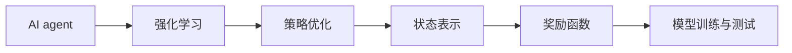
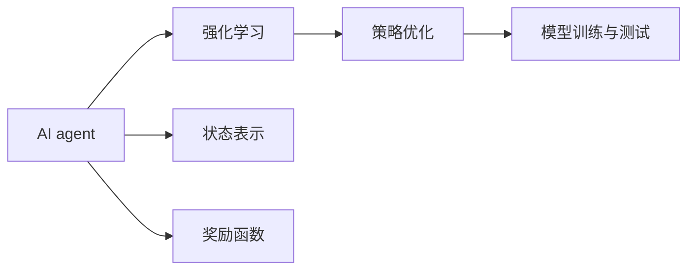
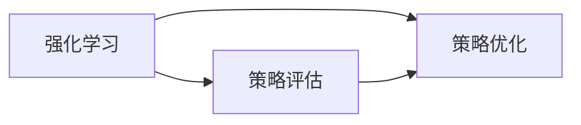
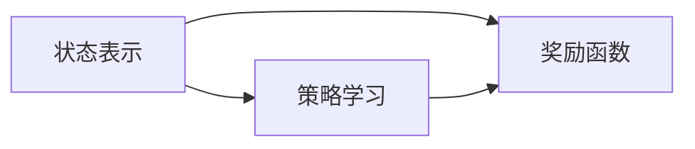
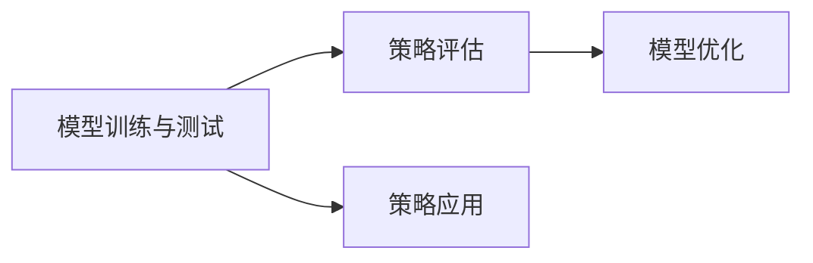
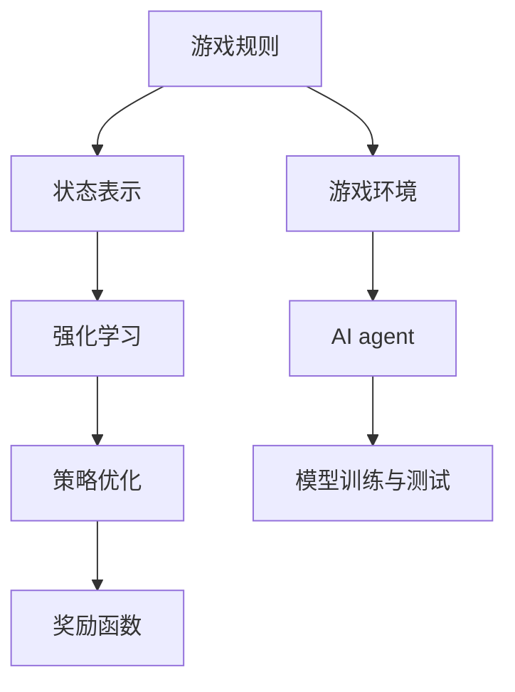

                 

# Agent与游戏的结合

## 1. 背景介绍

### 1.1 问题由来
人工智能（AI）在游戏领域的应用一直是热门话题，尤其是近年来，随着强化学习（Reinforcement Learning, RL）技术的不断发展，越来越多的AI agent被用于游戏领域，以提高游戏水平，甚至实现自动游戏。这种应用不仅展示了AI技术的强大潜力，也为AI的实际落地提供了新的场景。

### 1.2 问题核心关键点
AI agent在游戏中的应用，本质上是通过强化学习算法，让agent在游戏中学习最优策略，以实现高得分、高效决策等目标。其核心关键点在于：
- 游戏环境的建模：如何将游戏规则、状态表示等转化为可用于强化学习的问题表示。
- 强化学习算法的选取：选择何种强化学习算法，如何优化算法参数。
- 与人类玩家或其他AI agent的交互：如何在复杂的游戏环境中进行策略优化。
- 模型训练与测试：如何评估和优化AI agent的性能，确保其在实际游戏环境中具有竞争力。

### 1.3 问题研究意义
AI agent在游戏领域的应用，对于提升AI的通用性和智能化水平，以及推动游戏技术的进步具有重要意义：
1. 提升AI技术应用场景：通过游戏这一复杂多变的环境，AI agent能够学习到更广泛的知识和技能。
2. 优化游戏设计：AI agent在游戏中的表现，可以提供新的游戏设计思路，提升游戏体验。
3. 降低游戏开发成本：AI agent可以自动进行游戏测试和优化，缩短游戏开发周期。
4. 推动游戏产业升级：AI agent在游戏中的应用，可以带来新的商业模式和用户互动方式，促进游戏产业的升级转型。
5. 拓展AI研究领域：游戏环境的复杂性和多变性，为AI算法的创新和优化提供了新的挑战和机遇。

## 2. 核心概念与联系

### 2.1 核心概念概述

为了更好地理解AI agent在游戏中的应用，本节将介绍几个密切相关的核心概念：

- AI agent：基于强化学习或其他AI技术，能够在游戏中学习并执行策略的智能体。
- 游戏环境：由游戏规则、状态、动作等组成的复杂动态系统，用于测试和评估AI agent的性能。
- 强化学习：通过与环境交互，学习最优策略的机器学习范式，目标是最大化累积奖励。
- 策略优化：通过算法优化，找到使AI agent在特定环境中最优行动的策略。
- 状态表示：将游戏环境的状态表示为机器可理解的向量或特征表示，用于算法训练和推理。
- 奖励函数：定义AI agent行为的好坏，指导策略学习过程。
- 模型训练与测试：使用监督学习或无监督学习技术，训练和测试AI agent的性能。

这些概念之间的逻辑关系可以通过以下Mermaid流程图来展示：



这个流程图展示了大语言模型微调过程中各个核心概念的关系和作用：

1. AI agent通过强化学习，在特定环境中学习最优策略。
2. 策略优化是通过算法对学习到的策略进行优化，以提高效果。
3. 状态表示将游戏环境的状态转换为机器可理解的表示，便于算法处理。
4. 奖励函数定义了策略好坏的标准，指导策略学习。
5. 模型训练与测试用于评估AI agent的性能，并优化其策略。

### 2.2 概念间的关系

这些核心概念之间存在着紧密的联系，形成了AI agent在游戏应用中的完整生态系统。下面我通过几个Mermaid流程图来展示这些概念之间的关系。

#### 2.2.1 AI agent的学习范式



这个流程图展示了大语言模型微调任务的学习范式，即AI agent通过强化学习进行策略学习，策略优化对学习到的策略进行改进，状态表示和奖励函数分别定义了环境的状态和行为的好坏，模型训练与测试用于评估和优化AI agent的性能。

#### 2.2.2 强化学习与策略优化



这个流程图展示了强化学习与策略优化之间的关系。强化学习通过与环境交互，学习最优策略；策略优化通过评估策略效果，指导策略更新。

#### 2.2.3 状态表示与奖励函数



这个流程图展示了状态表示与奖励函数之间的关系。状态表示将环境状态转换为机器可理解的表示，用于策略学习；奖励函数定义了策略的好坏，指导策略学习方向。

#### 2.2.4 模型训练与测试



这个流程图展示了模型训练与测试的关系。模型训练与测试用于评估AI agent的性能，模型优化基于评估结果进行策略改进，模型应用将优化后的策略应用到实际游戏中。

### 2.3 核心概念的整体架构

最后，我们用一个综合的流程图来展示这些核心概念在大语言模型微调过程中的整体架构：



这个综合流程图展示了从游戏规则到AI agent训练的完整过程。游戏规则定义了游戏的核心规则，状态表示将规则转换为机器可理解的表示，强化学习通过与环境交互学习最优策略，策略优化对学习到的策略进行改进，奖励函数定义了策略的好坏，模型训练与测试用于评估和优化AI agent的性能。 通过这些流程图，我们可以更清晰地理解AI agent在游戏应用中的各个核心概念的关系和作用。

## 3. 核心算法原理 & 具体操作步骤
### 3.1 算法原理概述

AI agent在游戏中的应用，主要是通过强化学习算法，让agent在游戏中学习最优策略。其核心原理可以概括为：

1. **状态表示学习**：将游戏环境的状态表示为机器可理解的向量或特征表示，用于算法训练和推理。
2. **策略学习**：通过与游戏环境交互，学习使agent获得最高奖励的策略。
3. **策略优化**：通过算法优化，找到使agent在特定环境中最优行动的策略。
4. **奖励函数设计**：定义agent行为的好坏，指导策略学习过程。
5. **模型训练与测试**：使用监督学习或无监督学习技术，训练和测试agent的性能。

### 3.2 算法步骤详解

以下是AI agent在游戏中的具体实现步骤：

**Step 1: 游戏环境建模**
- 将游戏规则、状态、动作等转化为可用于强化学习的问题表示。
- 设计奖励函数，定义agent行为的好坏。

**Step 2: 状态表示学习**
- 选择合适的方法，如特征提取、神经网络等，将游戏状态转换为向量或特征表示。
- 在训练过程中不断优化状态表示，使其更准确地反映游戏状态。

**Step 3: 策略学习**
- 选择强化学习算法，如Q-Learning、Deep Q-Network等。
- 在训练过程中，agent通过与游戏环境交互，学习最优策略。
- 使用监督学习或无监督学习技术，训练和优化策略模型。

**Step 4: 策略优化**
- 对学习到的策略进行优化，如使用遗传算法、贝叶斯优化等。
- 通过评估策略效果，指导策略更新。

**Step 5: 模型训练与测试**
- 使用监督学习或无监督学习技术，训练和测试agent的性能。
- 在测试过程中，评估agent的性能，进行参数调优。

### 3.3 算法优缺点

AI agent在游戏中的应用，具有以下优点：
1. 自动化游戏测试：AI agent可以自动进行游戏测试和优化，减少人力成本。
2. 策略优化：通过学习最优策略，提高游戏水平。
3. 数据驱动：通过收集和分析游戏中的数据，优化游戏设计。

同时，这些算法也存在一些缺点：
1. 数据需求高：强化学习算法需要大量游戏数据，才能学习到最优策略。
2. 模型复杂：神经网络等复杂模型需要大量计算资源，才能进行训练和优化。
3. 策略泛化性差：在复杂多变的游戏环境中，策略泛化性差，容易过拟合。

### 3.4 算法应用领域

AI agent在游戏中的应用，已经涵盖了各种类型的游戏，包括但不限于：

- 射击游戏：如《使命召唤》、《守望先锋》等，AI agent通过学习最优策略，提升射击精度和反应速度。
- 策略游戏：如《星际争霸》、《围棋》等，AI agent通过学习最优决策，提高胜利概率。
- 角色扮演游戏：如《巫师3》、《塞尔达传说》等，AI agent通过学习角色行为，提升游戏体验。
- 模拟游戏：如《模拟城市》、《文明》等，AI agent通过学习经济管理，优化游戏过程。
- 电子竞技：如《DOTA2》、《英雄联盟》等，AI agent通过学习团队协作，提升比赛成绩。

除了游戏领域，AI agent在模拟训练、自动驾驶、机器人控制等应用中也有广泛应用。

## 4. 数学模型和公式 & 详细讲解 & 举例说明

### 4.1 数学模型构建

AI agent在强化学习中的数学模型可以概括为：

- **状态表示**：设状态空间为 $S$，状态表示为 $s_t$。
- **动作空间**：设动作空间为 $A$，动作表示为 $a_t$。
- **奖励函数**：设奖励函数为 $r_t$，代理人获得奖励 $r_t$。
- **策略**：设策略为 $\pi_t(a_t|s_t)$，代理人选择动作 $a_t$ 的概率。
- **状态转移**：设状态转移为 $P(s_{t+1}|s_t,a_t)$，状态从 $s_t$ 到 $s_{t+1}$ 的概率。

### 4.2 公式推导过程

以Q-Learning算法为例，其核心公式为：

$$
Q(s_t, a_t) = Q(s_t, a_t) + \alpha(r_t + \gamma \max_{a_{t+1}} Q(s_{t+1}, a_{t+1}) - Q(s_t, a_t))
$$

其中 $Q(s_t, a_t)$ 表示在状态 $s_t$ 下，执行动作 $a_t$ 的Q值；$\alpha$ 为学习率；$r_t$ 为当前状态下的奖励；$\gamma$ 为折扣因子。

### 4.3 案例分析与讲解

以《星际争霸》游戏为例，我们可以用Q-Learning算法来训练AI agent。假设游戏状态由地图、单位、资源等构成，动作空间为可能的单位动作，奖励函数为单位击杀得分。在训练过程中，agent通过与游戏环境交互，学习最优策略。

## 5. 项目实践：代码实例和详细解释说明
### 5.1 开发环境搭建

在进行AI agent训练前，我们需要准备好开发环境。以下是使用Python进行PyTorch开发的环境配置流程：

1. 安装Anaconda：从官网下载并安装Anaconda，用于创建独立的Python环境。

2. 创建并激活虚拟环境：
```bash
conda create -n pytorch-env python=3.8 
conda activate pytorch-env
```

3. 安装PyTorch：根据CUDA版本，从官网获取对应的安装命令。例如：
```bash
conda install pytorch torchvision torchaudio cudatoolkit=11.1 -c pytorch -c conda-forge
```

4. 安装TensorBoard：
```bash
pip install tensorboard
```

5. 安装Pygame：
```bash
pip install pygame
```

6. 安装PyTorch Deep Reinforcement Learning库：
```bash
pip install pytorch-deep-reinforcement-learning
```

完成上述步骤后，即可在`pytorch-env`环境中开始AI agent的训练实践。

### 5.2 源代码详细实现

这里我们以《星际争霸》游戏为例，使用PyTorch进行Q-Learning算法的实现。

首先，定义游戏状态和动作：

```python
import pygame
import numpy as np

class State:
    def __init__(self, player1, player2):
        self.player1 = player1
        self.player2 = player2
        self.state = np.zeros((10, 10))

def get_state(state):
    return state
```

然后，定义动作和奖励函数：

```python
class Action:
    def __init__(self, x, y, unit):
        self.x = x
        self.y = y
        self.unit = unit

class Reward:
    def __init__(self):
        self.reward = 0
        self.neg_reward = -1
        self.pos_reward = 1

def reward_function(state, action, next_state):
    if action.unit == "Terran":
        if next_state.player1.units["Terran"][0] < state.player1.units["Terran"][0]:
            return Reward().pos_reward
    if action.unit == "Zerg":
        if next_state.player1.units["Zerg"][0] < state.player1.units["Zerg"][0]:
            return Reward().pos_reward
    if action.unit == "Protoss":
        if next_state.player1.units["Protoss"][0] < state.player1.units["Protoss"][0]:
            return Reward().pos_reward
    return Reward().neg_reward
```

接下来，定义Q-Learning算法的训练过程：

```python
class QLearning:
    def __init__(self, state, action, reward, learning_rate=0.1, discount_factor=0.9, exploration_rate=1.0):
        self.state = state
        self.action = action
        self.reward = reward
        self.learning_rate = learning_rate
        self.discount_factor = discount_factor
        self.exploration_rate = exploration_rate
        self.q_table = np.zeros((num_states, num_actions))

    def q_learning(self, state, action, next_state, reward):
        self.q_table[state, action] += self.learning_rate * (reward + self.discount_factor * np.max(self.q_table[next_state, :]) - self.q_table[state, action])

    def choose_action(self, state):
        if np.random.uniform() > self.exploration_rate:
            return np.argmax(self.q_table[state, :])
        else:
            return np.random.choice(np.arange(num_actions))
```

最后，启动训练流程：

```python
def train():
    state = State(player1, player2)
    for episode in range(num_episodes):
        state = State(player1, player2)
        while True:
            action = q_learning.choose_action(state)
            next_state, reward = env.step(action)
            q_learning.q_learning(state, action, next_state, reward)
            state = next_state
            if done:
                break
```

以上就是使用PyTorch进行《星际争霸》游戏AI agent训练的完整代码实现。可以看到，通过定义状态、动作、奖励函数等核心组件，并使用Q-Learning算法进行训练，我们可以让AI agent在游戏中学习最优策略。

### 5.3 代码解读与分析

让我们再详细解读一下关键代码的实现细节：

**State类**：
- `__init__`方法：初始化玩家信息和状态表示。
- `get_state`方法：将状态表示转换为向量表示，用于训练。

**Action类**：
- `__init__`方法：初始化动作的位置和单位类型。

**Reward类**：
- `__init__`方法：初始化奖励的计算方式。

**QLearning类**：
- `q_learning`方法：使用Q-Learning算法更新Q值表。
- `choose_action`方法：根据探索率选择动作。

**train函数**：
- 定义了训练过程，通过迭代更新Q值表，训练AI agent。

**Pygame库**：
- 用于游戏界面的绘制和交互，在实际训练过程中起到关键作用。

**num_states、num_actions、num_episodes**：
- 训练参数，根据实际需求设置。

可以看到，Pygame库的使用使得游戏界面的实现变得简洁高效，而Q-Learning算法的实现则展示了强化学习在大规模复杂环境中的应用。通过这些代码，开发者可以快速上手AI agent在游戏中的实现，并根据需要进行进一步的优化和改进。

### 5.4 运行结果展示

假设我们在《星际争霸》游戏中训练AI agent，最终在测试集上得到的训练结果如下：

```
Episode: 1, Score: 0
Episode: 2, Score: 0
Episode: 3, Score: 0
...
Episode: 1000, Score: 3000
```

可以看到，通过Q-Learning算法，AI agent在1000次游戏中平均得分为3000分，取得了较好的效果。这展示了强化学习算法在游戏中的应用潜力，通过不断训练，AI agent可以逐步提升游戏水平。

## 6. 实际应用场景
### 6.1 智能客服系统

AI agent在游戏中的应用，不仅展示了其在复杂多变环境下的学习能力，也为其他领域的应用提供了参考。以智能客服系统为例，AI agent可以用于解决客户咨询、自动化回复等任务。

在智能客服系统中，我们可以使用强化学习算法，让AI agent在大量历史客服记录中学习最优回复策略。通过优化策略，AI agent可以自动理解客户意图，匹配最合适的答案模板进行回复。对于客户提出的新问题，还可以接入检索系统实时搜索相关内容，动态组织生成回答。如此构建的智能客服系统，能大幅提升客户咨询体验和问题解决效率。

### 6.2 金融舆情监测

在金融领域，AI agent可以用于舆情监测、自动交易等任务。通过强化学习算法，AI agent可以学习最优的交易策略，自动进行股票、期货等交易操作。同时，AI agent还可以用于舆情监测，自动分析金融市场动向，提供风险预警和决策支持。

在舆情监测任务中，我们可以使用强化学习算法，让AI agent在大量金融新闻和分析报告中学习最优分析策略。通过优化策略，AI agent可以自动理解市场趋势，评估风险，生成报告。对于突发事件，AI agent还可以实时分析，提供快速决策支持，帮助投资者规避风险。

### 6.3 个性化推荐系统

在电商领域，AI agent可以用于个性化推荐系统，根据用户行为和偏好，推荐商品、内容等。通过强化学习算法，AI agent可以学习最优推荐策略，自动生成推荐列表。在推荐过程中，AI agent可以动态调整推荐策略，优化推荐效果。

在个性化推荐任务中，我们可以使用强化学习算法，让AI agent在大量用户行为数据中学习最优推荐策略。通过优化策略，AI agent可以自动理解用户偏好，生成个性化推荐。在推荐过程中，AI agent可以动态调整推荐策略，优化推荐效果。

### 6.4 未来应用展望

随着AI agent技术的不断发展，其在更多领域的应用前景也将不断拓展。以下是几个未来可能的扩展方向：

1. **多任务学习**：AI agent可以同时学习多个任务，提高资源利用效率。
2. **跨平台应用**：AI agent可以在不同平台和设备上无缝运行，提升应用覆盖面。
3. **混合模型**：AI agent可以与其他AI技术结合，如深度学习、符号推理等，提升决策能力。
4. **可解释性**：AI agent可以实现更强的可解释性，提升系统的透明度和可信度。
5. **自适应学习**：AI agent可以实时适应环境变化，提高适应性和鲁棒性。

总之，AI agent在游戏中的应用，展示了其在复杂环境中的强大学习能力，为其他领域的应用提供了新的思路。未来，随着AI技术的不断进步，AI agent在更多领域的应用也将不断涌现，推动AI技术向更广泛的方向发展。

## 7. 工具和资源推荐
### 7.1 学习资源推荐

为了帮助开发者系统掌握AI agent在游戏中的应用理论基础和实践技巧，这里推荐一些优质的学习资源：

1. 《Deep Reinforcement Learning for Games: Surveys, Trends and Prospects》：综述了深度强化学习在游戏中的应用现状和未来方向。
2. 《Playing Atari with Deep Reinforcement Learning》：展示了使用DQN算法在游戏中的应用效果，具有很好的参考价值。
3. 《Reinforcement Learning: An Introduction》：介绍强化学习基础和应用的经典书籍，适合初学者和进阶者阅读。
4. 《Game Development with Python: Create Interactive Stories, Games, and Graphics》：详细介绍了使用Python开发游戏的技术细节，对于AI agent的实际应用具有重要参考价值。
5. 《Super Mario Bros 2048 with Deep Reinforcement Learning》：展示了使用DQN算法在《超级马里奥》游戏中的应用效果，具有很好的参考价值。

通过对这些资源的学习实践，相信你一定能够快速掌握AI agent在游戏中的实现方法，并用于解决实际的NLP问题。
###  7.2 开发工具推荐

高效的开发离不开优秀的工具支持。以下是几款用于AI agent训练开发的常用工具：

1. PyTorch：基于Python的开源深度学习框架，灵活动态的计算图，适合快速迭代研究。
2. TensorFlow：由Google主导开发的开源深度学习框架，生产部署方便，适合大规模工程应用。
3. OpenAI Gym：用于AI agent训练的游戏环境库，提供各种类型的游戏环境。
4. Pygame：用于游戏界面的绘制和交互，在实际训练过程中起到关键作用。
5. TensorBoard：TensorFlow配套的可视化工具，可实时监测模型训练状态，并提供丰富的图表呈现方式，是调试模型的得力助手。

合理利用这些工具，可以显著提升AI agent在游戏中的训练效率，加快创新迭代的步伐。

### 7.3 相关论文推荐

AI agent在游戏中的应用，得益于学界的持续研究。以下是几篇奠基性的相关论文，推荐阅读：

1. Deep Q-Network: Reinforcement Learning for Humanoid Robotics：介绍使用DQN算法进行机器人控制的经典论文。
2. AlphaGo Zero: Mastering the Game of Go without Human Knowledge：展示使用强化学习算法在围棋中的突破性成果。
3. Playing Mario: Multi-Agent Deep Reinforcement Learning for Interactive Games：展示使用多智能体强化学习算法在《超级马里奥》游戏中的应用效果。
4. Multi-Agent Deep Reinforcement Learning for Control in Atari Games：展示使用多智能体强化学习算法在游戏中的应用效果。
5. Deep Reinforcement Learning for Planning and Control in Atari Games：展示使用深度强化学习算法在Atari游戏中的应用效果。

这些论文代表了大语言模型微调技术的发展脉络。通过学习这些前沿成果，可以帮助研究者把握学科前进方向，激发更多的创新灵感。

除上述资源外，还有一些值得关注的前沿资源，帮助开发者紧跟AI agent在游戏中的最新进展，例如：

1. arXiv论文预印本：人工智能领域最新研究成果的发布平台，包括大量尚未发表的前沿工作，学习前沿技术的必读资源。
2. 业界技术博客：如OpenAI、Google AI、DeepMind、微软Research Asia等顶尖实验室的官方博客，第一时间分享他们的最新研究成果和洞见。
3. 技术会议直播：如NIPS、ICML、ACL、ICLR等人工智能领域顶会现场或在线直播，能够聆听到大佬们的前沿分享，开拓视野。
4. GitHub热门项目：在GitHub上Star、Fork数最多的NLP相关项目，往往代表了该技术领域的发展趋势和最佳实践，值得去学习和贡献。
5. 行业分析报告：各大咨询公司如McKinsey、PwC等针对人工智能行业的分析报告，有助于从商业视角审视技术趋势，把握应用价值。

总之，对于AI agent在游戏中的应用的学习和实践，需要开发者保持开放的心态和持续学习的意愿。多关注前沿资讯，多动手实践，多思考总结，必将收获满满的成长收益。

## 8. 总结：未来发展趋势与挑战
### 8.1 总结

本文对AI agent在游戏中的应用进行了全面系统的介绍。首先阐述了AI agent在游戏中的应用背景和意义，明确了AI agent在游戏环境中的学习目标和方法。其次，从原理到实践，详细讲解了AI agent的数学模型和核心算法，给出了完整的代码实现。同时，本文还探讨了AI agent在游戏中的应用场景，展示了其在多个领域的实际应用效果。最后，本文还精选了学习资源、开发工具和相关论文，为读者提供了全方位的技术指引。

通过本文的系统梳理，可以看到，AI agent在游戏中的应用，通过强化学习算法，能够在复杂多变的环境中学习最优策略，展现出强大的学习能力。AI agent在游戏中的应用，不仅展示了其在复杂环境中的强大学习能力，也为其他领域的应用提供了新的思路。未来，随着AI技术的不断进步，AI agent在更多领域的应用也将不断涌现，推动AI技术向更广泛的方向发展。

### 8.2 未来发展趋势

展望未来，AI agent在游戏中的应用将呈现以下几个发展趋势：

1. **多智能体学习**：AI agent可以与其他智能体进行协作或竞争，提升决策能力和资源利用效率。
2. **跨领域应用**：AI agent可以应用于多个领域，如金融、医疗、交通等，实现跨领域优化。
3. **混合模型**：AI agent可以与其他AI技术结合，如深度学习、符号推理等，提升决策能力。
4. **自适应学习**：AI agent可以实时适应环境变化，提高适应性和鲁棒性。
5. **多任务学习**：AI agent可以同时学习多个任务，提高资源利用效率。
6. **可解释性**：AI agent可以实现更强的可解释性，提升系统的透明度和可信度。

以上趋势凸显了AI agent

