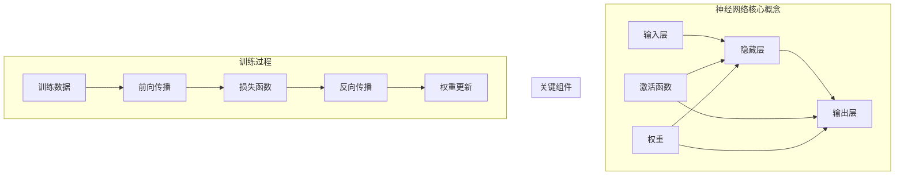

# 神经网络(Neural Networks) - 原理与代码实例讲解

## 1. 背景介绍

### 1.1 问题的由来

在过去几十年中,人工智能领域取得了令人瞩目的进展,而神经网络则是其中最为关键和核心的技术之一。神经网络的概念源于对生物神经系统的模拟,旨在构建能够模拟人类大脑学习和推理能力的计算模型。

随着大数据时代的到来和计算能力的不断提高,神经网络在语音识别、图像处理、自然语言处理等领域展现出了强大的能力,并在许多领域超越了人类水平。然而,神经网络作为一种黑箱模型,其内部工作机制和原理仍然存在很多未解之谜,这使得神经网络的可解释性、可靠性和安全性受到质疑。

### 1.2 研究现状

目前,神经网络在学术界和工业界都受到了广泛的关注和研究。在模型架构方面,卷积神经网络(CNN)、循环神经网络(RNN)、transformer等不同类型的神经网络模型被广泛应用。在训练算法方面,反向传播算法、优化算法等是神经网络训练的核心。

此外,注意力机制、迁移学习、元学习等技术的引入进一步提高了神经网络的性能。同时,硬件加速、分布式训练、模型压缩等技术的发展也推动了神经网络在工业界的大规模应用。

### 1.3 研究意义

神经网络作为人工智能的核心技术,其重要性不言而喻。深入理解神经网络的原理和实现方式,对于进一步提高神经网络的性能、可解释性和可靠性至关重要。本文将从理论和实践两个层面,系统地介绍神经网络的核心概念、数学模型、算法原理,并通过代码实例讲解其具体实现,旨在帮助读者全面掌握神经网络的本质。

### 1.4 本文结构

本文共分为9个部分:

1. 背景介绍
2. 核心概念与联系
3. 核心算法原理与具体操作步骤
4. 数学模型和公式详细讲解与举例说明
5. 项目实践:代码实例和详细解释说明
6. 实际应用场景
7. 工具和资源推荐
8. 总结:未来发展趋势与挑战
9. 附录:常见问题与解答

## 2. 核心概念与联系

神经网络是一种由大量互连的节点(神经元)组成的计算模型,其设计灵感来源于生物神经系统。每个节点接收来自其他节点的输入信号,并通过激活函数进行非线性转换,产生输出信号传递给下一层节点。神经网络通过对大量训练数据的学习,自动获取特征表示并完成各种任务。

上图展示了神经网络的核心概念及其相互联系:

- **输入层**: 接收原始输入数据,如图像、文本等。
- **隐藏层**: 对输入数据进行特征提取和转换,隐藏层可以有多层。
- **输出层**: 根据隐藏层的输出,产生最终的输出结果,如分类、回归等。
- **激活函数**: 对节点输入进行非线性转换,引入非线性是神经网络具有强大表达能力的关键。
- **权重**: 连接不同层节点的参数,在训练过程中不断调整以最小化损失函数。
- **前向传播**: 输入数据经过层层传递计算,得到最终输出的过程。
- **损失函数**: 衡量模型输出与真实值之间的差异,是模型优化的目标函数。
- **反向传播**: 根据损失函数的梯度,沿着反方向更新网络权重的过程。

通过不断的训练迭代,神经网络可以学习到最优的权重参数,从而完成各种任务。下面将详细介绍神经网络的核心算法原理和数学模型。

## 3. 核心算法原理与具体操作步骤

### 3.1 算法原理概述

神经网络的核心算法是**反向传播算法(Backpropagation)**,它是一种监督学习算法,用于训练多层神经网络。该算法的主要思想是:

1. **前向传播**:输入数据经过层层传递计算,得到最终输出。
2. **计算损失**:将输出与真实标签计算损失函数值。
3. **反向传播**:根据损失函数的梯度,沿着反方向更新网络权重。

通过不断迭代上述过程,神经网络可以学习到最优的权重参数,使得输出结果逐渐逼近真实值。

### 3.2 算法步骤详解

1. **前向传播**:

对于一个输入样本$\boldsymbol{x}$,在第$l$层,每个节点的输出$a_j^{(l)}$由上一层输出$a_i^{(l-1)}$和连接权重$w_{ij}^{(l)}$计算得到:

$$a_j^{(l)} = f\left(\sum_{i}w_{ij}^{(l)}a_i^{(l-1)} + b_j^{(l)}\right)$$

其中$f$为激活函数,如Sigmoid、ReLU等,$b_j^{(l)}$为偏置项。最终得到输出层的输出$\hat{\boldsymbol{y}}$。

2. **计算损失**:

将输出$\hat{\boldsymbol{y}}$与真实标签$\boldsymbol{y}$计算损失函数值$J$,如交叉熵损失:

$$J(\boldsymbol{\theta}) = -\frac{1}{m}\sum_{i=1}^m\sum_{j=1}^{k}y_j^{(i)}\log\hat{y}_j^{(i)}$$

其中$m$为样本数,$k$为输出维度,$\boldsymbol{\theta}$为所有权重参数。

3. **反向传播**:

利用链式法则计算损失函数$J$对每个权重$w_{ij}^{(l)}$的梯度:

$$\frac{\partial J}{\partial w_{ij}^{(l)}} = \frac{\partial J}{\partial a_j^{(l)}}\frac{\partial a_j^{(l)}}{\partial z_j^{(l)}}\frac{\partial z_j^{(l)}}{\partial w_{ij}^{(l)}}$$

其中$z_j^{(l)} = \sum_i w_{ij}^{(l)}a_i^{(l-1)} + b_j^{(l)}$为加权输入。

计算完所有梯度后,使用优化算法(如梯度下降)更新权重:

$$w_{ij}^{(l)} \leftarrow w_{ij}^{(l)} - \eta\frac{\partial J}{\partial w_{ij}^{(l)}}$$

其中$\eta$为学习率。

重复上述过程,直至收敛或达到最大迭代次数。

### 3.3 算法优缺点

**优点**:

- 具有强大的近似能力,可以拟合任意连续函数。
- 端到端学习,无需人工设计特征。
- 易于并行计算,可利用GPU等加速。

**缺点**:

- 需要大量标注数据进行有监督训练。
- 存在过拟合风险,需要合理的正则化。
- 训练时间长,收敛慢。
- 黑箱性质,缺乏可解释性。

### 3.4 算法应用领域

神经网络因其强大的拟合能力,在众多领域得到了广泛应用:

- **计算机视觉**:图像分类、目标检测、语义分割等。
- **自然语言处理**:机器翻译、文本生成、情感分析等。
- **语音识别**:自动语音识别、语音合成等。
- **推荐系统**:个性化推荐、内容推荐等。
- **金融**:信用评分、欺诈检测等。
- **医疗**:病理诊断、药物发现等。

## 4. 数学模型和公式详细讲解与举例说明

### 4.1 数学模型构建

神经网络的数学模型可以形式化为一个由多层组成的函数复合:

$$\hat{\boldsymbol{y}} = f^{(L)}(f^{(L-1)}(\cdots f^{(2)}(f^{(1)}(\boldsymbol{x};\boldsymbol{\theta}^{(1)});\boldsymbol{\theta}^{(2)})\cdots);\boldsymbol{\theta}^{(L)})$$

其中$\boldsymbol{x}$为输入,$\hat{\boldsymbol{y}}$为输出,每一层$f^{(l)}$对应着该层的计算过程,由激活函数和线性变换组成:

$$f^{(l)}(\boldsymbol{a}^{(l-1)};\boldsymbol{\theta}^{(l)}) = \sigma(\boldsymbol{W}^{(l)}\boldsymbol{a}^{(l-1)} + \boldsymbol{b}^{(l)})$$

这里$\boldsymbol{a}^{(l-1)}$为上一层输出,$\boldsymbol{W}^{(l)}$和$\boldsymbol{b}^{(l)}$分别为该层的权重和偏置,$\sigma$为激活函数。

训练过程的目标是通过调整每一层的权重参数$\boldsymbol{\theta}^{(l)}$,使得输出$\hat{\boldsymbol{y}}$尽可能接近真实标签$\boldsymbol{y}$,即最小化损失函数:

$$\min_{\boldsymbol{\theta}^{(1)},\cdots,\boldsymbol{\theta}^{(L)}} J(\boldsymbol{\theta}^{(1)},\cdots,\boldsymbol{\theta}^{(L)})$$

其中$J$为损失函数,如交叉熵损失或均方误差损失。

### 4.2 公式推导过程

现在我们来推导反向传播算法中权重梯度的计算公式。对于输出层,有:

$$\frac{\partial J}{\partial w_{ij}^{(L)}} = \frac{\partial J}{\partial a_j^{(L)}}\frac{\partial a_j^{(L)}}{\partial z_j^{(L)}}\frac{\partial z_j^{(L)}}{\partial w_{ij}^{(L)}}$$

由于$z_j^{(L)} = \sum_i w_{ij}^{(L)}a_i^{(L-1)} + b_j^{(L)}$,所以:

$$\frac{\partial z_j^{(L)}}{\partial w_{ij}^{(L)}} = a_i^{(L-1)}$$

$$\frac{\partial a_j^{(L)}}{\partial z_j^{(L)}} = \sigma'(z_j^{(L)})$$

其中$\sigma'$为激活函数的导数。将上式代入可得:

$$\frac{\partial J}{\partial w_{ij}^{(L)}} = \frac{\partial J}{\partial a_j^{(L)}}\sigma'(z_j^{(L)})a_i^{(L-1)}$$

对于隐藏层,有:

$$\frac{\partial J}{\partial w_{ij}^{(l)}} = \frac{\partial J}{\partial a_j^{(l)}}\frac{\partial a_j^{(l)}}{\partial z_j^{(l)}}\frac{\partial z_j^{(l)}}{\partial w_{ij}^{(l)}}$$

$$\frac{\partial z_j^{(l)}}{\partial w_{ij}^{(l)}} = a_i^{(l-1)}$$

$$\frac{\partial a_j^{(l)}}{\partial z_j^{(l)}} = \sigma'(z_j^{(l)})$$

$$\frac{\partial J}{\partial a_j^{(l)}} = \sum_k\frac{\partial J}{\partial z_k^{(l+1)}}\frac{\partial z_k^{(l+1)}}{\partial a_j^{(l)}}$$

$$\frac{\partial z_k^{(l+1)}}{\partial a_j^{(l)