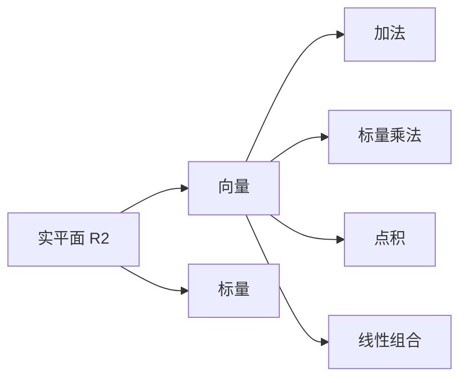

# 线性代数导引：实平面 R2

## 1. 背景介绍

### 1.1 问题的由来

线性代数是数学的一个基础分支,它研究向量空间及其上的线性变换。实平面 R2 是最简单的二维向量空间,是线性代数入门的理想起点。理解 R2 及其基本运算,有助于我们建立对更高维向量空间的直观认识。

在计算机图形学、计算机视觉、机器学习等领域,我们经常需要处理二维数据,比如图像坐标、特征向量等。因此,掌握 R2 的基本概念和操作技能是必不可少的。

### 1.2 研究现状

线性代数的研究可以追溯到17世纪,当时数学家开始研究线性方程组的解法。19世纪,线性代数理论得到了系统化发展,矩阵和行列式的概念被引入。20世纪初,向量空间和线性变换的抽象理论逐步完善。

如今,线性代数已广泛应用于科学计算、信号处理、优化理论等诸多领域。在计算机科学中,线性代数为机器学习、计算机图形学等提供了理论基础。

### 1.3 研究意义

掌握实平面 R2 的基本概念和操作技能,对于以下几个方面具有重要意义:

1. 为进一步学习更高维向量空间及线性代数理论奠定基础。
2. 加深对二维数据的理解,为相关应用领域做好准备。
3. 培养抽象思维能力,提高数学建模和问题解决能力。
4. 体现线性代数在计算机科学中的重要地位和应用价值。

### 1.4 本文结构

本文将从以下几个方面全面介绍实平面 R2:

1. 核心概念与联系
2. 核心算法原理与具体操作步骤
3. 数学模型和公式详细讲解及举例说明
4. 项目实践:代码实例和详细解释
5. 实际应用场景
6. 工具和资源推荐
7. 总结:未来发展趋势与挑战
8. 附录:常见问题与解答

## 2. 核心概念与联系

实平面 R2 是二维欧几里得空间,由两个坐标轴 x 和 y 构成。每一个点在平面上都可以用一个有序数对 (x, y) 来表示,其中 x 和 y 分别表示该点在 x 轴和 y 轴上的坐标值。

在 R2 中,我们定义了一些基本概念和运算,包括:

1. **向量**:由有序数对 (x, y) 表示的位移,可视为有大小和方向的箭头。
2. **标量**:实数,可视为没有方向的量。
3. **向量加法**:两个向量按坐标分量相加。
4. **标量乘法**:将一个向量的每个分量乘以同一个实数。
5. **点积**:两个向量的内积,结果是一个标量。
6. **线性组合**:将多个向量按不同的标量系数相加。

这些概念和运算之间存在着紧密的联系,相互依赖,组成了 R2 的基本理论框架。掌握了这些概念,我们就能够在平面上执行各种几何运算和向量变换。

## 3. 核心算法原理 & 具体操作步骤

### 3.1 算法原理概述

在实平面 R2 中,我们经常需要执行一些基本的几何运算和向量变换,比如:

1. 向量加法和标量乘法
2. 点积计算
3. 线性组合
4. 向量投影
5. 向量旋转
6. 平面向量与直线方程的关系

这些运算都有确定的算法原理,并且可以通过一系列具体的步骤来实现。掌握了这些算法原理和操作步骤,我们就能够灵活地在 R2 中处理各种问题。

### 3.2 算法步骤详解

以下我们将详细介绍几个核心算法的具体操作步骤:

#### 3.2.1 向量加法

已知两个向量 $\vec{a} = (x_1, y_1)$, $\vec{b} = (x_2, y_2)$,它们的和向量 $\vec{c} = \vec{a} + \vec{b}$ 的计算步骤如下:

1) 计算 $x_3 = x_1 + x_2$
2) 计算 $y_3 = y_1 + y_2$
3) 得到结果向量 $\vec{c} = (x_3, y_3)$

#### 3.2.2 标量乘法

已知一个向量 $\vec{a} = (x_1, y_1)$,一个标量 $k \in \mathbb{R}$,它们的乘积向量 $\vec{b} = k\vec{a}$ 的计算步骤如下:

1) 计算 $x_2 = kx_1$
2) 计算 $y_2 = ky_1$
3) 得到结果向量 $\vec{b} = (x_2, y_2)$

#### 3.2.3 点积计算

已知两个向量 $\vec{a} = (x_1, y_1)$, $\vec{b} = (x_2, y_2)$,它们的点积 $\vec{a} \cdot \vec{b}$ 的计算步骤如下:

1) 计算 $x_1x_2 + y_1y_2$
2) 点积结果为标量 $\vec{a} \cdot \vec{b} = x_1x_2 + y_1y_2$

点积具有几何意义,即 $\vec{a} \cdot \vec{b} = |\vec{a}||\vec{b}|\cos\theta$,其中 $\theta$ 为 $\vec{a}$ 和 $\vec{b}$ 的夹角。

#### 3.2.4 线性组合

已知 $n$ 个向量 $\vec{a_1}, \vec{a_2}, \ldots, \vec{a_n}$,以及 $n$ 个标量 $k_1, k_2, \ldots, k_n$,它们的线性组合向量 $\vec{c}$ 的计算步骤如下:

1) 计算 $\vec{c} = k_1\vec{a_1} + k_2\vec{a_2} + \ldots + k_n\vec{a_n}$
2) 对每一个加数执行标量乘法
3) 将所有加数向量相加,得到 $\vec{c}$

线性组合广泛应用于向量空间的线性变换、基向量变换等操作中。

### 3.3 算法优缺点

上述算法具有以下优点:

1. 原理简单,操作步骤明确
2. 计算量小,时间复杂度低
3. 适用于各种维度的向量空间
4. 可组合使用,解决更复杂的问题

但也存在一些缺点:

1. 对于大规模向量计算,可能存在数值精度问题
2. 没有考虑向量空间基底的变化
3. 没有并行计算的实现方式

### 3.4 算法应用领域

上述算法在以下领域有着广泛的应用:

1. **计算机图形学**: 二维图形的变换、投影等
2. **计算机视觉**: 特征提取、图像处理等
3. **机器学习**: 线性回归、支持向量机等
4. **信号处理**: 滤波、编码等
5. **物理模拟**: 力学、动力学等
6. **优化理论**: 线性规划、凸优化等

总之,只要涉及向量、矩阵等线性代数概念的计算,这些基本算法就可以发挥重要作用。

## 4. 数学模型和公式 & 详细讲解 & 举例说明

### 4.1 数学模型构建

在实平面 R2 中,我们通常使用有序数对 $(x, y)$ 来表示一个向量。这种表示方式建立了平面直角坐标系与向量之间的数学模型,使得我们可以用代数的方式精确描述和操作向量。

令 $\vec{a} = (x_1, y_1)$, $\vec{b} = (x_2, y_2)$ 为两个向量,那么我们可以构建如下数学模型:

$$
\begin{align*}
\vec{a} + \vec{b} &= (x_1 + x_2, y_1 + y_2) \
k\vec{a} &= (kx_1, ky_1),\quad k\in\mathbb{R} \
\vec{a} \cdot \vec{b} &= x_1x_2 + y_1y_2
\end{align*}
$$

这些公式精确地定义了向量加法、标量乘法和点积运算在代数表示下的计算方式。通过这种数学模型,我们可以在代数的框架内研究向量的性质和运算规律。

### 4.2 公式推导过程

我们以向量加法公式的推导为例,说明数学模型建立的过程。

已知向量 $\vec{a}$ 和 $\vec{b}$ 在平面直角坐标系中的表示为:

$$
\vec{a} = (x_1, y_1), \quad \vec{b} = (x_2, y_2)
$$

我们需要找到它们的和向量 $\vec{c} = \vec{a} + \vec{b}$ 在平面直角坐标系中的表示。

根据向量加法的几何意义,我们将 $\vec{a}$ 和 $\vec{b}$ 的终点相连,得到 $\vec{c}$ 的终点。由于平面直角坐标系的坐标轴是相互垂直的,所以 $\vec{c}$ 在 x 轴上的投影就是 $x_1 + x_2$,在 y 轴上的投影就是 $y_1 + y_2$。

因此,向量 $\vec{c}$ 在平面直角坐标系中的表示为:

$$
\vec{c} = \vec{a} + \vec{b} = (x_1 + x_2, y_1 + y_2)
$$

通过这一几何直观的推导过程,我们得到了向量加法在代数表示下的公式,从而将几何概念与代数形式统一起来,建立了完整的数学模型。

### 4.3 案例分析与讲解

现有两个向量 $\vec{a} = (2, 3)$, $\vec{b} = (-1, 4)$,以及一个标量 $k = 2$,求:

1) $\vec{c} = \vec{a} + \vec{b}$
2) $\vec{d} = k\vec{a}$
3) $\vec{a} \cdot \vec{b}$

**解**:

1) 根据向量加法公式:
$$
\vec{c} = \vec{a} + \vec{b} = (2 + (-1), 3 + 4) = (1, 7)
$$

2) 根据标量乘法公式:
$$
\vec{d} = k\vec{a} = 2(2, 3) = (4, 6)
$$

3) 根据点积公式:
$$
\vec{a} \cdot \vec{b} = 2(-1) + 3 \times 4 = -2 + 12 = 10
$$

这个案例说明了如何将数学模型中的公式具体应用于实际计算。我们按步骤将已知条件代入公式,即可得到所求结果。

### 4.4 常见问题解答

1) **为什么向量加法满足交换律和结合律?**

答: 这是因为向量加法实际上是两个位移的合成,而位移的合成满足交换律和结合律。具体来说,设 $\vec{a}$、$\vec{b}$、$\vec{c}$ 为任意向量,则有:

$$
\vec{a} + \vec{b} = \vec{b} + \vec{a} \quad \text{(交换律)}\
(\vec{a} + \vec{b}) + \vec{c} = \vec{a} + (\vec{b} + \vec{c}) \quad \text{(结合律)}
$$

2) **标量乘法为什么满足分配律?**

答: 因为标量乘法实际上是对向量的每个分量进行相同的尺度变换,而尺度变换满足分配律。也就是说,对于任意向量 $\vec{a}$、$\vec{b}$ 和标量 $k$、$l$,有:

$$
k(\vec{a} + \vec{b}) = k\vec{a} + k\vec{b} \quad \text{(分配律)}\
(k + l)\vec{a} = k\vec{a} + l\vec{a}
$$

3) **点积的几何