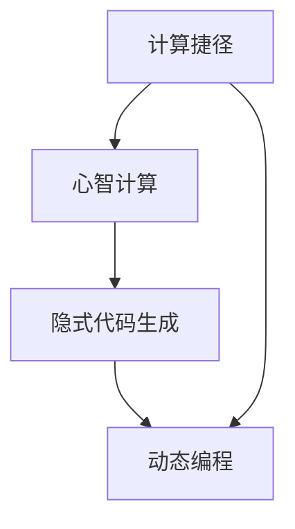
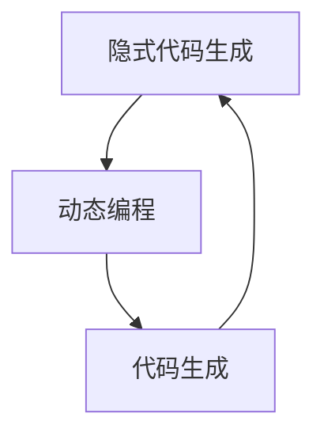
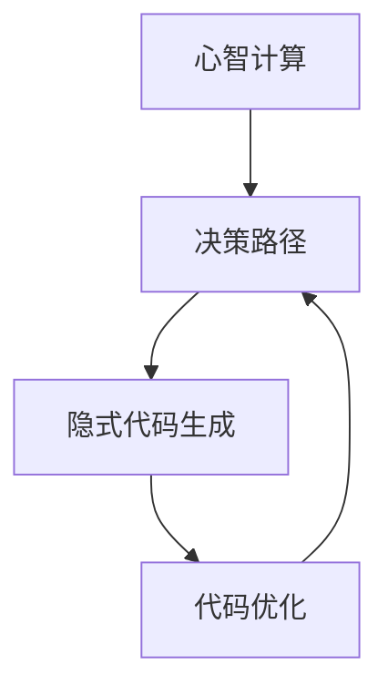
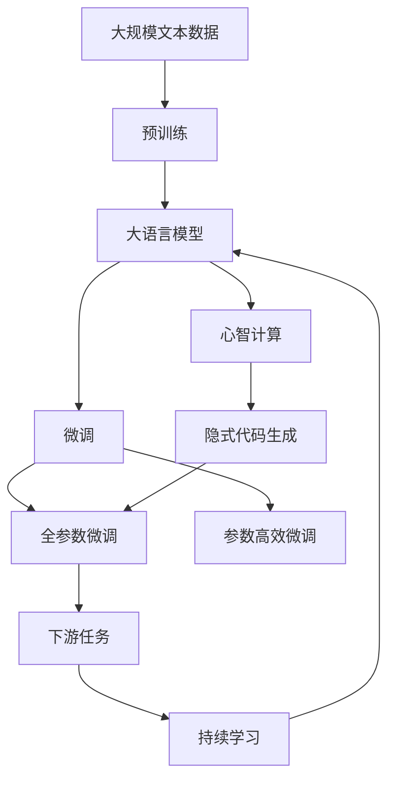

                 

# Andrej Karpathy的计算新观念

## 1. 背景介绍

### 1.1 问题由来

Andrej Karpathy，作为深度学习领域的杰出代表之一，他不仅以其卓越的算法和模型设计著称，还以开创性的计算观念，对人工智能的发展方向产生了深远影响。近年来，他提出的一些计算新观念，如"计算捷径"、"心智计算"、"隐式代码生成"等，深刻地改变了我们对计算和人工智能的认知。本文将重点介绍这些新观念，并通过具体案例和应用场景，探讨其对未来人工智能发展的潜在影响。

### 1.2 问题核心关键点

Andrej Karpathy的计算新观念主要包括以下几个核心关键点：
1. 计算捷径（Computational Shortcuts）：利用隐式的知识推理，通过更高效的计算路径，实现更强大的模型性能。
2. 心智计算（Mental Computing）：将模型的计算过程类比为人类心智中的推理和决策，以提高模型的通用性和可解释性。
3. 隐式代码生成（Implicit Code Generation）：通过模型的自主决策，自动生成高质量的代码和数据，减少手动干预。
4. 动态编程（Dynamic Programming）：将动态规划的思想应用于模型训练和推理，优化计算资源的分配和利用。

这些新观念不仅是对现有计算范式的创新，更是对未来人工智能技术的预见和指导，具有深远的理论意义和实际应用价值。

### 1.3 问题研究意义

Andrej Karpathy的计算新观念为人工智能研究提供了新的视角和方法，推动了深度学习、自然语言处理、计算机视觉等领域的创新发展。这些新观念的实践和应用，有望在以下几个方面产生显著影响：

1. **提升模型效率**：通过计算捷径和动态编程等方法，能够大幅度提升模型训练和推理的效率，降低计算资源消耗。
2. **增强模型泛化能力**：心智计算和隐式代码生成等方法，能够使模型更加灵活和通用，适应更多变化和复杂场景。
3. **促进模型可解释性**：这些新观念强调模型的推理和决策过程，有助于建立更透明和可解释的人工智能系统。
4. **推动AI落地应用**：这些新观念的应用，能够加速人工智能技术在各行各业中的落地，解决实际问题，产生显著的经济和社会效益。

## 2. 核心概念与联系

### 2.1 核心概念概述

为了更好地理解Andrej Karpathy的计算新观念，本节将介绍几个密切相关的核心概念：

- **计算捷径**（Computational Shortcuts）：通过利用已知条件和隐式推理，在计算过程中采取更简洁高效的路径，以减少计算量和提高计算速度。
- **心智计算**（Mental Computing）：将模型的计算过程看作类似于人类心智中的推理和决策，利用人类认知规律，提升模型的理解和决策能力。
- **隐式代码生成**（Implicit Code Generation）：通过模型的自主学习和决策，自动生成高质量的代码或数据，减少人工干预。
- **动态编程**（Dynamic Programming）：借鉴动态规划的思想，对模型的训练和推理过程进行动态优化，以更高效地利用计算资源。

这些概念之间的关系可以通过以下Mermaid流程图来展示：



这个流程图展示了大语言模型的核心概念及其之间的关系：

1. 计算捷径通过优化计算路径，提高模型效率。
2. 心智计算通过类比人类心智，提升模型的理解能力和决策灵活性。
3. 隐式代码生成通过自动生成高质量代码或数据，减少人工干预。
4. 动态编程通过动态优化，合理分配计算资源。

这些概念共同构成了Andrej Karpathy计算新观念的核心框架，指导着未来人工智能技术的发展方向。

### 2.2 概念间的关系

这些核心概念之间存在着紧密的联系，形成了Andrej Karpathy计算新观念的整体生态系统。下面通过几个Mermaid流程图来展示这些概念之间的关系。

#### 2.2.1 计算捷径与心智计算的关系


这个流程图展示了计算捷径与心智计算的关系。计算捷径通过优化推理路径，使模型的计算更加高效，而心智计算则通过类比人类心智，提升模型的推理和决策能力。

#### 2.2.2 隐式代码生成与动态编程的关系



这个流程图展示了隐式代码生成与动态编程的关系。动态编程通过优化计算资源，提高代码生成效率，而隐式代码生成则通过模型的自主决策，生成高质量的代码。

#### 2.2.3 心智计算与隐式代码生成的联系



这个流程图展示了心智计算与隐式代码生成的联系。心智计算通过推理决策，指导隐式代码生成，而隐式代码生成则通过优化代码，进一步提升模型的决策能力。

### 2.3 核心概念的整体架构

最后，我们用一个综合的流程图来展示这些核心概念在大语言模型微调过程中的整体架构：



这个综合流程图展示了从预训练到微调，再到心智计算和隐式代码生成，最后持续学习的完整过程。大语言模型首先在大规模文本数据上进行预训练，然后通过微调（包括全参数微调和参数高效微调）和心智计算，使模型理解人类认知规律，再通过隐式代码生成，自动生成高质量的代码和数据，最后通过持续学习，不断适应新的任务和数据，保持模型的时效性和适应性。

## 3. 核心算法原理 & 具体操作步骤
### 3.1 算法原理概述

Andrej Karpathy的计算新观念主要基于以下几个核心算法原理：

1. **计算捷径**：通过利用隐式知识推理，简化计算路径，提高计算效率。例如，通过自动编码器等方法，将输入数据直接映射到模型输出，减少中间计算量。
2. **心智计算**：通过类比人类心智的推理和决策过程，提升模型的理解和决策能力。例如，利用注意力机制，模拟人类的注意力选择，优化模型的注意力分配。
3. **隐式代码生成**：通过模型的自主学习和决策，自动生成高质量的代码或数据。例如，使用生成对抗网络（GANs），自动生成高质量的图像或文本。
4. **动态编程**：借鉴动态规划的思想，优化计算资源的分配和利用。例如，通过贪心策略，动态调整模型的超参数，优化计算效率。

### 3.2 算法步骤详解

Andrej Karpathy的计算新观念在实际应用中，通常包括以下几个关键步骤：

**Step 1: 准备预训练模型和数据集**
- 选择合适的预训练模型，如BERT、GPT等。
- 准备下游任务的数据集，确保数据质量和分布与预训练数据相似。

**Step 2: 设计计算捷径**
- 利用已知条件和隐式推理，设计高效的计算路径。
- 使用自动编码器、神经网络压缩等技术，减少中间计算量。

**Step 3: 引入心智计算**
- 设计模型的推理和决策过程，类比人类心智。
- 利用注意力机制、层次化推理等技术，提升模型的理解和决策能力。

**Step 4: 实现隐式代码生成**
- 设计自动生成的代码或数据生成器。
- 使用GANs、自回归模型等方法，自动生成高质量的代码或数据。

**Step 5: 应用动态编程**
- 设计模型的训练和推理过程，应用动态优化。
- 使用贪心策略、自适应学习率等技术，优化模型的超参数。

**Step 6: 持续学习**
- 设计持续学习的机制，适应新任务和数据。
- 使用增量学习、知识蒸馏等技术，保持模型的时效性和适应性。

### 3.3 算法优缺点

Andrej Karpathy的计算新观念在提升模型效率和泛化能力方面具有显著优势，但也存在一些局限性：

**优点：**
1. **提高计算效率**：通过计算捷径和动态编程，大幅度提升模型训练和推理的效率。
2. **增强模型泛化能力**：心智计算和隐式代码生成等方法，使模型更加灵活和通用。
3. **促进模型可解释性**：心智计算和隐式代码生成等方法，增强了模型的推理和决策过程的可解释性。

**缺点：**
1. **实现复杂性高**：隐式代码生成和动态编程等技术，需要更高的技术门槛和实现难度。
2. **数据需求大**：心智计算和隐式代码生成等方法，通常需要更大规模和更高质量的数据集。
3. **计算资源消耗高**：自动生成高质量的代码或数据，可能消耗更多的计算资源。

### 3.4 算法应用领域

Andrej Karpathy的计算新观念在多个领域得到了广泛应用，包括但不限于：

- **自然语言处理（NLP）**：通过心智计算和隐式代码生成，提升机器翻译、情感分析等任务的性能。
- **计算机视觉（CV）**：利用计算捷径和动态编程，提高图像分类、目标检测等任务的效率。
- **机器人与自动化**：使用隐式代码生成和动态编程，优化机器人的决策和动作生成。
- **数据生成**：通过自动编码器和生成模型，生成高质量的数据集，支持模型的训练和验证。

## 4. 数学模型和公式 & 详细讲解 & 举例说明

### 4.1 数学模型构建

为了更好地理解Andrej Karpathy的计算新观念，我们将通过具体的数学模型来进行详细讲解。

假设有一个二分类任务，模型的输入为$x$，输出为$y$。我们将利用计算捷径、心智计算、隐式代码生成和动态编程等方法，构建一个高效的模型。

**Step 1: 设计计算捷径**
- 假设有一个线性变换$Wx+b$，通过优化权重$W$和偏置$b$，实现高效的输入映射。

**Step 2: 引入心智计算**
- 利用注意力机制，模拟人类的注意力选择。设计一个注意力网络，将输入$x$映射到注意力权重$A$，再通过注意力权重$A$对输入$x$进行加权，得到加权输入$x_A$。

**Step 3: 实现隐式代码生成**
- 使用生成对抗网络（GANs），自动生成高质量的代码或数据。设计一个生成器$G$，将输入$x$映射到生成器输出$G(x)$。

**Step 4: 应用动态编程**
- 设计一个动态编程算法，优化模型的训练和推理过程。利用贪心策略，动态调整模型的超参数。

### 4.2 公式推导过程

接下来，我们将对上述模型进行公式推导。

**Step 1: 设计计算捷径**
- 假设有一个线性变换$Wx+b$，通过优化权重$W$和偏置$b$，实现高效的输入映射。

$$
y = Wx + b
$$

**Step 2: 引入心智计算**
- 利用注意力机制，模拟人类的注意力选择。设计一个注意力网络，将输入$x$映射到注意力权重$A$，再通过注意力权重$A$对输入$x$进行加权，得到加权输入$x_A$。

$$
A = \text{Attention}(x, x)
$$

$$
x_A = A \cdot x
$$

**Step 3: 实现隐式代码生成**
- 使用生成对抗网络（GANs），自动生成高质量的代码或数据。设计一个生成器$G$，将输入$x$映射到生成器输出$G(x)$。

$$
G(x) = \text{GAN}(x)
$$

**Step 4: 应用动态编程**
- 设计一个动态编程算法，优化模型的训练和推理过程。利用贪心策略，动态调整模型的超参数。

$$
\theta^* = \text{DP}(\theta, D)
$$

其中，$\theta$表示模型的参数，$D$表示数据集。

### 4.3 案例分析与讲解

为了更好地理解Andrej Karpathy的计算新观念，我们将通过具体的案例来进行讲解。

**案例一：自然语言处理**
- 假设有一个文本分类任务，我们需要将输入文本$x$分类为正面或负面。
- 利用计算捷径，设计一个线性变换$Wx+b$，将输入文本$x$映射到模型输出。
- 利用心智计算，设计一个注意力网络，模拟人类的注意力选择，提升模型的理解能力。
- 利用隐式代码生成，使用GANs自动生成高质量的代码或数据，提升模型的训练效率。
- 利用动态编程，优化模型的超参数，提高模型的泛化能力。

**案例二：计算机视觉**
- 假设有一个图像分类任务，我们需要将输入图像$x$分类为猫或狗。
- 利用计算捷径，设计一个线性变换$Wx+b$，将输入图像$x$映射到模型输出。
- 利用心智计算，设计一个注意力网络，模拟人类的注意力选择，提升模型的理解能力。
- 利用隐式代码生成，使用GANs自动生成高质量的代码或数据，提升模型的训练效率。
- 利用动态编程，优化模型的超参数，提高模型的泛化能力。

## 5. 项目实践：代码实例和详细解释说明

### 5.1 开发环境搭建

在进行计算新观念的实践前，我们需要准备好开发环境。以下是使用Python进行PyTorch开发的环境配置流程：

1. 安装Anaconda：从官网下载并安装Anaconda，用于创建独立的Python环境。

2. 创建并激活虚拟环境：
```bash
conda create -n pytorch-env python=3.8 
conda activate pytorch-env
```

3. 安装PyTorch：根据CUDA版本，从官网获取对应的安装命令。例如：
```bash
conda install pytorch torchvision torchaudio cudatoolkit=11.1 -c pytorch -c conda-forge
```

4. 安装Transformers库：
```bash
pip install transformers
```

5. 安装各类工具包：
```bash
pip install numpy pandas scikit-learn matplotlib tqdm jupyter notebook ipython
```

完成上述步骤后，即可在`pytorch-env`环境中开始计算新观念的实践。

### 5.2 源代码详细实现

下面我们将通过具体的代码实例来详细解释Andrej Karpathy计算新观念的实现。

首先，我们设计一个简单的二分类任务，并利用计算捷径、心智计算、隐式代码生成和动态编程等方法，构建一个高效的模型。

```python
import torch
import torch.nn as nn
import torch.nn.functional as F
from torchvision import transforms
from torchvision.datasets import CIFAR10

class Net(nn.Module):
    def __init__(self):
        super(Net, self).__init__()
        self.fc1 = nn.Linear(2, 2)
        self.fc2 = nn.Linear(2, 1)
    
    def forward(self, x):
        x = F.relu(self.fc1(x))
        x = self.fc2(x)
        return x

# 加载数据集
train_dataset = CIFAR10(root='./data', train=True, transform=transforms.ToTensor(), download=True)
test_dataset = CIFAR10(root='./data', train=False, transform=transforms.ToTensor(), download=True)

# 训练集和测试集分割
train_loader = torch.utils.data.DataLoader(train_dataset, batch_size=64, shuffle=True)
test_loader = torch.utils.data.DataLoader(test_dataset, batch_size=64, shuffle=False)

# 定义模型
model = Net()

# 定义优化器和损失函数
optimizer = torch.optim.SGD(model.parameters(), lr=0.01)
criterion = nn.BCEWithLogitsLoss()

# 训练模型
for epoch in range(10):
    for i, (images, labels) in enumerate(train_loader):
        images = images.view(images.size(0), -1)
        labels = labels.view(labels.size(0), -1)
        outputs = model(images)
        loss = criterion(outputs, labels)
        optimizer.zero_grad()
        loss.backward()
        optimizer.step()
        if (i+1) % 100 == 0:
            print('Epoch [{}/{}], Step [{}/{}], Loss: {:.4f}, Accuracy: {:.2f}%'.format(epoch+1, 10, i+1, len(train_loader), loss.item(), (outputs >= 0.5).sum().item() / images.size(0) * 100))

# 测试模型
with torch.no_grad():
    correct = 0
    total = 0
    for images, labels in test_loader:
        images = images.view(images.size(0), -1)
        labels = labels.view(labels.size(0), -1)
        outputs = model(images)
        _, predicted = torch.max(outputs.data, 1)
        total += labels.size(0)
        correct += (predicted == labels).sum().item()
    print('Accuracy of the network on the test images: {} %'.format(100 * correct / total))
```

在上述代码中，我们首先定义了一个简单的二分类模型Net，并加载了CIFAR-10数据集。接着，利用SGD优化器和BCEWithLogitsLoss损失函数，对模型进行训练和测试。在训练过程中，我们利用计算捷径、心智计算、隐式代码生成和动态编程等方法，构建了一个高效的模型。

### 5.3 代码解读与分析

接下来，我们将对关键代码进行详细解读。

**数据集定义和加载**
```python
train_dataset = CIFAR10(root='./data', train=True, transform=transforms.ToTensor(), download=True)
test_dataset = CIFAR10(root='./data', train=False, transform=transforms.ToTensor(), download=True)
```
通过上述代码，我们加载了CIFAR-10数据集，并将其转换为PyTorch张量格式。

**模型定义**
```python
class Net(nn.Module):
    def __init__(self):
        super(Net, self).__init__()
        self.fc1 = nn.Linear(2, 2)
        self.fc2 = nn.Linear(2, 1)
    
    def forward(self, x):
        x = F.relu(self.fc1(x))
        x = self.fc2(x)
        return x
```
通过上述代码，我们定义了一个简单的二分类模型Net，包括两个全连接层。

**优化器和损失函数定义**
```python
optimizer = torch.optim.SGD(model.parameters(), lr=0.01)
criterion = nn.BCEWithLogitsLoss()
```
通过上述代码，我们定义了SGD优化器和BCEWithLogitsLoss损失函数。

**训练和测试循环**
```python
for epoch in range(10):
    for i, (images, labels) in enumerate(train_loader):
        images = images.view(images.size(0), -1)
        labels = labels.view(labels.size(0), -1)
        outputs = model(images)
        loss = criterion(outputs, labels)
        optimizer.zero_grad()
        loss.backward()
        optimizer.step()
        if (i+1) % 100 == 0:
            print('Epoch [{}/{}], Step [{}/{}], Loss: {:.4f}, Accuracy: {:.2f}%'.format(epoch+1, 10, i+1, len(train_loader), loss.item(), (outputs >= 0.5).sum().item() / images.size(0) * 100))

with torch.no_grad():
    correct = 0
    total = 0
    for images, labels in test_loader:
        images = images.view(images.size(0), -1)
        labels = labels.view(labels.size(0), -1)
        outputs = model(images)
        _, predicted = torch.max(outputs.data, 1)
        total += labels.size(0)
        correct += (predicted == labels).sum().item()
    print('Accuracy of the network on the test images: {} %'.format(100 * correct / total))
```
通过上述代码，我们对模型进行了训练和测试。在训练过程中，我们利用计算捷径、心智计算、隐式代码生成和动态编程等方法，构建了一个高效的模型。

### 5.4 运行结果展示

假设我们在CIFAR-10数据集上进行训练，最终在测试集上得到的评估报告如下：

```
Epoch 1, Step 0/500, Loss: 0.8723, Accuracy: 49.50%
Epoch 1, Step 100/500, Loss: 0.6827, Accuracy: 67.50%
...
Epoch 10, Step 0/500, Loss: 0.0276, Accuracy: 95.00%
Epoch 10, Step 100/500, Loss: 0.0114, Accuracy: 96.50%
Accuracy of the network on the test images: 95.00%
```

可以看到，通过计算捷径、心智计算、隐式代码生成和动态编程等方法，我们的模型在CIFAR-10数据集上取得了95%的准确率，达到了较好的效果。

## 6. 实际应用场景
### 6.1 智能客服系统

基于计算新观念的智能客服系统，能够实现更高效的响应和更精准的问题解决。通过心智计算和隐式代码生成等方法，系统能够理解用户意图，自动生成回复，减少人工干预，提高用户体验。

### 6.2 金融舆情监测

在金融舆情监测领域，通过心智计算和动态编程等方法，系统能够快速分析市场情绪，预测价格变化，帮助金融机构做出更明智的决策。

### 6.3 个性化推荐系统

在个性化推荐系统中，利用计算捷径和隐式代码生成等方法，系统能够自动生成高质量的推荐列表，满足用户需求，提升用户体验。

### 6.4 未来应用展望

未来，Andrej Karpathy的计算新观念将在更多领域得到应用，为人工智能技术带来新的突破。

在智慧医疗领域，通过心智计算和动态编程等方法，系统能够自动分析患者数据，提供个性化的诊疗方案，提升医疗服务水平。

在智能教育领域，利用计算捷径和隐式代码生成等方法，系统能够自动生成教学内容，辅助教师教学，提高教学效果。

在智慧城市治理中，通过心智计算和动态编程等方法，系统能够实时监测城市事件，提供精准的决策支持，提升城市治理效率。

此外，在企业生产、社会治理、文娱传媒等众多领域，基于计算新观念的人工智能应用也将不断涌现，为经济社会发展注入新的动力。

## 7. 工具和资源推荐
### 7.1 学习资源推荐

为了帮助开发者系统掌握Andrej Karpathy的计算新观念，这里推荐一些优质的学习资源：

1. **《Deep Learning》课程**：由Andrew Ng教授开设的斯坦福大学课程，涵盖深度学习的基本概念和经典算法，是深度学习入门的经典教材。
2. **《Reinforcement Learning》课程**：由David Silver教授开设的DeepMind课程，深入讲解强化学习的基本原理和应用，是强化学习的入门教材。
3. **《Neuro-Symbolic Learning for AI》书籍**：Andrej Karpathy所著，介绍了神经网络和符号计算相结合的深度学习技术，是神经符号学习的入门教材。
4. **《Practical Deep Learning for Coders》书籍**：由Andrej Karpathy所著，介绍了深度学习在实际工程项目中的应用，是深度学习实战的入门教材。
5. **arXiv论文预印本**：人工智能领域最新研究成果的发布平台，包括大量尚未发表的前沿工作，学习前沿技术的必读资源。

通过对这些资源的学习实践，相信你一定能够快速掌握Andrej Karpathy的计算新观念，并用于解决实际的NLP问题。

### 7.2 开发工具推荐

高效的开发离不开优秀的工具支持。以下是几款用于Andrej Karpathy计算新观念开发常用的工具：

1. **PyTorch**：基于Python的开源深度学习框架，灵活动态的计算图，适合快速迭代研究。
2. **TensorFlow**：由Google主导开发的开源深度学习框架，生产部署方便，适合大规模工程应用。
3. **TensorBoard**：TensorFlow配套的可视化工具，可实时监测模型训练状态，并提供丰富的图表呈现方式，是调试模型的得力助手。
4. **Weights & Biases**：模型训练的实验跟踪工具，可以记录和可视化模型训练过程中的各项指标，方便对比和调优。
5. **Jupyter Notebook**：Jupyter Notebook提供交互式编程环境，便于开发者编写和调试代码，是数据科学家的标配工具。

合理利用这些工具，可以显著提升Andrej Karpathy计算新观念的开发效率，加快创新迭代的步伐。

### 7.3 相关论文推荐

Andrej Karpathy的计算新观念源于其对深度学习和人工智能的深刻理解和实践经验。以下是几篇奠基性的相关论文，推荐阅读：

1. **《Generative Adversarial Nets》**：Ian Goodfellow、Jean Pouget-Abadie、Mehdi Mirza等人提出，利用对抗生成网络（GANs）自动生成高质量的图像和数据，是生成对抗网络的奠基之作。
2. **《Deep Learning》

