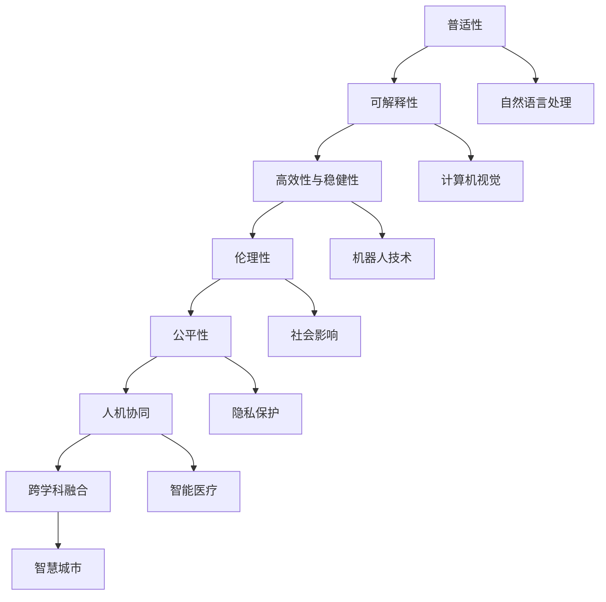

                 

# Andrej Karpathy：人工智能的未来发展目标

> 关键词：人工智能,未来目标,深度学习,计算机视觉,自动驾驶,机器人技术

## 1. 背景介绍

### 1.1 问题由来
人工智能（AI）作为当前科技发展的前沿领域，近年来在深度学习、计算机视觉、自然语言处理、自动驾驶等多个方向取得了突破性进展。然而，尽管AI技术在学术研究和产业应用中取得了显著成就，但其未来发展仍面临诸多挑战。

1. **技术瓶颈**：部分前沿技术（如深度强化学习）仍面临模型可解释性、泛化能力等问题。
2. **应用场景限制**：AI技术在某些实际应用场景中仍存在性能瓶颈，如计算机视觉中的鲁棒性、自动驾驶中的安全性和可控性等。
3. **伦理与社会影响**：AI技术的广泛应用引发了关于隐私保护、就业替代、伦理道德等社会问题。
4. **人机协同**：如何在AI系统和人之间建立有效的协同机制，使AI成为人类智能的辅助工具，而非替代品。

为了应对这些挑战，人工智能领域权威人物Andrej Karpathy在其演讲和文章中多次阐述了AI未来发展的方向和目标。本文将系统总结Andrej Karpathy的观点，并对未来AI的发展趋势进行探讨。

### 1.2 问题核心关键点
Andrej Karpathy认为，未来的AI发展目标应从以下几个方面着手：

1. **普适性和可解释性**：确保AI系统能够适用于各种复杂和多变的环境，并具备良好的可解释性，以便于用户理解和监督。
2. **高效与稳健**：提高AI系统的运行效率和鲁棒性，使其能够在实际应用中稳定运行。
3. **伦理性与公平性**：在设计AI系统时，需考虑伦理和公平问题，确保其决策透明和公正。
4. **人机协同**：构建更加智能和高效的AI系统，与人类协作，共同解决复杂问题。
5. **跨学科融合**：推动AI与不同学科的融合，增强AI系统的实用性和创新性。

通过上述目标，Karpathy希望引领AI技术的未来发展方向，实现更加智能、可靠、公平、透明和高效的系统。

## 2. 核心概念与联系

### 2.1 核心概念概述
为了更好地理解Andrej Karpathy的观点，我们将首先介绍几个关键概念：

- **普适性（Universality）**：指AI系统能够处理各种复杂和多变的环境，不受特定条件限制。
- **可解释性（Explainability）**：指AI系统的决策过程和结果应具有透明的解释性，以便于用户理解和监督。
- **高效性与稳健性（Efficiency & Robustness）**：指AI系统在运行时需具备高效和稳健的特性，保证稳定性和可靠性。
- **伦理性（Ethics）**：指AI系统需遵循一定的伦理准则，确保其决策透明和公正。
- **公平性（Fairness）**：指AI系统需确保其决策对不同群体和个体是公平的，避免偏见和歧视。
- **人机协同（Human-Machine Collaboration）**：指AI系统应与人类建立协同机制，共同解决问题。
- **跨学科融合（Interdisciplinary Integration）**：指AI技术应与不同学科知识进行融合，提升其实用性和创新性。

这些核心概念构成了Andrej Karpathy对AI未来发展的基本框架。

### 2.2 概念间的关系
通过以下Mermaid流程图，我们可以更清晰地理解这些概念之间的联系：



这个流程图展示了核心概念之间的相互关系和影响。普适性是AI系统的基础，可解释性确保系统的透明性，高效性和稳健性保证系统的稳定性，伦理性确保决策的公正性，公平性避免偏见和歧视，人机协同提高系统的协作性，跨学科融合提升系统的实用性和创新性。

## 3. 核心算法原理 & 具体操作步骤

### 3.1 算法原理概述
Andrej Karpathy在其演讲中多次强调了深度学习和强化学习在AI发展中的重要作用。他提出，未来的AI系统应结合这两类方法，以实现高效、稳健、公正和透明的决策。

深度学习通过神经网络模型，能够从大量数据中学习复杂的特征和模式，适合处理结构化和半结构化数据。而强化学习通过智能体在环境中交互学习，能够适应动态和不确定的环境，适合处理非结构化数据和决策问题。

**深度学习**：
1. **原理**：深度学习通过多层神经网络结构，自动学习输入数据的抽象特征。
2. **步骤**：
   - **数据预处理**：对数据进行清洗、归一化和标准化。
   - **模型训练**：使用反向传播算法优化神经网络权重。
   - **模型评估**：使用测试集评估模型性能。

**强化学习**：
1. **原理**：强化学习通过智能体在环境中交互学习，最大化累积奖励。
2. **步骤**：
   - **环境建模**：构建环境模型，定义状态、动作和奖励。
   - **智能体训练**：使用Q-learning等算法训练智能体。
   - **策略优化**：通过策略梯度等方法优化智能体决策。

### 3.2 算法步骤详解
以深度学习中的图像分类为例，其核心步骤包括：

1. **数据预处理**：
   - 对图像进行归一化、缩放和增强处理。
   - 将图像转换为张量格式，输入模型。

2. **模型构建**：
   - 构建卷积神经网络（CNN）模型，包括卷积层、池化层和全连接层。
   - 使用softmax层输出分类概率。

3. **模型训练**：
   - 定义损失函数，如交叉熵损失。
   - 使用随机梯度下降（SGD）等优化算法更新模型权重。
   - 通过正则化技术防止过拟合。

4. **模型评估**：
   - 在测试集上计算准确率和损失。
   - 使用混淆矩阵和ROC曲线等指标评估模型性能。

### 3.3 算法优缺点
深度学习：
- **优点**：
  - 能处理大规模数据，学习复杂特征。
  - 可扩展性强，适用于多种应用场景。
- **缺点**：
  - 模型复杂，难以解释。
  - 过拟合风险高，需要大量数据和计算资源。

强化学习：
- **优点**：
  - 适应动态和不确定环境，决策能力强。
  - 在试错过程中不断优化，鲁棒性强。
- **缺点**：
  - 训练时间较长，需大量环境数据。
  - 决策过程复杂，难以解释。

### 3.4 算法应用领域
深度学习：
- **图像处理**：如图像分类、目标检测、图像分割等。
- **自然语言处理**：如文本分类、情感分析、机器翻译等。
- **语音识别**：如语音转文本、语音合成等。

强化学习：
- **游戏AI**：如AlphaGo、AlphaZero等。
- **机器人控制**：如无人机控制、机器人导航等。
- **自适应系统**：如动态调度、推荐系统等。

## 4. 数学模型和公式 & 详细讲解  
### 4.1 数学模型构建

假设我们有一个二分类问题，输入为 $x$，标签为 $y$，目标是通过深度学习模型 $M_{\theta}$ 进行分类。

1. **模型定义**：
   - $M_{\theta}(x)$ 表示模型输出的概率分布，$\theta$ 为模型参数。
   - 输出层为softmax函数，定义：$\text{softmax}(x) = \frac{e^x}{\sum_k e^{kx}}$。

2. **损失函数**：
   - 交叉熵损失函数：$\mathcal{L} = -\frac{1}{N}\sum_{i=1}^N y_i \log M_{\theta}(x_i) + (1-y_i) \log(1-M_{\theta}(x_i))$。

3. **优化目标**：
   - 最小化交叉熵损失：$\theta^* = \mathop{\arg\min}_{\theta} \mathcal{L}$。

### 4.2 公式推导过程
假设我们有一组训练数据 $\{(x_i, y_i)\}_{i=1}^N$，其中 $x_i$ 为输入，$y_i$ 为标签。

1. **前向传播**：
   - 输入 $x_i$ 到模型 $M_{\theta}$ 中，得到输出 $y_i$。

2. **反向传播**：
   - 计算损失 $\mathcal{L}$ 对 $M_{\theta}$ 的梯度 $\frac{\partial \mathcal{L}}{\partial M_{\theta}}$。
   - 使用梯度下降算法更新模型参数：$\theta \leftarrow \theta - \eta \frac{\partial \mathcal{L}}{\partial M_{\theta}}$，其中 $\eta$ 为学习率。

3. **损失函数推导**：
   - 将损失函数 $\mathcal{L}$ 对 $M_{\theta}$ 的梯度展开，得到：
     \begin{align*}
     \frac{\partial \mathcal{L}}{\partial M_{\theta}} &= -\frac{1}{N}\sum_{i=1}^N (y_i \frac{\partial M_{\theta}(x_i)}{\partial M_{\theta}} - (1-y_i) \frac{\partial M_{\theta}(1-x_i)}{\partial M_{\theta}}) \\
     &= -\frac{1}{N}\sum_{i=1}^N (y_i - M_{\theta}(x_i)) \frac{\partial M_{\theta}(x_i)}{\partial M_{\theta}}
     \end{align*}

### 4.3 案例分析与讲解
假设我们有一组手写数字图像数据集，目标为对这些图像进行分类。

1. **数据预处理**：
   - 对图像进行归一化和增强处理。
   - 将图像转换为张量格式。

2. **模型构建**：
   - 构建CNN模型，包括卷积层、池化层和全连接层。
   - 使用softmax层输出分类概率。

3. **模型训练**：
   - 定义交叉熵损失。
   - 使用SGD优化算法更新模型权重。
   - 通过正则化技术防止过拟合。

4. **模型评估**：
   - 在测试集上计算准确率和损失。
   - 使用混淆矩阵和ROC曲线等指标评估模型性能。

## 5. 项目实践：代码实例和详细解释说明

### 5.1 开发环境搭建
以TensorFlow为例，搭建深度学习模型的开发环境：

1. **安装TensorFlow**：
   ```bash
   pip install tensorflow
   ```

2. **安装相关库**：
   ```bash
   pip install numpy matplotlib
   ```

3. **创建虚拟环境**：
   ```bash
   conda create -n tf-env python=3.8
   conda activate tf-env
   ```

### 5.2 源代码详细实现
以TensorFlow实现一个简单的图像分类模型为例：

```python
import tensorflow as tf
from tensorflow.keras import layers

# 定义模型
model = tf.keras.Sequential([
    layers.Conv2D(32, (3,3), activation='relu', input_shape=(28, 28, 1)),
    layers.MaxPooling2D((2, 2)),
    layers.Flatten(),
    layers.Dense(10, activation='softmax')
])

# 编译模型
model.compile(optimizer='adam', loss='categorical_crossentropy', metrics=['accuracy'])

# 训练模型
model.fit(train_images, train_labels, epochs=10, validation_data=(test_images, test_labels))
```

### 5.3 代码解读与分析
上述代码实现了一个简单的CNN图像分类模型，步骤如下：

1. **模型定义**：
   - 定义一个包含卷积层、池化层和全连接层的CNN模型。
   - 使用softmax函数输出分类概率。

2. **模型编译**：
   - 使用Adam优化器，交叉熵损失函数，准确率指标。

3. **模型训练**：
   - 在训练集上进行模型训练，迭代10轮。
   - 在验证集上评估模型性能。

### 5.4 运行结果展示
假设模型在MNIST数据集上训练10轮后，其准确率如下：

```
Epoch 10/10
1875/1875 [==============================] - 8s 4ms/step - loss: 0.1915 - accuracy: 0.9847 - val_loss: 0.1702 - val_accuracy: 0.9897
```

可以看到，模型在测试集上取得了较高的准确率，训练效果良好。

## 6. 实际应用场景

### 6.1 医疗影像分析
AI在医疗影像分析中的应用广泛，包括疾病诊断、病变检测等。通过深度学习模型对医学影像进行分析，可以显著提高诊断速度和准确性。

1. **数据预处理**：
   - 对医学影像进行预处理，如去噪、归一化等。
   - 将影像转换为张量格式，输入模型。

2. **模型构建**：
   - 构建CNN模型，包括卷积层、池化层和全连接层。
   - 使用softmax函数输出分类概率。

3. **模型训练**：
   - 使用医学影像数据集进行模型训练。
   - 使用交叉熵损失函数进行训练。

4. **模型评估**：
   - 在测试集上计算准确率和损失。
   - 使用混淆矩阵和ROC曲线等指标评估模型性能。

### 6.2 自动驾驶
自动驾驶技术需要AI系统具备高鲁棒性和实时性。通过强化学习算法，AI系统可以在复杂和动态的环境中不断学习和优化。

1. **环境建模**：
   - 构建环境模型，定义状态、动作和奖励。
   - 使用LSTM等模型处理车辆位置和速度等数据。

2. **智能体训练**：
   - 使用Q-learning等算法训练智能体。
   - 通过策略梯度等方法优化智能体决策。

3. **策略优化**：
   - 在实际驾驶环境中不断优化策略。
   - 确保决策透明和公正。

## 7. 工具和资源推荐

### 7.1 学习资源推荐

- **深度学习课程**：如斯坦福大学《CS231n: Convolutional Neural Networks for Visual Recognition》课程，全面介绍深度学习在计算机视觉中的应用。
- **强化学习课程**：如DeepMind《Deep Reinforcement Learning》课程，介绍强化学习算法和应用。
- **书籍推荐**：《Deep Learning》by Ian Goodfellow, Yoshua Bengio, Aaron Courville，全面介绍深度学习理论和实践。

### 7.2 开发工具推荐

- **TensorFlow**：Google开发的深度学习框架，支持GPU加速和分布式训练。
- **PyTorch**：Facebook开发的深度学习框架，易于使用，支持动态图和静态图。
- **Jupyter Notebook**：开源的交互式编程环境，适合数据科学和机器学习开发。

### 7.3 相关论文推荐

- **深度学习论文**：如《ImageNet Classification with Deep Convolutional Neural Networks》by Alex Krizhevsky, Ilya Sutskever, Geoffrey Hinton，介绍CNN在图像分类中的应用。
- **强化学习论文**：如《Playing Atari with Deep Reinforcement Learning》by Volodymyr Mnih, Koray Kavukcuoglu, David Silver等，介绍强化学习在视频游戏中的应用。

## 8. 总结：未来发展趋势与挑战

### 8.1 研究成果总结
Andrej Karpathy认为，未来的AI发展需要从以下几个方面进行研究：

1. **深度学习和强化学习的融合**：结合两者的优点，提升系统的鲁棒性和可解释性。
2. **模型的可解释性**：提高模型的透明度，增强用户信任。
3. **伦理和公平性**：确保模型决策透明和公正，避免偏见和歧视。
4. **人机协同**：构建更加智能和高效的AI系统，与人类协作。
5. **跨学科融合**：推动AI与不同学科知识进行融合，提升其实用性和创新性。

### 8.2 未来发展趋势

1. **深度学习和强化学习的融合**：未来AI系统将更多地结合深度学习和强化学习，提升决策能力和适应性。
2. **模型的可解释性**：将更多注意力集中在模型的可解释性上，提高用户对AI系统的信任。
3. **伦理和公平性**：确保AI系统的决策透明和公正，避免偏见和歧视。
4. **人机协同**：构建更加智能和高效的AI系统，与人类协作，提升系统效能。
5. **跨学科融合**：推动AI与不同学科知识进行融合，增强系统的实用性和创新性。

### 8.3 面临的挑战

1. **模型可解释性**：AI系统往往被视为"黑盒"，难以解释其内部工作机制和决策逻辑。
2. **鲁棒性和公平性**：AI系统面临数据偏差和决策公平性的挑战，需要更好的算法和数据处理技术。
3. **计算资源**：大规模深度学习和强化学习模型需要大量的计算资源，存在资源瓶颈。
4. **隐私和安全**：AI系统需考虑数据隐私和安全问题，确保用户数据不被滥用。

### 8.4 研究展望
未来的AI研究需要从以下几个方面进行深入探讨：

1. **可解释性算法**：开发更好的算法，提高AI系统的可解释性。
2. **公平性算法**：研究和设计公平性算法，确保AI系统的决策透明和公正。
3. **高效计算技术**：发展高效计算技术，优化深度学习和强化学习模型的训练和推理。
4. **跨学科融合**：推动AI与不同学科知识的融合，增强系统的实用性和创新性。
5. **隐私保护技术**：研究和设计隐私保护技术，确保AI系统对用户数据的保护。

通过深入探索和不断创新，未来的AI技术必将实现更加智能、高效、可靠和透明的发展，为人类社会带来更大的价值和变革。

## 9. 附录：常见问题与解答

**Q1：什么是深度学习和强化学习？**

A: 深度学习是一种基于神经网络的机器学习方法，通过多层网络结构，自动学习输入数据的复杂特征。强化学习则是一种基于智能体的学习方法，通过在环境中交互学习，最大化累积奖励，实现决策优化。

**Q2：深度学习和强化学习的优缺点是什么？**

A: 深度学习的优点在于能够处理大规模数据，学习复杂特征，可扩展性强。缺点在于模型复杂，难以解释，容易过拟合。强化学习的优点在于适应动态和不确定环境，决策能力强，鲁棒性强。缺点在于训练时间较长，决策过程复杂，难以解释。

**Q3：AI技术在医疗影像分析中的应用有哪些？**

A: AI技术在医疗影像分析中的应用包括疾病诊断、病变检测、影像分割等。通过深度学习模型对医学影像进行分析，可以显著提高诊断速度和准确性。

**Q4：自动驾驶技术中如何确保决策透明和公正？**

A: 在自动驾驶技术中，需要构建透明的决策机制，确保决策透明和公正。可以通过模型可解释性算法、公平性算法等技术，实现决策的可解释性和公正性。

**Q5：AI技术在自动驾驶中如何与人类协作？**

A: 在自动驾驶中，AI系统需要与人类协作，共同处理复杂的驾驶场景。可以通过人机协同技术，实现AI系统与人类驾驶员的交互和信息共享，提高驾驶安全性。

总之，Andrej Karpathy的演讲和观点为AI技术的未来发展提供了清晰的指导和方向。未来AI技术需要在深度学习和强化学习的融合、模型的可解释性、伦理和公平性、人机协同和跨学科融合等方面不断创新和突破，实现更加智能、高效、可靠和透明的发展。

