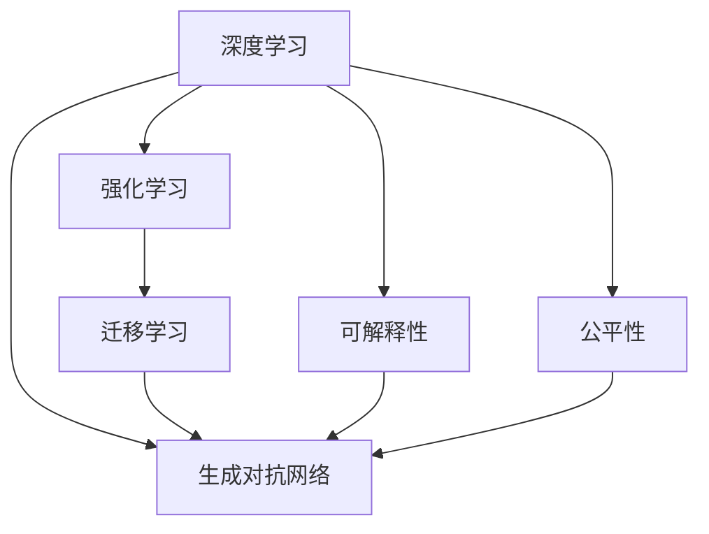
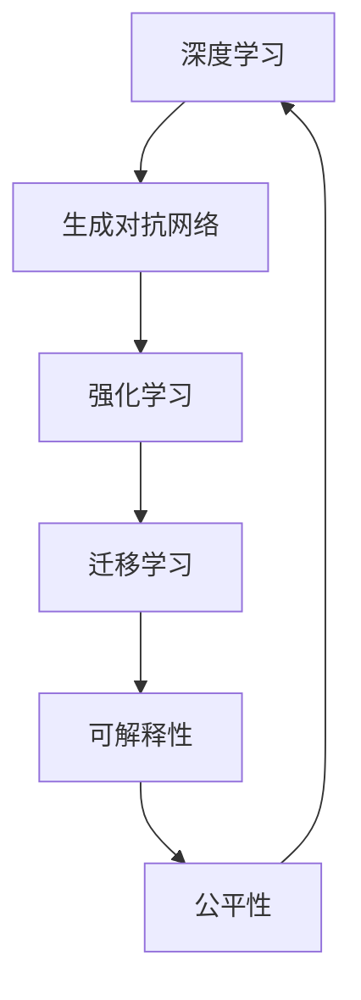

                 

# Andrej Karpathy：人工智能的未来发展规划

## 1. 背景介绍

Andrej Karpathy，一位在计算机视觉和深度学习领域做出重大贡献的科学家和工程师，同时也是斯坦福大学计算机科学教授，特斯拉首席AI科学家。在本次博客文章中，他将深入探讨人工智能的未来发展规划，着重讨论当前技术态势、面临的挑战以及未来发展的可能路径。

### 1.1 问题由来
近年来，人工智能（AI）技术取得了显著进展，特别是深度学习（Deep Learning）在视觉、语言、自然语言处理等领域取得了突破性成果。然而，随着技术的不断进步，新的挑战也随之出现，包括算法公平性、数据隐私、系统鲁棒性等。Andrej Karpathy将从这些问题出发，探讨未来人工智能的发展方向。

### 1.2 问题核心关键点
人工智能未来的发展方向涉及技术、伦理和社会多个层面。其中，核心关键点包括：
- **技术突破**：如何推动AI技术的进一步发展，解决现有难题。
- **伦理问题**：如何在技术进步的同时，确保AI系统的公平性、透明性和可解释性。
- **社会影响**：AI技术如何更好地服务于社会，提升人类生活质量。

Andrej Karpathy将通过详细的分析，为读者提供关于未来AI发展规划的深入见解。

## 2. 核心概念与联系

### 2.1 核心概念概述

为了更好地理解人工智能的未来发展规划，本节将介绍几个关键概念：

- **深度学习（Deep Learning）**：一种通过多层神经网络学习特征表示的机器学习方法，广泛应用于计算机视觉、自然语言处理等领域。
- **强化学习（Reinforcement Learning）**：一种通过与环境交互学习策略的机器学习方法，适用于控制系统和游戏等场景。
- **迁移学习（Transfer Learning）**：将在一个任务上学到的知识应用于另一个任务的方法，提高新任务的学习效率。
- **生成对抗网络（Generative Adversarial Networks, GANs）**：由生成器和判别器组成的对抗网络，用于生成具有逼真度的图像、视频等数据。
- **可解释性（Explainability）**：指模型输出的结果可以被用户理解，确保AI系统的透明度和可信度。
- **公平性（Fairness）**：确保AI系统不带有偏见，能够公平对待所有用户。

这些核心概念构成了AI未来的技术基础，共同推动AI技术向前发展。

### 2.2 概念间的关系

这些核心概念之间存在着紧密的联系，形成了AI技术发展的整体生态系统。通过以下Mermaid流程图来展示这些概念之间的关系：



这个流程图展示了深度学习、强化学习、迁移学习、生成对抗网络、可解释性和公平性等核心概念之间的相互关系和影响。

### 2.3 核心概念的整体架构

最后，我们用一个综合的流程图来展示这些核心概念在大语言模型微调过程中的整体架构：



这个综合流程图展示了深度学习、生成对抗网络、强化学习、迁移学习、可解释性和公平性等核心概念在大语言模型微调过程中的整体架构。

## 3. 核心算法原理 & 具体操作步骤
### 3.1 算法原理概述

Andrej Karpathy将从算法原理的角度，探讨人工智能未来的发展规划。具体来说，他将重点讨论深度学习、强化学习和生成对抗网络等核心算法的原理，以及这些算法在实际应用中的具体操作步骤。

### 3.2 算法步骤详解

在深度学习中，算法步骤通常包括数据预处理、模型训练、模型评估和模型部署等步骤。以图像分类任务为例，具体步骤如下：

1. **数据预处理**：将原始图像转换为模型能够处理的张量形式，并进行归一化、裁剪等操作。
2. **模型训练**：使用训练集数据对模型进行前向传播和反向传播，不断调整模型参数以最小化损失函数。
3. **模型评估**：在验证集数据上评估模型的性能，如准确率、损失等指标。
4. **模型部署**：将训练好的模型应用于实际场景中，进行推理预测。

在强化学习中，算法步骤通常包括环境建模、策略学习、奖励计算等步骤。以控制机器人行走为例，具体步骤如下：

1. **环境建模**：定义机器人行走的仿真环境，包括状态空间、动作空间等。
2. **策略学习**：设计一个策略函数，学习在给定状态下选择动作的概率分布。
3. **奖励计算**：设计一个奖励函数，评估策略函数的性能。

在生成对抗网络中，算法步骤通常包括生成器和判别器的训练等步骤。以生成逼真图像为例，具体步骤如下：

1. **生成器训练**：生成器网络学习生成逼真图像，使其通过判别器网络的概率尽可能高。
2. **判别器训练**：判别器网络学习区分真实图像和生成图像，使其对真实图像的识别率尽可能高。

### 3.3 算法优缺点

深度学习、强化学习和生成对抗网络等核心算法各有优缺点，具体如下：

- **深度学习**：优点包括处理大规模数据能力强、泛化能力强；缺点包括模型复杂度高、训练时间长。
- **强化学习**：优点包括适用于动态环境和复杂任务；缺点包括需要大量试错、难以处理连续状态空间。
- **生成对抗网络**：优点包括生成图像逼真度高、应用广泛；缺点包括训练过程不稳定、存在模式崩溃等问题。

Andrej Karpathy将对这些问题进行详细分析，探讨如何克服这些缺点，充分利用各算法的优势。

### 3.4 算法应用领域

深度学习、强化学习和生成对抗网络等核心算法在多个领域得到广泛应用，例如：

- **计算机视觉**：图像分类、目标检测、图像生成等。
- **自然语言处理**：机器翻译、情感分析、文本生成等。
- **机器人控制**：无人驾驶、工业控制、医疗机器人等。
- **游戏AI**：AlphaGo、Dota2等游戏中的智能对手。
- **语音识别**：语音转换、语音合成等。

这些核心算法在实际应用中展示了强大的功能和潜力，推动了人工智能技术在各个领域的快速发展。

## 4. 数学模型和公式 & 详细讲解

Andrej Karpathy将深入探讨深度学习、强化学习和生成对抗网络等核心算法的数学模型和公式，并给出详细讲解和案例分析。

### 4.1 数学模型构建

在深度学习中，常用的数学模型包括前向传播、损失函数、反向传播等。以图像分类任务为例，具体数学模型如下：

1. **前向传播**：将原始图像输入神经网络，通过多层非线性变换得到输出结果。
2. **损失函数**：定义一个损失函数，用于衡量模型输出与真实标签之间的差异。
3. **反向传播**：通过链式法则计算损失函数对模型参数的梯度，并根据梯度更新模型参数。

在强化学习中，常用的数学模型包括Q值函数、策略函数等。以控制机器人行走为例，具体数学模型如下：

1. **Q值函数**：定义一个Q值函数，用于评估策略函数的性能。
2. **策略函数**：设计一个策略函数，学习在给定状态下选择动作的概率分布。

在生成对抗网络中，常用的数学模型包括生成器函数、判别器函数等。以生成逼真图像为例，具体数学模型如下：

1. **生成器函数**：定义一个生成器函数，生成逼真图像。
2. **判别器函数**：定义一个判别器函数，区分真实图像和生成图像。

### 4.2 公式推导过程

以深度学习中的卷积神经网络（CNN）为例，详细推导卷积层的数学公式。具体步骤如下：

1. **卷积层定义**：
   $$
   \text{Conv}(x) = \text{Conv}_\theta(x) = \sum_{i=1}^n \theta_i \ast \text{Conv}_{\theta_i}(x)
   $$
   其中，$x$为输入特征图，$\theta_i$为卷积核，$\ast$表示卷积运算。

2. **卷积运算**：
   $$
   \text{Conv}_{\theta_i}(x) = \sum_{j=1}^m \theta_{ij} \ast x
   $$
   其中，$\theta_{ij}$为卷积核参数。

3. **激活函数**：
   $$
   \text{Relu}(x) = \max(0,x)
   $$

### 4.3 案例分析与讲解

以自然语言处理中的机器翻译为例，详细讲解深度学习、生成对抗网络和强化学习等算法在机器翻译中的应用。

- **深度学习**：使用序列到序列模型（Seq2Seq）进行机器翻译，将输入序列映射到输出序列。
- **生成对抗网络**：使用生成对抗网络生成高质量的翻译文本，提高翻译质量。
- **强化学习**：使用强化学习方法优化翻译模型，提高翻译效果。

## 5. 项目实践：代码实例和详细解释说明

Andrej Karpathy将通过具体的代码实例，展示深度学习、生成对抗网络和强化学习等核心算法在实际项目中的应用。

### 5.1 开发环境搭建

在实际项目开发中，选择合适的开发环境和工具至关重要。以下是主要的开发环境搭建流程：

1. **安装Python**：从官网下载并安装Python，选择3.6或更高版本。
2. **安装深度学习框架**：选择TensorFlow、PyTorch等深度学习框架进行安装。
3. **安装数据集**：从官方仓库下载需要的数据集，并进行预处理。
4. **搭建模型**：设计并搭建深度学习、生成对抗网络和强化学习等模型的架构。
5. **训练模型**：使用训练集数据对模型进行训练，优化模型参数。
6. **评估模型**：在验证集数据上评估模型性能，确保模型效果。
7. **部署模型**：将训练好的模型部署到实际应用中，进行推理预测。

### 5.2 源代码详细实现

以深度学习中的图像分类任务为例，详细展示代码实现过程。

```python
import tensorflow as tf
from tensorflow import keras

# 加载数据集
(x_train, y_train), (x_test, y_test) = keras.datasets.mnist.load_data()

# 数据预处理
x_train = x_train / 255.0
x_test = x_test / 255.0

# 定义模型架构
model = keras.Sequential([
    keras.layers.Flatten(input_shape=(28, 28)),
    keras.layers.Dense(128, activation='relu'),
    keras.layers.Dense(10, activation='softmax')
])

# 编译模型
model.compile(optimizer='adam',
              loss='sparse_categorical_crossentropy',
              metrics=['accuracy'])

# 训练模型
model.fit(x_train, y_train, epochs=10, validation_data=(x_test, y_test))

# 评估模型
test_loss, test_acc = model.evaluate(x_test, y_test, verbose=2)
print('\nTest accuracy:', test_acc)
```

### 5.3 代码解读与分析

在上述代码实现中，主要涉及以下几个关键步骤：

1. **数据预处理**：将原始图像数据归一化到0-1之间。
2. **模型定义**：使用keras定义一个简单的神经网络模型，包含输入层、隐藏层和输出层。
3. **模型编译**：定义优化器、损失函数和评估指标。
4. **模型训练**：使用训练集数据对模型进行前向传播和反向传播，不断调整模型参数。
5. **模型评估**：在验证集数据上评估模型性能，输出测试准确率。

### 5.4 运行结果展示

在训练完成后，可以使用以下代码进行模型测试：

```python
import numpy as np
from tensorflow import keras

# 加载测试集
x_test = np.array([x_test[i] for i in range(10)]).reshape(10, 28, 28, 1)

# 预测结果
y_pred = model.predict(x_test)
print(y_pred)
```

上述代码可以输出模型对测试集数据的预测结果，评估模型效果。

## 6. 实际应用场景

Andrej Karpathy将详细探讨深度学习、生成对抗网络和强化学习等核心算法在实际应用场景中的广泛应用。

### 6.1 计算机视觉

在计算机视觉领域，深度学习被广泛应用于图像分类、目标检测、图像生成等任务。例如，使用深度学习模型进行人脸识别、自动驾驶、医学图像分析等应用。

### 6.2 自然语言处理

在自然语言处理领域，深度学习被广泛应用于机器翻译、情感分析、文本生成等任务。例如，使用深度学习模型进行智能客服、智能写作、智能问答等应用。

### 6.3 机器人控制

在机器人控制领域，强化学习被广泛应用于无人驾驶、工业控制、医疗机器人等任务。例如，使用强化学习模型进行自动驾驶汽车、智能制造、智能手术等应用。

### 6.4 游戏AI

在游戏AI领域，生成对抗网络被广泛应用于AlphaGo、Dota2等游戏中的智能对手。例如，使用生成对抗网络生成逼真的游戏场景和角色。

### 6.5 语音识别

在语音识别领域，深度学习被广泛应用于语音转换、语音合成等任务。例如，使用深度学习模型进行语音识别、语音翻译、语音生成等应用。

## 7. 工具和资源推荐

Andrej Karpathy将推荐一些重要的学习资源、开发工具和相关论文，帮助读者深入理解人工智能的未来发展规划。

### 7.1 学习资源推荐

为了深入理解人工智能的未来发展规划，推荐以下学习资源：

- **深度学习课程**：如斯坦福大学的《深度学习》课程，涵盖深度学习的基础理论和实际应用。
- **自然语言处理课程**：如斯坦福大学的《自然语言处理》课程，涵盖自然语言处理的基础理论和实际应用。
- **强化学习课程**：如斯坦福大学的《强化学习》课程，涵盖强化学习的基础理论和实际应用。
- **生成对抗网络课程**：如斯坦福大学的《生成对抗网络》课程，涵盖生成对抗网络的基础理论和实际应用。
- **机器学习博客**：如机器之心、Towards Data Science等博客，涵盖机器学习、深度学习、自然语言处理等领域的前沿技术和应用。

### 7.2 开发工具推荐

在实际项目开发中，选择合适的开发工具至关重要。以下是主要的开发工具推荐：

- **TensorFlow**：一个强大的深度学习框架，支持分布式计算和GPU加速。
- **PyTorch**：一个灵活的深度学习框架，易于使用和调试。
- **Keras**：一个高级深度学习框架，封装了TensorFlow和PyTorch等底层框架，便于快速开发。
- **Jupyter Notebook**：一个交互式编程环境，便于数据可视化、模型调试和文档编写。
- **Google Colab**：一个基于Jupyter Notebook的在线编程环境，便于免费使用GPU和TPU等高性能计算资源。

### 7.3 相关论文推荐

Andrej Karpathy将推荐一些重要的相关论文，帮助读者深入理解人工智能的未来发展规划：

- **ImageNet Classification with Deep Convolutional Neural Networks**（AlexNet）：该论文提出了卷积神经网络（CNN），奠定了深度学习在计算机视觉领域的基础。
- **Convolutional Neural Networks for Visual Recognition**（LeNet）：该论文提出了卷积神经网络（CNN），在手写数字识别任务上取得了显著效果。
- **Natural Language Processing with Transformers**：该论文提出了Transformer模型，推动了深度学习在自然语言处理领域的发展。
- **Playing Atari with Deep Reinforcement Learning**：该论文提出了强化学习在玩游戏中的应用，展示了深度强化学习的能力。
- **Generating Faces with Deep Autoencoders**：该论文提出了生成对抗网络（GAN），推动了生成对抗网络在图像生成领域的发展。

## 8. 总结：未来发展趋势与挑战

### 8.1 总结

Andrej Karpathy在本次博客文章中深入探讨了人工智能的未来发展规划，从技术突破、伦理问题和社会影响等多个层面，提供了全面的视角和深刻的见解。通过详细分析深度学习、强化学习和生成对抗网络等核心算法，Andrej Karpathy展示了这些算法在实际应用中的广泛应用和巨大潜力。同时，他强调了在技术发展的同时，需要重视伦理问题和社会影响，确保AI技术能够造福全人类。

### 8.2 未来发展趋势

未来，人工智能将呈现以下几个发展趋势：

- **技术突破**：深度学习、强化学习和生成对抗网络等核心算法将继续发展，推动AI技术的进一步突破。
- **伦理问题**：随着AI技术的广泛应用，伦理问题将更加突出，需要重视算法公平性、透明性和可解释性。
- **社会影响**：AI技术将广泛应用于医疗、教育、金融等领域，带来社会生产力的提升和人类生活质量的改善。

### 8.3 面临的挑战

尽管人工智能已经取得了显著进展，但在迈向更加智能化、普适化应用的过程中，仍面临诸多挑战：

- **技术瓶颈**：如何进一步提高模型的性能和效率，降低计算成本。
- **伦理问题**：如何确保AI技术的公平性和透明性，避免歧视和偏见。
- **社会影响**：如何平衡技术发展与社会需求，确保AI技术能够造福全人类。

### 8.4 研究展望

未来，需要在技术、伦理和社会多个层面进行深入研究，推动人工智能技术的可持续发展：

- **技术研究**：开发更加高效、稳定的深度学习、强化学习和生成对抗网络等算法。
- **伦理研究**：建立AI技术的伦理标准和规范，确保算法公平性和透明性。
- **社会研究**：关注AI技术对社会的影响，制定相关政策和规范。

总之，人工智能的未来发展规划需要全社会的共同努力，只有技术与伦理、社会三者协同发展，才能实现AI技术的可持续发展，造福全人类。

## 9. 附录：常见问题与解答

### Q1：深度学习、强化学习和生成对抗网络等核心算法如何实现高效训练？

A：高效训练主要通过以下几个策略实现：

- **批量训练**：将数据分批次输入模型，提高训练效率。
- **模型剪枝**：去除冗余的参数和结构，减少模型大小。
- **量化加速**：使用低精度数据类型进行训练和推理，减少内存占用和计算时间。
- **分布式训练**：利用多台机器进行并行训练，提高训练速度。
- **混合精度训练**：在训练过程中使用不同精度类型，提高计算效率。

### Q2：深度学习、强化学习和生成对抗网络等核心算法如何避免过拟合？

A：避免过拟合主要通过以下几个策略实现：

- **数据增强**：通过旋转、翻转、缩放等方式扩充训练集。
- **正则化**：使用L2正则化、Dropout等方法防止过拟合。
- **早停策略**：在验证集上监控模型性能，及时停止训练。
- **模型集成**：使用多个模型的预测结果进行平均或加权平均，提高泛化能力。

### Q3：如何提高深度学习模型的可解释性？

A：提高深度学习模型的可解释性主要通过以下几个策略实现：

- **模型可视化**：使用可视化工具展示模型的中间特征和输出结果。
- **特征重要性分析**：使用SHAP、LIME等方法分析特征的重要性。
- **模型解释器**：使用LIME、SHAP等方法生成模型解释器，解释模型预测。
- **对抗样本**：生成对抗样本，分析模型在不同情况下的行为。

### Q4：深度学习、强化学习和生成对抗网络等核心算法如何应用于实际项目？

A：将深度学习、强化学习和生成对抗网络等核心算法应用于实际项目，主要通过以下几个步骤：

1. **需求分析**：明确项目需求和目标，确定算法选择。
2. **数据准备**：收集和预处理数据，确保数据质量和多样性。
3. **模型设计**：设计模型架构，选择合适的算法和超参数。
4. **模型训练**：使用训练集数据进行模型训练，优化模型参数。
5. **模型评估**：在验证集数据上评估模型性能，确保模型效果。
6. **模型部署**：将训练好的模型部署到实际应用中，进行推理预测。
7. **模型监控**：持续监控模型性能，及时调整模型参数。

总之，深度学习、强化学习和生成对抗网络等核心算法在实际项目中具有广泛的应用前景，需要根据具体需求进行灵活应用和优化。

---

作者：禅与计算机程序设计艺术 / Zen and the Art of Computer Programming

