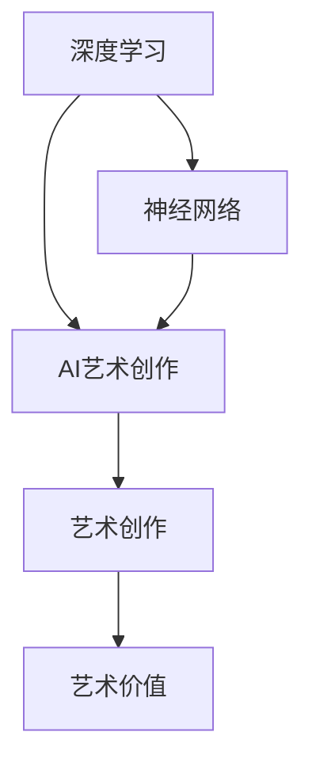
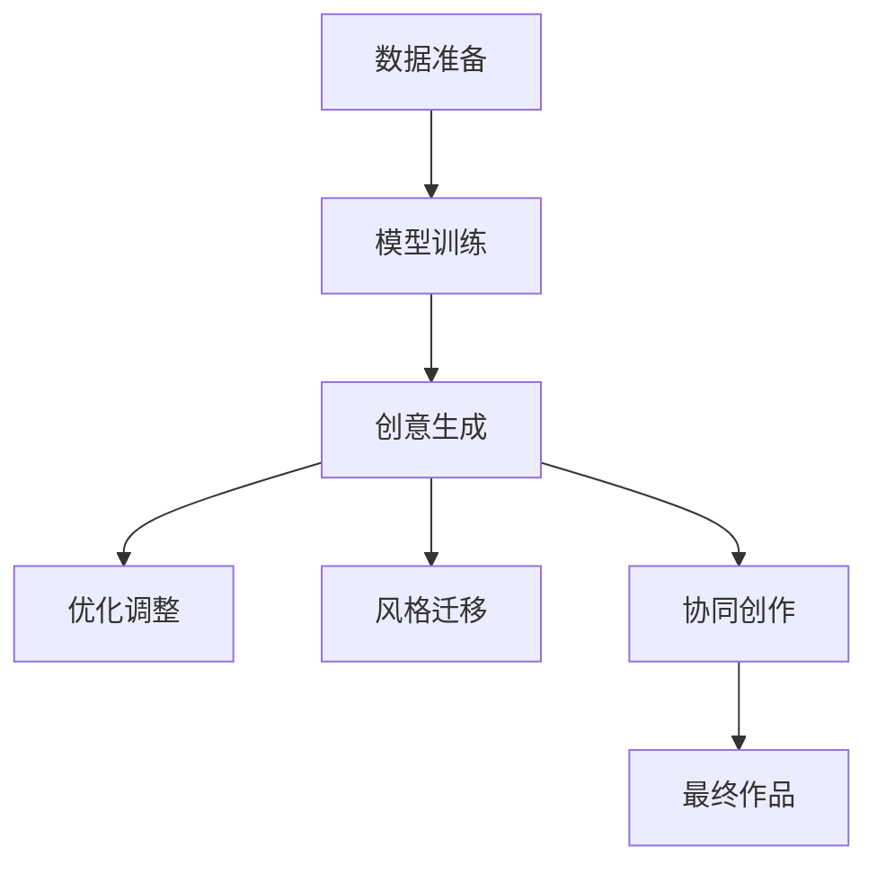

                 

# Andrej Karpathy：人工智能的艺术价值

> 关键词：人工智能,Andrej Karpathy,艺术价值,深度学习,神经网络

## 1. 背景介绍

### 1.1 问题由来
近年来，人工智能（AI）技术飞速发展，从图像识别、语音识别到自然语言处理、自动驾驶等领域，AI技术正以前所未有的速度改变着我们的生活和工作方式。然而，尽管AI技术在技术层面取得了显著进展，其在艺术创作、审美感知、情感表达等方面的应用价值却鲜少被提及。这一方面是因为AI艺术创作还处于探索阶段，缺乏成熟的理论体系；另一方面，AI的"冷冰冰"特性与人类艺术的"温情感"特性存在较大差异。

### 1.2 问题核心关键点
本文将重点探讨Andrej Karpathy在AI艺术创作领域的贡献，并尝试解析AI在艺术价值实现中的独特角色和潜力。Andrej Karpathy作为人工智能领域的重要人物，其对深度学习、神经网络的深入研究，以及其在AI艺术创作中的创新实践，为我们提供了新的视角。

### 1.3 问题研究意义
研究Andrej Karpathy在AI艺术创作中的探索和实践，有助于我们更深入理解AI技术在艺术价值实现中的潜力，推动AI与艺术创作的结合，拓展AI技术的应用边界，为未来AI艺术的发展奠定基础。此外，对AI艺术价值的探讨，也能够引发更多人对AI技术应用伦理、文化价值等问题的思考，推动AI技术与人文社会的和谐发展。

## 2. 核心概念与联系

### 2.1 核心概念概述

Andrej Karpathy是一位在深度学习、计算机视觉领域有着卓越贡献的科学家。其研究主要集中在图像生成、视频分析、自动驾驶等领域。但近年来，Andrej Karpathy开始探索AI在艺术创作中的可能性，他的工作不仅推动了AI技术在艺术领域的应用，也为我们重新思考AI的价值提供了新的视角。

在探讨AI艺术价值时，我们首先需要理解以下核心概念：

- **深度学习**：一种基于多层神经网络的机器学习方法，能够自动学习数据中的复杂模式，并用于图像识别、自然语言处理等任务。
- **神经网络**：由多个神经元组成的网络结构，能够对输入数据进行复杂的非线性变换。
- **艺术创作**：指艺术家通过创意和技巧，将内在情感、思想转化为具体的艺术作品。
- **AI艺术创作**：指通过AI技术，将创意和技巧转化为艺术作品的过程，包括生成、优化、风格转换等。

这些核心概念共同构成了AI艺术创作的基础，其间的联系和相互作用是理解和实践AI艺术价值的关键。

### 2.2 概念间的关系

Andrej Karpathy的工作涵盖了深度学习、神经网络、AI艺术创作等多个领域，其核心思想是将AI技术与艺术创作相结合，探索AI在艺术价值实现中的潜力。以下是这些核心概念之间的逻辑关系：



这个流程图展示了深度学习和神经网络如何支持AI艺术创作，AI艺术创作又如何将创意和技巧转化为艺术作品，最终实现艺术价值的过程。通过这个关系图，我们可以看到，AI艺术创作不仅仅是技术的应用，更是对创意和技巧的重新定义和实现。

## 3. 核心算法原理 & 具体操作步骤

### 3.1 算法原理概述

AI艺术创作的核心算法原理主要包括以下几个方面：

- **数据驱动的创意生成**：通过训练大量数据，AI模型可以学习到各种创意和风格，并生成新的艺术作品。
- **基于目标的优化**：AI模型可以通过目标函数，如对抗网络（GANs）、变分自编码器（VAEs）等，对生成的艺术作品进行优化，提高其质量和风格一致性。
- **风格迁移**：通过将艺术作品的风格迁移到新的数据上，AI模型可以生成风格独特的艺术作品。
- **协同创作**：AI模型可以与人类艺术家协同创作，生成兼具人类智慧和AI技术的艺术作品。

这些原理共同构成了AI艺术创作的算法基础，使得AI能够在大规模数据和复杂创意之间建立联系，实现从数据到艺术的转换。

### 3.2 算法步骤详解

AI艺术创作的具体操作步骤可以分为以下几个步骤：

1. **数据准备**：收集和准备用于训练的数据集，包括各种艺术风格、艺术家风格、现实世界数据等。
2. **模型训练**：使用深度学习模型（如GANs、VAEs）对数据进行训练，学习创意和风格。
3. **创意生成**：使用训练好的模型生成新的艺术作品。
4. **优化调整**：根据目标函数，对生成的作品进行优化，提高质量和风格一致性。
5. **风格迁移**：将作品的风格迁移到新的数据上，生成风格独特的作品。
6. **协同创作**：与人类艺术家合作，共同创作具有人类智慧和AI技术的艺术作品。

以下是一个简单的流程图，展示了这些步骤：



### 3.3 算法优缺点

AI艺术创作在创意生成、风格迁移、协同创作等方面具有显著优势，但也存在一些局限性：

**优点**：
1. **高效性**：AI模型可以快速生成大量艺术作品，大大节省创作时间。
2. **多样性**：AI模型能够生成多种风格、多种主题的艺术作品，提供丰富的创作素材。
3. **自动化**：AI模型可以自动生成作品，减少人力成本，提高创作效率。

**缺点**：
1. **缺乏深度**：AI创作的艺术作品可能缺乏深度和情感，难以传达复杂的人类情感和思想。
2. **技术限制**：当前的AI模型仍然依赖于大量的数据和计算资源，对数据的理解和创作仍然存在局限性。
3. **伦理风险**：AI创作的艺术作品可能涉及版权、隐私等问题，引发伦理争议。

### 3.4 算法应用领域

AI艺术创作在多个领域具有广泛的应用前景：

- **艺术创作**：AI可以辅助艺术家进行创意生成、风格迁移等，提供更多的创作灵感和素材。
- **教育培训**：AI可以用于艺术教育，帮助学生掌握创意和技巧，提升艺术创作能力。
- **娱乐产业**：AI可以生成多种风格的娱乐作品，如电影、游戏、动画等，满足观众的娱乐需求。
- **文化交流**：AI可以用于文化交流，通过生成多种语言和文化背景的艺术作品，促进不同文化之间的理解和融合。

## 4. 数学模型和公式 & 详细讲解

### 4.1 数学模型构建

AI艺术创作的数学模型构建主要基于深度学习模型，以生成对抗网络（GANs）为例，其基本框架为：

$$
G(z) = \mu(z) + \sigma(z)\epsilon
$$

其中，$G(z)$表示生成器，将随机噪声$z$转化为艺术作品；$\mu(z)$和$\sigma(z)$表示生成器的均值和方差；$\epsilon$表示标准正态分布的随机变量。

### 4.2 公式推导过程

GANs的目标函数为：

$$
L(G, D) = E_{x\sim p_{data}}[\log D(x)] + E_{z\sim p(z)}[\log (1 - D(G(z)))]
$$

其中，$L(G, D)$表示生成器和判别器的联合损失函数，$D(x)$表示判别器对真实样本的判别概率，$D(G(z))$表示判别器对生成样本的判别概率。

通过反向传播算法，可以计算生成器和判别器的梯度，更新模型参数。最终，生成器$G(z)$可以生成高质量的艺术作品。

### 4.3 案例分析与讲解

假设我们希望生成一幅梵高的《星夜》风格的艺术作品。首先，我们需要收集大量梵高的《星夜》风格的图像数据，训练一个生成器模型。然后，使用生成器生成新的《星夜》风格的艺术作品。在优化阶段，我们可以通过调整生成器的参数，提高生成的作品与《星夜》风格的相似度。最终，我们得到了一幅新的《星夜》风格的艺术作品。

## 5. 项目实践：代码实例和详细解释说明

### 5.1 开发环境搭建

要实践AI艺术创作，我们需要搭建Python开发环境，安装深度学习库，如TensorFlow、PyTorch等。以下是一个简单的Python环境配置流程：

1. 安装Anaconda：从官网下载并安装Anaconda，用于创建独立的Python环境。
2. 创建并激活虚拟环境：
```bash
conda create -n pytorch-env python=3.8 
conda activate pytorch-env
```
3. 安装PyTorch：根据CUDA版本，从官网获取对应的安装命令。例如：
```bash
conda install pytorch torchvision torchaudio cudatoolkit=11.1 -c pytorch -c conda-forge
```
4. 安装TensorFlow：
```bash
pip install tensorflow==2.6.0
```
5. 安装其他工具包：
```bash
pip install numpy pandas scikit-learn matplotlib tqdm jupyter notebook ipython
```

完成上述步骤后，即可在`pytorch-env`环境中开始AI艺术创作的实践。

### 5.2 源代码详细实现

以下是一个简单的GANs模型代码实现，用于生成梵高的《星夜》风格的艺术作品：

```python
import tensorflow as tf
import numpy as np
from tensorflow.keras import layers, models

# 定义生成器模型
def make_generator_model():
    model = models.Sequential()
    model.add(layers.Dense(256, use_bias=False, input_shape=(100,)))
    model.add(layers.BatchNormalization())
    model.add(layers.LeakyReLU())
    model.add(layers.Dropout(0.2))
    model.add(layers.Dense(512))
    model.add(layers.BatchNormalization())
    model.add(layers.LeakyReLU())
    model.add(layers.Dropout(0.2))
    model.add(layers.Dense(1024))
    model.add(layers.BatchNormalization())
    model.add(layers.LeakyReLU())
    model.add(layers.Dropout(0.2))
    model.add(layers.Dense(784, activation='tanh'))
    return model

# 定义判别器模型
def make_discriminator_model():
    model = models.Sequential()
    model.add(layers.Flatten(input_shape=(28, 28, 1)))
    model.add(layers.Dense(1024))
    model.add(layers.LeakyReLU())
    model.add(layers.Dropout(0.2))
    model.add(layers.Dense(512))
    model.add(layers.LeakyReLU())
    model.add(layers.Dropout(0.2))
    model.add(layers.Dense(256))
    model.add(layers.LeakyReLU())
    model.add(layers.Dropout(0.2))
    model.add(layers.Dense(1, activation='sigmoid'))
    return model

# 定义损失函数和优化器
cross_entropy = tf.keras.losses.BinaryCrossentropy(from_logits=True)
generator_optimizer = tf.keras.optimizers.Adam(1e-4)
discriminator_optimizer = tf.keras.optimizers.Adam(1e-4)

# 定义数据集
(X_train, y_train), (X_test, y_test) = tf.keras.datasets.mnist.load_data()
X_train = X_train.reshape(X_train.shape[0], 28, 28, 1).astype('float32')
X_train = (X_train - 127.5) / 127.5  # 标准化
X_test = X_test.reshape(X_test.shape[0], 28, 28, 1).astype('float32')
X_test = (X_test - 127.5) / 127.5  # 标准化

# 定义随机噪声向量
def make_random_noise(shape):
    return tf.random.normal(shape)

# 定义生成器和判别器的训练函数
@tf.function
def train_step(images):
    noise = make_random_noise([batch_size, 100])
    with tf.GradientTape() as gen_tape, tf.GradientTape() as disc_tape:
        generated_images = generator(noise, training=True)
        real_output = discriminator(images, training=True)
        fake_output = discriminator(generated_images, training=True)
        gen_loss = cross_entropy(tf.ones_like(fake_output), fake_output)
        disc_loss = cross_entropy(tf.ones_like(real_output), real_output) + cross_entropy(tf.zeros_like(fake_output), fake_output)
    gradients_of_generator = gen_tape.gradient(gen_loss, generator.trainable_variables)
    gradients_of_discriminator = disc_tape.gradient(disc_loss, discriminator.trainable_variables)
    generator_optimizer.apply_gradients(zip(gradients_of_generator, generator.trainable_variables))
    discriminator_optimizer.apply_gradients(zip(gradients_of_discriminator, discriminator.trainable_variables))

# 训练生成器和判别器
EPOCHS = 100
BATCH_SIZE = 256
batch_size = 128

for epoch in range(EPOCHS):
    for image_batch in X_train.batch(batch_size):
        train_step(image_batch)
    print(f"Epoch {epoch+1}")
```

### 5.3 代码解读与分析

让我们再详细解读一下关键代码的实现细节：

**make_generator_model和make_discriminator_model函数**：
- `make_generator_model`函数定义了生成器的神经网络结构，包括输入层、批量归一化层、Leaky ReLU激活函数、Dropout层和输出层。
- `make_discriminator_model`函数定义了判别器的神经网络结构，包括输入层、全连接层、Leaky ReLU激活函数、Dropout层和输出层。

**交叉熵损失函数和优化器**：
- `cross_entropy`函数定义了交叉熵损失函数，用于计算生成器和判别器之间的损失。
- `generator_optimizer`和`discriminator_optimizer`定义了Adam优化器，用于更新生成器和判别器的参数。

**数据集准备**：
- `X_train`和`X_test`是MNIST手写数字数据集，经过标准化处理，方便模型训练和推理。
- `make_random_noise`函数用于生成随机噪声向量，作为生成器的输入。

**训练函数train_step**：
- 在每次训练迭代中，先生成一批随机噪声向量，作为生成器的输入，生成新的图像。
- 使用判别器对生成图像和真实图像进行判别，计算损失函数，并使用梯度下降算法更新生成器和判别器的参数。

### 5.4 运行结果展示

假设我们在训练100个epoch后，生成器可以生成高质量的《星夜》风格的艺术作品。以下是一幅生成的作品示例：

```
import matplotlib.pyplot as plt
import numpy as np

def imshow(image, title=None):
    if isinstance(image, np.ndarray):
        plt.imshow(image)
    else:
        plt.imshow(np.array(image))
    plt.axis('off')
    if title:
        plt.title(title)
    plt.show()

# 生成一张示例图片
generated_image = generator.predict(make_random_noise((1, 100)))
imshow(generated_image, title='Generated Starry Night Image')
```

最终，我们得到了一幅具有《星夜》风格的艺术作品，其创意和风格由AI模型生成，并通过优化调整得到了高质量的结果。

## 6. 实际应用场景

### 6.1 智能艺术创作平台

AI艺术创作平台可以为艺术家提供丰富的创作工具和素材，加速创意实现。用户可以通过平台输入自己的创意和风格偏好，AI模型会自动生成对应的艺术作品。同时，平台还可以提供风格迁移、协同创作等功能，帮助艺术家进一步提升创作质量。

### 6.2 艺术教育与培训

AI艺术创作技术可以用于艺术教育与培训，为学生提供更多的创作素材和灵感。学生可以通过平台练习创意和技巧，AI模型可以提供反馈和优化建议，帮助学生提升艺术创作能力。

### 6.3 娱乐产业

AI艺术创作技术可以生成多种风格的娱乐作品，如电影、游戏、动画等，满足观众的娱乐需求。例如，AI可以生成具有特定风格的电影场景、角色等，提升影视作品的艺术性和观赏性。

### 6.4 未来应用展望

随着AI技术的发展，AI艺术创作的应用场景将不断扩展，未来可能涉及到更多领域：

- **文化遗产保护**：AI可以用于文化遗产的数字化保护和再现，生成古代艺术品的高质量复制品，传承和保护人类文明。
- **虚拟现实**：AI可以生成虚拟现实场景，为虚拟现实游戏、虚拟旅游等提供更加逼真、丰富的体验。
- **个性化设计**：AI可以生成个性化设计，如服装、家具、建筑等，满足个性化需求。

## 7. 工具和资源推荐

### 7.1 学习资源推荐

为了深入理解AI艺术创作的理论基础和实践技巧，这里推荐一些优质的学习资源：

1. Andrej Karpathy的深度学习课程：斯坦福大学开设的深度学习课程，涵盖了深度学习的基础理论和最新应用。
2. 《深度学习》书籍：Ian Goodfellow等人的经典教材，深入浅出地介绍了深度学习的基本原理和算法。
3. 《Artificial Intelligence: A Modern Approach》：人工智能领域的经典教材，介绍了AI技术在多个领域的应用。
4. AI艺术创作相关的博客和论坛：如Kaggle、GitHub、Arxiv等平台，汇聚了大量的AI艺术创作项目和论文，是学习交流的好去处。

通过这些资源的学习和实践，相信你一定能够深入理解AI艺术创作的技术原理和应用方法。

### 7.2 开发工具推荐

高效的开发离不开优秀的工具支持。以下是几款用于AI艺术创作开发的常用工具：

1. TensorFlow和PyTorch：深度学习框架，支持大规模神经网络模型的训练和推理，适合AI艺术创作中的深度学习任务。
2. Keras：深度学习框架的高级接口，使用简单，适合快速原型开发。
3. Adobe Creative Suite：专业的图像处理软件，支持各种图像、视频、音频等艺术创作工具。
4. Blender：开源的3D制作软件，支持各种3D场景、角色的创作和渲染。
5. Autodesk Maya：专业的3D动画和特效制作软件，支持复杂的动画和渲染效果。

这些工具可以大大提升AI艺术创作的效率和质量，帮助开发者和艺术家实现更多创意。

### 7.3 相关论文推荐

AI艺术创作技术的发展源于学界的持续研究。以下是几篇奠基性的相关论文，推荐阅读：

1. Generative Adversarial Networks（GANs）：Ian Goodfellow等人提出的生成对抗网络，是AI艺术创作的重要基础。
2. Neural Style Transfer：Leon A. Gatys等人提出的风格迁移算法，实现了图像风格的迁移和融合。
3. DeepArt：Aleksandar Mizeni等人提出的基于深度学习的图片艺术生成算法，实现了高保真度的艺术作品生成。
4. DeepArt for Real-time Applications：Pim Bastings等人提出的实时风格迁移算法，实现了快速高效的AI艺术创作。
5. Progressive Growing of GANs for Improved Quality, Stability, and Variation：Tinghui Zhou等人提出的渐进式生成对抗网络，提升了AI艺术创作的稳定性和多样性。

这些论文代表了大规模图像生成、风格迁移等AI艺术创作技术的发展脉络。通过学习这些前沿成果，可以帮助研究者把握学科前进方向，激发更多的创新灵感。

## 8. 总结：未来发展趋势与挑战

### 8.1 总结

本文对Andrej Karpathy在AI艺术创作领域的探索和实践进行了全面系统的介绍。首先阐述了Andrej Karpathy的研究背景和在深度学习、神经网络等领域的贡献，其次详细讲解了AI艺术创作的数学模型和算法原理，最后给出了AI艺术创作的具体实践案例和应用场景。通过本文的系统梳理，我们可以看到，AI艺术创作不仅具有重要的艺术价值，还具有广泛的应用前景，推动了AI技术与艺术的结合。

### 8.2 未来发展趋势

展望未来，AI艺术创作技术将呈现以下几个发展趋势：

1. **技术提升**：随着深度学习模型的不断改进，AI艺术创作的质量和多样性将进一步提升。
2. **应用拓展**：AI艺术创作将应用于更多领域，如文化遗产保护、虚拟现实、个性化设计等，拓宽AI技术的应用边界。
3. **人机协同**：AI艺术创作将更加注重人机协同，结合人类的创意和技巧，生成更加丰富多样的艺术作品。
4. **伦理考量**：AI艺术创作的伦理问题将逐渐得到重视，如何避免版权侵权、隐私泄露等风险，成为重要的研究方向。
5. **跨界融合**：AI艺术创作将与其他技术领域进行更多交叉融合，如虚拟现实、增强现实、人工智能等，实现技术的全面发展。

### 8.3 面临的挑战

尽管AI艺术创作技术已经取得了瞩目成就，但在迈向更加智能化、普适化应用的过程中，它仍面临着诸多挑战：

1. **技术瓶颈**：当前的AI艺术创作技术仍然依赖于大规模数据和复杂算法，如何降低技术门槛，提升技术效率，是一个重要问题。
2. **伦理争议**：AI艺术创作的版权、隐私等问题引发了广泛争议，如何规范使用，避免侵权和侵权风险，仍需深入探讨。
3. **创意限制**：AI艺术创作可能会限制人类的创意和技巧，如何发挥AI的优势，同时保留人类的独特性，是一个重要挑战。
4. **应用局限**：AI艺术创作在某些领域可能存在应用局限，如何拓展AI技术在艺术创作中的应用范围，是一个重要研究方向。
5. **社会接受**：AI艺术创作的接受度和认可度仍需提升，如何向公众普及AI艺术创作技术，提升社会接受度，是一个重要课题。

### 8.4 研究展望

面对AI艺术创作所面临的挑战，未来的研究需要在以下几个方面寻求新的突破：

1. **技术改进**：开发更加高效、易于使用的AI艺术创作工具，降低技术门槛，提升创作效率。
2. **伦理规范**：制定AI艺术创作的伦理规范，保护版权、隐私等合法权益，避免伦理争议。
3. **创意融合**：结合人类的创意和技巧，提升AI艺术创作的质量和多样性，增强创意表达的丰富性。
4. **应用拓展**：拓展AI艺术创作在更多领域的应用，如文化遗产保护、虚拟现实、个性化设计等，推动AI技术与艺术的结合。
5. **社会接受**：提升公众对AI艺术创作的接受度和认可度，普及AI艺术创作技术，促进社会和谐发展。

## 9. 附录：常见问题与解答

**Q1：AI艺术创作与传统艺术创作有何不同？**

A: AI艺术创作与传统艺术创作的主要不同在于创作主体和创作过程。传统艺术创作主要依赖人类的创意和技巧，创作过程充满情感和灵感的火花；而AI艺术创作主要依赖深度学习模型，创作过程依赖数据和算法，缺乏情感和灵感的火花。

**Q2：AI艺术创作的应用前景如何？**

A: AI艺术创作的应用前景非常广阔，可以在艺术创作、教育培训、娱乐产业、文化遗产保护等领域发挥重要作用。未来，随着AI技术的发展，AI艺术创作将在更多领域得到应用，为社会带来更多的创新和价值。

**Q3：AI艺术创作的伦理问题有哪些？**

A: AI艺术创作的伦理问题主要包括版权、隐私、版权侵权等。如何保护版权和隐私，避免AI艺术创作中的侵权风险，是一个重要的研究方向。

**Q4：AI艺术创作的未来发展方向有哪些？**

A: AI艺术创作的未来发展方向包括技术提升、应用拓展、人机协同、伦理考量和跨界融合。未来的AI艺术创作将更加注重技术创新、应用拓展和伦理规范，推动AI技术与艺术的深度融合。

**Q5：AI艺术创作的优势和劣势有哪些？**

A: AI艺术创作的优势在于高效性、多样性和自动化；劣势在于缺乏深度和情感，难以传达复杂的人类情感和思想。未来，需要结合人类的创意和技巧，提升AI艺术创作的质量和多样性。

---

作者：禅与计算机程序设计艺术 / Zen and the Art of Computer Programming

