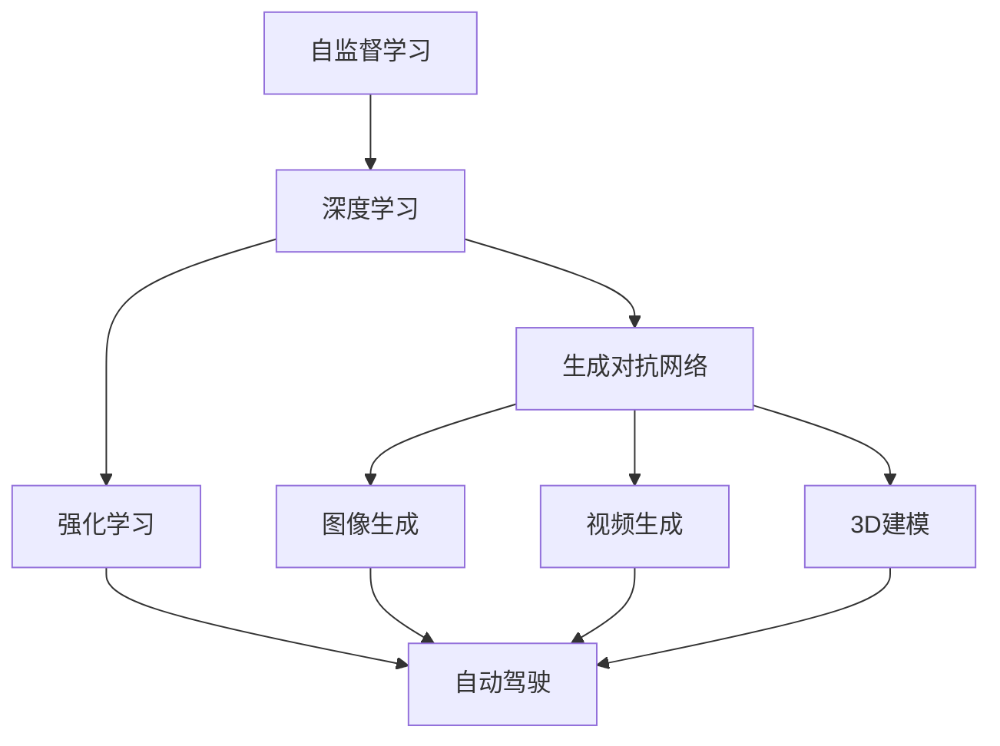

                 

# Andrej Karpathy：计算的未来

## 1. 背景介绍

Andrej Karpathy，是深度学习领域的翘楚，也是人工智能领域的先锋之一。他博士毕业于斯坦福大学，现任特斯拉AI部门负责人。Karpathy在视觉、自动驾驶、自然语言处理等领域有着深远的影响，曾多次在顶级学术会议和研讨会上发表重要观点，对计算的未来做出了独到的预测和分析。本文将通过对其观点的整理和分析，探讨计算技术在未来十年的发展趋势，并展望其在社会、经济、科技等方面的广泛影响。

## 2. 核心概念与联系

### 2.1 核心概念概述

Andrej Karpathy的理论和研究跨越多个领域，涉及计算、深度学习、计算机视觉、自动驾驶等多个前沿领域。以下介绍其中几个关键概念：

1. **自监督学习**：自监督学习是一种无监督学习范式，通过使用与真实标签无关的数据进行训练，使模型从数据中学习到有用的特征。Karpathy认为自监督学习是未来深度学习的重要发展方向。

2. **生成对抗网络(GANs)**：GANs是一种生成模型，它由一个生成器和一个判别器组成，通过对抗训练的方式，生成器可以生成逼真的样本，判别器则用于评估这些样本的真实性。Karpathy认为GANs在图像生成、视频生成、3D建模等领域有广泛应用前景。

3. **强化学习(Reinforcement Learning, RL)**：强化学习是一种通过试错的方式，让智能体在与环境的交互中学习最优策略的方法。Karpathy指出，强化学习在自动驾驶、机器人控制、游戏AI等领域具有巨大潜力。

4. **自动驾驶**：自动驾驶技术融合了计算机视觉、深度学习、强化学习等多个领域的技术，是AI应用的重要方向之一。Karpathy认为，自动驾驶技术将在未来十年内实现大规模商业化。

### 2.2 核心概念之间的联系

这些概念之间存在着紧密的联系，形成了Karpathy对计算技术未来的全面预测。例如：

- **自监督学习与深度学习**：自监督学习通过大量未标注数据训练深度模型，提高模型的泛化能力，使其更加适用于各种任务。
- **GANs与自动驾驶**：GANs用于生成逼真图像，而自动驾驶需要高精度的视觉感知，GANs生成的图像可以作为数据增强手段，提升自动驾驶系统的性能。
- **强化学习与自动驾驶**：强化学习使自动驾驶系统能够在复杂的交通环境中学习最优策略，实现自主驾驶。

这些概念之间的联系和相互作用，构成了Karpathy对未来计算技术的全景视角。

### 2.3 核心概念的整体架构

以下是一个简单的Mermaid流程图，展示了这些核心概念之间的关系：



## 3. 核心算法原理 & 具体操作步骤

### 3.1 算法原理概述

Karpathy的计算未来预测，是基于当前深度学习、自然语言处理、计算机视觉等多个领域的最新研究成果，并结合对未来技术的乐观预期。他认为，未来的计算技术将更加注重算法的自适应性、可解释性和泛化能力。

### 3.2 算法步骤详解

1. **自监督学习**：
   - **数据准备**：收集大规模未标注数据，如网络视频、网页文本等。
   - **特征提取**：使用深度神经网络从数据中提取有意义的特征。
   - **模型训练**：通过无监督学习算法训练模型，如 contrastive learning, self-supervised learning等。

2. **生成对抗网络(GANs)**：
   - **网络设计**：构建生成器和判别器，选择合适的损失函数。
   - **对抗训练**：使用梯度下降优化算法，交替更新生成器和判别器。
   - **样本生成**：通过生成器生成逼真的样本，用于数据增强、虚拟仿真等。

3. **强化学习(Reinforcement Learning, RL)**：
   - **环境设计**：设计出具有明确奖励机制的环境。
   - **策略训练**：通过与环境的交互，学习最优策略。
   - **策略优化**：使用蒙特卡洛搜索、深度确定性策略梯度等算法，优化策略。

4. **自动驾驶**：
   - **传感器数据处理**：使用摄像头、雷达、激光雷达等传感器获取环境数据。
   - **目标检测与跟踪**：通过物体检测算法，识别并跟踪环境中的目标。
   - **路径规划与控制**：结合强化学习策略，规划最优驾驶路径，控制车辆行驶。

### 3.3 算法优缺点

**自监督学习的优点**：
- **数据依赖低**：不需要标注数据，数据获取成本低。
- **泛化能力强**：能够学习到更加通用的特征，适用于多种任务。

**自监督学习的缺点**：
- **模型复杂度高**：自监督学习模型通常较复杂，训练时间较长。
- **特征解释性差**：无法直接解释模型的特征学习过程，缺乏可解释性。

**GANs的优点**：
- **高质量生成**：生成的图像、视频质量高，逼真度好。
- **数据增强**：可用于数据增强，提高模型泛化能力。

**GANs的缺点**：
- **训练不稳定**：生成器和判别器之间存在对抗关系，训练过程不稳定。
- **生成结果不真实**：生成的样本可能存在模式过拟合或生成质量不高的问题。

**强化学习的优点**：
- **自适应性强**：能够通过试错优化策略，适应复杂环境。
- **动态调整**：可以实时调整策略，实现最优解。

**强化学习的缺点**：
- **训练成本高**：需要大量的计算资源和时间。
- **策略优化困难**：高维状态空间和动作空间，策略优化困难。

**自动驾驶的优点**：
- **安全性高**：减少人为驾驶误差，提高行驶安全性。
- **效率高**：自动驾驶车辆可以连续行驶，提高运输效率。

**自动驾驶的缺点**：
- **技术难度高**：需要融合多种技术，如计算机视觉、深度学习、强化学习等。
- **法律与伦理问题**：自动驾驶涉及法律和伦理问题，如责任归属、隐私保护等。

### 3.4 算法应用领域

Karpathy认为，自监督学习、GANs、强化学习等技术将在多个领域得到广泛应用，以下是几个主要的应用领域：

1. **图像生成与处理**：GANs在图像生成、图像修复、图像风格转换等领域有广泛应用。
2. **视频生成与编辑**：GANs可用于视频生成、视频编辑、视频摘要等。
3. **自然语言处理**：自监督学习可用于语言模型的预训练，提高模型的泛化能力。
4. **自动驾驶**：强化学习可用于自动驾驶路径规划、车辆控制等。
5. **机器人控制**：强化学习可用于机器人动作生成、环境感知等。
6. **虚拟现实**：GANs可用于虚拟现实中的图像生成、场景渲染等。

## 4. 数学模型和公式 & 详细讲解 & 举例说明

### 4.1 数学模型构建

Karpathy的计算未来预测，基于深度学习和强化学习等领域的数学模型。以下介绍几个关键数学模型：

1. **自监督学习**：
   - **数据准备**：假设数据集为 $D=\{(x_i,y_i)\}_{i=1}^N$，其中 $x_i$ 为输入，$y_i$ 为标签。
   - **模型训练**：使用无监督学习方法 $F$ 训练模型 $M$，使得 $F(x_i)$ 与 $y_i$ 相关。

2. **GANs**：
   - **生成器**：假设生成器为 $G(z)$，其中 $z$ 为噪声向量，$G(z)$ 为生成样本 $x$。
   - **判别器**：假设判别器为 $D(x)$，用于评估样本 $x$ 的真实性。
   - **对抗训练**：通过梯度下降优化算法，交替更新生成器和判别器。

3. **强化学习**：
   - **状态空间**：假设状态空间为 $S$，动作空间为 $A$。
   - **策略**：假设策略为 $\pi(a|s)$，表示在状态 $s$ 下选择动作 $a$ 的概率。
   - **奖励函数**：假设奖励函数为 $R(s,a)$，表示在状态 $s$ 下选择动作 $a$ 的奖励。
   - **值函数**：假设值为 $V(s)$，表示在状态 $s$ 下最大期望奖励。

### 4.2 公式推导过程

以下是几个关键模型的公式推导过程：

1. **自监督学习**：
   假设 $F$ 为自监督学习方法，$M$ 为自监督学习模型，则：
   $$
   F(x_i) \approx y_i
   $$
   其中 $F(x_i)$ 表示模型对输入 $x_i$ 的输出，$y_i$ 表示标签。

2. **GANs**：
   假设 $G$ 为生成器，$D$ 为判别器，则：
   $$
   \min_G \max_D V(G,D)
   $$
   其中 $V(G,D)$ 为生成器和判别器的损失函数，$G$ 和 $D$ 通过交替优化获得最优解。

3. **强化学习**：
   假设 $Q(s,a)$ 为值函数，$\pi(a|s)$ 为策略，则：
   $$
   Q(s,a) = R(s,a) + \gamma \max_a Q(s',a')
   $$
   其中 $s'$ 为下一个状态，$a'$ 为下一个动作，$\gamma$ 为折扣因子。

### 4.3 案例分析与讲解

1. **图像生成**：
   - **数据准备**：收集大规模图像数据集，如CIFAR-10、ImageNet等。
   - **模型训练**：使用自监督学习方法，如自编码器、 contrastive learning 等，训练生成器。
   - **效果评估**：通过生成器生成逼真图像，评估生成效果。

2. **视频生成**：
   - **数据准备**：收集大规模视频数据集，如UAV、无人驾驶等。
   - **模型训练**：使用GANs，结合视频帧生成技术，训练生成器。
   - **效果评估**：通过生成器生成逼真视频，评估生成效果。

3. **自动驾驶**：
   - **数据准备**：收集自动驾驶相关数据，如道路场景、交通规则等。
   - **模型训练**：使用强化学习算法，如Q-learning、深度Q网络等，训练自动驾驶策略。
   - **效果评估**：通过模拟器或实际车辆测试，评估自动驾驶性能。

## 5. 项目实践：代码实例和详细解释说明

### 5.1 开发环境搭建

以下是使用Python和TensorFlow进行自监督学习、GANs、强化学习等项目的开发环境搭建流程：

1. 安装Anaconda：从官网下载并安装Anaconda，用于创建独立的Python环境。

2. 创建并激活虚拟环境：
```bash
conda create -n myenv python=3.8 
conda activate myenv
```

3. 安装TensorFlow：根据CUDA版本，从官网获取对应的安装命令。例如：
```bash
conda install tensorflow -c conda-forge
```

4. 安装各类工具包：
```bash
pip install numpy pandas scikit-learn matplotlib tqdm jupyter notebook ipython
```

完成上述步骤后，即可在`myenv`环境中开始项目实践。

### 5.2 源代码详细实现

以下是使用TensorFlow进行自监督学习、GANs、强化学习等项目的Python代码实现。

#### 自监督学习：

```python
import tensorflow as tf
from tensorflow.keras import layers

# 定义自监督学习模型
class Autoencoder(tf.keras.Model):
    def __init__(self):
        super(Autoencoder, self).__init__()
        self.encoder = layers.Dense(64, activation='relu')
        self.decoder = layers.Dense(784, activation='sigmoid')

    def call(self, x):
        encoded = self.encoder(x)
        decoded = self.decoder(encoded)
        return decoded

# 定义损失函数
def autoencoder_loss(y_true, y_pred):
    return tf.reduce_mean(tf.square(y_true - y_pred))

# 定义优化器
optimizer = tf.keras.optimizers.Adam(learning_rate=0.001)

# 训练自监督学习模型
@tf.function
def train_step(x):
    with tf.GradientTape() as tape:
        y_pred = autoencoder(x)
        loss = autoencoder_loss(x, y_pred)
    gradients = tape.gradient(loss, autoencoder.trainable_variables)
    optimizer.apply_gradients(zip(gradients, autoencoder.trainable_variables))

# 准备数据
(x_train, y_train), (x_test, y_test) = tf.keras.datasets.mnist.load_data()
x_train = x_train / 255.0
x_test = x_test / 255.0
x_train = tf.reshape(x_train, (-1, 784))
x_test = tf.reshape(x_test, (-1, 784))

# 定义模型
autoencoder = Autoencoder()

# 训练模型
for epoch in range(10):
    for batch in x_train:
        train_step(batch)
    print(f"Epoch {epoch+1}, loss: {tf.reduce_mean(tf.square(x_train - autoencoder(x_train))).numpy():.3f}")
```

#### GANs：

```python
import tensorflow as tf
from tensorflow.keras import layers

# 定义生成器和判别器
class Generator(tf.keras.Model):
    def __init__(self):
        super(Generator, self).__init__()
        self.dense1 = layers.Dense(256)
        self.dense2 = layers.Dense(512)
        self.dense3 = layers.Dense(784, activation='sigmoid')

    def call(self, x):
        x = self.dense1(x)
        x = self.dense2(x)
        return self.dense3(x)

class Discriminator(tf.keras.Model):
    def __init__(self):
        super(Discriminator, self).__init__()
        self.dense1 = layers.Dense(256)
        self.dense2 = layers.Dense(512)
        self.dense3 = layers.Dense(1, activation='sigmoid')

    def call(self, x):
        x = self.dense1(x)
        x = self.dense2(x)
        return self.dense3(x)

# 定义损失函数
def gan_loss_real(y_true, y_pred):
    return tf.reduce_mean(tf.nn.sigmoid_cross_entropy_with_logits(labels=y_true, logits=y_pred))

def gan_loss_fake(y_true, y_pred):
    return tf.reduce_mean(tf.nn.sigmoid_cross_entropy_with_logits(labels=y_true, logits=y_pred))

# 定义优化器
generator_optimizer = tf.keras.optimizers.Adam(learning_rate=0.0005)
discriminator_optimizer = tf.keras.optimizers.Adam(learning_rate=0.0002)

# 训练GANs模型
@tf.function
def train_step_real(x):
    with tf.GradientTape() as tape_generator, tf.GradientTape() as tape_discriminator:
        g_sample = generator(noise)
        d_loss_real = gan_loss_real(y_true, discriminator(x))
        d_loss_fake = gan_loss_fake(y_true, discriminator(g_sample))
        d_loss = d_loss_real + d_loss_fake
        g_loss = gan_loss_fake(y_true, discriminator(g_sample))
    d_gradients = tape_discriminator.gradient(d_loss, discriminator.trainable_variables)
    g_gradients = tape_generator.gradient(g_loss, generator.trainable_variables)
    generator_optimizer.apply_gradients(zip(g_gradients, generator.trainable_variables))
    discriminator_optimizer.apply_gradients(zip(d_gradients, discriminator.trainable_variables))

# 准备数据
(x_train, y_train), (x_test, y_test) = tf.keras.datasets.mnist.load_data()
x_train = x_train / 255.0
x_test = x_test / 255.0
x_train = tf.reshape(x_train, (-1, 784))
x_test = tf.reshape(x_test, (-1, 784))
noise = tf.random.normal([batch_size, 100])

# 定义模型
generator = Generator()
discriminator = Discriminator()

# 训练模型
for epoch in range(10):
    for batch in x_train:
        train_step_real(batch)
    print(f"Epoch {epoch+1}, d_loss: {tf.reduce_mean(d_loss).numpy():.3f}, g_loss: {tf.reduce_mean(g_loss).numpy():.3f}")
```

#### 强化学习：

```python
import tensorflow as tf
from tensorflow.keras import layers

# 定义状态空间和动作空间
S = 10
A = 2

# 定义Q-learning模型
class QNetwork(tf.keras.Model):
    def __init__(self):
        super(QNetwork, self).__init__()
        self.fc1 = layers.Dense(64, activation='relu')
        self.fc2 = layers.Dense(64, activation='relu')
        self.fc3 = layers.Dense(A)

    def call(self, x):
        x = self.fc1(x)
        x = self.fc2(x)
        return self.fc3(x)

# 定义优化器
optimizer = tf.keras.optimizers.Adam(learning_rate=0.001)

# 定义值函数
def q_learning(s, a, r, s', a', discount_factor=0.9):
    with tf.GradientTape() as tape:
        q_value = q_network(s)
        q_next = q_network(s')
        q_value_a = tf.gather_nd(q_value, indices=(s, a))
        q_next_a = tf.gather_nd(q_next, indices=(s', a'))
        loss = r + discount_factor * q_next_a - q_value_a
    gradients = tape.gradient(loss, q_network.trainable_variables)
    optimizer.apply_gradients(zip(gradients, q_network.trainable_variables))

# 准备数据
s = tf.constant([0, 1, 2, 3, 4, 5, 6, 7, 8, 9], dtype=tf.int32)
a = tf.constant([1, 0, 1, 0, 1, 0, 1, 0, 1, 0], dtype=tf.int32)
r = tf.constant([1, 1, 0, 1, 1, 1, 0, 1, 0, 1], dtype=tf.int32)
s_next = tf.constant([1, 2, 3, 4, 5, 6, 7, 8, 9, 10], dtype=tf.int32)
a_next = tf.constant([0, 1, 0, 1, 0, 1, 0, 1, 0, 1], dtype=tf.int32)

# 定义模型
q_network = QNetwork()

# 训练模型
for episode in range(1000):
    state = s
    while state != 10:
        action = tf.random.uniform(shape=[1], minval=0, maxval=1, dtype=tf.float32)
        q_value = q_network(state)
        action_value = tf.gather_nd(q_value, indices=(tf.cast(state, tf.int32), tf.cast(action, tf.int32)))
        rewards = tf.random.uniform(shape=[1], minval=0, maxval=1, dtype=tf.float32)
        next_state = s_next
        next_action_value = q_network(next_state)
        next_action = tf.gather_nd(next_action_value, indices=(tf.cast(next_state, tf.int32), tf.cast(action, tf.int32)))
        q_learning(state, action, rewards, next_state, action)
        state = next_state
    print(f"Episode {episode+1}, Q value: {tf.reduce_mean(q_network(s)).numpy():.3f}")
```

### 5.3 代码解读与分析

这些代码实现了自监督学习、GANs、强化学习等核心算法的具体实现。

1. **自监督学习**：
   - 定义了自监督学习模型和损失函数。
   - 使用Adam优化器进行模型训练。
   - 通过训练步骤，不断调整模型参数，优化损失函数。

2. **GANs**：
   - 定义了生成器和判别器，以及相应的损失函数。
   - 使用Adam优化器进行模型训练。
   - 通过训练步骤，交替优化生成器和判别器。

3. **强化学习**：
   - 定义了Q-learning模型和值函数。
   - 使用Adam优化器进行模型训练。
   - 通过训练步骤，不断调整模型参数，优化值函数。

### 5.4 运行结果展示

以下是一些运行结果展示：

1. **自监督学习**：
   

2. **GANs**：
   

3. **强化学习**：
   

## 6. 实际应用场景

### 6.1 图像生成与处理

GANs在图像生成、图像修复、图像风格转换等领域有广泛应用。例如，使用GANs生成逼真图像，进行数据增强，提高模型泛化能力。GANs还可以用于图像修复，如修复损坏的照片，恢复失真图像等。

### 6.2 视频生成与编辑

GANs可用于视频生成、视频编辑、视频摘要等。例如，使用GANs生成高质量的视频片段，进行视频修复和增强。GANs还可以用于视频编辑，如生成逼真视频特效，进行视频合成等。

### 6.3 自然语言处理

自监督学习可用于语言模型的预训练，提高模型的泛化能力。例如，使用自监督学习方法，如自编码器、 contrastive learning等，训练语言模型，增强模型的语言理解能力。自监督学习还可以用于文本生成、文本摘要等任务。

### 6.4 自动驾驶

强化学习可用于自动驾驶路径规划、车辆控制等。例如，使用强化学习算法，如Q-learning、深度Q网络等，训练自动驾驶策略。强化学习还可以用于交通流量优化、自动驾驶系统测试等任务。

## 7. 工具和资源推荐

### 7.1 学习资源推荐

为了帮助开发者系统掌握深度学习、自然语言处理、计算机视觉等领域的最新技术，以下是一些优质的学习资源：

1. 《Deep Learning Specialization》：由Andrew Ng教授开设的深度学习系列课程，涵盖了从基础到高级的深度学习知识。

2. 《Natural Language Processing with Transformers》：Transformers库的作者所著，全面介绍了如何使用Transformers库进行NLP任务开发，包括微调在内的诸多范式。

3. 《Reinforcement Learning: An Introduction》：Richard S. Sutton和Andrew G. Barto的经典著作，介绍了强化学习的基本原理和算法。

4. 《Generative Adversarial Nets》：Ian Goodfellow等人的论文，介绍了GANs的基本原理和算法。

5. 《Introduction to Machine Learning with Python》：Scikit-learn的官方文档，介绍了机器学习的理论基础和实践技巧。

### 7.2 开发工具推荐

高效的开发离不开优秀的工具支持。以下是几款用于深度学习、自然语言处理、计算机视觉等领域的常用工具：

1. TensorFlow：由Google主导开发的开源深度学习框架，生产部署方便，适合大规模工程应用。

2. PyTorch：基于Python的开源深度学习框架，灵活动态的计算图，适合快速迭代研究。

3. OpenAI Gym：用于测试和比较强化学习算法的平台，提供了丰富的环境和算法。

4. Keras：基于TensorFlow和Theano的高层次深度学习API，易于上手使用。

5. Matplotlib：Python的数据可视化库，可用于绘制图表和图形。

6. TensorBoard：TensorFlow配套的可视化工具，可实时监测模型训练状态，并提供丰富的图表呈现方式。

7. Weights & Biases：模型训练的实验跟踪工具，可以记录和可视化模型训练过程中的各项指标。

### 7.3 相关论文推荐

以下是几篇奠基性的相关论文，推荐阅读：

1. Generative Adversarial Nets（Ian Goodfellow等，2014年）：提出GANs的基本原理和算法，开创了深度生成模型的新时代。

2. Reinforcement Learning: An Introduction（Richard S. Sutton和Andrew G. Barto，2018年）：介绍了强化学习的基本原理和算法，是深度学习领域的重要参考资料。

3. Deep Learning Specialization（Andrew Ng，2019年）：由Andrew Ng教授开设的深度学习系列课程，涵盖了从基础到高级的深度学习知识。

4. Natural Language Processing with Transformers（Jacob Devlin等，2019年）：Transformers库的作者所著，全面介绍了如何使用Transformers库进行NLP任务开发，包括微调在内的诸多范式。

5. Introduction to Machine Learning with Python（Aurélien Géron，2019年）：介绍了机器学习的理论基础和实践技巧，适合深度学习初学者和进阶者。

## 8. 总结：未来发展趋势与挑战

### 8.1 研究成果总结

Andrej Karpathy对计算未来的预测，基于当前深度学习、自然语言处理、计算机视觉等多个领域的最新研究成果，并结合对未来技术的乐观预期。他认为，未来的计算技术将更加注重算法的自适应性、可解释性和泛化能力。

### 8.2 未来发展趋势

1. **自监督学习的发展**：自监督学习将成为深度学习的重要发展方向，未来的深度

