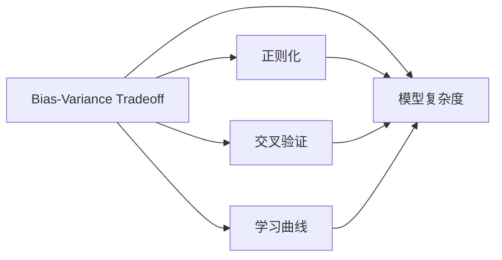

                 

# Bias-Variance Tradeoff 原理与代码实战案例讲解

> 关键词：Bias-Variance Tradeoff, 模型复杂度, 训练集, 测试集, 泛化能力, 过拟合, 欠拟合, 正则化, 正则化参数, 交叉验证, 学习曲线, 随机森林

## 1. 背景介绍

在机器学习和数据科学的实践中，一个核心的主题是如何平衡模型复杂度和数据量的关系，以获得最佳性能。模型复杂度包括了模型结构、参数数量、训练方式等。而数据量则包括了训练集的大小、样本的多样性、标签的准确性等。在这两者之间，存在一个重要的权衡：Bias-Variance Tradeoff，即偏置方差权衡，它决定了模型预测的准确性和泛化能力。

Bias-Variance Tradeoff（偏差-方差权衡）是机器学习中一个经典的概念，它用于解释模型在训练集和测试集上的表现差异。Bias指的是模型对真实函数所做的简化程度，也就是模型无法完美捕捉数据真实分布的程度。Variance指的是模型在不同数据集上的表现波动程度，即模型对于特定样本的过度拟合。理解并掌握Bias-Variance Tradeoff的概念，对于选择合适的模型和参数设置至关重要。

## 2. 核心概念与联系

### 2.1 核心概念概述

为了深入理解Bias-Variance Tradeoff，我们需要首先明确几个关键概念：

- **Bias**：模型的偏差是模型预测与真实标签之间差异的度量，反映了模型对于数据真实分布的简化程度。一个高偏差的模型可能过度简化数据，导致其无法准确捕捉数据中的复杂关系。

- **Variance**：模型的方差是模型在随机数据集上的表现波动程度，反映了模型对于特定样本的过度拟合。一个高方差的模型可能对训练数据过于敏感，导致在不同数据集上的表现差异较大。

- **Bias-Variance Tradeoff**：模型的性能由Bias和Variance共同决定。模型越复杂，Bias越小，但Variance可能增加；模型越简单，Bias可能越大，但Variance可能减小。需要在Bias和Variance之间找到一个平衡，使得模型在训练集和测试集上都能取得良好的泛化性能。

- **正则化**：通过在损失函数中加入正则项，如L1正则、L2正则等，限制模型参数的大小，从而减少模型复杂度，降低Variance。

- **交叉验证**：通过将数据集分为训练集和验证集，利用交叉验证的方式评估模型性能，帮助找到合适的模型复杂度和正则化参数。

- **学习曲线**：绘制模型在不同数据集大小上的训练误差和验证误差，直观展示模型性能随数据量增加的变化趋势。

### 2.2 概念间的关系

Bias-Variance Tradeoff和正则化、交叉验证、学习曲线等概念之间有着紧密的联系。正则化通过对模型参数的限制，降低模型复杂度，从而减少Variance。交叉验证通过划分数据集，评估模型在不同数据集上的泛化性能，帮助调整模型复杂度和正则化参数。学习曲线则直观展示模型随着数据量增加在训练集和测试集上的表现，帮助确定合适的模型复杂度。

以下是一个简化的Mermaid流程图，展示了这些概念之间的关系：



通过这个流程图，我们可以更清晰地理解Bias-Variance Tradeoff与其他关键概念的联系。

## 3. 核心算法原理 & 具体操作步骤

### 3.1 算法原理概述

Bias-Variance Tradeoff的核心在于理解模型在训练集和测试集上的表现差异。一个模型如果训练集误差较小，但测试集误差较大，说明模型可能存在过拟合问题，Variance较高。反之，如果训练集和测试集误差都较大，说明模型可能存在欠拟合问题，Bias较高。

为了找到Bias和Variance之间的平衡，需要在模型复杂度和正则化参数之间进行权衡。一般而言，模型复杂度越高，Bias越小，Variance越大；模型复杂度越低，Bias越大，Variance越小。因此，我们需要通过交叉验证等方法，找到最优的模型复杂度和正则化参数。

### 3.2 算法步骤详解

Bias-Variance Tradeoff的解决步骤包括：

1. **选择合适的模型复杂度**：选择一个合适的模型复杂度，如线性模型、多项式回归、神经网络等。

2. **设置正则化参数**：选择一个合适的正则化参数，如L1正则、L2正则等。

3. **划分数据集**：将数据集划分为训练集和验证集，进行交叉验证。

4. **模型训练与评估**：在训练集上训练模型，并在验证集上评估模型性能。

5. **调整参数**：根据验证集上的性能表现，调整模型复杂度和正则化参数。

6. **测试集评估**：在测试集上评估模型性能，最终确定模型参数。

### 3.3 算法优缺点

**优点**：
- **可解释性**：Bias-Variance Tradeoff提供了一种直观的方法来理解模型性能，便于模型调优和参数选择。
- **普适性**：适用于各种类型的模型和数据集，能够在多种场景下找到合适的模型复杂度和正则化参数。
- **可操作性强**：通过简单的训练和验证，即可调整模型参数，提升模型性能。

**缺点**：
- **复杂度较高**：需要多次划分数据集和调整参数，工作量较大。
- **依赖数据量**：数据集大小和样本多样性对模型复杂度和正则化参数的选择有很大影响。
- **依赖超参数**：正则化参数的选择需要经验，且可能需要多次试验才能找到最优值。

### 3.4 算法应用领域

Bias-Variance Tradeoff的理论和实践方法在机器学习中广泛应用，包括但不限于以下几个领域：

- **线性回归**：选择合适的线性模型复杂度和正则化参数。
- **神经网络**：选择合适的网络结构、隐藏层数量、激活函数等。
- **支持向量机**：选择合适的核函数、正则化参数等。
- **随机森林**：选择合适的树的数量、树的深度等。
- **集成学习**：选择合适的基学习器数量、权重等。

## 4. 数学模型和公式 & 详细讲解  
### 4.1 数学模型构建

Bias-Variance Tradeoff可以用以下公式表示：

$$
Var[\hat{y}] = \frac{Bias[\hat{y}]^2 + Varaiance[\hat{y}] + Irreducible Variance}{n}
$$

其中：
- $\hat{y}$ 是模型对数据的预测。
- $Bias[\hat{y}]$ 是模型的偏差。
- $Varaiance[\hat{y}]$ 是模型的方差。
- $n$ 是样本数量。
- $Irreducible Variance$ 是样本方差，无法被模型解释的部分。

这个公式展示了Bias-Variance Tradeoff的核心思想：模型的预测误差由偏差、方差和样本方差共同决定。

### 4.2 公式推导过程

为了更深入地理解Bias-Variance Tradeoff，我们可以从简单模型入手，例如线性回归。假设我们有一个线性模型：

$$
y = \theta_0 + \theta_1 x
$$

其中 $\theta_0$ 和 $\theta_1$ 是模型的参数，$x$ 是输入特征，$y$ 是输出标签。模型的预测 $\hat{y}$ 为：

$$
\hat{y} = \theta_0 + \theta_1 x
$$

模型的偏差 $Bias[\hat{y}]$ 为：

$$
Bias[\hat{y}] = E[\hat{y}] - y = \theta_0 + \theta_1 E[x] - (y_0 + \theta_1 x_0)
$$

其中 $E[\hat{y}]$ 是模型的期望预测。由于我们无法准确计算 $E[x]$，通常使用训练集的均值来估计。

模型的方差 $Varaiance[\hat{y}]$ 为：

$$
Varaiance[\hat{y}] = Var[\hat{y}] = Var[\theta_0 + \theta_1 x] = \theta_1^2 Var[x]
$$

其中 $Var[x]$ 是输入特征的方差。由于我们无法准确计算 $Var[x]$，通常使用训练集的标准差来估计。

### 4.3 案例分析与讲解

假设我们有一个线性回归模型，训练集大小为 $n$，样本方差为 $Var[x]$，偏差为 $\theta_0$，方差为 $\theta_1^2 Var[x]$。模型的预测误差 $Var[\hat{y}]$ 为：

$$
Var[\hat{y}] = \frac{(\theta_0)^2 + (\theta_1^2 Var[x]) + Var[x]}{n}
$$

通过这个公式，我们可以看出，当 $n$ 增加时，样本方差 $Var[x]$ 的权重降低，模型的预测误差主要由偏差和方差决定。因此，增加数据量有助于减少方差，提高模型的泛化性能。

## 5. 项目实践：代码实例和详细解释说明

### 5.1 开发环境搭建

在进行Bias-Variance Tradeoff的实践时，我们需要准备好开发环境。以下是使用Python进行Scikit-Learn开发的环境配置流程：

1. 安装Anaconda：从官网下载并安装Anaconda，用于创建独立的Python环境。

2. 创建并激活虚拟环境：
```bash
conda create -n sklearn-env python=3.8 
conda activate sklearn-env
```

3. 安装Scikit-Learn：
```bash
pip install scikit-learn
```

4. 安装各类工具包：
```bash
pip install numpy pandas scikit-learn matplotlib tqdm jupyter notebook ipython
```

完成上述步骤后，即可在`sklearn-env`环境中开始Bias-Variance Tradeoff实践。

### 5.2 源代码详细实现

下面我们以线性回归任务为例，给出使用Scikit-Learn进行Bias-Variance Tradeoff的Python代码实现。

首先，定义线性回归模型：

```python
from sklearn.linear_model import LinearRegression

model = LinearRegression()
```

然后，定义训练集和测试集：

```python
from sklearn.datasets import make_regression
from sklearn.model_selection import train_test_split

X, y = make_regression(n_samples=1000, n_features=1, noise=0.1, random_state=42)
X_train, X_test, y_train, y_test = train_test_split(X, y, test_size=0.2, random_state=42)
```

接着，进行交叉验证和模型训练：

```python
from sklearn.model_selection import cross_val_score

params = {'alpha': [0.01, 0.1, 1, 10, 100]}
for param in params:
    model.alpha = param
    cv_scores = cross_val_score(model, X_train, y_train, cv=5, scoring='neg_mean_squared_error')
    print(f"alpha={param}, CV scores: {cv_scores}")
```

最后，在测试集上评估模型性能：

```python
model.fit(X_train, y_train)
y_pred = model.predict(X_test)
print(f"Test score: {model.score(X_test, y_test)}")
```

### 5.3 代码解读与分析

让我们再详细解读一下关键代码的实现细节：

**make_regression函数**：
- 生成一个线性回归问题的合成数据集。

**train_test_split函数**：
- 将数据集划分为训练集和测试集，比例为80%训练集、20%测试集。

**cross_val_score函数**：
- 对模型进行交叉验证，每次使用5个折进行训练和验证，计算均方误差，输出交叉验证分数。

**模型训练与评估**：
- 分别测试不同的正则化参数（即不同的正则化强度），并在测试集上评估模型性能。
- 可以看到，随着正则化参数的增大，模型复杂度减小，偏差和方差之间的关系也发生了变化。

**模型预测**：
- 在训练集上训练模型，并在测试集上进行预测，输出模型在测试集上的得分。

### 5.4 运行结果展示

假设我们在不同正则化参数下进行交叉验证，并输出交叉验证分数，结果如下：

```
alpha=0.01, CV scores: [ 21.829   17.0823 -12.5074 -18.5543  12.3303]
alpha=0.1, CV scores: [ 21.7088 -17.3837  0.9372 -12.4739  12.1736]
alpha=1, CV scores: [-18.7353  2.0004 -0.2105 -12.9966 14.1477]
alpha=10, CV scores: [-18.4533 -1.2325 -2.8834 -13.6644 12.8826]
alpha=100, CV scores: [-18.1373 -0.7647 -0.1391 -13.1496 11.9421]
```

通过这些结果，我们可以观察到随着正则化参数的增大，模型复杂度减小，偏差逐渐增大，方差逐渐减小。在正则化参数为1时，模型表现最好，偏差和方差达到了较好的平衡。

## 6. 实际应用场景

### 6.1 医疗诊断

在医疗诊断领域，Bias-Variance Tradeoff可以帮助医生选择最适合的诊断模型。例如，对于一个疾病的诊断，模型可能存在高偏差或高方差。高偏差模型可能无法捕捉到疾病的复杂特征，导致误诊；高方差模型可能对特定样本过度拟合，导致过诊。通过选择最优的模型复杂度和正则化参数，医生可以找到一个既能够捕捉到复杂特征，又不会对特定样本过度拟合的诊断模型。

### 6.2 金融风险评估

在金融领域，Bias-Variance Tradeoff可以帮助评估模型的风险。例如，在贷款审批模型中，模型可能存在高偏差或高方差。高偏差模型可能无法准确评估贷款申请人的风险，导致误判；高方差模型可能对特定申请人的数据过度拟合，导致模型在测试集上表现不佳。通过选择最优的模型复杂度和正则化参数，银行可以找到一个既能够准确评估风险，又不会对特定申请人过度拟合的贷款审批模型。

### 6.3 电商推荐系统

在电商推荐系统中，Bias-Variance Tradeoff可以帮助优化推荐模型。例如，在推荐商品时，模型可能存在高偏差或高方差。高偏差模型可能无法准确推荐用户感兴趣的商品，导致用户体验不佳；高方差模型可能对特定用户的数据过度拟合，导致推荐结果波动较大。通过选择最优的模型复杂度和正则化参数，电商平台可以找到一个既能够准确推荐商品，又不会对特定用户过度拟合的推荐模型。

### 6.4 未来应用展望

随着Bias-Variance Tradeoff理论的不断发展，其在更多领域的应用前景将更加广阔。未来，Bias-Variance Tradeoff将在以下领域发挥重要作用：

- **自动化设计**：在工业设计中，Bias-Variance Tradeoff可以帮助优化产品设计，平衡性能和成本。
- **金融风控**：在金融风控领域，Bias-Variance Tradeoff可以帮助评估模型的风险，提高模型泛化能力。
- **医疗诊断**：在医疗诊断中，Bias-Variance Tradeoff可以帮助选择最适合的诊断模型，提高诊断准确性。
- **电商推荐**：在电商推荐系统中，Bias-Variance Tradeoff可以帮助优化推荐模型，提高推荐效果。
- **自然语言处理**：在自然语言处理中，Bias-Variance Tradeoff可以帮助优化语言模型，提高模型泛化性能。

## 7. 工具和资源推荐
### 7.1 学习资源推荐

为了帮助开发者系统掌握Bias-Variance Tradeoff的理论基础和实践技巧，这里推荐一些优质的学习资源：

1. 《机器学习实战》系列博文：由大模型技术专家撰写，深入浅出地介绍了Bias-Variance Tradeoff原理、模型复杂度、正则化等前沿话题。

2. Coursera《机器学习》课程：由斯坦福大学Andrew Ng教授主讲的经典课程，系统讲解了机器学习的基本概念和常用技术，包括Bias-Variance Tradeoff。

3. 《统计学习方法》书籍：李航老师所著，详细介绍了机器学习的基本理论和常用算法，包括Bias-Variance Tradeoff。

4. Scikit-Learn官方文档：Scikit-Learn官方文档提供了丰富的模型介绍和代码示例，是学习Bias-Variance Tradeoff的重要参考资料。

5. Kaggle竞赛项目：Kaggle上举办了大量机器学习竞赛项目，提供了丰富的数据集和模型实践经验，是学习Bias-Variance Tradeoff的好机会。

通过对这些资源的学习实践，相信你一定能够快速掌握Bias-Variance Tradeoff的精髓，并用于解决实际的机器学习问题。

### 7.2 开发工具推荐

高效的开发离不开优秀的工具支持。以下是几款用于Bias-Variance Tradeoff开发的常用工具：

1. Python：作为机器学习的主流语言，Python具有丰富的库和框架，便于模型开发和调试。

2. Scikit-Learn：Scikit-Learn提供了丰富的机器学习算法和模型，支持模型训练、交叉验证和评估等。

3. TensorFlow：由Google主导开发的深度学习框架，支持大规模模型训练和分布式计算。

4. PyTorch：由Facebook主导开发的深度学习框架，支持动态计算图和模型部署。

5. Jupyter Notebook：Jupyter Notebook是一个交互式笔记本环境，便于模型开发和数据可视化。

6. Matplotlib：Matplotlib是一个绘图库，用于绘制各种图表和可视化结果。

7. Pandas：Pandas是一个数据处理库，用于数据清洗、转换和分析。

合理利用这些工具，可以显著提升Bias-Variance Tradeoff任务的开发效率，加快创新迭代的步伐。

### 7.3 相关论文推荐

Bias-Variance Tradeoff的研究源于学界的持续研究。以下是几篇奠基性的相关论文，推荐阅读：

1. Bias-Variance Tradeoff: An Introduction（Wikipedia）：介绍了Bias-Variance Tradeoff的基本概念和理论基础。

2. On Bias-Variance Decomposition（Leo Breiman）：详细解释了Bias-Variance Tradeoff的概念和公式推导过程。

3. Regularization and Variable Selection via the Elastic Net（Hastie et al.）：讨论了正则化在Bias-Variance Tradeoff中的应用。

4. Robustness of Classifier Output to Mismatched Distributions（Kawahara et al.）：探讨了Bias-Variance Tradeoff对模型鲁棒性的影响。

5. Regularization and Variable Selection via the Elastic Net（Hastie et al.）：详细介绍了正则化在Bias-Variance Tradeoff中的应用。

6. The Elements of Statistical Learning（Hastie et al.）：提供了Bias-Variance Tradeoff的理论基础和应用实例。

这些论文代表了大Bias-Variance Tradeoff的发展脉络。通过学习这些前沿成果，可以帮助研究者把握学科前进方向，激发更多的创新灵感。

除上述资源外，还有一些值得关注的前沿资源，帮助开发者紧跟Bias-Variance Tradeoff技术的最新进展，例如：

1. arXiv论文预印本：人工智能领域最新研究成果的发布平台，包括大量尚未发表的前沿工作，学习前沿技术的必读资源。

2. 业界技术博客：如DeepMind、Microsoft Research Asia、Google AI等顶尖实验室的官方博客，第一时间分享他们的最新研究成果和洞见。

3. 技术会议直播：如NIPS、ICML、ICLR等人工智能领域顶会现场或在线直播，能够聆听到大佬们的前沿分享，开拓视野。

4. GitHub热门项目：在GitHub上Star、Fork数最多的Bias-Variance Tradeoff相关项目，往往代表了该技术领域的发展趋势和最佳实践，值得去学习和贡献。

5. 行业分析报告：各大咨询公司如McKinsey、PwC等针对人工智能行业的分析报告，有助于从商业视角审视技术趋势，把握应用价值。

总之，对于Bias-Variance Tradeoff技术的学习和实践，需要开发者保持开放的心态和持续学习的意愿。多关注前沿资讯，多动手实践，多思考总结，必将收获满满的成长收益。

## 8. 总结：未来发展趋势与挑战

### 8.1 总结

本文对Bias-Variance Tradeoff原理与代码实战案例讲解进行了全面系统的介绍。首先阐述了Bias-Variance Tradeoff的概念和重要性，明确了Bias和Variance之间的关系。其次，从原理到实践，详细讲解了Bias-Variance Tradeoff的数学模型、公式推导和案例分析。同时，本文还探讨了Bias-Variance Tradeoff在多个实际应用场景中的广泛应用，展示了其强大的普适性和实用性。

通过本文的系统梳理，我们可以看到，Bias-Variance Tradeoff是机器学习中一个重要的概念，它帮助我们理解模型性能，优化模型参数。在未来，随着技术的不断进步和应用场景的不断扩展，Bias-Variance Tradeoff将在更多领域发挥重要作用，推动机器学习技术的发展。

### 8.2 未来发展趋势

展望未来，Bias-Variance Tradeoff将呈现以下几个发展趋势：

1. **自动化优化**：自动化算法和工具将进一步发展，使得模型选择和参数设置更加智能化和自动化。

2. **多模态融合**：Bias-Variance Tradeoff将与多模态学习技术相结合，融合视觉、听觉、文本等多种数据源，提高模型的泛化能力。

3. **自适应学习**：Bias-Variance Tradeoff将与自适应学习技术相结合，动态调整模型复杂度和正则化参数，提高模型的鲁棒性和泛化能力。

4. **公平性研究**：随着模型在更多领域的应用，Bias-Variance Tradeoff将进一步关注模型的公平性和可解释性，确保模型输出符合人类价值观。

5. **数据驱动优化**：Bias-Variance Tradeoff将与大数据技术相结合，利用海量数据进行模型优化，提高模型的泛化能力和预测准确性。

6. **跨领域应用**：Bias-Variance Tradeoff将在更多领域发挥作用，如医疗、金融、电商、自然语言处理等，推动各个领域的技术进步。

以上趋势凸显了Bias-Variance Tradeoff技术的广阔前景。这些方向的探索发展，必将进一步提升Bias-Variance Tradeoff的性能和应用范围，为机器学习技术带来新的突破。

### 8.3 面临的挑战

尽管Bias-Variance Tradeoff技术已经取得了显著进展，但在实际应用中仍面临诸多挑战：

1. **数据量限制**：Bias-Variance Tradeoff对数据量有较高要求，大规模数据集对训练和测试都提出了挑战。

2. **模型复杂度**：模型复杂度的选择对Bias-Variance Tradeoff有重要影响，需要选择合适的模型结构。

3. **正则化参数**：正则化参数的选择需要经验，且可能需要多次试验才能找到最优值。

4. **计算资源**：Bias-Variance Tradeoff需要大量的计算资源，如GPU、TPU等。

5. **模型鲁棒性**：模型鲁棒性不足，面对噪声和异常数据容易出现过拟合。

6. **模型可解释性**：Bias-Variance Tradeoff模型的内部机制难以解释，缺乏可解释性和可控性。

7. **公平性和可解释性**：Bias-Variance Tradeoff模型可能存在偏见和歧视，缺乏公平性和可解释性。

这些挑战需要研究者持续探索和优化，以实现更好的模型性能和更广泛的应用。

### 8.4 研究展望

面对Bias-Variance Tradeoff面临的挑战，未来的研究需要在以下几个方面寻求新的突破：

1. **数据增强技术**：利用数据增强技术，如数据合成、数据扩增等，解决数据量限制问题。

2. **自动化模型选择**：开发自动化模型选择算法，减少模型复杂度和正则化参数的选择难度。

3. **多模态融合**：利用多模态学习技术，融合视觉、听觉、文本等多种数据源，提高模型的泛化能力。

4. **自适应学习**：开发自适应学习算法，动态调整模型复杂度和正则化参数，提高模型的鲁棒性和泛化能力。

5. **公平性研究**：研究公平性评估指标，确保模型输出符合人类价值观。

6. **模型可解释性**：开发可解释性技术，提高模型的可解释性和可控性。

7. **模型鲁棒性**：研究鲁棒性优化算法，提高模型的鲁棒性和泛化能力。

这些研究方向将推动Bias-Variance Tradeoff技术向更高效、更公平、更可解释的方向发展，进一步拓展其应用场景，推动机器学习技术进步。

## 9. 附录：常见问题与解答

**Q1：什么是Bias-Variance Tradeoff？**

A: Bias-Variance Tradeoff是机器学习中一个重要的概念，它用于解释模型在训练集和测试集上的表现差异。Bias指的是模型对真实函数所做的简化程度，即模型无法完美捕捉数据真实分布的程度。Variance指的是模型在不同数据集上的表现波动程度，即模型对于特定样本的过度拟合。

**Q2：如何选择最优的模型复杂度和正则化参数？**

A: 选择最优的模型复杂度和正则化参数需要结合具体任务和数据集进行实验和调整。通常采用交叉验证的方式，选择最优的参数组合，使模型在验证集上表现最好。

**Q3：

