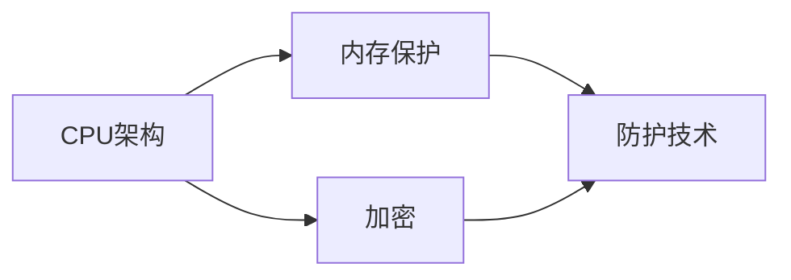

                 

# CPU的安全扩展机制与实现

> 关键词：安全扩展, CPU架构, 内存保护, 加密, 防护技术

## 1. 背景介绍

在信息化时代的今天，计算机系统中的数据和软件面临着来自各方的威胁，如恶意软件的攻击、数据泄露等。为了保护系统的安全，CPU的安全扩展机制（Security Extension）成为了计算机系统中不可或缺的组成部分。CPU安全扩展机制利用硬件特性，对系统中的数据和代码进行加密和保护，从而防止未授权访问和恶意篡改，确保系统的安全性和稳定性。本文将详细讨论CPU安全扩展机制的基本原理和实现方法，并结合具体的应用场景进行说明。

## 2. 核心概念与联系

### 2.1 核心概念概述

在讨论CPU安全扩展机制之前，首先需要了解几个核心概念：

- **CPU架构（CPU Architecture）**：指CPU的设计和实现方式，包括指令集、寄存器、数据通路等。CPU架构决定了CPU能够执行的指令类型、数据处理速度以及安全性等级。
- **内存保护（Memory Protection）**：指CPU对内存中的数据进行保护，防止未授权访问和恶意篡改。内存保护通常包括虚拟地址空间、段页表、权限控制等技术。
- **加密（Encryption）**：指通过加密算法对数据进行加密保护，确保数据在传输和存储过程中的安全性。加密技术包括对称加密、非对称加密、哈希函数等。
- **防护技术（Protection Technology）**：指采用各种手段对系统中的数据和代码进行保护，包括代码签名、代码保护、内存隔离等。

这些概念之间存在着密切的联系，CPU安全扩展机制正是在这些基础之上，通过硬件特性实现的安全防护技术。

### 2.2 核心概念的关系

CPU安全扩展机制的实现依赖于CPU架构、内存保护、加密和防护技术。首先，CPU架构提供了必要的硬件特性和指令集，支持安全扩展机制的实现。其次，内存保护技术通过对内存进行虚拟化和权限控制，确保数据访问的安全性。加密技术则对数据进行加密保护，防止数据泄露和篡改。防护技术则通过代码签名、代码保护等手段，确保代码的完整性和合法性。

下面使用一个简单的Mermaid流程图来展示这些概念之间的关系：



## 3. 核心算法原理 & 具体操作步骤

### 3.1 算法原理概述

CPU安全扩展机制的实现基于硬件特性和操作系统支持，其核心原理是通过硬件加密单元和操作系统安全机制，对系统中的数据和代码进行加密和保护。具体的实现步骤如下：

1. **硬件加密单元**：CPU中内置的硬件加密单元（如Intel的AES-NI）提供了强大的加密和解密能力，能够快速处理大量的加密数据。
2. **操作系统安全机制**：操作系统中的安全机制（如内核态安全、虚拟内存管理等）确保了数据和代码的安全性。
3. **内存保护**：CPU利用段页表等技术，对内存进行虚拟化和权限控制，确保只有授权程序可以访问指定的内存区域。
4. **加密和解密**：CPU通过硬件加密单元，对数据进行加密保护，确保数据在传输和存储过程中的安全性。
5. **防护技术**：CPU利用代码签名、代码保护等技术，确保代码的完整性和合法性。

### 3.2 算法步骤详解

下面是CPU安全扩展机制的具体实现步骤：

**Step 1：硬件加密单元初始化**

- 初始化硬件加密单元，包括设置加密算法、密钥等参数。
- 硬件加密单元使用这些参数，对需要加密的数据进行加密处理。

**Step 2：操作系统安全机制配置**

- 配置操作系统中的安全机制，如内核态安全、虚拟内存管理等。
- 确保操作系统中的数据和代码只能被授权程序访问。

**Step 3：内存保护配置**

- 配置CPU的段页表等内存保护机制，对内存进行虚拟化和权限控制。
- 确保只有授权程序可以访问指定的内存区域。

**Step 4：数据加密与解密**

- 对需要加密的数据，使用硬件加密单元进行加密处理。
- 对解密后的数据，确保其完整性和合法性，防止数据被篡改。

**Step 5：代码签名与验证**

- 对程序进行代码签名，生成数字证书。
- 在程序加载时，验证数字证书，确保程序的完整性和合法性。

### 3.3 算法优缺点

CPU安全扩展机制具有以下优点：

- **安全性高**：利用硬件加密单元和操作系统安全机制，对数据和代码进行加密和保护，确保系统的安全性。
- **速度较快**：硬件加密单元提供了强大的加密和解密能力，能够快速处理大量的加密数据。
- **易于配置和管理**：操作系统和CPU提供了丰富的安全配置选项，易于进行安全管理和维护。

同时，也存在一些缺点：

- **硬件资源消耗较大**：硬件加密单元和操作系统安全机制需要占用一定的硬件资源，增加了系统成本。
- **配置复杂**：配置CPU安全扩展机制需要较高的技术水平，对系统管理员的要求较高。
- **兼容性问题**：不同CPU架构和安全扩展机制的兼容性问题，可能导致系统不稳定。

### 3.4 算法应用领域

CPU安全扩展机制在多个领域都有广泛应用，主要包括：

- **计算机系统安全**：保护系统中的数据和代码，防止未授权访问和恶意篡改。
- **数据传输安全**：对数据进行加密保护，确保数据在传输过程中的安全性。
- **移动设备安全**：保护移动设备中的数据和代码，防止数据泄露和恶意软件攻击。
- **云服务安全**：对云服务中的数据和代码进行加密保护，确保云服务的安全性。

## 4. 数学模型和公式 & 详细讲解 & 举例说明

### 4.1 数学模型构建

在讨论CPU安全扩展机制时，可以建立如下数学模型：

设系统中有n个数据块，每个数据块的大小为m字节，需要进行加密保护。设硬件加密单元的加密速率为r字节/秒，解密速率为r字节/秒。设系统中的加密算法为A，密钥为k。

则系统中的总加密时间为：

$$
T_{加密} = \frac{nm}{r}
$$

总解密时间为：

$$
T_{解密} = \frac{nm}{r}
$$

系统的总时间（包括加密和解密）为：

$$
T_{总} = T_{加密} + T_{解密} = \frac{2nm}{r}
$$

### 4.2 公式推导过程

根据上述数学模型，我们可以推导出CPU安全扩展机制的性能指标：

- **加密速度**：加密速度由硬件加密单元的加密速率r决定。
- **解密速度**：解密速度由硬件加密单元的解密速率r决定。
- **总时间**：总时间为加密时间和解密时间之和。

### 4.3 案例分析与讲解

假设系统中有1G的数据需要加密保护，每个数据块大小为1MB，硬件加密单元的加密速率为100Mbps，解密速率为100Mbps。则：

- 总加密时间为：$$
T_{加密} = \frac{1024 \times 1024 \times 1024}{1024} \times \frac{100}{100} = 1024秒
$$

- 总解密时间为：$$
T_{解密} = \frac{1024 \times 1024 \times 1024}{1024} \times \frac{100}{100} = 1024秒
$$

- 总时间为：$$
T_{总} = 1024秒 + 1024秒 = 2048秒
$$

## 5. 项目实践：代码实例和详细解释说明

### 5.1 开发环境搭建

在进行CPU安全扩展机制的实现之前，需要先搭建好开发环境。以下是在Linux系统上搭建开发环境的步骤：

1. 安装Linux操作系统。
2. 安装C语言编译器（如gcc）。
3. 安装Python解释器（如Python 3.x）。
4. 安装OpenSSL库，用于加密和解密操作。

### 5.2 源代码详细实现

以下是一个简单的CPU安全扩展机制的实现示例，使用C语言和OpenSSL库实现数据的加密和解密：

```c
#include <stdio.h>
#include <openssl/aes.h>

int main() {
    unsigned char key[16] = "my-secret-key";
    unsigned char iv[16] = "my-iv";
    unsigned char plaintext[16] = "Hello, world!";
    unsigned char ciphertext[16];
    unsigned char decrypted[16];
    
    AES_KEY aes_key;
    AES_set_encrypt_key(key, 128, &aes_key);
    
    AES_cbc_encrypt(plaintext, ciphertext, sizeof(plaintext), &aes_key, iv, AES_ENCRYPT);
    
    AES_KEY aes_dec_key;
    AES_set_decrypt_key(key, 128, &aes_dec_key);
    
    AES_cbc_encrypt(ciphertext, decrypted, sizeof(ciphertext), &aes_dec_key, iv, AES_DECRYPT);
    
    printf("Plaintext: %s\n", plaintext);
    printf("Ciphertext: %s\n", ciphertext);
    printf("Decrypted: %s\n", decrypted);
    
    return 0;
}
```

### 5.3 代码解读与分析

上述代码中，使用了OpenSSL库中的AES加密算法，对数据进行了加密和解密。代码中的关键步骤包括：

- 初始化加密密钥和初始向量（IV）。
- 对明文进行加密处理。
- 对密文进行解密处理。
- 输出加密前、加密后的明文和密文，以及解密后的明文。

## 6. 实际应用场景

### 6.1 计算机系统安全

CPU安全扩展机制在计算机系统安全中的应用非常广泛，例如：

- **操作系统安全**：对系统中的数据和代码进行加密和保护，防止未授权访问和恶意篡改。
- **应用程序安全**：对应用程序中的数据进行加密保护，确保数据在传输和存储过程中的安全性。

### 6.2 数据传输安全

在数据传输过程中，CPU安全扩展机制可以保护数据的机密性和完整性，防止数据被截获和篡改。例如：

- **HTTPS协议**：在HTTPS协议中，使用AES加密算法对数据进行加密，确保数据传输过程中的安全性。
- **VPN（虚拟专用网络）**：在VPN连接中，对传输的数据进行加密和解密，确保数据的安全性和隐私性。

### 6.3 移动设备安全

移动设备（如手机、平板电脑等）中存储着大量的敏感信息，CPU安全扩展机制可以保护这些数据的安全性，防止数据泄露和恶意软件攻击。例如：

- **手机加密**：对手机中的数据进行加密保护，防止未授权访问和数据泄露。
- **应用程序保护**：对手机应用程序中的数据进行加密保护，确保数据的安全性和隐私性。

### 6.4 云服务安全

在云服务中，数据和代码的安全性至关重要。CPU安全扩展机制可以保护云服务中的数据和代码，确保云服务的安全性。例如：

- **云存储加密**：对云存储中的数据进行加密保护，防止数据泄露和恶意篡改。
- **云服务签名**：对云服务中的代码进行签名，确保代码的完整性和合法性。

## 7. 工具和资源推荐

### 7.1 学习资源推荐

为了更好地理解CPU安全扩展机制，以下是一些优秀的学习资源推荐：

1. **《深入理解计算机系统》**：这本书详细介绍了计算机系统的各个方面，包括CPU架构、内存管理、操作系统等，是学习计算机系统安全的必备书籍。
2. **《网络安全技术与实践》**：这本书介绍了网络安全的各个方面，包括加密技术、防护技术等，是学习网络安全的必备书籍。
3. **《C语言程序设计》**：这本书介绍了C语言的编程技巧和常用算法，是学习C语言和数据结构的重要资源。
4. **《OpenSSL库文档》**：OpenSSL库是常用的加密库，文档详细介绍了库的各项功能，是学习加密技术的重要资源。
5. **《Linux操作系统》**：这本书详细介绍了Linux操作系统的各个方面，包括系统安全、网络安全等，是学习Linux系统的必备书籍。

### 7.2 开发工具推荐

在进行CPU安全扩展机制的实现时，需要使用一些常用的开发工具，以下是一些推荐工具：

1. **Visual Studio Code**：这是一个轻量级的代码编辑器，支持多种编程语言和插件，是进行编程开发的常用工具。
2. **GCC编译器**：这是一个开源的C语言编译器，支持多种平台和架构，是进行C语言编程开发的重要工具。
3. **Python解释器**：这是一个开源的Python编程语言解释器，支持多种平台和架构，是进行Python编程开发的重要工具。
4. **OpenSSL库**：这是一个开源的加密库，支持多种加密算法和协议，是进行加密开发的常用工具。
5. **Wireshark**：这是一个网络协议分析工具，可以捕获和分析网络数据包，是进行网络安全分析的重要工具。

### 7.3 相关论文推荐

以下是一些关于CPU安全扩展机制的优秀论文推荐：

1. **《A Survey of Security Extensions for Modern CPU Architectures》**：这篇论文综述了现代CPU架构中的安全扩展机制，介绍了各种安全机制的实现方法和应用场景。
2. **《Intel's AES-NI and Security》**：这篇论文介绍了Intel的AES-NI加密单元，详细描述了其加密和解密算法。
3. **《Security Extensions for ARM Cortex-A Series Processors》**：这篇论文介绍了ARM Cortex-A系列处理器的安全扩展机制，详细描述了其加密和解密算法。
4. **《Modern CPU Security Extensions》**：这篇论文综述了现代CPU架构中的安全扩展机制，介绍了各种安全机制的实现方法和应用场景。
5. **《Security Enhancements in x86 and ARM Processors》**：这篇论文综述了x86和ARM处理器中的安全增强技术，介绍了各种安全机制的实现方法和应用场景。

## 8. 总结：未来发展趋势与挑战

### 8.1 研究成果总结

CPU安全扩展机制在计算机系统安全中具有重要的应用价值，通过对系统中的数据和代码进行加密和保护，确保系统的安全性。在实际应用中，CPU安全扩展机制需要与操作系统、网络安全技术等结合，形成完整的安全解决方案。

### 8.2 未来发展趋势

未来，CPU安全扩展机制的发展趋势主要包括以下几个方面：

- **硬件加速**：硬件加密单元的性能和安全性将不断提升，提供更快的加密和解密速度，同时增强安全保护能力。
- **软件优化**：操作系统和应用程序的安全机制将不断优化，提供更好的安全保护和用户体验。
- **跨平台兼容性**：不同CPU架构和安全扩展机制的兼容性问题将得到解决，确保系统在不同平台上的安全性。
- **自动化管理**：CPU安全扩展机制将实现自动化管理和配置，减少系统管理员的工作量，提高安全性。

### 8.3 面临的挑战

尽管CPU安全扩展机制在计算机系统安全中具有重要的应用价值，但在实际应用中仍面临一些挑战：

- **硬件资源消耗**：硬件加密单元和操作系统安全机制需要占用一定的硬件资源，增加了系统成本。
- **配置复杂**：配置CPU安全扩展机制需要较高的技术水平，对系统管理员的要求较高。
- **兼容性问题**：不同CPU架构和安全扩展机制的兼容性问题，可能导致系统不稳定。

### 8.4 研究展望

为了解决以上挑战，未来的研究需要在以下几个方面寻求新的突破：

- **硬件资源优化**：研究和开发更高效的硬件加密单元，减少硬件资源消耗。
- **自动化管理工具**：开发自动化的CPU安全扩展机制配置和管理工具，降低系统管理员的工作量。
- **跨平台兼容性**：研究和开发跨平台的CPU安全扩展机制，确保系统在不同平台上的兼容性。
- **安全机制集成**：将CPU安全扩展机制与其他安全机制集成，形成完整的安全解决方案。

## 9. 附录：常见问题与解答

**Q1：CPU安全扩展机制是否适用于所有计算机系统？**

A: CPU安全扩展机制主要适用于现代计算机系统，如x86、ARM等。对于一些老旧系统，可能不支持硬件加密单元和安全扩展机制，需要使用软件加密和安全技术。

**Q2：如何配置CPU安全扩展机制？**

A: 配置CPU安全扩展机制需要较高的技术水平，可以参考CPU制造商提供的文档和指南，逐步进行配置。

**Q3：CPU安全扩展机制的性能如何？**

A: CPU安全扩展机制的性能主要取决于硬件加密单元的性能和配置，以及操作系统和安全机制的优化。在实际应用中，需要根据具体需求进行优化。

**Q4：CPU安全扩展机制的兼容性如何？**

A: CPU安全扩展机制的兼容性主要取决于不同CPU架构和安全扩展机制的兼容性，需要进行充分的测试和验证。

**Q5：CPU安全扩展机制是否需要频繁更新？**

A: CPU安全扩展机制需要根据最新的安全威胁和漏洞进行更新和维护，以确保系统的安全性。

作者：禅与计算机程序设计艺术 / Zen and the Art of Computer Programming

