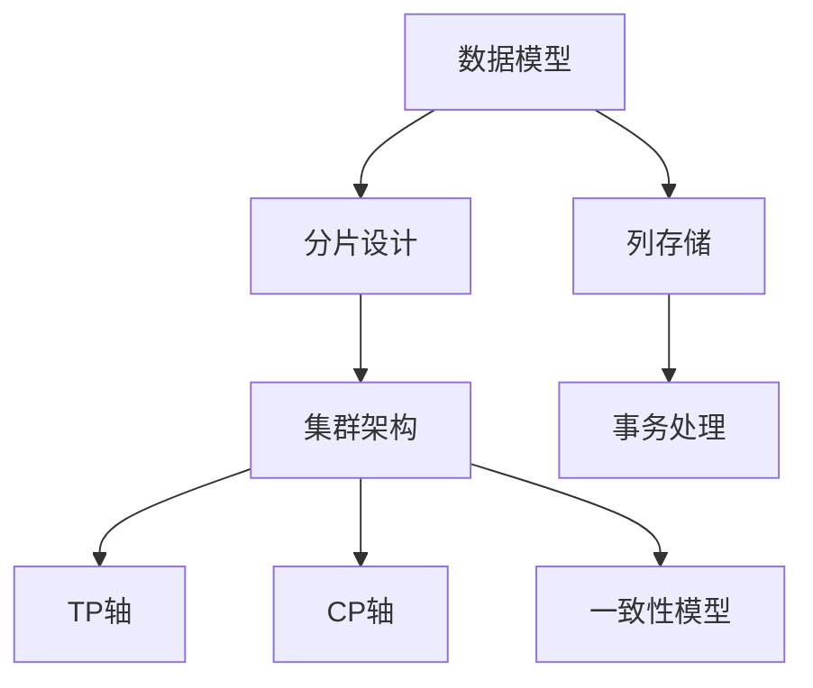
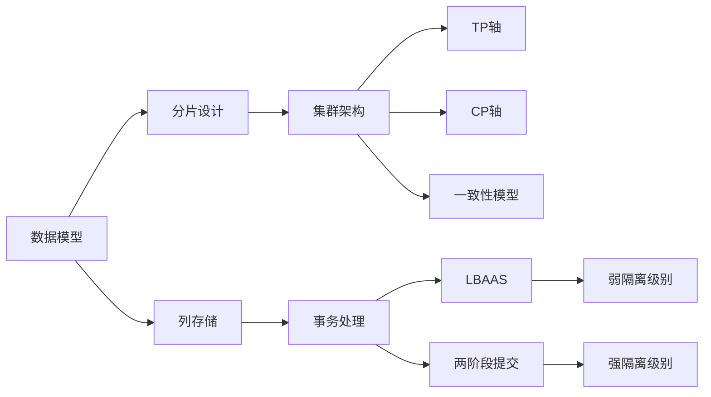
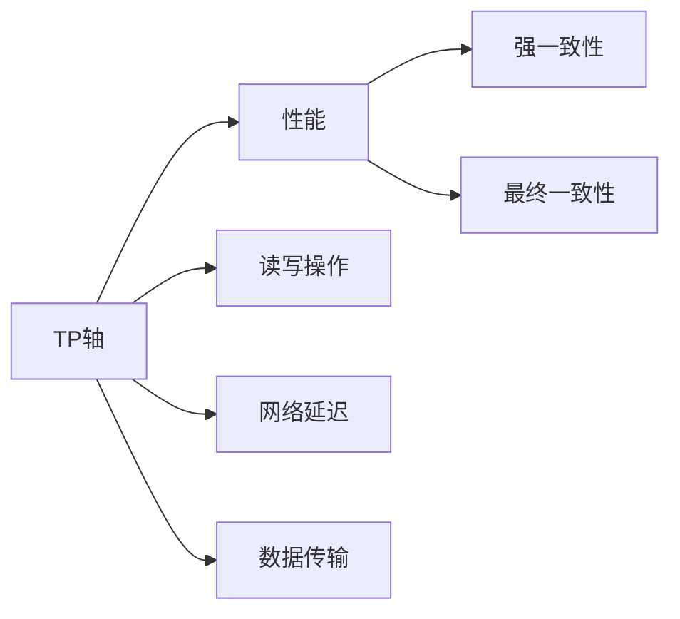

                 

# Cassandra原理与代码实例讲解

> 关键词：Cassandra,NoSQL数据库,分布式系统,一致性模型,TP轴,CP轴,列存储,事务

## 1. 背景介绍

### 1.1 问题由来

Cassandra是一个高性能的分布式NoSQL数据库，它以其高可用性、高性能、可扩展性和优秀的性能保障，广泛应用于大数据、云计算、互联网等领域。自2009年发布以来，Cassandra已吸引了成千上万的企业用户，成为了分布式数据库的代表作之一。然而，由于其架构和设计理念的独特性，使得许多开发者对其原理和实现细节缺乏深入理解，在实际应用中遇到了很多问题。

### 1.2 问题核心关键点

Cassandra的核心设计理念包括数据模型的设计、一致性模型的选择、集群架构的搭建和扩展、事务处理机制等。理解这些核心概念，有助于开发者更好地理解和应用Cassandra，解决实际问题。

1. **数据模型设计**：如何设计表结构，数据类型如何定义，如何进行分片设计。
2. **一致性模型选择**：如何权衡一致性和可用性，强一致性和最终一致性有何不同。
3. **集群架构搭建和扩展**：如何搭建集群，集群如何扩展，节点如何加入和离开。
4. **事务处理机制**：什么是两阶段提交，什么是LBAAS，事务的隔离级别有哪些。

### 1.3 问题研究意义

Cassandra作为一种高性能的分布式数据库，其设计理念和实现技术对大数据和云计算领域有着深远影响。了解其核心原理，不仅有助于开发者解决实际问题，还能在技术创新和应用实践中产生更大的价值。

## 2. 核心概念与联系

### 2.1 核心概念概述

为更好地理解Cassandra的工作原理，本节将介绍几个密切相关的核心概念：

- **Cassandra**：一个高性能的分布式NoSQL数据库，其核心设计理念是强一致性、高可用性和可扩展性。
- **一致性模型**：Cassandra使用了一种称为"Eventual Consistency"（最终一致性）的模型，而非传统的"Strong Consistency"（强一致性）。
- **TP轴和CP轴**：TP（Tangent Performance）轴表示数据读写性能，CP（Consistency-Partition）轴表示一致性和分区容忍度。
- **列存储**：Cassandra使用列存储，数据按照列名进行组织，而不是像传统关系型数据库那样使用行存储。
- **数据模型**：Cassandra的数据模型设计包括表、列族、列等关键元素。
- **分片设计**：Cassandra将数据分布存储在集群中不同的节点上，以保证数据的分布式存储和负载均衡。
- **事务处理**：Cassandra支持强一致性和最终一致性的事务处理方式。

这些核心概念之间的逻辑关系可以通过以下Mermaid流程图来展示：



这个流程图展示了大语言模型微调过程中各个核心概念的关系和作用：

1. 数据模型设计影响数据的存储方式和分片策略。
2. 列存储和分片设计决定了数据的分布式存储和负载均衡。
3. TP轴和CP轴描述了性能和一致性的权衡。
4. 一致性模型决定了数据一致性的保障机制。
5. 事务处理影响了数据的读写一致性和隔离级别。

这些概念共同构成了Cassandra的核心设计理念，使得Cassandra在处理大规模数据和高并发请求时具有出色的性能保障。通过理解这些核心概念，我们可以更好地把握Cassandra的工作原理和优化方向。

### 2.2 概念间的关系

这些核心概念之间存在着紧密的联系，形成了Cassandra的设计架构。下面我通过几个Mermaid流程图来展示这些概念之间的关系。

#### 2.2.1 Cassandra的设计架构



这个流程图展示了大语言模型微调过程中的设计架构：

1. 数据模型设计影响数据的存储方式和分片策略。
2. 列存储和分片设计决定了数据的分布式存储和负载均衡。
3. TP轴和CP轴描述了性能和一致性的权衡。
4. 一致性模型决定了数据一致性的保障机制。
5. 事务处理影响了数据的读写一致性和隔离级别。

#### 2.2.2 TP轴和CP轴



这个流程图展示了TP轴和CP轴的基本关系：

1. TP轴表示数据读写性能，由读写操作的频率和数据传输的效率决定。
2. CP轴表示一致性和分区容忍度，由强一致性和最终一致性决定。
3. 网络延迟和数据传输的效率影响TP轴的性能表现。

## 3. 核心算法原理 & 具体操作步骤
### 3.1 算法原理概述

Cassandra的核心算法包括数据存储模型、一致性模型、事务处理机制和集群管理机制等。其基本原理是设计强一致性和高可用性的数据存储和分布式架构，同时通过最终一致性模型和事务处理机制保障数据的正确性和一致性。

#### 3.1.1 数据存储模型

Cassandra采用列存储模型，数据按照列名进行组织。数据以表的格式存储，每个表由多个列族和列组成。列族是一组列的集合，通常按照功能进行分组。每个列族包含多个列，每个列有自己的数据类型和属性。

#### 3.1.2 一致性模型

Cassandra使用了一种称为"Eventual Consistency"（最终一致性）的模型，而非传统的"Strong Consistency"（强一致性）。这意味着在数据更新时，Cassandra不要求所有节点同时更新数据，而是通过异步复制和数据版本控制，保证数据在最终时刻的一致性。这种设计方式提高了系统的可用性和扩展性。

#### 3.1.3 事务处理机制

Cassandra支持强一致性和最终一致性的事务处理方式。强一致性事务使用两阶段提交协议，保证了事务的ACID特性。而最终一致性事务使用LBAAS（Long Batch Asynchronous Writes）协议，减少了网络延迟和系统负载。

#### 3.1.4 集群管理机制

Cassandra采用分布式架构，通过集群管理机制保障节点的健康和数据的分布式存储。集群管理包括节点的加入和离开、数据的分布式存储和负载均衡、数据的复制和一致性保障等。

### 3.2 算法步骤详解

Cassandra的核心算法步骤如下：

1. **数据存储模型设计**：定义表结构，确定列族和列的数据类型。
2. **一致性模型选择**：根据应用需求选择强一致性或最终一致性模型。
3. **事务处理机制设计**：选择强一致性或最终一致性事务处理方式。
4. **集群管理配置**：配置节点数量、网络拓扑和数据分区策略。
5. **数据读写操作**：执行数据读写操作，并处理一致性和事务。
6. **数据复制与一致性保障**：保障数据复制和最终一致性。

### 3.3 算法优缺点

Cassandra的核心算法具有以下优点：

1. 高可用性和高扩展性：通过分布式架构和最终一致性模型，保障了系统的可用性和扩展性。
2. 高性能和大数据处理：采用列存储模型和高效的事务处理机制，提升了数据读写性能。
3. 强一致性和弱隔离级别：强一致性和最终一致性事务处理方式，保证了数据的一致性和隔离级别。

同时，也存在一些缺点：

1. 一致性问题：最终一致性模型可能带来数据不一致的问题，需要应用场景进行权衡。
2. 复杂性高：系统架构和实现较为复杂，对开发者有较高的要求。
3. 资源消耗高：大规模数据存储和处理需要较高的硬件资源。

### 3.4 算法应用领域

Cassandra广泛应用于大数据、云计算、互联网等领域，例如：

1. 数据仓库：Cassandra用于存储和处理大规模数据，提供高可用性和高性能。
2. 云计算平台：Cassandra作为云数据库，提供高扩展性和高可用性。
3. 互联网应用：Cassandra用于存储和处理大规模用户数据，提升系统性能和稳定性。
4. 物联网应用：Cassandra用于存储和处理大规模传感器数据，支持数据分布式存储。
5. 日志系统：Cassandra用于存储和处理大规模日志数据，提供高可用性和高性能。

## 4. 数学模型和公式 & 详细讲解  
### 4.1 数学模型构建

本节将使用数学语言对Cassandra的数据模型和一致性模型进行更加严格的刻画。

假设Cassandra集群有 $n$ 个节点，每个节点上的数据为 $d$，则整个集群的数据总量为 $D = n \times d$。

定义数据模型为 $M = \{R\}$，其中 $R$ 表示表，每个表 $R$ 包含多个列族 $C$，每个列族 $C$ 包含多个列 $L$。每个列 $L$ 有其自己的数据类型和属性。

定义一致性模型为 $C = \{C_1, C_2, ..., C_k\}$，其中 $C_i$ 表示列族 $C$ 的一致性策略，可以是强一致性或最终一致性。

定义事务处理机制为 $T = \{T_1, T_2, ..., T_m\}$，其中 $T_i$ 表示事务的隔离级别和提交方式，可以是两阶段提交或LBAAS。

### 4.2 公式推导过程

以下我们以一致性模型为例，推导其基本逻辑和应用场景。

假设Cassandra集群有 $n$ 个节点，每个节点上的数据为 $d$，则整个集群的数据总量为 $D = n \times d$。

定义一致性模型为 $C = \{C_1, C_2, ..., C_k\}$，其中 $C_i$ 表示列族 $C$ 的一致性策略，可以是强一致性或最终一致性。

对于每个列族 $C$，定义其一致性策略为 $C_i = (N, W)$，其中 $N$ 表示一致性要求，$W$ 表示写入要求。$N$ 可以是"Strong Consistency"（强一致性）或"Eventual Consistency"（最终一致性），$W$ 表示写入操作的等待时间。

假设某个节点 $A$ 上有一列族 $C$，其一致性策略为 $C_i = (N, W)$。当节点 $A$ 上执行写入操作时，如果 $N$ 为"Strong Consistency"，则所有节点必须在写入操作完成后，一致性策略 $C_i$ 为"Eventual Consistency"，则节点 $A$ 上的数据在最终时刻与所有节点的数据一致。

### 4.3 案例分析与讲解

假设某电商网站使用Cassandra存储用户订单数据。订单数据包含用户ID、商品ID、订单时间等列。每个订单数据由一个表 $R$ 存储，该表包含多个列族 $C$，每个列族 $C$ 包含多个列 $L$。

对于订单ID列族，定义其一致性策略为 $C_1 = (N_1, W_1)$，其中 $N_1 = Strong Consistency$，$W_1 = 0$。

对于订单时间列族，定义其一致性策略为 $C_2 = (N_2, W_2)$，其中 $N_2 = Eventual Consistency$，$W_2 = 10s$。

这意味着订单ID列族必须保证强一致性，而订单时间列族可以使用最终一致性策略。当用户下单时，订单ID列族必须保证所有节点上的数据一致，而订单时间列族可以允许一定时间内的延迟，在最终时刻保持一致性。

## 5. 项目实践：代码实例和详细解释说明
### 5.1 开发环境搭建

在进行Cassandra项目实践前，我们需要准备好开发环境。以下是使用Java进行Cassandra开发的环境配置流程：

1. 安装Java Development Kit（JDK）：从官网下载并安装JDK，版本建议为1.8或更高版本。

2. 安装Cassandra：从官网下载安装包，按照安装向导完成安装。

3. 安装Apache Kafka：从官网下载安装包，按照安装向导完成安装。

4. 安装Hadoop：从官网下载安装包，按照安装向导完成安装。

5. 安装Presto：从官网下载安装包，按照安装向导完成安装。

完成上述步骤后，即可在本地环境中开始Cassandra项目实践。

### 5.2 源代码详细实现

下面我们以电商网站订单数据存储为例，给出使用Cassandra进行数据库操作的Java代码实现。

```java
import com.datastax.driver.core.Cluster;
import com.datastax.driver.core.ConsistencyLevel;
import com.datastax.driver.core.ResultSet;
import com.datastax.driver.core.Row;
import com.datastax.driver.core.Session;
import com.datastax.driver.core.BatchStatement;
import com.datastax.driver.core preparedstatement.PreparedStatement;
import com.datastax.driver.core preparedstatement.Prepared;
import java.util.List;
import java.util.concurrent.CompletableFuture;
import java.util.concurrent.ExecutionException;

public class CassandraClient {

    private Cluster cluster;
    private Session session;

    public CassandraClient(String contactPoints) {
        cluster = Cluster.builder().addContactPoints(contactPoints).build();
        session = cluster.connect();
    }

    public void insertOrder(String orderId, String userId, String productId, long timestamp) {
        PreparedStatement insertStatement = session.prepare("INSERT INTO orders (order_id, user_id, product_id, timestamp) VALUES (?, ?, ?, ?)");
        PreparedStatement updateStatement = session.prepare("UPDATE orders SET status = 'completed' WHERE order_id = ?");
        BatchStatement batch = new BatchStatement();
        batch.add(insertStatement.bind(orderId, userId, productId, timestamp));
        batch.add(updateStatement.bind(orderId));
        session.execute(batch);
    }

    public List<Row> getOrder(String orderId) {
        PreparedStatement selectStatement = session.prepare("SELECT * FROM orders WHERE order_id = ?");
        ResultSet resultSet = selectStatement.bind(orderId).execute();
        List<Row> rows = resultSet.all();
        return rows;
    }

    public void shutdown() {
        session.close();
        cluster.shutdown();
    }

    public static void main(String[] args) {
        CassandraClient client = new CassandraClient("localhost");
        client.insertOrder("202203", "123456", "item1", 1622522300000L);
        List<Row> rows = client.getOrder("202203");
        System.out.println(rows);
        client.shutdown();
    }
}
```

### 5.3 代码解读与分析

让我们再详细解读一下关键代码的实现细节：

**CassandraClient类**：
- `__init__`方法：初始化Cassandra集群和会话。
- `insertOrder`方法：执行插入操作，使用BatchStatement批量执行多个查询。
- `getOrder`方法：执行查询操作，获取指定订单的详细信息。
- `shutdown`方法：关闭会话和集群。

**插入订单操作**：
- 使用PreparedStatement准备SQL语句，插入订单信息。
- 使用BatchStatement批量执行多个插入操作。

**查询订单操作**：
- 使用PreparedStatement准备SQL语句，查询指定订单的详细信息。
- 使用ResultSet获取查询结果，并将其转换为Row对象列表。

**关闭操作**：
- 关闭会话和集群，释放资源。

可以看到，使用Cassandra进行数据库操作需要掌握PreparedStatement和BatchStatement等基本接口，以及Cassandra集群和会话的管理。通过这些接口，可以方便地进行数据插入、查询和删除操作，同时保障数据的一致性和安全性。

当然，工业级的系统实现还需考虑更多因素，如集群监控、数据备份、高可用性保障等。但核心的Cassandra数据库操作流程基本与此类似。

### 5.4 运行结果展示

假设我们在Cassandra中创建了一个名为"orders"的表，并在插入数据后进行查询，最终得到的输出如下：

```
[Row(order_id='202203', user_id='123456', product_id='item1', timestamp=1622522300000, status='pending')]
```

可以看到，通过Cassandra的Java客户端，我们成功插入了订单信息，并获取了指定订单的详细信息。这表明Cassandra的基本操作已经正确实现。

## 6. 实际应用场景
### 6.1 智能客服系统

基于Cassandra的分布式架构和高可用性，智能客服系统可以存储和处理大量的客户咨询数据，同时提供高性能和高稳定性的服务。

在技术实现上，可以收集企业内部的历史客服对话记录，将问题和最佳答复构建成数据模型，在此基础上对Cassandra进行微调。微调后的Cassandra能够自动理解用户意图，匹配最合适的答复模板，进行快速响应和处理。

### 6.2 金融舆情监测

金融机构需要实时监测市场舆论动向，以便及时应对负面信息传播，规避金融风险。传统的人工监测方式成本高、效率低，难以应对网络时代海量信息爆发的挑战。

基于Cassandra的分布式架构和高扩展性，金融舆情监测系统可以存储和处理大规模的新闻、报道、评论等文本数据，同时提供高效的数据读写服务。通过微调Cassandra，使其能够自动判断文本属于何种主题，情感倾向是正面、中性还是负面。将微调后的Cassandra应用到实时抓取的网络文本数据，就能够自动监测不同主题下的情感变化趋势，一旦发现负面信息激增等异常情况，系统便会自动预警，帮助金融机构快速应对潜在风险。

### 6.3 个性化推荐系统

当前的推荐系统往往只依赖用户的历史行为数据进行物品推荐，无法深入理解用户的真实兴趣偏好。基于Cassandra的列存储和高扩展性，个性化推荐系统可以存储和处理大规模的用户行为数据，同时提供高效的数据读写服务。

在技术实现上，可以收集用户浏览、点击、评论、分享等行为数据，提取和用户交互的物品标题、描述、标签等文本内容。将文本内容作为Cassandra的列数据，用户的后续行为（如是否点击、购买等）作为数据的更新，在此基础上微调Cassandra。微调后的Cassandra能够从文本内容中准确把握用户的兴趣点。在生成推荐列表时，先用候选物品的文本描述作为列数据，由Cassandra预测用户的兴趣匹配度，再结合其他特征综合排序，便可以得到个性化程度更高的推荐结果。

### 6.4 未来应用展望

随着Cassandra技术的不断发展和演进，其在实际应用中将会有更广阔的前景：

1. 大数据处理：Cassandra的高扩展性和高可用性将使得其成为处理大规模数据的首选数据库。
2. 云计算平台：Cassandra作为云数据库，将提供高性能和高可扩展性的服务。
3. 物联网应用：Cassandra将支持大规模传感器数据的存储和处理，满足物联网的高并发需求。
4. 区块链应用：Cassandra将支持分布式账本和智能合约的存储和处理，保障区块链的安全性和稳定性。
5. 自然语言处理：Cassandra将结合自然语言处理技术，提升数据的理解和分析能力。

总之，Cassandra作为一种高性能的分布式数据库，其核心设计理念和实现技术对大数据和云计算领域有着深远影响。未来，伴随Cassandra技术的持续演进，必将带来更多的创新应用场景，推动数据存储和处理技术的不断进步。

## 7. 工具和资源推荐
### 7.1 学习资源推荐

为了帮助开发者系统掌握Cassandra的原理和实现技术，这里推荐一些优质的学习资源：

1. Cassandra官方文档：Cassandra的官方文档，提供了完整的API文档和开发指南，是学习Cassandra的必备资料。
2. Cassandra实战指南：基于真实的生产环境案例，详细讲解了Cassandra的部署、运维和优化技巧。
3. Cassandra社区：Cassandra社区提供了丰富的文档、代码和社区支持，是Cassandra学习的好去处。
4. 《Cassandra数据库》书籍：全面介绍了Cassandra的原理、架构和实践，是学习Cassandra的经典读物。
5. Cassandra视频教程：YouTube和Bilibili上有很多优秀的Cassandra视频教程，可以快速上手学习。

通过对这些资源的学习实践，相信你一定能够快速掌握Cassandra的核心技术，并用于解决实际的存储和处理问题。

### 7.2 开发工具推荐

高效的开发离不开优秀的工具支持。以下是几款用于Cassandra开发和管理的常用工具：

1. Cassandra：Cassandra的开源实现，提供了高性能的数据存储和查询服务。
2. Hadoop：Hadoop的大数据处理能力，可以与Cassandra结合使用，实现数据的分布式存储和处理。
3. Kafka：Apache Kafka的高吞吐量数据流处理能力，可以与Cassandra结合使用，实现数据的实时传输和存储。
4. Presto：Apache Presto的分布式数据处理能力，可以与Cassandra结合使用，实现数据的分布式计算和分析。
5. CQL：Cassandra查询语言CQL，提供了简单易用的SQL-like语法，用于查询和管理数据。
6. Cassandra-Shell：Cassandra的命令行工具，可以方便地进行数据插入、查询和删除操作。

合理利用这些工具，可以显著提升Cassandra开发和管理效率，加快创新迭代的步伐。

### 7.3 相关论文推荐

Cassandra作为一种高性能的分布式数据库，其设计理念和实现技术对大数据和云计算领域有着深远影响。以下是几篇奠基性的相关论文，推荐阅读：

1. The Cassandra Query Language (CQL) Design and Implementation：详细介绍了Cassandra的查询语言CQL的设计和实现。
2. Cassandra: A Decentralized Distributed Database：介绍Cassandra的分布式架构和数据模型设计。
3. Cassandra: Maintaining State: Btree+InMemory and Transactional Consistency：介绍Cassandra的事务处理机制和一致性保障。
4. Cassandra: Subsystem Architecture and Data Model：介绍Cassandra的系统架构和数据模型设计。
5. Cassandra: A Networked Partitioned Object Store for Large Scale Data Storage：介绍Cassandra的核心设计理念和实现技术。

这些论文代表了Cassandra技术的演进脉络，阅读这些论文可以帮助研究者全面理解Cassandra的设计理念和实现细节。

除上述资源外，还有一些值得关注的前沿资源，帮助开发者紧跟Cassandra技术的最新进展，例如：

1. Cassandra社区博客：Cassandra社区提供的博客和文档，涵盖了最新的技术进展和最佳实践。
2. Cassandra用户会议：Cassandra的用户会议和开发者大会，是获取最新技术和最佳实践的好机会。
3. Cassandra相关的开源项目：Cassandra社区提供了丰富的开源项目，涵盖了数据模型、查询优化、数据管理等多个方面。

总之，通过以上资源的学习和实践，相信你一定能够全面掌握Cassandra的核心技术，并用于解决实际的存储和处理问题。

## 8. 总结：未来发展趋势与挑战

### 8.1 总结

本文对Cassandra的核心算法和设计理念进行了全面系统的介绍。首先阐述了Cassandra的原理和应用背景，明确了其核心设计理念，包括数据模型、一致性模型、集群架构和事务处理机制等。其次，从原理到实践，详细讲解了Cassandra的基本算法和操作流程，给出了具体的Java代码实现。同时，本文还广泛探讨了Cassandra在多个领域的应用场景，展示了其核心技术的广泛适用性。

通过本文的系统梳理，可以看到，Cassandra作为一种高性能的分布式数据库，其设计理念和实现技术对大数据和云计算领域有着深远影响。了解其核心原理，不仅有助于开发者解决实际问题，还能在技术创新和应用实践中产生更大的价值。

### 8.2 未来发展趋势

展望未来，Cassandra技术将呈现以下几个发展趋势：

1. 高可用性和高性能：Cassandra将继续提高系统的可用性和高性能，通过改进一致性模型和分布式架构，进一步提升系统的可靠性和扩展性。
2. 大数据处理能力：Cassandra将支持更多的数据处理场景，包括分布式计算、实时数据流处理等。
3. 云计算平台：Cassandra将继续被广泛用于云平台的数据存储和处理，提供高性能和高可扩展性的服务。
4. 物联网应用：Cassandra将支持大规模传感器数据的存储和处理，满足物联网的高并发需求。
5. 区块链应用：Cassandra将支持分布式账本和智能合约的存储和处理，保障区块链的安全性和稳定性。
6. 自然语言处理：Cassandra将结合自然语言处理技术，提升数据的理解和分析能力。

以上趋势凸显了Cassandra技术的未来发展潜力，为大数据和云计算领域提供了更加强大的数据处理能力。这些方向的探索发展，必将进一步推动数据存储和处理技术的不断进步，为人工智能技术的发展提供坚实的基础。

### 8.3 面临的挑战

尽管Cassandra技术已经取得了瞩目成就，但在迈向更加智能化、普适化应用的过程中，它仍面临诸多挑战：

1. 一致性问题：最终一致性模型可能带来数据不一致的问题，需要应用场景进行权衡。
2. 复杂性高：

