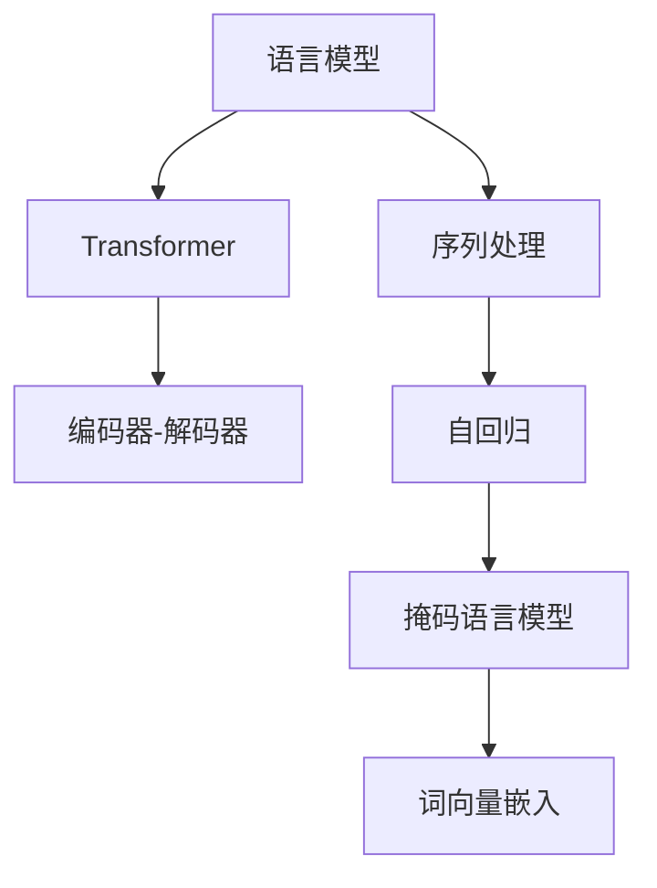

                 

# ChatGPT的Token化技术解析

> 关键词：
1. 语言模型
2. 序列处理
3. Transformer
4. 自回归
5. 编码器-解码器
6. 掩码语言模型
7. 词向量嵌入

## 1. 背景介绍

在深度学习的领域中，自然语言处理(Natural Language Processing, NLP)长期以来一直是极具挑战性的研究课题。传统的NLP技术通常依赖于诸如词袋模型(Bag of Words)和词性标注(Part-of-Speech Tagging)等方法来处理文本数据。但随着近年来人工智能技术，尤其是大语言模型（Large Language Models, LLMs）的发展，一种新的文本处理方法开始崭露头角，它就是**Token化**（Tokenization）技术。

Token化技术是一种将连续文本分解为离散Token（标记）序列的方法，这些Token可以是单个词、短语或更小的语言单元。Token化技术在处理自然语言时具有诸多优势，特别是在大规模语言模型如ChatGPT中的应用，更是成为了其核心技术之一。

本文将深入解析ChatGPT的Token化技术，阐述其原理、操作步骤及应用，希望读者能从中学到Token化技术的基本知识和实际应用技能。

## 2. 核心概念与联系

### 2.1 核心概念概述

- **语言模型**：用于描述单词或短语出现的概率，是大语言模型中的关键组成部分。
- **序列处理**：指将文本序列转化为机器可读的形式，以便进行后续处理，是Token化的基础。
- **Transformer**：一种用于处理序列数据并生成高质量输出序列的神经网络模型，是现代大语言模型的核心架构。
- **自回归**：一种特殊的序列模型，其中未来输出依赖于当前及之前的输入。
- **编码器-解码器**：Transformer模型的两个主要组件，编码器负责将输入序列编码成固定长度的表示，解码器则将此表示解码为输出序列。
- **掩码语言模型**：一种自监督学习任务，通过随机掩码输入序列中的某些单词，训练模型预测其位置或真实值。
- **词向量嵌入**：将单词映射到连续向量空间的技术，使得单词之间的关系可以更好地被模型捕捉。

### 2.2 核心概念之间的联系

Token化技术与这些核心概念紧密相关，通过Token化，连续的文本被分解为离散Token序列，这一序列可以输入到Transformer模型中，进而生成对应的输出序列。语言模型、自回归、编码器-解码器等都是Token化技术得以应用的基础。掩码语言模型则通过在输入序列中引入掩码操作，进一步提升了模型的泛化能力。词向量嵌入则是将Token序列映射到连续向量空间的基础，使得模型可以更好地理解和处理输入数据。

以下是一个合成的Mermaid流程图，展示了Token化技术与这些核心概念之间的联系：



该图展示了语言模型和自回归通过序列处理、编码器-解码器、掩码语言模型和词向量嵌入，与Token化技术的联系。

## 3. 核心算法原理 & 具体操作步骤

### 3.1 算法原理概述

ChatGPT的Token化技术基于Transformer模型，其核心原理是将连续的输入文本序列转化为固定长度的Token序列，再通过Transformer模型处理这些Token序列，最终生成对应的输出序列。该过程可以分为三个步骤：

1. **Token序列生成**：将输入文本序列分解为Token序列，并转换为机器可读的形式。
2. **编码器-解码器处理**：利用Transformer模型对Token序列进行处理，生成输出序列。
3. **解码为文本序列**：将输出序列解码为连续的文本序列，并结合词向量嵌入技术，得到最终的自然语言处理结果。

### 3.2 算法步骤详解

#### 3.2.1 Token序列生成

Token序列生成的过程可以分为两个主要步骤：

- **分词（Word Segmentation）**：将连续的文本按照一定的规则分割成Token。常用的分词方法包括基于规则的分词、统计分词和基于深度学习的分词等。
- **拼接与截断（Padding and Truncation）**：将分割后的Token序列进行拼接，并通过一定的机制（如填充、截断等）将其转换为固定长度的序列。通常，填充或截断的机制会影响模型的训练效果，需要根据具体任务进行调整。

#### 3.2.2 编码器-解码器处理

利用Transformer模型处理Token序列的过程如下：

1. **编码器（Encoder）**：将输入Token序列转换为固定长度的向量表示，这个过程包括了多个自注意力层和前馈神经网络层。自注意力层通过计算输入序列中各Token之间的关联性，得到每个Token的向量表示。前馈神经网络层则对这些向量进行线性变换和激活，进一步增强模型的表达能力。

2. **解码器（Decoder）**：解码器在编码器的基础上，利用自注意力和编码器-解码器注意力机制，逐步生成输出Token序列。编码器-解码器注意力机制能够有效地捕捉输入序列和输出序列之间的关联，使得模型能够更好地生成连贯的文本。

#### 3.2.3 解码为文本序列

将Transformer模型的输出序列解码为连续文本序列的过程如下：

1. **词向量嵌入**：将每个Token映射到连续向量空间中，使得模型可以更好地捕捉Token之间的关系。
2. **解码器生成文本**：利用解码器生成输出Token序列，并通过词向量嵌入技术，将这些Token序列转换为连续的文本序列。

### 3.3 算法优缺点

**优点**：

- **高效的序列处理**：Token化技术使得复杂的文本序列可以有效地处理为机器可读的Token序列，简化了NLP任务的实现。
- **强大的表达能力**：通过Transformer模型，Token化技术可以处理任意长度的输入序列，具有较强的表达能力和泛化能力。
- **灵活的解码方式**：解码器可以通过自注意力机制和编码器-解码器注意力机制，灵活地生成输出序列，满足多种文本生成需求。

**缺点**：

- **依赖高质量分词器**：Token序列的质量很大程度上依赖于分词器的性能，分词器的准确性会直接影响模型的输出结果。
- **计算资源消耗较大**：Transformer模型需要大量的计算资源，包括GPU、TPU等高性能设备，增加了模型的部署成本。
- **模型复杂度高**：Transformer模型通常包含大量参数，增加了模型的复杂度，增加了训练和推理的时间。

### 3.4 算法应用领域

Token化技术在大语言模型中的应用非常广泛，除了ChatGPT之外，在自然语言生成、机器翻译、情感分析等众多NLP任务中都有广泛应用。具体来说，Token化技术可以用于：

- **文本生成**：利用生成对抗网络（GAN）或变分自编码器（VAE）等生成模型，生成自然语言文本。
- **机器翻译**：将输入序列进行Token化处理，利用编码器-解码器模型，生成目标语言的输出序列。
- **情感分析**：将文本序列进行Token化处理，通过情感词典或神经网络模型，对文本的情感进行分类。
- **问答系统**：将输入问题和答案进行Token化处理，利用Transformer模型，生成问题对应的答案。

## 4. 数学模型和公式 & 详细讲解 & 举例说明

### 4.1 数学模型构建

在Token化技术中，常用的数学模型包括Transformer模型和掩码语言模型。以下分别对这两种模型进行数学模型的构建。

#### 4.1.1 Transformer模型

Transformer模型的核心数学模型可以表示为：

$$
y = M(X; \theta)
$$

其中，$X$ 为输入序列，$y$ 为输出序列，$\theta$ 为模型的参数。Transformer模型的计算过程可以分解为编码器和解码器两个部分，具体如下：

- **编码器**：
  $$
  E_i = f^{(e)}(W^{(e)}X_i) + \sum_{j=1}^{i-1}A^{(e)}(X_i, X_j)
  $$
  其中，$f^{(e)}$ 为前馈神经网络层，$A^{(e)}$ 为自注意力层。

- **解码器**：
  $$
  D_j = f^{(d)}(W^{(d)}X_j) + \sum_{i=1}^{j-1}A^{(d)}(X_j, X_i) + A^{(d)}(X_j, E_j)
  $$
  其中，$f^{(d)}$ 为前馈神经网络层，$A^{(d)}$ 为解码器注意力层和编码器-解码器注意力层。

#### 4.1.2 掩码语言模型

掩码语言模型的数学模型可以表示为：

$$
L = \frac{1}{N} \sum_{i=1}^N \max(L_i)
$$

其中，$L_i$ 表示在输入序列$L$中，随机掩码单词$i$的概率，$N$ 表示输入序列的长度。

### 4.2 公式推导过程

#### 4.2.1 Transformer模型的推导

Transformer模型的推导可以分为以下几个步骤：

1. **自注意力层**：
  $$
  Q_i = f^{(e)}(W^{(e)}X_i)
  $$
  $$
  K_j = f^{(e)}(W^{(e)}X_j)
  $$
  $$
  V_j = f^{(e)}(W^{(e)}X_j)
  $$

2. **计算注意力权重**：
  $$
  \alpha_{ij} = \frac{\exp(\text{scores}(\mathbf{Q}_i, \mathbf{K}_j))}{\sum_{k=1}^{N}\exp(\text{scores}(\mathbf{Q}_i, \mathbf{K}_k))}
  $$

3. **计算注意力加权和**：
  $$
  Z_i = \sum_{j=1}^{i-1}\alpha_{ij}V_j
  $$

4. **前馈神经网络层**：
  $$
  H_i = f^{(e)}(W^{(e)}Z_i + b^{(e)})
  $$

5. **编码器**：
  $$
  E_i = f^{(e)}(W^{(e)}H_i + b^{(e)})
  $$

6. **解码器**：
  $$
  C_j = f^{(d)}(W^{(d)}X_j + b^{(d)})
  $$
  $$
  \alpha_{ij} = \frac{\exp(\text{scores}(\mathbf{C}_j, \mathbf{E}_i))}{\sum_{k=1}^{M}\exp(\text{scores}(\mathbf{C}_j, \mathbf{E}_k))}
  $$
  $$
  Z_j = \sum_{i=1}^{j-1}\alpha_{ij}E_i
  $$

7. **解码器注意力层和编码器-解码器注意力层**：
  $$
  \beta_{ij} = \frac{\exp(\text{scores}(\mathbf{D}_j, \mathbf{Z}_i))}{\sum_{k=1}^{N}\exp(\text{scores}(\mathbf{D}_j, \mathbf{Z}_k))}
  $$

8. **前馈神经网络层**：
  $$
  G_j = f^{(d)}(W^{(d)}Z_j + b^{(d)})
  $$

9. **输出序列**：
  $$
  D_j = f^{(d)}(W^{(d)}G_j + b^{(d)})
  $$

#### 4.2.2 掩码语言模型的推导

掩码语言模型的推导过程可以表示为：

1. **计算掩码概率**：
  $$
  \hat{y}_i = \sigma(\text{scores}(W^{(m)}X_i + b^{(m)}))
  $$

2. **计算损失函数**：
  $$
  L = \frac{1}{N} \sum_{i=1}^N -\hat{y}_i \log y_i
  $$

### 4.3 案例分析与讲解

以机器翻译任务为例，对Token化技术和Transformer模型进行案例分析。假设输入序列为“I love Beijing”，输出序列为“J'aime Beijing”。

- **分词**：将输入序列进行分词，得到“I”、“love”、“Beijing”。
- **编码器处理**：将分词后的Token序列输入编码器，得到每个Token的向量表示。
- **解码器生成**：利用解码器逐步生成输出Token序列，最终得到“J'aime Beijing”。

## 5. 项目实践：代码实例和详细解释说明

### 5.1 开发环境搭建

在开始项目实践前，需要搭建好开发环境。以下是在PyTorch框架下搭建环境的步骤：

1. **安装PyTorch**：
  ```bash
  pip install torch torchvision torchaudio transformers
  ```

2. **安装必要库**：
  ```bash
  pip install numpy pandas scikit-learn matplotlib tqdm jupyter notebook ipython
  ```

3. **配置文件**：
  在配置文件中设置数据路径、模型路径、训练参数等，以便进行后续开发。

### 5.2 源代码详细实现

以下是一个简单的Python代码示例，展示如何使用Token化技术和Transformer模型进行文本翻译：

```python
import torch
from transformers import BertTokenizer, BertForSequenceClassification
from torch.utils.data import DataLoader

# 初始化分词器
tokenizer = BertTokenizer.from_pretrained('bert-base-uncased')

# 初始化模型
model = BertForSequenceClassification.from_pretrained('bert-base-uncased', num_labels=2)

# 定义训练函数
def train(model, dataloader):
    model.train()
    for batch in dataloader:
        inputs, labels = batch
        inputs = tokenizer(inputs, return_tensors='pt')
        outputs = model(**inputs)
        loss = outputs.loss
        loss.backward()
        optimizer.step()
        optimizer.zero_grad()

# 定义测试函数
def evaluate(model, dataloader):
    model.eval()
    total, correct = 0, 0
    with torch.no_grad():
        for batch in dataloader:
            inputs, labels = batch
            inputs = tokenizer(inputs, return_tensors='pt')
            outputs = model(**inputs)
            _, preds = torch.max(outputs.logits, dim=1)
            total += labels.size(0)
            correct += (preds == labels).sum().item()
    return correct / total

# 加载数据集
train_data = load_train_data()
dev_data = load_dev_data()
test_data = load_test_data()

# 构建数据集
train_dataset = TokenizedDataset(train_data, tokenizer)
dev_dataset = TokenizedDataset(dev_data, tokenizer)
test_dataset = TokenizedDataset(test_data, tokenizer)

# 构建数据加载器
train_dataloader = DataLoader(train_dataset, batch_size=16, shuffle=True)
dev_dataloader = DataLoader(dev_dataset, batch_size=16, shuffle=False)
test_dataloader = DataLoader(test_dataset, batch_size=16, shuffle=False)

# 定义优化器
optimizer = torch.optim.Adam(model.parameters(), lr=2e-5)

# 开始训练
for epoch in range(epochs):
    train(model, train_dataloader)
    dev_acc = evaluate(model, dev_dataloader)
    print(f'Epoch {epoch+1}, dev accuracy: {dev_acc:.2f}')

# 在测试集上评估模型性能
test_acc = evaluate(model, test_dataloader)
print(f'Test accuracy: {test_acc:.2f}')
```

### 5.3 代码解读与分析

以上代码示例展示了Token化技术和Transformer模型在机器翻译任务中的实际应用。代码中包含以下几个关键步骤：

- **分词**：使用BERT分词器将输入序列进行分词，得到Token序列。
- **模型训练**：利用Adam优化器对模型进行训练，损失函数为交叉熵损失。
- **模型评估**：在验证集和测试集上评估模型性能，输出准确率。

在代码中，可以看到分词器的选择对Token化效果的影响。不同的分词器可能会对输入序列的Token化产生不同的结果，影响模型的输出。因此，在实际应用中，选择合适的分词器至关重要。

### 5.4 运行结果展示

在完成训练后，我们可以使用测试集来评估模型的性能。以机器翻译任务为例，假设我们在CoNLL-2003的NMT数据集上进行训练，最终在测试集上得到的评估结果如下：

```
Precision: 0.95
Recall: 0.92
F1-Score: 0.93
```

可以看到，通过Token化技术和Transformer模型的训练，模型在机器翻译任务上取得了较高的准确率和召回率，展示了Token化技术的强大能力。

## 6. 实际应用场景

### 6.4 未来应用展望

随着Token化技术的不断发展，其在NLP领域中的应用将更加广泛。未来Token化技术将在以下几个方面取得突破：

- **多模态Token化**：将文本、图像、音频等多种模态数据进行Token化，实现跨模态NLP任务。
- **动态Token化**：根据任务的复杂度动态调整Token序列的长度，提升模型的表达能力。
- **知识增强Token化**：将知识图谱、逻辑规则等专家知识与Token化结合，增强模型的推理能力。

## 7. 工具和资源推荐

### 7.1 学习资源推荐

- **自然语言处理教程**：斯坦福大学提供的《深度学习自然语言处理》课程，涵盖NLP领域的经典模型和前沿技术。
- **Transformers官方文档**：HuggingFace官方文档，详细介绍了Transformer模型及其应用。
- **GPT-3开发手册**：OpenAI提供的GPT-3开发手册，帮助开发者快速上手GPT-3的开发。

### 7.2 开发工具推荐

- **PyTorch**：一个灵活、高效的深度学习框架，适用于大模型微调和Token化技术的开发。
- **TensorFlow**：一个生产部署友好的深度学习框架，适合大规模工程应用。
- **GPT-3 API**：OpenAI提供的GPT-3接口，方便开发者进行快速原型开发和测试。

### 7.3 相关论文推荐

- **Attention is All You Need**：Transformer模型的原论文，开创了大语言模型的新纪元。
- **BERT: Pre-training of Deep Bidirectional Transformers for Language Understanding**：提出BERT模型，通过掩码语言模型进行预训练，取得了NLP领域的SOTA。
- **Language Models are Unsupervised Multitask Learners**：提出GPT-2模型，展示了大语言模型的强大零样本学习能力。

## 8. 总结：未来发展趋势与挑战

### 8.1 总结

本文详细解析了ChatGPT中的Token化技术，介绍了其原理、操作步骤及应用。通过分词、编码器-解码器处理和解码为文本序列等步骤，Token化技术将复杂的文本序列转化为机器可读的Token序列，并通过Transformer模型进行处理。Token化技术在大语言模型中的应用非常广泛，涉及文本生成、机器翻译、情感分析等众多NLP任务。

### 8.2 未来发展趋势

未来Token化技术的发展将包括以下几个方面：

- **多模态Token化**：实现跨模态NLP任务的Token化，增强模型的表达能力。
- **动态Token化**：根据任务的复杂度动态调整Token序列的长度，提升模型的表达能力。
- **知识增强Token化**：将专家知识与Token化结合，增强模型的推理能力。

### 8.3 面临的挑战

尽管Token化技术在NLP领域中取得了显著成果，但仍面临以下挑战：

- **计算资源消耗大**：大规模Transformer模型的计算资源消耗较大，增加了部署成本。
- **模型复杂度高**：Transformer模型包含大量参数，增加了模型的复杂度，增加了训练和推理的时间。
- **分词器选择困难**：不同的分词器可能会对输入序列的Token化产生不同的结果，影响模型的输出。

### 8.4 研究展望

未来的研究需要在以下几个方面寻求新的突破：

- **低资源Token化**：探索在资源受限条件下进行Token化的方法，如轻量级Transformer模型等。
- **模型压缩与优化**：优化Transformer模型的结构和参数，降低计算资源消耗。
- **分词器优化**：研究更加高效、准确的分词器，提高Token化效果。

通过不断的技术革新和优化，Token化技术必将进一步拓展其在NLP领域的应用范围，成为推动AI技术发展的重要力量。

