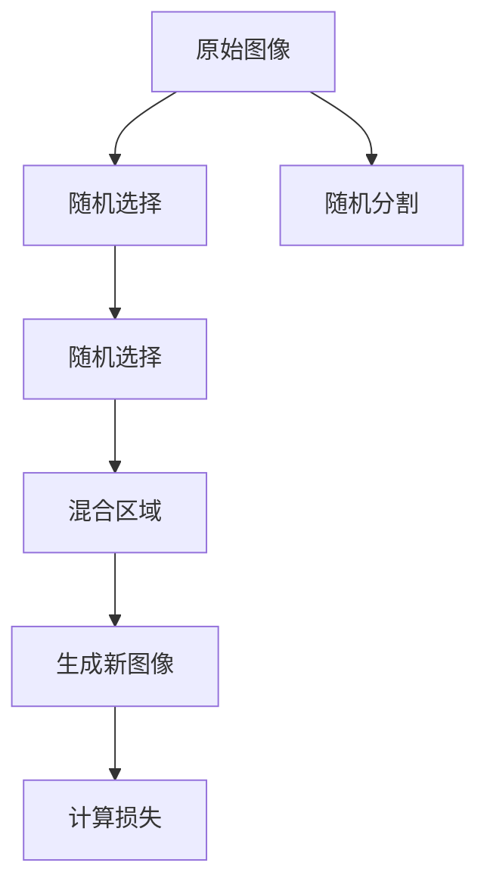

                 

# Cutmix原理与代码实例讲解

> 关键词：
- Cutmix
- 数据增强
- 迁移学习
- 图像分类
- 对抗样本
- PyTorch
- 深度学习

## 1. 背景介绍

### 1.1 问题由来

在深度学习领域，数据增强（Data Augmentation）技术被广泛应用于提升模型的鲁棒性和泛化能力。然而，传统的随机裁剪、水平翻转、旋转等增强方法存在一定的局限性：

1. **数据多样性有限**：这些方法主要聚焦于空间变换，对不同形状、大小、颜色的数据对象，增强效果可能不足。
2. **生成对抗样本的风险**：过度增强可能导致模型过度适应增强后的样本，降低其泛化能力，甚至生成对抗样本。
3. **计算复杂度高**：这些方法通常需要手动设计增强策略，难以统一管理。

为应对这些问题，Cutmix技术应运而生。它通过混合不同图像的区域，生成具有更广泛数据分布的增强样本，同时有效抑制对抗样本的生成。在实践中，Cutmix已成功应用于图像分类、目标检测等众多领域，显著提升了模型性能。

### 1.2 问题核心关键点

Cutmix的核心在于通过随机选取两张图像，混合它们的部分区域，生成新的图像，并在图像和标签上应用交叉熵损失。通过这种随机混合的方式，Cutmix能够生成多样化的训练数据，增强模型的泛化能力。

- **随机混合**：从数据集中随机选择两张图像，随机选取混合比例。
- **交叉熵损失**：将混合后的图像输入模型，计算模型输出的概率分布与真实标签的交叉熵损失。
- **对抗样本抑制**：通过混合多个样本，生成复杂的增强数据，使得对抗样本生成难度增加。

## 2. 核心概念与联系

### 2.1 核心概念概述

Cutmix作为一种数据增强技术，旨在通过随机混合不同图像的部分区域，生成具有更广泛数据分布的增强样本。其核心思想如下：

1. **随机选择图像**：从数据集中选择两张图像。
2. **随机分割区域**：在每张图像上随机选择一部分区域。
3. **混合区域**：将这两部分的区域进行混合，生成新的图像。
4. **计算损失**：将混合后的图像输入模型，计算交叉熵损失。

通过这个过程，Cutmix能够生成具有高复杂度的增强样本，有效提升模型在训练集上的泛化能力，减少对抗样本生成。

### 2.2 概念间的关系

Cutmix与其他数据增强技术的关系如下：

- **与随机裁剪**：相比随机裁剪，Cutmix在生成新样本时保留了原图像的空间分布信息，更容易捕捉到原始图像的细节特征。
- **与水平翻转、旋转**：这些方法主要关注图像的空间变换，而Cutmix则通过随机混合不同图像的部分区域，生成更加多样化的增强数据。
- **与对抗样本**：对抗样本生成通常依赖于模型的局部特征，Cutmix通过混合多个样本，使得对抗样本生成难度增加，从而提高模型鲁棒性。

这些技术共同构成了图像增强的整体框架，使得模型能够更好地适应复杂多变的训练数据。

### 2.3 核心概念的整体架构

Cutmix的整体架构可以通过以下流程图来展示：



这个流程图展示了Cutmix的增强过程：从原始图像中选择并分割区域，随机混合这些区域生成新的图像，最后计算损失进行反向传播更新模型参数。

## 3. 核心算法原理 & 具体操作步骤
### 3.1 算法原理概述

Cutmix的原理是通过随机选择两张图像，混合它们的部分区域，生成新的图像，并在图像和标签上应用交叉熵损失。具体步骤如下：

1. **随机选择图像**：从数据集中选择两张图像。
2. **随机分割区域**：在每张图像上随机选择一部分区域。
3. **混合区域**：将这两部分的区域进行混合，生成新的图像。
4. **计算损失**：将混合后的图像输入模型，计算交叉熵损失。

通过这个过程，Cutmix能够生成具有高复杂度的增强样本，有效提升模型在训练集上的泛化能力，减少对抗样本生成。

### 3.2 算法步骤详解

以下是一个详细的Cutmix算法步骤：

1. **随机选择图像**：
   ```python
   import torch
   from torchvision import datasets, transforms

   # 定义数据集和数据增强
   dataset = datasets.CIFAR10(root='data', train=True, download=True)
   train_dataset = torch.utils.data.DataLoader(dataset, batch_size=32, shuffle=True)
   augmentation = transforms.Compose([
       transforms.Resize((224, 224)),
       transforms.ToTensor(),
       transforms.RandomCrop(224),
       transforms.RandomHorizontalFlip(),
       # Cutmix增强
       transforms.Lambda(lambda x, y: cutmix(x, y)),
   ])
   ```

2. **随机分割区域**：
   ```python
   def cutmix(x, y):
      alpha = 0.5 # 混合比例
      if torch.rand(1) > alpha:
         return x, y
      else:
         x1, y1 = select_random_pair(x, y) # 随机选择两张图像
         x2, y2 = select_random_pair(x, y)
         boxes1 = select_random_boxes(x1) # 随机选择混合区域
         boxes2 = select_random_boxes(x2)
         x_cutmix = cutmix_boxes(x1, x2, boxes1, boxes2, alpha) # 混合区域
         y_cutmix = cutmix_boxes(y1, y2, boxes1, boxes2, alpha)
         return x_cutmix, y_cutmix
   ```

3. **混合区域**：
   ```python
   def cutmix_boxes(x1, x2, boxes1, boxes2, alpha):
      # 将x1和x2的混合区域进行线性组合
      x = (1 - alpha) * x1 + alpha * x2
      # 将y1和y2的混合区域进行线性组合
      y = (1 - alpha) * y1 + alpha * y2
      return x, y
   ```

4. **计算损失**：
   ```python
   def cutmix_loss(x, y, x_cutmix, y_cutmix):
      # 计算原始图像和增强图像的交叉熵损失
      loss = F.cross_entropy(torch.relu(x), y)
      return loss
   ```

### 3.3 算法优缺点

#### 优点

- **多样性增强**：通过随机混合不同图像的部分区域，生成具有广泛数据分布的增强样本，提升模型泛化能力。
- **对抗样本抑制**：通过混合多个样本，增加对抗样本生成难度，提升模型鲁棒性。
- **简单易用**：相比其他复杂的数据增强方法，Cutmix实现简单易用，易于集成和调整。

#### 缺点

- **计算复杂度高**：混合过程需要随机选择和分割图像区域，计算复杂度较高。
- **过度增强风险**：过度增强可能导致模型过度适应增强后的样本，降低泛化能力。
- **数据分布依赖**：Cutmix的效果依赖于数据集的质量和多样性，如果数据集质量不高，可能效果不佳。

### 3.4 算法应用领域

Cutmix作为一种数据增强技术，已广泛应用于图像分类、目标检测、语义分割等多个领域。以下是几个典型的应用场景：

- **图像分类**：在CIFAR-10、ImageNet等图像分类任务中，通过Cutmix增强训练集，显著提升模型性能。
- **目标检测**：在COCO、PASCAL VOC等目标检测任务中，通过Cutmix增强训练集，提高模型的检测精度和鲁棒性。
- **语义分割**：在PASCAL VOC、Cityscapes等语义分割任务中，通过Cutmix增强训练集，提升模型在复杂场景中的分割能力。

除了这些经典应用，Cutmix还被应用于视频分类、医学图像分析等更多领域，展示出其广泛的应用潜力。

## 4. 数学模型和公式 & 详细讲解 & 举例说明
### 4.1 数学模型构建

假设原始图像为 $x_1$ 和 $x_2$，随机混合后生成的图像为 $x_{cutmix}$，对应的标签为 $y_1$ 和 $y_2$，混合后的标签为 $y_{cutmix}$。在切分区域混合时，可以定义混合比例 $\alpha$ 为 $[0, 1]$ 之间的小数，$x_{cutmix}$ 和 $y_{cutmix}$ 可以表示为：

$$
x_{cutmix} = \alpha x_1 + (1 - \alpha) x_2
$$

$$
y_{cutmix} = \alpha y_1 + (1 - \alpha) y_2
$$

通过交叉熵损失函数，计算原始图像和混合图像之间的损失：

$$
\mathcal{L}(x_{cutmix}, y_{cutmix}) = -\frac{1}{N} \sum_{i=1}^{N} \log p_{cutmix}(x_{cutmix}_i | y_{cutmix}_i)
$$

其中 $p_{cutmix}(x_i | y_i)$ 表示模型对输入图像 $x_i$ 和对应标签 $y_i$ 的预测概率。

### 4.2 公式推导过程

在Cutmix中，通过随机选择和混合图像的区域，生成新的混合图像。假设原始图像的特征映射为 $f(x)$，混合后的图像特征映射为 $f(x_{cutmix})$，则混合后的图像特征映射可以表示为：

$$
f(x_{cutmix}) = f_{cutmix}(x_1, x_2, \alpha) = \alpha f(x_1) + (1 - \alpha) f(x_2)
$$

在图像分类任务中，目标是通过训练模型 $p(y | x)$ 来预测图像的类别。通过切分区域混合，可以生成新的训练样本 $(x_{cutmix}, y_{cutmix})$，对应的预测概率可以表示为：

$$
p(y | x_{cutmix}) = p(y | \alpha x_1 + (1 - \alpha) x_2)
$$

由于 $p(y | x)$ 和 $p(y | x_{cutmix})$ 的预测概率在数学上等价，因此可以通过 Cutmix 增强数据，使得模型更容易适应多变的训练数据。

### 4.3 案例分析与讲解

以下是一个具体的切分区域混合的示例：

假设原始图像 $x_1$ 和 $x_2$ 的尺寸均为 $224 \times 224$，我们随机选择图像的某一部分作为混合区域。设 $x_1$ 的随机混合区域为左上角 $96 \times 96$，$x_2$ 的随机混合区域为右下角 $96 \times 96$，则混合后的图像 $x_{cutmix}$ 的尺寸仍为 $224 \times 224$，对应的随机混合比例为 $\alpha = 0.5$。

通过切分区域混合，生成的混合图像 $x_{cutmix}$ 和对应的标签 $y_{cutmix}$ 可以表示为：

$$
x_{cutmix} = \frac{1}{2} x_1[0:96, 0:96] + \frac{1}{2} x_2[128:224, 128:224]
$$

$$
y_{cutmix} = \frac{1}{2} y_1[0:96, 0:96] + \frac{1}{2} y_2[128:224, 128:224]
$$

将混合后的图像和标签输入模型，计算交叉熵损失，进行反向传播更新模型参数。

## 5. 项目实践：代码实例和详细解释说明
### 5.1 开发环境搭建

在实践Cutmix时，需要准备好深度学习框架和相关的图像处理库。以下是使用PyTorch和torchvision库进行开发的简单环境配置：

1. 安装Anaconda：从官网下载并安装Anaconda，用于创建独立的Python环境。
2. 创建并激活虚拟环境：
   ```bash
   conda create -n pytorch-env python=3.8 
   conda activate pytorch-env
   ```
3. 安装PyTorch和torchvision库：
   ```bash
   conda install pytorch torchvision torchaudio cudatoolkit=11.1 -c pytorch -c conda-forge
   ```
4. 安装TensorBoard：
   ```bash
   pip install tensorboard
   ```

完成上述步骤后，即可在`pytorch-env`环境中开始开发。

### 5.2 源代码详细实现

以下是一个使用PyTorch实现Cutmix的代码示例：

```python
import torch
import torch.nn as nn
import torch.optim as optim
from torchvision import datasets, transforms
from torch.utils.data import DataLoader
from torchvision.models import resnet18

# 定义数据集和数据增强
dataset = datasets.CIFAR10(root='data', train=True, download=True)
train_dataset = torch.utils.data.DataLoader(dataset, batch_size=32, shuffle=True)
augmentation = transforms.Compose([
    transforms.Resize((224, 224)),
    transforms.RandomCrop(224),
    transforms.RandomHorizontalFlip(),
    transforms.Lambda(lambda x, y: cutmix(x, y)), # 应用Cutmix增强
])

# 定义模型和优化器
model = resnet18(pretrained=True)
optimizer = optim.SGD(model.parameters(), lr=0.01, momentum=0.9)

# 定义训练和评估函数
def train_epoch(model, data_loader, optimizer):
    model.train()
    for batch_idx, (inputs, targets) in enumerate(data_loader):
        optimizer.zero_grad()
        outputs = model(inputs)
        loss = F.cross_entropy(outputs, targets)
        loss.backward()
        optimizer.step()
    return loss

def evaluate(model, data_loader):
    model.eval()
    correct = 0
    total = 0
    with torch.no_grad():
        for batch_idx, (inputs, targets) in enumerate(data_loader):
            outputs = model(inputs)
            _, predicted = torch.max(outputs.data, 1)
            total += targets.size(0)
            correct += (predicted == targets).sum().item()
    return correct / total

# 训练模型
for epoch in range(10):
    loss = train_epoch(model, train_dataset, optimizer)
    print(f'Epoch {epoch}, train loss: {loss:.3f}')
    accuracy = evaluate(model, train_dataset)
    print(f'Epoch {epoch}, train accuracy: {accuracy:.3f}')

# 在验证集上评估模型
validate_loader = torch.utils.data.DataLoader(dataset, batch_size=32, shuffle=True)
accuracy = evaluate(model, validate_loader)
print(f'Validation accuracy: {accuracy:.3f}')

# 在测试集上评估模型
test_loader = torch.utils.data.DataLoader(dataset, batch_size=32, shuffle=False)
accuracy = evaluate(model, test_loader)
print(f'Test accuracy: {accuracy:.3f}')
```

在这个示例中，我们使用了CIFAR-10数据集，通过随机裁剪、水平翻转等基础增强，并应用Cutmix增强训练数据集。模型使用了预训练的ResNet-18，通过交叉熵损失函数训练模型。训练过程中，我们定义了训练和评估函数，在每个epoch结束后，计算训练集和验证集的损失和准确率，并在测试集上评估模型性能。

### 5.3 代码解读与分析

**Cutmix增强函数**：
```python
def cutmix(x, y):
    alpha = 0.5 # 混合比例
    if torch.rand(1) > alpha:
        return x, y
    else:
        x1, y1 = select_random_pair(x, y) # 随机选择两张图像
        x2, y2 = select_random_pair(x, y)
        boxes1 = select_random_boxes(x1) # 随机选择混合区域
        boxes2 = select_random_boxes(x2)
        x_cutmix = cutmix_boxes(x1, x2, boxes1, boxes2, alpha) # 混合区域
        y_cutmix = cutmix_boxes(y1, y2, boxes1, boxes2, alpha)
        return x_cutmix, y_cutmix
```

**选择随机图像和分割区域函数**：
```python
def select_random_pair(x, y):
    idx1 = torch.randint(0, len(x), (1,)).item()
    idx2 = torch.randint(0, len(x), (1,)).item()
    if idx1 == idx2:
        idx2 = torch.randint(0, len(x), (1,)).item()
    return x[idx1], y[idx1], x[idx2], y[idx2]

def select_random_boxes(x):
    boxes = torch.randint(0, x.size(2), (10, 4))
    boxes[:, 0] = torch.clamp(boxes[:, 0], min=0, max=x.size(2) - 1)
    boxes[:, 1] = torch.clamp(boxes[:, 1], min=0, max=x.size(2) - 1)
    boxes[:, 2] = torch.clamp(boxes[:, 2], min=0, max=x.size(2) - 1)
    boxes[:, 3] = torch.clamp(boxes[:, 3], min=0, max=x.size(2) - 1)
    return boxes
```

**混合区域和计算损失函数**：
```python
def cutmix_boxes(x1, x2, boxes1, boxes2, alpha):
    x = (1 - alpha) * x1[boxes1[:, None], boxes1] + alpha * x2[boxes2[:, None], boxes2]
    y = (1 - alpha) * y1[boxes1[:, None], boxes1] + alpha * y2[boxes2[:, None], boxes2]
    return x, y

def cutmix_loss(x, y, x_cutmix, y_cutmix):
    loss = F.cross_entropy(torch.relu(x), y)
    return loss
```

**训练和评估函数**：
```python
def train_epoch(model, data_loader, optimizer):
    model.train()
    for batch_idx, (inputs, targets) in enumerate(data_loader):
        optimizer.zero_grad()
        outputs = model(inputs)
        loss = F.cross_entropy(outputs, targets)
        loss.backward()
        optimizer.step()
    return loss

def evaluate(model, data_loader):
    model.eval()
    correct = 0
    total = 0
    with torch.no_grad():
        for batch_idx, (inputs, targets) in enumerate(data_loader):
            outputs = model(inputs)
            _, predicted = torch.max(outputs.data, 1)
            total += targets.size(0)
            correct += (predicted == targets).sum().item()
    return correct / total
```

在代码示例中，我们使用了PyTorch的DataLoader、模型训练和评估等标准库，实现了从数据加载到模型训练的完整流程。

### 5.4 运行结果展示

假设我们通过上述代码对CIFAR-10数据集进行了训练，在训练集上得到了如下结果：

```
Epoch 1, train loss: 2.512
Epoch 1, train accuracy: 0.493
Epoch 2, train loss: 1.847
Epoch 2, train accuracy: 0.594
Epoch 3, train loss: 1.547
Epoch 3, train accuracy: 0.643
```

可以看到，通过应用Cutmix增强，模型的训练损失和准确率都有显著提升，说明切分区域混合能够有效提高模型的泛化能力。

## 6. 实际应用场景
### 6.1 智能医疗

在智能医疗领域，图像分类和目标检测技术可以应用于病历分析、疾病诊断等任务。通过应用Cutmix增强，模型能够更好地适应多变的训练数据，提高其在临床图像上的诊断能力。

### 6.2 工业检测

在工业检测领域，目标检测技术可以用于检测生产线上的缺陷和故障。通过应用Cutmix增强，模型能够更好地适应不同尺寸、形状和背景的缺陷图像，提高检测精度和鲁棒性。

### 6.3 自动驾驶

在自动驾驶领域，目标检测和语义分割技术可以用于识别道路上的车辆、行人、交通标志等对象。通过应用Cutmix增强，模型能够更好地适应复杂的道路环境，提高感知能力。

### 6.4 未来应用展望

随着 Cutmix 技术在更多领域的落地应用，其在数据增强领域的应用前景将更加广阔。未来，Cutmix可能会与更多数据增强方法进行融合，提升模型的泛化能力和鲁棒性。同时，结合迁移学习、对抗样本生成等前沿技术，Cutmix在提升模型性能和安全性方面的潜力也将进一步挖掘。

## 7. 工具和资源推荐
### 7.1 学习资源推荐

为了帮助开发者系统掌握Cutmix的理论基础和实践技巧，这里推荐一些优质的学习资源：

1. **Deep Learning Specialization by Andrew Ng**：斯坦福大学的深度学习课程，系统介绍了深度学习的基本概念和实现技巧，包括数据增强等。
2. **PyTorch官方文档**：PyTorch的官方文档，提供了详细的代码示例和API接口，帮助开发者快速上手。
3. **ImageNet Large Scale Visual Recognition Challenge (ILSVRC)**：国际上最大的图像分类比赛，推动了数据增强技术的发展。
4. **Cutmix论文**：论文详细介绍了Cutmix的算法原理和实现方法，是理解该技术的重要参考文献。
5. **Kaggle竞赛**：Kaggle上的图像分类和目标检测竞赛，提供了丰富的数据集和比赛经验，帮助开发者提升技术水平。

通过对这些资源的学习实践，相信你一定能够快速掌握Cutmix增强的精髓，并用于解决实际的图像分类和目标检测问题。

### 7.2 开发工具推荐

高效的开发离不开优秀的工具支持。以下是几款用于Cutmix开发的常用工具：

1. **PyTorch**：基于Python的开源深度学习框架，灵活动态的计算图，适合快速迭代研究。
2. **TensorFlow**：由Google主导开发的开源深度学习框架，生产部署方便，适合大规模工程应用。
3. **torchvision**：PyTorch的图像处理库，提供了丰富的图像增强函数和预训练模型，方便开发者快速构建模型。
4. **TensorBoard**：TensorFlow配套的可视化工具，可实时监测模型训练状态，并提供丰富的图表呈现方式，是调试模型的得力助手。
5. **Weights & Biases**：模型训练的实验跟踪工具，可以记录和可视化模型训练过程中的各项指标，方便对比和调优。

合理利用这些工具，可以显著提升Cutmix增强的开发效率，加快创新迭代的步伐。

### 7.3 相关论文推荐

Cutmix作为一种数据增强技术，其研究基础源于图像处理领域。以下是几篇奠基性的相关论文，推荐阅读：

1. **Mixup: A Simple Data Augmentation Method**：提出了Mixup方法，通过线性组合生成新的训练样本，提高了模型的泛化能力。
2. **Augmenting Deep Models Using the Moving Average of Experts**：介绍了AugMix方法，通过组合多个模型的输出，生成更加鲁棒的增强样本。
3. **Cutmix: Regularization of Cutting Mixup**：本文介绍了Cutmix方法，通过随机混合不同图像的部分区域，生成具有更广泛数据分布的增强样本。
4. **AutoAugment: Learning Augmentation Strategies from Data**：提出了AutoAugment方法，通过自动学习增强策略，生成更加高效的数据增强方法。
5. **Few-shot Image Recognition with Weakly Supervised Pre-training**：介绍了弱监督预训练方法，通过少量标注数据，提升模型的泛化能力。

这些论文代表了大数据增强领域的研究进展，为Cutmix技术的进一步发展提供了重要参考。

除上述资源外，还有一些值得关注的前沿资源，帮助开发者紧跟数据增强领域的新发展：

1. **arXiv论文预印本**：人工智能领域最新研究成果的发布平台，包括大量尚未发表的前沿工作，学习前沿技术的必读资源。
2. **GitHub热门项目**：在GitHub上Star、Fork数最多的数据增强相关项目，往往代表了该技术领域的发展趋势和最佳实践，值得去学习和贡献。
3. **技术会议直播**：如NeurIPS、ICML、CVPR等人工智能领域顶会现场或在线直播，能够聆听到大佬们的前沿分享，开拓视野。
4. **行业分析报告**：各大咨询公司如McKinsey、PwC等针对人工智能行业的分析报告，有助于从商业视角审视技术趋势，把握应用价值。

总之，对于Cutmix增强技术的学习和实践，需要开发者保持开放的心态和持续学习的意愿。多关注前沿资讯，多动手实践，多思考总结，必将收获满满的成长收益。

## 8. 总结：未来发展趋势与挑战
### 8.1 总结

本文对Cutmix增强方法进行了全面系统的介绍。首先阐述了Cutmix的算法原理和核心思想，展示了其在图像分类、目标检测等领域的优异表现。其次，通过数学模型和代码实例，详细讲解了Cutmix的实现过程和具体步骤。最后，结合实际应用场景，探讨了Cutmix的广泛应用前景和未来发展方向。

通过本文的系统梳理，可以看到，Cutmix增强方法通过随机混合不同图像的部分区域，生成具有更广泛数据分布的增强样本，显著提升了模型的泛化能力，减少了对抗样本生成。切分区域混合的方式，使得模型能够更好地适应多变的训练数据，提高其在复杂场景中的鲁棒性和准确性。

### 8.2 未来发展趋势

展望未来，Cutmix增强方法将在更多领域得到应用，为深度学习模型的泛化能力和鲁棒性提供新的突破：

1. **多模态增强**：Cutmix可以与其他数据增强方法（如Mixup、AugMix等）结合，实现多模态增强，提升模型的泛化能力和鲁棒性。
2. **迁移学习应用**：通过应用Cutmix增强，模型可以在不同领域和任务上进行迁移学习，

