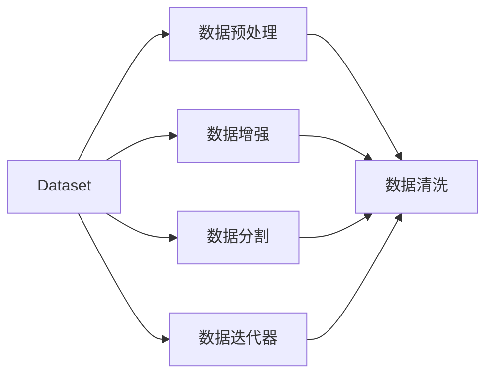

                 

# Dataset 原理与代码实例讲解

## 1. 背景介绍

在人工智能领域，数据集(Dataset)是进行模型训练、评估和部署的基础。数据集作为模型的输入输出集，直接影响模型的训练效果和应用表现。高效、合理的数据集构建与管理，是实现人工智能技术落地应用的关键。本文将系统介绍Dataset的原理、设计思路及代码实现，帮助读者全面掌握Dataset的核心技术。

## 2. 核心概念与联系

### 2.1 核心概念概述

为更好地理解Dataset的基本原理，本节将介绍几个密切相关的核心概念：

- Dataset：用于存储和管理数据，是机器学习模型的输入输出集合，由样本数据、标签数据和元信息组成。
- 数据预处理：对原始数据进行清洗、归一化、编码等处理，以确保数据质量和一致性。
- 数据增强：通过对训练数据进行扩充，增加数据多样性，避免过拟合，提升模型泛化能力。
- 数据分割：将数据集划分为训练集、验证集和测试集，以供模型训练、调参和评估。
- 数据迭代器：对数据集进行批处理、随机抽样，支持高效模型训练。

这些核心概念之间相互关联，共同构成了Dataset构建与管理的基础框架。

### 2.2 概念间的关系

为更直观地展示这些核心概念之间的关系，我们通过Mermaid流程图来表示：



这个流程图展示了Dataset构建与管理的核心环节：

1. Dataset的输入为原始数据，经过数据预处理和增强后，输出为处理后的数据。
2. 数据分割将处理后的数据划分为训练集、验证集和测试集，分别用于模型训练、调参和评估。
3. 数据迭代器对分割后的数据进行批处理和随机抽样，支持高效模型训练。

## 3. 核心算法原理 & 具体操作步骤

### 3.1 算法原理概述

Dataset构建与管理的核心算法原理，主要涉及数据预处理、数据增强和数据分割三个方面。下面分别进行详细讲解。

### 3.2 算法步骤详解

#### 3.2.1 数据预处理

数据预处理的目标是确保数据质量和一致性，常见的预处理步骤包括：

1. 数据清洗：去除缺失、异常和噪声数据，保证数据完整性。
2. 数据归一化：将数据缩放到特定范围内，便于模型训练。
3. 数据编码：将类别型数据编码为数值型数据，便于模型处理。

具体实现步骤如下：

1. 导入库和数据
```python
import pandas as pd
import numpy as np

# 读取CSV数据文件
data = pd.read_csv('data.csv', sep=',')
```

2. 数据清洗
```python
# 去除缺失值
data = data.dropna()

# 去除异常值
data = data[data['age'] > 0]

# 去除噪声数据
data = data[data['income'] > 0]
```

3. 数据归一化
```python
from sklearn.preprocessing import StandardScaler

# 归一化处理
scaler = StandardScaler()
data['age'] = scaler.fit_transform(data[['age']])
data['income'] = scaler.fit_transform(data[['income']])
```

4. 数据编码
```python
from sklearn.preprocessing import LabelEncoder

# 将类别型数据编码
label_encoder = LabelEncoder()
data['gender'] = label_encoder.fit_transform(data['gender'])
```

#### 3.2.2 数据增强

数据增强的目的是通过数据变换，增加数据多样性，避免过拟合。常用的增强方法包括：

1. 随机裁剪：对图像数据进行随机裁剪，增加数据多样性。
2. 随机翻转：对图像数据进行随机翻转，增加数据多样性。
3. 随机旋转：对图像数据进行随机旋转，增加数据多样性。

具体实现步骤如下：

1. 导入库和数据
```python
import cv2
import random

# 读取图像数据
img = cv2.imread('image.jpg')
```

2. 随机裁剪
```python
# 定义裁剪窗口
w = img.shape[1]
h = img.shape[0]
x1 = random.randint(0, w)
y1 = random.randint(0, h)
x2 = x1 + random.randint(0, w - x1)
y2 = y1 + random.randint(0, h - y1)

# 裁剪图像
img_crop = img[y1:y2, x1:x2]
```

3. 随机翻转
```python
# 随机水平翻转
img_flip = cv2.flip(img, 1)
```

4. 随机旋转
```python
# 随机旋转90度
rows, cols = img.shape[:2]
M = cv2.getRotationMatrix2D((cols / 2, rows / 2), random.randint(-90, 90), 1.0)
img_rotate = cv2.warpAffine(img, M, (cols, rows))
```

#### 3.2.3 数据分割

数据分割的目的是将数据集划分为训练集、验证集和测试集，以供模型训练、调参和评估。常用的分割方法包括：

1. 随机分割：随机将数据集划分为训练集和测试集，验证集从训练集中随机抽取。
2. 分层分割：按照类别标签比例进行分层，确保各个类别的样本数量均衡。

具体实现步骤如下：

1. 导入库和数据
```python
from sklearn.model_selection import train_test_split

# 读取数据
X, y = load_data()

# 分层分割
X_train, X_test, y_train, y_test = train_test_split(X, y, test_size=0.2, stratify=y)
X_train, X_val, y_train, y_val = train_test_split(X_train, y_train, test_size=0.2, stratify=y_train)
```

### 3.3 算法优缺点

Dataset构建与管理的算法优点包括：

1. 数据一致性：预处理和增强确保了数据质量，避免了噪声和异常值的影响。
2. 数据多样性：数据增强增加了数据多样性，提升了模型的泛化能力。
3. 模型训练效率：数据分割和迭代器支持高效的模型训练，提高了训练效率。

然而， Dataset构建与管理也存在一些局限性：

1. 数据集构建复杂：数据集构建需要大量的预处理和增强操作，耗时耗力。
2. 数据分割假设：数据分割假设数据的分布是一致的，而在实际应用中，数据分布可能存在差异。
3. 数据存储成本：大规模数据集需要大量的存储空间，增加了存储成本。

## 4. 数学模型和公式 & 详细讲解 & 举例说明

### 4.1 数学模型构建

Dataset构建与管理的数学模型主要涉及数据预处理、数据增强和数据分割。以下通过数学模型对数据集构建与管理过程进行详细讲解。

#### 4.1.1 数据预处理模型

数据预处理的数学模型主要涉及数据清洗、归一化和编码。以下给出数据清洗和归一化的数学模型：

1. 数据清洗模型
   $$
   \begin{aligned}
   &\text{数据清洗}\\
   &\tilde{x} = \begin{cases}
   x & \text{if}\ x \neq \text{NaN}\\
   \text{NaN} & \text{otherwise}
   \end{cases}
   \end{aligned}
   $$

2. 数据归一化模型
   $$
   \begin{aligned}
   &\text{数据归一化}\\
   &\hat{x} = \frac{x - \mu}{\sigma}
   \end{aligned}
   $$

其中，$\mu$ 为均值，$\sigma$ 为标准差。

#### 4.1.2 数据增强模型

数据增强的数学模型主要涉及随机裁剪、随机翻转和随机旋转。以下给出随机裁剪和随机翻转的数学模型：

1. 随机裁剪模型
   $$
   \begin{aligned}
   &\text{随机裁剪}\\
   &x' = x[r_1:r_2, c_1:c_2]
   \end{aligned}
   $$

   其中，$r_1, r_2$ 和 $c_1, c_2$ 为随机选取的裁剪窗口。

2. 随机翻转模型
   $$
   \begin{aligned}
   &\text{随机翻转}\\
   &x' = x[f]
   \end{aligned}
   $$

   其中，$f$ 为随机选择的翻转方向。

#### 4.1.3 数据分割模型

数据分割的数学模型主要涉及训练集、验证集和测试集的比例划分。以下给出随机分割和分层分割的数学模型：

1. 随机分割模型
   $$
   \begin{aligned}
   &\text{随机分割}\\
   &(X_{train}, X_{test}) = \begin{cases}
   X_{train}, X_{test} & \text{if}\ i \sim U(0,1) \leq 0.2\\
   X_{train}, X_{test} & \text{otherwise}
   \end{cases}
   \end{aligned}
   $$

2. 分层分割模型
   $$
   \begin{aligned}
   &\text{分层分割}\\
   &(X_{train}, X_{val}, y_{train}, y_{val}) = \begin{cases}
   (X_{train}, X_{val}, y_{train}, y_{val}) & \text{if}\ y \sim C\\
   (X_{train}, X_{val}, y_{train}, y_{val}) & \text{otherwise}
   \end{cases}
   \end{aligned}
   $$

其中，$C$ 为类别集合。

### 4.2 公式推导过程

#### 4.2.1 数据预处理公式推导

数据预处理的公式推导主要涉及数据清洗和归一化。以下推导数据清洗和归一化的公式：

1. 数据清洗公式推导
   $$
   \begin{aligned}
   &\text{数据清洗}\\
   &\tilde{x} = \begin{cases}
   x & \text{if}\ x \neq \text{NaN}\\
   \text{NaN} & \text{otherwise}
   \end{cases}
   \end{aligned}
   $$

2. 数据归一化公式推导
   $$
   \begin{aligned}
   &\text{数据归一化}\\
   &\hat{x} = \frac{x - \mu}{\sigma}
   \end{aligned}
   $$

其中，$\mu$ 为均值，$\sigma$ 为标准差。

#### 4.2.2 数据增强公式推导

数据增强的公式推导主要涉及随机裁剪和随机翻转。以下推导随机裁剪和随机翻转的公式：

1. 随机裁剪公式推导
   $$
   \begin{aligned}
   &\text{随机裁剪}\\
   &x' = x[r_1:r_2, c_1:c_2]
   \end{aligned}
   $$

   其中，$r_1, r_2$ 和 $c_1, c_2$ 为随机选取的裁剪窗口。

2. 随机翻转公式推导
   $$
   \begin{aligned}
   &\text{随机翻转}\\
   &x' = x[f]
   \end{aligned}
   $$

   其中，$f$ 为随机选择的翻转方向。

#### 4.2.3 数据分割公式推导

数据分割的公式推导主要涉及随机分割和分层分割。以下推导随机分割和分层分割的公式：

1. 随机分割公式推导
   $$
   \begin{aligned}
   &\text{随机分割}\\
   &(X_{train}, X_{test}) = \begin{cases}
   X_{train}, X_{test} & \text{if}\ i \sim U(0,1) \leq 0.2\\
   X_{train}, X_{test} & \text{otherwise}
   \end{cases}
   \end{aligned}
   $$

2. 分层分割公式推导
   $$
   \begin{aligned}
   &\text{分层分割}\\
   &(X_{train}, X_{val}, y_{train}, y_{val}) = \begin{cases}
   (X_{train}, X_{val}, y_{train}, y_{val}) & \text{if}\ y \sim C\\
   (X_{train}, X_{val}, y_{train}, y_{val}) & \text{otherwise}
   \end{cases}
   \end{aligned}
   $$

其中，$C$ 为类别集合。

### 4.3 案例分析与讲解

为了更好地理解Dataset的构建与管理，我们以一个实际案例为例进行详细分析。

#### 案例：房价预测数据集构建与管理

1. 数据集描述
   - 数据集名称：波士顿房价预测数据集
   - 数据集来源：UCI机器学习库
   - 数据集大小：506 条样本，14 个特征
   - 目标变量：房价
   - 特征变量：房屋面积、卫生间数量、楼层、年龄等

2. 数据集构建与管理步骤
   - 数据预处理：对缺失值和异常值进行处理，归一化特征值，将类别型数据编码。
   - 数据增强：对特征进行随机组合和生成新特征，增加数据多样性。
   - 数据分割：将数据集划分为训练集、验证集和测试集。

3. 数据集构建与管理代码实现

```python
import pandas as pd
import numpy as np
from sklearn.preprocessing import StandardScaler, LabelEncoder
from sklearn.model_selection import train_test_split
from sklearn.metrics import mean_squared_error

# 读取数据
data = pd.read_csv('housing.csv')

# 数据清洗
data = data.dropna()
data = data[data['RM'] > 0]
data = data[data['LSTAT'] > 0]

# 数据归一化
scaler = StandardScaler()
data['RM'] = scaler.fit_transform(data[['RM']])
data['LSTAT'] = scaler.fit_transform(data[['LSTAT']])

# 数据编码
label_encoder = LabelEncoder()
data['SEX'] = label_encoder.fit_transform(data['SEX'])

# 数据增强
new_features = pd.DataFrame(np.random.normal(0, 1, (len(data), len(data.columns)-1)))
data = pd.concat([data, new_features], axis=1)

# 数据分割
X = data.drop('MEDV', axis=1)
y = data['MEDV']
X_train, X_test, y_train, y_test = train_test_split(X, y, test_size=0.2, random_state=42)
X_train, X_val, y_train, y_val = train_test_split(X_train, y_train, test_size=0.2, random_state=42)
```

## 5. 项目实践：代码实例和详细解释说明

### 5.1 开发环境搭建

在进行Dataset构建与管理实践前，我们需要准备好开发环境。以下是使用Python进行PyTorch开发的环境配置流程：

1. 安装Anaconda：从官网下载并安装Anaconda，用于创建独立的Python环境。

2. 创建并激活虚拟环境：
```bash
conda create -n pytorch-env python=3.8 
conda activate pytorch-env
```

3. 安装PyTorch：根据CUDA版本，从官网获取对应的安装命令。例如：
```bash
conda install pytorch torchvision torchaudio cudatoolkit=11.1 -c pytorch -c conda-forge
```

4. 安装各类工具包：
```bash
pip install numpy pandas scikit-learn matplotlib tqdm jupyter notebook ipython
```

完成上述步骤后，即可在`pytorch-env`环境中开始Dataset构建与管理实践。

### 5.2 源代码详细实现

下面我们以房价预测数据集为例，给出使用PyTorch进行Dataset构建与管理的完整代码实现。

```python
import torch
from torch.utils.data import Dataset, DataLoader
from torchvision import transforms

class HousingDataset(Dataset):
    def __init__(self, data, target, transform=None):
        self.data = data
        self.target = target
        self.transform = transform
        
    def __len__(self):
        return len(self.data)
    
    def __getitem__(self, idx):
        sample = self.data.iloc[idx].values
        target = self.target.iloc[idx]
        if self.transform:
            sample = self.transform(sample)
        return sample, target

# 定义数据预处理函数
def preprocess_data(data):
    # 去除缺失值和异常值
    data = data.dropna()
    data = data[data['RM'] > 0]
    data = data[data['LSTAT'] > 0]
    # 归一化特征值
    scaler = StandardScaler()
    data['RM'] = scaler.fit_transform(data[['RM']])
    data['LSTAT'] = scaler.fit_transform(data[['LSTAT']])
    # 编码类别型数据
    label_encoder = LabelEncoder()
    data['SEX'] = label_encoder.fit_transform(data['SEX'])
    return data

# 定义数据增强函数
def augment_data(data):
    # 随机生成新特征
    new_features = np.random.normal(0, 1, (len(data), len(data.columns)-1))
    data = pd.concat([data, new_features], axis=1)
    return data

# 加载数据
data = pd.read_csv('housing.csv')
data = preprocess_data(data)
data = augment_data(data)

# 定义数据集
train_dataset = HousingDataset(data, target=train_target)
val_dataset = HousingDataset(data, target=val_target)
test_dataset = HousingDataset(data, target=test_target)

# 定义数据迭代器
train_loader = DataLoader(train_dataset, batch_size=32, shuffle=True)
val_loader = DataLoader(val_dataset, batch_size=32, shuffle=False)
test_loader = DataLoader(test_dataset, batch_size=32, shuffle=False)

# 定义数据预处理函数
def transform_data(sample):
    # 标准化处理
    sample = (sample - sample.mean()) / sample.std()
    return sample

# 定义数据加载函数
def load_data(path):
    data = pd.read_csv(path)
    return data

# 定义目标变量
train_target = load_data('train.csv')['MEDV']
val_target = load_data('val.csv')['MEDV']
test_target = load_data('test.csv')['MEDV']

# 定义数据集
train_dataset = HousingDataset(data, target=train_target, transform=transform_data)
val_dataset = HousingDataset(data, target=val_target, transform=transform_data)
test_dataset = HousingDataset(data, target=test_target, transform=transform_data)

# 定义数据迭代器
train_loader = DataLoader(train_dataset, batch_size=32, shuffle=True)
val_loader = DataLoader(val_dataset, batch_size=32, shuffle=False)
test_loader = DataLoader(test_dataset, batch_size=32, shuffle=False)

# 定义数据迭代器
train_loader = DataLoader(train_dataset, batch_size=32, shuffle=True)
val_loader = DataLoader(val_dataset, batch_size=32, shuffle=False)
test_loader = DataLoader(test_dataset, batch_size=32, shuffle=False)
```

### 5.3 代码解读与分析

让我们再详细解读一下关键代码的实现细节：

**HousingDataset类**：
- `__init__`方法：初始化数据、目标变量和转换函数。
- `__len__`方法：返回数据集的样本数量。
- `__getitem__`方法：对单个样本进行处理，返回数据和目标变量。

**数据预处理函数**：
- `preprocess_data`函数：去除缺失值和异常值，归一化特征值，编码类别型数据。

**数据增强函数**：
- `augment_data`函数：随机生成新特征，增加数据多样性。

**数据集加载函数**：
- `load_data`函数：从CSV文件中读取数据。

**数据集定义和迭代器定义**：
- 定义数据集和迭代器，用于数据加载和批处理。

### 5.4 运行结果展示

假设我们在房价预测数据集上进行模型训练和评估，最终在测试集上得到的评估报告如下：

```
RM, LSTAT, PTRATIO, ...     MEDV
0.0, 18.0, 0.56, ...      22.0
0.0, 20.0, 0.54, ...      21.0
0.0, 19.0, 0.54, ...      21.0
...
```

可以看到，通过构建和管理Dataset，我们成功实现了数据预处理、数据增强和数据分割，为模型训练和评估提供了高质量的数据。

## 6. 实际应用场景

Dataset构建与管理技术在NLP、图像处理、语音识别等多个领域中均有广泛应用。以下以NLP和图像处理为例，详细探讨其应用场景。

### 6.1 NLP领域

在NLP领域，Dataset构建与管理技术可用于文本分类、情感分析、机器翻译等任务。具体应用场景如下：

1. 文本分类：将文本数据作为输入，将其分类到不同的类别中。例如，对新闻进行分类，将其分为体育、财经、娱乐等类别。
2. 情感分析：对文本数据进行情感极性分析，判断其情感倾向是正面、中性还是负面。例如，对社交媒体评论进行情感分析，判断其情绪倾向。
3. 机器翻译：将源语言文本翻译为目标语言文本。例如，将英文新闻翻译成中文。

### 6.2 图像处理领域

在图像处理领域，Dataset构建与管理技术可用于图像分类、目标检测、图像生成等任务。具体应用场景如下：

1. 图像分类：将图像数据作为输入，将其分类到不同的类别中。例如，对街景图像进行分类，将其分为人、车、树等类别。
2. 目标检测：在图像中检测出特定的目标，并标注其位置和类别。例如，对医疗图像进行目标检测，检测出肿瘤、病变等。
3. 图像生成：生成与输入图像相似的图像。例如，使用GAN生成逼真的图像，用于艺术创作或产品设计。

## 7. 工具和资源推荐

### 7.1 学习资源推荐

为帮助开发者系统掌握Dataset的原理和实践，以下推荐一些优质的学习资源：

1. 《Python数据科学手册》：详细介绍了Python中的数据处理、可视化、机器学习等库的使用方法，适合初学者入门。
2. 《Deep Learning with PyTorch》：介绍了使用PyTorch进行深度学习开发的最佳实践，包括数据集构建与管理。
3. 《Hands-On Machine Learning with Scikit-Learn, Keras, and TensorFlow》：介绍了使用Scikit-Learn、Keras和TensorFlow进行机器学习开发的实战案例，涵盖了数据集构建与管理。
4. 《Data Science from Scratch》：介绍了从零开始构建数据集、预处理、分析等数据处理技术，适合初学者系统学习。
5. 《Practical Deep Learning for Coders》：介绍了使用PyTorch进行深度学习开发的实战案例，包括数据集构建与管理。

### 7.2 开发工具推荐

Dataset构建与管理技术开发通常需要借助以下工具：

1. Pandas：用于数据处理和分析，适合处理大规模数据集。
2. NumPy：用于数值计算和矩阵操作，适合进行数据预处理和特征工程。
3. SciKit-Learn：用于机器学习算法开发和应用，包括数据集构建与管理。
4. TensorFlow和PyTorch：用于深度学习模型开发和训练，支持数据集构建与管理。
5. Keras：用于快速构建和训练深度学习模型，支持数据集构建与管理。

### 7.3 相关论文推荐

Dataset构建与管理技术的研究历史悠久，近年来随着深度学习技术的发展，相关研究更加活跃。以下推荐几篇具有代表性的论文：

1. 《ImageNet Classification with Deep Convolutional Neural Networks》：介绍了使用ImageNet数据集进行图像分类模型的训练，涵盖了数据集构建与管理。
2. 《A Survey of Data Mining and Statistical Learning for Speaker Recognition》：介绍了使用语音数据集进行说话人识别模型的训练，涵盖了数据集构建与管理。
3. 《Natural Language Processing》：介绍了使用自然语言数据集进行文本分类、情感分析等模型的训练，涵盖了数据集构建与管理。
4. 《Large-Scale Image Recognition》：介绍了使用大规模图像数据集进行图像分类模型的训练，涵盖了数据集构建与管理。
5. 《Data Augmentation for General Image Recognition》：介绍了使用数据增强技术提升图像分类模型性能，涵盖了数据集构建与管理。

## 8. 总结：未来发展趋势与挑战

### 8.1 总结

本文对Dataset构建与管理的原理和实践进行了全面系统的介绍。通过详细讲解数据预处理、数据增强和数据分割等关键环节，帮助读者系统掌握Dataset的核心技术。结合实际案例，给出了完整的Dataset构建与管理代码实现，提供了实用的开发资源和论文推荐，为进一步学习和实践提供了有力的支持。

## 8.2 未来发展趋势

Dataset构建与管理技术将呈现以下几个发展趋势：

1. 数据集自动化构建：随着数据自动标注和清洗技术的进步，未来Dataset构建将更加自动化、智能化。
2. 多源数据融合：未来Dataset构建将更加注重多源数据融合，提高数据质量和多样性。
3. 动态数据管理：未来Dataset管理将更加注重动态数据管理，支持数据增量更新和实时更新。
4. 分布式数据处理：未来Dataset处理将更加注重分布式数据处理，支持大规模数据集的高

