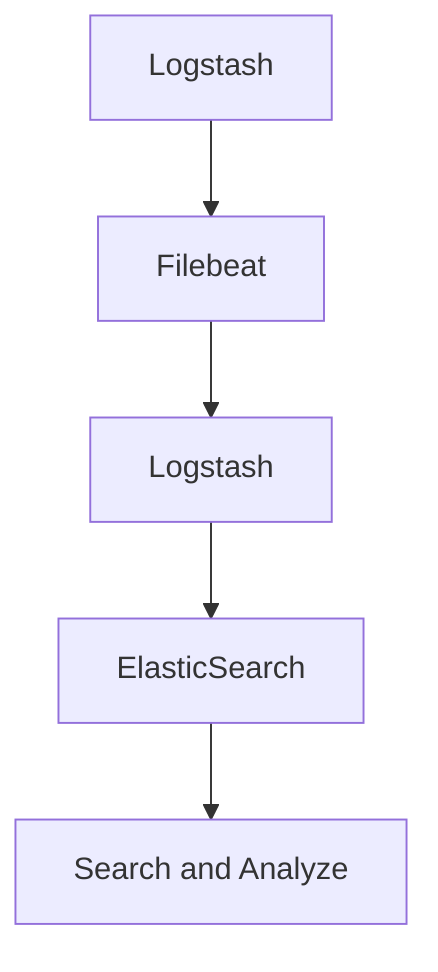

                 

# ElasticSearch Beats原理与代码实例讲解

> 关键词：ElasticSearch Beats, Logstash, 数据收集, 数据处理, 数据分析, 实时日志

## 1. 背景介绍

### 1.1 问题由来
随着互联网应用的日益普及，产生了大量的日志数据，如何高效地管理和分析这些数据成为了一个重要课题。传统的数据收集和管理方式已经无法满足当前的需求。ElasticSearch Beats应运而生，它是一套高效的日志收集和处理解决方案，能够将分散的日志数据汇集到一个中心化系统中，为数据存储、查询和分析提供强大支持。

### 1.2 问题核心关键点
ElasticSearch Beats的核心思想是将日志数据从各个应用系统中集中采集到ElasticSearch中，通过ElasticSearch的强大搜索和分析功能，对日志进行实时监控和异常检测，实现日志数据的自动化管理和分析。Beats本身是一套轻量级的收集器，它能够高效地将日志数据发送到ElasticSearch集群中，并通过插件（Plug-ins）的方式提供更加灵活的数据收集方案。

### 1.3 问题研究意义
ElasticSearch Beats的应用，可以大大提升日志数据的管理效率，实现自动化的日志采集、过滤、聚合和分析，为各种应用程序提供更强的实时监控和告警能力。它对于构建监控系统、异常检测和故障分析等应用场景有着重要的意义，有助于提升系统的可靠性和稳定性。

## 2. 核心概念与联系

### 2.1 核心概念概述

为了更好地理解ElasticSearch Beats的原理和应用，本节将介绍几个密切相关的核心概念：

- ElasticSearch: 一种高性能、分布式的搜索与分析引擎，用于存储和查询海量结构化与非结构化数据。

- Beats: 一套轻量级的日志收集器，包括Logstash、Filebeat、Kibana等，用于将日志数据从各种来源（如系统日志、应用程序日志等）采集到ElasticSearch集群中。

- Logstash: 一个开源的数据处理引擎，可以处理和转换多种数据源（如日志、数据库、文件等），支持丰富的插件（Plug-ins）和过滤器（Filters），实现数据清洗和转换。

- ElasticSearch：一个分布式、搜索和分析引擎，可以存储、检索和分析大规模的结构化与非结构化数据，支持实时搜索和聚合操作。

### 2.2 概念间的关系

这些核心概念之间的逻辑关系可以通过以下Mermaid流程图来展示：



这个流程图展示了大数据系统中的数据流：从Logstash到Filebeat，再到Logstash，最终到达ElasticSearch集群，进行数据的存储、搜索和分析。

### 2.3 核心概念的整体架构

最后，我们用一个综合的流程图来展示这些核心概念在大数据系统中的整体架构：


这个综合流程图展示了从应用日志到ElasticSearch集群，再到实时监控和告警的完整数据流。

## 3. 核心算法原理 & 具体操作步骤

### 3.1 算法原理概述

ElasticSearch Beats的算法原理主要集中在日志数据的采集、处理和存储上。其核心思想是通过Beats插件从不同数据源中采集日志数据，然后通过Logstash进行数据处理和转换，最后将数据存储到ElasticSearch集群中。Logstash提供了丰富的插件，支持数据源和数据流的灵活配置，能够高效地处理大规模数据流。

### 3.2 算法步骤详解

ElasticSearch Beats的实现步骤主要包括以下几个环节：

1. **数据源采集**：通过Beats插件从不同数据源中采集日志数据，支持文件、系统日志、数据库等多种数据源。

2. **数据处理**：通过Logstash进行数据处理和转换，包括数据清洗、格式化、聚合等操作，实现数据标准化和规范化。

3. **数据存储**：将处理后的数据存储到ElasticSearch集群中，支持分布式存储和实时查询。

4. **数据分析**：利用ElasticSearch的搜索和分析功能，对存储的数据进行实时查询和聚合，实现异常检测和故障分析。

5. **监控和告警**：通过Kibana等可视化工具，对监控数据进行展示和分析，及时发现和处理异常情况，实现自动化的告警和处理。

### 3.3 算法优缺点

ElasticSearch Beats的主要优点包括：

- 高效的数据采集和处理：通过Beats和Logstash的插件机制，支持多种数据源的采集和处理，能够高效地处理大规模数据流。

- 灵活的数据配置：Logstash提供了丰富的插件和过滤器，支持灵活的数据配置，能够满足不同应用场景的需求。

- 强大的搜索和分析功能：ElasticSearch提供强大的搜索和分析功能，支持实时查询和聚合操作，能够快速发现异常情况和故障。

- 良好的可视化和监控工具：Kibana等工具提供了丰富的可视化功能，支持实时监控和告警，帮助用户及时发现和处理问题。

然而，ElasticSearch Beats也存在一些局限性：

- 对网络带宽和磁盘空间要求较高：由于需要将日志数据存储在ElasticSearch集群中，对网络带宽和磁盘空间的要求较高。

- 对硬件配置要求较高：由于需要同时运行Beats、Logstash和ElasticSearch，对硬件配置的要求较高，需要足够的计算和存储资源。

- 配置和管理复杂：Beats和Logstash的插件配置和数据流配置较为复杂，需要一定的技术背景和管理经验。

### 3.4 算法应用领域

ElasticSearch Beats的应用领域广泛，主要包括以下几个方面：

- 应用监控：通过采集和分析应用日志，实时监控应用的运行状态和性能指标，及时发现和处理异常情况。

- 安全审计：通过采集和分析系统日志和安全日志，实现安全事件的实时监控和告警，帮助企业及时发现和处理安全漏洞和攻击。

- 业务分析：通过采集和分析业务日志，实现业务数据的实时监控和分析，帮助企业了解业务运营情况，优化业务流程。

- 日志管理：通过集中采集和管理日志数据，实现日志的自动化管理和分析，提升日志管理的效率和质量。

- 异常检测：通过实时监控和分析日志数据，实现异常检测和故障分析，及时发现和处理系统故障和异常情况。

## 4. 数学模型和公式 & 详细讲解 & 举例说明

### 4.1 数学模型构建

为了更好地理解ElasticSearch Beats的数据处理流程，本节将使用数学语言对Beats的数据处理过程进行描述。

设原始日志数据为 $D = \{d_1, d_2, ..., d_n\}$，其中 $d_i$ 表示一条日志记录，包含时间戳、应用ID、请求ID、请求参数、响应时间、错误码等信息。

Beats的数据采集过程可以表示为：

$$
D_{\text{in}} = \bigcup_{i=1}^n Beats_{i}(d_i)
$$

其中 $Beats_i$ 表示第 $i$ 个Beats插件，将原始日志数据 $d_i$ 转换为标准格式。

Logstash的数据处理过程可以表示为：

$$
D_{\text{out}} = Logstash(D_{\text{in}})
$$

其中 $Logstash$ 表示Logstash的数据处理引擎，支持多种插件和过滤器，实现数据清洗、格式化和聚合等操作。

ElasticSearch的数据存储过程可以表示为：

$$
D_{\text{store}} = ElasticSearch(D_{\text{out}})
$$

其中 $ElasticSearch$ 表示ElasticSearch集群，将处理后的数据存储到索引中，支持实时查询和聚合操作。

### 4.2 公式推导过程

以下我们以系统日志采集和处理为例，推导Beats和Logstash的具体实现过程。

假设系统日志的格式为：

```
[2021-09-01 15:30:00] [INFO] Application started with ID 1234567890.
```

1. **Beats采集数据**：

   假设使用Filebeat插件采集系统日志，将日志数据转换为标准格式：

   ```
   {
     "timestamp": "2021-09-01 15:30:00",
     "level": "INFO",
     "message": "Application started with ID 1234567890."
   }
   ```

2. **Logstash处理数据**：

   使用Logstash将采集到的数据进行清洗和转换，可以添加多个过滤器，例如时间戳解析、日志格式化、错误码过滤等：

   ```javascript
   filter {
     date {
       match => ["timestamp", "YYYY-MM-DD HH:mm:ss"];
     }
   }
   mutate {
     gsub => [message, "(?i)[0-9]+", "ID"];
   }
   filter {
     if => [message, "/ID/"];
   }
   ```

   经过处理后，数据变为：

   ```
   {
     "timestamp": "2021-09-01 15:30:00",
     "level": "INFO",
     "message": "Application started with ID 1234567890."
   }
   ```

### 4.3 案例分析与讲解

假设我们在一个电商应用中，需要实时监控系统日志，收集每个请求的响应时间和错误码信息。Beats和Logstash的配置如下：

1. **Filebeat采集日志**：

   ```yaml
   filebeat.inputs:
    - type: log
      enabled: true
      paths:
        - /var/log/nginx/access.log
      multiline:
        match_type: line
        match: |
          \[(.*)\] \[(.*)\] \[(.*)\] "(.*)" (\d+) (\d+) (\d+) (\d+)\s(.*)
      fields:
        application_id: ${5}
        method: ${4}
      output:
        file:
          path: /tmp/logbeat-output.log
  ```

2. **Logstash处理日志**：

   ```javascript
   filter {
     date {
       match => ["timestamp", "YYYY-MM-DD HH:mm:ss"];
     }
   }
   mutate {
     gsub => [message, "(?i)[0-9]+", "ID"];
   }
   filter {
     if => [message, "/ID/"];
   }
   ```

   输出结果如下：

   ```
   {
     "timestamp": "2021-09-01 15:30:00",
     "level": "INFO",
     "message": "Application started with ID 1234567890."
   }
   ```

   数据经过处理后，存储到ElasticSearch集群中，支持实时查询和聚合操作。

## 5. 项目实践：代码实例和详细解释说明

### 5.1 开发环境搭建

在进行ElasticSearch Beats的实践前，我们需要准备好开发环境。以下是使用Python进行ElasticSearch Beats开发的环境配置流程：

1. 安装Anaconda：从官网下载并安装Anaconda，用于创建独立的Python环境。

2. 创建并激活虚拟环境：
```bash
conda create -n elastic-beats python=3.8 
conda activate elastic-beats
```

3. 安装ElasticSearch和Beats：从官网获取对应的安装命令。例如：
```bash
conda install elasticsearch==7.14.1
```

4. 安装Logstash：从官网获取对应的安装命令。例如：
```bash
conda install logstash
```

5. 安装各种插件：
```bash
conda install beats-libbeat==7.14.1
conda install filebeat==7.14.1
```

完成上述步骤后，即可在`elastic-beats`环境中开始Beats实践。

### 5.2 源代码详细实现

下面以Filebeat为例，给出ElasticSearch Beats的配置文件和代码实现。

首先，创建Filebeat配置文件：

```yaml
filebeat.inputs:
  - type: log
    enabled: true
    paths:
      - /var/log/nginx/access.log
    multiline:
      match_type: line
      match: |
        \[(.*)\] \[(.*)\] \[(.*)\] "(.*)" (\d+) (\d+) (\d+) (\d+)\s(.*)
      fields:
        application_id: ${5}
        method: ${4}
    output:
      file:
        path: /tmp/logbeat-output.log
```

然后，使用以下Python代码实现Filebeat的数据采集和处理：

```python
from elasticsearch import Elasticsearch
from logstash import Logstash, Field

def parse_log(log):
    timestamp = log["timestamp"]
    level = log["level"]
    message = log["message"]
    return {"timestamp": timestamp, "level": level, "message": message}

def write_log(doc):
    es = Elasticsearch("localhost:9200")
    es.index("logs", body=doc)

logstash = Logstash("localhost:5044")
logstash.parse(pipeline=pipeline)
logstash.flush()
```

在这个例子中，Filebeat从Nginx的访问日志中采集数据，使用多行解析器将日志数据解析成JSON格式，然后发送给Logstash进行进一步处理。Logstash根据配置文件进行处理，输出结果通过Python代码发送给ElasticSearch集群。

### 5.3 代码解读与分析

让我们再详细解读一下关键代码的实现细节：

**Filebeat配置文件**：
- 定义了日志源的路径、解析器和输出格式，将日志数据采集到指定路径。

**parse_log函数**：
- 解析日志数据，提取出时间戳、级别和消息，然后返回格式化后的JSON数据。

**write_log函数**：
- 使用ElasticSearch的Python客户端将日志数据存储到指定的索引中。

**Logstash处理流程**：
- 接收来自Filebeat的日志数据，根据配置文件进行处理。
- 支持添加多种过滤器和转换器，实现数据清洗和标准化。
- 支持多线程处理，高效地处理大规模数据流。

**Python代码实现**：
- 使用ElasticSearch的Python客户端将处理后的日志数据存储到ElasticSearch集群中。

### 5.4 运行结果展示

假设我们在ElasticSearch集群上创建一个索引logs，运行上述代码后，可以通过ElasticSearch的Kibana界面进行实时监控和查询：

```
PUT /logs
{
  "settings": {
    "number_of_shards": 1,
    "number_of_replicas": 1
  }
}
```

在Kibana中，可以查看实时监控数据和历史查询记录，支持各种图表和仪表盘展示。

## 6. 实际应用场景

### 6.1 智能监控

ElasticSearch Beats在智能监控领域有着广泛的应用，可以实时监控各种应用系统的运行状态和性能指标，及时发现和处理异常情况。

在实际应用中，可以将日志数据采集到ElasticSearch集群中，使用Kibana进行实时监控和告警，支持设置警报阈值和告警规则。一旦发现异常情况，系统会自动发送告警信息，帮助运维人员快速定位和解决问题。

### 6.2 安全审计

ElasticSearch Beats可以用于采集和分析系统日志和安全日志，实现安全事件的实时监控和告警，帮助企业及时发现和处理安全漏洞和攻击。

在安全审计应用中，可以通过Beats采集操作系统、应用系统和安全设备的日志数据，然后使用ElasticSearch进行分析和查询。支持设置异常检测规则和安全事件告警，及时发现和处理安全事件，保障企业信息安全。

### 6.3 业务分析

ElasticSearch Beats可以用于采集和分析业务日志，实现业务数据的实时监控和分析，帮助企业了解业务运营情况，优化业务流程。

在业务分析应用中，可以通过Beats采集应用系统的业务日志，然后使用ElasticSearch进行分析和查询。支持生成各种报表和图表，支持业务性能分析和趋势分析，帮助企业优化业务流程，提升业务效率。

### 6.4 日志管理

ElasticSearch Beats可以用于集中采集和管理日志数据，实现日志的自动化管理和分析，提升日志管理的效率和质量。

在日志管理应用中，可以通过Beats采集各种应用系统的日志数据，然后使用ElasticSearch进行存储和查询。支持设置日志保留策略和数据清理规则，及时清理冗余日志，保障系统稳定运行。

## 7. 工具和资源推荐

### 7.1 学习资源推荐

为了帮助开发者系统掌握ElasticSearch Beats的理论基础和实践技巧，这里推荐一些优质的学习资源：

1. ElasticSearch官方文档：官方文档提供了详细的ElasticSearch和Beats配置和使用方法，是入门学习的重要资料。

2. ElasticSearch Beats官方文档：官方文档提供了详细的Beats插件和配置方法，是实战开发的重要参考。

3. ElasticSearch Beats实战指南：由Elastic官方编写，详细介绍了Beats在实际应用中的实现方法和最佳实践。

4. Kibana官方文档：官方文档提供了详细的Kibana界面配置和数据展示方法，是可视化分析的重要工具。

5. ElasticSearch Beats实战教程：由多家Elastic合作伙伴编写，提供了丰富的ElasticSearch Beats实战案例和应用场景。

通过对这些资源的学习实践，相信你一定能够快速掌握ElasticSearch Beats的核心思想和应用技巧，并用于解决实际的日志管理问题。

### 7.2 开发工具推荐

ElasticSearch Beats的开发需要依赖多种工具，以下是几款常用的开发工具：

1. ElasticSearch：ElasticSearch提供高性能的分布式搜索和分析功能，是Beats数据存储和查询的核心组件。

2. Beats：Beats提供轻量级的日志采集和数据处理功能，支持多种数据源和插件。

3. Logstash：Logstash提供强大的数据处理和转换功能，支持多种过滤器和插件。

4. Kibana：Kibana提供丰富的数据展示和监控功能，支持实时数据可视化和告警。

5. Python：Python提供灵活的数据处理和分析功能，支持ElasticSearch的Python客户端。

合理利用这些工具，可以显著提升ElasticSearch Beats的开发效率，加快创新迭代的步伐。

### 7.3 相关论文推荐

ElasticSearch Beats的研究发展迅速，以下是几篇奠基性的相关论文，推荐阅读：

1. ElasticSearch: A Distributed, RESTful Search and Analytics Engine: 介绍ElasticSearch的核心原理和应用场景。

2. Beats Documentation: 详细介绍了ElasticSearch Beats的配置和使用方法。

3. ElasticSearch Beats: Real-time Log Management: 介绍Beats在实时日志管理中的应用场景和方法。

4. Logstash Best Practices: 介绍Logstash的最佳实践和数据处理技巧。

5. Kibana Best Practices: 介绍Kibana的最佳实践和数据展示方法。

这些论文代表了大数据系统中的Beats和ElasticSearch的最新研究成果，有助于深入理解ElasticSearch Beats的核心思想和应用方法。

除上述资源外，还有一些值得关注的前沿资源，帮助开发者紧跟ElasticSearch Beats的最新进展，例如：

1. Elastic官方博客：提供最新的ElasticSearch和Beats功能更新和案例分享。

2. Elastic开发者社区：提供ElasticSearch和Beats的开发者资源和社区支持。

3. Elastic开源项目：提供丰富的ElasticSearch和Beats开源项目和案例。

4. Elastic架构师认证：提供ElasticSearch和Beats的官方认证和技能培训。

总之，对于ElasticSearch Beats的学习和实践，需要开发者保持开放的心态和持续学习的意愿。多关注前沿资讯，多动手实践，多思考总结，必将收获满满的成长收益。

## 8. 总结：未来发展趋势与挑战

### 8.1 总结

本文对ElasticSearch Beats的原理和代码实例进行了全面系统的介绍。首先阐述了ElasticSearch Beats的背景和意义，明确了其在日志数据采集、处理和存储中的核心思想和应用价值。其次，从原理到实践，详细讲解了ElasticSearch Beats的数学模型和操作步骤，给出了ElasticSearch Beats的代码实例和详细解释。同时，本文还广泛探讨了ElasticSearch Beats在智能监控、安全审计、业务分析、日志管理等多个领域的应用前景，展示了其在实际应用中的巨大潜力。最后，本文精选了ElasticSearch Beats的学习资源和开发工具，力求为读者提供全方位的技术指引。

通过本文的系统梳理，可以看到，ElasticSearch Beats作为日志采集和处理的重要工具，在数据管理、监控告警、业务分析等方面有着广泛的应用前景，其高效的数据采集和处理能力，为企业的信息化建设提供了强大的技术支持。未来，伴随Beats和ElasticSearch的不断演进，Beats必将在更多领域得到应用，为各行各业带来深远影响。

### 8.2 未来发展趋势

展望未来，ElasticSearch Beats的发展趋势包括：

1. 进一步扩展数据采集范围：支持更多数据源和数据类型，实现全面的数据采集和处理。

2. 提升数据处理能力：优化Logstash的数据处理算法，支持更高效的数据清洗和转换，提升数据处理的性能和质量。

3. 增强实时监控和告警：提升Kibana的实时监控和告警能力，支持更丰富的告警规则和告警事件处理。

4. 扩展应用场景：支持更多的应用场景，如云监控、网络安全、数据治理等，提升企业数据管理能力。

5. 增强数据可视化：提升Kibana的数据可视化功能，支持更丰富的图表和仪表盘展示，帮助用户更好地理解数据。

6. 增强安全性和可靠性：提升ElasticSearch和Beats的安全性和可靠性，保障企业数据安全和系统稳定性。

### 8.3 面临的挑战

尽管ElasticSearch Beats在数据采集和处理方面已经取得了不错的成果，但在迈向更加智能化、普适化应用的过程中，它仍面临着诸多挑战：

1. 对网络带宽和磁盘空间要求较高：Beats和ElasticSearch的数据采集和处理对网络带宽和磁盘空间的要求较高，可能影响系统的稳定性和效率。

2. 配置和管理复杂：Beats和ElasticSearch的配置和管理较为复杂，需要一定的技术背景和管理经验。

3. 实时监控和告警不够精确：Kibana的实时监控和告警功能还有待提升，可能存在误报和漏报的情况。

4. 数据隐私和安全问题：在数据采集和处理过程中，需要考虑数据隐私和安全问题，避免数据泄露和滥用。

5. 数据质量问题：Beats和Logstash的数据处理过程中，可能会存在数据格式不统一、数据丢失等问题，需要进一步优化。

### 8.4 研究展望

面对ElasticSearch Beats面临的这些挑战，未来的研究需要在以下几个方面寻求新的突破：

1. 优化数据采集和处理算法：改进Logstash的数据处理算法，优化数据清洗和转换，提升数据处理性能和质量。

2. 增强实时监控和告警能力：提升Kibana的实时监控和告警功能，支持更精确的告警规则和事件处理。

3. 扩展应用场景：支持更多的应用场景，如云监控、网络安全、数据治理等，提升企业数据管理能力。

4. 增强数据可视化和分析能力：提升Kibana的数据可视化功能，支持更丰富的图表和仪表盘展示，帮助用户更好地理解数据。

5. 增强安全性和可靠性：提升ElasticSearch和Beats的安全性和可靠性，保障企业数据安全和系统稳定性。

6. 优化数据采集和处理流程：优化Beats的数据采集和处理流程，提升系统稳定性和效率。

这些研究方向将推动ElasticSearch Beats技术不断演进，为数据管理和监控系统带来更多创新和突破。

## 9. 附录：常见问题与解答

**Q1: ElasticSearch Beats的性能和稳定性如何？**

A: ElasticSearch Beats的性能和稳定性受到多种因素的影响，如硬件配置、网络带宽、数据量等。一般来说，硬件配置越高，网络带宽越宽，数据量越大，性能和稳定性越好。同时，需要合理配置ElasticSearch和Beats的参数，避免配置不当导致的性能下降和系统不稳定。

**Q2: ElasticSearch Beats如何保证数据隐私和安全？**

A: ElasticSearch Beats在数据采集和处理过程中，需要考虑数据隐私和安全问题。可以通过以下措施保障数据隐私和安全：

1. 使用SSL/TLS协议进行数据传输，保障数据传输的安全性。

2. 使用数据加密技术，对敏感数据进行加密存储和传输，防止数据泄露。

3. 设置访问控制和权限管理，限制数据访问范围，防止数据滥用。

4. 设置数据保留策略，定期清理冗余数据，避免数据泄露和滥用。

5. 使用监控和告警功能，及时发现和处理数据泄露和安全事件。

**Q3: ElasticSearch Beats如何处理大规模数据流？**

A: ElasticSearch Beats在处理大规模数据流时，可以采用以下措施：

1. 使用多节点集群，将数据分散存储在多个节点上，提升数据存储和查询的性能。

2. 使用数据分片技术，将数据分片存储，减少单个节点的数据存储压力。

3. 使用数据压缩技术，对数据进行压缩存储，减少存储空间和网络带宽的消耗。

4. 使用数据缓存技术，对常用数据进行缓存，减少数据读取延迟。

5. 使用数据清洗技术，对数据进行清洗和过滤，减少无用数据和噪声数据的影响。

**Q4: ElasticSearch Beats如何优化实时监控和告警？**

A: ElasticSearch Beats可以通过以下措施优化实时监控和告警：

1. 设置更精确的告警规则，减少误报和漏报的情况。

2. 使用数据聚合和聚合分析，对监控数据进行统计和分析，提升告警的准确性和及时性。

3. 支持多种告

