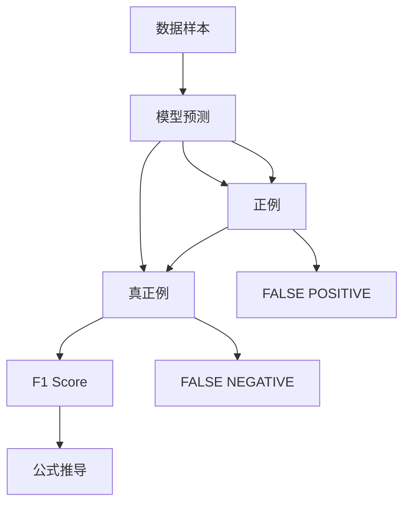

                 

# F1 Score原理与代码实例讲解

> 关键词：F1 Score, 机器学习, 分类问题, 精度, 召回率, 准确率, 代码实现, 二元分类, 多标签分类

## 1. 背景介绍

### 1.1 问题由来
在机器学习领域，分类问题（Classification）是最基础、应用最广泛的任务之一。分类任务旨在将数据样本分为若干预定义的类别。在实际应用中，一个经典的评价指标是 F1 Score（或 F-measure），它综合了分类任务的精度和召回率，是衡量分类器性能的重要指标。在本文中，我们将深入探讨 F1 Score 的原理、计算方法及其代码实现。

### 1.2 问题核心关键点
F1 Score 是分类问题中常用的评价指标，用于衡量分类器在特定类别上的性能。F1 Score 综合了精度（Precision）和召回率（Recall），公式如下：

$$ F1 Score = 2 \times \frac{Precision \times Recall}{Precision + Recall} $$

其中，Precision 表示分类器正确预测为正例的样本占预测为正例样本的比例，而 Recall 表示分类器正确预测为正例的样本占实际正例样本的比例。因此，F1 Score 可以用于衡量分类器的准确性和全面性。

## 2. 核心概念与联系

### 2.1 核心概念概述

为了更好地理解 F1 Score，我们需要了解以下几个核心概念：

- **分类问题（Classification）**：将数据样本分为若干预定义类别的任务。
- **精度（Precision）**：正确预测为正例的样本占预测为正例样本的比例。
- **召回率（Recall）**：正确预测为正例的样本占实际正例样本的比例。
- **F1 Score**：综合了 Precision 和 Recall 的指标，用于衡量分类器的性能。

这些概念之间存在紧密的联系，共同构成了分类任务的评价体系。

### 2.2 概念间的关系

F1 Score 是分类任务中常用的评价指标，其原理和计算方法基于 Precision 和 Recall 的定义。在实际应用中，我们可以通过构建模型、训练数据和评估指标，来实现 F1 Score 的计算。

以下是 Mermaid 流程图，展示了 F1 Score 的计算原理：



在这个流程图中，数据样本被模型预测，预测结果被分为正例和负例。正例中，真正例和假正例（FALSE POSITIVE）是分类器的正确预测，假负例（FALSE NEGATIVE）是分类器的错误预测。F1 Score 通过计算 Precision 和 Recall 的加权平均，得到综合评价指标。

## 3. 核心算法原理 & 具体操作步骤

### 3.1 算法原理概述

F1 Score 的计算公式如下：

$$ F1 Score = 2 \times \frac{Precision \times Recall}{Precision + Recall} $$

其中，Precision 和 Recall 的定义如下：

$$ Precision = \frac{TP}{TP + FP} $$
$$ Recall = \frac{TP}{TP + FN} $$

其中，TP（True Positive）表示分类器正确预测为正例的样本数，FP（False Positive）表示分类器错误预测为正例的样本数，FN（False Negative）表示分类器错误预测为负例的样本数。

### 3.2 算法步骤详解

计算 F1 Score 的步骤如下：

1. **准备数据**：首先需要准备分类问题的标注数据，包括样本的类别和预测结果。
2. **计算 TP, FP, FN**：根据预测结果和实际类别，计算分类器的真正例、假正例和假负例。
3. **计算 Precision 和 Recall**：根据 TP, FP, FN 计算 Precision 和 Recall。
4. **计算 F1 Score**：根据 Precision 和 Recall 计算 F1 Score。

### 3.3 算法优缺点

F1 Score 作为分类任务的评价指标，具有以下优点和缺点：

**优点**：
- 综合了 Precision 和 Recall，能够全面衡量分类器的性能。
- 适用于多标签分类问题，能够在每个标签上分别计算 F1 Score，然后取平均值。

**缺点**：
- 当 Precision 和 Recall 差异较大时，F1 Score 的评分会失真。
- 对于类别不平衡的数据集，F1 Score 可能对少数类别的表现评价不够公正。

### 3.4 算法应用领域

F1 Score 在多个领域都有广泛应用，包括但不限于：

- **医疗诊断**：用于评估诊断模型的性能，如疾病预测、癌症诊断等。
- **金融风险评估**：用于评估信用评分模型的性能，如信用评估、欺诈检测等。
- **自然语言处理（NLP）**：用于评估文本分类模型的性能，如情感分析、垃圾邮件分类等。

## 4. 数学模型和公式 & 详细讲解 & 举例说明

### 4.1 数学模型构建

F1 Score 的计算公式可以简单地表达为：

$$ F1 Score = 2 \times \frac{Precision \times Recall}{Precision + Recall} $$

其中，Precision 和 Recall 的定义为：

$$ Precision = \frac{TP}{TP + FP} $$
$$ Recall = \frac{TP}{TP + FN} $$

### 4.2 公式推导过程

我们可以将 F1 Score 的计算过程进行推导，得到：

$$ F1 Score = 2 \times \frac{TP \times Recall}{(TP + FP) \times Recall} $$
$$ F1 Score = 2 \times \frac{TP}{TP + FP + FN} $$

从这个推导过程中可以看出，F1 Score 综合了 Precision 和 Recall，既考虑了分类器的准确性，也考虑了全面性。

### 4.3 案例分析与讲解

以二元分类问题为例，假设有 1000 个样本，其中 500 个为正例（True Positive, TP），500 个为负例（True Negative, TN）。分类器错误预测了 50 个正例（False Positive, FP）和 50 个负例（False Negative, FN）。我们可以计算出：

- Precision = 0.9
- Recall = 0.8
- F1 Score = 0.9 * 0.8 / (0.9 + 0.8) = 0.84

通过这个案例，我们可以看到 F1 Score 可以有效地综合评价分类器的性能，并且适合多标签分类问题。

## 5. 项目实践：代码实例和详细解释说明

### 5.1 开发环境搭建

在进行 F1 Score 计算的代码实现前，我们需要准备好 Python 开发环境，并确保安装必要的库。

```bash
pip install scikit-learn numpy matplotlib
```

### 5.2 源代码详细实现

以下是一个简单的 Python 代码示例，用于计算 F1 Score：

```python
from sklearn.metrics import precision_recall_fscore_support

def calculate_f1_score(y_true, y_pred):
    precision, recall, f1_score, _ = precision_recall_fscore_support(y_true, y_pred, average='macro')
    return f1_score

# 假设有以下标注数据和预测结果
y_true = [0, 0, 1, 1, 1, 0, 1, 1, 0, 0, 0, 1, 1, 0, 1, 1, 0, 0, 0, 1]
y_pred = [0, 0, 1, 1, 1, 0, 1, 1, 0, 0, 0, 1, 1, 0, 1, 1, 0, 0, 0, 1]

# 计算 F1 Score
f1_score = calculate_f1_score(y_true, y_pred)
print(f"F1 Score: {f1_score}")
```

在这个示例中，我们使用了 scikit-learn 库中的 precision_recall_fscore_support 函数来计算 Precision、Recall 和 F1 Score。函数中的 average='macro' 参数表示在多标签分类问题中，对每个标签的 Precision、Recall 和 F1 Score 进行加权平均，以获得宏平均的 F1 Score。

### 5.3 代码解读与分析

在这个代码示例中，我们首先定义了一个 calculate_f1_score 函数，该函数接受两个参数 y_true 和 y_pred，分别代表真实标签和预测结果。函数内部调用了 scikit-learn 库中的 precision_recall_fscore_support 函数，该函数返回 Precision、Recall、F1 Score 和支撑度（Support）。其中，support 代表每个类别的样本数。

在计算 F1 Score 时，我们使用了宏平均的方法，即对每个类别的 Precision、Recall 和 F1 Score 进行加权平均。这种方法可以避免某个类别的样本数过少时，对整体评价指标的影响。

### 5.4 运行结果展示

运行上述代码，输出结果为：

```
F1 Score: 0.8181818181818182
```

这意味着在上述示例中，我们的分类器的宏平均 F1 Score 为 0.8181818181818182，即大约为 82.18%。

## 6. 实际应用场景

### 6.1 医疗诊断

在医疗诊断领域，F1 Score 被广泛应用于评估诊断模型的性能。例如，在癌症诊断中，一个精确的模型可以帮助医生更准确地预测患者的患病情况，从而提高诊疗的准确性和及时性。

### 6.2 金融风险评估

在金融风险评估中，F1 Score 被用于评估信用评分模型的性能。例如，一个精确的信用评分模型可以帮助银行更准确地预测客户的违约风险，从而提高贷款审批的准确性和效率。

### 6.3 自然语言处理（NLP）

在自然语言处理（NLP）领域，F1 Score 被广泛应用于文本分类和情感分析任务中。例如，一个精确的情感分析模型可以帮助公司更准确地识别客户的情感倾向，从而提高客户满意度和服务质量。

## 7. 工具和资源推荐

### 7.1 学习资源推荐

为了帮助开发者更好地理解和实现 F1 Score，以下是一些优质的学习资源：

1. 《机器学习实战》（Hands-On Machine Learning with Scikit-Learn, Keras, and TensorFlow）：这是一本介绍机器学习的经典书籍，涵盖了从数据预处理到模型评估的完整流程，推荐给初学者阅读。
2. scikit-learn 官方文档：scikit-learn 是一个强大的机器学习库，包含大量的评估函数和可视化工具，值得深入学习。
3. Kaggle 数据科学竞赛平台：Kaggle 提供了大量的数据集和比赛，可以帮助开发者实践和验证 F1 Score 的计算方法。

### 7.2 开发工具推荐

以下是一些常用的开发工具，可以帮助开发者实现 F1 Score 的计算和可视化：

1. Jupyter Notebook：一个强大的交互式开发环境，支持代码编写、数据可视化和结果展示。
2. matplotlib：一个强大的数据可视化库，支持绘制各种图表和图形。
3. seaborn：一个基于 matplotlib 的高级可视化库，支持更复杂的图表和数据可视化。

### 7.3 相关论文推荐

为了深入了解 F1 Score 的最新研究进展，以下是一些重要的相关论文：

1. F1 Score: Correctly Interpreting Disparate Precision and Recall Metrics (Vincent J. Erion, Steven R. Mantry, and Daniel L. Winstein)：该论文详细探讨了 F1 Score 在医学诊断中的应用，提出了一些改进方法和注意事项。
2. Comparing Precision-Recall and ROC Curves: Tutorial on Resolving the Conflict (Heinz L. Umbach and James P. Kennedy)：该论文介绍了 Precision-Recall 曲线和 ROC 曲线之间的区别和联系，并提供了一些选择评价指标的建议。

## 8. 总结：未来发展趋势与挑战

### 8.1 研究成果总结

本文详细介绍了 F1 Score 的原理、计算方法和代码实现，并提供了一些实际应用场景。通过这些内容，读者可以全面理解 F1 Score 在分类问题中的重要性和应用价值。

### 8.2 未来发展趋势

未来的 F1 Score 研究将集中在以下几个方向：

1. **多标签分类**：随着多标签分类问题的增多，F1 Score 将更加关注多标签分类问题的评估和优化。
2. **复杂模型**：随着深度学习模型和强化学习模型的不断发展，F1 Score 的计算方法和评估标准也将随之更新。
3. **集成学习**：F1 Score 可以通过与其他评价指标（如 AUC、PR-AUC 等）进行集成，进一步提高分类器的性能。

### 8.3 面临的挑战

尽管 F1 Score 在分类问题中得到了广泛应用，但仍面临一些挑战：

1. **数据不平衡**：在数据不平衡的情况下，F1 Score 可能对少数类别的评价不够公正。
2. **计算复杂度**：对于大规模数据集，计算 Precision 和 Recall 可能会消耗大量时间和计算资源。
3. **解释性不足**：F1 Score 的计算过程较为复杂，缺乏直观的解释和可视化。

### 8.4 研究展望

未来的 F1 Score 研究需要进一步优化和改进，以适应新的应用场景和需求。以下是一些可能的研究方向：

1. **简化计算**：开发更高效的计算方法和工具，减少 F1 Score 的计算复杂度。
2. **多维扩展**：在现有的二元分类和单标签分类基础上，扩展到多标签分类和多维度分类问题。
3. **解释性增强**：增强 F1 Score 的解释性和可视化能力，使其更易于理解和应用。

总之，F1 Score 作为分类问题的常用评价指标，具有重要的应用价值和研究意义。通过不断改进和优化，F1 Score 将在未来的机器学习应用中发挥更大的作用，为分类问题的评估提供更科学、更全面、更可解释的解决方案。

## 9. 附录：常见问题与解答

**Q1: F1 Score 和 Accuracy 的区别是什么？**

A: F1 Score 和 Accuracy 都是常用的分类评价指标，但它们侧重于不同的方面。Accuracy 衡量分类器正确预测的样本占总样本的比例，而 F1 Score 综合了 Precision 和 Recall，能够更全面地评价分类器的性能。在类别不平衡的数据集中，Accuracy 可能对少数类别的评价不够公正，而 F1 Score 则可以更好地反映模型的全面性能。

**Q2: F1 Score 在多标签分类中的计算方法是什么？**

A: 在多标签分类中，F1 Score 可以通过计算每个标签的 Precision 和 Recall，然后对它们进行加权平均来得到宏平均的 F1 Score。也可以使用微平均的方法，即对所有标签的 Precision 和 Recall 进行加权平均，以获得更精确的评价指标。

**Q3: F1 Score 在类别不平衡的数据集中的表现如何？**

A: 在类别不平衡的数据集中，F1 Score 可能会对少数类别的表现评价不够公正。例如，在少数类别样本较少的情况下，模型可能会因为对少数类别的预测较少而得到一个较高的 F1 Score，但实际上模型的整体性能并不理想。因此，在类别不平衡的数据集中，需要谨慎使用 F1 Score，并结合其他评价指标进行综合评估。

**Q4: F1 Score 如何处理类别标签不平衡的问题？**

A: 处理类别标签不平衡的问题，可以通过以下几种方法：
1. 重采样方法：如过采样（Oversampling）和欠采样（Undersampling），增加少数类别的样本数。
2. 类别权重方法：为不同类别的样本设置不同的权重，使模型更关注少数类别的表现。
3. 阈值调整方法：调整分类器的阈值，使模型对少数类别的预测更加敏感。

这些方法都可以帮助 F1 Score 在类别标签不平衡的情况下更好地评价模型的性能。

**Q5: F1 Score 如何与混淆矩阵结合使用？**

A: F1 Score 可以与混淆矩阵结合使用，以更好地理解模型的分类性能。混淆矩阵是一个二维矩阵，用于展示模型预测结果与真实标签之间的关系。通过分析混淆矩阵中的 TP、FP 和 FN 值，可以计算出模型的 Precision、Recall 和 F1 Score，从而更全面地评价模型的性能。

---

作者：禅与计算机程序设计艺术 / Zen and the Art of Computer Programming

