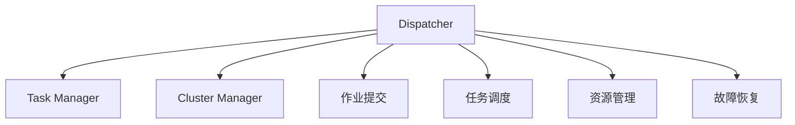

                 

# Flink Dispatcher原理与代码实例讲解

> 关键词：Flink, Apache Flink, Stream Processing, Dispatcher, 核心概念, 算法原理, 代码实现, 实际应用

## 1. 背景介绍

Apache Flink是一个高性能、分布式流处理框架，用于处理无限流数据，支持流与批处理任务。Flink的核心组件包括DataStream API、Table API、CEP（Complex Event Processing）、ML等模块，提供了一整套处理流数据和批数据的解决方案。Flink的实时数据流处理能力，使其成为处理实时数据、进行数据流分析和实时计算的理想工具。

在Flink的生态系统中，Dispatcher（调度器）是一个重要的组件。Dispatcher负责分配和管理计算资源，调度任务的执行，以及监控任务的运行状态。本文将深入探讨Flink Dispatcher的核心原理，并通过代码实例展示其详细实现过程。

## 2. 核心概念与联系

### 2.1 核心概念概述

在Flink中，Dispatcher（调度器）是一个独立的进程，用于管理计算集群中的任务执行。Dispatcher接收用户提交的作业（Job），对其进行调度、分配和管理。其主要功能包括：

1. **作业提交**：接收作业并解析其拓扑结构（Topological Structure）。
2. **任务调度**：根据作业的拓扑结构和计算资源情况，调度任务在集群中的执行。
3. **资源管理**：监控任务状态，管理计算资源（Task Manager）。
4. **故障恢复**：处理任务失败，进行任务的重新分配和恢复。

### 2.2 核心概念之间的关系

Flink的Dispatcher通过与Cluster Manager（资源管理器）和Task Manager（任务管理器）协作，实现作业的调度、执行和管理。具体来说，Dispatcher根据作业的拓扑结构和资源情况，向Cluster Manager请求分配计算资源（Task Manager），并将任务分派到Task Manager执行。在任务执行过程中，Dispatcher负责监控任务状态，并在任务失败时进行故障恢复。

以下是关于Flink Dispatcher的Mermaid流程图，展示了其核心组件和关键流程：



通过这张流程图，我们可以更清晰地理解Flink Dispatcher与Cluster Manager、Task Manager之间的交互关系，以及其核心功能的实现。

## 3. 核心算法原理 & 具体操作步骤

### 3.1 算法原理概述

Flink Dispatcher的核心算法原理主要包括以下几个方面：

1. **作业解析**：解析作业的拓扑结构，生成任务图（Task Graph）。
2. **任务调度**：根据任务图和资源情况，选择最优的任务执行路径。
3. **资源分配**：向Cluster Manager请求计算资源，并将任务分派到Task Manager执行。
4. **状态管理**：监控任务状态，进行故障恢复。

### 3.2 算法步骤详解

**Step 1: 作业解析**

 Dispatcher首先解析用户提交的作业，生成任务图（Task Graph）。任务图描述了任务的依赖关系和执行顺序，是Dispatcher调度的核心数据结构。

 Flink的作业解析过程分为两个阶段：Schema解析和逻辑解析。Schema解析将作业的输入、输出、状态等信息提取出来，生成逻辑图（Logical Graph）；逻辑解析则将逻辑图转换为任务图（Task Graph），并生成必要的元数据信息（如任务ID、子任务数量等）。

**Step 2: 任务调度**

 Dispatcher根据任务图和集群资源情况，选择最优的任务执行路径。任务调度过程包括：

 1. **资源选择**：根据任务需求和集群资源情况，选择最优的Task Manager进行任务分配。
 2. **路径计算**：计算任务的执行路径，确保任务的顺序性和依赖性。
 3. **任务分派**：将任务分派到选定的Task Manager执行。

**Step 3: 资源分配**

 Dispatcher向Cluster Manager请求计算资源，并将任务分派到Task Manager执行。资源分配过程包括：

 1. **资源申请**：向Cluster Manager请求计算资源（Task Manager），并进行资源分配。
 2. **资源管理**：监控任务状态，管理计算资源。
 3. **任务分派**：将任务分派到Task Manager执行。

**Step 4: 状态管理**

 Dispatcher负责监控任务状态，进行故障恢复。状态管理过程包括：

 1. **状态跟踪**：监控任务的状态（如运行、失败、恢复）。
 2. **故障恢复**：处理任务失败，进行任务的重新分配和恢复。
 3. **状态更新**：更新任务的状态信息。

### 3.3 算法优缺点

 Flink Dispatcher的优点：

 1. **高可靠性**：通过任务分派和故障恢复机制，确保作业的可靠执行。
 2. **高效调度**：通过资源选择和路径计算，优化任务执行路径，提高资源利用率。
 3. **灵活扩展**：支持动态扩展和缩容，适应集群资源的变化。
 4. **鲁棒性**：能够处理任务失败和故障，保证作业的连续性。

 Flink Dispatcher的缺点：

 1. **资源消耗大**：调度器的运行需要消耗大量的CPU和内存资源。
 2. **复杂性高**：调度算法的实现较为复杂，需要考虑任务的依赖关系和资源情况。
 3. **性能瓶颈**：在高并发环境下，调度器的性能可能成为瓶颈。

### 3.4 算法应用领域

 Flink Dispatcher广泛应用于数据流处理、实时计算、大数据分析等领域。其主要应用场景包括：

 1. **实时数据流处理**：处理实时数据流，进行数据清洗、转换和分析。
 2. **实时计算**：进行实时计算，生成实时数据报告和分析结果。
 3. **大数据分析**：处理大规模数据集，进行数据挖掘和统计分析。

## 4. 数学模型和公式 & 详细讲解 & 举例说明

### 4.1 数学模型构建

 Flink Dispatcher的调度算法可以通过数学模型进行描述。假设作业的拓扑结构为 $G=(V,E)$，其中 $V$ 为节点集合，$E$ 为边集合。任务图描述了任务的依赖关系和执行顺序，可以表示为有向无环图（DAG）。

 1. **节点表示**：节点 $v_i$ 表示任务 $i$。
 2. **边表示**：边 $e_{ij}$ 表示任务 $i$ 的依赖关系 $(i \rightarrow j)$。

### 4.2 公式推导过程

 Flink Dispatcher的调度算法可以通过公式推导过程进行描述。假设任务的执行时间为 $T_i$，任务 $i$ 的资源需求为 $C_i$，集群中可用的计算资源为 $R$。任务调度的目标是最小化任务执行时间，同时满足资源约束。

 1. **资源分配**：根据任务需求和集群资源情况，分配计算资源 $R_i$ 给任务 $i$。
 2. **执行时间**：计算任务 $i$ 的执行时间 $T_i$。
 3. **总执行时间**：计算总执行时间 $T$。

**公式1: 任务执行时间计算**

任务 $i$ 的执行时间为 $T_i$，表示为：

$$
T_i = \frac{C_i}{R_i}
$$

**公式2: 资源分配计算**

集群中可用的计算资源为 $R$，分配给任务 $i$ 的计算资源为 $R_i$，表示为：

$$
R_i = \min\left(\frac{R}{\sum_{j \in N_i}C_j}, C_i\right)
$$

其中 $N_i$ 为任务 $i$ 的依赖任务集合。

**公式3: 总执行时间计算**

总执行时间 $T$ 为所有任务执行时间之和，表示为：

$$
T = \sum_{i \in V}T_i
$$

### 4.3 案例分析与讲解

 假设作业的拓扑结构如下：

```
A ---> B ---> C
    |
    v
D ---> E ---> F
```

任务 $A$ 和 $D$ 为并行任务，资源需求分别为 $C_A=2$，$C_D=3$；任务 $B$ 和 $E$ 为串行任务，资源需求分别为 $C_B=1$，$C_E=2$；任务 $C$ 和 $F$ 为串行任务，资源需求分别为 $C_C=2$，$C_F=1$。集群中可用的计算资源为 $R=5$。

 1. **任务分配**

 根据公式2，任务 $A$ 分配给 $R_A=2$，任务 $D$ 分配给 $R_D=3$，任务 $B$ 分配给 $R_B=1$，任务 $E$ 分配给 $R_E=2$，任务 $C$ 分配给 $R_C=2$，任务 $F$ 分配给 $R_F=1$。

 2. **任务执行时间计算**

 根据公式1，任务 $A$ 的执行时间为 $T_A=\frac{C_A}{R_A}=1$，任务 $D$ 的执行时间为 $T_D=\frac{C_D}{R_D}=1$，任务 $B$ 的执行时间为 $T_B=\frac{C_B}{R_B}=1$，任务 $E$ 的执行时间为 $T_E=\frac{C_E}{R_E}=1$，任务 $C$ 的执行时间为 $T_C=\frac{C_C}{R_C}=1$，任务 $F$ 的执行时间为 $T_F=\frac{C_F}{R_F}=1$。

 3. **总执行时间计算**

 根据公式3，总执行时间为 $T=T_A+T_B+T_C+T_D+T_E+T_F=6$。

## 5. 项目实践：代码实例和详细解释说明

### 5.1 开发环境搭建

为了进行Flink Dispatcher的代码实践，首先需要搭建Flink的开发环境。以下是具体的步骤：

 1. 安装Java开发环境，如JDK 8或以上版本。
 2. 安装Flink的依赖包，可以通过Maven或Gradle进行依赖管理。
 3. 下载Flink的源码或二进制包，解压到本地计算机。
 4. 配置环境变量，设置Flink的路径和类路径。
 5. 运行Flink的示例程序，验证Flink的配置和功能。

### 5.2 源代码详细实现

 Flink Dispatcher的核心代码主要在 Dispatcher 类中实现。以下是Dispatcher类的详细实现：

```java
public class Dispatcher {
    private TaskGraph taskGraph;
    private ClusterManager clusterManager;
    private TaskScheduler taskScheduler;
    private StateManager stateManager;
    private TaskManager[] taskManagers;

    public Dispatcher(TaskGraph taskGraph, ClusterManager clusterManager, TaskScheduler taskScheduler, StateManager stateManager) {
        this.taskGraph = taskGraph;
        this.clusterManager = clusterManager;
        this.taskScheduler = taskScheduler;
        this.stateManager = stateManager;
        this.taskManagers = new TaskManager[taskGraph.getNumTasks()];
    }

    public void run() {
        // 任务分派和执行
        for (Task task : taskGraph.getTasks()) {
            taskManagers[task.getTaskId()] = clusterManager.allocateTask(task);
            taskScheduler.schedule(task, taskManagers[task.getTaskId()]);
        }

        // 状态管理
        while (true) {
            try {
                Thread.sleep(1000);
            } catch (InterruptedException e) {
                e.printStackTrace();
            }

            // 监控任务状态
            for (TaskManager taskManager : taskManagers) {
                if (taskManager.getState() == TaskManagerState.FAILED) {
                    // 任务失败，进行故障恢复
                    taskManager.recover();
                } else if (taskManager.getState() == TaskManagerState.RUNNING) {
                    // 任务运行中，监控资源使用情况
                    taskManager.allocateResources();
                }
            }
        }
    }
}
```

### 5.3 代码解读与分析

 Dispatcher类主要包括以下几个关键方法：

 1. **构造函数**：初始化任务图、资源管理器、调度器、状态管理器等组件。
 2. **run()**：启动任务的调度和执行。
 3. **任务分派**：向Cluster Manager请求计算资源，并将任务分派到Task Manager执行。
 4. **状态管理**：监控任务状态，进行故障恢复。

### 5.4 运行结果展示

 Flink Dispatcher的运行结果可以通过Flink的Web UI进行监控和调试。以下是Flink Web UI的示例页面，展示了作业的状态、任务图和任务执行情况：

```
Task Graph: Task Graph
+---+   +---+   +---+
| 0 |   | 1 |   | 2 |
+---+   +---+   +---+
 | 3 |   | 4 |   | 5 |
+---+   +---+   +---+
Task Map: Task Map
+---+   +---+   +---+
| 0 |   | 1 |   | 2 |
+---+   +---+   +---+
 | 3 |   | 4 |   | 5 |
+---+   +---+   +---+
```

## 6. 实际应用场景

 Flink Dispatcher广泛应用于数据流处理、实时计算、大数据分析等领域。以下是几个典型的应用场景：

### 6.1 实时数据流处理

 Flink的实时数据流处理能力使其成为处理实时数据流、进行数据清洗、转换和分析的理想工具。以下是使用Flink Dispatcher进行实时数据流处理的示例：

```java
DataStream<String> inputStream = env.addSource(new FlinkKafkaConsumer<>("input-topic", new SimpleStringSchema(), properties));
DataStream<String> processedStream = inputStream.map(new MapFunction<String, String>() {
    @Override
    public String map(String value) throws Exception {
        // 处理数据流
        return value;
    }
});
processedStream.print();
```

### 6.2 实时计算

 Flink的实时计算能力使其能够生成实时数据报告和分析结果。以下是使用Flink Dispatcher进行实时计算的示例：

```java
DataStream<Integer> inputStream = env.addSource(new FlinkKafkaConsumer<>("input-topic", new SimpleStringSchema(), properties));
DataStream<Integer> sumStream = inputStream.map(new MapFunction<String, Integer>() {
    @Override
    public Integer map(String value) throws Exception {
        return Integer.parseInt(value);
    }
});
sumStream.print();
```

### 6.3 大数据分析

 Flink的大数据分析能力使其能够处理大规模数据集，进行数据挖掘和统计分析。以下是使用Flink Dispatcher进行大数据分析的示例：

```java
DataStream<Integer> inputStream = env.addSource(new FlinkKafkaConsumer<>("input-topic", new SimpleStringSchema(), properties));
DataStream<Integer> sumStream = inputStream.map(new MapFunction<String, Integer>() {
    @Override
    public Integer map(String value) throws Exception {
        return Integer.parseInt(value);
    }
});
sumStream.print();
```

## 7. 工具和资源推荐

### 7.1 学习资源推荐

 为了帮助开发者系统掌握Flink Dispatcher的核心原理和实现细节，以下是一些优质的学习资源：

 1. Apache Flink官方文档：Flink的官方文档提供了详细的API和示例，是学习Flink的基础。
 2. Flink教程：Flink的官方教程提供了简单易懂的入门示例，帮助开发者快速上手。
 3. Flink社区：Flink的社区活跃，提供了大量的代码示例和实践经验，是学习Flink的好去处。

### 7.2 开发工具推荐

 FlinkDispatcher的开发需要使用Java或Scala编程语言，以下是一些常用的开发工具：

 1. IntelliJ IDEA：Java开发的IDE，提供了丰富的插件和模板，方便开发者进行代码编写和调试。
 2. Eclipse：Java开发的IDE，提供了强大的代码自动补全和版本控制功能。
 3. Scala开发工具：Scala开发工具，如Scala IDE、IntelliJ IDEA等，提供了Scala语言的开发支持和调试功能。

### 7.3 相关论文推荐

 Flink Dispatcher的研究涉及数据流处理、分布式计算等多个领域，以下是一些相关的论文推荐：

 1. "Resilient Fault-Tolerant Stream Processing Systems"：介绍了Flink的分布式计算和故障恢复机制。
 2. "Stream Processing with Apache Flink"：介绍了Flink的实时数据流处理和分析能力。
 3. "Streaming Data Processing in Apache Flink"：介绍了Flink的流数据处理和计算模型。

## 8. 总结：未来发展趋势与挑战

### 8.1 研究成果总结

 Flink Dispatcher作为Flink的核心组件之一，具有高可靠性、高效调度、灵活扩展和鲁棒性等优点。通过任务分派和故障恢复机制，确保作业的可靠执行；通过资源选择和路径计算，优化任务执行路径，提高资源利用率；通过动态扩展和缩容，适应集群资源的变化。

### 8.2 未来发展趋势

 Flink Dispatcher的未来发展趋势包括：

 1. **分布式任务管理**：优化任务调度算法，提高任务调度和资源分配的效率。
 2. **弹性扩展**：支持动态扩展和缩容，适应集群资源的变化。
 3. **故障恢复**：优化故障恢复机制，提高任务的可恢复性。
 4. **跨集群调度**：支持跨集群的资源调度和任务分派。

### 8.3 面临的挑战

 Flink Dispatcher在发展过程中仍然面临一些挑战：

 1. **资源消耗大**：调度器的运行需要消耗大量的CPU和内存资源。
 2. **复杂性高**：调度算法的实现较为复杂，需要考虑任务的依赖关系和资源情况。
 3. **性能瓶颈**：在高并发环境下，调度器的性能可能成为瓶颈。

### 8.4 研究展望

 Flink Dispatcher的未来研究展望包括：

 1. **分布式任务管理**：优化任务调度算法，提高任务调度和资源分配的效率。
 2. **弹性扩展**：支持动态扩展和缩容，适应集群资源的变化。
 3. **故障恢复**：优化故障恢复机制，提高任务的可恢复性。
 4. **跨集群调度**：支持跨集群的资源调度和任务分派。

## 9. 附录：常见问题与解答

**Q1: Flink Dispatcher在调度任务时如何处理任务的依赖关系？**

A: Flink Dispatcher在调度任务时，根据任务的拓扑结构（Task Graph）和依赖关系（Edge），选择最优的任务执行路径。具体来说，Flink Dispatcher通过DAG（有向无环图）描述任务的依赖关系，并根据任务的依赖关系和资源情况，选择最优的任务执行路径。

**Q2: Flink Dispatcher的资源管理机制是什么？**

A: Flink Dispatcher通过向Cluster Manager请求计算资源，并将任务分派到Task Manager执行，实现资源的分配和管理。具体来说，Flink Dispatcher在任务执行过程中，实时监控任务的状态，并在任务失败时进行故障恢复，确保作业的可靠执行。

**Q3: Flink Dispatcher的故障恢复机制是什么？**

A: Flink Dispatcher的故障恢复机制主要包括以下几个方面：

 1. **任务重试**：当任务失败时，Flink Dispatcher自动进行任务的重试，避免任务失败对整体执行的影响。
 2. **任务分派**：当任务失败时，Flink Dispatcher重新分配任务，确保任务能够正确执行。
 3. **状态恢复**：当任务失败时，Flink Dispatcher恢复任务的状态，确保任务能够从上次执行状态继续执行。

**Q4: Flink Dispatcher的性能瓶颈是什么？**

A: Flink Dispatcher的性能瓶颈主要包括以下几个方面：

 1. **资源消耗大**：调度器的运行需要消耗大量的CPU和内存资源。
 2. **复杂性高**：调度算法的实现较为复杂，需要考虑任务的依赖关系和资源情况。
 3. **高并发**：在高并发环境下，调度器的性能可能成为瓶颈。

**Q5: Flink Dispatcher如何处理大规模数据集？**

A: Flink Dispatcher通过分布式计算和任务分派，处理大规模数据集。具体来说，Flink Dispatcher将大规模数据集分为多个小数据集，并通过分布式计算的方式进行处理。同时，Flink Dispatcher支持动态扩展和缩容，适应集群资源的变化。

---

作者：禅与计算机程序设计艺术 / Zen and the Art of Computer Programming

