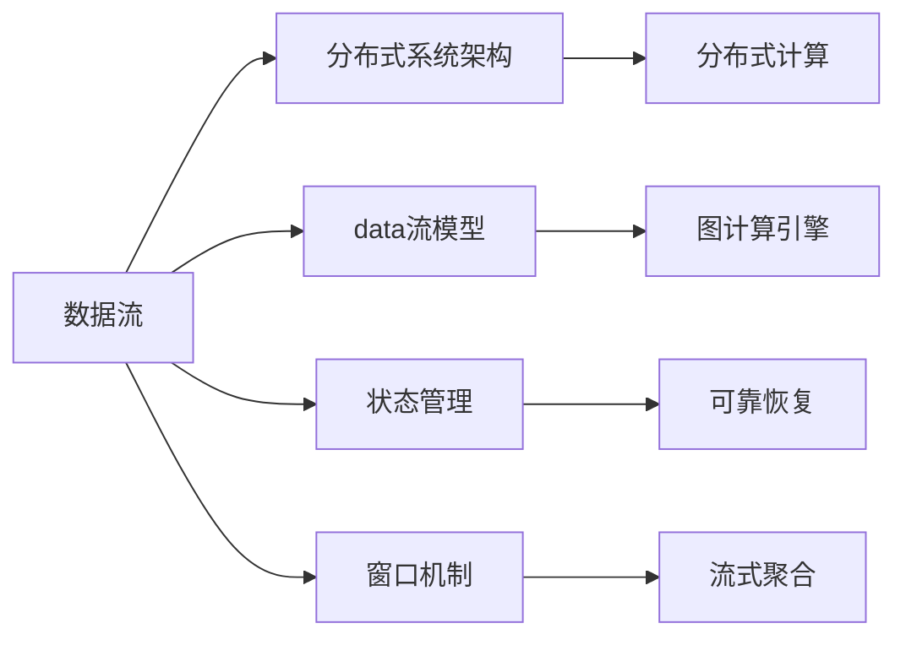

                 

# Flink 原理与代码实例讲解

> 关键词：Flink、流处理、分布式系统、数据流、状态管理、窗口机制、性能调优

## 1. 背景介绍

### 1.1 问题由来
随着大数据时代的到来，数据处理需求日益增长，传统的批处理模式已经难以满足实时性要求。实时数据流处理技术应运而生，Flink作为其中的佼佼者，以其高性能、易用性、生态丰富等特点，成为流处理领域的重要玩家。

### 1.2 问题核心关键点
Flink作为基于内存的分布式流处理框架，其核心技术包括分布式系统架构、数据流模型、状态管理、窗口机制等。通过这些关键技术，Flink实现了高效的数据处理和分析，支持大规模、高并发的流式计算应用。

### 1.3 问题研究意义
掌握Flink的原理和实现细节，有助于开发高性能、高可靠性的流处理系统。Flink在实时数据处理、实时计算、实时分析、实时推荐系统等场景中有着广泛应用，其核心技术的学习与实践对于推动大数据技术的落地应用具有重要意义。

## 2. 核心概念与联系

### 2.1 核心概念概述

Flink的核心概念主要包括分布式系统架构、数据流模型、状态管理、窗口机制等。

- **分布式系统架构**：Flink通过分布式并行计算和任务调度，将大规模数据流处理任务分发到多个节点上并行执行。
- **数据流模型**：Flink将数据处理任务映射为有向无环图（DAG）形式的计算图，支持高效的流数据处理。
- **状态管理**：Flink通过状态管理和恢复机制，保证数据处理的可靠性和一致性。
- **窗口机制**：Flink通过窗口机制对数据流进行分组和聚合，支持高效的流式聚合计算。

这些核心概念通过Mermaid流程图连接起来，如下所示：



### 2.2 概念间的关系

Flink的核心概念之间存在紧密联系，形成了一个完整的流处理系统架构。每个概念的作用和影响如下：

- **分布式系统架构**：提供分布式计算资源，支持大规模数据流的并行处理。
- **数据流模型**：将数据流处理任务转换为计算图，支持灵活的数据流建模。
- **状态管理**：实现状态存储和恢复，保证数据处理的可靠性和一致性。
- **窗口机制**：对数据流进行分组和聚合，支持高效的流式计算。

这些概念共同构成了Flink流处理系统的技术基础，使其能够高效地处理大规模、高并发的流数据。

## 3. 核心算法原理 & 具体操作步骤

### 3.1 算法原理概述

Flink的核心算法原理主要包括以下几个方面：

1. **分布式系统架构**：基于数据流模型的分布式计算引擎，支持跨节点并行计算。
2. **数据流模型**：将数据处理任务转换为计算图，支持高效的流数据处理。
3. **状态管理**：通过检查点和分布式状态存储，实现状态的可靠恢复和一致性保证。
4. **窗口机制**：通过时间窗口和事件时间窗口，支持高效的流式聚合计算。

### 3.2 算法步骤详解

Flink的核心算法步骤如下：

1. **分布式系统架构**：
   - **任务调度**：Flink通过TaskManager节点接收任务，并根据数据流图进行任务划分和调度。
   - **数据分区**：将数据流按关键字段进行分区，保证数据处理的并行性和均衡性。

2. **数据流模型**：
   - **计算图构建**：将数据处理任务映射为计算图，并生成有向无环图（DAG）。
   - **图计算引擎**：基于内存计算引擎，支持高效的流数据处理。

3. **状态管理**：
   - **状态存储**：通过检查点和分布式状态存储，实现状态的可靠恢复和一致性保证。
   - **状态恢复**：在节点重启时，通过检查点和状态存储恢复状态，保证计算的连续性和一致性。

4. **窗口机制**：
   - **时间窗口**：按时间间隔将数据分组，进行批量处理。
   - **事件时间窗口**：支持事件时间处理，保证数据处理的准确性。

### 3.3 算法优缺点

Flink的优点包括：

- **高性能**：基于内存计算，支持高效的流数据处理。
- **高可靠性**：通过状态管理和恢复机制，保证数据处理的可靠性和一致性。
- **易用性**：提供API和SDK，支持多种编程语言，易于使用和集成。

Flink的缺点包括：

- **状态管理开销大**：状态存储和恢复需要消耗大量内存和带宽。
- **资源消耗高**：内存和CPU资源消耗较大，需要合理配置。
- **配置复杂**：配置项众多，需要一定的运维经验。

### 3.4 算法应用领域

Flink广泛应用于以下几个领域：

1. **实时数据处理**：支持大规模、高并发的流数据处理，如实时监控、实时广告投放、实时推荐系统等。
2. **实时计算**：提供高效的流计算引擎，支持实时计算和分析。
3. **实时分析**：支持复杂的数据分析任务，如流式数据可视化、流式数据挖掘等。
4. **实时推荐系统**：通过流式数据处理和分析，提供实时推荐服务。

## 4. 数学模型和公式 & 详细讲解

### 4.1 数学模型构建

Flink的数据流模型可以形式化为有向无环图（DAG）：

$$
G(V,E)=\left(V_{t},V_{w},E_{tw},E_{sw}\right)
$$

其中，$V_{t}$ 为任务节点，$V_{w}$ 为窗口节点，$E_{tw}$ 为任务与窗口之间的边，$E_{sw}$ 为窗口与窗口之间的边。

### 4.2 公式推导过程

以Flink的时间窗口为例，其窗口计算公式为：

$$
W_t = \left(\frac{t}{t_{interval}},\frac{t_{interval}}{2}\right)
$$

其中，$t$ 为当前时间，$t_{interval}$ 为窗口大小，$W_t$ 为当前时间窗口。

### 4.3 案例分析与讲解

假设我们需要对时间戳为$t$的数据进行窗口聚合，可以按照以下步骤进行：

1. 将时间戳大于等于$W_t$的数据分发到窗口中。
2. 对窗口中的数据进行聚合操作，如求和、平均值等。
3. 输出窗口聚合结果。

## 5. 项目实践：代码实例和详细解释说明

### 5.1 开发环境搭建

安装Java 8或以上版本，以及Apache Flink。

```bash
# 安装Java
sudo apt-get update
sudo apt-get install openjdk-8-jdk
update-java-alternatives --install /usr/lib/jvm/java-8-openjdk-amd64 /usr/lib/jvm/java-8-openjdk-amd64/jre/java/jre.conf
sudo update-alternatives --install /usr/bin/java /usr/lib/jvm/java-8-openjdk-amd64/jre/bin/java /usr/lib/jvm/java-8-openjdk-amd64/jre/bin/java 2>/dev/null
sudo update-alternatives --install /usr/bin/javac /usr/lib/jvm/java-8-openjdk-amd64/jre/bin/javac /usr/lib/jvm/java-8-openjdk-amd64/jre/bin/javac 2>/dev/null

# 安装Flink
wget https://repos.apache.org/release/flink/4.1.1/apache-flink-4.1.1-bin-scala_2.12.tgz
tar xzf apache-flink-4.1.1-bin-scala_2.12.tgz
cd apache-flink-4.1.1
```

### 5.2 源代码详细实现

以下是一个简单的Flink程序示例，用于对时间戳为$t$的数据进行窗口聚合：

```java
import org.apache.flink.api.common.functions.AggregateFunction;
import org.apache.flink.api.common.functions.MapFunction;
import org.apache.flink.api.common.functions.RichMapFunction;
import org.apache.flink.api.common.state.ValueState;
import org.apache.flink.api.common.state.ValueStateDescriptor;
import org.apache.flink.api.common.typeutils.base.LongSerializer;
import org.apache.flink.configuration.Configuration;
import org.apache.flink.streaming.api.datastream.DataStream;
import org.apache.flink.streaming.api.environment.StreamExecutionEnvironment;
import org.apache.flink.streaming.api.windowing.time.Time;
import org.apache.flink.streaming.api.windowing.windows.TimeWindow;
import org.apache.flink.streaming.runtime.streamrecord.StreamRecord;

public class FlinkWindowExample {

    public static void main(String[] args) throws Exception {
        // 获取执行环境
        StreamExecutionEnvironment env = StreamExecutionEnvironment.getExecutionEnvironment();

        // 读取数据流
        DataStream<Long> dataStream = env.addSource(new SourceFunction<Long>() {
            @Override
            public void run(SourceContext<Long> ctx) throws Exception {
                for (int i = 0; i < 100; i++) {
                    long data = Math.round(Math.random() * 1000000);
                    ctx.collect(data);
                }
            }

            @Override
            public void cancel() {
            }
        });

        // 窗口聚合
        DataStream<Long> aggregatedStream = dataStream.keyBy((Long value) -> value)
                .window(Time.seconds(10))
                .sum(new SumAggregateFunction());

        // 输出结果
        aggregatedStream.print();

        // 执行任务
        env.execute("Flink Window Example");
    }

    public static class SumAggregateFunction implements AggregateFunction<Long, Long, Long> {
        @Override
        public Long createAccumulator() {
            return 0L;
        }

        @Override
        public Long add(Long value, Long accumulator) {
            return accumulator + value;
        }

        @Override
        public Long merge(Long value1, Long value2) {
            return value1 + value2;
        }

        @Override
        public Long getResult(Long accumulator) {
            return accumulator;
        }

        @Override
        public Long mergeCombiner(Long value1, Long value2) {
            return value1 + value2;
        }
    }
}
```

### 5.3 代码解读与分析

- **执行环境**：通过`StreamExecutionEnvironment`获取执行环境，并添加数据源。
- **窗口聚合**：对数据流进行分组、窗口定义和聚合操作。
- **输出结果**：将窗口聚合结果输出到控制台。

## 6. 实际应用场景

### 6.1 实时数据处理

Flink可以用于实时数据处理，支持大规模、高并发的流数据处理，如实时监控、实时广告投放、实时推荐系统等。

### 6.2 实时计算

Flink提供高效的流计算引擎，支持实时计算和分析。

### 6.3 实时分析

Flink支持复杂的数据分析任务，如流式数据可视化、流式数据挖掘等。

### 6.4 实时推荐系统

Flink通过流式数据处理和分析，提供实时推荐服务。

## 7. 工具和资源推荐

### 7.1 学习资源推荐

1. **Flink官方文档**：Flink官方文档提供了丰富的学习资源，包括API文档、教程、示例代码等。
2. **《大数据之路》**：讲解Flink的核心原理和应用实践，适合初学者入门。
3. **《Flink实战》**：实战案例和项目实践，适合有一定基础的学习者。

### 7.2 开发工具推荐

1. **IntelliJ IDEA**：支持Flink的开发工具，提供代码提示和调试功能。
2. **VisualVM**：监控JVM性能，支持对Flink集群的监控和管理。

### 7.3 相关论文推荐

1. **分布式流处理系统**：介绍Flink的分布式系统架构，讨论分布式任务调度和管理。
2. **数据流模型和状态管理**：深入探讨Flink的数据流模型和状态管理机制。
3. **窗口机制和流式计算**：详细介绍Flink的窗口机制和流式计算实现。

## 8. 总结：未来发展趋势与挑战

### 8.1 研究成果总结

Flink作为流处理领域的领先技术，其核心技术包括分布式系统架构、数据流模型、状态管理、窗口机制等。这些技术共同构成了Flink流处理系统的技术基础，使其能够高效地处理大规模、高并发的流数据。

### 8.2 未来发展趋势

未来，Flink将在以下几个方向继续发展：

1. **分布式系统优化**：进一步优化分布式任务调度和资源管理，提高系统的可扩展性和性能。
2. **数据流模型优化**：改进数据流模型的表示和计算，支持更高效的数据处理和分析。
3. **状态管理优化**：优化状态管理和恢复机制，减少状态存储和恢复的开销。
4. **窗口机制优化**：优化窗口机制，支持更灵活、高效的时间窗口和事件时间窗口。

### 8.3 面临的挑战

Flink在发展过程中面临以下挑战：

1. **资源管理**：优化资源分配和管理，避免资源浪费和瓶颈。
2. **状态管理**：优化状态存储和恢复机制，减少状态存储和恢复的开销。
3. **性能优化**：优化数据流模型和计算图，提高系统的性能和效率。

### 8.4 研究展望

未来的研究将集中在以下几个方向：

1. **分布式系统优化**：优化分布式任务调度和资源管理，提高系统的可扩展性和性能。
2. **数据流模型优化**：改进数据流模型的表示和计算，支持更高效的数据处理和分析。
3. **状态管理优化**：优化状态管理和恢复机制，减少状态存储和恢复的开销。
4. **窗口机制优化**：优化窗口机制，支持更灵活、高效的时间窗口和事件时间窗口。

## 9. 附录：常见问题与解答

**Q1: Flink的分布式系统架构如何工作？**

A: Flink通过TaskManager节点接收任务，并根据数据流图进行任务划分和调度。数据流按关键字段进行分区，保证数据处理的并行性和均衡性。

**Q2: Flink的数据流模型是什么？**

A: Flink将数据处理任务映射为计算图，并生成有向无环图（DAG）。数据流模型支持高效的流数据处理。

**Q3: Flink的状态管理是如何实现的？**

A: Flink通过检查点和分布式状态存储，实现状态的可靠恢复和一致性保证。状态管理机制支持高效的流数据处理。

**Q4: Flink的窗口机制如何工作？**

A: Flink通过时间窗口和事件时间窗口，对数据流进行分组和聚合，支持高效的流式计算。

**Q5: Flink的优势和劣势是什么？**

A: Flink的优势包括高性能、高可靠性、易用性等。劣势包括状态管理开销大、资源消耗高、配置复杂等。

作者：禅与计算机程序设计艺术 / Zen and the Art of Computer Programming

