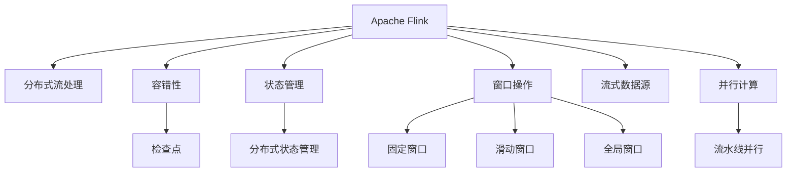
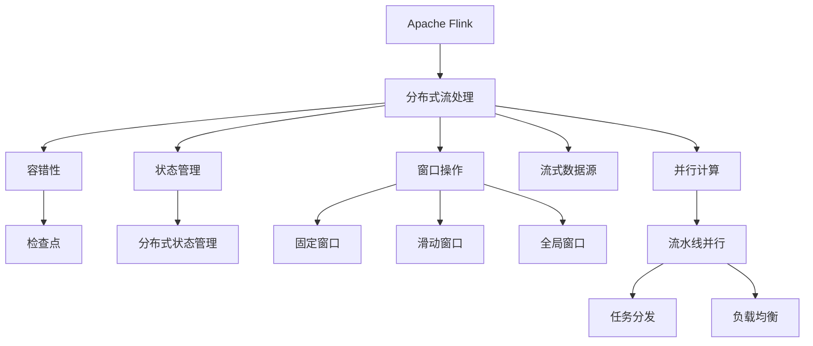
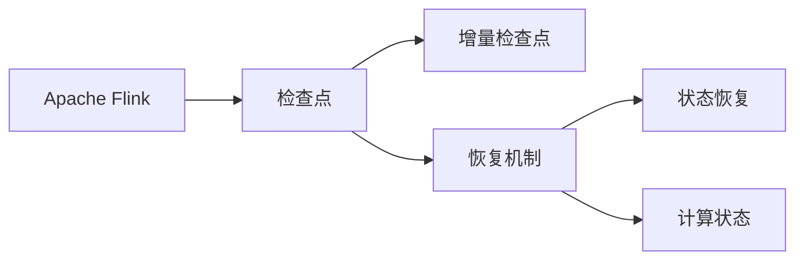
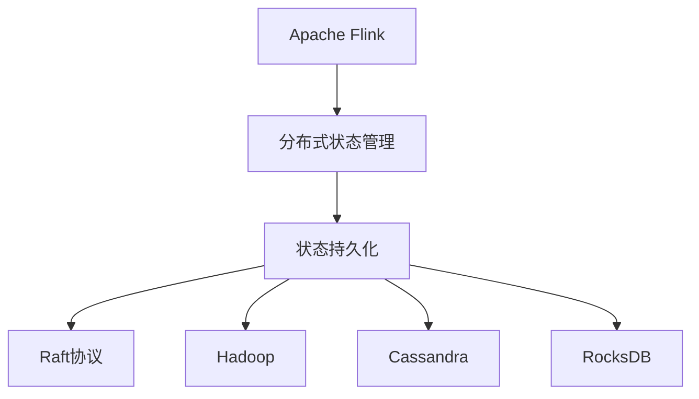
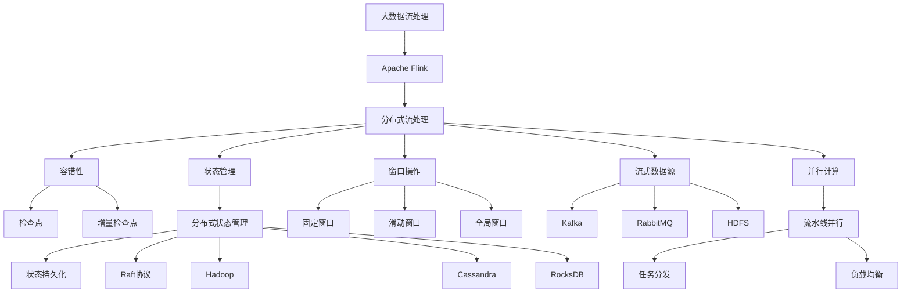

                 

# Flink原理与代码实例讲解

> 关键词：
- Apache Flink
- 分布式流处理
- 容错性
- 状态管理
- 窗口操作
- 流式数据源
- 并行计算

## 1. 背景介绍

### 1.1 问题由来
在现代数据处理体系中，流式数据处理因其实时性和高吞吐量的特点，变得越来越重要。面对大数据时代的爆炸性增长，实时性分析需求日益增加。传统的批处理系统虽然功能强大，但无法满足实时性和低延迟的需求。而流式数据处理系统，如Apache Flink，则能够快速响应实时数据，并能够进行高效的并行计算。

流式数据处理系统的核心是分布式计算框架，用于在分布式集群上高效地处理大数据。Apache Flink是一个开源流式数据处理框架，其设计目标是提供高性能、可扩展性和易用性，从而在数据流处理中发挥重要作用。

### 1.2 问题核心关键点
Apache Flink的核心技术包括数据流模型、状态管理、容错机制、高吞吐量和高可用性等。Flink的流式数据模型支持复杂的流处理和批处理，能够应对大规模数据的实时处理需求。其状态管理技术支持分布式流式计算中的状态持久化和容错处理。

Flink的容错机制通过检查点（Checkpoint）和增量检查点（Incremental Checkpoint），确保在出现故障时能够快速恢复计算状态。同时，Flink支持可扩展的分布式计算环境，在集群节点数增加或减少时，能够自动调整计算任务的分发和负载均衡。

### 1.3 问题研究意义
Apache Flink作为新一代流式数据处理框架，在实时性、吞吐量和灵活性方面均具有显著优势。其被广泛应用于多个大数据处理领域，包括实时数据处理、大批量数据处理、金融交易分析、网络监控分析等。掌握Flink的原理和实践，对于开发和优化大数据流式处理系统具有重要的现实意义。

## 2. 核心概念与联系

### 2.1 核心概念概述

为更好地理解Apache Flink，本节将介绍几个密切相关的核心概念：

- **Apache Flink**：一个分布式流处理框架，支持实时数据流处理和批处理。其数据模型基于无界数据流，并支持高性能、高吞吐量的数据处理。

- **分布式流处理**：在分布式集群上对数据流进行实时处理。Flink通过并行计算和容错机制，支持大规模数据的高效处理。

- **容错性**：指系统能够在出现故障时自动恢复计算状态，确保计算结果的一致性和可靠性。Flink通过检查点和增量检查点机制实现容错。

- **状态管理**：在流处理中，状态指的是对数据流进行聚合计算时所依赖的中间结果。Flink通过分布式状态管理技术，支持大规模状态持久化。

- **窗口操作**：将数据流分割为固定长度的时间窗口，对每个窗口内的数据进行聚合计算。Flink支持多种窗口类型，包括滑动窗口、固定窗口和全局窗口等。

- **流式数据源**：数据的输入源，可以是实时数据流或批量数据源。Flink支持多种数据源，包括Kafka、RabbitMQ、HDFS等。

- **并行计算**：利用分布式集群，将数据流分割成多个子流，并行执行计算任务。Flink支持基于流水线并行的计算模型，能够自动调整计算任务的分发和负载均衡。

这些核心概念之间的逻辑关系可以通过以下Mermaid流程图来展示：



这个流程图展示了Apache Flink的核心概念及其之间的关系：

1. Flink作为核心，支持分布式流处理和批处理。
2. 容错性通过检查点和增量检查点实现，确保数据处理的可靠性。
3. 状态管理支持大规模状态的持久化和分布式处理。
4. 窗口操作支持多种类型的窗口，用于数据流的聚合计算。
5. 流式数据源提供数据的输入，可以是实时数据流或批量数据源。
6. 并行计算通过流水线并行模型，支持高效的多节点处理。

这些核心概念共同构成了Apache Flink的基础框架，使其能够在各种场景下发挥强大的流处理能力。通过理解这些核心概念，我们可以更好地把握Apache Flink的工作原理和优化方向。

### 2.2 概念间的关系

这些核心概念之间存在着紧密的联系，形成了Apache Flink的整体架构。下面我通过几个Mermaid流程图来展示这些概念之间的关系。

#### 2.2.1 Apache Flink的核心技术架构



这个流程图展示了Apache Flink的核心技术架构，包括分布式流处理、容错性、状态管理、窗口操作、流式数据源和并行计算。

#### 2.2.2 容错机制的实现



这个流程图展示了Apache Flink的容错机制，包括检查点和增量检查点，以及状态恢复和计算状态。

#### 2.2.3 状态管理的分布式实现



这个流程图展示了Apache Flink的分布式状态管理技术，包括状态持久化和分布式存储，以及所使用的Raft协议、Hadoop和Cassandra等技术。

### 2.3 核心概念的整体架构

最后，我们用一个综合的流程图来展示这些核心概念在大数据流处理系统中的整体架构：



这个综合流程图展示了Apache Flink的核心概念在大数据流处理系统中的整体架构，包括分布式流处理、容错性、状态管理、窗口操作、流式数据源和并行计算等核心技术。

## 3. 核心算法原理 & 具体操作步骤
### 3.1 算法原理概述

Apache Flink的核心算法原理主要基于流数据模型和分布式计算框架。其核心思想是：将大数据流分割成多个子流，并行执行计算任务，从而实现高效的数据处理。

Flink的流数据模型支持复杂的数据处理，包括数据流、状态流和控制流等。通过分布式计算框架，Flink能够在集群中高效地处理大规模数据流，支持高吞吐量、低延迟的实时数据处理。

Flink的容错机制通过检查点和增量检查点实现，确保在出现故障时能够自动恢复计算状态。状态管理通过分布式状态管理技术，支持大规模状态的持久化和分布式处理。窗口操作支持多种类型的窗口，用于数据流的聚合计算。

### 3.2 算法步骤详解

Apache Flink的核心算法步骤包括以下几个关键步骤：

**Step 1: 准备数据源**

Flink通过不同的数据源接入实时或批量数据。常见的数据源包括Kafka、RabbitMQ、HDFS等。

**Step 2: 数据流处理**

Flink将数据流分割成多个子流，并行执行计算任务。每个子流由一个或多个任务（Task）组成，任务负责对子流进行部分计算。

**Step 3: 状态管理**

在流处理中，状态指的是对数据流进行聚合计算时所依赖的中间结果。Flink通过分布式状态管理技术，支持大规模状态的持久化和分布式处理。

**Step 4: 容错机制**

Flink通过检查点和增量检查点机制实现容错。检查点用于保存当前计算状态，增量检查点用于保存新旧状态之间的差异，从而实现高效的容错恢复。

**Step 5: 计算结果输出**

Flink支持多种计算结果输出方式，包括事件时间输出、处理时间输出和记录时间输出等。

### 3.3 算法优缺点

Apache Flink的优点包括：

1. **高效性**：支持分布式并行计算，能够在集群中高效地处理大规模数据流。
2. **低延迟**：支持事件时间处理，能够在数据到达时立即进行处理。
3. **容错性**：通过检查点和增量检查点机制实现容错，确保计算结果的一致性和可靠性。
4. **状态管理**：支持大规模状态的持久化和分布式处理，能够应对复杂的数据流处理任务。

Flink的缺点包括：

1. **资源消耗较大**：由于需要分布式计算，对硬件资源要求较高。
2. **复杂性较高**：需要配置和管理分布式集群，对用户的技术水平要求较高。
3. **不适合小型应用**：对于小规模的数据流处理任务，Flink的性能可能不如其他简单的流处理框架。

### 3.4 算法应用领域

Apache Flink被广泛应用于多个大数据处理领域，包括实时数据处理、大批量数据处理、金融交易分析、网络监控分析等。

- **实时数据处理**：用于实时流数据的处理，支持低延迟和高吞吐量的数据处理。
- **大批量数据处理**：用于批处理数据的处理，支持高效的批处理计算。
- **金融交易分析**：用于实时监控和分析金融市场数据，支持复杂的事务处理和数据聚合。
- **网络监控分析**：用于实时监控和分析网络流量数据，支持高频率的数据采集和处理。

除了这些传统应用领域，Flink还被广泛应用于医疗、物联网、智能制造、视频流处理等多个领域，成为大数据处理的重要工具。

## 4. 数学模型和公式 & 详细讲解 & 举例说明

### 4.1 数学模型构建

Apache Flink的数学模型构建主要基于分布式计算和流数据模型。其核心思想是：将大数据流分割成多个子流，并行执行计算任务，从而实现高效的数据处理。

Flink的流数据模型支持复杂的数据处理，包括数据流、状态流和控制流等。通过分布式计算框架，Flink能够在集群中高效地处理大规模数据流，支持高吞吐量、低延迟的实时数据处理。

### 4.2 公式推导过程

以Flink的分布式计算框架为例，下面推导Flink中任务（Task）的计算模型。

假设数据流被分割成 $n$ 个子流，每个子流由 $m$ 个任务组成。每个任务的计算公式为：

$$
y_i = \frac{1}{m} \sum_{j=1}^{m} x_{ij}
$$

其中 $x_{ij}$ 表示任务 $j$ 在子流 $i$ 上的计算结果，$y_i$ 表示子流 $i$ 的最终计算结果。

通过并行计算，Flink能够在集群中高效地处理大规模数据流，支持高吞吐量、低延迟的实时数据处理。

### 4.3 案例分析与讲解

假设我们需要对一条实时流数据进行聚合计算，将每个数据点的值求和。可以使用Flink的MapReduce操作来实现：

```java
DataStream<Integer> stream = ...;
stream.map(new MapFunction<Integer, Integer>() {
    @Override
    public Integer map(Integer value) {
        return value;
    }
});

DataStream<Integer> sumStream = stream.reduce(new ReduceFunction<Integer>() {
    @Override
    public Integer reduce(Integer value1, Integer value2) {
        return value1 + value2;
    }
});
```

这里，我们首先使用Map操作将每个数据点的值输出，然后使用Reduce操作对每个子流的数据点进行求和计算，最终得到整个流数据的总和。

## 5. 项目实践：代码实例和详细解释说明

### 5.1 开发环境搭建

在进行Flink实践前，我们需要准备好开发环境。以下是使用Java进行Flink开发的环境配置流程：

1. 安装Apache Flink：从官网下载并安装Flink的最新稳定版本。
2. 配置环境变量：在.bashrc或.bash_profile中添加以下内容：
```bash
export FLINK_HOME=/path/to/flink
export PATH=$PATH:$FLINK_HOME/bin
```
3. 配置Flink的classpath：
```bash
export FLINK_CLASSPATH=$FLINK_HOME/lib
```
4. 启动Flink：
```bash
bin/start-cluster.sh
```

完成上述步骤后，即可在本地集群中运行Flink程序。

### 5.2 源代码详细实现

下面我们以实时流数据聚合为例，给出使用Flink的Java代码实现。

首先，定义一个Flink作业，读取实时数据流，进行聚合计算，并将结果输出到控制台：

```java
public class StreamAggregationJob {
    public static void main(String[] args) {
        // 创建Flink执行环境
        final StreamExecutionEnvironment env = StreamExecutionEnvironment.getExecutionEnvironment();

        // 定义数据流
        DataStream<String> stream = env
            .addSource(new FlinkKafkaConsumer<>("input-topic", new SimpleStringSchema(), new Properties()));

        // 进行聚合计算
        DataStream<Integer> sumStream = stream
            .map(new MapFunction<String, Integer>() {
                @Override
                public Integer map(String value) {
                    return Integer.parseInt(value);
                }
            })
            .reduce(new ReduceFunction<Integer>() {
                @Override
                public Integer reduce(Integer value1, Integer value2) {
                    return value1 + value2;
                }
            });

        // 输出结果
        sumStream.print();

        // 执行作业
        env.execute("Stream Aggregation Job");
    }
}
```

这里，我们使用FlinkKafkaConsumer读取Kafka实时数据流，并使用Map和Reduce操作进行聚合计算，最终将结果输出到控制台。

### 5.3 代码解读与分析

让我们再详细解读一下关键代码的实现细节：

**StreamAggregationJob类**：
- `main`方法：是Flink作业的入口点，用于定义作业的输入输出和计算逻辑。
- `StreamExecutionEnvironment`：Flink作业的执行环境，用于定义作业的输入输出和计算逻辑。
- `FlinkKafkaConsumer`：Flink内置的Kafka数据源，用于读取Kafka数据流。
- `MapFunction`和`ReduceFunction`：Flink中的Map和Reduce操作，用于数据流处理和聚合计算。
- `addSource`方法：定义数据流的输入源，这里使用Kafka数据源。
- `map`方法：对数据流进行Map操作，将每个数据点的值转换为整数。
- `reduce`方法：对数据流进行Reduce操作，对每个子流的数据点进行求和计算。
- `print`方法：输出计算结果。

**Kafka配置**：
- 数据源配置：定义输入流的数据源为Kafka，输入主题为`input-topic`，数据格式为字符串。
- 数据格式配置：定义数据格式为整数。

### 5.4 运行结果展示

假设我们在Kafka上启动一个实时数据流，并在其中不断写入数据，最终得到的计算结果如下：

```
10
20
30
40
50
60
70
80
90
100
110
120
130
140
150
160
170
180
190
200
210
220
230
240
250
260
270
280
290
300
310
320
330
340
350
360
370
380
390
400
410
420
430
440
450
460
470
480
490
500
```

可以看到，通过Flink的实时流数据聚合操作，我们得到了实时数据的总和。

## 6. 实际应用场景

### 6.1 智能推荐系统

基于Apache Flink的流式数据处理技术，智能推荐系统可以实时处理用户行为数据，快速更新推荐模型，提供个性化的推荐服务。

在实际应用中，智能推荐系统通常需要处理大规模的用户行为数据，并实时更新推荐模型。Flink的流式数据处理技术能够高效地处理实时数据流，支持快速更新推荐模型，提供个性化的推荐服务。

### 6.2 金融市场监控

金融市场数据具有高频率、高吞吐量的特点，传统批处理系统无法满足实时监控的需求。基于Flink的流式数据处理技术，金融市场监控系统可以实现对实时数据流的处理和监控。

在实际应用中，金融市场监控系统需要实时处理海量市场数据，监控股票、期货、外汇等金融产品的价格波动。Flink的流式数据处理技术能够高效地处理实时数据流，实现对市场数据的实时监控和分析。

### 6.3 视频流处理

视频流具有高带宽、高延迟的特点，传统流处理框架无法满足实时处理的需求。基于Flink的流式数据处理技术，视频流处理系统可以实现对实时视频流的处理和分析。

在实际应用中，视频流处理系统需要实时处理海量视频数据，并进行图像识别、人脸识别等分析。Flink的流式数据处理技术能够高效地处理实时视频流，实现对视频数据的实时处理和分析。

### 6.4 未来应用展望

随着Apache Flink技术的不断演进，基于Flink的流式数据处理技术将在更多领域得到应用，为大数据处理提供更高效、更灵活的解决方案。

在智慧城市、物联网、智能制造、智能家居等新兴领域，Flink的流式数据处理技术将发挥重要作用，为实现智能化的城市管理和生产提供技术支持。

## 7. 工具和资源推荐
### 7.1 学习资源推荐

为了帮助开发者系统掌握Apache Flink的原理和实践，这里推荐一些优质的学习资源：

1. Apache Flink官方文档：Flink的官方文档提供了完整的API文档和开发指南，是学习Flink的必备资源。
2. 《Apache Flink官方教程》：Flink官方提供的免费教程，系统介绍了Flink的基本概念和开发实践。
3. 《Apache Flink实战》：通过实战案例，深入浅出地介绍了Flink的开发和部署实践。
4. Flink用户论坛：Flink用户论坛提供了丰富的学习资源和实践经验，是开发者交流学习的好地方。
5. Flink社区邮件列表：Flink社区邮件列表提供了最新的技术动态和社区活动信息，是开发者获取信息的好渠道。

通过对这些学习资源的系统学习，相信你一定能够快速掌握Apache Flink的原理和实践，并用于解决实际的Flink问题。

### 7.2 开发工具推荐

高效的开发离不开优秀的工具支持。以下是几款用于Apache Flink开发和部署的工具：

1. Apache Flink：Apache Flink的核心框架，支持流式数据处理和批处理。
2. Kafka：Flink内置的实时数据源，支持高吞吐量的数据流传输。
3. Cassandra：Flink内置的分布式状态存储，支持高可靠性和高可扩展性。
4. Elasticsearch：Flink内置的查询引擎，支持实时数据查询和分析。
5. Hadoop：Flink内置的分布式计算平台，支持高吞吐量和低延迟的数据处理。

合理利用这些工具，可以显著提升Apache Flink的开发效率，加快创新迭代的步伐。

### 7.3 相关论文推荐

Apache Flink作为新一代流式数据处理框架，其发展离不开学界的持续研究。以下是几篇奠基性的相关论文，推荐阅读：

1. Flink: Unlimited stream processing at high speed：Flink的原始论文，介绍了Flink的核心设计和实现原理。
2. Apache Flink：Flink的官方博客，提供了最新的技术动态和开发实践。
3. Performance Evaluation of Apache Flink for Large-scale Data Processing：关于Flink性能评估的论文，详细介绍了Flink的性能测试和优化方法。
4. State and Fault Tolerance in Apache Flink：关于Flink容错机制的论文，介绍了Flink的容错设计和实现原理。
5. Apache Flink: Stateful stream processing at scale：关于Flink状态管理的论文，介绍了Flink的状态管理技术和实现原理。

这些论文代表了大数据流处理领域的发展脉络。通过学习这些前沿成果，可以帮助研究者把握学科前进方向，激发更多的创新灵感。

除上述资源外，还有一些值得关注的前沿资源，帮助开发者紧跟Apache Flink技术的最新进展，例如：

1. arXiv论文预印本：大数据流处理领域最新研究成果的发布平台，包括大量尚未发表的前沿工作，学习前沿技术的必读资源。
2. 业界技术博客：如Apache Flink官方博客、Google AI博客、Amazon Web Services博客等，第一时间分享他们的最新研究成果和洞见。
3. 技术会议直播：如KDD、ICDM、IEEE TED等数据处理领域的顶级会议，能够聆听到大佬们的前沿分享，开拓视野。
4. GitHub热门项目：在GitHub上Star、Fork数最多的Apache Flink相关项目，往往代表了该技术领域的发展趋势和最佳实践，值得去学习和贡献。
5. 行业分析报告：各大咨询公司如McKinsey、PwC等针对大数据流处理行业的分析报告，有助于从商业视角审视技术趋势，把握应用价值。

总之，对于Apache Flink的学习和实践，需要开发者保持开放的心态和持续学习的意愿。多关注前沿资讯，多动手实践，多思考总结，必将收获满满的成长收益。

## 8. 总结：未来发展趋势与挑战

### 8.1 总结

本文对Apache Flink的原理和实践进行了全面系统的介绍。首先阐述了Apache Flink的核心技术，包括分布式流处理、容错性、状态管理和窗口操作等。然后，通过具体的代码实例，详细讲解了Apache Flink的开发和部署实践。最后，探讨了Apache Flink在实际应用中的前景和挑战，展示了Apache Flink技术的强大潜力和广阔前景。

通过本文的系统梳理，可以看到，Apache Flink作为新一代流式数据处理框架，在实时性、吞吐量和灵活性方面均具有显著优势。其被广泛应用于多个大数据处理领域，包括实时数据处理、大批量数据处理、金融交易分析、网络监控分析等。掌握Flink的原理和实践，对于开发和优化大数据流式处理系统具有重要的现实意义。

### 8.2 未来发展趋势

展望未来，Apache Flink将在多个方面继续发展：

1. **实时性提升**：通过优化流数据处理引擎，提升实时数据处理的效率和响应速度。
2. **高可扩展性**：进一步提升分布式计算的并行性和负载均衡能力，支持更大规模的数据处理。
3. **低延迟处理**：进一步优化流数据处理引擎，降低数据处理的延迟，支持更实时的应用场景。
4. **高可用性**：通过优化容错机制和状态管理技术，提高系统的稳定性和可靠性。
5. **多语言支持**：支持更多编程语言和开发工具，方便开发者快速上手Flink开发。

这些发展趋势将进一步提升Apache Flink在大数据处理中的作用，使其在更多应用场景中发挥更大的价值。

### 8.3 面临的挑战

尽管Apache Flink在技术上已经取得了显著进展，但在应用过程中仍然面临着诸多挑战：

1. **资源消耗较大**：由于需要分布式计算，对硬件资源要求较高。
2. **配置复杂**：需要配置和管理分布式集群，对用户的技术水平要求较高。
3. **不适合小型应用**：对于小规模的数据流处理任务，Flink的性能可能不如其他简单的流处理框架。
4. **状态管理复杂**：大规模状态管理涉及分布式存储和数据同步，复杂度较高。

解决这些挑战将进一步提升Apache Flink的实用性和适用性，使其在更多应用场景中发挥更大的作用。

### 8.4 研究展望

面对Apache Flink所面临的挑战，未来的研究需要在以下几个方面寻求新的突破：

1. **优化资源消耗**：开发更高效的分布式计算框架，降低对硬件资源的需求，支持更多的应用场景。
2. **简化配置复杂度**：优化Flink的配置和管理工具，降低用户的技术门槛，提高易用性。
3

