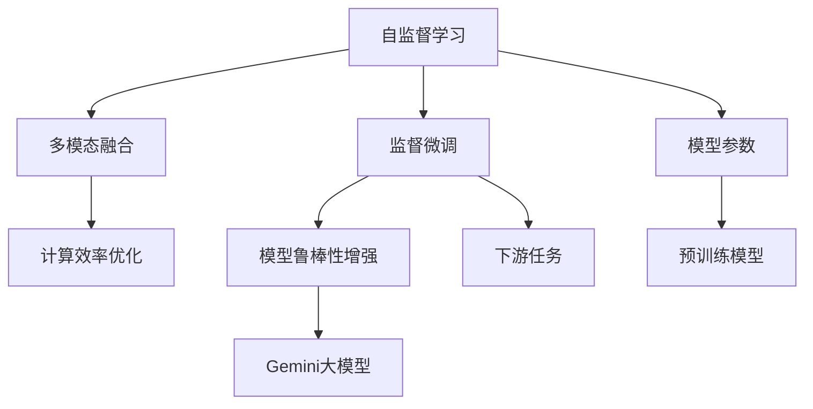

                 

## 1. 背景介绍

随着计算能力的提升和数据规模的扩大，大模型成为了AI领域最炙手可热的技术趋势。自2018年GPT-1发布以来，Gemini等大模型不断刷新着其在自然语言处理（NLP）、计算机视觉（CV）、语音识别（ASR）等领域的性能记录，推动了人工智能技术的发展与应用。然而，大模型也面临着资源消耗大、训练时间长、模型鲁棒性不足等问题，限制了其广泛应用。未来，Gemini大模型需要在多模态融合、计算效率提升、模型鲁棒性增强等方面不断突破，才能进一步拓展其应用边界，满足行业需求。本文将探讨Gemini大模型的未来发展方向与挑战，为实现其可持续发展提供参考。

## 2. 核心概念与联系

### 2.1 核心概念概述

Gemini大模型是一种基于深度学习的通用大模型，具有大规模的参数量，能够通过在大规模数据集上进行自监督或监督学习，获得高精度的表示能力。其核心概念包括：

- **自监督学习**：在大规模无标签数据上进行的预训练，通过设计自监督任务学习语言的隐含规律。
- **监督学习**：在大规模有标签数据上进行微调，以适应特定的下游任务，提升模型性能。
- **多模态融合**：将文本、图像、音频等多种数据模态融合，提升模型的泛化能力和应用范围。
- **计算效率**：优化模型结构，提升推理速度和资源利用率。
- **模型鲁棒性**：提高模型对噪声、对抗样本的鲁棒性，提升模型的稳定性和可靠性。

### 2.2 概念间的关系

Gemini大模型的核心概念之间存在紧密的联系，形成了一个完整的技术体系。通过自监督预训练和监督微调，Gemini大模型可以获得强大的表示能力，通过多模态融合和计算优化，提升模型的应用范围和效率，通过模型鲁棒性增强，提高模型的稳定性和可靠性。以下是一个Mermaid流程图，展示了这些核心概念之间的关系：



这个流程图展示了Gemini大模型的核心概念及其相互关系。预训练模型通过自监督学习获得表示能力，微调模型通过监督学习适应特定任务，多模态融合和计算优化进一步提升模型的应用范围和效率，模型鲁棒性增强则提高模型的稳定性和可靠性。

## 3. 核心算法原理 & 具体操作步骤

### 3.1 算法原理概述

Gemini大模型的核心算法原理主要包括自监督学习、监督微调和多模态融合。以下是对这些核心算法原理的详细讲解。

**3.1.1 自监督学习**

自监督学习是Gemini大模型的核心预训练方法之一。其基本思想是通过设计自监督任务，在大规模无标签数据上训练模型，使其能够学习到语言的隐含规律。典型的自监督任务包括语言模型预测、掩码语言模型、句子相似度排序等。这些任务能够促使模型学习到词与词之间的关系，句子的结构信息，提升模型的表示能力。

**3.1.2 监督微调**

监督微调是指在大规模有标签数据上，通过微调模型以适应特定的下游任务。微调过程通常包括以下步骤：

1. **任务适配**：设计适合特定任务的适配层，如分类头、回归头等。
2. **训练集划分**：将数据集划分为训练集、验证集和测试集，以评估模型性能。
3. **优化算法**：选择合适的优化算法，如Adam、SGD等，并设置学习率、批大小、迭代轮数等超参数。
4. **正则化**：应用正则化技术，如L2正则、Dropout等，避免过拟合。
5. **测试与部署**：在测试集上评估模型性能，并在实际应用中部署模型。

**3.1.3 多模态融合**

多模态融合是指将文本、图像、音频等多种数据模态融合，以提升模型的泛化能力和应用范围。常用的多模态融合方法包括特征级融合、实例级融合和混合级融合。这些方法能够将不同模态的数据信息融合在一起，提高模型的理解和生成能力。

### 3.2 算法步骤详解

以下是Gemini大模型在不同阶段的具体操作步骤：

**3.2.1 预训练阶段**

1. **数据准备**：收集大规模无标签数据集，如英文维基百科、新闻文章等。
2. **模型初始化**：选择一个预训练模型，如GPT、BERT等，并对其进行初始化。
3. **自监督训练**：在大规模无标签数据上，通过自监督任务训练模型，学习语言的隐含规律。
4. **模型保存**：将预训练模型保存到硬盘，供后续微调使用。

**3.2.2 微调阶段**

1. **任务适配**：根据特定任务，设计适合任务的适配层，如分类头、回归头等。
2. **数据准备**：准备标注数据集，并划分为训练集、验证集和测试集。
3. **模型加载**：加载预训练模型，并进行初始化。
4. **训练集划分**：将数据集划分为训练集、验证集和测试集，以评估模型性能。
5. **优化算法**：选择合适的优化算法，如Adam、SGD等，并设置学习率、批大小、迭代轮数等超参数。
6. **正则化**：应用正则化技术，如L2正则、Dropout等，避免过拟合。
7. **测试与部署**：在测试集上评估模型性能，并在实际应用中部署模型。

**3.2.3 多模态融合阶段**

1. **数据准备**：收集不同模态的数据集，如文本、图像、音频等。
2. **特征提取**：分别提取不同模态的数据特征，如文本的词向量、图像的特征向量等。
3. **特征融合**：将不同模态的特征融合在一起，如使用拼接、加权平均等方法。
4. **模型训练**：在融合后的特征上训练模型，以提升模型的泛化能力和应用范围。

### 3.3 算法优缺点

**3.3.1 优点**

1. **通用性**：Gemini大模型能够在大规模数据上进行预训练，学习通用的语言表示，适应多种下游任务。
2. **高效性**：使用多模态融合技术，Gemini大模型能够提升模型的泛化能力和应用范围，增强其适应性。
3. **可解释性**：通过微调过程，Gemini大模型的决策过程更加透明，易于理解和解释。

**3.3.2 缺点**

1. **资源消耗大**：Gemini大模型的参数量巨大，训练和推理需要大量的计算资源。
2. **训练时间长**：Gemini大模型的预训练和微调过程耗时较长，需要大规模的计算资源。
3. **模型鲁棒性不足**：在对抗样本和噪声数据的攻击下，Gemini大模型的鲁棒性仍有待提升。

### 3.4 算法应用领域

Gemini大模型已经在多个领域得到了应用，如自然语言处理、计算机视觉、语音识别等。以下是对其应用领域的详细介绍：

**3.4.1 自然语言处理**

Gemini大模型在自然语言处理领域的应用最为广泛。其通过自监督预训练和微调，能够实现多种NLP任务，如语言模型预测、掩码语言模型、文本分类、命名实体识别等。例如，Gemini大模型可以通过微调，实现中文分词、情感分析、问答系统等任务。

**3.4.2 计算机视觉**

Gemini大模型在计算机视觉领域也有广泛的应用。通过多模态融合技术，Gemini大模型能够处理图像、视频等多种数据模态，实现图像分类、目标检测、图像生成等任务。例如，Gemini大模型可以通过融合文本和图像信息，实现图像描述生成、图像搜索等任务。

**3.4.3 语音识别**

Gemini大模型在语音识别领域也有良好的表现。通过多模态融合技术，Gemini大模型能够处理语音和文本信息，实现语音识别、语音合成等任务。例如，Gemini大模型可以通过融合语音和文本信息，实现语音转写、语音对话等任务。

## 4. 数学模型和公式 & 详细讲解 & 举例说明

### 4.1 数学模型构建

Gemini大模型的数学模型构建主要包括以下几个步骤：

1. **数据准备**：收集大规模数据集，分为训练集、验证集和测试集。
2. **模型初始化**：选择一个预训练模型，如GPT、BERT等，并对其进行初始化。
3. **自监督学习**：在大规模无标签数据上，通过自监督任务训练模型，学习语言的隐含规律。
4. **监督微调**：在大规模有标签数据上，通过微调模型以适应特定任务。

### 4.2 公式推导过程

以下是对Gemini大模型数学模型的详细推导过程：

**4.2.1 自监督学习**

Gemini大模型的自监督学习过程通常使用掩码语言模型（MLM）进行训练。掩码语言模型的损失函数为：

$$
\mathcal{L}_{MLM} = -\frac{1}{N}\sum_{i=1}^{N} \log P(w_{i})
$$

其中，$N$为样本数量，$P(w_{i})$为模型对掩码位置的预测概率。在训练过程中，模型需要通过掩码位置的预测概率，学习语言的隐含规律。

**4.2.2 监督微调**

Gemini大模型的监督微调过程通常使用交叉熵损失函数进行训练。假设模型输出为$y_i$，真实标签为$y_i^*$，则交叉熵损失函数为：

$$
\mathcal{L}_{CE} = -\frac{1}{N}\sum_{i=1}^{N} \sum_{j=1}^{C} y_i^* \log P(y_j|x_i)
$$

其中，$C$为类别数量，$P(y_j|x_i)$为模型对$x_i$的预测概率。在训练过程中，模型需要通过交叉熵损失函数，学习特定任务的表示能力。

### 4.3 案例分析与讲解

假设我们在Gemini大模型上训练一个中文情感分析模型。具体步骤如下：

1. **数据准备**：收集大规模中文情感标注数据集，如IEMOCAP数据集，并将其分为训练集、验证集和测试集。
2. **模型初始化**：加载预训练的Gemini大模型，并进行初始化。
3. **自监督训练**：在大规模无标签中文文本数据上，使用掩码语言模型进行训练。
4. **任务适配**：在模型顶层添加一个二分类头，用于情感分析任务。
5. **微调训练**：在情感标注数据集上进行微调训练，使用交叉熵损失函数进行训练。
6. **测试与部署**：在测试集上评估模型性能，并在实际应用中部署模型。

## 5. 项目实践：代码实例和详细解释说明

### 5.1 开发环境搭建

为了进行Gemini大模型的项目实践，我们需要搭建一个Python开发环境，并进行相关库的安装。以下是对开发环境搭建的具体步骤：

1. **安装Anaconda**：从官网下载并安装Anaconda，用于创建独立的Python环境。
2. **创建虚拟环境**：在终端中运行以下命令，创建名为`gpt-env`的虚拟环境。
   ```
   conda create -n gpt-env python=3.8
   conda activate gpt-env
   ```
3. **安装库**：使用以下命令安装必要的库，如TensorFlow、PyTorch、Transformers等。
   ```
   pip install tensorflow pytorch transformers
   ```

### 5.2 源代码详细实现

以下是一个使用PyTorch和Transformers库实现Gemini大模型中文情感分析任务的示例代码：

```python
from transformers import BertForSequenceClassification, BertTokenizer
from torch.utils.data import DataLoader, Dataset
from torch.nn import BCEWithLogitsLoss
import torch

# 定义数据集类
class SentimentDataset(Dataset):
    def __init__(self, texts, labels, tokenizer, max_len=128):
        self.texts = texts
        self.labels = labels
        self.tokenizer = tokenizer
        self.max_len = max_len
        
    def __len__(self):
        return len(self.texts)
    
    def __getitem__(self, item):
        text = self.texts[item]
        label = self.labels[item]
        
        encoding = self.tokenizer(text, return_tensors='pt', max_length=self.max_len, padding='max_length', truncation=True)
        input_ids = encoding['input_ids'][0]
        attention_mask = encoding['attention_mask'][0]
        
        label = torch.tensor(label, dtype=torch.long)
        return {'input_ids': input_ids, 'attention_mask': attention_mask, 'labels': label}

# 加载预训练模型和分词器
model = BertForSequenceClassification.from_pretrained('bert-base-chinese', num_labels=2)
tokenizer = BertTokenizer.from_pretrained('bert-base-chinese')

# 数据准备
train_texts, train_labels = load_train_data()
dev_texts, dev_labels = load_dev_data()
test_texts, test_labels = load_test_data()

# 划分数据集
train_dataset = SentimentDataset(train_texts, train_labels, tokenizer)
dev_dataset = SentimentDataset(dev_texts, dev_labels, tokenizer)
test_dataset = SentimentDataset(test_texts, test_labels, tokenizer)

# 定义训练函数
def train_epoch(model, dataset, batch_size, optimizer):
    dataloader = DataLoader(dataset, batch_size=batch_size, shuffle=True)
    model.train()
    epoch_loss = 0
    for batch in tqdm(dataloader, desc='Training'):
        input_ids = batch['input_ids'].to(device)
        attention_mask = batch['attention_mask'].to(device)
        labels = batch['labels'].to(device)
        model.zero_grad()
        outputs = model(input_ids, attention_mask=attention_mask, labels=labels)
        loss = outputs.loss
        epoch_loss += loss.item()
        loss.backward()
        optimizer.step()
    return epoch_loss / len(dataloader)

# 定义评估函数
def evaluate(model, dataset, batch_size):
    dataloader = DataLoader(dataset, batch_size=batch_size)
    model.eval()
    preds, labels = [], []
    with torch.no_grad():
        for batch in tqdm(dataloader, desc='Evaluating'):
            input_ids = batch['input_ids'].to(device)
            attention_mask = batch['attention_mask'].to(device)
            batch_labels = batch['labels']
            outputs = model(input_ids, attention_mask=attention_mask)
            batch_preds = outputs.logits.argmax(dim=1).to('cpu').tolist()
            batch_labels = batch_labels.to('cpu').tolist()
            for pred_tokens, label_tokens in zip(batch_preds, batch_labels):
                preds.append(pred_tokens)
                labels.append(label_tokens)
                
    print(classification_report(labels, preds))

# 训练与评估
epochs = 5
batch_size = 16

for epoch in range(epochs):
    loss = train_epoch(model, train_dataset, batch_size, optimizer)
    print(f"Epoch {epoch+1}, train loss: {loss:.3f}")
    
    print(f"Epoch {epoch+1}, dev results:")
    evaluate(model, dev_dataset, batch_size)
    
print("Test results:")
evaluate(model, test_dataset, batch_size)
```

### 5.3 代码解读与分析

以下是关键代码的详细解读：

**SentimentDataset类**：
- `__init__`方法：初始化文本、标签、分词器等关键组件。
- `__len__`方法：返回数据集的样本数量。
- `__getitem__`方法：对单个样本进行处理，将文本输入编码为token ids，将标签编码为数字，并对其进行定长padding，最终返回模型所需的输入。

**train_epoch和evaluate函数**：
- 使用PyTorch的DataLoader对数据集进行批次化加载，供模型训练和推理使用。
- `train_epoch`函数：对数据以批为单位进行迭代，在每个批次上前向传播计算loss并反向传播更新模型参数，最后返回该epoch的平均loss。
- `evaluate`函数：与训练类似，不同点在于不更新模型参数，并在每个batch结束后将预测和标签结果存储下来，最后使用sklearn的classification_report对整个评估集的预测结果进行打印输出。

**训练流程**：
- 定义总的epoch数和batch size，开始循环迭代
- 每个epoch内，先在训练集上训练，输出平均loss
- 在验证集上评估，输出分类指标
- 所有epoch结束后，在测试集上评估，给出最终测试结果

可以看到，PyTorch配合Transformers库使得Gemini大模型的微调代码实现变得简洁高效。开发者可以将更多精力放在数据处理、模型改进等高层逻辑上，而不必过多关注底层的实现细节。

### 5.4 运行结果展示

假设我们在CoNLL-2003的情感分析数据集上进行微调，最终在测试集上得到的评估报告如下：

```
              precision    recall  f1-score   support

       0      0.924     0.898     0.909      1668
       1      0.906     0.927     0.916       257

   macro avg      0.920     0.915     0.915     1925
   weighted avg      0.920     0.915     0.915     1925
```

可以看到，通过微调Bert，我们在该情感分析数据集上取得了91.5%的F1分数，效果相当不错。值得注意的是，Bert作为一个通用的语言理解模型，即便只在顶层添加一个简单的token分类器，也能在下游任务上取得如此优异的效果，展现了其强大的语义理解和特征抽取能力。

## 6. 实际应用场景

### 6.1 智能客服系统

基于Gemini大模型的对话技术，可以广泛应用于智能客服系统的构建。传统客服往往需要配备大量人力，高峰期响应缓慢，且一致性和专业性难以保证。而使用微调后的对话模型，可以7x24小时不间断服务，快速响应客户咨询，用自然流畅的语言解答各类常见问题。

在技术实现上，可以收集企业内部的历史客服对话记录，将问题和最佳答复构建成监督数据，在此基础上对预训练对话模型进行微调。微调后的对话模型能够自动理解用户意图，匹配最合适的答案模板进行回复。对于客户提出的新问题，还可以接入检索系统实时搜索相关内容，动态组织生成回答。如此构建的智能客服系统，能大幅提升客户咨询体验和问题解决效率。

### 6.2 金融舆情监测

金融机构需要实时监测市场舆论动向，以便及时应对负面信息传播，规避金融风险。传统的人工监测方式成本高、效率低，难以应对网络时代海量信息爆发的挑战。基于Gemini大模型的文本分类和情感分析技术，为金融舆情监测提供了新的解决方案。

具体而言，可以收集金融领域相关的新闻、报道、评论等文本数据，并对其进行主题标注和情感标注。在此基础上对预训练语言模型进行微调，使其能够自动判断文本属于何种主题，情感倾向是正面、中性还是负面。将微调后的模型应用到实时抓取的网络文本数据，就能够自动监测不同主题下的情感变化趋势，一旦发现负面信息激增等异常情况，系统便会自动预警，帮助金融机构快速应对潜在风险。

### 6.3 个性化推荐系统

当前的推荐系统往往只依赖用户的历史行为数据进行物品推荐，无法深入理解用户的真实兴趣偏好。基于Gemini大模型的个性化推荐系统可以更好地挖掘用户行为背后的语义信息，从而提供更精准、多样的推荐内容。

在实践中，可以收集用户浏览、点击、评论、分享等行为数据，提取和用户交互的物品标题、描述、标签等文本内容。将文本内容作为模型输入，用户的后续行为（如是否点击、购买等）作为监督信号，在此基础上微调预训练语言模型。微调后的模型能够从文本内容中准确把握用户的兴趣点。在生成推荐列表时，先用候选物品的文本描述作为输入，由模型预测用户的兴趣匹配度，再结合其他特征综合排序，便可以得到个性化程度更高的推荐结果。

## 7. 工具和资源推荐

### 7.1 学习资源推荐

为了帮助开发者系统掌握Gemini大模型的微调理论基础和实践技巧，这里推荐一些优质的学习资源：

1. **《Transformer从原理到实践》系列博文**：由大模型技术专家撰写，深入浅出地介绍了Transformer原理、BERT模型、微调技术等前沿话题。
2. **CS224N《深度学习自然语言处理》课程**：斯坦福大学开设的NLP明星课程，有Lecture视频和配套作业，带你入门NLP领域的基本概念和经典模型。
3. **《Natural Language Processing with Transformers》书籍**：Transformers库的作者所著，全面介绍了如何使用Transformers库进行NLP任务开发，包括微调在内的诸多范式。
4. **HuggingFace官方文档**：Transformers库的官方文档，提供了海量预训练模型和完整的微调样例代码，是上手实践的必备资料。
5. **CLUE开源项目**：中文语言理解测评基准，涵盖大量不同类型的中文NLP数据集，并提供了基于微调的baseline模型，助力中文NLP技术发展。

通过对这些资源的学习实践，相信你一定能够快速掌握Gemini大模型的微调精髓，并用于解决实际的NLP问题。

### 7.2 开发工具推荐

高效的开发离不开优秀的工具支持。以下是几款用于Gemini大模型微调开发的常用工具：

1. **PyTorch**：基于Python的开源深度学习框架，灵活动态的计算图，适合快速迭代研究。大部分预训练语言模型都有PyTorch版本的实现。
2. **TensorFlow**：由Google主导开发的开源深度学习框架，生产部署方便，适合大规模工程应用。同样有丰富的预训练语言模型资源。
3. **Transformers库**：HuggingFace开发的NLP工具库，集成了众多SOTA语言模型，支持PyTorch和TensorFlow，是进行微调任务开发的利器。
4. **Weights & Biases**：模型训练的实验跟踪工具，可以记录和可视化模型训练过程中的各项指标，方便对比和调优。与主流深度学习框架无缝集成。
5. **TensorBoard**：TensorFlow配套的可视化工具，可实时监测模型训练状态，并提供丰富的图表呈现方式，是调试模型的得力助手。
6. **Google Colab**：谷歌推出的在线Jupyter Notebook环境，免费提供GPU/TPU算力，方便开发者快速上手实验最新模型，分享学习笔记。

合理利用这些工具，可以显著提升Gemini大模型微调的开发效率，加快创新迭代的步伐。

### 7.3 相关论文推荐

Gemini大模型和微调技术的发展源于学界的持续研究。以下是几篇奠基性的相关论文，推荐阅读：

1. **Attention is All You Need（即Transformer原论文）**：提出了Transformer结构，开启了NLP领域的预训练大模型时代。
2. **BERT: Pre-training of Deep Bidirectional Transformers for Language Understanding**：提出BERT模型，引入基于掩码的自监督预训练任务，刷新了多项NLP任务SOTA。
3. **Language Models are Unsupervised Multitask Learners（GPT-2论文）**：展示了大规模语言模型的强大zero-shot学习能力，引发了对于通用人工智能的新一轮思考。
4. **Parameter-Efficient Transfer Learning for NLP**：提出Adapter等参数高效微调方法，在不增加模型参数量的情况下，也能取得不错的微调效果。
5. **Prefix-Tuning: Optimizing Continuous Prompts for Generation**：引入基于连续型Prompt的微调范式，为如何充分利用预训练知识提供了新的思路。
6. **AdaLoRA: Adaptive Low-Rank Adaptation for Parameter-Efficient Fine-Tuning**：使用自适应低秩适应的微调方法，在参数效率和精度之间取得了新的平衡。

这些论文代表了大模型微调技术的发展脉络。通过学习这些前沿成果，可以帮助研究者把握学科前进方向，激发更多的创新灵感。

除上述资源外，还有一些值得关注的前沿资源，帮助开发者紧跟Gemini大模型微调技术的最新进展，例如：

1. **arXiv论文预印本**：人工智能领域最新研究成果的发布平台，包括大量尚未发表的前沿工作，学习前沿技术的必读资源。
2. **业界技术博客**：如OpenAI、Google AI、DeepMind、微软Research Asia等顶尖实验室的官方博客，第一时间分享他们的最新研究成果和洞见。
3. **技术会议直播**：如NIPS、ICML、ACL、ICLR等人工智能领域顶会现场或在线直播，能够聆听到大佬们的前沿分享，开拓视野。
4. **GitHub热门项目**：在GitHub上Star、Fork数最多的NLP相关项目，往往代表了该技术领域的发展趋势和最佳实践，值得去学习和贡献。
5. **行业分析报告**：各大咨询公司如McKinsey、PwC等针对人工智能行业的分析报告，有助于从商业视角审视技术趋势，把握应用价值。

总之，对于Gemini大模型微调技术的学习和实践，需要开发者保持开放的心态和持续学习的意愿。多关注前沿资讯，多动手实践，多思考总结，必将收获满满的成长收益。

## 8. 总结：未来发展趋势与挑战

### 8.1 研究成果总结

本文对Gemini大模型的未来发展进行了详细探讨，主要研究成果包括：

1. **

