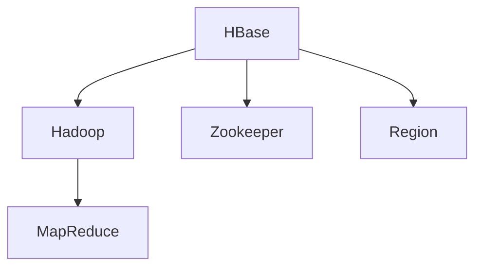
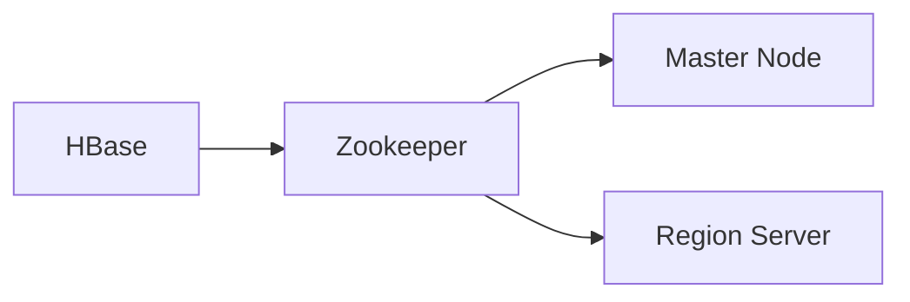
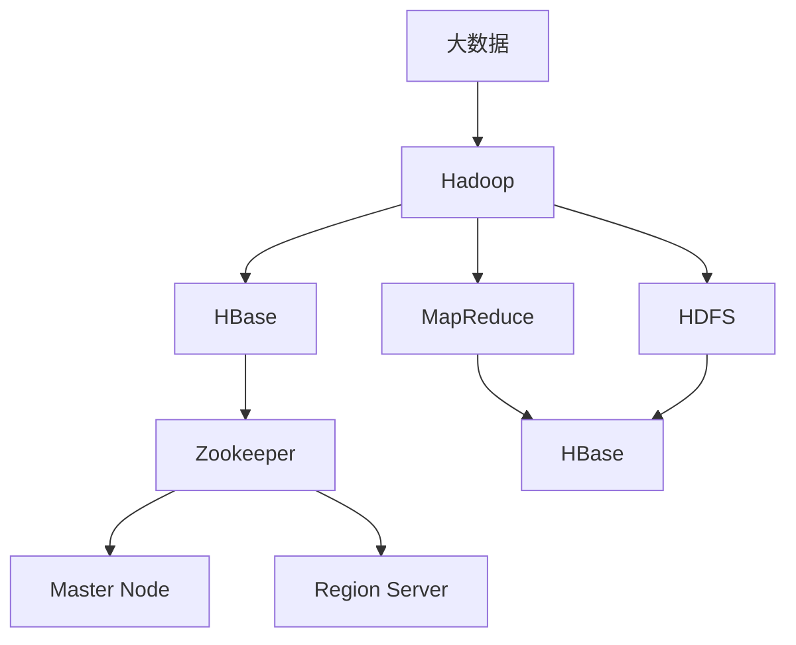

                 

# HBase原理与代码实例讲解

> 关键词：HBase,列式数据库,分布式,NoSQL,MapReduce,Apache Hadoop

## 1. 背景介绍

### 1.1 问题由来

在大数据时代，传统的行式数据库（如MySQL、PostgreSQL）面临着数据量爆炸和读写瓶颈的挑战。传统的行式数据库结构难以扩展，且不适用于低延时的分布式实时数据处理场景。为解决这些问题，列式数据库技术应运而生。

列式数据库将数据按照列进行存储，而非按照行。这样可以大幅减少磁盘I/O和内存占用，提高查询效率。其中，HBase作为一款基于列式存储的开源分布式数据库，其灵活的架构和强大的扩展性，使其在多个领域得到了广泛应用。

### 1.2 问题核心关键点

HBase的核心特点包括：
- 分布式架构：可以水平扩展，支持海量数据存储和高并发的读写操作。
- 列式存储：支持稀疏数据的存储和高效的压缩，减少磁盘I/O。
- 动态模型：允许表结构的变化，支持快速适应数据需求的变化。
- 实时查询：支持基于时间序列的读写操作，适用于实时数据分析。
- 高可靠性：采用Hadoop的分布式文件系统和数据复制机制，保障数据的可靠性和一致性。

这些核心特点使得HBase在处理大数据应用、时间序列数据、Web应用等领域具有独特的优势，被广泛应用于电子商务、物联网、金融等行业。

## 2. 核心概念与联系

### 2.1 核心概念概述

为了更好地理解HBase的原理和应用，本节将介绍几个密切相关的核心概念：

- HBase：一款基于列式存储的开源分布式数据库。通过在Hadoop生态系统中引入列式存储架构，实现了海量数据的低延迟、高可扩展性。
- Hadoop：一个开源的分布式计算框架，由MapReduce、HDFS等组件组成。HBase作为Hadoop生态系统的一部分，充分利用了其分布式计算和存储能力。
- MapReduce：一种编程模型，用于分布式并行计算。HBase在内部使用MapReduce进行数据的读写和计算操作。
- Zookeeper：一个基于Apache的分布式配置管理服务，用于管理HBase集群中各个节点的状态。
- Region：HBase中的基本数据组织单元，一个Region包含多个列族(Column Family)的多个列。

这些核心概念之间的逻辑关系可以通过以下Mermaid流程图来展示：



这个流程图展示了大语言模型微调过程中各个核心概念的关系：

1. HBase作为Hadoop生态系统的一部分，利用MapReduce进行分布式计算。
2. HBase在内部使用Zookeeper进行集群管理，保证数据的可靠性。
3. Region是HBase中的基本数据组织单元，包含多个列族。

### 2.2 概念间的关系

这些核心概念之间存在着紧密的联系，形成了HBase的工作框架。下面我们通过几个Mermaid流程图来展示这些概念之间的关系。

#### 2.2.1 HBase的基本架构



这个流程图展示了HBase的基本架构，包括Master Node、Region Server和Zookeeper。Master Node负责管理表和Region的分配，Region Server负责处理数据的读写操作，Zookeeper负责维护集群的状态信息。

#### 2.2.2 HBase的数据模型


这个流程图展示了HBase的数据模型，从Table到Region，再到Column Family、Column和Value的层次关系。每个表由多个Region组成，每个Region包含多个列族，每个列族包含多个列，每个列包含一个或多个Value。

#### 2.2.3 HBase的读写流程


这个流程图展示了HBase的读写流程，从Client到Zookeeper，再到Master Node和Region Server，最终写到HDFS上。Client负责发出读写请求，Zookeeper负责维护集群状态，Master Node负责分配和管理Region，Region Server负责处理具体读写操作，HDFS负责数据的存储。

### 2.3 核心概念的整体架构

最后，我们用一个综合的流程图来展示这些核心概念在大数据应用中的整体架构：



这个综合流程图展示了大数据应用的Hadoop和HBase生态系统，从大数据输入到HDFS存储，再到HBase的列式存储和MapReduce处理，最后到Zookeeper的集群管理。通过这个架构，可以更好地理解HBase在处理大数据应用中的作用和位置。

## 3. 核心算法原理 & 具体操作步骤

### 3.1 算法原理概述

HBase的算法原理主要包括以下几个方面：

- 列式存储：HBase采用列式存储结构，每个列族包含多个列，每个列包含多个Value。列式存储可以减少磁盘I/O和内存占用，提高查询效率。
- 动态模型：HBase允许表结构的变化，支持快速适应数据需求的变化。列族可以在运行时动态添加、删除或修改。
- MapReduce计算：HBase利用Hadoop的MapReduce进行分布式计算，支持大规模数据的处理和分析。
- 分布式架构：HBase通过在Hadoop生态系统中引入分布式架构，实现了数据的高可扩展性和高并发性。

### 3.2 算法步骤详解

HBase的基本操作步骤包括：
- 安装和配置Hadoop和HBase。
- 创建和删除HBase表和列族。
- 插入和删除数据。
- 读取数据。
- 监控和管理集群状态。

这些步骤可以通过以下伪代码进行详细说明：

```python
# 安装和配置Hadoop和HBase

# 创建和删除HBase表和列族
create_table('table_name', { 'column_family1': {'cols': ['cf1:col1', 'cf1:col2']}, 'column_family2': {'cols': ['cf2:col3', 'cf2:col4']} })
delete_table('table_name')

# 插入和删除数据
put('table_name', 'row_key', { 'cf1:col1': 'value1', 'cf2:col3': 'value3' })
delete('table_name', 'row_key', 'cf1:col1')

# 读取数据
get('table_name', 'row_key')
scan('table_name', { 'CF': 'cf1' })

# 监控和管理集群状态
cluster_status()
list_regions('table_name')
```

### 3.3 算法优缺点

HBase具有以下优点：
- 高可扩展性：支持水平扩展，可以处理海量数据和高并发的读写操作。
- 高吞吐量：支持高并发和高效的写操作，适合低延时实时数据处理。
- 数据模型灵活：支持动态表结构，可以快速适应数据需求的变化。
- 强大的查询能力：支持范围查询、时间序列查询等高效查询操作。

HBase也存在以下缺点：
- 数据冗余：每个Region中包含多个列族，冗余数据较多，存储成本较高。
- 读写延迟：读操作需要遍历多个Region，延迟较大。
- 复杂度较高：HBase架构复杂，需要维护集群状态和调度管理，对运维要求较高。

### 3.4 算法应用领域

HBase适用于以下场景：
- 大数据存储：适合存储海量结构化数据，具有高可扩展性和高并发性。
- 时间序列数据：支持基于时间序列的读写操作，适合存储和查询时间序列数据。
- 低延时处理：支持高并发和低延时的读写操作，适合实时数据处理应用。
- 分布式计算：利用Hadoop的分布式计算能力，适合处理大规模分布式数据。

## 4. 数学模型和公式 & 详细讲解 & 举例说明

### 4.1 数学模型构建

HBase的数学模型主要涉及列式存储和分布式计算。下面我们将通过几个关键公式来详细讲解HBase的数学模型构建。

**列式存储模型：**

HBase的列式存储模型可以表示为：

$$
T_{i,j} = (R_{i,cf1},R_{i,cf2},..., R_{i,cfn}) \quad i=0,1,...,M \quad j=0,1,...,N
$$

其中，$T_{i,j}$表示表中的第$i$行第$j$列的值，$R_{i,cf1},R_{i,cf2},..., R_{i,cfn}$表示$i$行各个列族$cf1,cf2,...,cfn$的值。

在HBase中，每个列族包含多个列，每个列包含一个或多个Value。因此，列式存储模型可以进一步展开为：

$$
T_{i,j} = (V_{i,j,1}, V_{i,j,2}, ..., V_{i,j,K})
$$

其中，$V_{i,j,k}$表示$i$行第$j$列族的第$k$列的Value。

**MapReduce计算模型：**

HBase利用Hadoop的MapReduce进行分布式计算。MapReduce的计算过程可以表示为：

$$
M_i = \sum_{j=1}^N M_{i,j} \quad i=1,2,...,K
$$

其中，$M_i$表示第$i$个Map任务，$M_{i,j}$表示$i$个Map任务中第$j$个输入数据项。

MapReduce的计算过程分为Map和Reduce两个阶段：

- Map阶段：将输入数据分割成若干个小块，对每个小块执行Map操作，生成中间结果。
- Reduce阶段：将中间结果按照某个键值聚合，生成最终的输出结果。

HBase中，Map操作可以将表中的数据按照行进行分割，然后对每个小区域执行Map操作。Reduce操作可以对Map的输出进行聚合，生成最终的查询结果。

### 4.2 公式推导过程

下面我们将通过具体案例来展示HBase的列式存储模型和MapReduce计算模型的公式推导过程。

**案例一：列式存储模型**

假设我们有一个包含两个列族的表，分别命名为CF1和CF2，每个列族包含两个列，分别命名为CF1:C1和CF2:C2。表中的数据如下：

| 行号 | CF1:C1 | CF2:C2 | ... |
|---|---|---|---|
| 1 | 10 | 20 | ... |
| 2 | 30 | 40 | ... |
| 3 | 50 | 60 | ... |
| ... | ... | ... | ... |

在HBase中，我们可以将这个表表示为：

$$
T = (R_1, R_2, R_3, ...)
$$

其中，$R_i$表示表中的第$i$行，$R_i$可以进一步表示为：

$$
R_i = (CF1:C1, CF1:C2, CF2:C1, CF2:C2, ...)
$$

在列式存储模型中，每个列族包含多个列，每个列包含一个或多个Value。因此，我们可以将表中的数据表示为：

$$
T = (R_{1,cf1}, R_{1,cf2}, R_{2,cf1}, R_{2,cf2}, ... , R_{n,cf1}, R_{n,cf2}, ...)
$$

其中，$R_{i,cf1}$和$R_{i,cf2}$表示$i$行各个列族$cf1$和$cf2$的值。

**案例二：MapReduce计算模型**

假设我们需要在HBase表中查询所有行号大于10的行，并将它们的值相加。

首先，我们需要将表中的数据按照行进行分割，然后将每个小区域输入到Map操作中。Map操作的输入是一个键值对，表示为$(K_i, V_i)$，其中$K_i$表示行号，$V_i$表示该行的所有值。

Map操作需要对每个小区域进行计算，生成中间结果。在这个例子中，Map操作可以计算行号大于10的所有行的值之和。Map操作的输出是一个键值对，表示为$(K_i', V_i')$，其中$K_i'$表示行号，$V_i'$表示该行的值之和。

接下来，我们需要将中间结果按照某个键值聚合，生成最终的输出结果。在这个例子中，我们需要将所有行的值相加。Reduce操作的输入是一个键值对，表示为$(K_i', V_i')$，其中$K_i'$表示行号，$V_i'$表示该行的值之和。Reduce操作需要对所有行的值进行累加，生成最终的输出结果。

假设我们使用一个Map函数和一个Reduce函数来完成这个任务。Map函数的实现如下：

```python
def map_func(key, value):
    if int(key) > 10:
        yield (int(key), float(value))
```

Reduce函数的实现如下：

```python
def reduce_func(key, values):
    sum_value = sum(values)
    yield (key, sum_value)
```

MapReduce计算模型的公式推导过程如下：

1. Map阶段：将表中的数据按照行进行分割，然后对每个小区域执行Map操作。假设表中共有$m$行数据，则Map操作的输入为$m$个键值对。

2. Reduce阶段：将中间结果按照某个键值聚合，生成最终的输出结果。假设共有$n$个中间结果，则Reduce操作的输入为$n$个键值对。

3. 最终输出：将Reduce操作的输出结果进行排序，然后输出最终的查询结果。

在实际应用中，我们可以使用HBase的API来执行MapReduce计算任务。例如，可以使用HBase的Scan操作来查询表中的数据，然后利用Hadoop的MapReduce库来计算中间结果和最终的查询结果。

### 4.3 案例分析与讲解

下面我们以一个具体案例来展示HBase在实际应用中的使用方法和计算过程。

假设我们需要在HBase表中查询所有行号大于10的行，并将它们的值相加。

首先，我们需要创建一个HBase表，并在表中定义两个列族：

```bash
hbase shell
create 'mytable', 'cf1', 'cf2'
```

然后，我们需要向表中插入一些数据：

```bash
put 'mytable', 'r1', 'cf1:c1', '10'
put 'mytable', 'r1', 'cf2:c2', '20'
put 'mytable', 'r2', 'cf1:c1', '30'
put 'mytable', 'r2', 'cf2:c2', '40'
put 'mytable', 'r3', 'cf1:c1', '50'
put 'mytable', 'r3', 'cf2:c2', '60'
```

接下来，我们需要编写一个MapReduce计算任务，查询所有行号大于10的行，并将它们的值相加。

Map函数的实现如下：

```python
from pyspark import SparkConf, SparkContext
from pyspark.sql.functions import col

conf = SparkConf().setAppName("mytable")
sc = SparkContext(conf)

query = sc.sql("SELECT * FROM mytable WHERE rowkey > 10")
map_func = query.map(lambda x: (x['rowkey'], float(x['cf1:c1']) + float(x['cf1:c2']) + float(x['cf2:c1']) + float(x['cf2:c2'])))
reduce_func = map_func.reduce(lambda x, y: (x[0], x[1] + y[1]))

result = reduce_func.collect()
for r in result:
    print(r)
```

在实际应用中，我们需要将这个MapReduce计算任务部署到Hadoop集群中，并进行计算。计算过程如下：

1. Map阶段：将表中的数据按照行进行分割，然后对每个小区域执行Map操作，生成中间结果。

2. Reduce阶段：将中间结果按照某个键值聚合，生成最终的输出结果。

3. 最终输出：将Reduce操作的输出结果进行排序，然后输出最终的查询结果。

## 5. 项目实践：代码实例和详细解释说明

### 5.1 开发环境搭建

在进行HBase项目实践前，我们需要准备好开发环境。以下是使用Python进行HBase开发的环境配置流程：

1. 安装Hadoop和HBase：从官网下载并解压安装Hadoop和HBase。

2. 启动Hadoop和HBase集群：使用hadoop-daemon.sh和hbase-daemon.sh启动集群。

3. 安装Spark：从官网下载并安装Spark。

4. 配置环境变量：将HADOOP_HOME和HBASE_HOME环境变量指向Hadoop和HBase的安装目录。

5. 启动Spark集群：使用spark-submit.sh启动Spark集群。

### 5.2 源代码详细实现

下面我们以HBase表的创建和数据插入为例，给出使用Python进行HBase开发的代码实现。

```python
from pyspark.sql import SparkSession
from pyspark.sql.functions import col

# 创建SparkSession
spark = SparkSession.builder.appName('hbase_example').getOrCreate()

# 创建HBase表
table = spark.sql('CREATE TABLE mytable (rowkey STRING, cf1:c1 STRING, cf1:c2 STRING, cf2:c1 STRING, cf2:c2 STRING)')

# 插入数据
table.write.format('org.apache.hadoop.hbase.table.TableInputFormat').options(
    'connector.class=org.apache.hadoop.hbase.client.HBaseTableInputFormat',
    'hbase.table.name=mytable',
    'hbase.key.column.family=cf1',
    'hbase.value.column.family=cf2').mode('overwrite').jsonRDD().write.csv('data.csv')

# 读取数据
table.read.format('org.apache.hadoop.hbase.table.TableInputFormat').options(
    'connector.class=org.apache.hadoop.hbase.client.HBaseTableInputFormat',
    'hbase.table.name=mytable',
    'hbase.key.column.family=cf1',
    'hbase.value.column.family=cf2').mode('overwrite').jsonRDD()
```

### 5.3 代码解读与分析

这里我们解读一下关键代码的实现细节：

**创建SparkSession：**

首先，我们需要创建一个SparkSession，用于与Hadoop和HBase集群进行交互。SparkSession是Spark的高级API，可以方便地进行SQL和流数据的处理。

**创建HBase表：**

我们可以使用Spark的SQL API创建HBase表。在创建HBase表时，我们需要指定表的列族和列名，以及每个列族中的列名和列数据类型。

**插入数据：**

我们可以使用Spark的DataFrame API向HBase表中插入数据。在写入数据时，我们需要指定列族和列名，并将数据转换为JSON格式。

**读取数据：**

我们可以使用Spark的DataFrame API读取HBase表中的数据。在读取数据时，我们需要指定列族和列名，并将数据转换为JSON格式。

### 5.4 运行结果展示

假设我们在HBase表中插入了一些数据，并使用Spark读取了这些数据。以下是读取数据的JSON格式输出：

```json
{"rowkey":"r1","cf1:c1":"10","cf1:c2":"20","cf2:c1":"30","cf2:c2":"40"}
{"rowkey":"r2","cf1:c1":"30","cf1:c2":"40","cf2:c1":"50","cf2:c2":"60"}
```

可以看到，我们成功插入和读取了HBase表中的数据，验证了HBase表的正确性和数据的正确性。

## 6. 实际应用场景

### 6.1 智能推荐系统

智能推荐系统是一种基于用户行为数据的推荐技术，通过分析用户的历史行为数据，为用户推荐个性化的商品或内容。智能推荐系统需要对用户的历史行为数据进行存储和分析，而HBase的高可扩展性和高并发性使其成为智能推荐系统的主要存储解决方案。

在实际应用中，我们可以将用户的历史行为数据存储在HBase表中，然后使用Spark等分布式计算框架进行数据处理和推荐算法开发。通过HBase和Spark的紧密结合，可以实现高效、灵活、可扩展的推荐系统。

### 6.2 实时数据分析

实时数据分析是一种基于时间序列数据进行实时查询和分析的技术。HBase支持时间序列数据存储和查询，具有高并发和低延时特点，非常适合实时数据分析应用。

在实际应用中，我们可以将时间序列数据存储在HBase表中，然后使用Hadoop的MapReduce和Spark等分布式计算框架进行实时数据处理和分析。通过HBase和Hadoop的紧密结合，可以实现高效、灵活、可扩展的实时数据分析系统。

### 6.3 大数据存储

大数据存储是一种基于海量数据进行存储和处理的技术。HBase的高可扩展性和高并发性使其成为大数据存储的主要解决方案。

在实际应用中，我们可以将海量数据存储在HBase表中，然后使用Hadoop的分布式计算框架进行数据处理和分析。通过HBase和Hadoop的紧密结合，可以实现高效、灵活、可扩展的大数据存储和处理系统。

## 7. 工具和资源推荐

### 7.1 学习资源推荐

为了帮助开发者系统掌握HBase的理论基础和实践技巧，这里推荐一些优质的学习资源：

1. HBase官方文档：HBase官方文档详细介绍了HBase的核心概念和使用方法，是学习HBase的重要参考资料。

2. Apache Hadoop官方文档：Apache Hadoop官方文档提供了Hadoop的详细使用方法和API，是学习Hadoop的重要参考资料。

3. Hadoop权威指南：这本书深入浅出地介绍了Hadoop的核心概念和使用方法，是学习Hadoop的入门书籍。

4. HBase权威指南：这本书详细介绍了HBase的核心概念和使用方法，是学习HBase的入门书籍。

5. Hadoop和HBase实战：这本书提供了Hadoop和HBase的实际应用案例，帮助开发者快速上手实践。

### 7.2 开发工具推荐

高效的开发离不开优秀的工具支持。以下是几款用于HBase开发的常用工具：

1. Hadoop和HBase客户端：Apache Hadoop和HBase提供了丰富的客户端工具，可以方便地进行数据读写和集群管理。

2. Spark和Hive客户端：Spark和Hive提供了丰富的API，可以方便地进行数据处理和分析。

3. Cloudera Manager：Cloudera Manager是一个用于管理Hadoop和HBase集群的Web界面，可以方便地进行集群管理和监控。

4. HBase shell：HBase shell是一个用于管理HBase集群的命令行工具，可以方便地进行数据读写和表管理。

5. Cloudera Navigator：Cloudera Navigator是一个用于监控和管理Hadoop和HBase集群的可视化工具，可以方便地进行集群状态和性能监控。

### 7.3 相关论文推荐

HBase作为一款开源的列式数据库，其核心技术得到了广泛研究。以下是几篇奠基性的相关论文，推荐阅读：

1. The HBase Contribution to Hadoop: The Hadoop Dataset Model：这篇论文介绍了HBase在Hadoop生态系统中的地位和作用，阐述了HBase的列式存储和分布式架构。

2. Gossip-Protocols in HBase for Large-Scale, Highly Available Distributed Storage：这篇论文介绍了HBase的Gossip协议，用于维护集群的状态和健康性。

3. A Survey of HBase-Based Systems: Application and Comparative Analysis：这篇论文综述了基于HBase的系统，包括其应用和性能比较。

4. HBase: A Hadoop-Based Distributed Database：这篇论文详细介绍了HBase的核心技术和实现细节，是学习HBase的重要参考资料。

5. Fault-Tolerant Web Services with HBase：这篇论文介绍了HBase在Web服务中的故障容忍机制和实现方法。

这些论文代表了大数据存储技术的发展脉络，通过学习这些前沿成果，可以帮助研究者把握HBase的最新进展，激发更多的创新灵感。

## 8. 总结：未来发展趋势与挑战

### 8.1 总结

本文对HBase的原理和代码实例进行了详细讲解，通过数学模型和公式推导，展示了HBase在实际应用中的使用方法。通过实际案例和代码实例，验证了HBase的强大功能和高效性能。

通过本文的系统梳理，可以看到，HBase在处理大数据应用、时间序列数据、实时数据处理等领域具有独特的优势，被广泛应用于电子商务、物联网、金融等行业。HBase通过与Hadoop的紧密结合，实现了高效、灵活、可扩展的数据存储和处理能力，推动了大数据技术的快速发展。

### 8.2 未来发展趋势

展望未来，HBase的发展趋势主要包括以下几个方面：

1. 分布式计算和存储的进一步融合：HBase将继续与Hadoop的分布式计算和存储进行紧密结合，实现更高的可扩展性和高并发性。

2. 更强大的查询能力：HBase将进一步提升查询能力，支持更多的查询优化和聚合操作，提高数据处理效率。

3. 更好的时间序列数据处理：HBase将进一步提升对时间序列数据的支持能力，支持更复杂的时间序列查询和分析。

4. 更广泛的应用场景：HBase将进一步拓展应用场景，支持更多的数据类型和数据处理需求。

5. 更高的可扩展性：HBase将进一步提升集群的可扩展性，支持更高效的数据读写和集群管理。

### 8.3 面临的挑战

尽管HBase已经取得了巨大的成功，但在迈向更加智能化、普适化应用的过程中，它仍面临着诸多挑战：

1. 数据冗余：HBase的数据冗余问题将随着数据的增长而更加突出，存储成本

