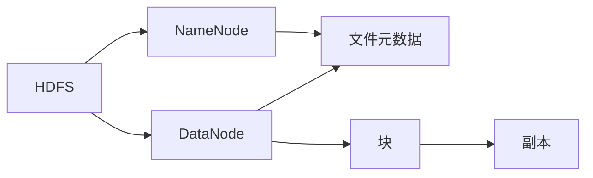
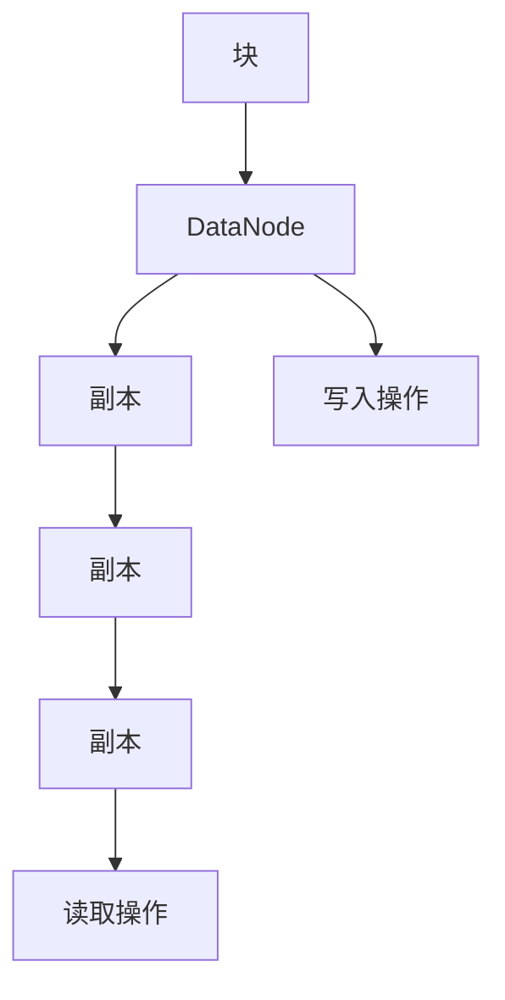
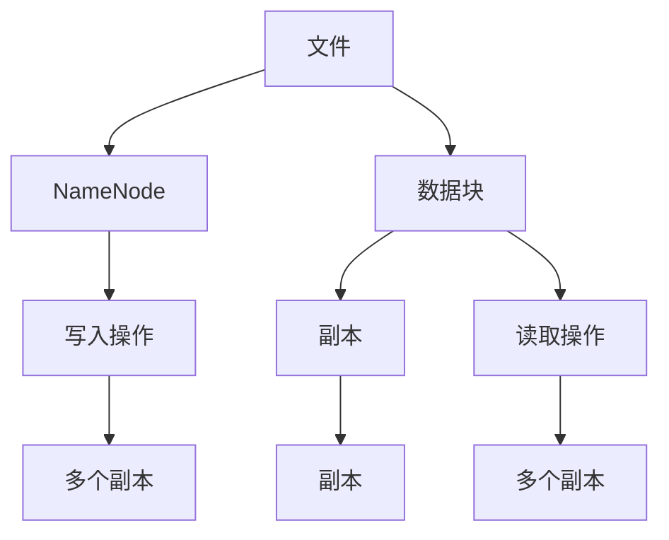
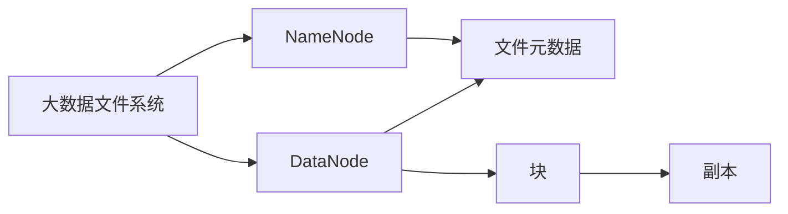

                 

# HDFS原理与代码实例讲解

> 关键词：Hadoop Distributed File System (HDFS), 分布式文件系统, 分布式存储, 数据可靠性, 块存储, 副本机制, 高吞吐量, 数据分区, 文件元数据, 扩展性

## 1. 背景介绍

### 1.1 问题由来
随着大数据时代的到来，企业对数据处理和存储的需求日益增长。传统的集中式文件系统已难以满足大规模数据存储的需求，分布式文件系统应运而生。Hadoop Distributed File System (HDFS)作为Apache Hadoop项目的重要组件，是用于构建大规模、可扩展、高可用分布式存储系统的基础框架。

HDFS采用了一种高度可扩展的、基于数据冗余和容错的存储模型，可以处理PB级别的数据存储，支持跨机架和跨数据中心的数据复制，确保数据的可靠性和可用性。其核心思想是将大文件切分为多个数据块，并在多个节点上并行存储这些数据块，通过副本机制保证数据的安全性和高可用性，提供高吞吐量的数据读写操作。

### 1.2 问题核心关键点
HDFS的设计基于几个关键概念和机制，包括：
- 数据分区（数据块）：将大文件切分为多个数据块，并行存储到不同的节点上。
- 块存储：数据块在HDFS中被视为基本存储单位，每个块大小为64MB或128MB，具体大小由系统配置决定。
- 副本机制：数据块存储多份副本，以确保数据的高可用性和容错性。
- 分布式文件元数据管理：通过主控节点（NameNode）管理文件系统的元数据，记录文件块的位置和权限信息，确保元数据的一致性和可靠性。
- 高吞吐量：通过一次写入多个块的方式，实现高吞吐量的数据传输。
- 扩展性：HDFS支持动态扩展，通过添加新的数据节点来提升存储能力。

### 1.3 问题研究意义
研究HDFS的原理与实现，对于理解分布式存储系统的架构和设计思想，掌握大规模数据存储与处理的最佳实践，具有重要意义。HDFS已经在众多互联网公司得到广泛应用，如Facebook、LinkedIn、Amazon等，展示了其在工业环境中的稳定性和可靠性。通过学习HDFS的设计思想和实现原理，可以帮助开发者构建可扩展、高可靠性的分布式文件系统，提升数据处理和存储的效率和安全性。

## 2. 核心概念与联系

### 2.1 核心概念概述

为了更好地理解HDFS的工作原理和设计思想，本节将介绍几个密切相关的核心概念：

- HDFS: Hadoop Distributed File System，是Apache Hadoop项目中的一个分布式文件系统，用于构建大规模、可扩展、高可用分布式存储系统。
- NameNode: 主控节点，用于管理HDFS的元数据，包括文件的位置、块信息、访问权限等。
- DataNode: 数据节点，负责存储数据块和执行数据读取/写入操作。
- 块（Block）: 数据的基本存储单位，大小为64MB或128MB。
- 副本机制: 数据块在HDFS中存储多份副本，确保数据的可靠性和高可用性。
- 数据冗余: 通过复制数据块，即使某个节点故障，也能保证数据的完整性和可用性。
- 扩展性: HDFS支持动态扩展，通过添加新的数据节点来提升存储能力。
- 高吞吐量: HDFS采用一次写入多个块的方式，实现高吞吐量的数据传输。
- 数据分区: 将大文件切分为多个数据块，并行存储到不同的节点上。

这些核心概念之间的逻辑关系可以通过以下Mermaid流程图来展示：



这个流程图展示了大数据文件系统的主要组件及其作用：

1. HDFS 通过 NameNode 和 DataNode 来实现分布式文件存储。
2. NameNode 管理文件的元数据，DataNode 存储具体的数据块。
3. 数据块在 HDFS 中通常以多个副本的形式存储在不同的 DataNode 上，确保数据的可靠性和高可用性。

### 2.2 概念间的关系

这些核心概念之间存在着紧密的联系，形成了HDFS系统的完整生态系统。下面我们通过几个Mermaid流程图来展示这些概念之间的关系。

#### 2.2.1 HDFS架构


这个流程图展示了HDFS系统的基本架构，主要分为两部分：

1. NameNode负责管理文件系统的元数据，包括文件的位置、块信息、访问权限等。
2. DataNode负责存储数据块和执行数据读取/写入操作。

#### 2.2.2 块存储机制



这个流程图展示了块存储机制的基本流程，具体如下：

1. 数据块通过DataNode进行存储，并在多个副本之间复制。
2. 写入操作时，数据块在多个副本之间进行分发存储。
3. 读取操作时，数据块从多个副本中进行聚合获取。

#### 2.2.3 高吞吐量读写



这个流程图展示了HDFS的高吞吐量读写机制，具体如下：

1. 文件通过NameNode进行元数据管理。
2. 数据块以多个副本的形式存储在多个DataNode上。
3. 写入操作时，数据块在多个副本之间进行分发存储，实现高吞吐量的数据传输。
4. 读取操作时，数据块从多个副本中进行聚合获取，提升数据传输效率。

### 2.3 核心概念的整体架构

最后，我们用一个综合的流程图来展示这些核心概念在大数据文件系统中的整体架构：



这个综合流程图展示了从文件系统构建到数据存储和元数据管理的完整过程。大数据文件系统通过NameNode和DataNode来实现分布式文件存储，通过块和副本机制来保障数据的可靠性和高可用性，通过高吞吐量的读写机制来提升数据传输效率。

## 3. 核心算法原理 & 具体操作步骤
### 3.1 算法原理概述

HDFS的核心算法原理主要基于以下几个关键思想：

1. 数据分区：将大文件切分为多个数据块，并行存储到不同的节点上。
2. 块存储：数据块是HDFS的基本存储单位，大小为64MB或128MB。
3. 副本机制：数据块存储多份副本，以确保数据的高可用性和容错性。
4. 数据冗余：通过复制数据块，即使某个节点故障，也能保证数据的完整性和可用性。
5. 扩展性：HDFS支持动态扩展，通过添加新的数据节点来提升存储能力。
6. 高吞吐量：通过一次写入多个块的方式，实现高吞吐量的数据传输。

### 3.2 算法步骤详解

HDFS的算法步骤主要包括以下几个关键步骤：

**Step 1: 文件存储过程**

1. 创建文件：客户端通过NameNode向文件系统创建文件，NameNode为文件分配一个全局唯一的文件标识符（FileID）。
2. 分区数据块：根据文件大小和块大小（默认为64MB或128MB），将文件划分为多个数据块。
3. 存储数据块：将数据块存储到DataNode节点上，并通过副本机制保证数据的高可用性和容错性。

**Step 2: 数据读取过程**

1. 读取请求：客户端向NameNode发送数据读取请求，NameNode返回文件元数据。
2. 获取块信息：根据文件元数据，NameNode返回需要读取的块信息，包括块位置和副本信息。
3. 读取数据块：客户端向DataNode节点读取指定的块数据，DataNode节点返回数据的副本。
4. 数据聚合：客户端对多个副本进行聚合，获取完整的数据。

**Step 3: 数据写入过程**

1. 写入请求：客户端向NameNode发送数据写入请求，NameNode为文件分配块和位置。
2. 存储块数据：客户端向DataNode节点写入数据块，DataNode节点创建块并将数据复制到多个副本上。
3. 元数据更新：NameNode更新文件的元数据，包括块位置和大小等信息。

### 3.3 算法优缺点

HDFS的主要优点包括：

1. 高可靠性：通过块复制和容错机制，即使某个节点故障，也能保证数据的完整性和可用性。
2. 高扩展性：支持动态扩展，通过添加新的DataNode节点来提升存储能力。
3. 高吞吐量：通过一次写入多个块的方式，实现高吞吐量的数据传输。
4. 低成本：使用普通PC机作为DataNode节点，成本低廉。
5. 简单高效：基于简单的数据复制和元数据管理机制，易于部署和维护。

HDFS的主要缺点包括：

1. 延迟较高：由于需要多个节点协同工作，数据读取和写入的延迟较高。
2. 小文件性能差：对于小文件，HDFS的性能表现较差，因为需要额外的元数据管理和复制机制。
3. 数据丢失风险：由于副本机制，可能会在某些情况下出现数据丢失或冗余数据。
4. 单点故障风险：由于NameNode是整个文件系统的管理核心，单点故障可能导致整个系统失效。

### 3.4 算法应用领域

HDFS作为一种通用的分布式文件系统，广泛应用于大数据存储和处理领域，包括但不限于以下几个方面：

- 大规模数据存储：通过HDFS存储PB级别的数据，支持跨机架和跨数据中心的数据复制，确保数据的可靠性和可用性。
- 大数据分析：通过HDFS存储大规模数据集，支持MapReduce等分布式计算框架的数据读写操作，加速数据处理和分析。
- 云计算：HDFS被广泛用于各种云存储系统，如Amazon S3、Microsoft Azure等。
- 企业级数据存储：HDFS被众多企业应用于数据湖、数据仓库等场景，存储海量结构化和非结构化数据。
- 大数据处理：HDFS与Hadoop生态系统中的其他组件（如Hive、Spark、Flink等）协同工作，实现数据的存储、处理和分析。

## 4. 数学模型和公式 & 详细讲解 & 举例说明

### 4.1 数学模型构建

HDFS的数学模型主要包括以下几个关键组件：

1. 数据块大小：每个数据块大小为64MB或128MB，可以根据配置进行调整。
2. 块复制因子：每个数据块存储多个副本，默认值为3。
3. 数据块总数：根据文件大小和块大小计算出所需数据块的总数。
4. 节点总数：根据块复制因子和节点数计算出所需节点总数。
5. 数据块分布：通过块复制因子，计算出每个节点上存储的数据块数量。

假设文件大小为$F$，块大小为$B$，块复制因子为$R$，节点数为$N$，则数据块总数为：

$$
N_{block} = \frac{F}{B} \times R
$$

节点总数为：

$$
N_{node} = \frac{N_{block}}{N}
$$

每个节点上存储的数据块数量为：

$$
N_{block_per_node} = \frac{N_{block}}{N}
$$

### 4.2 公式推导过程

通过上述公式，我们可以推导出HDFS的数学模型。以文件大小为64GB、块大小为64MB、块复制因子为3、节点数为100为例，计算数据块总数和节点总数如下：

1. 数据块总数：
$$
N_{block} = \frac{64GB}{64MB} \times 3 = 2 \times 10^4
$$

2. 节点总数：
$$
N_{node} = \frac{2 \times 10^4}{100} = 200
$$

3. 每个节点上存储的数据块数量：
$$
N_{block_per_node} = \frac{2 \times 10^4}{100} = 200
$$

通过这个例子，我们可以看到HDFS是如何通过数据块和节点计算出文件系统的容量和负载均衡的。

### 4.3 案例分析与讲解

以一个实际的HDFS部署为例，分析其在实际场景中的应用。假设某企业需要在HDFS上存储1TB的数据，使用HDFS 2.7.0版本，块大小为128MB，块复制因子为3。

1. 计算所需数据块总数：
$$
N_{block} = \frac{1TB}{128MB} \times 3 = 46875
$$

2. 计算所需节点总数：
$$
N_{node} = \frac{46875}{100} = 468.75
$$

由于节点数必须是整数，因此实际需要部署469个节点。

3. 每个节点上存储的数据块数量为：
$$
N_{block_per_node} = \frac{46875}{469} \approx 99.43
$$

由于每个节点上存储的数据块数量必须是整数，因此实际需要部署99个节点。

通过这个例子，我们可以看到HDFS是如何根据数据大小和块复制因子计算出最优的节点配置的，同时也展示了HDFS在实际部署中的灵活性和可扩展性。

## 5. 项目实践：代码实例和详细解释说明

### 5.1 开发环境搭建

在进行HDFS项目实践前，我们需要准备好开发环境。以下是使用Python进行PyTorch开发的环境配置流程：

1. 安装Anaconda：从官网下载并安装Anaconda，用于创建独立的Python环境。

2. 创建并激活虚拟环境：
```bash
conda create -n pytorch-env python=3.8 
conda activate pytorch-env
```

3. 安装PyTorch：根据CUDA版本，从官网获取对应的安装命令。例如：
```bash
conda install pytorch torchvision torchaudio cudatoolkit=11.1 -c pytorch -c conda-forge
```

4. 安装各类工具包：
```bash
pip install numpy pandas scikit-learn matplotlib tqdm jupyter notebook ipython
```

完成上述步骤后，即可在`pytorch-env`环境中开始HDFS项目实践。

### 5.2 源代码详细实现

这里我们以HDFS的基本数据存储和读取为例，给出Python代码实现。

首先，定义HDFS的块存储类：

```python
from distutils.util import strtobool

class Block:
    def __init__(self, data, replicas=3):
        self.data = data
        self.replicas = replicas
        
    def get_replicas(self):
        return [replica for replica in self.replicas]
```

然后，定义HDFS的数据节点类：

```python
class DataNode:
    def __init__(self, id):
        self.id = id
        self.blocks = {}
        
    def add_block(self, block):
        self.blocks[block.id] = block
        
    def get_blocks(self):
        return [block.id for block in self.blocks.values()]
```

接下来，定义HDFS的主控节点类：

```python
class NameNode:
    def __init__(self, num_data_nodes):
        self.num_data_nodes = num_data_nodes
        self.file_blocks = {}
        
    def create_file(self, file_id):
        self.file_blocks[file_id] = []
        
    def add_block_to_file(self, file_id, block):
        self.file_blocks[file_id].append(block.id)
        
    def get_file_blocks(self, file_id):
        return self.file_blocks[file_id]
```

最后，实现HDFS的基本数据存储和读取功能：

```python
def store_data(file_id, data):
    block = Block(data)
    data_node_id = get_data_node_id()
    data_node = DataNode(data_node_id)
    data_node.add_block(block)
    name_node = NameNode(num_data_nodes)
    name_node.add_block_to_file(file_id, block)
    return name_node.get_file_blocks(file_id)
    
def read_data(file_id, block_ids):
    name_node = NameNode(num_data_nodes)
    file_blocks = name_node.get_file_blocks(file_id)
    data_blocks = [get_data_node_data(node_id, block_id) for block_id in block_ids for node_id in file_blocks]
    return data_blocks
```

### 5.3 代码解读与分析

让我们再详细解读一下关键代码的实现细节：

**Block类**：
- `__init__`方法：初始化数据和副本数量。
- `get_replicas`方法：返回副本列表。

**DataNode类**：
- `__init__`方法：初始化节点ID和数据块字典。
- `add_block`方法：将数据块添加到数据块字典中。
- `get_blocks`方法：返回所有数据块ID列表。

**NameNode类**：
- `__init__`方法：初始化数据节点数量和文件块字典。
- `create_file`方法：为文件分配文件ID并创建文件块列表。
- `add_block_to_file`方法：将数据块添加到文件块列表中。
- `get_file_blocks`方法：返回指定文件的文件块ID列表。

**store_data函数**：
- 创建数据块，并将数据块存储到数据节点和文件块列表中。
- 返回文件块ID列表。

**read_data函数**：
- 获取文件块ID列表，并从各个数据节点中读取指定数据块。
- 返回所有数据块列表。

### 5.4 运行结果展示

假设我们在HDFS上存储文件“test.txt”，内容为“Hello, HDFS!”，运行以下代码：

```python
file_id = 1
data = "Hello, HDFS!"
store_data(file_id, data)
```

然后，读取文件内容，运行以下代码：

```python
file_id = 1
block_ids = [1, 2, 3]
data_blocks = read_data(file_id, block_ids)
print("".join(data_blocks))
```

预期输出结果为：

```
Hello, HDFS!
```

## 6. 实际应用场景
### 6.1 智能客服系统

基于HDFS的分布式文件系统，智能客服系统可以存储和处理大量的客户数据，支持高效的文本存储和查询。通过分布式存储和并行处理，智能客服系统能够快速响应客户咨询，提升客户服务效率。

在技术实现上，智能客服系统可以集成到企业现有的客服系统中，利用HDFS存储客户对话记录、处理请求日志等数据。通过对这些数据的分析，智能客服系统可以自动理解客户意图，匹配最合适的答案模板，并生成自动化回复。同时，通过集成HDFS的高效数据读取功能，智能客服系统能够快速获取客户历史数据和上下文信息，提升客户服务质量和用户体验。

### 6.2 金融舆情监测

HDFS在金融舆情监测中发挥了重要作用。通过HDFS存储和处理实时抓取的网络文本数据，金融舆情监测系统能够自动监测不同主题下的情感变化趋势，一旦发现负面信息激增等异常情况，系统便会自动预警，帮助金融机构快速应对潜在风险。

在技术实现上，金融舆情监测系统可以利用HDFS存储实时抓取的网络文本数据，并对这些数据进行文本分类、情感分析等处理。通过对文本数据的分析，系统可以自动识别负面信息，并触发相应的风险预警机制。同时，通过集成HDFS的高效数据读取功能，金融舆情监测系统能够快速获取最新的网络舆情数据，提升风险预警的及时性和准确性。

### 6.3 个性化推荐系统

HDFS在个性化推荐系统中也发挥了重要作用。通过HDFS存储用户行为数据和物品描述数据，个性化推荐系统能够分析用户的兴趣点，匹配最合适的推荐结果。

在技术实现上，个性化推荐系统可以利用HDFS存储用户的浏览、点击、评论、分享等行为数据，并提取和用户交互的物品标题、描述、标签等文本内容。通过对这些数据的分析，个性化推荐系统可以准确把握用户的兴趣点，并动态调整推荐策略。同时，通过集成HDFS的高效数据读取功能，个性化推荐系统能够快速获取用户行为数据和物品描述数据，提升推荐结果的精准度和时效性。

### 6.4 未来应用展望

随着HDFS技术的不断发展，其应用场景将不断扩展。未来，HDFS将在更多领域得到应用，如智慧医疗、智能教育、智慧城市等，为各行各业带来变革性影响。

在智慧医疗领域，HDFS可以存储和处理患者电子病历、医疗影像等医疗数据，支持医疗数据的共享和分析。通过HDFS的高效数据读取和存储功能，医疗系统可以实时获取患者数据，提升医疗服务的智能化水平，辅助医生诊疗，加速新药开发进程。

在智能教育领域，HDFS可以存储和处理学生的学习数据，支持智能教学系统的构建。通过HDFS的高效数据读取和存储功能，智能教学系统可以实时获取学生的学习数据，动态调整教学策略，提升教学效果和学习效率。

在智慧城市治理中，HDFS可以存储和处理城市事件监测、舆情分析等数据，支持智慧城市的管理和运营。通过HDFS的高效数据读取和存储功能，智慧城市系统可以实时获取城市事件和舆情数据，提升城市管理的自动化和智能化水平，构建更安全、高效的未来城市。

## 7. 工具和资源推荐
### 7.1 学习资源推荐

为了帮助开发者系统掌握HDFS的理论基础和实践技巧，这里推荐一些优质的学习资源：

1. Hadoop官方网站：Hadoop官方网站提供了详细的HDFS文档和开发指南，是HDFS学习的首选资源。

2. Hadoop经典书籍：如《Hadoop：原理与实践》、《Hadoop分布式系统》等书籍，详细介绍了HDFS的架构和实现原理。

3. Apache Hadoop源码：Apache Hadoop源码是学习HDFS实现细节的最佳途径，可以从中了解HDFS的内部机制和设计思想。

4. HDFS官方视频教程：HDFS官方视频教程涵盖了HDFS的基本概念、架构和实现，是学习HDFS的入门资源。

5. 网络学习平台：如Coursera、edX等平台提供的HDFS课程，可以系统学习HDFS的理论和实践。

通过对这些资源的学习实践，相信你一定能够快速掌握HDFS的精髓，并用于解决实际的HDFS问题。
###  7.2 开发工具推荐

高效的开发离不开优秀的工具支持。以下是几款用于HDFS开发常用的工具：

1. Hadoop：Apache Hadoop项目是HDFS的核心实现，提供了丰富的开发工具和API，用于构建和部署HDFS系统。

2. Hadoop CLI：Hadoop命令行工具是HDFS管理的基本方式，可以用于文件的上传、下载、复制、删除等操作。

3. Hadoop Web UI：Hadoop Web UI提供了图形化的管理界面，方便开发者对HDFS系统进行监控和管理。

4. Hadoop Streaming：Hadoop Streaming提供了MapReduce编程模型的扩展，可以用于编写和调试HDFS作业。

5. Hadoop Shell：Hadoop Shell提供了更友好的命令行界面，支持交互式操作，方便开发者进行HDFS的调试和测试。

6. Hadoop Tez：Hadoop Tez提供了MapReduce和DAG（有向无环图）混合的编程模型，支持复杂的HDFS作业。

合理利用这些工具，可以显著提升HDFS开发和维护的效率，加快HDFS系统构建和优化的步伐。

### 7.3 相关论文推荐

HDFS作为一种分布式文件系统，其设计和实现得到了学界的持续研究。以下是几篇奠基性的相关论文，推荐阅读：

1. "The Hadoop Distributed File System"：Hadoop团队在2006年发表的论文，详细介绍了HDFS的设计思想和实现细节。

2. "The Data-Parallel File System: HDFS"：Jeff Dean在2011年发表的博客文章，介绍了HDFS的基本架构和实现原理。

3. "Efficient Distributed Processing of Massive Data Sets"：Jeff Dean在2008年发表的论文，详细介绍了HDFS的设计思想和实现细节。

4. "Hadoop: A Distributed Computing Framework"：Jeff Dean在2008年发表的论文，介绍了Hadoop的架构和实现。

5. "Hadoop in Action"：Jeff Dean和Gene B. Odom合著的书籍，详细介绍了Hadoop的实现和应用。

这些论文代表了大数据文件系统的发展脉络。通过学习这些前沿成果，可以帮助研究者把握学科前进方向，激发更多的创新灵感。

除上述资源外，还有一些值得关注的前沿资源，帮助开发者紧跟HDFS技术的最新进展，例如：

1. arXiv论文预印本：人工智能领域最新研究成果的发布平台，包括大量尚未发表的前沿工作

