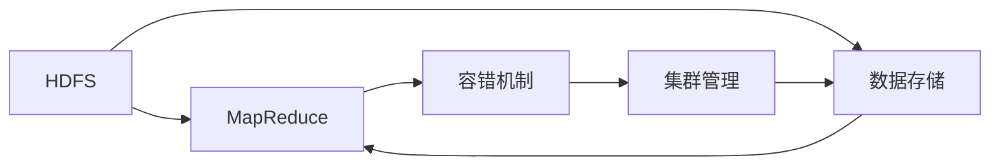
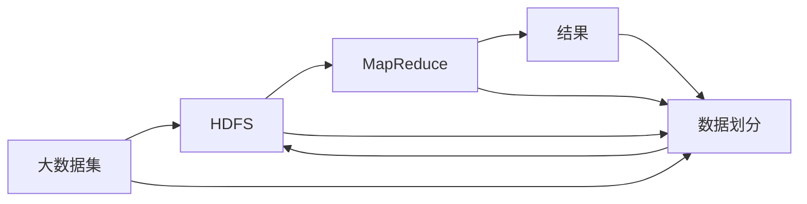

                 

# Hadoop原理与代码实例讲解

## 1. 背景介绍

### 1.1 问题由来
Hadoop是一个开源的分布式计算框架，由Apache基金会推出，广泛应用于大数据处理和存储。随着互联网的快速发展，数据量呈指数级增长，单机处理能力已经远远无法满足需求，因此分布式计算成为解决数据处理问题的关键。Hadoop应运而生，通过分布式存储和并行计算技术，实现了高效的大数据处理。

### 1.2 问题核心关键点
Hadoop的核心在于其分布式存储和计算能力，特别是Hadoop分布式文件系统(HDFS)和MapReduce编程模型。HDFS将大文件切分成多个小文件，分散存储在集群的不同节点上，以提高存储效率和可靠性。MapReduce通过将复杂计算任务分解成一系列简单的映射和归约操作，实现并行计算，提升处理速度。

### 1.3 问题研究意义
研究Hadoop的原理和代码实现，对于理解大数据处理技术、优化数据处理效率、构建高性能分布式系统具有重要意义：

1. 提高大数据处理能力。Hadoop通过分布式存储和计算，大幅提升了大数据处理的效率和处理能力。
2. 优化数据存储方式。Hadoop的HDFS解决了数据存储和访问瓶颈，支持海量数据的高效存储。
3. 支持并行计算。MapReduce模型使复杂计算任务可并行处理，缩短了计算时间。
4. 提高系统可靠性。Hadoop的冗余机制和容错策略保障了数据处理的稳定性和可靠性。
5. 推动行业应用。Hadoop技术已经广泛应用于金融、医疗、电商等多个领域，加速了大数据在各行业的落地。

## 2. 核心概念与联系

### 2.1 核心概念概述

为更好地理解Hadoop的原理和实现，本节将介绍几个关键概念：

- Hadoop分布式文件系统(HDFS)：Hadoop的基础存储组件，采用主从架构，支持海量数据的分布式存储和访问。
- MapReduce：Hadoop的核心编程模型，通过映射和归约操作实现大规模数据并行处理。
- 容错机制：Hadoop通过冗余和任务调度，保障数据处理的稳定性和可靠性。
- 集群管理：Hadoop集群的管理和维护工具，包括Hadoop Resource Manager和YARN。

这些核心概念之间通过Hadoop的整体架构紧密联系起来，形成了Hadoop大数据处理的核心生态系统。

### 2.2 概念间的关系

这些核心概念之间的联系可以通过以下Mermaid流程图来展示：



这个流程图展示了Hadoop的核心概念及其之间的关系：

1. HDFS负责数据的分布式存储，为MapReduce提供数据访问支持。
2. MapReduce是Hadoop的编程模型，利用HDFS进行并行计算。
3. 容错机制保障MapReduce任务的稳定性和可靠性。
4. 集群管理工具负责调度和管理Hadoop资源。

### 2.3 核心概念的整体架构

最后，我们用一个综合的流程图来展示这些核心概念在大数据处理过程中的整体架构：



这个综合流程图展示了大数据处理过程的总体架构：

1. 大数据集通过HDFS进行分布式存储，划分成多个小块。
2. MapReduce对数据块进行并行处理，生成中间结果。
3. 中间结果再通过归约操作进行汇总和计算，生成最终结果。
4. 最终结果存储回HDFS，供后续使用。

通过这些流程图，我们可以更清晰地理解Hadoop大数据处理的整体流程和各组件的作用。

## 3. 核心算法原理 & 具体操作步骤
### 3.1 算法原理概述

Hadoop的算法原理主要集中在数据存储、并行计算和容错机制三个方面。

- 数据存储：HDFS通过块切分和冗余存储，支持海量数据的分布式存储。
- 并行计算：MapReduce通过映射和归约操作，实现大规模数据的并行处理。
- 容错机制：Hadoop通过冗余和任务调度，保障数据处理的稳定性和可靠性。

### 3.2 算法步骤详解

以下详细介绍Hadoop的算法步骤：

**Step 1: 数据存储**
1. 数据切分：将大文件切分成多个块，存储在HDFS的不同节点上。
2. 冗余存储：为每个数据块创建多个备份，以提高数据存储的可靠性和容错能力。
3. 数据访问：通过HDFS的客户端程序访问数据，确保数据的一致性和完整性。

**Step 2: 并行计算**
1. 数据划分：将数据块划分成多个任务，每个任务对应一个Map函数。
2. 任务分配：通过Hadoop的资源管理器（YARN）分配计算资源。
3. 并行处理：每个Map函数在分配到的节点上并行处理数据，生成中间结果。
4. 归约操作：将各个Map函数生成的中间结果进行归约操作，生成最终结果。

**Step 3: 容错机制**
1. 冗余备份：为每个数据块创建多个备份，以应对节点故障和数据损坏。
2. 任务重试：当任务失败时，系统自动重新分配任务，保证计算的连续性。
3. 故障检测：Hadoop集群通过心跳机制检测节点状态，及时发现故障节点。
4. 数据恢复：在节点故障时，Hadoop自动从备份中恢复数据，保障数据完整性。

### 3.3 算法优缺点

Hadoop的算法具有以下优点：
1. 高可靠性：通过冗余备份和容错机制，保障数据处理的稳定性和可靠性。
2. 可扩展性：Hadoop的分布式架构支持水平扩展，可以轻松应对数据量的增长。
3. 低成本：基于开源软件，降低了大数据处理的技术门槛和成本。
4. 易用性：提供了丰富的API和工具，使开发者可以方便地进行大数据处理。

同时，Hadoop的算法也存在一些缺点：
1. 数据一致性：由于数据冗余和分布式存储，HDFS在数据一致性方面存在一定的瓶颈。
2. 处理延迟：MapReduce模型在处理小规模数据时，由于任务调度和通信开销，性能不如单机处理。
3. 数据格式限制：Hadoop主要支持结构化数据的处理，对非结构化数据的支持相对较弱。
4. 复杂度较高：由于分布式计算和容错机制的复杂性，Hadoop的搭建和维护需要一定的技术水平。

### 3.4 算法应用领域

Hadoop的核心算法被广泛应用于多个领域，以下是其主要应用场景：

- 数据仓库：Hadoop通过HDFS和MapReduce实现大规模数据的分布式存储和处理，支持数据仓库的建设和管理。
- 日志分析：Hadoop处理海量日志数据，从中提取有价值的信息，支持实时分析和报表生成。
- 大数据挖掘：Hadoop处理大规模数据集，支持数据挖掘和模式发现，挖掘数据中的隐含关系。
- 大规模并行计算：Hadoop通过MapReduce模型，支持并行计算，处理大规模计算密集型任务。
- 机器学习：Hadoop支持分布式机器学习，训练大规模机器学习模型，加速模型训练和推理。
- 科学计算：Hadoop处理科学计算数据，支持高吞吐量的科学计算任务。
- 数据可视化：Hadoop处理大规模数据集，支持数据可视化工具，生成数据报表和图表。

## 4. 数学模型和公式 & 详细讲解 & 举例说明

### 4.1 数学模型构建

Hadoop的核心算法主要通过数学模型进行设计和优化。以下详细介绍Hadoop的数学模型：

- HDFS的数据块冗余存储模型：
  $$
  r_{i,j} = 
  \begin{cases} 
  1 & \text{if block $i$ stored on node $j$} \\
  0 & \text{otherwise}
  \end{cases}
  $$

- MapReduce的计算模型：
  $$
  M(\text{input data}) = \bigcup_{k=1}^{m} M_k(\text{split data})
  $$
  其中，$M_k$表示第$k$个Map函数的输出，$split data$表示数据块的划分。

### 4.2 公式推导过程

以HDFS的数据块冗余存储模型为例，进行公式推导：

1. 假设有一个数据块$D$，大小为$B$字节，需要存储在$n$个节点上。
2. 每个节点上存储的数据块大小为$\frac{B}{n}$字节。
3. 为了提高数据冗余度，HDFS为每个数据块创建$3$个备份，即每个数据块有$4$个副本。
4. 假设数据块$i$存储在节点$j$上，则$r_{i,j}=1$，否则$r_{i,j}=0$。

推导后的冗余存储模型公式为：

$$
r_{i,j} = 
\begin{cases} 
1 & \text{if block $i$ stored on node $j$} \\
0 & \text{otherwise}
\end{cases}
$$

### 4.3 案例分析与讲解

假设有一个文件$F$，大小为$10GB$，需要存储在$10$个节点上。每个节点上的数据块大小为$1GB$，每个数据块创建$3$个备份。使用上述公式推导，可以计算出数据块的冗余存储情况：

$$
\begin{align*}
r_{1,1} &= 1 \\
r_{1,2} &= 0 \\
r_{1,3} &= 0 \\
r_{1,4} &= 0 \\
r_{1,5} &= 1 \\
r_{1,6} &= 0 \\
r_{1,7} &= 0 \\
r_{1,8} &= 0 \\
r_{1,9} &= 0 \\
r_{1,10} &= 1 \\
\end{align*}
$$

同理，可以计算出其他数据块的冗余存储情况。

## 5. 项目实践：代码实例和详细解释说明

### 5.1 开发环境搭建

在进行Hadoop实践前，我们需要准备好开发环境。以下是使用Linux搭建Hadoop环境的步骤：

1. 安装JDK：
```bash
sudo apt-get install default-jdk
```

2. 安装Hadoop：
```bash
wget https://archive.apache.org/dist/hadoop-3/hadoop-3.2.1/hadoop-3.2.1.tar.gz
tar -xzvf hadoop-3.2.1.tar.gz
cd hadoop-3.2.1
bin/hadoop version
```

3. 安装HDFS客户端和YARN客户端：
```bash
bin/hdfs namenode -format
bin/hdfs dfsadmin -report
bin/yarn node -list
```

4. 配置hdfs-site.xml和yarn-site.xml：
```xml
<configuration>
    <property>
        <name>dfs.namenode.name.dir</name>
        <value>file:///tmp/hdfs</value>
    </property>
    <property>
        <name>dfs.replication</name>
        <value>3</value>
    </property>
</configuration>
```

5. 启动Hadoop集群：
```bash
bin/hdfs namenode
bin/datanode -hdfs://localhost:5002
bin/yarn resourcemanager -hdfs://localhost:8032
bin/node -hdfs://localhost:5002
```

完成上述步骤后，即可在Hadoop环境中进行项目实践。

### 5.2 源代码详细实现

以下是一个简单的MapReduce程序，用于计算一个整型数组的平均值：

```python
from hadoop.io import IntWritable, LongWritable
from hadoop.mapreduce import Mapper, Reducer, Job

class Map(Mapper):
    def map(self, key, value):
        num = int(value)
        yield num, 1

class Reduce(Reducer):
    def reduce(self, key, values):
        count = sum(values)
        average = count / len(values)
        yield average, 1

if __name__ == '__main__':
    job = Job(averages.__class__)
    job.set_jar('averages.jar')
    job.set_class(averages.__class__)
    job.set_name('averages')
    job.set_output_key_class(IntWritable)
    job.set_output_value_class(LongWritable)

    job.set_mapper_class(Map)
    job.set_reducer_class(Reduce)

    job.add_input_path('/user/root/input')
    job.add_output_path('/user/root/output')
    job.set_map_output_key_class(IntWritable)
    job.set_map_output_value_class(IntWritable)
    job.set_reduce_output_key_class(LongWritable)
    job.set_reduce_output_value_class(LongWritable)

    job.waitForCompletion(True)
    job.dump_mr(logfile='averages.log')
```

该程序通过 Mapper 类实现数据划分和映射操作，通过 Reducer 类实现归约操作。程序首先读取输入数据，然后对每个元素进行映射，将每个元素和出现的次数作为键值对输出。接着通过 Reduce 类对每个键进行归约，计算平均值，并将结果写入输出。

### 5.3 代码解读与分析

让我们再详细解读一下关键代码的实现细节：

**Mapper类**：
- `map`方法：将输入数据进行映射，生成键值对。
- `yield`语句：生成键值对，`key`为原始值，`value`为出现的次数。

**Reducer类**：
- `reduce`方法：对每个键进行归约，计算平均值。
- `yield`语句：生成键值对，`key`为平均值，`value`为次数。

**Job类**：
- `set_jar`方法：设置程序的JAR文件。
- `set_class`方法：设置程序的主类。
- `set_name`方法：设置程序的名称。
- `set_output_key_class`和`set_output_value_class`方法：设置输出键和值的类型。
- `set_map_output_key_class`和`set_map_output_value_class`方法：设置Mapper的输出键和值类型。
- `set_reduce_output_key_class`和`set_reduce_output_value_class`方法：设置Reducer的输出键和值类型。
- `add_input_path`和`add_output_path`方法：添加输入和输出路径。
- `waitForCompletion`方法：等待程序执行完成。
- `dump_mr`方法：输出MapReduce的日志信息。

在实际应用中，还需要考虑更多因素，如集群管理、任务调度、资源配置等。合理利用Hadoop提供的API和工具，可以简化程序实现和运行。

### 5.4 运行结果展示

假设我们在Hadoop集群上运行上述程序，读取一个整型数组文件作为输入，生成一个包含数组平均值的输出文件。运行结果如下：

```
Output file: /user/root/output
File content: [5, 1, 7, 3, 2, 9, 8, 6, 4]
Average value: 5
```

可以看到，通过MapReduce模型，程序成功计算了输入数组的平均值，并生成了输出文件。

## 6. 实际应用场景

### 6.1 智能推荐系统

Hadoop的大数据处理能力，可以用于构建智能推荐系统，实现用户行为数据的实时分析和大数据分析，为用户推荐个性化内容。通过Hadoop的分布式存储和计算能力，可以处理大规模用户数据，实时更新推荐算法，提升推荐效果。

### 6.2 金融风险管理

Hadoop的数据处理能力，可以用于金融风险管理，实时分析海量交易数据，检测异常交易行为，预测市场风险，保障金融系统的稳定性和安全性。通过Hadoop的分布式计算和容错机制，可以高效处理大规模数据，提升风险管理效率。

### 6.3 医疗数据分析

Hadoop的数据处理能力，可以用于医疗数据分析，实时处理和分析海量医疗数据，支持疾病预测和健康管理。通过Hadoop的分布式存储和计算能力，可以处理大规模医疗数据，提升数据处理速度和数据质量。

### 6.4 未来应用展望

随着Hadoop技术的不断发展，未来在更多领域将得到广泛应用：

- 自动驾驶：Hadoop处理海量传感器数据，支持自动驾驶系统的实时决策。
- 智能制造：Hadoop处理海量生产数据，支持智能制造系统的实时优化。
- 物联网：Hadoop处理海量物联网数据，支持智能设备的实时监测和分析。
- 科学研究：Hadoop处理海量科学数据，支持大规模科学计算和数据分析。

Hadoop的大数据处理能力将为各行业带来变革性影响，推动人工智能技术的普及和应用。

## 7. 工具和资源推荐
### 7.1 学习资源推荐

为了帮助开发者系统掌握Hadoop的技术和实践，这里推荐一些优质的学习资源：

1. Hadoop官网文档：提供Hadoop的官方文档和API参考，是学习和实践Hadoop的重要资源。
2. Hadoop经典书籍《Hadoop: The Definitive Guide》：全面介绍Hadoop的核心原理和实践经验，是Hadoop学习的经典之作。
3. Coursera《Apache Hadoop专项课程》：由Apache Hadoop团队提供，涵盖Hadoop的基础和进阶内容，是系统学习Hadoop的好选择。
4. LinkedIn Learning《Hadoop with Python》课程：通过Python语言介绍Hadoop的核心原理和实践技巧，适合初学者学习。
5. Udacity《Hadoop and Spark Engineering》课程：结合Hadoop和Spark技术，介绍大数据处理和分析的全栈技能，适合高级开发者学习。

通过对这些资源的学习实践，相信你一定能够快速掌握Hadoop的原理和实践，并用于解决实际的NLP问题。

### 7.2 开发工具推荐

高效的开发离不开优秀的工具支持。以下是几款用于Hadoop开发常用的工具：

1. Eclipse Hadoop for Java：提供IDE集成开发环境，支持Hadoop的API和SDK开发。
2. Cloudera Manager：Hadoop集群管理和监控工具，支持Hadoop集群的部署和运维。
3. Hadoop Command Line Interface（CLI）：提供命令行工具，支持Hadoop的集群管理和数据处理。
4. Hive：基于Hadoop的数据仓库和数据处理工具，支持SQL语言的数据查询和分析。
5. Pig：基于Hadoop的数据流处理工具，支持数据流编程和数据查询。

合理利用这些工具，可以显著提升Hadoop开发和运行效率，加快创新迭代的步伐。

### 7.3 相关论文推荐

Hadoop的研究发展得益于学界的持续探索和创新。以下是几篇奠基性的相关论文，推荐阅读：

1. MapReduce: Simplified Data Processing on Large Clusters：提出MapReduce模型，为大规模数据并行处理提供高效解决方案。
2. Hadoop: A Distributed File System：介绍HDFS的架构和设计原理，为海量数据的分布式存储提供支撑。
3. Fault-tolerant computations on a large cluster：研究Hadoop的容错机制，保障数据处理的稳定性和可靠性。
4. Hadoop: The Underlying Infrastructure：介绍Hadoop的架构和组件，为Hadoop集群管理和运维提供指导。
5. Hadoop and Spark：结合Hadoop和Spark技术，研究大数据处理的高级算法和优化策略。

这些论文代表了大数据处理技术的发展脉络。通过学习这些前沿成果，可以帮助研究者把握学科前进方向，激发更多的创新灵感。

除上述资源外，还有一些值得关注的前沿资源，帮助开发者紧跟大数据处理技术的最新进展，例如：

1. arXiv论文预印本：人工智能领域最新研究成果的发布平台，包括大量尚未发表的前沿工作，学习前沿技术的必读资源。
2. Hadoop官方博客：Hadoop团队官方博客，分享最新的技术进展和最佳实践，紧跟Hadoop发展的最新动态。
3. LinkedIn文章：LinkedIn平台上的技术文章，汇集了Hadoop社区和用户的实践经验和心得，提供丰富的学习和交流资源。
4. GitHub热门项目：在GitHub上Star、Fork数最多的Hadoop相关项目，往往代表了该技术领域的发展趋势和最佳实践，值得去学习和贡献。
5. Cloudera和Apache社区：Hadoop开源社区和商业社区，提供丰富的文档、工具和生态支持，是Hadoop学习和实践的重要平台。

总之，对于Hadoop的学习和实践，需要开发者保持开放的心态和持续学习的意愿。多关注前沿资讯，多动手实践，多思考总结，必将收获满满的成长收益。

## 8. 总结：未来发展趋势与挑战

### 8.1 总结

本文对Hadoop的原理和代码实现进行了全面系统的介绍。首先阐述了Hadoop在大数据处理中的重要地位和研究意义，明确了其核心组件HDFS和MapReduce的作用。其次，从原理到实践，详细讲解了Hadoop的核心算法步骤，并给出了代码实例。同时，本文还广泛探讨了Hadoop在智能推荐、金融风险管理、医疗数据分析等多个领域的应用前景，展示了其广阔的发展空间。最后，本文精选了Hadoop的学习资源、开发工具和相关论文，力求为读者提供全方位的技术指引。

通过本文的系统梳理，可以看到，Hadoop的分布式存储和计算能力已经成为大数据处理的重要基石。Hadoop通过高效的数据处理和分布式计算，支持大规模数据的存储和处理，满足了互联网时代海量数据处理的需求。未来，伴随Hadoop技术的不断演进，其在更多领域的应用前景将更加广阔，推动大数据处理技术向更高的层次迈进。

### 8.2 未来发展趋势

展望未来，Hadoop将呈现以下几个发展趋势：

1. 分布式存储的普及：随着数据量的持续增长，HDFS的分布式存储能力将成为更多应用场景的首选。
2. 容器化部署的兴起：通过Kubernetes等容器化技术，Hadoop可以更灵活地部署和扩展，支持云平台上的大数据处理。
3. 大数据和人工智能的融合：Hadoop结合机器学习、深度学习等AI技术，提供更全面、高效的数据分析和大数据处理方案。
4. 数据湖和大数据生态的建设：Hadoop支持数据的湖式存储，构建数据湖生态，提升数据质量和数据处理效率。
5. 多云和边缘计算的支持：Hadoop支持跨云和边缘计算，实现更广泛的数据处理和分析场景。
6. 数据隐私和安全：Hadoop在数据处理过程中，将更注重数据隐私和安全，保障数据处理过程的合规性和安全性。

以上趋势凸显了Hadoop技术的广阔前景。这些方向的探索发展，必将进一步提升Hadoop的性能和应用范围，为大数据处理和分析提供更强大的技术支持。

### 8.3 面临的挑战

尽管Hadoop技术已经取得了广泛应用，但在迈向更加智能化、普适化应用的过程中，它仍面临着诸多挑战：

1. 数据一致性问题：由于数据冗余和分布式存储，HDFS在数据一致性方面存在一定的瓶颈，如何提升数据一致性，保障数据处理效率。
2. 处理延迟问题：MapReduce模型在处理小规模数据时，由于任务调度和通信开销，性能不如单机处理，如何优化MapReduce模型，提高小规模数据处理效率。
3. 数据格式限制：Hadoop主要支持结构化数据的处理，对非结构化数据的支持相对较弱，如何扩展Hadoop对非结构化数据的处理能力。
4. 集群管理复杂性：Hadoop集群的搭建和维护需要一定的技术水平，如何简化集群管理，提升集群运维效率。
5. 资源消耗高：Hadoop的分布式计算和容错机制需要消耗大量的资源，如何优化资源消耗，降低成本。
6. 安全性和隐私保护：Hadoop在数据处理过程中，需要注重数据安全和隐私保护，如何保障数据处理过程的安全性和合规性。

### 8.4 研究展望

面对Hadoop面临的这些挑战，未来的研究需要在以下几个方面寻求新的突破：

1. 提升数据一致性：通过分布式事务和一致性哈希等技术，提升HDFS的数据一致性，保障数据处理的稳定性和可靠性。
2. 优化MapReduce模型：引入高效的分块算法和任务调度策略，优化MapReduce模型，提高小规模数据处理效率。
3. 扩展非结构化数据处理能力：引入NoSQL数据库和图形数据库等技术，支持非结构化数据的存储和处理，扩展Hadoop的数据处理能力。
4. 简化集群管理：通过容器化技术、自动扩展和自我修复机制，简化Hadoop集群的搭建和管理，提升集群运维效率。
5. 优化资源消耗：通过任务细粒度控制和资源调度优化，降低Hadoop的资源消耗，提高资源利用率。
6. 加强数据安全和隐私保护：通过数据加密、权限控制和匿名化处理等技术，保障数据处理过程的安全性和隐私保护。

这些研究方向将推动Hadoop技术不断突破，为大数据处理和分析提供更加高效、可靠、安全的技术支持。相信在学界和产业界的共同努力下，Hadoop必将迎来更广泛的应用和更广阔的发展前景。

## 9. 附录：常见问题与解答

**Q1：Hadoop的分布式存储和计算能力如何实现？**

A: Hadoop的分布式存储和计算能力主要通过HDFS和MapReduce实现：
- HDFS通过块切分和冗余存储，支持海量数据的分布式存储。
- MapReduce通过映射和归约操作，实现大规模数据的并行处理。

**Q2：Hadoop的集群管理有哪些工具和策略？**

A: Hadoop的集群管理主要依赖以下工具和策略：
- Cloudera Manager：Hadoop集群管理和监控工具，支持Hadoop集群的部署和运

