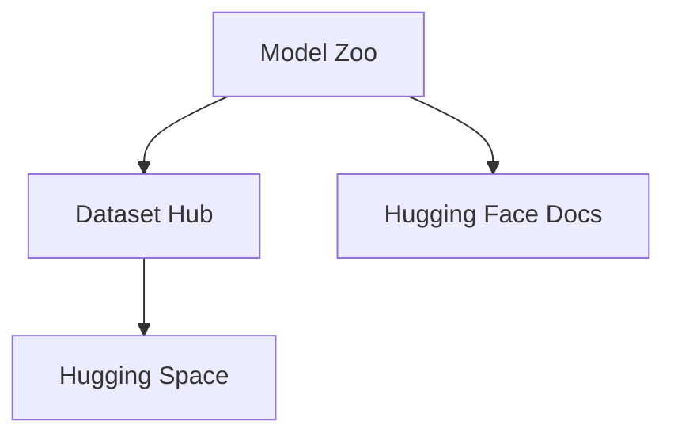

                 

# Hugging Face 开源社区：Models、Datasets、Spaces、Docs

> 关键词：Hugging Face, 开源社区, Model Zoo, 数据集, Dataset Hub, Hugging Space, Hugging Face Docs

## 1. 背景介绍

### 1.1 问题由来

近年来，随着人工智能的迅猛发展，深度学习模型在各行各业的应用越来越广泛。然而，深度学习模型的训练和部署都需要大量的计算资源和专业知识，普通人很难直接使用。为了解决这个问题，开源社区应运而生，旨在提供一个开放的平台，让所有人都能方便地使用深度学习技术。

Hugging Face 是近年来异军突起的人工智能开源社区，致力于构建一个开放、协作、共享的深度学习模型生态系统。其提供的 Model Zoo、Dataset Hub、Hugging Space 和 Hugging Face Docs 等工具，极大地促进了深度学习模型的研究和应用。

### 1.2 问题核心关键点

Hugging Face 开源社区的核心在于其丰富的资源和工具，为深度学习模型的开发和部署提供了极大便利。本文将详细介绍 Hugging Face 提供的四个重要资源：Model Zoo、Dataset Hub、Hugging Space 和 Hugging Face Docs，并探讨其核心概念和应用场景。

## 2. 核心概念与联系

### 2.1 核心概念概述

- **Model Zoo**：Hugging Face 提供的预训练深度学习模型库，包含了大量在各种任务上训练好的模型。
- **Dataset Hub**：Hugging Face 提供的大型、高品质的数据集，包含各种领域的语料库和标注数据。
- **Hugging Space**：Hugging Face 提供的模型架构和容器，支持模型的快速部署和应用。
- **Hugging Face Docs**：Hugging Face 提供的深度学习模型和工具的详细文档，帮助开发者快速上手。

这四个资源共同构成了 Hugging Face 开源社区的基础设施，为深度学习模型的研究和应用提供了全面的支持。

### 2.2 概念间的关系

这些资源之间的关系可以通过以下 Mermaid 流程图来展示：



这个流程图展示了 Hugging Face 提供的四个核心资源之间的关系：

1. Model Zoo 依赖 Dataset Hub 的数据资源进行模型训练和微调。
2. Hugging Space 支持 Model Zoo 和 Dataset Hub 模型的部署和应用。
3. Hugging Face Docs 为 Model Zoo、Dataset Hub 和 Hugging Space 提供了详细的文档和教程，帮助开发者快速上手。

通过这些资源的相互配合，Hugging Face 开源社区能够更好地支持深度学习模型的开发和应用。

## 3. 核心算法原理 & 具体操作步骤

### 3.1 算法原理概述

Hugging Face 提供的深度学习模型大多基于 Transformer 架构，利用自监督学习的方式在大规模语料上进行预训练。预训练模型的目标是学习语言的基本结构和语法规则，从而能够在下游任务上进行微调，适应特定的应用场景。

### 3.2 算法步骤详解

以 BERT 模型为例，其训练过程分为两步：

1. 自监督预训练：在无标注数据上进行预训练，学习语言的基本结构和语法规则。
2. 下游任务微调：在有标注数据上进行微调，学习特定任务的知识和技能。

具体的训练步骤包括：

1. 收集大规模语料数据，并进行数据预处理，包括分词、标记等。
2. 构建自监督学习任务，如语言模型任务、掩码语言模型任务等。
3. 使用预训练模型进行前向传播，计算损失函数。
4. 反向传播计算梯度，更新模型参数。
5. 重复上述步骤，直至收敛。

### 3.3 算法优缺点

Hugging Face 提供的深度学习模型具有以下优点：

1. 预训练模型在大规模语料上进行了训练，具有强大的语言理解能力。
2. 模型参数众多，可以进行微调以适应特定任务。
3. 支持多种任务，包括文本分类、情感分析、机器翻译等。

然而，这些模型也存在一些缺点：

1. 需要大量计算资源进行预训练。
2. 模型较大，部署和应用时可能面临内存和计算资源不足的问题。
3. 微调时需要大量标注数据，成本较高。

### 3.4 算法应用领域

Hugging Face 提供的深度学习模型已经在自然语言处理（NLP）、计算机视觉（CV）、语音识别（ASR）等多个领域得到了广泛应用。例如，在 NLP 领域，BERT、GPT-2、T5 等模型被广泛应用于文本分类、情感分析、机器翻译、命名实体识别等任务。

## 4. 数学模型和公式 & 详细讲解

### 4.1 数学模型构建

以 BERT 为例，其数学模型构建分为预训练和微调两个阶段。

#### 4.1.1 预训练模型

BERT 的预训练模型是一个 Transformer 模型，包含多层的自注意力机制和全连接层。其目标是在大规模无标注数据上进行自监督学习，学习语言的基本结构和语法规则。

#### 4.1.2 下游任务微调模型

下游任务微调模型是在预训练模型的基础上，添加特定的输出层和损失函数，学习特定任务的知识和技能。

#### 4.1.3 数学符号

- $x$：输入序列，由多个 token 组成。
- $M_{\theta}$：预训练模型，其中 $\theta$ 为模型参数。
- $y$：输出序列，由多个 token 组成。
- $L(y,\hat{y})$：输出序列 $y$ 与模型输出 $\hat{y}$ 之间的损失函数。

### 4.2 公式推导过程

以 BERT 的预训练过程为例，其目标是最小化损失函数：

$$
\mathcal{L}(\theta) = \frac{1}{N}\sum_{i=1}^N L(y_i,M_{\theta}(x_i))
$$

其中 $N$ 为样本数量，$x_i$ 为第 $i$ 个输入序列，$y_i$ 为第 $i$ 个输出序列。

通过反向传播算法，可以计算出模型参数 $\theta$ 的梯度，并使用优化算法（如 Adam）更新模型参数。

### 4.3 案例分析与讲解

以 BERT 的微调过程为例，其目标是在下游任务上进行微调，学习特定任务的知识和技能。假设任务为情感分类，其数学模型构建如下：

1. 输入序列 $x$ 包含多个 token，输出序列 $y$ 为情感标签（如正面、负面、中性）。
2. 在预训练模型 $M_{\theta}$ 的顶部添加一个全连接层，用于输出情感分类结果。
3. 定义交叉熵损失函数：
   $$
   L(y,\hat{y}) = -\frac{1}{N}\sum_{i=1}^N \sum_{j=1}^M y_{ij}\log \hat{y}_{ij}
   $$
   其中 $M$ 为分类数。
4. 使用 Adam 优化算法，最小化损失函数，更新模型参数。

## 5. 项目实践：代码实例和详细解释说明

### 5.1 开发环境搭建

Hugging Face 提供了丰富的工具和库，方便开发者进行深度学习模型的开发和部署。以下是使用 PyTorch 和 Hugging Face 工具进行 BERT 情感分类任务开发的示例：

1. 安装 PyTorch：
   ```bash
   pip install torch torchtext transformers
   ```

2. 安装 Hugging Face 库：
   ```bash
   pip install transformers
   ```

3. 安装 Hugging Face Dataset Hub：
   ```bash
   pip install datasets
   ```

### 5.2 源代码详细实现

以下是一个简单的 BERT 情感分类示例代码：

```python
from transformers import BertTokenizer, BertForSequenceClassification
from datasets import load_dataset
from transformers import AdamW

# 加载数据集
dataset = load_dataset('imdb', split='train', tokenizer_name='bert-base-uncased', return_dict=True)

# 加载 BERT 模型
model = BertForSequenceClassification.from_pretrained('bert-base-uncased', num_labels=2)

# 定义优化器
optimizer = AdamW(model.parameters(), lr=2e-5)

# 定义评估函数
def evaluate(model, dataset):
    evaluation = model.eval()
    with torch.no_grad():
        results = evaluation(input_ids, attention_mask=attention_mask, labels=labels)
        print(f"Accuracy: {results.accuracy:.2f}")

# 训练模型
for epoch in range(3):
    for batch in dataset:
        inputs = batch['input_ids'].to(device)
        attention_mask = batch['attention_mask'].to(device)
        labels = batch['labels'].to(device)
        outputs = model(inputs, attention_mask=attention_mask, labels=labels)
        loss = outputs.loss
        optimizer.zero_grad()
        loss.backward()
        optimizer.step()
```

### 5.3 代码解读与分析

在上述示例代码中，我们首先使用 Hugging Face Dataset Hub 加载了 IMDB 数据集，并将其预处理成模型所需的格式。接着，我们使用 BERT 模型进行情感分类任务的微调，并定义了优化器和评估函数。在训练过程中，我们通过反向传播算法更新模型参数，并使用 AdamW 优化算法最小化损失函数。最后，我们使用评估函数在验证集上评估模型性能。

## 6. 实际应用场景

### 6.1 智能客服系统

智能客服系统需要快速响应客户咨询，并提供准确的答案。基于 BERT 等预训练模型的微调，可以实现自然语言理解（NLU）和自然语言生成（NLG），为智能客服系统提供基础技术支持。例如，可以使用 BERT 进行问答系统中的问题和答案匹配，提高系统响应速度和准确性。

### 6.2 金融舆情监测

金融领域需要实时监测舆情动向，以便及时应对负面信息传播。基于 BERT 等预训练模型的微调，可以实现情感分析等任务，提取市场舆情中的情感倾向，帮助金融机构规避风险。

### 6.3 个性化推荐系统

个性化推荐系统需要根据用户行为推荐合适的商品或内容。基于 BERT 等预训练模型的微调，可以实现用户意图的理解，结合推荐模型进行推荐，提高推荐效果。

### 6.4 未来应用展望

未来，Hugging Face 开源社区将继续拓展其深度学习模型的生态系统，支持更多的任务和应用场景。同时，社区也将加强对数据隐私和安全性的关注，保护用户数据。

## 7. 工具和资源推荐

### 7.1 学习资源推荐

- Hugging Face 官方文档：提供了 Hugging Face 社区中所有工具和模型的详细文档和教程。
- PyTorch 官方文档：提供了 PyTorch 框架的详细文档和教程，适合深度学习初学者。
- TensorFlow 官方文档：提供了 TensorFlow 框架的详细文档和教程，适合大规模工程应用。

### 7.2 开发工具推荐

- PyTorch：基于 Python 的开源深度学习框架，适合快速迭代研究。
- TensorFlow：由 Google 主导开发的深度学习框架，适合大规模工程应用。
- Hugging Face 工具库：提供了多种深度学习模型和工具，方便开发者进行任务开发。

### 7.3 相关论文推荐

- Attention is All You Need（Transformer 论文）：提出了 Transformer 架构，开创了深度学习模型预训练的新时代。
- BERT: Pre-training of Deep Bidirectional Transformers for Language Understanding：提出了 BERT 模型，改进了自监督预训练方法，提升了深度学习模型的性能。
- AdaLoRA: Adaptive Low-Rank Adaptation for Parameter-Efficient Fine-Tuning：提出了参数高效微调方法，可以在固定大部分预训练参数的情况下，只更新少量任务相关参数。

## 8. 总结：未来发展趋势与挑战

### 8.1 总结

本文详细介绍了 Hugging Face 开源社区提供的 Model Zoo、Dataset Hub、Hugging Space 和 Hugging Face Docs 等资源，探讨了其核心概念和应用场景。通过这些资源的相互配合，Hugging Face 开源社区能够更好地支持深度学习模型的开发和应用，为自然语言处理、计算机视觉、语音识别等领域提供了强大的技术支持。

### 8.2 未来发展趋势

未来，Hugging Face 开源社区将继续拓展其深度学习模型的生态系统，支持更多的任务和应用场景。同时，社区也将加强对数据隐私和安全性的关注，保护用户数据。

### 8.3 面临的挑战

尽管 Hugging Face 开源社区已经取得了显著成就，但在其发展过程中仍面临一些挑战：

1. 模型可解释性：深度学习模型的黑盒性质使得模型的决策过程难以解释，缺乏可解释性。
2. 数据隐私和安全：深度学习模型的训练和应用过程中，数据隐私和安全问题亟需解决。
3. 模型泛化性：现有深度学习模型往往在大规模数据上表现优异，但在小规模数据上泛化能力不足。
4. 计算资源需求：深度学习模型需要大量计算资源进行训练和部署，对算力要求较高。

### 8.4 研究展望

未来，Hugging Face 开源社区需要在以下几个方面进行研究：

1. 增强模型的可解释性：通过引入可解释性技术，如 Attention、因果推断等，帮助用户理解模型的决策过程。
2. 加强数据隐私保护：通过差分隐私、联邦学习等技术，保护用户数据隐私。
3. 提高模型泛化性：通过迁移学习、少样本学习等技术，提升模型在小规模数据上的泛化能力。
4. 优化计算资源使用：通过模型压缩、量化加速等技术，优化深度学习模型的计算资源使用。

总之，Hugging Face 开源社区需要在技术、应用、伦理等多个方面进行全面探索，推动深度学习模型的进一步发展和应用。

## 9. 附录：常见问题与解答

**Q1：如何选择合适的深度学习模型进行微调？**

A: 选择合适的深度学习模型进行微调需要考虑以下几个因素：
1. 任务类型：不同的任务需要不同的模型，如文本分类、情感分析、机器翻译等。
2. 数据规模：数据规模较小的任务可以使用较小的模型，数据规模较大的任务可以使用较大的模型。
3. 计算资源：计算资源不足的情况下，可以使用参数高效的微调方法，如 adapter、prefix-tuning 等。

**Q2：如何处理数据不平衡问题？**

A: 数据不平衡问题可以通过以下方法处理：
1. 过采样：对少数类样本进行过采样，增加其数量。
2. 欠采样：对多数类样本进行欠采样，减少其数量。
3. 重采样：通过随机采样或 SMOTE 等方法，重新生成样本，平衡数据分布。

**Q3：如何在模型训练过程中避免过拟合？**

A: 避免过拟合可以通过以下方法：
1. 数据增强：通过数据增强技术，扩充训练集，增加数据多样性。
2. 正则化：通过 L2 正则、Dropout 等方法，减少模型复杂度。
3. 提前停止：通过提前停止训练，避免模型在训练集上过拟合。

**Q4：如何在模型训练过程中加快训练速度？**

A: 加快训练速度可以通过以下方法：
1. 批量处理：增加批处理大小，减少单次前向传播的计算量。
2. 梯度累积：通过梯度累积，减少单次反向传播的计算量。
3. 混合精度训练：使用混合精度训练，减少内存和计算资源消耗。

---

作者：禅与计算机程序设计艺术 / Zen and the Art of Computer Programming

