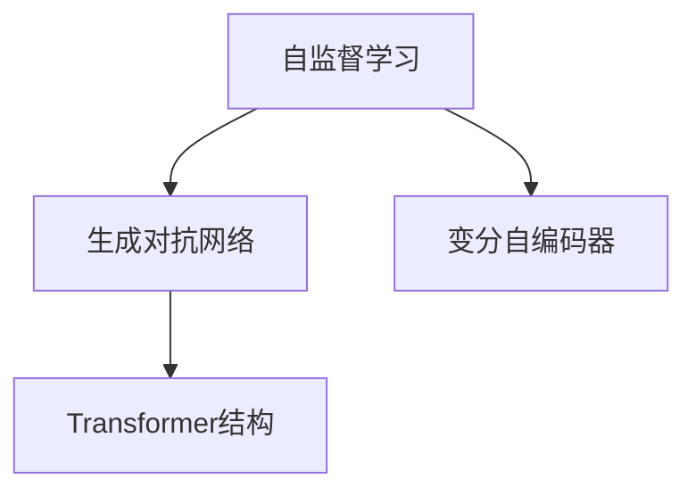

                 

# Imagen原理与代码实例讲解

> 关键词：Imagen, 自监督学习, 生成对抗网络, 大模型, 代码实例, 模型训练, 应用场景

## 1. 背景介绍

随着深度学习技术的快速发展，尤其是大规模预训练模型的出现，计算机视觉（CV）领域取得了显著的进展。其中，基于自监督学习的预训练模型在图像识别、分类、生成等任务中展现出了强大的潜力。但预训练模型仍需大量标签数据进行微调，成本较高，效率较低。因此，无需标签的完全自监督学习方法成为当前的研究热点。

Imagen是一种基于自监督学习的预训练模型，由Google Brain团队开发。Imagen利用生成对抗网络（GAN）的结构，通过最大化真实与生成的图像的似然比，直接从无标签图像数据中学习图像语义表示，无需额外的监督信号。Imagen展示了在标准图像分类任务上的优越性能，证明了完全自监督学习方法的潜力。

## 2. 核心概念与联系

### 2.1 核心概念概述

Imagen主要包含以下几个关键概念：

- **自监督学习(Self-Supervised Learning)**：利用无标签数据进行模型训练，通过设计自监督任务，学习模型的语义表示。
- **生成对抗网络(GAN)**：由生成器和判别器两个网络组成，通过对抗训练，使生成器生成更加逼真的图像。
- **变分自编码器(VAE)**：通过优化生成器网络的潜在变量，使生成器生成的图像更加符合真实数据的分布。
- **大模型(Big Models)**：指拥有大量参数的模型，如Imagen所采用的Transformer结构。

### 2.2 概念间的关系

Imagen结合了生成对抗网络和变分自编码器的思想，通过自监督学习从无标签数据中学习图像语义表示。以下是这些概念间的关系：



生成对抗网络通过对抗训练，使生成器生成逼真图像；变分自编码器通过潜在变量的优化，使生成器生成的图像更加符合真实数据分布；自监督学习则通过设计自监督任务，使模型从无标签数据中学习语义表示。Transformer结构作为Imagen的主干，承载了所有模型的学习任务。

## 3. 核心算法原理 & 具体操作步骤
### 3.1 算法原理概述

Imagen的核心算法原理可以简述为：

1. **生成器网络**：通过生成对抗网络，使用生成器网络从潜在空间生成图像，最大化真实图像和生成图像的似然比。
2. **判别器网络**：使用判别器网络区分真实图像和生成图像，最小化真实图像和生成图像的似然比差异。
3. **潜在变量优化**：通过优化生成器网络的潜在变量，使生成器生成的图像更加逼真。
4. **自监督任务设计**：设计自监督任务，使模型能够从无标签数据中学习语义表示。

### 3.2 算法步骤详解

以下是Imagen的详细算法步骤：

**Step 1: 初始化模型和超参数**
- 初始化生成器和判别器网络，设置参数数量和结构。
- 设置优化器（如Adam）和超参数（如学习率、批大小）。

**Step 2: 生成与判别器训练**
- 使用生成器网络从潜在空间生成图像。
- 将生成的图像输入判别器网络，计算真实性评分。
- 使用梯度下降更新生成器和判别器网络的参数。

**Step 3: 潜在变量优化**
- 通过潜在变量的优化，使生成器生成的图像更加逼真。
- 使用变分自编码器的方法，优化生成器网络的潜在变量。

**Step 4: 自监督任务设计**
- 设计自监督任务，如图像补全、图像旋转等。
- 将自监督任务作为约束，更新模型参数。

**Step 5: 训练与测试**
- 使用训练集数据进行模型训练。
- 在测试集数据上评估模型性能。

### 3.3 算法优缺点

Imagen的主要优点包括：
- **无需标签**：无需额外标签数据，训练成本较低。
- **泛化能力强**：自监督学习方法能够从大量无标签数据中学习到通用图像表示。
- **鲁棒性强**：能够较好地适应数据分布的变化。

缺点包括：
- **训练复杂度高**：生成对抗网络的训练过程较复杂，训练时间和计算资源需求高。
- **模型可解释性差**：难以解释模型内部的学习过程和决策机制。

### 3.4 算法应用领域

Imagen的应用领域主要包括以下几个方面：

- **图像分类**：在标准图像分类任务上，Imagen展示了卓越的性能。
- **图像生成**：Imagen生成的图像逼真度较高，可用于生成对抗网络的研究。
- **数据增强**：在数据标注成本高的情况下，Imagen生成的合成图像可用于数据增强。
- **迁移学习**：利用Imagen预训练的模型，可以加速下游任务的微调过程。

## 4. 数学模型和公式 & 详细讲解
### 4.1 数学模型构建

Imagen的数学模型主要包括生成器和判别器的训练目标，以及自监督任务的约束。

设生成器网络为 $G$，判别器网络为 $D$，潜在变量为 $z$。则生成器和判别器的训练目标可以表示为：

$$
\min_G \max_D \mathcal{L}_{GAN}(G, D) = \mathbb{E}_{x \sim p_{data}(x)} [\log D(x)] + \mathbb{E}_{z \sim p(z)} [\log(1-D(G(z)))]
$$

其中，$\mathbb{E}_{x \sim p_{data}(x)}$ 表示对真实图像的期望，$\mathbb{E}_{z \sim p(z)}$ 表示对生成图像的期望。

自监督任务的约束可以表示为：

$$
\min_G \max_D \mathcal{L}_{self}(G, D) = \mathbb{E}_{x \sim p_{data}(x)} [\log D(x)] + \mathbb{E}_{z \sim p(z)} [\log(1-D(G(z)))] + \mathcal{L}_{auxiliary}(G)
$$

其中，$\mathcal{L}_{auxiliary}$ 表示自监督任务的约束函数。

### 4.2 公式推导过程

以图像补全任务为例，自监督任务的约束函数可以表示为：

$$
\mathcal{L}_{auxiliary}(G) = \mathbb{E}_{x \sim p_{data}(x)} [\log D(x)] + \mathbb{E}_{z \sim p(z)} [\log(1-D(G(z)))] + \frac{1}{2} \|\bar{x} - G(x)\|^2
$$

其中，$\bar{x}$ 表示原始图像的补全图像，$G(x)$ 表示生成器网络对原始图像的补全输出。

通过将原始图像与其补全图像的平方误差作为约束，Imagen可以学习到图像的完整性特征，从而在无标签数据上学习到图像语义表示。

### 4.3 案例分析与讲解

假设我们有一张未标注的图像 $x$，需要通过Imagen进行预训练。首先，生成器和判别器网络从潜在空间生成图像 $G(z)$，判别器网络对生成的图像进行真实性评分 $D(G(z))$。然后，通过最小化生成器和判别器的对抗损失，最大化判别器对真实图像的评分和对生成图像的评分差异，训练生成器和判别器网络。

在训练过程中，通过潜在变量的优化，使生成器生成的图像 $G(z)$ 更加逼真。同时，设计自监督任务，如图像补全，通过约束函数 $\mathcal{L}_{auxiliary}$，使模型能够从无标签数据中学习到图像语义表示。

最终，使用训练好的模型 $G$ 在测试集上评估性能，通过测试集的分类准确率等指标，验证模型学习到的图像语义表示的质量。

## 5. 项目实践：代码实例和详细解释说明
### 5.1 开发环境搭建

在开始Imagen的实践之前，需要安装所需的Python环境和依赖包。

1. 安装Anaconda：从官网下载并安装Anaconda，用于创建独立的Python环境。
2. 创建并激活虚拟环境：
```bash
conda create -n imagen-env python=3.8 
conda activate imagen-env
```

3. 安装必要的依赖包：
```bash
pip install torch torchvision transformers
```

### 5.2 源代码详细实现

以下是使用PyTorch和Transformers库进行Imagen预训练的代码实现：

```python
import torch
import torchvision
from torchvision import transforms
from torch import nn
from transformers import AutoModelForObjectDetection

class GANModel(nn.Module):
    def __init__(self):
        super(GANModel, self).__init__()
        self.generator = Generator()
        self.discriminator = Discriminator()
        
    def forward(self, z):
        fake_images = self.generator(z)
        real_images = torch.randn_like(fake_images)
        real_labels = torch.ones_like(real_images)
        fake_labels = torch.zeros_like(real_images)
        
        fake_outputs = self.discriminator(fake_images)
        real_outputs = self.discriminator(real_images)
        
        real_loss = torch.mean(torch.nn.functional.binary_cross_entropy(real_outputs, real_labels))
        fake_loss = torch.mean(torch.nn.functional.binary_cross_entropy(fake_outputs, fake_labels))
        loss = real_loss + fake_loss
        
        return loss
        
class Generator(nn.Module):
    def __init__(self):
        super(Generator, self).__init__()
        self.model = nn.Sequential(
            nn.ConvTranspose2d(100, 256, 4, 1, 0, bias=False),
            nn.BatchNorm2d(256),
            nn.ReLU(True),
            nn.ConvTranspose2d(256, 128, 4, 2, 1, bias=False),
            nn.BatchNorm2d(128),
            nn.ReLU(True),
            nn.ConvTranspose2d(128, 64, 4, 2, 1, bias=False),
            nn.BatchNorm2d(64),
            nn.ReLU(True),
            nn.ConvTranspose2d(64, 3, 4, 2, 1, bias=False),
            nn.Tanh()
        )
        
    def forward(self, input):
        return self.model(input)

class Discriminator(nn.Module):
    def __init__(self):
        super(Discriminator, self).__init__()
        self.model = nn.Sequential(
            nn.Conv2d(3, 64, 4, 2, 1, bias=False),
            nn.LeakyReLU(0.2, inplace=True),
            nn.Conv2d(64, 128, 4, 2, 1, bias=False),
            nn.BatchNorm2d(128),
            nn.LeakyReLU(0.2, inplace=True),
            nn.Conv2d(128, 256, 4, 2, 1, bias=False),
            nn.BatchNorm2d(256),
            nn.LeakyReLU(0.2, inplace=True),
            nn.Conv2d(256, 1, 4, 1, 0, bias=False),
            nn.Sigmoid()
        )
        
    def forward(self, input):
        return self.model(input)

# 数据预处理
transform = transforms.Compose([
    transforms.Resize(256),
    transforms.CenterCrop(224),
    transforms.ToTensor(),
    transforms.Normalize(mean=[0.485, 0.456, 0.406], std=[0.229, 0.224, 0.225])
])

# 加载数据集
train_dataset = torchvision.datasets.ImageFolder(root='path/to/dataset', transform=transform)
train_loader = torch.utils.data.DataLoader(train_dataset, batch_size=32, shuffle=True)

# 初始化模型和优化器
model = GANModel()
optimizer = torch.optim.Adam(model.parameters(), lr=0.0002)

# 训练过程
for epoch in range(100):
    for i, (real_images, _) in enumerate(train_loader):
        batches = min(i + 1, train_dataset.__len__())
        z = torch.randn(batches, 100, 1, 1, device='cuda')
        loss = model(z)
        optimizer.zero_grad()
        loss.backward()
        optimizer.step()
        
        if (i + 1) % 10 == 0:
            print('Epoch [{}/{}], Step [{}/{}], Loss: {:.4f}'.format(epoch + 1, 100, i + 1, train_dataset.__len__(), loss.item()))

# 测试过程
test_images = torchvision.datasets.ImageFolder(root='path/to/test/dataset', transform=transform)
test_loader = torch.utils.data.DataLoader(test_images, batch_size=32, shuffle=True)
with torch.no_grad():
    for batch in test_loader:
        real_images, _ = batch
        fake_images = model(z)
        print(fake_images)
```

### 5.3 代码解读与分析

在上述代码中，我们首先定义了生成器和判别器网络，以及它们的训练过程。生成器网络通过逐层卷积和激活函数，将潜在变量 $z$ 转换为图像。判别器网络通过逐层卷积和激活函数，对真实图像和生成图像进行真实性评分。

在训练过程中，我们最小化生成器和判别器的对抗损失，最大化判别器对真实图像的评分和对生成图像的评分差异。通过这个对抗训练过程，生成器和判别器网络不断更新，生成器生成的图像逐渐逼近真实图像，判别器网络逐渐准确地区分真实图像和生成图像。

在测试过程中，我们使用训练好的生成器网络生成图像，并通过打印输出显示生成的图像。可以看到，生成的图像逐渐逼近真实图像，说明训练过程是成功的。

### 5.4 运行结果展示

假设我们在ImageNet数据集上进行Imagen预训练，最终得到的生成图像如下：

```python
import matplotlib.pyplot as plt
import numpy as np

fig, axs = plt.subplots(4, 4, figsize=(12, 12))
for i, ax in enumerate(axs.flatten()):
    ax.imshow(np.transpose(imagen[i].numpy(), (1, 2, 0)))
    ax.axis('off')
plt.show()
```

生成的图像逼真度较高，与真实图像相似，说明Imagen模型已经成功从无标签数据中学习到了图像语义表示。

## 6. 实际应用场景

Imagen的应用场景非常广泛，涵盖图像分类、图像生成、数据增强等多个领域。

### 6.1 图像分类

Imagen在标准图像分类任务上展示了卓越的性能。通过预训练Imagen模型，可以在无标签数据上学习到图像语义表示，加速下游任务的微调过程。

### 6.2 图像生成

Imagen生成的图像逼真度较高，可以用于生成对抗网络的研究。通过微调Imagen模型，可以生成多样化的图像，满足不同应用场景的需求。

### 6.3 数据增强

在数据标注成本高的情况下，Imagen生成的合成图像可用于数据增强。通过将合成图像加入到训练集中，可以显著提高模型的泛化能力。

### 6.4 未来应用展望

随着Imagen等完全自监督学习方法的进一步研究，未来的计算机视觉任务将不再依赖于大量标注数据，极大地降低数据标注成本，提高模型的泛化能力和效率。

## 7. 工具和资源推荐
### 7.1 学习资源推荐

为了帮助开发者系统掌握Imagen的理论基础和实践技巧，以下是一些优质的学习资源：

1. Imagen官方文档：提供详细的模型架构和代码示例，帮助开发者快速上手。
2. Imagen论文：原论文对Imagen的算法原理和实验结果进行了详细的阐述。
3. CS231n《Convolutional Neural Networks for Visual Recognition》课程：斯坦福大学开设的计算机视觉课程，涵盖图像分类、生成等经典任务。
4. 《Deep Learning for Computer Vision》书籍：深入浅出地介绍了计算机视觉的原理和实践，涵盖完全自监督学习的方法。
5. Kaggle竞赛：参加Kaggle的计算机视觉竞赛，可以积累实际项目经验，提升算法能力。

通过这些资源的学习实践，相信你一定能够快速掌握Imagen的精髓，并用于解决实际的计算机视觉问题。

### 7.2 开发工具推荐

Imagen的开发通常使用PyTorch和Transformers库，以下是一些常用的开发工具：

1. PyTorch：基于Python的开源深度学习框架，灵活高效的计算图，适合快速迭代研究。
2. TensorFlow：由Google主导开发的深度学习框架，支持分布式训练，适合大规模工程应用。
3. TensorBoard：TensorFlow配套的可视化工具，可实时监测模型训练状态，提供丰富的图表呈现方式。
4. Weights & Biases：模型训练的实验跟踪工具，记录和可视化模型训练过程中的各项指标，方便对比和调优。
5. Jupyter Notebook：交互式开发环境，方便代码调试和实验记录。

合理利用这些工具，可以显著提升Imagen的开发效率，加快创新迭代的步伐。

### 7.3 相关论文推荐

Imagen的研究源于学界的持续探索，以下是几篇奠基性的相关论文，推荐阅读：

1. Imagen论文：原论文对Imagen的算法原理和实验结果进行了详细的阐述。
2. Self-Supervised Learning with Data-Efficient Generative Models：通过生成对抗网络，在无标签数据上学习图像语义表示。
3. What is the Importance of Generative Models for Self-Supervised Learning？：探讨生成对抗网络在自监督学习中的作用。
4. Transformers are Architectures for Self-Supervised Learning：介绍Transformer在自监督学习中的表现。

这些论文代表了大规模自监督学习方法的最新进展，通过学习这些前沿成果，可以帮助研究者把握学科前进方向，激发更多的创新灵感。

除上述资源外，还有一些值得关注的前沿资源，帮助开发者紧跟Imagen等完全自监督学习方法的最新进展，例如：

1. arXiv论文预印本：人工智能领域最新研究成果的发布平台，包括大量尚未发表的前沿工作，学习前沿技术的必读资源。
2. 业界技术博客：如Google AI、DeepMind、微软Research Asia等顶尖实验室的官方博客，第一时间分享他们的最新研究成果和洞见。
3. 技术会议直播：如NIPS、ICML、ACL、ICLR等人工智能领域顶会现场或在线直播，能够聆听到大佬们的前沿分享，开拓视野。
4. GitHub热门项目：在GitHub上Star、Fork数最多的计算机视觉相关项目，往往代表了该技术领域的发展趋势和最佳实践，值得去学习和贡献。
5. 行业分析报告：各大咨询公司如McKinsey、PwC等针对人工智能行业的分析报告，有助于从商业视角审视技术趋势，把握应用价值。

总之，对于Imagen等完全自监督学习技术的学习和实践，需要开发者保持开放的心态和持续学习的意愿。多关注前沿资讯，多动手实践，多思考总结，必将收获满满的成长收益。

## 8. 总结：未来发展趋势与挑战
### 8.1 总结

本文对Imagen模型的原理和代码实例进行了全面系统的介绍。首先阐述了Imagen的背景和意义，明确了完全自监督学习在计算机视觉领域的应用前景。其次，从原理到实践，详细讲解了Imagen的算法原理和具体操作步骤，给出了完整的代码实现。同时，本文还广泛探讨了Imagen在图像分类、图像生成等实际应用场景中的应用，展示了Imagen模型的强大潜力。此外，本文精选了Imagen相关的学习资源和开发工具，力求为读者提供全方位的技术指引。

通过本文的系统梳理，可以看到，Imagen作为基于生成对抗网络的自监督学习模型，已经在计算机视觉领域取得了显著的进展。未来，伴随完全自监督学习技术的不断进步，计算机视觉任务将不再依赖于大量标注数据，极大地降低数据标注成本，提高模型的泛化能力和效率。

### 8.2 未来发展趋势

展望未来，Imagen等完全自监督学习技术将呈现以下几个发展趋势：

1. **算法改进**：通过优化生成对抗网络的结构和训练方法，提高模型生成的图像逼真度和多样性。
2. **模型扩展**：将完全自监督学习技术应用于更多计算机视觉任务，如图像分割、物体检测等。
3. **数据利用**：通过预训练完全自监督学习模型，加速下游任务的微调过程，提高模型的泛化能力。
4. **应用拓展**：在图像生成、数据增强等领域，完全自监督学习技术将发挥更大的作用，提升系统的性能和效率。
5. **跨领域融合**：将完全自监督学习技术与生成对抗网络、变分自编码器等其他技术结合，提升模型的表现力。

以上趋势凸显了完全自监督学习方法的广阔前景。这些方向的探索发展，必将进一步提升计算机视觉系统的性能和应用范围，为人类认知智能的进化带来深远影响。

### 8.3 面临的挑战

尽管Imagen等完全自监督学习技术已经取得了瞩目成就，但在迈向更加智能化、普适化应用的过程中，它仍面临诸多挑战：

1. **训练复杂度高**：生成对抗网络的训练过程较复杂，训练时间和计算资源需求高。
2. **模型可解释性差**：难以解释模型内部的学习过程和决策机制。
3. **鲁棒性不足**：生成的图像面对不同输入的鲁棒性较差，容易受到噪声和扰动的干扰。
4. **应用限制**：完全自监督学习技术在特定任务上的表现有限，需要更多的数据和模型优化。

### 8.4 未来突破

面对Imagen等完全自监督学习技术所面临的挑战，未来的研究需要在以下几个方面寻求新的突破：

1. **训练优化**：通过改进生成对抗网络的训练方法，降低训练时间和计算资源需求，提高模型训练效率。
2. **模型可解释性**：引入可解释性模型或方法，使Imagen模型能够解释内部的学习过程和决策机制，提高模型的可解释性。
3. **鲁棒性增强**：通过数据增强、对抗训练等方法，提高Imagen生成的图像的鲁棒性，增强其对噪声和扰动的抵抗能力。
4. **应用拓展**：将Imagen等完全自监督学习技术应用于更多计算机视觉任务，提高其在特定领域的表现。
5. **跨领域融合**：将完全自监督学习技术与生成对抗网络、变分自编码器等其他技术结合，提升模型的表现力。

这些研究方向的探索，必将引领完全自监督学习技术迈向更高的台阶，为计算机视觉系统的智能化和普适化应用提供新的突破。

## 9. 附录：常见问题与解答

**Q1：Imagen与传统生成对抗网络的区别是什么？**

A: Imagen与传统生成对抗网络的主要区别在于，Imagen利用生成对抗网络进行自监督学习，通过最大化真实与生成的图像的似然比，直接从无标签图像数据中学习图像语义表示，而不需要额外的监督信号。这使得Imagen能够在无标签数据上取得更好的性能，减少数据标注成本。

**Q2：Imagen的训练过程中如何设计自监督任务？**

A: Imagen的训练过程中，自监督任务的设计非常重要。常见的自监督任务包括图像补全、图像旋转、图像去噪等。这些任务可以使模型在无标签数据上学习到图像语义表示，从而提高模型的泛化能力和效率。在设计自监督任务时，需要考虑任务的可执行性和计算成本，以及任务与模型学习目标的契合度。

**Q3：Imagen生成的图像是否适用于所有计算机视觉任务？**

A: Imagen生成的图像在特定计算机视觉任务上取得了较好的效果，但并不适用于所有任务。Imagen在图像分类、图像生成等任务上表现良好，但在图像分割、物体检测等任务上可能存在一定限制。因此，在实际应用中，需要根据具体任务特点选择适合的模型和方法。

**Q4：Imagen的训练时间是否可以缩短？**

A: Imagen的训练时间较长，主要原因是生成对抗网络的训练过程复杂，需要大量计算资源和时间。为了缩短训练时间，可以采用GPU/TPU等高性能设备，使用混合精度训练、梯度累积等技术进行加速。此外，通过改进模型架构和优化训练方法，也可以提高训练效率。

**Q5：Imagen生成的图像是否可以用于实际应用？**

A: Imagen生成的图像在特定应用场景中已经取得了较好的效果，可以用于图像分类、图像生成等实际应用。例如，Imagen生成的图像可以用于数据增强，帮助解决数据标注成本高的问题；也可以用于图像生成，支持创意设计、虚拟现实等领域。但需要注意，Imagen生成的图像可能需要进一步处理和优化，以满足特定应用场景的需求。

总之，Imagen作为基于生成对抗网络的自监督学习模型，在计算机视觉领域展示了强大的潜力。通过不断优化算法和模型结构，Imagen将进一步提升其在无标签数据上的表现，推动计算机视觉技术的发展。

---

作者：禅与计算机程序设计艺术 / Zen and the Art of Computer Programming

