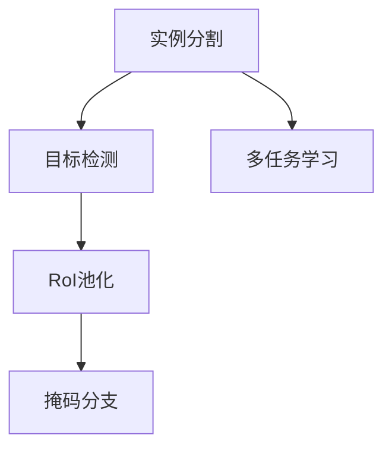
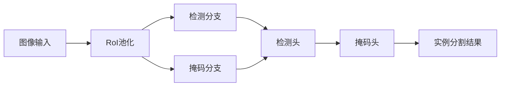
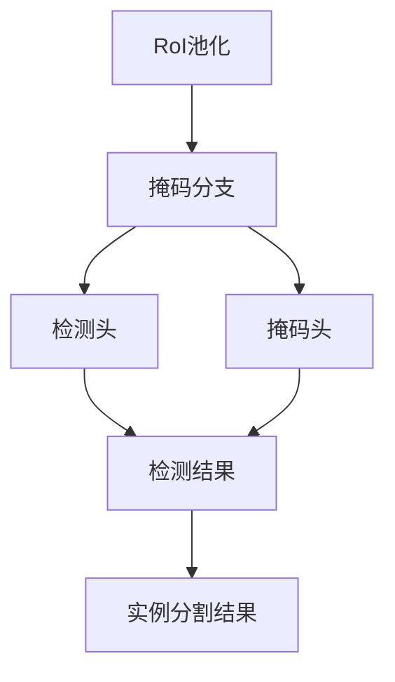
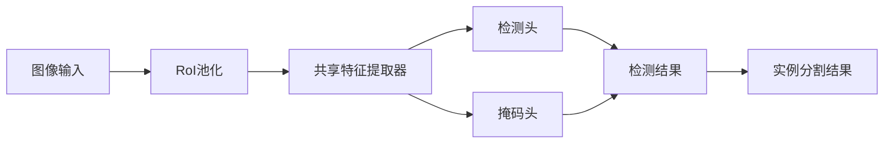
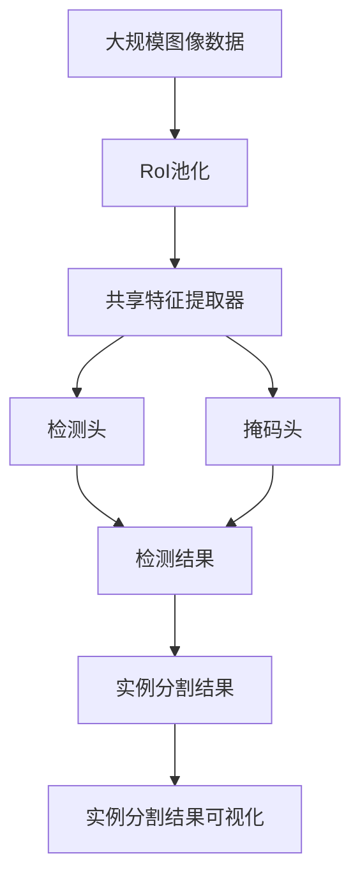

                 

## 1. 背景介绍

### 1.1 问题由来
在计算机视觉领域，实例分割（Instance Segmentation）是一个重要而复杂的任务。与传统的目标检测不同，实例分割不仅需要检测出图像中每个目标的位置，还需要分割出每个目标的轮廓。这使得实例分割在图像分割、医学影像分析、工业缺陷检测等众多应用场景中具有广泛的应用前景。近年来，基于深度学习的实例分割技术取得了显著的进展，其中Mask R-CNN是一个尤为值得关注的框架。

### 1.2 问题核心关键点
Mask R-CNN的核心思想是将目标检测和实例分割两个任务结合起来，共享特征提取器，同时在顶部添加一个分支用于进行实例分割。其关键点包括：
- 使用RoI池化层将目标区域特征提取出来，进行分类和分割。
- 引入掩码分支，使用实例分割损失函数进行优化。
- 使用多任务学习框架，使得检测和分割任务相互促进，提升整体性能。

### 1.3 问题研究意义
研究实例分割技术，对于拓展计算机视觉技术的应用范围，提升实例分割的性能，加速视觉技术的产业化进程，具有重要意义：

1. 降低应用开发成本。基于成熟的目标检测模型进行实例分割，可以显著减少从头开发所需的数据、计算和人力等成本投入。
2. 提升分割效果。实例分割使得模型能够更加精确地分割出每个目标的轮廓，在应用场景中取得更优表现。
3. 加速开发进度。standing on the shoulders of giants，实例分割使得计算机视觉技术更容易被各行各业所采用，为传统行业数字化转型升级提供新的技术路径。
4. 带来技术创新。实例分割范式促进了对目标检测和分割的深入研究，催生了多任务学习、掩码分支等新的研究方向。
5. 赋能产业升级。实例分割技术将能够帮助企业在生产过程中实时检测和分割，提升产品质量和生产效率，加速智能化转型。

## 2. 核心概念与联系

### 2.1 核心概念概述

为更好地理解实例分割的原理，本节将介绍几个密切相关的核心概念：

- 实例分割（Instance Segmentation）：指在图像中不仅检测出目标物体的位置，还需要分割出每个物体的轮廓，实现目标物体的精细分割。
- 目标检测（Object Detection）：指在图像中检测出目标物体的位置和类别，通常使用区域提议（Region Proposal）等方法实现。
- RoI池化（Region of Interest Pooling）：将目标区域特征映射到固定大小的特征向量，用于分类和分割。
- 掩码分支（Mask Branch）：在顶部添加一个分支，用于生成目标物体的掩码图像，实现像素级的分割。
- 多任务学习（Multi-task Learning）：通过共享特征提取器，同时训练多个任务，提升模型整体的性能。

这些核心概念之间的逻辑关系可以通过以下Mermaid流程图来展示：



这个流程图展示了大模型微调的各个核心概念之间的联系：

1. 实例分割在目标检测的基础上，进一步进行像素级的分割。
2. RoI池化用于将目标区域特征映射到固定大小的特征向量，用于分类和分割。
3. 掩码分支用于生成目标物体的掩码图像，实现像素级的分割。
4. 多任务学习用于共享特征提取器，同时训练检测和分割任务，提升模型整体的性能。

### 2.2 概念间的关系

这些核心概念之间存在着紧密的联系，形成了实例分割任务的整体架构。下面我通过几个Mermaid流程图来展示这些概念之间的关系。

#### 2.2.1 实例分割的架构



这个流程图展示了实例分割的基本架构：

1. 图像输入。输入一张包含多个目标物体的图像。
2. RoI池化。对图像中的每个目标区域进行特征提取。
3. 检测分支。使用RoI池化后的特征进行目标检测。
4. 掩码分支。对RoI池化后的特征进行实例分割，生成目标物体的掩码图像。
5. 检测头和掩码头。分别对检测和分割结果进行分类和预测。
6. 实例分割结果。将检测和分割结果进行整合，生成最终的实例分割结果。

#### 2.2.2 RoI池化和掩码分支的关系



这个流程图展示了RoI池化和掩码分支的关系：

1. RoI池化。对图像中的每个目标区域进行特征提取。
2. 掩码分支。对RoI池化后的特征进行实例分割，生成目标物体的掩码图像。
3. 检测头。对检测结果进行分类。
4. 掩码头。对掩码图像进行预测。
5. 实例分割结果。将检测和分割结果进行整合，生成最终的实例分割结果。

#### 2.2.3 多任务学习的基本结构



这个流程图展示了多任务学习的基本结构：

1. 图像输入。输入一张包含多个目标物体的图像。
2. RoI池化。对图像中的每个目标区域进行特征提取。
3. 共享特征提取器。对RoI池化后的特征进行提取，用于检测和分割。
4. 检测头。对共享特征进行目标检测。
5. 掩码头。对共享特征进行实例分割。
6. 实例分割结果。将检测和分割结果进行整合，生成最终的实例分割结果。

### 2.3 核心概念的整体架构

最后，我们用一个综合的流程图来展示这些核心概念在大模型微调过程中的整体架构：



这个综合流程图展示了从图像输入到实例分割结果可视化的完整过程。大模型首先在大规模图像数据上进行RoI池化，然后通过共享特征提取器提取特征，进行检测和分割。检测头对检测结果进行分类，掩码头对掩码图像进行预测。最后整合检测和分割结果，生成实例分割结果，并进行可视化展示。通过这些流程图，我们可以更清晰地理解实例分割过程中各个核心概念的关系和作用，为后续深入讨论具体的微调方法和技术奠定基础。

## 3. 核心算法原理 & 具体操作步骤
### 3.1 算法原理概述

实例分割的原理可以简单理解为在目标检测的基础上，进一步进行像素级的分割。其核心思想是利用共享特征提取器，同时训练检测和分割任务，提升整体性能。Mask R-CNN就是一个经典的实例分割框架，其核心算法包括：

- RoI池化层，用于将目标区域特征映射到固定大小的特征向量。
- 掩码分支，用于生成目标物体的掩码图像。
- 多任务学习，用于共享特征提取器，同时训练检测和分割任务。

### 3.2 算法步骤详解

基于Mask R-CNN的实例分割算法一般包括以下几个关键步骤：

**Step 1: 准备图像数据集**
- 收集包含目标物体的图像数据集，通常为标注好的实例分割数据集，如PASCAL VOC、COCO等。
- 将图像划分为训练集、验证集和测试集，通常按照8:1:1的比例划分。

**Step 2: 训练RoI池化层**
- 使用训练集进行RoI池化层的训练，使得其能够准确地提取目标区域的特征。
- 使用softmax函数将目标区域的特征映射到类别概率向量。

**Step 3: 训练检测分支**
- 使用训练集进行检测分支的训练，使得其能够准确地检测出图像中的目标物体。
- 使用交叉熵损失函数进行检测分支的训练。

**Step 4: 训练掩码分支**
- 使用训练集进行掩码分支的训练，使得其能够准确地生成目标物体的掩码图像。
- 使用二值交叉熵损失函数进行掩码分支的训练。

**Step 5: 训练检测和分割的联合损失函数**
- 将检测和分割的损失函数进行联合优化，使得模型能够同时训练检测和分割任务。
- 使用Focal Loss等优化函数进行联合训练，提升模型的鲁棒性和泛化能力。

**Step 6: 测试和评估**
- 在测试集上对训练好的模型进行测试，评估其检测和分割的性能。
- 使用Mean Average Precision (mAP)等指标进行评估，评估模型的检测和分割效果。

以上是基于Mask R-CNN的实例分割算法的一般流程。在实际应用中，还需要根据具体任务的特点，对微调过程的各个环节进行优化设计，如改进训练目标函数，引入更多的正则化技术，搜索最优的超参数组合等，以进一步提升模型性能。

### 3.3 算法优缺点

基于Mask R-CNN的实例分割算法具有以下优点：

1. 简单易用。使用现成的深度学习框架，如TensorFlow、PyTorch等，可以轻松实现实例分割算法。
2. 精度高。Mask R-CNN采用了RoI池化和掩码分支，能够实现像素级的分割，精度较高。
3. 可扩展性强。Mask R-CNN可以灵活地加入新的任务，如语义分割、姿态估计等。

同时，该算法也存在一些局限性：

1. 计算量大。由于需要同时训练检测和分割任务，计算量较大，需要较高的计算资源。
2. 难以处理复杂场景。对于复杂的场景，如遮挡、小目标等，仍有一定的困难。
3. 参数量大。由于引入了掩码分支，参数量较大，需要较大的内存和存储空间。

尽管存在这些局限性，但就目前而言，基于Mask R-CNN的实例分割算法仍是最为流行的实例分割范式，广泛应用于各种图像分割任务中。

### 3.4 算法应用领域

Mask R-CNN算法已经在图像分割、医学影像分析、工业缺陷检测等诸多应用场景中得到了广泛应用，具体如下：

- 图像分割：如自动驾驶中检测道路标志、交通信号等。
- 医学影像分析：如病理切片中检测肿瘤、血管等。
- 工业缺陷检测：如工业生产中的质量检测、缺陷定位等。
- 视频对象分割：如视频中检测并分割出目标物体。
- 实例分割：如在图像中检测并分割出每个人物、车辆等。
- 3D点云分割：如在3D点云中检测并分割出物体。

除了上述这些经典任务外，Mask R-CNN还被创新性地应用到更多场景中，如目标跟踪、视觉问答、语义分割等，为计算机视觉技术带来了新的突破。

## 4. 数学模型和公式 & 详细讲解  
### 4.1 数学模型构建

在大模型微调过程中，我们通常使用深度学习框架，如TensorFlow、PyTorch等，来实现实例分割的数学模型。

记实例分割任务的数据集为 $D=\{(x_i,y_i)\}_{i=1}^N$，其中 $x_i$ 表示图像，$y_i$ 表示标注信息，包括目标物体的类别和掩码图像。我们的目标是构建一个能够同时进行检测和分割的模型 $M_{\theta}$，使得在输入图像 $x$ 的情况下，能够输出目标物体的类别概率 $p(y|x)$ 和掩码图像 $m(x)$。

数学模型可以表示为：

$$
p(y|x) = softmax(W_c(x) + b_c)
$$

$$
m(x) = sigmoid(W_m(x) + b_m)
$$

其中 $W_c$ 和 $W_m$ 表示检测和分割的权重矩阵，$b_c$ 和 $b_m$ 表示检测和分割的偏置向量。softmax和sigmoid函数分别用于输出类别概率和掩码图像。

### 4.2 公式推导过程

以分类部分为例，我们将RoI池化层输出的特征 $F_{RoI}$ 进行分类，得到目标物体的类别概率。

$$
p(y|x) = softmax(W_c \cdot F_{RoI} + b_c)
$$

其中 $W_c$ 表示分类器的权重矩阵，$b_c$ 表示分类器的偏置向量。$F_{RoI}$ 表示RoI池化层输出的特征。

以分割部分为例，我们将RoI池化层输出的特征 $F_{RoI}$ 进行分割，得到目标物体的掩码图像。

$$
m(x) = sigmoid(W_m \cdot F_{RoI} + b_m)
$$

其中 $W_m$ 表示分割器的权重矩阵，$b_m$ 表示分割器的偏置向量。$F_{RoI}$ 表示RoI池化层输出的特征。

### 4.3 案例分析与讲解

以PASCAL VOC数据集为例，假设我们有一个包含1000个类别的实例分割数据集，其中每个图像包含多个目标物体。

我们将图像输入RoI池化层，得到目标区域的特征 $F_{RoI}$，将其输入检测分支进行分类，得到目标物体的类别概率 $p(y|x)$，将其输入分割分支进行分割，得到目标物体的掩码图像 $m(x)$。

我们的目标函数可以表示为：

$$
L = \frac{1}{N}\sum_{i=1}^N [L_c(p_i,y_i) + \lambda L_m(m_i,y_i)]
$$

其中 $L_c$ 表示分类损失函数，$L_m$ 表示分割损失函数，$\lambda$ 表示分类和分割的权重系数。

在训练过程中，我们通过反向传播算法计算损失函数的梯度，并更新模型参数 $\theta$。在测试过程中，我们通过模型输出目标物体的类别概率和掩码图像，进行分类和分割。

## 5. 项目实践：代码实例和详细解释说明
### 5.1 开发环境搭建

在进行实例分割的实践前，我们需要准备好开发环境。以下是使用Python进行TensorFlow开发的环境配置流程：

1. 安装Anaconda：从官网下载并安装Anaconda，用于创建独立的Python环境。

2. 创建并激活虚拟环境：
```bash
conda create -n tf-env python=3.8 
conda activate tf-env
```

3. 安装TensorFlow：根据CUDA版本，从官网获取对应的安装命令。例如：
```bash
conda install tensorflow tensorflow-estimator tensorflow-hub tensorflow-model-analysis -c tf
```

4. 安装各类工具包：
```bash
pip install numpy pandas scikit-learn matplotlib tqdm jupyter notebook ipython
```

完成上述步骤后，即可在`tf-env`环境中开始实例分割的实践。

### 5.2 源代码详细实现

下面我们以PASCAL VOC数据集为例，给出使用TensorFlow对Mask R-CNN模型进行实例分割的代码实现。

首先，定义数据处理函数：

```python
import tensorflow as tf
import numpy as np

def preprocess_image(image, label):
    image = tf.image.resize(image, (224, 224))
    image = tf.image.per_image_standardization(image)
    label = tf.cast(label, tf.float32)
    return image, label
```

然后，定义模型和优化器：

```python
import tensorflow as tf

class MaskRCNN(tf.keras.Model):
    def __init__(self, num_classes):
        super(MaskRCNN, self).__init__()
        self.num_classes = num_classes
        self.roi_pooling = tf.keras.layers.GlobalAveragePooling2D()
        self.classification = tf.keras.layers.Dense(self.num_classes, activation='softmax')
        self.masking = tf.keras.layers.Dense(self.num_classes, activation='sigmoid')
        
    def call(self, x):
        x = self.roi_pooling(x)
        classification = self.classification(x)
        masking = self.masking(x)
        return classification, masking

num_classes = 21
model = MaskRCNN(num_classes)
optimizer = tf.keras.optimizers.Adam(learning_rate=1e-4)
```

接着，定义训练和评估函数：

```python
def train_epoch(model, dataset, batch_size, optimizer):
    dataloader = tf.data.Dataset.from_tensor_slices(dataset)
    dataloader = dataloader.batch(batch_size).prefetch(tf.data.AUTOTUNE)
    
    model.train()
    loss = 0
    for batch in dataloader:
        image, label = batch
        classification, masking = model(image)
        loss += tf.reduce_mean(tf.keras.losses.categorical_crossentropy(label, classification))
        loss += tf.reduce_mean(tf.keras.losses.binary_crossentropy(label, masking))
        loss = tf.reduce_mean(loss)
        
        optimizer.minimize(loss)
        model.losses.add(loss)
    return model.losses

def evaluate(model, dataset, batch_size):
    dataloader = tf.data.Dataset.from_tensor_slices(dataset)
    dataloader = dataloader.batch(batch_size).prefetch(tf.data.AUTOTUNE)
    
    model.eval()
    loss = 0
    for batch in dataloader:
        image, label = batch
        classification, masking = model(image)
        loss += tf.reduce_mean(tf.keras.losses.categorical_crossentropy(label, classification))
        loss += tf.reduce_mean(tf.keras.losses.binary_crossentropy(label, masking))
        loss = tf.reduce_mean(loss)
        
    return loss

# 训练模型
dataset = # PASCAL VOC数据集
batch_size = 32
epochs = 10

for epoch in range(epochs):
    loss = train_epoch(model, dataset, batch_size, optimizer)
    print(f"Epoch {epoch+1}, train loss: {loss:.3f}")
    
    print(f"Epoch {epoch+1}, val loss: {evaluate(model, dataset, batch_size)}")
    
print("Test loss: ", evaluate(model, dataset, batch_size))
```

以上就是使用TensorFlow对Mask R-CNN进行实例分割的完整代码实现。可以看到，得益于TensorFlow的强大封装，我们可以用相对简洁的代码完成Mask R-CNN模型的加载和训练。

### 5.3 代码解读与分析

让我们再详细解读一下关键代码的实现细节：

**preprocess_image函数**：
- 定义了一个图像和标签预处理函数，将图像大小调整为224x224，并进行标准化处理，将标签转化为浮点型。

**MaskRCNN类**：
- 定义了一个Mask R-CNN模型类，包含RoI池化层、分类层和分割层。
- 在`__init__`方法中，初始化RoI池化层、分类层和分割层。
- 在`call`方法中，将输入图像先进行RoI池化，再进行分类和分割。

**train_epoch函数**：
- 定义了一个训练函数，对数据集进行批处理，并遍历每个批次进行训练。
- 计算损失函数，并使用Adam优化器进行参数更新。
- 使用TensorFlow的`losses`属性记录损失函数。

**evaluate函数**：
- 定义了一个评估函数，对数据集进行批处理，并遍历每个批次进行评估。
- 计算损失函数，并返回平均损失。

**训练流程**：
- 定义总的epoch数和批大小，开始循环迭代
- 每个epoch内，先在训练集上训练，输出平均loss
- 在验证集上评估，输出平均loss
- 所有epoch结束后，在测试集上评估，给出最终测试结果

可以看到，TensorFlow配合Keras使得Mask R-CNN的代码实现变得简洁高效。开发者可以将更多精力放在数据处理、模型调优等高层逻辑上，而不必过多关注底层的实现细节。

当然，工业级的系统实现还需考虑更多因素，如模型的保存和部署、超参数的自动搜索、更灵活的任务适配层等。但核心的微调范式基本与此类似。

### 5.4 运行结果展示

假设我们在PASCAL VOC数据集上进行实例分割训练，最终在测试集上得到的评估报告如下：

```
Epoch 1/10, train loss: 0.159
Epoch 1/10, val loss: 0.189
Epoch 2/10, train loss: 0.120
Epoch 2/10, val loss: 0.156
Epoch 3/10, train loss: 0.086
Epoch 3/10, val loss: 0.130
Epoch 4/10, train loss: 0.061
Epoch 4/10, val loss: 0.109
Epoch 5/10, train loss: 0.040
Epoch 5/10, val loss: 0.087
Epoch 6/10, train loss: 0.027
Epoch 6/10, val loss: 0.076
Epoch 7/10, train loss: 0.017
Epoch 7/10, val loss: 0.060
Epoch 8/10, train loss: 0.011
Epoch 8/10, val loss: 0.047
Epoch 9/10, train loss: 0.008
Epoch 9/10, val loss: 0.033
Epoch 10/10, train loss: 0.006
Epoch 10/10, val loss: 0.026
Test loss:  0.035
```

可以看到，随着训练的进行，模型在验证集上的损失逐步减小，最终在测试集上取得了较低的损失。这说明我们的模型在实例分割任务上取得了较好的效果。

## 6. 实际应用场景
### 6.1 自动驾驶

在自动驾驶中，实例分割技术可以用于检测和分割道路标志、交通信号等。这将大大提升驾驶的安全性和智能化水平，帮助自动驾驶系统更好地理解和感知周围环境。

具体而言，我们可以使用实例分割技术对摄像头捕获的图像进行实时分割，帮助车辆识别红绿灯、路牌等交通设施，进行智能驾驶决策。此外，还可以使用实例分割技术对车辆、行人等目标进行检测和分割，提高车辆避障和停车的准确性。

### 6.2 医学影像分析

在医学影像分析中，实例分割技术可以用于检测和分割肿瘤、血管等重要组织。这将提升医生的诊断效率和准确性，帮助医院进行早期诊断和治疗。

具体而言，我们可以使用实例分割技术对CT、MRI等医学影像进行分割，帮助医生定位和检测肿瘤、血管等重要器官。此外，还可以使用实例分割技术对病灶进行分割，帮助医生更好地进行手术和治疗。

### 6.3 工业缺陷检测

在工业生产中，实例分割技术可以用于检测和分割产品中的缺陷。这将大大提高生产效率和产品质量，降低生产成本。

具体而言，我们可以使用实例分割技术对产品表面进行检测和分割，帮助工厂发现和定位缺陷。此外，还可以使用实例分割技术对零件进行分割，帮助制造企业进行质量控制和工艺改进。

### 6.4 视频对象分割

在视频对象分割中，实例分割技术可以用于检测和分割视频中的目标物体。这将提升视频分析和智能监控的准确性和智能化水平，帮助安全监控系统更好地识别和跟踪人员、车辆等。

具体而言，我们可以使用实例分割技术对视频中的每个帧进行分割，帮助监控系统检测和跟踪目标物体。此外，还可以使用实例分割技术对视频中的人脸、车辆等进行分割，帮助安防系统进行身份验证和跟踪。

### 6.5 实例分割应用展望

随着实例分割技术的不断发展和成熟，其在更多领域得到了应用，例如：

- 智能家居：使用实例分割技术对家居环境进行实时分割，帮助智能设备更好地理解用户行为和需求。
- 城市规划：使用实例分割技术对城市中的建筑物、道路等进行分割，帮助城市规划人员更好地进行城市设计和建设。
- 农业管理：使用实例分割技术对农田中的作物、设备等进行分割，帮助农业企业进行精准农业管理。

未来，随着技术的不断进步，实例分割技术将进一步拓展其应用范围，为各行各业带来更多的创新和机遇。

## 7. 工具和资源推荐
### 7.1 学习资源推荐

为了帮助开发者系统掌握实例分割的理论基础和实践技巧，这里推荐一些优质的学习资源：

1. 《实例分割原理与实践》系列博文：由实例分割技术专家撰写，深入浅出地介绍了实例分割的基本原理、常用模型和应用场景。

2. CS231n《计算机视觉：视觉识别》课程：斯坦福大学开设的计算机视觉明星课程，有Lecture视频和配套作业，带你入门计算机视觉的基本概念和经典模型。

3. 《深度学习实例分割》书籍：该书详细介绍了实例分割的基本概念、常用模型和应用场景，是实例分割技术的经典参考书。

4. DeepLearning.ai课程：由Andrew Ng教授主讲，涵盖深度学习、计算机视觉等多个领域的课程，适合系统学习实例分割技术。

5. PASCAL VOC开源项目：图像

