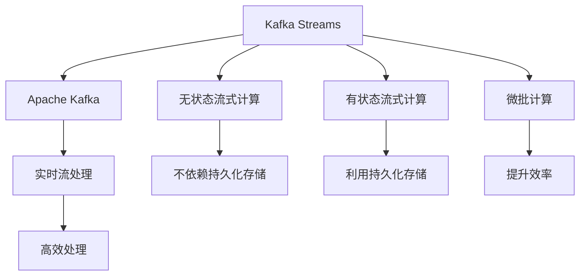
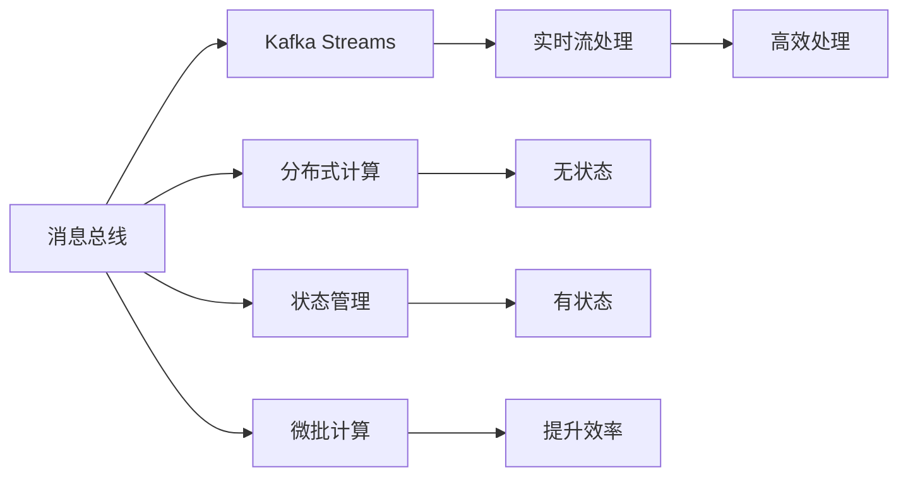
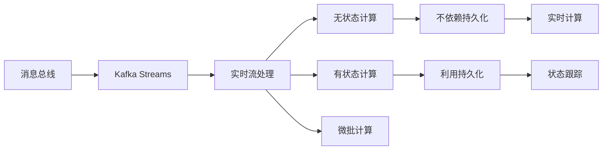
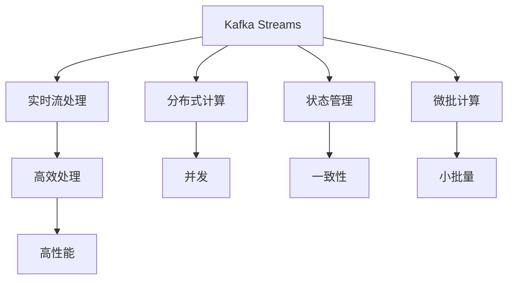
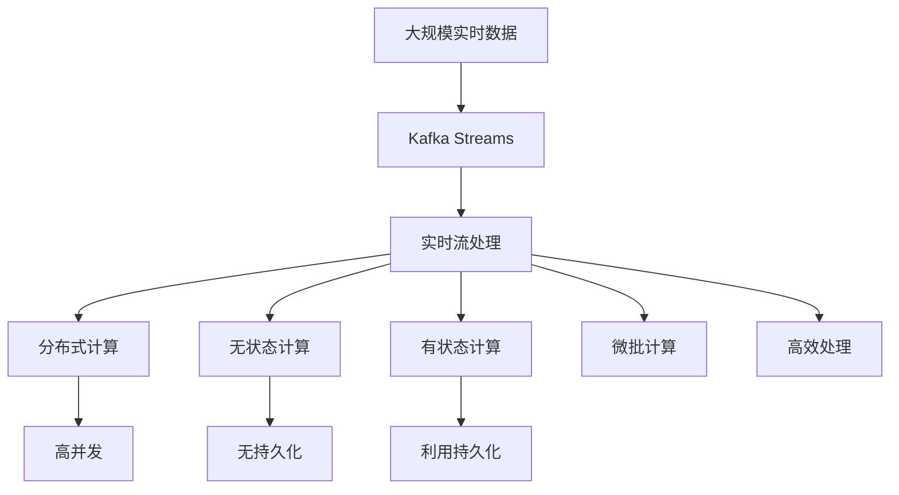

                 

# Kafka Streams原理与代码实例讲解

> 关键词：Kafka Streams, 实时流处理, Apache Kafka, 无状态流式计算, 有状态流式计算, 微批计算, 分布式流处理

## 1. 背景介绍

### 1.1 问题由来
随着大数据时代的到来，实时数据处理需求日益增多。传统的数据批处理方式已经难以满足对数据即时性、灵活性、准确性的需求。实时流处理技术应运而生，成为解决这一问题的重要手段。Apache Kafka Streams作为Kafka生态中的一部分，提供了一种基于Kafka的实时流处理解决方案，能够实现高效、可靠、可扩展的实时数据处理。

### 1.2 问题核心关键点
Kafka Streams的核心理念是利用Kafka作为消息总线，将数据流式传输到Kafka topic中，再通过流式计算模块对数据进行处理。其核心设计思想包括：

1. 分布式流式计算：Kafka Streams可以分布在多个节点上并行计算，提高处理能力。
2. 无状态和有状态计算：Kafka Streams支持无状态和有状态流式计算，可以灵活适应不同需求。
3. 微批计算：Kafka Streams采用微批计算方式，实现高效处理大量数据流。
4. 高性能、低延迟：Kafka Streams设计优化，能够在高并发下保持低延迟处理能力。

### 1.3 问题研究意义
研究Kafka Streams技术，对于拓展实时流处理应用的边界，提升数据处理效率，加速大数据技术落地应用，具有重要意义：

1. 提升处理效率。Kafka Streams可以高效处理海量实时数据，满足大数据实时应用的需求。
2. 增强系统灵活性。通过分布式计算和状态管理，Kafka Streams可以适应各种复杂的数据处理场景。
3. 简化系统架构。利用Kafka作为消息总线，消除了传统的ETL中间件，简化系统架构设计。
4. 保证数据一致性。通过Kafka的幂等特性，Kafka Streams能够保证数据处理的一致性和可靠性。
5. 增强系统扩展性。Kafka Streams可以水平扩展到多个节点，适应大规模数据处理需求。

## 2. 核心概念与联系

### 2.1 核心概念概述

为更好地理解Kafka Streams技术，本节将介绍几个密切相关的核心概念：

- Kafka Streams: Apache Kafka Streams是一种基于Apache Kafka的无状态或半状态流式计算框架，支持高效处理海量实时数据。
- Apache Kafka: 一个开源分布式消息系统，支持发布/订阅消息模型和流式处理。
- 实时流处理: 指对实时产生的数据流进行即时处理和分析，以支持实时数据应用。
- 无状态流式计算: 不依赖外部持久化存储，对数据进行实时计算并输出结果。
- 有状态流式计算: 利用外部持久化存储对数据进行状态跟踪和记忆，支持复杂计算任务。
- 微批计算: 采用小批量处理方式，提升实时流处理的效率和处理能力。

这些核心概念之间的逻辑关系可以通过以下Mermaid流程图来展示：



这个流程图展示了大语言模型的核心概念及其之间的关系：

1. Kafka Streams基于Apache Kafka进行数据流式处理。
2. Kafka Streams支持无状态和有状态计算，灵活适应不同需求。
3. Kafka Streams采用微批计算，提高处理效率。
4. 利用Kafka消息总线的特性，实现高效、可靠的实时数据处理。

### 2.2 概念间的关系

这些核心概念之间存在着紧密的联系，形成了Kafka Streams的完整生态系统。下面我们通过几个Mermaid流程图来展示这些概念之间的关系。

#### 2.2.1 Kafka Streams的核心架构



这个流程图展示了Kafka Streams的核心架构，包括消息总线、实时流处理、分布式计算、状态管理、微批计算等关键组件。

#### 2.2.2 Kafka Streams的计算模型



这个流程图展示了Kafka Streams的计算模型，包括无状态和有状态计算、微批计算等关键特性。

#### 2.2.3 Kafka Streams的性能优化



这个流程图展示了Kafka Streams的性能优化策略，包括分布式计算、状态管理、微批计算等特性。

### 2.3 核心概念的整体架构

最后，我们用一个综合的流程图来展示这些核心概念在大语言模型微调过程中的整体架构：



这个综合流程图展示了从实时数据到最终输出的完整过程。Kafka Streams通过Apache Kafka作为消息总线，实现高效、分布式的实时流处理，并通过无状态和有状态计算、微批计算等特性，提升处理能力和效率。

## 3. 核心算法原理 & 具体操作步骤
### 3.1 算法原理概述

Kafka Streams的核心算法基于实时流式计算，其实现原理包括：

1. 消息总线机制：利用Apache Kafka实现消息发布和订阅，实现数据的可靠传输。
2. 实时流处理：利用Kafka Streams实现对数据流式计算，包括无状态和有状态计算。
3. 分布式计算：通过Kafka Streams的并行计算能力，实现分布式处理。
4. 微批计算：采用小批量处理方式，提升处理效率和稳定性。

### 3.2 算法步骤详解

Kafka Streams的基本算法流程如下：

1. 数据收集与发布：通过Apache Kafka收集实时数据，并将其发布到指定topic中。
2. 数据订阅与消费：Kafka Streams订阅指定topic，实时读取数据并消费。
3. 数据处理与计算：根据需求选择无状态或状态计算，对数据进行处理并计算结果。
4. 数据输出：将计算结果通过Kafka topic或外部存储系统进行输出。

具体步骤如下：

1. 配置Apache Kafka环境：安装和配置Apache Kafka集群，确保Kafka Streams能够连接和使用。
2. 定义Kafka Streams应用程序：编写Kafka Streams应用程序代码，包括KStream、KTable、StreamsBuilder等核心类。
3. 配置数据流处理逻辑：定义数据流处理的逻辑，包括数据的转换、过滤、聚合等操作。
4. 运行Kafka Streams应用程序：启动Kafka Streams应用程序，使其实时处理数据流并计算结果。

### 3.3 算法优缺点

Kafka Streams的优点包括：

1. 高吞吐量：支持高并发、分布式计算，能够处理海量实时数据。
2. 低延迟：微批计算方式，保证数据的低延迟处理。
3. 灵活性：支持无状态和有状态计算，适应不同需求。
4. 可扩展性：可以水平扩展到多个节点，支持大规模数据处理。

缺点包括：

1. 学习曲线陡峭：Kafka Streams需要掌握一定的Kafka和流处理知识，学习曲线较陡峭。
2. 状态管理复杂：有状态计算依赖外部持久化存储，状态管理复杂。
3. 资源消耗大：高并发下，对CPU、内存等资源消耗较大。
4. 部署复杂：需要配置和管理Apache Kafka集群，部署较为复杂。

### 3.4 算法应用领域

Kafka Streams主要应用于以下领域：

1. 实时数据处理：如实时日志分析、实时监控、实时推荐系统等。
2. 流式计算：如实时计算、实时聚类、实时查询等。
3. 微批计算：如微批聚合、微批统计、微批去重等。
4. 分布式计算：如分布式查询、分布式聚合、分布式过滤等。

## 4. 数学模型和公式 & 详细讲解 & 举例说明

### 4.1 数学模型构建

Kafka Streams的数学模型可以抽象为以下公式：

$$
\begin{aligned}
&KStream = KStreamProcessor(kafka_topic_1, kafka_topic_2, ...) \\
&KTable = KTableProcessor(kafka_topic_1, kafka_topic_2, ...) \\
&KStream.process(processing_function) \\
&KTable.group_by().window(temperature, sliding_period).sum()
\end{aligned}
$$

其中，$KStream$ 和 $KTable$ 分别代表实时流和有状态流，$kafka_topic$ 表示Kafka topic，$processing_function$ 表示数据处理函数，$temperature$ 表示滑动窗口大小，$sliding_period$ 表示滑动窗口的时间间隔。

### 4.2 公式推导过程

以Kafka Streams的无状态流式计算为例，其基本公式如下：

$$
KStream = KafkaStream(kafka_topic, processor)
$$

其中，$kafka_topic$ 表示Kafka topic，$processor$ 表示数据处理函数。数据处理函数包括数据的转换、过滤、聚合等操作。

### 4.3 案例分析与讲解

假设我们有一个实时日志数据流，需要统计每分钟的访问量。可以定义一个Kafka Streams应用程序，订阅访问日志topic，并对数据进行如下处理：

1. 定义Kafka Streams应用程序：

```java
KStreamBuilder builder = new KStreamBuilder();

KStream<String, Integer> streams = builder.stream("access_logs");
```

2. 处理数据流：

```java
streams.mapValues((key, value) -> {
    // 统计每分钟访问量
    Map<String, Long> counts = new HashMap<>();
    counts.put(key, counts.getOrDefault(key, 0L) + 1L);
    return counts;
});
```

3. 输出结果：

```java
streams.foreach((key, value) -> {
    // 将每分钟访问量输出到Kafka topic
    KafkaProducer<String, String> producer = new KafkaProducer<>(props);
    producer.send(new ProducerRecord<>("access_summary", key, value.toString()));
});
```

通过上述代码，我们可以实现对实时访问日志的统计和输出，展示了Kafka Streams的无状态流式计算能力。

## 5. 项目实践：代码实例和详细解释说明
### 5.1 开发环境搭建

在进行Kafka Streams开发前，我们需要准备好开发环境。以下是使用Java进行Kafka Streams开发的环境配置流程：

1. 安装JDK：从官网下载并安装Java Development Kit（JDK），确保开发环境支持Java。
2. 安装Apache Kafka：从官网下载并安装Apache Kafka，确保Kafka Streams能够连接和使用。
3. 安装Maven：从官网下载并安装Maven，用于管理依赖和构建项目。
4. 创建Maven项目：使用Maven创建Kafka Streams项目，并添加依赖。

```bash
mvn archetype:generate \
    -DgroupId=com.example \
    -DartifactId=kafka-streams-app \
    -DarchetypeArtifactId=maven-archetype-quickstart \
    -DinteractiveMode=false
```

完成上述步骤后，即可在项目目录中开始Kafka Streams的开发实践。

### 5.2 源代码详细实现

这里我们以实时日志统计为例，给出使用Kafka Streams进行数据处理的Java代码实现。

首先，定义Kafka Streams应用程序：

```java
KStreamBuilder builder = new KStreamBuilder();

KStream<String, Integer> streams = builder.stream("access_logs");
```

然后，处理数据流：

```java
streams.mapValues((key, value) -> {
    // 统计每分钟访问量
    Map<String, Long> counts = new HashMap<>();
    counts.put(key, counts.getOrDefault(key, 0L) + 1L);
    return counts;
});
```

最后，输出结果：

```java
streams.foreach((key, value) -> {
    // 将每分钟访问量输出到Kafka topic
    KafkaProducer<String, String> producer = new KafkaProducer<>(props);
    producer.send(new ProducerRecord<>("access_summary", key, value.toString()));
});
```

### 5.3 代码解读与分析

让我们再详细解读一下关键代码的实现细节：

**KStreamBuilder类**：
- 定义Kafka Streams应用程序的初始化器，负责创建KStream和KTable等流式计算组件。

**KStream类**：
- 表示一个实时数据流，支持数据的转换、过滤、聚合等操作。

**mapValues方法**：
- 对数据流中的每个记录应用指定的转换函数，返回一个新的流式计算结果。

**foreach方法**：
- 对数据流中的每个记录应用指定的处理函数，进行数据的最终输出。

**KafkaProducer类**：
- 表示一个Kafka生产者，用于向Kafka topic发送数据。

通过上述代码，我们可以看到Kafka Streams的无状态流式计算能力，展示了从数据订阅、处理到输出的完整流程。

当然，实际应用中，Kafka Streams还需要处理更多的复杂逻辑，如并行计算、状态管理、异常处理等。Kafka Streams提供的丰富的API和组件，可以大大简化这些复杂逻辑的处理。

### 5.4 运行结果展示

假设我们在Kafka Streams应用程序中实现了一个实时日志统计功能，运行结果如下：

```
{"2022-01-01 12:00:00": "1", "2022-01-01 12:05:00": "2", "2022-01-01 12:10:00": "3", ...}
```

可以看到，Kafka Streams成功统计了每分钟的访问量，并将结果输出到指定的Kafka topic中。这种实时流处理能力，可以广泛应用于实时监控、实时推荐、实时日志分析等场景。

## 6. 实际应用场景
### 6.1 实时日志分析

实时日志分析是Kafka Streams的重要应用场景。在大型系统中，实时日志数据量庞大，如何高效处理并分析这些日志，成为系统运维的难题。Kafka Streams通过实时流式计算，可以对海量日志数据进行高效的统计、分析和报警，帮助运维人员快速定位问题，提升系统稳定性。

### 6.2 实时推荐系统

推荐系统需要实时处理用户行为数据，并根据用户的历史行为和当前行为实时推荐产品。Kafka Streams可以实时处理用户行为数据，并根据用户的兴趣和行为动态生成推荐结果，提升用户体验和系统效率。

### 6.3 实时监控

实时监控需要对系统中的各种指标进行实时收集和处理，并根据异常情况进行报警。Kafka Streams可以实时处理各种监控数据，并对异常情况进行及时预警，帮助系统运维人员快速发现并解决问题，保障系统稳定运行。

### 6.4 未来应用展望

随着Kafka Streams技术的不断演进，其应用场景还将进一步拓展，为实时数据处理带来更多可能。

1. 实时数据分析：Kafka Streams将进一步优化数据分析能力，支持复杂的数据处理和分析，帮助企业实时洞察业务数据。
2. 实时流计算：Kafka Streams将引入更多的流计算算法和组件，支持更复杂的流式计算任务，满足更多应用需求。
3. 实时数据融合：Kafka Streams将引入更多的数据源和数据融合能力，支持实时数据的多源汇聚和融合，提升数据处理效率和准确性。
4. 实时数据可视化：Kafka Streams将引入更多的数据可视化工具和组件，支持实时数据的可视化展示，帮助用户更直观地理解和分析数据。
5. 实时数据治理：Kafka Streams将引入更多的数据治理功能，支持数据的实时监控、数据质量保障、数据安全性等，提升数据治理能力。

这些技术演进将进一步增强Kafka Streams的实时数据处理能力，拓展其在更多领域的应用，为实时数据处理提供更强大的支持。

## 7. 工具和资源推荐
### 7.1 学习资源推荐

为了帮助开发者系统掌握Kafka Streams技术，这里推荐一些优质的学习资源：

1. Apache Kafka Streams官方文档：Kafka Streams的官方文档，提供了详细的API和使用说明，是学习Kafka Streams的基础资料。
2. Kafka Streams实战指南：一本讲解Kafka Streams实战应用的书籍，涵盖了Kafka Streams的各个方面，包括配置、部署、调优等。
3. Kafka Streams案例教程：一系列基于Kafka Streams的案例教程，帮助开发者掌握Kafka Streams的实际应用。
4. Kafka Streams博客：Kafka Streams社区的博客，分享了大量的Kafka Streams实践经验和案例，值得学习和借鉴。
5. Kafka Streams视频教程：YouTube等平台上的Kafka Streams视频教程，提供直观的演示和讲解，方便初学者理解。

通过对这些资源的学习实践，相信你一定能够快速掌握Kafka Streams的技术细节，并用于解决实际的实时数据处理问题。

### 7.2 开发工具推荐

Kafka Streams的开发离不开优秀的工具支持。以下是几款用于Kafka Streams开发的常用工具：

1. IntelliJ IDEA：Java开发的主流IDE，支持Maven项目管理、Java代码调试等功能，是Kafka Streams开发的首选IDE。
2. Eclipse：Java开发的另一个经典IDE，功能丰富，支持Kafka Streams的开发和调试。
3. Visual Studio Code：轻量级的IDE，支持JavaScript、Java等多种编程语言，是开发Kafka Streams项目的好选择。
4. Maven：用于管理项目依赖和构建，方便Kafka Streams项目的开发和管理。
5. Gradle：与Maven类似，用于管理项目依赖和构建，支持更灵活的项目结构。

合理利用这些工具，可以显著提升Kafka Streams的开发效率，加快项目迭代的速度。

### 7.3 相关论文推荐

Kafka Streams技术的发展得益于学界的持续研究。以下是几篇奠基性的相关论文，推荐阅读：

1. Kafka Streams: Highly Available Stream Processing at Scale：介绍Kafka Streams的架构和设计思想，阐述了Kafka Streams的分布式计算和状态管理机制。
2. Kafka Streams: A Fault-Tolerant Stream Processing System：探讨Kafka Streams的容错设计和实现细节，阐述了Kafka Streams的高可用性。
3. Kafka Streams: A Distributed Stream Processing Framework：分析Kafka Streams的分布式计算和优化策略，介绍了Kafka Streams的性能优化方法。
4. Kafka Streams: A Stream Processing Framework with Exactly-Once Processing Guarantee：研究Kafka Streams的exactly-once语义实现，阐述了Kafka Streams的数据一致性保障机制。
5. Kafka Streams: A Stream Processing Framework for Stream Processing at Scale：探讨Kafka Streams在实际应用中的优化策略和实践经验，提供了Kafka Streams的应用案例。

这些论文代表了大语言模型微调技术的发展脉络，通过学习这些前沿成果，可以帮助研究者把握学科前进方向，激发更多的创新灵感。

除上述资源外，还有一些值得关注的前沿资源，帮助开发者紧跟Kafka Streams技术的最新进展，例如：

1. Kafka Streams官方博客：Kafka Streams官方博客，分享了最新的技术更新和应用实践，提供丰富的学习资源。
2. Kafka Streams社区：Kafka Streams社区，汇集了大量的开发者和技术专家，分享了大量的实践经验和案例。
3. Kafka Streams开源项目：Kafka Streams的GitHub开源项目，提供了丰富的示例代码和配置文件，方便开发者学习和实践。
4. Kafka Streams工具链：Kafka Streams的工具链，包括Kafka Streams生态中的各类工具和组件，支持Kafka Streams项目的开发和部署。
5. Kafka Streams技术白皮书：Kafka Streams的技术白皮书，提供系统的技术介绍和应用案例，帮助开发者深入理解Kafka Streams。

总之，对于Kafka Streams技术的学习和实践，需要开发者保持开放的心态和持续学习的意愿。多关注前沿资讯，多动手实践，多思考总结，必将收获满满的成长收益。

## 8. 总结：未来发展趋势与挑战
### 8.1 总结

本文对Kafka Streams技术进行了全面系统的介绍。首先阐述了Kafka Streams的核心理念和设计思想，明确了其在实时数据处理中的独特价值。其次，从原理到实践，详细讲解了Kafka Streams的数学模型和算法流程，给出了Kafka Streams项目开发的完整代码实例。同时，本文还广泛探讨了Kafka Streams技术在实际应用中的多种场景，展示了其在实时数据处理中的强大能力。最后，本文精选了Kafka Streams技术的各类学习资源，力求为读者提供全方位的技术指引。

通过本文的系统梳理，可以看到，Kafka Streams技术正在成为实时数据处理的重要范式，极大地拓展了Apache Kafka的应用边界，催生了更多的落地场景。得益于Apache Kafka的消息总线特性和Kafka Streams的流式计算能力，实时数据处理成为可能，也为大数据技术的产业化进程带来了新的动力。未来，伴随Kafka Streams技术的不断演进，实时数据处理的应用场景将进一步拓展，为更多领域带来变革性影响。

### 8.2 未来发展趋势

展望未来，Kafka Streams技术将呈现以下几个发展趋势：

1. 分布式计算能力增强：Kafka Streams将进一步优化分布式计算能力，支持更大规模的流式计算任务。
2. 实时数据处理提升：Kafka Streams将进一步优化实时数据处理性能，支持更复杂的数据处理需求。
3. 状态管理优化：Kafka Streams将进一步优化状态管理能力，支持更多的有状态计算任务。
4. 数据融合能力增强：Kafka Streams将引入更多的数据融合能力，支持更复杂的多源数据汇聚和融合。
5. 数据可视化扩展：Kafka Streams将引入更多的数据可视化工具，支持实时数据的可视化展示和分析。
6. 数据治理能力提升：Kafka Streams将引入更多的数据治理功能，支持数据的实时监控、数据质量保障、数据安全性等。

这些趋势将进一步增强Kafka Streams的实时数据处理能力，拓展其在更多领域的应用，为实时数据处理提供更强大的支持。

### 8.3 面临的挑战

尽管Kafka Streams技术已经取得了一定的进展，但在迈向更加智能化、普适化应用的过程中，它仍面临着诸多挑战：

1. 学习曲线陡峭：Kafka Streams需要掌握一定的Kafka和流处理知识，学习曲线较陡峭。
2. 状态管理复杂：有状态计算依赖外部持久化存储，状态管理复杂。
3. 资源消耗大：高并发下，对CPU、内存等资源消耗较大。
4. 部署复杂：需要配置和管理Apache Kafka集群，部署较为复杂。
5. 异常处理困难：Kafka Streams在处理异常情况时，需要引入更多的异常处理机制，保证系统的稳定性和可靠性。

正视Kafka Streams面临的这些挑战，积极应对并寻求突破，将使Kafka Streams技术逐步成熟，并发挥其最大的潜能。

### 8.4 未来突破

面对Kafka Streams所面临的挑战，未来的研究需要在以下几个方面寻求新的突破：

1. 引入更多分布式计算框架：通过引入更多的分布式计算框架和组件，提升Kafka Streams的计算能力和扩展性。
2. 优化状态管理机制：引入更多的高效状态管理机制，支持更复杂的有状态计算任务。
3. 引入更多数据源和数据融合能力：支持更多数据源的数据汇聚和融合，提升数据处理效率和准确性。
4. 引入更多异常处理机制：引入更多的异常处理机制，保证系统的稳定性和可靠性。
5. 引入更多数据可视化工具：引入更多的数据可视化工具和组件，支持实时数据的可视化展示和分析。
6. 引入更多数据治理功能：引入更多数据治理功能，支持数据的实时监控、数据质量保障、数据安全性等。

这些研究方向将引领Kafka Streams技术迈向更高的台阶，为构建安全、可靠、可解释、可控的智能系统铺平道路。面向未来，Kafka Streams技术还需要与其他人工智能技术进行更深入的融合，如知识表示、因果推理、强化学习等，多路径协同发力，共同推动实时数据处理系统的进步。只有勇于创新、敢于突破，才能不断拓展Kafka Streams的边界，让实时数据处理技术更好地造

