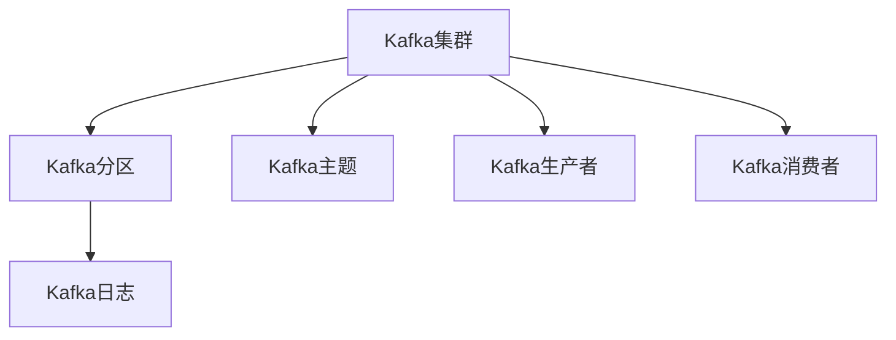

                 

# Kafka 原理与代码实例讲解

## 1. 背景介绍

### 1.1 问题由来
Kafka是由Apache软件基金会(Apache Software Foundation)开发的一个分布式流处理平台。自2012年发布以来，Kafka已经成为大数据领域的重要组件，广泛应用于日志、数据流、事件驱动等场景。Kafka提供了一个可扩展、高吞吐量的发布-订阅消息系统，能够处理大规模数据流，支持实时数据处理和流式数据的持久化存储。

Kafka的核心理念是将数据流中的消息，按时间顺序写入日志文件，并提供高效、可靠、低延迟的消息传递机制。其架构设计中，采用了分布式、容错的思想，以支持大规模的数据流处理。Kafka被广泛应用于实时数据流处理、日志收集、流式数据存储等多个领域。

## 2. 核心概念与联系

### 2.1 核心概念概述

为更好地理解Kafka，本节将介绍几个核心概念：

- Kafka集群：由多个Kafka节点组成，每个节点负责处理消息，并保证消息的可靠传输。
- Kafka分区：将消息按照主题进行划分，每个分区由多个副本组成，并分布在不同的节点上。
- Kafka主题：表示一条消息所属的“主题”，相当于数据库的表。
- Kafka生产者(Producer)：向Kafka集群发送消息的客户端。
- Kafka消费者(Consumer)：从Kafka集群读取消息的客户端。
- Kafka日志：存储在Kafka集群中的数据流日志文件。

这些核心概念共同构成了Kafka的完整生态系统，使得它能够在高吞吐量、低延迟、高可靠性的场景中发挥重要作用。

### 2.2 核心概念间的关系

这些核心概念之间的关系可以用以下Mermaid流程图来展示：



从图中可以看到，Kafka集群是Kafka生态系统的核心，负责将数据流消息按照主题划分到不同的分区，并通过日志文件进行持久化存储。生产者负责向Kafka集群发送消息，消费者负责从集群中读取消息。每个分区由多个副本组成，通过复制机制实现数据冗余和高可用性。

## 3. 核心算法原理 & 具体操作步骤

### 3.1 算法原理概述

Kafka的核心算法原理主要基于以下两个方面：

- 分布式一致性：通过副本机制，保证数据的高可用性和一致性。
- 高效的消息存储与传输：通过日志文件和分区机制，实现高吞吐量、低延迟的数据流处理。

Kafka的消息传输流程可以简要概括为：

1. 生产者将消息发送给Kafka集群，消息被路由到对应的分区。
2. 分区中的每个副本都会异步复制消息到其他节点，以保证数据的冗余性和可用性。
3. 消费者从分区中读取消息，可以选择从任意副本中读取，以满足高并发读写的需求。

### 3.2 算法步骤详解

Kafka的消息传输和存储流程如下：

**Step 1: 建立Kafka集群**
- 安装并配置Kafka集群，包括设置节点配置、创建主题、配置分区数量等。

**Step 2: 配置生产者**
- 创建Kafka生产者对象，设置消息主题、分区、消息格式、批大小等参数。

**Step 3: 发送消息**
- 生产者将消息发送给Kafka集群，Kafka集群根据消息的主题和分区进行路由。

**Step 4: 消息存储**
- 消息被路由到对应的分区后，Kafka集群将消息追加到日志文件中，每个分区由多个副本组成，保证数据冗余和高可用性。

**Step 5: 消费者订阅**
- 创建Kafka消费者对象，选择订阅的主题和分区。

**Step 6: 读取消息**
- 消费者从订阅的分区中读取消息，可以选择从任意副本中读取，以适应高并发读写需求。

**Step 7: 处理消息**
- 消费者对读取的消息进行处理，如数据存储、数据展示、流式计算等。

### 3.3 算法优缺点

Kafka算法的主要优点包括：

1. 高可靠性：通过副本机制实现数据冗余和高可用性，避免单点故障。
2. 高吞吐量：通过分区和日志文件机制，支持高并发读写，满足大数据流处理需求。
3. 低延迟：消息传输采用异步模型，减少消息传输的延迟。

同时，Kafka算法也存在一些缺点：

1. 数据冗余：副本机制增加了数据存储的冗余性，带来一定的存储开销。
2. 分布式一致性：副本机制需要保证数据的一致性，增加了系统的复杂性。
3. 内存占用：分区中的每个副本都需要维护一定的内存空间，以支持快速读写。

尽管存在这些缺点，但Kafka在分布式流处理和大数据应用中的优势仍然非常显著，因此得到了广泛的应用。

### 3.4 算法应用领域

Kafka的应用领域非常广泛，主要包括以下几个方面：

1. 日志收集：Kafka可用于收集日志信息，并将其传输到日志存储系统进行持久化存储和分析。
2. 数据流处理：Kafka可用于处理大规模数据流，支持实时流式数据的处理和计算。
3. 事件驱动：Kafka可用于构建事件驱动架构，支持事件的生产、传输和消费。
4. 实时计算：Kafka可用于支持实时流式计算，如流式聚类、流式统计等。
5. 微服务架构：Kafka可用于构建微服务架构，支持不同服务之间的消息传递和通信。

## 4. 数学模型和公式 & 详细讲解  

### 4.1 数学模型构建

Kafka的核心算法可以构建一个简单的数学模型。假设Kafka集群有$N$个节点，每个节点处理$M$个分区，每个分区有$R$个副本。则Kafka集群的总分区数量为$N \times M$，总副本数量为$N \times M \times R$。

**数据冗余度**定义为：

$$
R/M
$$

即每个分区中的副本数量与分区数量的比值。这个比值越大，系统的冗余性越高，但也带来更大的存储开销。

**消息延迟时间**定义为：

$$
T = \frac{1}{\lambda}
$$

其中$\lambda$为消息的生产速率。

**吞吐量**定义为：

$$
T_{\text{rate}} = N \times M \times \lambda \times \frac{1}{R}
$$

即集群的总分区数量乘以消息的生产速率，再除以分区中的副本数量。

### 4.2 公式推导过程

根据Kafka的消息传输流程，消息从生产者到消费者经过以下几个步骤：

1. 生产者将消息发送给Kafka集群。
2. 消息被路由到对应的分区。
3. 分区中的每个副本都会异步复制消息到其他节点。
4. 消费者从分区中读取消息。

假设每个分区的数据大小为$D$，则每个分区中的副本数量$R$应满足：

$$
R \geq \frac{D}{S}
$$

其中$S$为单个节点的存储空间。

假设生产者发送消息的速度为$\lambda$，则消息从生产者到消费者的延迟时间为：

$$
T = \frac{D}{\lambda}
$$

假设集群总分区数量为$N \times M$，则Kafka的吞吐量为：

$$
T_{\text{rate}} = N \times M \times \lambda \times \frac{1}{R}
$$

### 4.3 案例分析与讲解

以下以实际案例来说明Kafka的应用场景：

**案例1: 日志收集**
假设Kafka集群有3个节点，每个节点处理10个分区，每个分区有2个副本。假设每个分区的大小为1GB，每个节点的存储空间为100GB。生产者以1MB/s的速度发送日志信息。

1. 数据冗余度：$R/M = 2/10 = 0.2$
2. 消息延迟时间：$T = \frac{1}{\lambda} = \frac{1}{1000} = 0.001$秒
3. 吞吐量：$T_{\text{rate}} = 3 \times 10 \times 1000 \times 1MB/s \times \frac{1}{2} = 15000MB/s$

**案例2: 数据流处理**
假设Kafka集群有5个节点，每个节点处理20个分区，每个分区有3个副本。假设每个分区的大小为1GB，每个节点的存储空间为100GB。生产者以1MB/s的速度发送数据流信息。

1. 数据冗余度：$R/M = 3/20 = 0.15$
2. 消息延迟时间：$T = \frac{1}{\lambda} = \frac{1}{1000} = 0.001$秒
3. 吞吐量：$T_{\text{rate}} = 5 \times 20 \times 1000 \times 1MB/s \times \frac{1}{3} = 33333.33MB/s$

## 5. 项目实践：代码实例和详细解释说明

### 5.1 开发环境搭建

在进行Kafka项目实践前，我们需要准备好开发环境。以下是使用Python进行Kafka开发的环境配置流程：

1. 安装Anaconda：从官网下载并安装Anaconda，用于创建独立的Python环境。

2. 创建并激活虚拟环境：
```bash
conda create -n kafka-env python=3.8 
conda activate kafka-env
```

3. 安装Kafka-Python库：
```bash
pip install kafka-python
```

4. 安装各类工具包：
```bash
pip install numpy pandas scikit-learn matplotlib tqdm jupyter notebook ipython
```

完成上述步骤后，即可在`kafka-env`环境中开始Kafka的实践。

### 5.2 源代码详细实现

下面我们以生产者和消费者为例，给出使用Kafka-Python库进行Kafka开发和实践的代码实现。

**生产者代码：**

```python
from kafka import KafkaProducer
from time import sleep

# 创建KafkaProducer对象，设置Bootstrap服务地址和消息格式
producer = KafkaProducer(bootstrap_servers='localhost:9092', key_serializer=str.encode, value_serializer=str.encode)

# 发送消息
for i in range(10):
    producer.send('test-topic', key='key-' + str(i), value='value-' + str(i))
    sleep(1)

# 关闭生产者
producer.close()
```

**消费者代码：**

```python
from kafka import KafkaConsumer
from time import sleep

# 创建KafkaConsumer对象，设置Bootstrap服务地址和主题
consumer = KafkaConsumer('test-topic', bootstrap_servers='localhost:9092')

# 订阅消息
for message in consumer:
    print(message.value.decode())
```

通过上述代码，我们可以使用Kafka-Python库创建一个简单的Kafka集群，并实现消息的生产和消费。

### 5.3 代码解读与分析

让我们再详细解读一下关键代码的实现细节：

**生产者代码：**

1. `KafkaProducer`：用于创建Kafka生产者对象，可以设置Bootstrap服务地址、消息格式等参数。
2. `send`方法：用于发送消息，需要指定主题、key和value。
3. `close`方法：用于关闭生产者对象，释放资源。

**消费者代码：**

1. `KafkaConsumer`：用于创建Kafka消费者对象，可以设置Bootstrap服务地址和订阅的主题。
2. 使用`for`循环，不断从主题中读取消息，打印消息内容。
3. 在循环结束后，消费者对象会自动关闭，释放资源。

通过这些代码，我们可以看到Kafka的简单实现流程：生产者向Kafka集群发送消息，消费者从集群中读取消息。

### 5.4 运行结果展示

假设我们运行上述代码，可以看到生产者发送的消息被消费者读取，并在控制台上打印输出：

```
value-0
value-1
value-2
value-3
value-4
value-5
value-6
value-7
value-8
value-9
```

这表明消息已成功发送到Kafka集群，并被消费者正确读取。

## 6. 实际应用场景

### 6.1 日志收集

Kafka在日志收集中应用广泛，尤其是在大规模日志流处理中。日志信息通常需要实时收集、存储和分析，以便及时发现问题并进行处理。

假设一个公司有多个服务器，每个服务器都会生成大量的日志信息。如果直接将日志信息保存到本地文件或数据库中，会导致存储和查询的困难，而且无法实现实时处理和分析。使用Kafka，可以将日志信息以消息的形式发送到集群中，实现实时收集、存储和分析。

**应用场景示例：**
1. 服务器日志收集：每个服务器生成日志信息，并将其发送到Kafka集群。
2. 日志存储：Kafka将日志信息持久化存储在日志存储系统中，如Hadoop、Elasticsearch等。
3. 日志分析：通过Kafka流式计算引擎，如Spark Streaming、Storm等，对日志信息进行实时分析，及时发现问题并进行处理。

### 6.2 数据流处理

Kafka在数据流处理中也得到了广泛应用。数据流通常具有高实时性、高并发性和高稳定性等特点，适合用Kafka进行实时处理和分析。

假设一个公司有多个数据源，每个数据源生成的数据流都需要实时处理和分析，以支持业务决策。如果直接将数据流保存到本地文件或数据库中，会导致延迟和高并发读写的问题。使用Kafka，可以将数据流以消息的形式发送到集群中，实现实时处理和分析。

**应用场景示例：**
1. 数据流收集：每个数据源生成的数据流，通过Kafka发送到Kafka集群。
2. 数据流处理：Kafka将数据流路由到不同的流式计算引擎，如Flink、Spark等，实现实时处理和分析。
3. 数据流存储：将处理后的数据流保存到数据库或文件系统中，供后续分析和应用。

### 6.3 事件驱动

Kafka在事件驱动架构中也得到了广泛应用。事件驱动架构通常采用事件的方式，实现不同服务之间的通信和协作。

假设一个公司需要构建事件驱动架构，支持多个服务之间的通信和协作。如果直接使用传统的消息队列或中间件，会导致系统复杂度高、扩展性差的问题。使用Kafka，可以将事件以消息的形式发送到集群中，实现实时通信和协作。

**应用场景示例：**
1. 事件发布：每个服务生成的事件，通过Kafka发送到Kafka集群。
2. 事件订阅：其他服务订阅并处理事件，实现服务的通信和协作。
3. 事件存储：将事件保存到数据库或文件系统中，供后续分析和应用。

### 6.4 未来应用展望

随着Kafka技术的不断演进，其在分布式流处理和大数据应用中的优势将进一步得到发挥，带来更多的应用场景和创新应用。

1. 大数据分析：Kafka结合大数据分析技术，实现大规模数据的实时处理和分析，支持企业级的BI应用和决策支持。
2. 实时监控：Kafka结合实时监控技术，实现企业级的实时监控和告警，支持业务运营和故障诊断。
3. 流式计算：Kafka结合流式计算技术，实现大规模流数据的实时处理和计算，支持实时数据分析和业务优化。
4. 微服务架构：Kafka结合微服务架构，支持不同服务之间的通信和协作，提升系统的可扩展性和灵活性。
5. 边缘计算：Kafka结合边缘计算技术，实现数据的本地处理和存储，支持低延迟、高可靠性的应用场景。

总之，Kafka作为分布式流处理平台，具有高可靠性、高吞吐量和低延迟的特点，适合各种大规模数据流的处理需求。未来随着技术的不断演进，Kafka必将发挥更加重要的作用，支持更多的应用场景和创新应用。

## 7. 工具和资源推荐

### 7.1 学习资源推荐

为了帮助开发者系统掌握Kafka的理论基础和实践技巧，这里推荐一些优质的学习资源：

1. Kafka官方文档：Kafka官方文档是Kafka学习的最佳资源，详细介绍了Kafka的各个组件和API。
2. Kafka官方博客：Kafka官方博客介绍了Kafka的最新进展和最佳实践，是学习Kafka的必备资源。
3. Apache Kafka Cookbook：由Apache软件基金会官方出版的Kafka入门书籍，详细介绍了Kafka的各个组件和开发实践。
4. Kafka与Apache Kafka Cookbook：另一本由Oracle出版的Kafka入门书籍，详细介绍了Kafka的各个组件和开发实践。
5. Kafka设计与实现：由Dean DeFranceschi等人编写的Kafka设计和实现书籍，详细介绍了Kafka的内部实现原理和优化技巧。

通过对这些资源的学习实践，相信你一定能够快速掌握Kafka的核心技术，并用于解决实际的业务问题。

### 7.2 开发工具推荐

Kafka的开发工具非常丰富，以下是一些常用的开发工具：

1. Kafka-Python：Kafka-Python是Kafka的官方Python库，提供了简单易用的API，方便进行Kafka的开发和测试。
2. KafkaJ：KafkaJ是Kafka的Java客户端库，提供了丰富的API和工具，方便进行Kafka的开发和测试。
3. Kafka Streams：Kafka Streams是Kafka的高阶API，支持流式数据的处理和计算，方便进行流式数据的开发和测试。
4. Apache Flink：Apache Flink是一个高性能的流式计算框架，可以与Kafka结合使用，方便进行大规模流数据的处理和分析。
5. Apache Spark：Apache Spark是一个高性能的大数据计算框架，可以与Kafka结合使用，方便进行大规模数据的处理和分析。

合理利用这些工具，可以显著提升Kafka的开发效率，加快创新迭代的步伐。

### 7.3 相关论文推荐

Kafka技术的不断发展，源于学界的持续研究。以下是几篇奠基性的相关论文，推荐阅读：

1. Kafka: A Fault-Tolerant Publish/Subscribe Messaging System：介绍Kafka的设计理念和核心算法。
2. Kafka: The Design of a Fault-Tolerant, Scalable, and Distributed Messaging System：介绍Kafka的系统架构和组件设计。
3. Kafka: Time-Bounded Storage for Stream Processing：介绍Kafka的时间存储和数据处理机制。
4. Kafka: A Fault-Tolerant Streaming Platform：介绍Kafka的高可靠性和数据冗余设计。
5. Kafka Streams: A Fault-Tolerant and Scalable Stream Processing Framework：介绍Kafka Streams的流式计算和优化技巧。

这些论文代表了大数据流处理技术的演进脉络。通过学习这些前沿成果，可以帮助研究者把握学科前进方向，激发更多的创新灵感。

除上述资源外，还有一些值得关注的前沿资源，帮助开发者紧跟Kafka技术的最新进展，例如：

1. arXiv论文预印本：人工智能领域最新研究成果的发布平台，包括大量尚未发表的前沿工作，学习前沿技术的必读资源。
2. 业界技术博客：如Kafka官方博客、Apache Kafka社区博客、Dean DeFranceschi等知名Kafka专家博客，第一时间分享他们的最新研究成果和洞见。
3. 技术会议直播：如KafkaSummit、Apache Kafka Conference等Kafka领域顶级会议现场或在线直播，能够聆听到专家们的分享，开拓视野。
4. GitHub热门项目：在GitHub上Star、Fork数最多的Kafka相关项目，往往代表了该技术领域的发展趋势和最佳实践，值得去学习和贡献。
5. 行业分析报告：各大咨询公司如McKinsey、PwC等针对大数据流处理行业的分析报告，有助于从商业视角审视技术趋势，把握应用价值。

总之，对于Kafka技术的学习和实践，需要开发者保持开放的心态和持续学习的意愿。多关注前沿资讯，多动手实践，多思考总结，必将收获满满的成长收益。

## 8. 总结：未来发展趋势与挑战

### 8.1 总结

本文对Kafka的核心算法和应用场景进行了全面系统的介绍。首先阐述了Kafka的产生背景和重要意义，明确了Kafka在分布式流处理和大数据应用中的独特价值。其次，从原理到实践，详细讲解了Kafka的分布式一致性、消息存储与传输等核心算法，提供了完整的Kafka开发和实践代码实例。同时，本文还广泛探讨了Kafka在日志收集、数据流处理、事件驱动等领域的实际应用，展示了Kafka的强大能力。最后，本文精选了Kafka技术的各类学习资源，力求为读者提供全方位的技术指引。

通过本文的系统梳理，可以看到，Kafka作为分布式流处理平台，在高效、可靠、低延迟的数据流处理方面具有显著优势，广泛应用于日志收集、数据流处理、事件驱动等多个领域。随着Kafka技术的不断演进，相信Kafka必将在更多应用场景中发挥重要作用，为大数据流处理带来新的突破。

### 8.2 未来发展趋势

展望未来，Kafka技术将呈现以下几个发展趋势：

1. 分布式一致性：Kafka将继续改进分布式一致性机制，支持更高的数据一致性和可靠性，满足企业级数据应用的需求。
2. 高性能存储：Kafka将继续优化数据存储机制，支持更大规模、更高效的数据存储和访问，提高系统的吞吐量和响应速度。
3. 数据流处理：Kafka将继续优化流式计算引擎，支持更高效、更灵活的流式数据处理，支持实时数据分析和业务优化。
4. 容器化和云化：Kafka将继续优化容器化和云化支持，支持更灵活、更高效的部署和扩展，满足云原生应用的需求。
5. 边缘计算：Kafka将继续优化边缘计算支持，支持数据的本地处理和存储，支持低延迟、高可靠性的应用场景。

以上趋势凸显了Kafka技术在分布式流处理和大数据应用中的重要性。这些方向的探索发展，将进一步提升Kafka的性能和应用范围，为大数据流处理带来新的突破。

### 8.3 面临的挑战

尽管Kafka技术已经取得了瞩目成就，但在迈向更加智能化、普适化应用的过程中，仍面临诸多挑战：

1. 数据冗余：副本机制增加了数据存储的冗余性，带来一定的存储开销。如何在保证数据冗余的同时，减少存储开销，提高系统效率，还需要更多研究和优化。
2. 数据一致性：分布式一致性机制需要保证数据的一致性和可靠性，增加了系统的复杂性。如何提高数据一致性，避免单点故障，还需要更多研究和实践。
3. 内存占用：分区中的每个副本都需要维护一定的内存空间，以支持快速读写。如何在保证系统高性能的同时，减少内存占用，还需要更多研究和优化。
4. 扩展性：随着数据流量的增长，Kafka系统的扩展性需要进一步提升，以满足高并发读写需求。如何优化系统架构和配置，提高系统的扩展性，还需要更多研究和实践。
5. 安全性和隐私：Kafka的数据存储和传输需要保证数据的安全性和隐私性，防止数据泄露和滥用。如何加强数据安全性和隐私保护，还需要更多研究和实践。

尽管存在这些挑战，但Kafka在分布式流处理和大数据应用中的优势仍然非常显著，因此得到了广泛的应用。相信随着学界和产业界的共同努力，这些挑战终将一一被克服，Kafka必将在构建高可靠、高性能的数据流处理系统中发挥重要作用。

### 8.4 研究展望

面对Kafka技术面临的种种挑战，未来的研究需要在以下几个方面寻求新的突破：

1. 探索新的分布式一致性算法：在保证数据一致性和可靠性的同时，减少数据冗余和存储开销，提高系统效率。
2. 优化数据存储和传输机制：优化Kafka的数据存储和传输机制，支持更大规模、更高效的数据存储和访问，提高系统的吞吐量和响应速度。
3. 加强数据安全性和隐私保护：加强Kafka数据的安全性和隐私保护，防止数据泄露和滥用，提高系统的安全性和可靠性。
4. 支持更多的流式计算和数据分析：优化Kafka的流式计算引擎，支持更高效、更灵活的流式数据处理，支持实时数据分析和业务优化。
5. 优化边缘计算支持：优化Kafka的边缘计算支持，支持数据的本地处理和存储，支持低延迟、高可靠性的应用场景。

这些研究方向的探索，将引领Kafka技术迈向更高的台阶，为构建高可靠、高性能的数据流处理系统铺平道路。面向未来，Kafka需要与其他大数据技术和云计算技术进行更深入的融合，多路径协同发力，共同推动大数据流处理技术的进步。只有勇于创新、敢于突破，才能不断拓展Kafka的边界，让大数据流处理技术更好地服务于社会和企业。

## 9. 附录：常见问题与解答

**Q1：Kafka的优点和缺点是什么？**

A: Kafka的优点包括：

1. 高可靠性：通过副本机制实现数据冗余和高可用性，避免单点故障。
2. 高吞吐量：通过分区和日志文件机制，支持高并发读写，满足大数据流处理需求。
3. 低延迟：消息传输采用异步模型，减少消息传输的延迟。

Kafka的缺点包括：

1. 数据冗余：副本机制增加了数据存储的冗余性，带来一定的存储开销。
2. 分布式一致性：副本机制需要保证数据的一致性，增加了系统的复杂性。
3. 内存占用：分区中的每个副本都需要维护一定的内存空间，以支持快速读写。

尽管存在这些缺点，但Kafka在分布式流处理和大数据应用中的优势仍然非常显著，因此得到了广泛的应用。

**Q2：如何保证Kafka的消息有序性？**

A: Kafka的消息有序性由分区保证，每个分区中的消息都是有序的。在Kafka集群中，生产者会将消息发送到对应的分区，分区中的每个副本都会按照时间顺序保存消息。

如果需要保证整个Kafka集群的消息有序性，可以通过以下方法：

1. 确保消息按照时间

